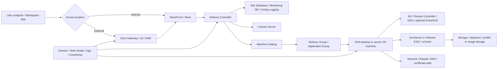

## Summary

Báo cáo này là bản technical deep ingest tổng hợp cho source Citrix Virtual Apps and Desktops 7 2603. Mục tiêu không phải là thay thế tài liệu vendor, mà là biến nội dung vendor thành tri thức huấn luyện có thể truy xuất lại trong Lumina Wiki khi tạo bộ tài liệu VDI cho system engineer.

Trọng tâm của báo cáo là các vùng tri thức quan trọng với vận hành CVAD quy mô lớn: kiến trúc site, Delivery Controller, Site Database, StoreFront, Citrix Gateway, VDA, Machine Catalog, Delivery Group, Application Group, HDX/ICA, policy, identity, machine identity, hypervisor connection, provisioning, image management, monitoring, troubleshooting, patch/upgrade, backup, HA/DR và RBAC. Báo cáo giữ rõ ranh giới giữa tri thức vendor-general và thông tin khách hàng chưa biết. Mọi thông tin như topology, hostname, IP, version production, Gateway design, SQL HA, profile solution, SLA, owner và escalation path đều là `Need Customer Confirmation`.

## Insight and Depth Control

| Trường | Giá trị |
|---|---|
| Depth target | Complete required insight and technical extraction sections |
| Character target | No fixed minimum |
| Actual estimated length | 69,940 characters measured after final edit |
| Required insight sections completed | Yes |
| Required technical sections completed | Yes |
| Depth Exception | Not applicable |

## Source Inventory

| Trường | Giá trị |
|---|---|
| Raw file | `raw/sources/citrix-virtual-apps-and-desktops™-7-2603.txt` |
| File size | 5,994,133 bytes |
| Estimated lines | 120,436 logical lines |
| Estimated characters | 5,925,551 characters |
| Source type | Vendor product documentation / administration guide / operations guide |
| Product/platform | Citrix Virtual Apps and Desktops 7 2603 |
| Version | 7 2603 family |
| Ingest mode | Technical deep ingest report, chapter map, coverage ledger, knowledge atoms and training conversion |

## Coverage Ledger

Source này là một vendor corpus lớn, không phải một chương sách tuyến tính. Vì vậy báo cáo chia theo major content zones trích từ mục lục và các heading quan trọng đã dò trong raw source.

| Chapter | Title | Locator / page from TOC | Approx. source signal | Extracted into | Status |
|---|---|---:|---|---|---|
| CH00 | Front matter, release, fixed issues, known issues, deprecation | Pages 1-63 | Product version, fixed/known issues, deprecation | This report and [[sources/citrix-virtual-apps-and-desktops-7-2603]] | Extracted |
| CH01 | System requirements and technical overview | Pages 64-99 | Requirements, architecture overview, databases, delivery methods, ports | This report | Extracted |
| CH02 | HDX and ICA virtual channels | Pages 100-122, plus HDX sections around source lines 9300+ | HDX principles, virtual channels, double hop, connectivity | This report | Extracted |
| CH03 | Install and configure, machine identities and authentication | Pages 123-230 | AD joined, Microsoft Entra hybrid joined, non-domain-joined, FAS, smart cards | This report | Extracted |
| CH04 | Core component install and VDA lifecycle | Pages 231-342 | Core components, command line install, Web Studio, VDA install, VDA precheck | This report | Extracted |
| CH05 | Site creation, connections and resources | Pages 343-506 | Connections to XenServer, VMware, Azure, cloud/hypervisor resources, service accounts | This report | Extracted |
| CH06 | Image management and Machine Catalogs | Pages 507-823 approx. | Prepared image, catalog creation, VMware/XenServer catalog, MCS concepts | This report | Extracted |
| CH07 | Delivery Groups, Application Groups, entitlement and policy | Later TOC sections and policy sections around TOC lines 1400+ | Delivery Group, app/desktop publishing, policy settings, security policy settings | This report | Extracted |
| CH08 | Monitoring, Director/Web Studio, troubleshooting and support | Monitoring/troubleshooting sections around TOC lines 1800+ | Search, tasks, machines, sessions, trends, user issues | This report | Extracted |
| CH09 | Upgrade, backup/restore, Automated Configuration, VDA Upgrade Service | TOC pages 1052+, 1917+, 2653+ | Upgrade/migrate, backup/restore configuration, AOT, upgrade logging | This report | Extracted |

## Technical Executive Summary

Citrix Virtual Apps and Desktops 7 2603 là một nền tảng delivery layer cho virtual desktops và published applications. Nguyên lý kỹ thuật cốt lõi của CVAD là broker và điều phối phiên giữa người dùng, StoreFront/Gateway, Delivery Controller, database, VDA, policy, identity và lớp hạ tầng bên dưới. Trong môi trường VDI 1500-2000+ máy, engineer không thể chỉ nhìn một thành phần đơn lẻ. User có thể báo "không thấy desktop", "launch fail", "session chậm", "printer không hoạt động", "clipboard bị chặn", hoặc "VDA unregistered"; mỗi triệu chứng có thể bắt nguồn từ entitlement, StoreFront, Gateway, Broker, VDA, AD group, policy, SQL database, hypervisor, storage, network hoặc license. Vendor documentation tiếp cận bằng cách đi từ requirement, technical overview, delivery methods, HDX, install/configure, identity, VDA, site connection, catalog, delivery, policy, monitoring, troubleshooting, backup và upgrade. Để dùng source này làm tài liệu đào tạo, cần chuyển từng vùng thành mô hình vận hành: thành phần nào kiểm tra, trạng thái nào là bình thường, evidence nào cần lưu, change nào có blast radius lớn, rollback ở đâu, và khi nào phải escalation.

## In-depth Technical Insights

### Insight 1 - Core Principle Analysis

| Mục | Nội dung |
|---|---|
| Diễn giải | CVAD vận hành dựa trên chuỗi brokered access. User không kết nối "thẳng" vào desktop theo nghĩa đơn giản. User đi qua Workspace App/browser, StoreFront hoặc Gateway, được broker bởi Delivery Controller, được map tới tài nguyên trong Delivery Group, rồi session chạy trên VDA. |
| Cơ sở lý thuyết | Không có công thức toán học; nền tảng là kiến trúc phân lớp, dependency chain và state machine. Mỗi request phải đi qua các trạng thái: authenticate, enumerate, authorize, broker, launch, connect, maintain session, monitor, reconnect/logoff. Nếu một trạng thái fail, triệu chứng user có thể giống nhau nhưng nguyên nhân khác nhau. |
| Ví dụ minh họa | User login được nhưng không thấy desktop thường không phải lỗi VDA trước tiên; cần kiểm tra entitlement, AD group, Delivery Group, StoreFront enumeration và Controller. User thấy desktop nhưng launch fail mới đi sâu vào broker, VDA registration, ICA path, Gateway/STA và network tới VDA. |
| Ý nghĩa với VDI | Với 1500-2000+ VDI, lỗi một Delivery Group, một Machine Catalog, một Gateway VIP hoặc một Controller/database dependency có thể ảnh hưởng hàng trăm user. Engineer phải biết map symptom sang layer trước khi xử lý. |

### Insight 2 - Pedagogical Approach Analysis

| Mục | Nội dung |
|---|---|
| Cấu trúc logic | Vendor documentation đi từ requirement và overview sang cài đặt, cấu hình, identity, delivery, policy, monitoring và troubleshooting. Đây là logic phù hợp cho triển khai, nhưng khi đào tạo vận hành cần đảo một phần: bắt đầu từ user symptom, sau đó map ngược về architecture. |
| Điểm mạnh | Source có mục lục rất rộng, tách rõ HDX, ICA virtual channels, Machine Catalog, Delivery Group, VDA install/upgrade, policy settings, monitoring, troubleshooting, backup/restore và upgrade. Điều này giúp tạo topic training theo từng lớp vận hành. |
| Điểm có thể gây khó hiểu | Người mới dễ nhầm Machine Catalog với Delivery Group, Delivery Controller với StoreFront, Gateway với StoreFront, VDA registration với machine power state, policy Citrix với Group Policy, và HDX với toàn bộ đường truyền network. |
| Cách giải thích thay thế | Dạy bằng mô hình "5 câu hỏi": user có đăng nhập được không, có thấy resource không, resource có broker được không, VDA có nhận session không, session có trải nghiệm tốt không. Sau đó nối mỗi câu hỏi với component/evidence. |

### Insight 3 - Practical Application and Industry Relevance

| Mục | Nội dung |
|---|---|
| Case Study 1 | Sau một image update, hàng trăm VDA trong một catalog không đăng ký với Controller. Engineer cần kiểm tra VDA service, Controller list, DNS, firewall, machine identity, event log và change record, không chỉ reboot hàng loạt. |
| Case Study 2 | External users launch fail nhưng internal users bình thường. Phân tích đúng phải tập trung Gateway, certificate, STA, StoreFront callback, firewall path và route tới VDA thay vì xử lý Delivery Group trước. |
| Công cụ / phần mềm liên quan | Citrix Studio hoặc Web Studio, Citrix Director, StoreFront console/log, Citrix Gateway/NetScaler, Windows Event Viewer trên Controller/VDA/StoreFront, SQL monitoring, hypervisor console, SIEM/NOC monitoring. |
| Tầm quan trọng với engineer | CVAD là lớp giao giữa user experience và hạ tầng. Engineer biết CVAD sẽ giảm thời gian khoanh vùng lỗi, thu thập đúng evidence và escalation đúng team. |

## Role in the Learning Pathway

| Hướng kết nối | Nội dung |
|---|---|
| Kết nối ngược | Cần nền tảng VDI, desktop ảo, published application, session, Active Directory, DNS, certificate, hypervisor, storage, network và monitoring. |
| Kết nối xuôi | Source này là nền cho các topic: CVAD Architecture, Access Flow, Identity, Provisioning, Machine Catalog, Delivery Group, Security/Policy, Monitoring, Troubleshooting, Change, Patch, Backup, HA/DR và RBAC. |
| Prerequisites | Engineer nên hiểu mô hình client-server, authentication, AD group, Windows service, VM power state, IP/DNS/firewall/certificate cơ bản. |
| Learning outcome | Sau khi học, engineer phải đọc được lỗi CVAD theo layer, biết kiểm tra Controller/StoreFront/Gateway/VDA/catalog/group/policy, biết lưu evidence và biết khi nào escalation. |

## Points of Caution and Potential Misconceptions

| Misconception / Caution | Vì sao dễ sai | Cách hiểu đúng | Mẹo học / vận hành |
|---|---|---|---|
| "User không thấy desktop là do VDA lỗi" | Người mới hay đi thẳng tới machine/session | Không thấy resource thường nằm ở entitlement, Delivery Group, AD group, StoreFront enumeration hoặc Controller | Tách enumeration fail khỏi launch fail trước khi kiểm tra VDA |
| "Machine Catalog và Delivery Group giống nhau" | Cả hai đều chứa machine và xuất hiện trong thao tác provisioning | Catalog là nguồn machine/provisioning; Delivery Group là lớp publish/entitlement/session access | Học bằng câu: catalog tạo máy, delivery group cấp quyền dùng máy/app |
| "Gateway lỗi thì internal cũng lỗi" | Gateway là thành phần nổi bật trong external access | Gateway chủ yếu ảnh hưởng luồng external; internal có thể đi StoreFront trực tiếp tùy thiết kế | Luôn hỏi user ở trong mạng nội bộ hay bên ngoài |
| "HDX issue nghĩa là network issue" | User experience thường biểu hiện giống network lag | HDX chịu ảnh hưởng bởi policy, client, graphics, audio, printer, USB, bandwidth, latency và VDA resource | Thu evidence từ Director/session metrics trước khi kết luận |
| "VDA registered nghĩa là desktop chắc chắn dùng được" | Registered là state quan trọng nhưng chưa đủ | Còn cần assignment, maintenance mode, capacity, policy, profile, app dependency và network path | Kiểm tra cả availability và session launch path |
| "Policy thay đổi nhỏ không cần change" | Một setting clipboard/USB/printer có vẻ đơn giản | Policy có thể ảnh hưởng bảo mật dữ liệu, trải nghiệm và compliance trên nhiều user | Mọi policy diện rộng phải có scope, pilot, rollback |
| "SQL database chỉ là backend, ít liên quan support" | User không nhìn thấy database | Site Database là dependency của broker/configuration; Monitoring DB ảnh hưởng historical data | Khi lỗi diện rộng Controller/broker, luôn kiểm tra database connectivity/event |
| "Backup config là đủ cho DR" | Backup tạo cảm giác an toàn | DR phải validate login, enumerate, launch, reconnect, profile, policy và app access | Recovery test phải có user journey, không chỉ restore service |

## Key Terminology and Formulas

Không có công thức toán học quan trọng trong source này; tri thức chính là thuật ngữ kiến trúc, object model, workflow và state.

| Thuật ngữ | Định nghĩa / Diễn giải ngắn gọn | Bối cảnh sử dụng |
|---|---|---|
| Citrix Virtual Apps and Desktops | Nền tảng delivery desktop/application ảo hoặc published application | Toàn bộ CVAD site |
| Site | Đơn vị quản trị CVAD gồm Controller, database, catalog, delivery group, policy và cấu hình liên quan | Thiết kế, backup, HA, change |
| Delivery Controller | Broker/control plane điều phối request, registration, resource và session | Launch fail, enumeration, site health |
| Site Database | Database chứa cấu hình site và state cần thiết cho broker | HA, backup, Controller issue |
| Monitoring Database | Nơi lưu dữ liệu giám sát/historical trend tùy thiết kế | Director, RCA, trend |
| Configuration Logging | Ghi nhận thay đổi cấu hình để audit | Change, RBAC, compliance |
| StoreFront | Portal/store cho user authenticate và enumerate resource | Login, resource enumeration |
| Citrix Gateway | Gateway external access, thường nằm DMZ hoặc reverse proxy layer | External access, certificate, STA |
| STA | Secure Ticket Authority, tạo ticket giúp Gateway broker launch session | External launch fail |
| VDA | Virtual Delivery Agent trên desktop/server OS machine, nơi session chạy và đăng ký với Controller | Registration, launch, session issue |
| Machine Catalog | Nhóm machine cùng kiểu provisioning/OS/image/identity | Provisioning, capacity, image rollout |
| Delivery Group | Nhóm machine/application được publish cho user/group | Entitlement, app/desktop visibility |
| Application Group | Nhóm application dùng để quản lý và publish app theo logic | Published app operations |
| Entitlement | Quyền user/group được thấy và dùng resource | User không thấy desktop/app |
| HDX | Công nghệ tối ưu trải nghiệm session Citrix | Performance, graphics, audio, Teams, printing |
| ICA | Protocol/session stack của Citrix, gồm nhiều virtual channel | Session connectivity and features |
| ICA virtual channel | Kênh logic cho clipboard, printer, audio, USB, drive, Teams, graphics... | Policy và troubleshooting tính năng phiên |
| Session Reliability | Cơ chế giữ session khi kết nối tạm thời gián đoạn | Disconnect/reconnect issue |
| Machine Identity | Cách machine tham gia domain/Entra/non-domain và có danh tính để quản lý | VDA registration, policy, provisioning |
| FAS | Federated Authentication Service, liên quan SSO/certificate-based auth | Identity, smart card, SSO |
| MCS | Machine Creation Services, cơ chế provisioning machine từ image | Catalog/image/provisioning |
| Prepared Image | Image chuẩn để tạo catalog, phụ thuộc hypervisor/platform | Image lifecycle |
| Citrix Policy | Policy điều khiển session, security, bandwidth, redirection, printing | Security and user experience |
| Director / Monitor | Công cụ theo dõi session, machine, user issue, trend | Monitoring, helpdesk support |
| VDA Upgrade Service | Cơ chế hỗ trợ upgrade VDA | Patch and upgrade |
| Automated Configuration Tool | Công cụ backup/restore/migrate configuration | Backup, migration |

## Architecture Model for CVAD in VDI

Trong mô hình này, CVAD không chỉ là Delivery Controller. Một request thành công cần toàn bộ chuỗi đúng: endpoint, authentication, StoreFront/Gateway, Controller, database, entitlement, VDA registration, machine availability, ICA/HDX path, policy và hạ tầng VM. Điều này đặc biệt quan trọng với khách hàng có 1500-2000+ VDI, vì một lỗi nhỏ ở policy, database, Gateway hoặc image có thể nhân rộng thành incident diện rộng.

## Chapter-by-Chapter Deep Extraction

### CH00 - Release, Fixed Issues, Known Issues and Deprecation

**Technical Executive Summary:** Vùng release/fixed/known/deprecation không phải nội dung vận hành hằng ngày, nhưng là nguồn đầu tiên khi xử lý lỗi sau patch, upgrade hoặc khi thấy hành vi lạ giữa các phiên bản. Với CVAD, compatibility giữa Controller, VDA, StoreFront, Gateway, Workspace App, OS, hypervisor và policy có thể quyết định thành công của rollout. Trong đào tạo, phần này dạy engineer không kết luận lỗi chỉ từ symptom; phải gắn symptom với version/build và known issue.

**Operational insight:** Khi có incident sau nâng cấp, engineer cần lưu build number của Controller, VDA, StoreFront/Gateway, Workspace App nếu có, OS build, hypervisor plugin/connection và thời điểm change. Evidence này giúp phân biệt lỗi cấu hình, regression, known issue hoặc unsupported combination.

**Failure modes:** Launch fail sau upgrade, VDA registration biến động, policy không áp dụng như trước, HDX feature đổi hành vi, Teams/printer/USB lỗi sau VDA update, hoặc external launch lỗi sau Gateway/StoreFront/certificate change.

**Training conversion:** Dùng phần này để dạy `version-aware troubleshooting`: hỏi "lỗi bắt đầu từ khi nào", "change nào xảy ra", "component nào được nâng cấp", "known issue nào khớp symptom", "rollback point là gì".

### CH01 - System Requirements and Technical Overview

**Technical Executive Summary:** Technical overview đặt nền cho việc hiểu CVAD như một site nhiều thành phần. System requirements giúp engineer biết các giới hạn và dependency tối thiểu trước khi vận hành hoặc thay đổi. Databases, delivery methods và network ports là ba trục vận hành: database quyết định broker/config state, delivery method quyết định cách user nhận tài nguyên, network ports quyết định các luồng có thông hay không.

**Architecture knowledge:** Delivery Controller cần database; StoreFront/Gateway cần nói chuyện với Controller và các thành phần liên quan; VDA cần đăng ký với Controller; user session cần network path tới VDA hoặc thông qua Gateway tùy access mode. License Server là dependency cho khả năng cung cấp phiên. DNS, time sync, certificate và AD group là nền bắt buộc nhưng thường bị xem nhẹ.

**Operational knowledge:** Daily check nên gồm Controller service health, database connectivity, license status, StoreFront login/enumeration, Gateway external access nếu có, VDA registered count, active/failed sessions và critical event logs. Với môi trường lớn, cần trend theo catalog/delivery group, không chỉ tổng số site.

### CH02 - HDX and ICA Virtual Channels

**Technical Executive Summary:** HDX là lớp trải nghiệm phiên, còn ICA virtual channels là các kênh chức năng bên trong session như clipboard, printing, audio, USB, drive redirection, graphics và app optimization. Source mô tả HDX như một tập cơ chế tối ưu, thích nghi với endpoint, network, server compute và policy. Trong VDI operations, HDX giúp phân biệt "desktop đã launch" với "desktop dùng được tốt".

**Core principle:** Session performance là kết quả của nhiều yếu tố: latency, packet loss, bandwidth, graphics policy, endpoint capability, VDA resource, printer/USB redirection, audio/video optimization và policy filtering. Không có một metric đơn lẻ đủ để kết luận.

**Troubleshooting insight:** Nếu user báo lag, black screen, audio không hoạt động, Teams kém, printer chậm hoặc clipboard bị chặn, engineer phải kiểm tra Director/session metrics, policy result, VDA event, client version, network quality và feature-specific settings. Không được mặc định là "network chậm" hoặc "VDA lỗi".

### CH03 - Install and Configure, Machine Identities and Authentication

**Technical Executive Summary:** Machine identity và authentication quyết định máy VDA có thuộc đúng identity boundary hay không và user có vào đúng access path hay không. Source có các vùng AD joined, Microsoft Entra hybrid joined, non-domain-joined, session authentication, Entra SSO preview, Federated Authentication Service và smart cards. Trong môi trường khách hàng, chỉ được xem các option này là khả năng vendor hỗ trợ; thiết kế thật cần xác nhận.

**Operational insight:** VDA registration và policy thường phụ thuộc AD/DNS/time sync/domain trust. Nếu dùng hybrid Entra hoặc FAS, failure path có thêm certificate, federation, identity provider và trust chain. Engineer mới cần học cách tách authentication fail, authorization fail và VDA registration fail.

**Common misconception:** "Đăng nhập portal thành công nghĩa là identity ổn." Không đúng. User có thể authenticate vào StoreFront/Gateway nhưng không có entitlement, hoặc session authentication tới VDA/backend fail do policy, FAS, domain trust hoặc ticket issue.

### CH04 - Core Components and VDA Lifecycle

**Technical Executive Summary:** Core component install và VDA lifecycle là vùng có rủi ro change rất cao. Controller, StoreFront, Web Studio, VDA install, VDA precheck, VDA upgrade và deployment methods đều ảnh hưởng trực tiếp tới khả năng broker session. Trong VDI lớn, lỗi VDA image có thể nhân rộng thành hàng nghìn máy lỗi registration hoặc session.

**Operational insight:** VDA install/upgrade phải đi qua pilot. Precheck cần OS support, reboot pending, Windows services, security tooling, network path tới Controller, DNS, time sync, machine identity, installer logs và rollback image. Không rollout VDA mới trực tiếp lên toàn catalog.

**Failure modes:** VDA install fail, VDA upgrade partial, VDA service không start, Controller list sai, machine cần reboot, antivirus/security tool chặn component, VDA registered nhưng session launch lỗi do version mismatch hoặc policy mới.

### CH05 - Site Creation, Connections and Resources

**Technical Executive Summary:** Connections and resources là nơi CVAD liên kết tới hypervisor/cloud platform như XenServer, VMware, Azure, Nutanix và các nền tảng khác. Với bối cảnh khách hàng, trọng tâm là XenServer hoặc VMware ESXi/vCenter. Connection này cho phép CVAD power manage, provision và quản lý machine. Nếu connection hoặc service account lỗi, provisioning và power operations sẽ fail.

**Operational insight:** Engineer cần kiểm tra connection state, hypervisor credentials/service account scope, certificate/trust với vCenter/XenServer nếu có, hosting resource, storage/network mapping và task error. Lỗi ở connection thường biểu hiện như catalog creation fail, machine power operation fail, MCS task fail hoặc machine không available.

**Need Customer Confirmation:** Khách hàng dùng XenServer hay VMware ESXi cho CVAD? Có bao nhiêu hosting connection? Service account được cấp quyền gì? Storage/network mapping nào dùng cho catalog? Ai sở hữu hypervisor task failure?

### CH06 - Image Management and Machine Catalogs

**Technical Executive Summary:** Machine Catalog là lớp tạo và quản lý tập machine. Prepared image và catalog creation quyết định OS, VDA, application, security agent, hypervisor placement, storage và machine identity. Trong CVAD, catalog không đồng nghĩa với entitlement; nó cung cấp nguồn machine để Delivery Group publish cho user.

**Operational insight:** Khi catalog hết máy available, user không launch được dù entitlement đúng. Khi image lỗi, toàn bộ catalog có thể bị ảnh hưởng. Khi machine identity sai, VDA có thể không register hoặc policy không apply. Khi storage/network mapping sai, VM có thể tạo được nhưng không dùng được.

**Change insight:** Image publish, catalog update, machine add/remove, identity change và provisioning scheme change phải có precheck, pilot, rollback image/snapshot và postcheck login/launch. Với 1500-2000+ máy, blast radius là catalog hoặc nhiều Delivery Group.

### CH07 - Delivery Groups, Application Groups, Entitlement and Policy

**Technical Executive Summary:** Delivery Group là nơi tài nguyên được cấp cho user/group, còn policy điều khiển hành vi session. Đây là vùng user-visible nhất: user có thấy desktop/app không, app có launch không, clipboard/USB/printer có được phép không, session timeout/reconnect ra sao. Application Group giúp quản lý published applications theo nhóm logic.

**Operational insight:** Khi user không thấy resource, kiểm tra Delivery Group, Application Group, entitlement, AD group membership, user filter và StoreFront enumeration. Khi session feature sai, kiểm tra Citrix Policy, policy priority, filters, GPO overlap, machine/user scope và evidence từ session.

**Risk:** Policy/security changes có thể được xem là "nhỏ" nhưng ảnh hưởng compliance và trải nghiệm diện rộng. Clipboard, USB, file redirection, printing, session limits, bandwidth, graphics và monitoring policy đều cần change control.

### CH08 - Monitoring, Director/Web Studio, Troubleshooting and Support

**Technical Executive Summary:** Monitoring là evidence plane của CVAD. Director/Web Studio/Search/Task Center/historical trends giúp engineer xem machine, session, user issue, failed session, logon duration, VDA state và task. Troubleshooting tốt không bắt đầu bằng thao tác sửa, mà bắt đầu bằng phạm vi, timeline, affected objects và evidence.

**Operational insight:** Mỗi incident cần xác định: một user hay nhiều user, một VDA hay một catalog, internal hay external, một Delivery Group hay toàn site, có change gần đây không, lỗi ở enumerate/launch/session/performance/policy. Evidence phải cùng timestamp giữa user report, Director, Controller, StoreFront, Gateway, VDA, database, hypervisor và network.

**Support insight:** Helpdesk có thể xử lý disconnect/logoff basic, reset session theo quyền, thu screenshot và user context. Platform admin xử lý catalog/group/policy/controller/site change. Network/storage/identity/security teams cần evidence gói đúng lớp.

### CH09 - Upgrade, Backup/Restore and Automated Configuration

**Technical Executive Summary:** Upgrade/migrate, backup/restore configuration, Automated Configuration Tool và VDA Upgrade Service là vùng change và recovery. Source chỉ ra rằng CVAD có nhiều đối tượng cấu hình cần bảo vệ: site configuration, policy, catalog, delivery group, StoreFront/Gateway dependency, VDA lifecycle và logs. Backup không có ý nghĩa nếu không có restore validation theo user journey.

**Operational insight:** Trước upgrade cần compatibility matrix, current version inventory, database backup, config export, service health baseline, pilot group, rollback point và maintenance window. Sau upgrade cần validate login, enumerate, launch, reconnect, policy, printing/clipboard/USB nếu liên quan, monitoring và support handover.

**DR insight:** Controller HA không đủ nếu SQL, StoreFront, Gateway, DNS, certificate, identity, license, hypervisor, storage và profile không sẵn sàng. DR drill phải test end-to-end.

## Knowledge Atoms

| ID | Knowledge atom | Loại tri thức | Vì sao quan trọng trong VDI | Source locator | Dùng cho topic |
|---|---|---|---|---|---|
| CVAD-KA-001 | CVAD là hệ thống brokered access gồm endpoint, StoreFront/Gateway, Controller, database, VDA và policy. | Architecture | Giúp map user symptom sang đúng layer. | Technical overview / TOC page 76 | [[topics/4_Citrix_CVAD_Architecture_Overview]] |
| CVAD-KA-002 | Delivery Controller là control plane cho resource enumeration, brokering, VDA registration và session control. | Architecture | Controller issue có thể gây launch/enumeration fail diện rộng. | Technical overview | [[topics/4_Citrix_CVAD_Architecture_Overview]] |
| CVAD-KA-003 | Site Database là dependency nền tảng của Broker/configuration state. | Architecture | Database outage có thể làm site mất khả năng broker/configure. | Databases / TOC page 87 | [[topics/23_VDI_High_Availability_and_Disaster_Recovery_Guide]] |
| CVAD-KA-004 | StoreFront quản lý store và resource enumeration cho user. | Operation | Không thấy app/desktop thường bắt đầu từ StoreFront/entitlement. | Technical overview / StoreFront references | [[topics/5_VDI_Access_Flow_Design]] |
| CVAD-KA-005 | Citrix Gateway là lớp external access và thường là điểm phân biệt internal-only với external-only issue. | Architecture | External launch fail cần kiểm tra Gateway/STA/cert/firewall. | Citrix Gateway references | [[topics/5_VDI_Access_Flow_Design]] |
| CVAD-KA-006 | VDA phải đăng ký với Controller trước khi machine sẵn sàng nhận session. | Operation | VDA unregistered là nguyên nhân phổ biến của launch fail. | Install VDAs / Troubleshoot VDAs | [[topics/18_VDI_Troubleshooting_Playbook]] |
| CVAD-KA-007 | Machine Catalog là lớp machine/provisioning, không phải lớp entitlement chính. | Concept | Tránh nhầm catalog với delivery group. | Machine catalogs / TOC page 589 | [[topics/13_Citrix_Machine_Catalog_and_Delivery_Group_Guide]] |
| CVAD-KA-008 | Delivery Group publish desktop/application cho user hoặc group. | Operation | User không thấy resource thường nằm ở group assignment. | Delivery Group sections | [[topics/13_Citrix_Machine_Catalog_and_Delivery_Group_Guide]] |
| CVAD-KA-009 | Application Group giúp gom và quản lý published application theo logic vận hành. | Operation | Hỗ trợ phân quyền và kiểm tra app visibility. | Application Group sections | [[topics/13_Citrix_Machine_Catalog_and_Delivery_Group_Guide]] |
| CVAD-KA-010 | HDX là lớp tối ưu trải nghiệm, không đồng nghĩa với toàn bộ network. | Performance | Session lag phải kiểm tra policy/client/VDA/network cùng lúc. | HDX / TOC page 100 | [[topics/19_VDI_Performance_and_Capacity_Guide]] |
| CVAD-KA-011 | ICA virtual channels điều khiển các tính năng như clipboard, printer, USB, audio và drive redirection. | Security/Policy | Lỗi tính năng session thường nằm ở virtual channel/policy. | ICA virtual channels / TOC page 110 | [[topics/10_VDI_Security_and_Policy_Management_Guide]] |
| CVAD-KA-012 | Citrix Policy có priority/filter và có thể overlap với GPO/security control. | Security/Policy | Sai policy ảnh hưởng hàng loạt user. | Policy settings / TOC policy sections | [[topics/10_VDI_Security_and_Policy_Management_Guide]] |
| CVAD-KA-013 | Machine identity có thể AD joined, hybrid Entra joined hoặc non-domain-joined tùy thiết kế. | Identity | VDA registration/policy/auth phụ thuộc identity mode. | Machine identities / TOC pages 125-135 | [[topics/6_Identity_and_Domain_Integration_Guide]] |
| CVAD-KA-014 | FAS/smart card/SSO làm authentication path phức tạp hơn. | Identity | Cần evidence certificate/trust khi auth fail. | FAS / TOC page 151 | [[topics/6_Identity_and_Domain_Integration_Guide]] |
| CVAD-KA-015 | Hypervisor connection cho phép CVAD power manage/provision machine. | Architecture | Connection lỗi gây catalog/power/provisioning fail. | Connections and resources / TOC page 347 | [[topics/7_Hypervisor_and_HCI_Operations_Guide]] |
| CVAD-KA-016 | CVAD source có phần connection riêng cho VMware và XenServer. | Integration | Khớp với bối cảnh khách hàng có XenServer hoặc ESXi. | VMware/XenServer connection TOC | [[topics/7_Hypervisor_and_HCI_Operations_Guide]] |
| CVAD-KA-017 | Prepared image machine catalog là nguồn rủi ro lớn khi image lỗi. | Change | Image lỗi có thể ảnh hưởng cả catalog. | Image management / TOC page 507 | [[topics/12_Master_Image_Management_Guide]] |
| CVAD-KA-018 | VDA install/upgrade cần precheck và pilot. | Change | Rollout sai gây mass unregistered VDA. | Precheck for VDA install and upgrade / TOC page 294 | [[topics/21_VDI_Patch_and_Upgrade_Guide]] |
| CVAD-KA-019 | Director/Monitor cung cấp evidence về user, session, machine và trends. | Monitoring | Cần evidence trước escalation. | Monitor sections / TOC page 2218+ | [[topics/15_VDI_Monitoring_and_Alerting_Guide]] |
| CVAD-KA-020 | Task Center giúp theo dõi task quản trị/provisioning. | Operation | Task fail giúp khoanh vùng catalog/hypervisor change. | Task Center / TOC page 2284 | [[topics/16_Daily_Operations_Checklist]] |
| CVAD-KA-021 | Failed session và logon duration là chỉ số quan trọng của user experience. | Monitoring | Giúp phát hiện issue trước khi thành outage lớn. | Monitor / Director sections | [[topics/15_VDI_Monitoring_and_Alerting_Guide]] |
| CVAD-KA-022 | Troubleshoot user issues phải tách login, enumeration, launch, session và feature issues. | Troubleshooting | Tránh xử lý sai lớp. | Troubleshooting sections | [[topics/18_VDI_Troubleshooting_Playbook]] |
| CVAD-KA-023 | Backup/restore configuration là một phần của operational resilience. | Backup | Restore cần validate user journey. | Backup and Restore / TOC page 1919 | [[topics/22_VDI_Backup_and_Recovery_Guide]] |
| CVAD-KA-024 | Upgrade deployment cần inventory, compatibility, backup, pilot và rollback. | Patch | CVAD nhiều component nên version mismatch rất rủi ro. | Upgrade deployment / TOC page 1057 | [[topics/21_VDI_Patch_and_Upgrade_Guide]] |
| CVAD-KA-025 | Security policies và groups ảnh hưởng dữ liệu, redirection và quyền vận hành. | Security | Cần least privilege và approval. | Security policies / TOC page 915 | [[topics/24_VDI_Access_Control_and_RBAC_Guide]] |
| CVAD-KA-026 | License Server/status là dependency launch session. | Operation | License issue có thể giống broker/session issue. | Technical overview / operations | [[topics/15_VDI_Monitoring_and_Alerting_Guide]] |
| CVAD-KA-027 | External-only failure là pattern quan trọng để khoanh vùng Gateway/LB/DMZ. | Troubleshooting | Giảm thời gian xử lý nhầm Controller/VDA. | Gateway/access flow references | [[topics/25_VDI_Support_and_Escalation_Guide]] |
| CVAD-KA-028 | VDA event log và Controller event log phải được lấy cùng timestamp. | Evidence | Evidence lệch thời gian làm RCA sai. | Troubleshooting sections | [[topics/25_VDI_Support_and_Escalation_Guide]] |
| CVAD-KA-029 | Policy result phải được kiểm tra theo user và machine scope. | Operation | Policy filter có thể làm chỉ một nhóm user lỗi. | Policy settings | [[topics/10_VDI_Security_and_Policy_Management_Guide]] |
| CVAD-KA-030 | DR readiness cần Controller, SQL, StoreFront, Gateway, identity, license, hypervisor và profile cùng sẵn sàng. | HA/DR | Một thành phần sống không đảm bảo service usable. | Backup/HA related sections | [[topics/23_VDI_High_Availability_and_Disaster_Recovery_Guide]] |

## Component Deep Dive

| Thành phần | Vai trò | Phụ thuộc vào | State cần quan sát | Rủi ro khi lỗi | Evidence cần lưu |
|---|---|---|---|---|---|
| Citrix Workspace App / Browser | Endpoint user dùng để vào resource | DNS, certificate, network, client version | Login result, launch behavior, client error | User-specific launch/performance issue | Screenshot lỗi, client version, network location |
| StoreFront | Authenticate/enumerate resource | Controller, AD/IdP, certificate, Gateway integration | Store service, event log, resource enumeration | User không thấy app/desktop, login fail | StoreFront event, store URL, user/group |
| Citrix Gateway | External access, secure tunnel/proxy | Certificate, STA, StoreFront, LB, firewall, DNS | VIP health, STA status, session policy, cert chain | External-only outage, launch fail | Gateway logs, cert expiry, STA mapping, source IP |
| Delivery Controller | Broker/control plane | Site DB, license, AD/DNS, VDA communication | Broker service, DB connectivity, registration count | Launch fail, enumeration issue, mass VDA unregister | Controller event log, service state, DB error |
| Site Database | Configuration and broker dependency | SQL HA, network, permissions, backup | Connectivity, latency, failover state | Site unable to broker/configure reliably | SQL alerts, Controller DB errors, failover events |
| Monitoring DB | Historical session/machine data | SQL, Director/Monitor service | Data freshness, retention | RCA/trend mất dữ liệu | Director trend gaps, DB status |
| License Server | License validation | Network, service health, license file | License available, expiry, usage | Session launch/warning issue | License server status, warning event |
| VDA | Runs desktop/app session, registers with Controller | OS, services, DNS, Controller path, identity, policy | Registered, available, session state | Launch fail, disconnect, session feature issue | VDA event log, registration state, service status |
| Machine Catalog | Source pool of machines | Image, hypervisor connection, identity, storage/network mapping | Machine count, power state, provisioning state | Không đủ máy, provisioning fail | Catalog state, task errors, affected machine list |
| Delivery Group | Publishes resources to users | Catalog, AD group, application assignment, policy | Enabled, assignment, available machines | User không thấy hoặc không launch resource | Assignment screenshot/export, user group membership |
| Application Group | Groups published apps | Delivery Group, app path, user assignment | App visible/launchable | Published app invisible or launch fail | App group config, app launch error |
| Citrix Policy | Controls session/security/user experience | Policy engine, filters, GPO overlap | Resultant policy, priority, filters | Clipboard/USB/printer/session timeout sai | Policy export, resultant policy evidence |
| HDX/ICA | Session protocol and experience | VDA, client, policy, network, Gateway | Latency, bandwidth, virtual channels | Lag, black screen, audio/printer/USB issue | Director metrics, channel status, policy |
| Hypervisor connection | Power/provision VM | vCenter/XenServer, service account, certificate | Connection state, task success | Catalog creation or power task fail | Hosting connection status, task error |
| Profile solution | User profile data/session personalization | File server/profile platform/network/storage | Profile load time, lock/corruption | Slow logon, temp profile, missing settings | Profile logs, share latency, affected user |

## Operational Workflow

### Luồng người dùng nội bộ

1. User mở Citrix Workspace App hoặc browser.
2. Endpoint resolve StoreFront URL qua DNS.
3. StoreFront authenticate user theo cấu hình identity.
4. StoreFront liên hệ Delivery Controller để enumerate resource.
5. Controller kiểm tra entitlement qua Delivery Group/Application Group và user/group.
6. User click desktop/app.
7. Controller chọn VDA phù hợp trong catalog/group.
8. VDA nhận session nếu registered, available và policy cho phép.
9. ICA/HDX session thiết lập từ endpoint tới VDA theo thiết kế mạng nội bộ.
10. Director/Monitor ghi nhận session state, logon duration, failure hoặc performance signals.

### Luồng người dùng bên ngoài

1. User đi tới Gateway VIP hoặc external access URL.
2. Gateway xử lý certificate, authentication, session policy và route tới StoreFront.
3. StoreFront enumerate resource qua Controller.
4. Khi user launch, Gateway/STA/StoreFront/Controller phối hợp ticket và launch information.
5. Session đi qua Gateway hoặc theo đường đã thiết kế tới VDA.
6. External-only issue thường cần kiểm tra Gateway certificate, STA, firewall DMZ, LB, route và StoreFront integration trước khi chạm vào catalog.

### Luồng vận hành incident

1. Detect: user ticket, alert, failed session trend, VDA unregistered spike, Gateway/Controller event.
2. Classify: một user, một VDA, một Delivery Group, một catalog, external-only, internal+external, site-wide.
3. Triage: xác định phase lỗi: login, enumeration, launch, session, feature, performance.
4. Evidence: lấy timestamp, user, endpoint, resource, VDA, Controller, StoreFront/Gateway, Director metrics, event logs.
5. Resolve or route: xử lý trong quyền nếu rõ; escalation đúng owner nếu thuộc network/storage/hypervisor/identity/security/vendor.
6. Validate: test user journey: login, enumerate, launch, reconnect, policy feature.
7. Close: lưu RCA, evidence, change relation và bài học vận hành.

## Operational Tasks

| Tác vụ vận hành | Trigger | Precheck | Cách kiểm tra high-level | Expected normal | Abnormal signal | Evidence | Escalation |
|---|---|---|---|---|---|---|---|
| Kiểm tra VDA registration | Daily check, launch fail, alert | Xác định catalog/group | Director/Web Studio hoặc Controller view theo catalog | VDA registered, available | Spike unregistered, initializing lâu | VDA list, event log, timestamp | Citrix platform nếu network/identity OK |
| Kiểm tra user không thấy resource | Ticket user | User/group/resource name | Check Delivery Group/Application Group/AD group/StoreFront enumeration | User thuộc đúng group và resource visible | Group sai, DG disabled, no entitlement | User group, DG assignment, screenshot | Platform admin/identity |
| Kiểm tra launch fail | User click resource lỗi | Xác định internal/external và resource | Check Controller event, VDA state, Gateway/STA nếu external | Broker chọn được VDA và session start | No available machine, STA error, VDA unreachable | Client error, Controller/VDA/Gateway log | Citrix/network/hypervisor |
| Kiểm tra session performance | Lag/slow/black screen | Scope theo user/site/catalog | Director metrics, HDX policy, network, host/storage | Latency/logon/resource within threshold | Packet loss, high latency, CPU/storage pressure | Director chart, host/storage metrics | Network/storage/platform |
| Kiểm tra policy issue | Clipboard/USB/printer/timeout sai | User/machine scope | Resultant policy, priority, filters, GPO overlap | Policy matches expectation | Conflicting policy, wrong filter | Policy export/result | Security/platform |
| Kiểm tra Gateway external access | External ticket | Compare internal user test | Gateway VIP, cert, STA, StoreFront integration, firewall | External login and launch OK | External-only failure, cert/STA error | Gateway logs, cert chain, STA status | Network/security/Gateway owner |
| Kiểm tra catalog capacity | No available desktops | Catalog/group mapping | Machine count, power state, maintenance mode, provisioning state | Enough available machines | Machines powered off, in maintenance, failed provisioning | Catalog view, task errors | Hypervisor/platform |
| VDA upgrade pilot | Planned change | Compatibility, rollback image, pilot group | Upgrade small pool, validate registration/session | Pilot stable | Registration/session feature issue | Installer logs, before/after version | Vendor/platform |
| Backup/restore validation | DR drill/change | Backup available, maintenance window | Restore/config import in approved flow, validate user journey | Login/enumerate/launch OK | Restore works but session unusable | Restore log, validation checklist | DR owner |

## Common Issues and Troubleshooting

| Triệu chứng | Nguyên nhân có thể | Lớp cần kiểm tra | Evidence cần thu thập | Cách kiểm tra | Hướng xử lý | Khi nào cần escalation |
|---|---|---|---|---|---|---|
| User không đăng nhập được portal | Auth method, AD/IdP, StoreFront/Gateway, certificate | Access, Identity | Error screenshot, StoreFront/Gateway event, user identity state | Test internal vs external, check auth logs | Route to identity/Gateway/StoreFront based on evidence | Nhiều user hoặc auth backend lỗi |
| User đăng nhập được nhưng không thấy desktop/app | Entitlement, Delivery Group, AD group, StoreFront enumeration | Entitlement, StoreFront, Controller | User group, DG assignment, StoreFront event | So sánh user với known-good user | Correct assignment/change with approval | Nếu assignment đúng nhưng enumeration fail |
| Launch fail sau click | VDA unregistered, no available machine, broker, STA, network | Controller, VDA, Gateway, Network | Controller event, VDA state, client error, Gateway log | Check phase: broker selected VDA? external/internal? | Fix VDA/register/path or route escalation | Diện rộng hoặc lỗi Gateway/Controller |
| Nhiều VDA unregistered | DNS/DC/time, VDA service, firewall, Controller issue, image regression | VDA, Identity, Network, Controller | VDA event, service status, DNS test, change record | Scope by catalog/host/site/time | Stop rollout, restore known-good image if change-related | Nếu nhiều catalog/site affected |
| External-only launch fail | Gateway, STA, cert, firewall, LB, StoreFront callback | Gateway, Network, StoreFront | Gateway log, STA status, cert chain, LB health | Compare internal launch success | Fix Gateway/STA/cert/routing through change | Network/security/Gateway owner |
| Session chậm | HDX policy, network latency, host CPU/mem, storage latency, profile | HDX, Network, Hypervisor, Storage, Profile | Director metrics, host/storage chart, profile log | Correlate time, catalog, host, user location | Tune policy or escalate bottleneck owner | If broad trend or threshold exceeded |
| Printer không hoạt động | Citrix policy, driver, universal print, client mapping | Policy, VDA, Client | Resultant policy, session printer list, VDA event | Test with known-good user/client | Correct policy/driver per change | Print team/security if policy intentional |
| Clipboard/USB bị chặn | Security policy, GPO, client restriction | Policy, Security | Policy result, user/machine filters | Check priority/filter and security requirement | Do not bypass; request approval | Security owner if policy mandated |
| VDA upgrade fail | OS dependency, pending reboot, security tool, installer issue | Image/VDA lifecycle | Installer log, Windows event, version state | Review precheck and pilot result | Roll back image/pilot, fix dependency | Vendor/platform if reproducible |
| Catalog creation fail | Hypervisor connection, service account, storage/network mapping, image | Catalog, Hypervisor | Task Center error, hosting connection, hypervisor task | Check connection state and permissions | Correct mapping/permission/change | Hypervisor/storage/network owner |
| Database connectivity issue | SQL service/HA/network/permission | Database, Controller | Controller event, SQL alert, failover record | Check Controller DB errors and SQL health | Follow DB HA/recovery process | DBA/DR owner immediately for site-wide |
| Monitoring data missing | Monitoring DB/service/retention issue | Monitoring | Director gaps, DB status, service log | Check data freshness and retention | Restore monitoring pipeline | Platform/DBA if historical loss |

## Scenario Based Extraction

| Scenario | Bối cảnh | Triệu chứng | Câu hỏi cho engineer | Phân tích mong đợi | Evidence cần lấy | Escalation |
|---|---|---|---|---|---|---|
| Enumeration fail | Một user mới vào team VDI. | Login StoreFront được nhưng không thấy desktop. | User có nằm đúng AD group và Delivery Group không? | Đây là authorization/enumeration, chưa phải VDA issue. | User group, DG assignment, StoreFront event, screenshot. | Identity/platform admin nếu group/assignment không khớp. |
| Launch fail diện rộng | Nhiều user cùng Delivery Group launch fail. | Click desktop báo lỗi. | Catalog còn available machine không? VDA registration có spike không? | Kiểm tra Controller, VDA registered, catalog capacity, recent change. | Director failed session, VDA state, Controller event, change record. | Citrix platform; hypervisor nếu power task fail. |
| External-only outage | User remote không launch được, user nội bộ OK. | External login/launch fail. | Gateway/STA/certificate/firewall có lỗi không? | Vì internal OK nên ưu tiên Gateway/LB/DMZ path. | Gateway log, STA status, cert chain, LB/firewall event. | Network/security/Gateway owner. |
| VDA upgrade regression | Sau patch image, nhiều VDA unregistered. | Catalog mới không nhận session. | VDA version, installer log, Controller list, DNS có đúng không? | Stop rollout, so sánh image cũ/mới, kiểm tra event log. | VDA installer log, Windows event, registration timeline. | Vendor/platform nếu rollback không giải quyết. |
| HDX performance issue | Buổi sáng user báo session lag. | Logon duration tăng, session lag. | Latency/packet loss hay host/storage/profile bottleneck? | Correlate Director logon duration với host/storage/network/profile metrics. | Director chart, host CPU/mem, datastore latency, network metrics. | Performance owner theo bottleneck. |
| Printer issue sau policy change | Một nhóm user không in được. | Printer không map trong session. | Policy mới có filter sai không? | Xem resultant policy theo user/machine; kiểm tra GPO overlap. | Policy export, session printer state, VDA event. | Security/print owner nếu policy intentional. |
| Database incident | Controller event báo database connectivity. | Launch/enumeration chập chờn. | SQL HA/failover/network có vấn đề không? | Đây có thể là site-wide dependency, cần DBA sớm. | Controller DB errors, SQL HA event, time window. | DBA/DR owner ngay. |
| Catalog provisioning fail | Admin add machines nhưng task fail. | Machines không tạo/power on. | Hosting connection/service account/storage/network mapping OK không? | Kiểm tra Task Center và hypervisor task. | Task error, hosting connection status, hypervisor event. | Hypervisor/storage/network tùy evidence. |
| Clipboard blocked | User báo không copy/paste được. | Clipboard không hoạt động trong session. | Đây là lỗi hay policy bảo mật? | Kiểm tra Citrix Policy, GPO, user group và change. | Resultant policy, security approval, user scope. | Security owner nếu policy theo compliance. |
| DR restore test | Sau restore config, service lên nhưng user không vào được. | Login hoặc launch fail. | Restore đã validate đủ user journey chưa? | Restore config không đủ; cần Gateway/StoreFront/DB/license/VDA/hypervisor/profile. | DR checklist, logs từng layer, failed phase. | DR owner/platform owners. |

## Monitoring and Evidence

| Evidence type | Nguồn | Khi nào lấy | Dùng để chứng minh điều gì | Lưu ý |
|---|---|---|---|---|
| User context | Ticket/helpdesk | Mọi incident | User, location, endpoint, internal/external, resource | Không ghi credential |
| Client error | Workspace App/browser screenshot | Login/launch fail | Phase lỗi user nhìn thấy | Ghi timestamp |
| StoreFront event | StoreFront server log/event | Login/enumeration issue | Store/auth/enumeration failure | Cần cùng timestamp |
| Gateway log | Citrix Gateway/NetScaler | External issue | Cert/STA/auth/session/routing issue | Không lưu secret/cookie |
| Controller event | Delivery Controller | Broker, registration, DB issue | Broker/database/VDA state | Lấy theo affected window |
| VDA event | VDA machine | Launch/session/registration issue | Service/register/session failure | Lấy từ affected VDA |
| Director metrics | Director/Monitor | Performance/session issue | Logon duration, failed session, user trend | Gắn với catalog/group |
| Task Center | Web Studio/Studio | Provisioning/change task | Task fail/success and owner | Lưu task ID/time |
| SQL alert | Database monitoring | Controller DB issue | Database availability/performance | Escalate DBA |
| Hypervisor task | vCenter/XenServer | Power/provision failure | Underlying VM task result | Escalate virtualization |
| Policy result | Citrix policy/GPO evidence | Feature/security issue | Effective settings by user/machine | Lưu scope/filter |
| Change record | ITSM/change system | Sau change hoặc suspected regression | Correlation with incident | Gắn rollback point |

## Change, Patch and Rollback Considerations

| Change type | Risk | Blast radius | Precheck | Rollback point | Postcheck | Stop condition |
|---|---|---|---|---|---|---|
| VDA upgrade | Mass unregistered, session feature regression | Catalog/image/Delivery Group | Compatibility, pilot, installer logs, rollback image | Previous image/snapshot | Registered count, launch, HDX features | Registration drop or failed launch in pilot |
| Controller upgrade | Broker/site instability | Site-wide | DB backup, Controller health, maintenance window | VM snapshot/config backup per policy | Enumeration/launch/site health | DB/broker error or user impact |
| StoreFront change | Login/enumeration fail | Store/server group | Config export, test URL, cert check | Previous config backup | Login/enumerate internal/external | Authentication/enumeration failures |
| Gateway/certificate change | External outage | External users | Cert chain, STA, LB, firewall, rollback cert/config | Previous cert/binding/config | External login/launch | Cert warning or STA failures |
| Citrix Policy change | Security/user experience regression | User/machine scope | Export policy, scope, pilot group | Disable/revert policy or priority | Test clipboard/USB/printer/session | Unexpected security or UX impact |
| Catalog update | Provisioning/capacity issue | Catalog/Delivery Group | Machine count, image, hypervisor resources | Previous catalog/image state | Available machines and launch | Provisioning task failure |
| Delivery Group assignment | User visibility issue | User group/resource | Current assignment export | Previous membership/assignment | Target user sees resource | Unexpected user population affected |
| Hypervisor connection change | Power/provision fail | Catalogs using connection | Service account, cert, storage/network map | Previous connection config | Power/provision test | Task failures |
| Backup/restore config | Restore inconsistency | Site/config scope | Backup integrity, restore target, approval | Known-good backup | Full user journey | Restore succeeds but service unusable |

## Backup, Recovery, HA and DR

CVAD recovery không thể chỉ dựa vào một thành phần. Một site có thể có nhiều Controller nhưng vẫn fail nếu SQL, StoreFront, Gateway, DNS, certificate, license, identity, hypervisor hoặc profile storage không sẵn sàng. Vì vậy backup/HA/DR phải được dạy như một chuỗi dịch vụ.

| Đối tượng | Cần backup/HA vì sao | Recovery validation | Need Customer Confirmation |
|---|---|---|---|
| Site Database | Chứa cấu hình site và broker dependency | Controller reconnect, enumerate, launch | SQL HA/backup/RPO/RTO |
| Monitoring Database | Chứa dữ liệu trend/RCA | Director historical data available | Retention và backup policy |
| Configuration Logging DB | Audit thay đổi | Change audit còn truy xuất được | Có bật config logging không |
| Delivery Controller | Broker/control plane | Service health, VDA registration, launch | Số Controller/site và LB |
| StoreFront | User portal/enumeration | Login and enumerate | StoreFront group/config backup |
| Citrix Gateway | External access | External login/launch | Gateway HA/LB/cert process |
| License Server | License validation | License status OK | License HA/ownership |
| Master/prepared image | Nguồn tạo VDA/catalog | New machine registers and launches | Image repository/rollback owner |
| Profile data | User state/personalization | Logon/profile load | FSLogix/CPM/other solution |
| Hypervisor connection | Power/provision VM | Power and provision test | XenServer/VMware design |

## Security and RBAC

Security trong CVAD không chỉ là policy chặn clipboard/USB. Nó gồm admin RBAC, service account, machine identity, certificate, Gateway access, FAS/smart card nếu dùng, audit logging, policy controls và separation of duties.

| Role | Quyền phù hợp | Không nên tự làm | Evidence cần lưu |
|---|---|---|---|
| Helpdesk | Xem session/user, hỗ trợ basic theo role, thu evidence | Sửa policy/catalog/site rộng | Ticket, screenshot, Director view |
| System Engineer | Triage multi-layer, xử lý VDA/session/catalog trong phạm vi được duyệt | Thay đổi Gateway/cert/DB/security policy không approval | Event logs, before/after state |
| Platform Admin | Catalog, Delivery Group, Controller, StoreFront, VDA lifecycle, policy theo change | Bỏ qua pilot/rollback | Change record, export config |
| Security Admin | Policy bảo mật, Gateway/cert/MFA/conditional controls | Cấp quyền quá rộng không audit | Approval, audit logs |
| DBA | SQL HA/backup/restore | Sửa CVAD policy/catalog | SQL alert, backup/restore proof |
| Network Admin | Gateway/LB/firewall/DNS path | Sửa Controller/VDA config | Firewall/LB/DNS evidence |

Các thao tác cần phê duyệt: policy liên quan dữ liệu, Gateway/certificate, Controller/site upgrade, VDA rollout diện rộng, Delivery Group assignment diện rộng, catalog provisioning scheme, service account permission, backup/restore production.

## Concepts to Create or Update

| Concept | Nội dung cần cập nhật | Source locator |
|---|---|---|
| [[concepts/citrix-virtual-apps-and-desktops]] | Site architecture, brokered access, CVAD as multi-layer platform | Technical overview |
| [[concepts/delivery-controller]] | Broker/control plane, VDA registration, database dependency | Technical overview / troubleshooting |
| [[concepts/storefront]] | Store, authentication, resource enumeration | StoreFront references |
| [[concepts/virtual-delivery-agent]] | VDA lifecycle, registration, session execution, event evidence | Install VDAs / troubleshoot VDAs |
| [[concepts/machine-identity]] | AD joined, hybrid Entra joined, non-domain joined implications | Machine identities |
| [[concepts/delivery-group]] | Entitlement, publish desktop/app, assignment boundary | Delivery Group sections |
| [[concepts/hdx]] | User experience layer, adaptive/session optimization | HDX sections |
| [[concepts/ica-virtual-channel]] | Feature channels and policy relationship | ICA virtual channels |
| [[concepts/identity-and-access-management]] | Auth, FAS, smart card, AD group, role separation | Authentication sections |
| [[concepts/monitoring-and-logs]] | Director, event logs, tasks, evidence package | Monitor/troubleshooting |
| [[concepts/change-management]] | VDA, policy, catalog, Gateway, Controller change controls | Upgrade/backup/change sections |
| [[concepts/load-balancing]] | Gateway/StoreFront/Controller availability dependency | Access flow and HA |
| [[concepts/firewall-ports]] | Network ports and access path dependency | Network ports section |

## Related Topic Mapping

| Topic | Vì sao source này hỗ trợ |
|---|---|
| [[topics/4_Citrix_CVAD_Architecture_Overview]] | Source chính cho Controller, StoreFront, Gateway, DB, VDA, catalog/group |
| [[topics/5_VDI_Access_Flow_Design]] | Internal/external access, Gateway, StoreFront, broker, VDA path |
| [[topics/6_Identity_and_Domain_Integration_Guide]] | AD joined, Entra hybrid, session authentication, FAS, smart card |
| [[topics/7_Hypervisor_and_HCI_Operations_Guide]] | Connections to XenServer/VMware and hosting resources |
| [[topics/9_Network_Operations_for_VDI]] | Network ports, Gateway/StoreFront/VDA path, external/internal segmentation |
| [[topics/10_VDI_Security_and_Policy_Management_Guide]] | Policy settings, ICA channels, security policies, redirection controls |
| [[topics/11_VDI_Provisioning_and_Allocation_Guide]] | Catalog creation, machine identity, allocation, assignment |
| [[topics/12_Master_Image_Management_Guide]] | Prepared image, VDA install/upgrade, image rollout |
| [[topics/13_Citrix_Machine_Catalog_and_Delivery_Group_Guide]] | Machine Catalog, Delivery Group, Application Group, entitlement |
| [[topics/15_VDI_Monitoring_and_Alerting_Guide]] | Director/Monitor, failed sessions, VDA state, trends |
| [[topics/16_Daily_Operations_Checklist]] | Daily checks for Controller, StoreFront, Gateway, VDA, catalog, sessions |
| [[topics/17_VDI_Incident_Classification_Guide]] | Classify by user/VDA/catalog/group/site/Gateway/database |
| [[topics/18_VDI_Troubleshooting_Playbook]] | Login, enumeration, launch, VDA registration, HDX and policy issues |
| [[topics/19_VDI_Performance_and_Capacity_Guide]] | HDX performance, session metrics, catalog capacity |
| [[topics/20_VDI_Change_Management_Guide]] | Policy, image, VDA, Gateway, Controller, catalog changes |
| [[topics/21_VDI_Patch_and_Upgrade_Guide]] | Upgrade deployment, VDA Upgrade Service, compatibility |
| [[topics/22_VDI_Backup_and_Recovery_Guide]] | Backup/restore configuration and service validation |
| [[topics/23_VDI_High_Availability_and_Disaster_Recovery_Guide]] | Controller/SQL/StoreFront/Gateway/license/hypervisor dependencies |
| [[topics/24_VDI_Access_Control_and_RBAC_Guide]] | Admin roles, service accounts, audit, least privilege |
| [[topics/25_VDI_Support_and_Escalation_Guide]] | Evidence routing by layer and owner |
| [[topics/26_VDI_Operational_Knowledge_Base]] | Reusable symptom patterns and operational checks |
| [[topics/27_VDI_Glossary_and_Concept_Dictionary]] | CVAD glossary: VDA, catalog, group, HDX, ICA, STA, FAS |

## Need Customer Confirmation

| Nhóm | Câu hỏi cụ thể |
|---|---|
| Version | Production CVAD đang dùng đúng 7 2603 hay version khác? Controller, VDA, StoreFront, Gateway, Workspace App build là gì? |
| Topology | Có bao nhiêu CVAD Site, Delivery Controller, StoreFront server, Gateway appliance/VIP và SQL server? |
| Deployment model | CVAD là on-premises, Citrix Cloud, hybrid hay mixed? |
| Access flow | User nội bộ đi qua StoreFront trực tiếp hay Gateway? User bên ngoài đi qua Gateway/LB/DMZ nào? |
| Gateway | Gateway HA/LB, certificate, STA, session policy và firewall path đang thiết kế ra sao? |
| Database | Site DB, Monitoring DB, Configuration Logging DB có HA/backup/restore test không? RPO/RTO là gì? |
| Hypervisor | CVAD đang dùng XenServer, VMware ESXi/vCenter hay cả hai? Hosting connection/service account scope là gì? |
| Catalog | Catalog nào dùng MCS/prepared image? Catalog nào persistent/non-persistent? |
| Image | Master/prepared image lifecycle, rollback image và pilot process là gì? |
| Profile | Dùng FSLogix, Citrix Profile Management hay giải pháp khác? Profile storage path và owner là ai? |
| Policy | Ai sở hữu Citrix Policy? Policy clipboard/USB/printer/drive redirection/session timeout theo chuẩn nào? |
| Monitoring | Dùng Director, Citrix Analytics, SIEM, third-party monitoring hay NOC dashboard nào? Retention bao lâu? |
| SLA | Priority/impact matrix cho một user, một catalog, một site, Gateway outage là gì? |
| Change | Quy trình approval cho VDA upgrade, policy change, Gateway certificate, catalog/image change là gì? |
| Escalation | Ownership giữa Citrix, hypervisor, storage, network, identity, security, DBA, vendor ra sao? |

## Training Conversion Notes

| Training asset | Nội dung lấy từ source | Topic đích |
|---|---|---|
| Architecture lesson | Controller, StoreFront, Gateway, DB, VDA, catalog/group | [[topics/4_Citrix_CVAD_Architecture_Overview]] |
| Access flow diagram | Internal/external flow and failure points | [[topics/5_VDI_Access_Flow_Design]] |
| Identity lesson | AD joined, Entra hybrid, FAS, smart card | [[topics/6_Identity_and_Domain_Integration_Guide]] |
| Provisioning checklist | Hosting connection, machine identity, catalog, prepared image | [[topics/11_VDI_Provisioning_and_Allocation_Guide]] |
| Catalog/group deep dive | Catalog vs Delivery Group vs Application Group | [[topics/13_Citrix_Machine_Catalog_and_Delivery_Group_Guide]] |
| Policy lab | Clipboard/USB/printer/session timeout/resultant policy | [[topics/10_VDI_Security_and_Policy_Management_Guide]] |
| Troubleshooting playbook | Login, enumeration, launch, VDA, external-only, HDX | [[topics/18_VDI_Troubleshooting_Playbook]] |
| Monitoring checklist | Director metrics, failed sessions, VDA count, Gateway/Controller logs | [[topics/15_VDI_Monitoring_and_Alerting_Guide]] |
| Change template | VDA upgrade, policy, catalog, Gateway/cert, Controller upgrade | [[topics/20_VDI_Change_Management_Guide]] |
| Backup/DR exercise | Restore config then validate user journey | [[topics/22_VDI_Backup_and_Recovery_Guide]] |

## Knowledge Check for Learners

| Câu hỏi | Đáp án ngắn | Giải thích |
|---|---|---|
| User login được nhưng không thấy desktop, kiểm tra VDA trước có đúng không? | Không nên. | Đây là enumeration/entitlement phase; kiểm tra Delivery Group, AD group, StoreFront/Controller trước. |
| Machine Catalog khác Delivery Group thế nào? | Catalog tạo/quản lý machine; Delivery Group publish cho user. | Nhầm hai khái niệm này làm sai hướng xử lý capacity và entitlement. |
| External user fail nhưng internal user OK, ưu tiên lớp nào? | Gateway/STA/cert/LB/firewall/StoreFront integration. | Pattern external-only thường nằm ở access layer, không phải catalog trước. |
| VDA unregistered diện rộng sau image change cần làm gì đầu tiên? | Dừng rollout và thu evidence. | Cần VDA event, service, Controller list, DNS, change record, rollback image. |
| Policy clipboard bị chặn có phải lỗi kỹ thuật không? | Chưa chắc. | Có thể là yêu cầu bảo mật; cần kiểm tra policy/resultant và approval. |
| Launch fail có thể do license không? | Có. | License Server/status là dependency; cần kiểm tra nếu có warning/event. |
| Backup CVAD config xong có đủ DR chưa? | Chưa. | Phải validate login, enumerate, launch, reconnect, policy, profile và app access. |
| HDX lag có phải luôn do network? | Không. | Cần kiểm tra HDX policy, VDA resource, endpoint, network, storage/profile. |
| Khi catalog creation fail, cần kiểm tra lớp nào? | Hosting connection, service account, image, storage/network mapping, task error. | Lỗi có thể nằm ở hypervisor hoặc permission chứ không phải Delivery Group. |
| Evidence tối thiểu cho launch fail là gì? | User/time/resource/internal-external, Controller/VDA/Gateway logs, VDA state, client error. | Evidence cùng timestamp giúp escalation đúng layer. |

## Related Sources

- [[sources/citrix-virtual-apps-and-desktops-7-2603]]
- [[sources/xenserver-8-4]]
- [[sources/vmware-vsphere-8-0]]
- [[sources/vmware-vsphere-8-0-technical-deep-ingest-report]]
- [[sources/fslogix-documentation]]
- [[sources/vdi-training-idea]]
- [[sources/vdi-documentation-list-context]]

## Related Concepts

- [[concepts/citrix-virtual-apps-and-desktops]]
- [[concepts/delivery-controller]]
- [[concepts/storefront]]
- [[concepts/virtual-delivery-agent]]
- [[concepts/machine-identity]]
- [[concepts/delivery-group]]
- [[concepts/hdx]]
- [[concepts/ica-virtual-channel]]
- [[concepts/identity-and-access-management]]
- [[concepts/monitoring-and-logs]]
- [[concepts/change-management]]
- [[concepts/load-balancing]]
- [[concepts/firewall-ports]]

## Chapter Ingest Report

- Source: `raw/sources/citrix-virtual-apps-and-desktops™-7-2603.txt`
- Total chapters/zones detected: 10 including front matter/release zones
- Chapters extracted: 10
- Chapters out of scope: 0
- Chapters meeting required insight sections: 10 zones covered in consolidated report
- Chapters meeting required technical sections: 10 zones covered in consolidated report
- Chapters with Depth Exception: Individual per-chapter shard pages were not created in this pass; create them later only if separate chapter pages are required
- Source overview page: [[sources/citrix-virtual-apps-and-desktops-7-2603]]
- Deep report created: [[sources/citrix-virtual-apps-and-desktops-7-2603-technical-deep-ingest-report]]
- Concepts created: 0 in this step
- Concepts updated: Existing concept references mapped in this report; direct concept expansion can be done in a follow-up pass
- Topics mapped: 4, 5, 6, 7, 9, 10, 11, 12, 13, 15, 16, 17, 18, 19, 20, 21, 22, 23, 24, 25, 26, 27
- wiki/log.md touched: No

## Depth Compliance

| Chapter / Report | Insight sections complete | Technical sections complete | Depth Exception / Action |
|---|---|---|---|
| Consolidated technical deep ingest report | Yes | Yes | Primary report for `lumi-ask` deep retrieval |
| CH00 release/fixed/known/deprecation | Covered in consolidated report | Covered in consolidated report | Create separate shard later if chapter-level page is required |
| CH01 requirements/technical overview | Covered in consolidated report | Covered in consolidated report | Create separate shard later if chapter-level page is required |
| CH02 HDX/ICA | Covered in consolidated report | Covered in consolidated report | Create separate shard later if chapter-level page is required |
| CH03 identity/authentication | Covered in consolidated report | Covered in consolidated report | Create separate shard later if chapter-level page is required |
| CH04 core components/VDA lifecycle | Covered in consolidated report | Covered in consolidated report | Create separate shard later if chapter-level page is required |
| CH05 connections/resources | Covered in consolidated report | Covered in consolidated report | Create separate shard later if chapter-level page is required |
| CH06 image/catalog | Covered in consolidated report | Covered in consolidated report | Create separate shard later if chapter-level page is required |
| CH07 delivery/policy | Covered in consolidated report | Covered in consolidated report | Create separate shard later if chapter-level page is required |
| CH08 monitoring/troubleshooting | Covered in consolidated report | Covered in consolidated report | Create separate shard later if chapter-level page is required |
| CH09 upgrade/backup/restore | Covered in consolidated report | Covered in consolidated report | Create separate shard later if chapter-level page is required |

## Full Report Self Review

- [x] Source Inventory included.
- [x] Coverage Ledger included.
- [x] Technical Executive Summary included.
- [x] In-depth Technical Insights included.
- [x] Role in the Learning Pathway included.
- [x] Points of Caution and Potential Misconceptions included.
- [x] Key Terminology and Formulas included.
- [x] Knowledge Atoms included.
- [x] Architecture Knowledge included.
- [x] Operational Knowledge included.
- [x] Troubleshooting Knowledge included.
- [x] Monitoring and Evidence included.
- [x] Change, Patch and Rollback included.
- [x] Backup, Recovery, HA and DR included.
- [x] Security and RBAC included.
- [x] Scenario Based Extraction included.
- [x] Training Conversion Notes included.
- [x] Need Customer Confirmation included.
- [x] Depth Compliance included.
- [x] No customer-specific facts fabricated.
- [x] No secrets or credentials requested.
- [x] `wiki/log.md` not touched.
