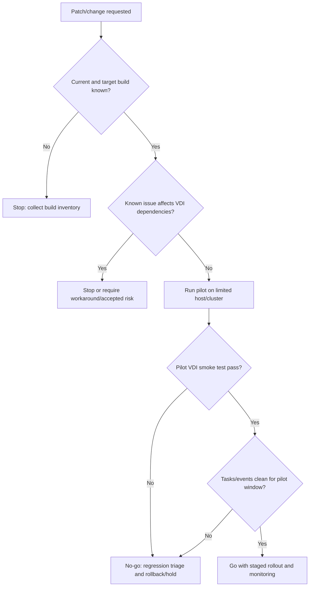

## Summary

Shard này bao phủ phần release notes và lifecycle signals của vSphere 8.0. Với VDI, phần này không dùng để học từng bug ID, mà để xây thói quen vận hành: trước khi patch/upgrade ESXi hoặc vCenter, engineer phải đọc release notes, known issues, compatibility, upgrade caveat, resolved issues và workaround vì một lỗi hypervisor có thể ảnh hưởng hàng trăm desktop VM.

## Chapter Knowledge Insight Report

Báo cáo insight của chương này chuyển release notes từ một danh sách thay đổi vendor thành mô hình quản trị rủi ro cho patch lifecycle. Insight chính là: release notes không chỉ trả lời "build này có gì mới", mà giúp engineer dự đoán failure mode, đặt stop condition, xác định pilot scope, chuẩn bị rollback và chứng minh RCA khi lỗi xuất hiện sau change.

Các nội dung về release notes, known issues, resolved issues và update/patch stream là `Source-backed` từ phạm vi lines 6196-73043. Việc diễn giải release notes như risk register, guardrail cho rollout và evidence model cho VDI là `Inference from source` dựa trên vai trò của ESXi/vCenter trong vận hành desktop VM ở quy mô lớn. Thông tin build production, firmware, driver, patch cadence và quy trình rollback của khách hàng là `Need Customer Confirmation`.

## Central Knowledge Thesis

**Thesis:** Trong môi trường VDI quy mô lớn, release notes phải được đọc như một risk register của nền tảng, không phải như tin tức phiên bản. Mỗi thay đổi ESXi, vCenter hoặc Host Client có thể thay đổi hành vi của host, storage, network, VM management hoặc workflow quản trị phía trên. Vì vậy engineer cần bắt đầu mọi patch bằng việc đối chiếu known issues, compatibility, build number và resolved issues, rồi mới quyết định pilot, rollout, rollback và escalation evidence. Nếu bỏ qua bước này, troubleshooting sau patch dễ biến thành đoán mò vì không có baseline trước/sau và không biết lỗi có phải regression đã được vendor ghi nhận hay không.

## Insight and Depth Control

| Trường | Giá trị |
|---|---|
| Depth target | Complete required insight and technical extraction sections |
| Character target | No fixed minimum |
| Required insight sections completed | Yes |
| Required technical sections completed | Yes |
| Chapter report thesis present | Yes |
| Insight report reads independently | Yes |
| Source-backed vs inference separated | Yes |
| Depth Exception | Not applicable |

## Runbook Best Practices Extracted

### Runbook Inventory

| Runbook ID | Tên runbook | Dùng khi nào | Đối tượng thực hiện | Mức rủi ro | Source locator |
|---|---|---|---|---|---|
| RB-01 | Pre-change release note review cho ESXi/vCenter patch | Trước patch/upgrade ESXi, vCenter hoặc Host Client | System Engineer / Platform Admin | High | Lines 6196-73043 |
| RB-02 | Post-patch regression triage | Khi lỗi VDI xuất hiện sau patch hoặc upgrade | System Engineer / Incident Commander | High | Lines 6196-73043 |
| RB-03 | Patch rollout stop/go decision | Khi pilot host/cluster đã chạy xong và cần quyết định rollout rộng | Platform Admin / Change Owner | High | Lines 6196-73043 |

### RB-01 - Pre-change release note review cho ESXi/vCenter patch

**Mục tiêu:** Bảo đảm patch được đánh giá như một rủi ro nền tảng trước khi tác động tới desktop VM, image workflow hoặc vCenter task.

**Khi áp dụng:**
- Trigger: Có change patch/upgrade ESXi, vCenter hoặc Host Client.
- Phạm vi ảnh hưởng: Host, cluster, vCenter, VM management workflow và VDI pool/catalog phụ thuộc.
- Không áp dụng khi: Emergency break-fix không có thời gian review đầy đủ; khi đó phải ghi rõ accepted risk.

**Điều kiện tiên quyết:**
- Quyền truy cập: Read access vào vCenter, release note, change record.
- Công cụ/console: vSphere Client, release notes, inventory export, change ticket.
- Thông tin đầu vào: Current build, target build, affected cluster, maintenance window.
- Customer confirmation cần có: Production build, firmware/driver baseline, patch cadence, rollback owner.

**Các bước thực hiện:**

| Bước | Hành động | Expected normal | Abnormal signal | Evidence cần lưu |
|---|---|---|---|---|
| 1 | Ghi current build của ESXi/vCenter/Host Client liên quan | Build hiện tại xác định rõ | Không biết build hoặc cluster không đồng nhất | Build screenshot/export |
| 2 | Đọc known issues và resolved issues của target build | Không có known issue khớp VDI dependency | Có issue storage/network/VM management/vCenter task khớp môi trường | Link/locator release note |
| 3 | Đối chiếu compatibility với ESXi, vCenter, firmware/driver và VDI integration | Không có mismatch rõ | Mismatch hoặc compatibility chưa xác nhận | Compatibility note trong change |
| 4 | Xác định pilot scope và stop condition | Pilot giới hạn blast radius | Rollout thẳng production toàn cụm | Pilot plan và stop condition |

**Điểm dừng và rollback:**
- Stop condition: Known issue khớp production dependency nhưng chưa có workaround.
- Rollback point: Build trước patch, backup/snapshot theo chính sách khách hàng, maintenance record.
- Không được làm: Rollout diện rộng khi chưa biết build hiện tại hoặc chưa có affected scope.

**Escalation:**
- Escalate cho ai: Platform owner, VMware support, change manager.
- Gói evidence tối thiểu: Build trước/sau, release note locator, affected cluster, risk summary.
- Câu hỏi cần gửi khi escalation: Known issue này có ảnh hưởng workload VDI hoặc vCenter task nào không?

**Source grounding:**
- Source-backed: Release notes, known issues, resolved issues, update/patch stream.
- Inference from source: Xem release notes như risk register trước patch VDI.
- Need Customer Confirmation: Build production, driver/firmware baseline, rollback process.

### RB-02 - Post-patch regression triage

**Mục tiêu:** Khoanh vùng lỗi sau patch bằng before/after build, symptom scope và known issue thay vì đoán lỗi ở broker.

**Khi áp dụng:**
- Trigger: User launch fail, VM task fail, storage/network symptom hoặc vCenter issue xuất hiện sau patch.
- Phạm vi ảnh hưởng: Pilot host, cluster, datastore, port group hoặc toàn vCenter.
- Không áp dụng khi: Không có change gần đây; chuyển sang incident triage bình thường.

**Các bước thực hiện:**

| Bước | Hành động | Expected normal | Abnormal signal | Evidence cần lưu |
|---|---|---|---|---|
| 1 | Xác định thời điểm symptom so với change window | Symptom không trùng change | Symptom bắt đầu ngay sau patch | Incident timeline |
| 2 | Map affected VMs/users tới host/cluster/build | Scope rải rác | Tập trung vào host/build mới | Affected object list |
| 3 | Đối chiếu known issues của build mới | Không có match | Match với storage/network/vCenter/VM issue | Release note locator |
| 4 | Dừng rollout nếu regression có pattern | Rollout tiếp tục có kiểm soát | Nhiều symptom lặp lại trên pilot | Stop/go record |

**Điểm dừng và rollback:**
- Stop condition: Lỗi lặp lại theo build hoặc host đã patch.
- Rollback point: Patch rollback/restore theo runbook khách hàng.
- Không được làm: Tiếp tục rollout khi pilot đã có symptom chưa giải thích.

**Escalation:**
- Escalate cho ai: Change owner, platform owner, VMware support.
- Gói evidence tối thiểu: Timeline, before/after build, affected scope, task/event, known issue match.
- Câu hỏi cần gửi khi escalation: Có workaround hoặc build thay thế cho issue này không?

**Source grounding:**
- Source-backed: Known issues/resolved issues và release note streams.
- Inference from source: Dùng known issues như evidence cho regression triage.
- Need Customer Confirmation: Rollback authority và accepted downtime.

### RB-03 - Patch rollout stop/go decision

**Mục tiêu:** Quyết định rollout dựa trên evidence pilot, không dựa vào cảm giác "patch đã cài xong".

**Khi áp dụng:**
- Trigger: Sau pilot patch ESXi/vCenter.
- Phạm vi ảnh hưởng: Cluster, pool/catalog, image workflow, user login/launch.
- Không áp dụng khi: Pilot chưa có workload đại diện.

**Các bước thực hiện:**

| Bước | Hành động | Expected normal | Abnormal signal | Evidence cần lưu |
|---|---|---|---|---|
| 1 | Xác nhận build sau patch | Build đúng target | Host/vCenter lệch build | Build export |
| 2 | Kiểm tra vCenter tasks/events quanh pilot | Không có lỗi bất thường | Task fail, timeout, permission/storage/network error | Task/event export |
| 3 | Chạy VDI smoke test | Login, launch, reconnect, power/image operation OK | Launch fail, slow, disconnect, task fail | Test result |
| 4 | Ghi stop/go decision | Go với evidence | No-go hoặc conditional go | Change approval note |

**Điểm dừng và rollback:**
- Stop condition: Smoke test fail hoặc vCenter task lỗi lặp lại.
- Rollback point: Previous build/restore plan theo quy trình khách hàng.
- Không được làm: Xem "install completed" là postcheck đủ.

**Escalation:**
- Escalate cho ai: Change CAB, VDI owner, platform owner.
- Gói evidence tối thiểu: Pilot host list, build, smoke test, task/event summary.
- Câu hỏi cần gửi khi escalation: Có được mở rộng rollout không, hay cần giữ pilot để quan sát thêm?

**Source grounding:**
- Source-backed: Release notes và patch/update lifecycle.
- Inference from source: Stop/go decision dựa trên VDI evidence.
- Need Customer Confirmation: Smoke test chuẩn và tiêu chí CAB.

### Max-depth runbook layer for CH01

#### RACI and ownership

| Runbook | Responsible | Accountable | Consulted | Informed | Required access |
|---|---|---|---|---|---|
| RB-01 | System Engineer | Change Owner | Platform, VDI, Storage, Network | Helpdesk/NOC | vSphere read, release notes, change ticket |
| RB-02 | Incident Owner | Platform Owner | VDI owner, vendor support | CAB/NOC | vSphere tasks/events, affected VM inventory |
| RB-03 | Change Owner | CAB / Platform Owner | VDI owner, business service owner | NOC/Helpdesk | vCenter build, task/event, pilot test evidence |

#### Decision tree

#### Evidence pack by runbook

| Runbook | Before evidence | During evidence | After evidence | Security note |
|---|---|---|---|---|
| RB-01 | Current build, target build, affected clusters, known issue locator | Compatibility notes, CAB decision | Approved pilot/rollback plan | Do not paste customer secrets into release-note notes |
| RB-02 | Change window, before/after build, affected users/VMs | Task/event export, known issue match, symptom timeline | Stop/go or rollback decision | Logs may contain hostnames/IPs; handle per customer policy |
| RB-03 | Pilot scope, smoke-test checklist, rollback point | Pilot task/event, user login/launch test | CAB go/no-go record | Keep evidence in ticket system, not raw source |

#### Postcheck and completion criteria

| Runbook | Pass criteria | Fail signal | If fail |
|---|---|---|---|
| RB-01 | Risk register complete, no blocking known issue, rollback owner confirmed | Unknown build, unreviewed known issue, no rollback owner | Do not submit change as ready |
| RB-02 | Regression scoped to build/host/component or ruled out with evidence | Repeat symptom on patched hosts, task failures after patch | Stop rollout and escalate with evidence |
| RB-03 | Login, launch, reconnect, vCenter task, alarms normal during pilot | Any user-impacting symptom or repeated task/event error | Hold rollout; open incident/change review |

#### Anti-patterns

| Anti-pattern | Vì sao nguy hiểm | Cách làm đúng |
|---|---|---|
| Patch theo lịch mà không đọc known issues | Có thể đưa regression đã biết vào production VDI | Biến release notes thành risk register bắt buộc |
| Chỉ ghi "patch successful" | Không chứng minh VDI workflow vẫn chạy | Ghi build, task/event, smoke test và alarm state |
| Tiếp tục rollout khi pilot có lỗi nhỏ | Lỗi nhỏ ở pilot có thể thành outage diện rộng | No-go cho đến khi có RCA/workaround |

#### Context variants

| Ngữ cảnh | Điều chỉnh runbook |
|---|---|
| Daily operations | Theo dõi advisory/known issues cho build đang chạy |
| Pre-change | RB-01 là bắt buộc |
| Incident bridge | RB-02 dùng để nối symptom với build/change |
| DR/Recovery | Kiểm tra build đích sau restore trước khi resume VDI operations |
| Audit/compliance | Lưu release-note locator, approval, rollback và postcheck |

#### Runbook Depth Score

| Runbook | Trigger/scope | RACI | Precheck | Decision tree | Steps/evidence | Evidence pack | Stop/rollback | Postcheck | Escalation | Anti-patterns | Grounding |
|---|---|---|---|---|---|---|---|---|---|---|---|
| RB-01 | Yes | Yes | Yes | Yes | Yes | Yes | Yes | Yes | Yes | Yes | Yes |
| RB-02 | Yes | Yes | Yes | Yes | Yes | Yes | Yes | Yes | Yes | Yes | Yes |
| RB-03 | Yes | Yes | Yes | Yes | Yes | Yes | Yes | Yes | Yes | Yes | Yes |

### Tutorial practice layer for CH01

| Runbook | Tutorial scenario | Open where / inspect what | Walkthrough notes | Sample observations | Handover note mẫu | Practice exercise |
|---|---|---|---|---|---|---|
| RB-01 | Change owner yêu cầu patch ESXi/vCenter cho cluster chạy VDI. Engineer phải chứng minh patch không có known issue ảnh hưởng storage, network, VM management hoặc vCenter task. | Mở release notes target build, vSphere Client version/build view, change ticket. Xem current build, target build, known issues, resolved issues và affected cluster. | Bắt đầu bằng build inventory, sau đó đọc known issues theo dependency VDI. Nếu có issue khớp storage/network/vCenter task, dừng change hoặc yêu cầu workaround. Nếu không có blocker, ghi pilot scope và rollback owner. | `Known issue mentions VM management task failure`; `Target build resolves storage path issue`; `Current build unknown on two hosts`. | `Time window: pre-change. Affected scope: cluster/pool. Primary finding: no blocking known issue / known issue found. Evidence attached: build export, release-note locator. Next owner: Change Owner.` | Cho target build giả lập và 3 known issues; học viên phân loại issue nào chặn rollout VDI và viết stop condition. |
| RB-02 | Sau patch pilot, nhiều user báo launch fail trên các desktop thuộc host vừa nâng cấp. Engineer cần xác định regression hay lỗi VDI độc lập. | Mở incident ticket, vCenter Tasks/Events, host build view, release notes known issues. Xem before/after build, affected VM-to-host mapping, event timeline. | Trước tiên khóa time window theo change. Map affected VMs vào host/build. Nếu lỗi chỉ xuất hiện trên host patched và match known issue, dừng rollout. Nếu không match, vẫn giữ evidence để phân tuyến storage/network/permission. | `All failed VMs sit on patched host`; `Task error starts after maintenance window`; `No known issue match but storage event appears`. | `Affected scope: pilot host. Primary finding: symptom correlates with patched build. Evidence: VM-host map, task export, release-note check. Action: rollout held.` | Với danh sách VM lỗi và host build, học viên xác định có đủ bằng chứng dừng rollout chưa. |
| RB-03 | Pilot patch đã xong, CAB hỏi có nên rollout rộng không. Engineer cần stop/go dựa trên VDI smoke test, không chỉ install status. | Mở vSphere Client, monitoring alarms, broker console, smoke test checklist. Xem build after patch, failed tasks, login/launch/reconnect result. | Xác nhận build đúng target, kiểm tra task/event trong pilot window, rồi chạy smoke test VDI. Go chỉ khi cả vCenter task và user journey đều pass. Nếu có alarm/task lỗi lặp lại, no-go. | `Build target correct but launch smoke test fails`; `No critical alarms and reconnect passes`; `Snapshot task timeout after patch`. | `Decision: Go/No-go. Evidence: build screenshot, smoke test, task/event export, alarms. Current risk: ... Next owner: CAB/Platform.` | Học viên nhận 4 kết quả postcheck và phải viết quyết định go/no-go kèm lý do. |

## Coverage

| Trường | Giá trị |
|---|---|
| Raw file | `raw/sources/vmware-vsphere-8-0.txt` |
| Line range | 6196-73043 |
| Source locator | Release Notes, ESXi Update and Patch Release Notes, vCenter Server Update and Patch Release Notes, VMware Host Client Release Notes |
| Extraction status | Extracted |
| Overview | [[sources/vmware-vsphere-8-0]] |

## Why This Chapter Matters for VDI Training

Release notes là nguồn giúp engineer tránh vận hành theo cảm tính khi patch ESXi/vCenter. Trong môi trường VDI 1500-2000+ máy, một lỗi build, driver, storage workflow hoặc vCenter task sau upgrade có thể ảnh hưởng cả pool hoặc cluster. Chương này huấn luyện engineer biết đọc release note như risk register trước change, dùng known issues để phân tích lỗi sau patch, và lưu evidence đủ tốt khi escalation.

## Reading Passes

| Pass | Kết quả |
|---|---|
| Structural Read | Xác định vùng release notes gồm vSphere GA, ESXi update/patch, vCenter update/patch và Host Client release notes. |
| Technical Read | Bóc tách các nhóm compatibility, known issues, resolved issues, storage/network/vCenter/VM management issues. |
| Operational Read | Chuyển release notes thành precheck/postcheck cho patch lifecycle. |
| Failure Read | Tách failure mode sau patch: regression, driver/firmware, storage workflow, vCenter task, network issue. |
| Training Read | Chuyển thành checklist đọc release note, scenario patch pilot và evidence escalation. |

## Knowledge Atoms

| ID | Knowledge atom | Loại tri thức | Vì sao quan trọng trong VDI | Source locator | Dùng cho topic |
|---|---|---|---|---|---|
| KA-01 | Release notes là risk register trước khi patch ESXi/vCenter. | Change | Patch sai có thể ảnh hưởng nhiều desktop cùng lúc. | Lines 6196-73043 | [[topics/21_VDI_Patch_and_Upgrade_Guide]] |
| KA-02 | ESXi và vCenter có lifecycle riêng, cần kiểm tra compatibility khi nâng cấp. | Architecture | Mismatch có thể làm lỗi vCenter task hoặc provisioning. | Lines 6196-73043 | [[topics/7_Hypervisor_and_HCI_Operations_Guide]] |
| KA-03 | Known issues sau upgrade là evidence để khoanh vùng lỗi post-change. | Troubleshooting | Giúp phân biệt lỗi do patch với lỗi VDI platform. | Lines 6196-73043 | [[topics/18_VDI_Troubleshooting_Playbook]] |
| KA-04 | Storage issues trong release notes phải được đọc trước change. | Operation | Storage lỗi có thể gây login chậm, VM stun, snapshot fail. | Lines 6196-73043 | [[topics/8_Storage_Operations_for_VDI]] |
| KA-05 | Networking issues trong release notes có thể ảnh hưởng VDA/Horizon Agent reachability. | Troubleshooting | User thấy launch fail nhưng gốc có thể là host/network build. | Lines 6196-73043 | [[topics/9_Network_Operations_for_VDI]] |
| KA-06 | vCenter Server issues có thể ảnh hưởng task, lifecycle manager và workflow. | Operation | Pool/catalog power operation có thể fail dù VM đang chạy. | Lines 6196-73043 | [[topics/11_VDI_Provisioning_and_Allocation_Guide]] |
| KA-07 | Host Client release notes quan trọng khi cần kiểm tra host trực tiếp. | Monitoring | Khi vCenter có vấn đề, Host Client có thể là nguồn evidence phụ. | Lines 6196-73043 | [[topics/15_VDI_Monitoring_and_Alerting_Guide]] |
| KA-08 | Resolved issues giúp chứng minh lý do business của patch. | Change | Patch cần mục tiêu rõ, không chỉ “update cho mới”. | Lines 6196-73043 | [[topics/20_VDI_Change_Management_Guide]] |
| KA-09 | Build number trước/sau patch là evidence bắt buộc. | Evidence | Thiếu build number thì RCA post-change rất yếu. | Lines 6196-73043 | [[topics/25_VDI_Support_and_Escalation_Guide]] |
| KA-10 | Pilot host/cluster là guardrail trước rollout diện rộng. | Change | Giảm blast radius trong môi trường VDI lớn. | Lines 6196-73043 | [[topics/20_VDI_Change_Management_Guide]] |

## Architecture Knowledge

- Release notes là lớp governance cho platform lifecycle. Nó không phải runtime component, nhưng quyết định patch nào an toàn, issue nào đã biết, component nào có compatibility constraint.
- ESXi và vCenter có lifecycle riêng. Trong VDI, mismatch giữa ESXi/vCenter/VM hardware/VMware Tools/Horizon Agent/Citrix VDA có thể tạo lỗi khó khoanh vùng.
- Known issues về networking, storage, vCenter tasks, VM management, security, lifecycle manager và Host Client phải được đọc như risk register trước change.

## Operational Knowledge

| Thành phần / thao tác | Engineer cần hiểu gì | Khi nào kiểm tra | Evidence |
|---|---|---|---|
| ESXi build | Build level quyết định bug exposure và compatibility | Trước/sau patch, khi desktop lỗi theo host | Host build screenshot/export |
| vCenter build | vCenter quản lý task/API cho Horizon/CVAD | Khi provisioning/power/snapshot task lỗi | vCenter version, task error |
| Known issues | Có thể giải thích lỗi sau upgrade | Trước change, khi issue xuất hiện sau patch | Release note section, change ticket |
| Resolved issues | Xác định patch có fix symptom hiện tại không | Khi lập patch plan | Fix reference, affected component |
| Compatibility | Không upgrade đơn lẻ khi component phụ thuộc chưa tương thích | Trước major/minor upgrade | Compatibility matrix/link nội bộ nếu có |

## Troubleshooting Knowledge

| Triệu chứng | Nguyên nhân có thể | Lớp cần kiểm tra | Evidence | Hướng xử lý | Escalation |
|---|---|---|---|---|---|
| Sau patch, nhiều VDI trên một cluster lỗi | Regression/known issue trong ESXi/vCenter build | Patch lifecycle, Host, Cluster | Before/after build, affected host list, release note known issue | Dừng rollout, đối chiếu known issues, rollback/mitigate theo change plan | Escalate virtualization/vendor nếu bug match |
| vCenter task fail sau upgrade | Lifecycle Manager/workflow/API behavior change | vCenter, Lifecycle | Task error, vCenter event, release note caveat | Kiểm tra version compatibility, workaround | Escalate platform owner |
| Storage vMotion/snapshot/power issue | Known storage/VM management issue | Storage, VM Management | Task log, datastore type, release note | Khoanh vùng datastore/host/build | Escalate storage/VMware |
| Network issue sau update | Driver, DPU, NIC, NSX/network compatibility | Network, Host | NIC driver/firmware, host logs | So sánh driver/firmware/build, rollback nếu cần | Escalate network/virtualization |

## Monitoring and Evidence

- Track patch level by host/cluster.
- Track vCenter version and build.
- Track issue trend before/after maintenance.
- Store release note references in change evidence.
- Capture affected object mapping: host, cluster, datastore, VM, pool/catalog.

## Change, Patch and Rollback

- Change type: ESXi/vCenter/Host Client patch and upgrade planning.
- Precheck: release notes, known issues, compatibility, backup, maintenance capacity, active sessions.
- Impact: host reboot, vCenter downtime, task/API behavior, desktop availability.
- Rollback point: host bootbank/rollback path if approved, vCenter backup, change backout plan.
- Postcheck: host connected, vCenter tasks normal, VDI login/launch, datastore/network alarms clear.
- Stop condition: same symptom appears on pilot host/cluster, critical known issue matches environment, no rollback evidence.

## Backup, Recovery, HA and DR

- Release planning must include whether vCenter backup exists before upgrade.
- HA does not remove need for release note review: HA may restart VMs but cannot fix a bad build or incompatible driver.
- DR test should note vSphere build levels because restore to mismatched environments can fail.

## Security and RBAC

- Security patches may be mandatory, but still need compatibility and maintenance planning.
- Patch execution should require platform admin approval.
- Evidence should not include credential or license secrets.

## Concepts to Create or Update

| Concept | Nội dung cần cập nhật | Source locator |
|---|---|---|
| [[concepts/lifecycle-management]] | Release notes as risk and compatibility input | Lines 6196-73043 |
| [[concepts/change-management]] | Patch precheck and stop condition | Lines 6196-73043 |
| [[concepts/esxi]] | Build/version/known issue awareness | Lines 6196-73043 |
| [[concepts/vcenter-server]] | vCenter patch lifecycle | Lines 6196-73043 |

## Topic Mapping

| Topic | Vì sao chunk này hỗ trợ |
|---|---|
| [[topics/20_VDI_Change_Management_Guide]] | Release notes là evidence bắt buộc trước change |
| [[topics/21_VDI_Patch_and_Upgrade_Guide]] | Source chính cho patch/upgrade awareness |
| [[topics/18_VDI_Troubleshooting_Playbook]] | Dùng known issues để phân tích lỗi sau patch |
| [[topics/25_VDI_Support_and_Escalation_Guide]] | Cung cấp evidence khi escalation vendor |

## Scenario Based Extraction

| Scenario | Bối cảnh | Triệu chứng | Câu hỏi cho engineer | Phân tích mong đợi | Evidence cần lấy | Escalation |
|---|---|---|---|---|---|---|
| Patch pilot gây lỗi desktop | Một host ESXi pilot vừa được update. | User trên host đó launch chậm hoặc disconnect. | Có lỗi tương ứng trong known issues không? | So sánh build trước/sau, đối chiếu release notes, khoanh theo host. | Build number, affected VM list, host events, release note locator. | Escalate virtualization/vendor nếu match known issue. |
| vCenter workflow fail sau upgrade | vCenter vừa upgrade trước image publish. | Horizon/CVAD không power/provision VM. | Lỗi nằm ở broker hay vCenter task? | Kiểm tra vCenter task/event và release note vCenter workflow. | vCenter task error, broker error, version/build. | Escalate platform owner nếu API/task fail. |
| Storage task lỗi sau patch | Sau patch, snapshot/consolidation hoặc Storage vMotion fail. | Pool update chậm hoặc image task fail. | Có storage known issue trong release notes không? | Kiểm tra datastore type, task failure, release note storage section. | Datastore, task ID, snapshot tree, build. | Escalate storage/VMware nếu ảnh hưởng rộng. |

## Training Conversion Notes

| Training asset | Nội dung lấy từ chương | Topic đích |
|---|---|---|
| Checklist | Release note review before patch | [[topics/21_VDI_Patch_and_Upgrade_Guide]] |
| Scenario | Patch pilot causes VDI failure | [[topics/20_VDI_Change_Management_Guide]] |
| Troubleshooting table | Post-change issue mapped to known issues | [[topics/18_VDI_Troubleshooting_Playbook]] |
| Evidence package | Build number, task/event, affected host/pool | [[topics/25_VDI_Support_and_Escalation_Guide]] |

## Gaps

- Need Customer Confirmation: version/build vSphere production, patch window, rollback policy, compatibility matrix nội bộ, vendor support path.

## Chapter Self Review

- [x] Đã đọc đúng line range/chapter.
- [x] Có đủ 5 reading passes.
- [x] Có Knowledge Atoms.
- [x] Có architecture knowledge.
- [x] Có operational knowledge.
- [x] Có troubleshooting knowledge.
- [x] Có monitoring/evidence.
- [x] Có change/rollback.
- [x] Có backup/HA/DR.
- [x] Có security/RBAC.
- [x] Có concept mapping.
- [x] Có topic mapping.
- [x] Có scenario based extraction.
- [x] Có training conversion notes.
- [x] Có gaps và không bịa thông tin khách hàng.
