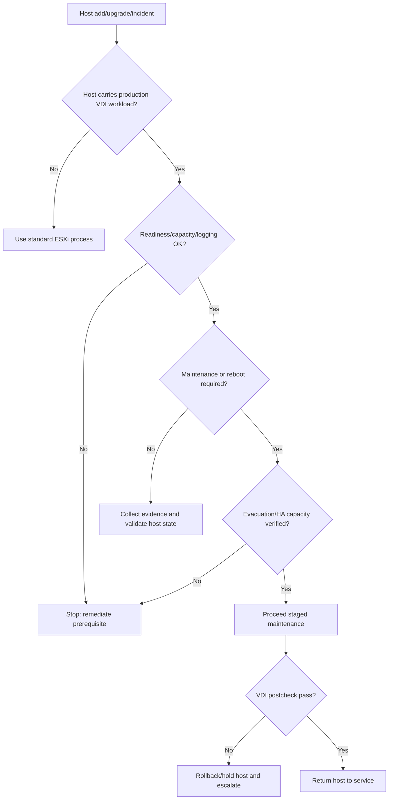

## Summary

Shard này bao phủ ESXi Installation and Setup và ESXi Upgrade. Với VDI, ESXi host là nơi desktop VM chạy. Một host install/upgrade sai, thiếu logging, firewall sai, hardware/storage requirement không đạt hoặc patch cần reboot không được lập kế hoạch có thể gây mất phiên diện rộng.

## Chapter Knowledge Insight Report

Báo cáo insight của chương này xem ESXi không chỉ là hypervisor cài trên host, mà là execution boundary của VDI workload. Insight chính là: chất lượng cài đặt, cấu hình ban đầu, firewall, logging, hardware readiness, boot/storage layout và upgrade path của ESXi quyết định engineer có thể vận hành, quan sát, khôi phục và patch desktop VM an toàn đến đâu.

Các yêu cầu cài đặt, nâng cấp, firewall, syslog, maintenance mode, support bundle và boot/troubleshooting là `Source-backed` từ lines 73044-90797. Việc chuyển các mục đó thành mô hình "host như failure boundary của VDI" là `Inference from source`. Thông tin host model, HCI/storage backend, cluster design, DRS/HA policy, maintenance window và quyền reboot host của khách hàng là `Need Customer Confirmation`.

## Central Knowledge Thesis

**Thesis:** Trong VDI, ESXi host là nơi triệu chứng người dùng có thể gom lại theo boundary vật lý hoặc cluster, dù người dùng chỉ nhìn thấy lỗi desktop. Nếu host được cài đặt, cấu hình logging/firewall hoặc nâng cấp không đúng, lỗi có thể lan sang nhóm VM mà broker phía trên chỉ phản ánh như launch fail, disconnect hoặc desktop unavailable. Vì vậy engineer phải vận hành ESXi bằng mô hình state + evidence: host connected hay không, build nào, cần reboot không, firewall/syslog ra sao, support bundle có đủ không và VM nào bị ảnh hưởng. Chỉ khi hiểu host như execution boundary, engineer mới phân biệt được lỗi Horizon/CVAD với lỗi nền tảng.

## Insight and Depth Control

| Trường | Giá trị |
|---|---|
| Depth target | Complete required insight and technical extraction sections |
| Character target | No fixed minimum |
| Required insight sections completed | Yes |
| Required technical sections completed | Yes |
| Chapter report thesis present | Yes |
| Insight report reads independently | Yes |
| Source-backed vs inference separated | Yes |
| Depth Exception | Not applicable |

## Runbook Best Practices Extracted

### Runbook Inventory

| Runbook ID | Tên runbook | Dùng khi nào | Đối tượng thực hiện | Mức rủi ro | Source locator |
|---|---|---|---|---|---|
| RB-01 | ESXi host readiness precheck | Trước khi đưa host vào cụm VDI hoặc trước upgrade | Platform Admin / System Engineer | High | Lines 73044-90797 |
| RB-02 | ESXi upgrade maintenance execution | Khi upgrade/patch ESXi host chạy VDI workload | Platform Admin / Change Owner | High | Lines 73044-90797 |
| RB-03 | ESXi host boot/support bundle triage | Khi host không boot, disconnect hoặc cần escalation | System Engineer / Platform Admin | High | Lines 73044-90797 |

### RB-01 - ESXi host readiness precheck

**Mục tiêu:** Xác nhận host đủ điều kiện vận hành VDI trước khi nhận desktop VM hoặc tham gia maintenance workflow.

**Khi áp dụng:**
- Trigger: Host mới, host rebuild, trước upgrade hoặc trước mở rộng pool.
- Phạm vi ảnh hưởng: Desktop VM trên host, cluster capacity, HA/DRS.
- Không áp dụng khi: Host không thuộc cụm chạy VDI production.

**Điều kiện tiên quyết:**
- Quyền truy cập: vCenter/ESXi read access, hardware inventory access.
- Công cụ/console: vSphere Client, ESXi Host Client, hardware management, syslog target.
- Thông tin đầu vào: Host model, target ESXi build, cluster name, datastore/network mapping.
- Customer confirmation cần có: HCI vendor, supported firmware, maintenance policy.

**Các bước thực hiện:**

| Bước | Hành động | Expected normal | Abnormal signal | Evidence cần lưu |
|---|---|---|---|---|
| 1 | Kiểm tra host hardware/storage requirement | Host supported và storage visible | Unsupported device, boot/storage warning | Host summary |
| 2 | Kiểm tra management network, DNS/time và firewall services | Host reachable, time sync đúng | Host disconnect, DNS/time drift, firewall block | Network/time screenshot |
| 3 | Kiểm tra syslog/logging | Log forwarding hoặc retention đã sẵn sàng | Không có syslog/retention | Syslog config |
| 4 | Kiểm tra datastore/port group mapping | Mapping khớp cluster chuẩn | Thiếu datastore hoặc port group | Inventory export |

**Điểm dừng và rollback:**
- Stop condition: Host không đạt hardware/storage/network/logging baseline.
- Rollback point: Không đưa host vào production workload.
- Không được làm: Cho DRS đặt desktop VM lên host chưa đủ readiness.

**Escalation:**
- Escalate cho ai: Platform/HCI owner, network/storage owner.
- Gói evidence tối thiểu: Host build, hardware warning, datastore/network mapping, syslog status.
- Câu hỏi cần gửi khi escalation: Host này đã được vendor/customer support matrix xác nhận chưa?

**Source grounding:**
- Source-backed: ESXi requirements, firewall ports, syslog, installation setup.
- Inference from source: Readiness precheck cho VDI host admission.
- Need Customer Confirmation: Hardware/firmware support và production baseline.

### RB-02 - ESXi upgrade maintenance execution

**Mục tiêu:** Upgrade host với blast radius có kiểm soát và bằng chứng đủ cho postcheck.

**Khi áp dụng:**
- Trigger: ESXi update/upgrade đã được approve.
- Phạm vi ảnh hưởng: VM trên host, cluster capacity, HA/DRS, desktop session.
- Không áp dụng khi: Cluster không đủ capacity để evacuate host.

**Các bước thực hiện:**

| Bước | Hành động | Expected normal | Abnormal signal | Evidence cần lưu |
|---|---|---|---|---|
| 1 | Xác định affected VMs và active sessions | Có danh sách workload | Không biết VM nào bị ảnh hưởng | Affected VM export |
| 2 | Kiểm tra maintenance mode/reboot requirement | Có kế hoạch evacuate | Host cần reboot nhưng chưa có window | Change plan |
| 3 | Đưa host vào maintenance theo policy | VM evacuation thành công | vMotion/evacuation fail | Task/event export |
| 4 | Upgrade và xác nhận build | Build đúng target | Build mismatch hoặc host warning | Build screenshot |
| 5 | Postcheck VDI smoke test | Login/launch/reconnect OK | User impact hoặc VM task fail | Smoke test result |

**Điểm dừng và rollback:**
- Stop condition: Evacuation fail, HA capacity warning, postcheck VDI fail.
- Rollback point: Previous host build hoặc remove host khỏi scheduling theo policy.
- Không được làm: Reboot host khi chưa rõ active workload/capacity.

**Escalation:**
- Escalate cho ai: Change owner, platform owner, VDI owner.
- Gói evidence tối thiểu: Affected VM list, maintenance tasks, build before/after, smoke test.
- Câu hỏi cần gửi khi escalation: Có tiếp tục host kế tiếp hay dừng rollout?

**Source grounding:**
- Source-backed: ESXi upgrade, maintenance/reboot awareness, syslog/support bundle.
- Inference from source: VDI-specific pre/postcheck around host upgrade.
- Need Customer Confirmation: Evacuation policy, capacity threshold, rollback path.

### RB-03 - ESXi host boot/support bundle triage

**Mục tiêu:** Thu thập evidence host-level khi host boot fail, disconnect hoặc cần vendor escalation.

**Khi áp dụng:**
- Trigger: Host fails to boot, not responding, PSOD, hardware/storage/network issue.
- Phạm vi ảnh hưởng: VM trên host, HA restart, cluster capacity.
- Không áp dụng khi: Chỉ có một VM lỗi riêng lẻ.

**Các bước thực hiện:**

| Bước | Hành động | Expected normal | Abnormal signal | Evidence cần lưu |
|---|---|---|---|---|
| 1 | Xác định host state trong vCenter/Host Client | Connected hoặc maintenance expected | Not responding/boot fail | Host state screenshot |
| 2 | Map affected VMs/users | Scope rõ theo host | Không biết VM nào bị ảnh hưởng | VM list |
| 3 | Kiểm tra events/logs/syslog | Có event quanh thời điểm lỗi | Không có log hoặc log gap | Event/log summary |
| 4 | Thu support bundle nếu phù hợp | Bundle tạo thành công | Bundle fail hoặc thiếu quyền | Bundle ID/path note |

**Điểm dừng và rollback:**
- Stop condition: Hardware/path issue hoặc host instability lặp lại.
- Rollback point: Giữ host khỏi production cluster cho đến khi RCA/repair.
- Không được làm: Reboot nhiều lần không có evidence.

**Escalation:**
- Escalate cho ai: HCI/hardware owner, VMware support.
- Gói evidence tối thiểu: Host state, affected VMs, events/logs, support bundle, build.
- Câu hỏi cần gửi khi escalation: Lỗi là hardware, driver, boot device hay ESXi build?

**Source grounding:**
- Source-backed: Troubleshooting ESXi booting, collect logs, support bundle.
- Inference from source: Host issue triage theo affected VDI scope.
- Need Customer Confirmation: Support channel và log retention.

### Max-depth runbook layer for CH02

#### RACI and ownership

| Runbook | Responsible | Accountable | Consulted | Informed | Required access |
|---|---|---|---|---|---|
| RB-01 | Platform Admin | Platform Owner | HCI/storage/network/security | VDI owner | vCenter host inventory, hardware console, syslog config |
| RB-02 | Change Owner / Platform Admin | CAB | VDI owner, NOC | Helpdesk, affected service owner | Maintenance mode, DRS/HA view, host patch tools |
| RB-03 | System Engineer | Incident Owner | Hardware/HCI owner, VMware support | VDI owner | Host Client, vCenter events, support bundle rights |

#### Decision tree

#### Deep precheck and evidence pack

| Area | Concrete check | Normal state | Abnormal signal | Evidence |
|---|---|---|---|---|
| Hardware/boot | Host model, boot device, storage visibility | Supported and stable | Unsupported device, boot warning | Host summary / hardware screenshot |
| Network | Management vmk, DNS/time, firewall ports | Reachable, time synced | Host disconnect, blocked service | DCUI/Host Client/vCenter evidence |
| Logging | Syslog target/retention/support bundle path | Logs available before incident | No logs, local-only gap | Syslog config screenshot |
| Workload impact | VM list, active sessions, DRS/HA status | Evacuation possible | Capacity/admission warning | Affected VM export |

#### Postcheck and completion criteria

| Runbook | Pass criteria | Fail signal | If fail |
|---|---|---|---|
| RB-01 | Host connected, datastore/port groups visible, syslog ready | Missing datastore/port group/logging | Keep host out of production |
| RB-02 | Maintenance tasks succeed, target build correct, VDI smoke test passes | Evacuation fail, reboot unplanned, login/launch fail | Hold rollout, rollback or quarantine host |
| RB-03 | Host state explained, logs/support bundle collected, affected VMs mapped | No logs, host unstable, repeated boot issue | Escalate hardware/HCI/VMware |

#### Anti-patterns

| Anti-pattern | Vì sao nguy hiểm | Cách làm đúng |
|---|---|---|
| Reboot host để "thử" khi chưa map VM | Có thể gây mất phiên diện rộng | Map VM/session và HA capacity trước |
| Đưa host vào cluster khi syslog chưa sẵn sàng | Incident sau này thiếu RCA | Logging là readiness gate |
| Retry upgrade trên host lỗi mà không support bundle | Làm mất dấu lỗi ban đầu | Thu evidence trước khi thay đổi state |

#### Context variants

| Ngữ cảnh | Điều chỉnh runbook |
|---|---|
| Daily operations | RB-01 rút gọn thành host health/logging/capacity check |
| Pre-change | RB-02 đầy đủ, bắt buộc affected VM export |
| Incident bridge | RB-03 ưu tiên evidence-only trước khi thao tác |
| DR/Recovery | Validate host boot, datastore, port group, vCenter reconnect |
| Audit/compliance | Lưu build before/after, support bundle reference, postcheck |

#### Runbook Depth Score

| Runbook | Trigger/scope | RACI | Precheck | Decision tree | Steps/evidence | Evidence pack | Stop/rollback | Postcheck | Escalation | Anti-patterns | Grounding |
|---|---|---|---|---|---|---|---|---|---|---|---|
| RB-01 | Yes | Yes | Yes | Yes | Yes | Yes | Yes | Yes | Yes | Yes | Yes |
| RB-02 | Yes | Yes | Yes | Yes | Yes | Yes | Yes | Yes | Yes | Yes | Yes |
| RB-03 | Yes | Yes | Yes | Yes | Yes | Yes | Yes | Yes | Yes | Yes | Yes |

### Tutorial practice layer for CH02

| Runbook | Tutorial scenario | Open where / inspect what | Walkthrough notes | Sample observations | Handover note mẫu | Practice exercise |
|---|---|---|---|---|---|---|
| RB-01 | Một host mới chuẩn bị đưa vào cluster VDI. Engineer phải kiểm tra readiness trước khi DRS được phép đặt desktop VM lên host. | Mở vSphere Client host summary, Host Client, hardware/iLO/iDRAC nếu có, syslog config, datastore/network tabs. | Đi từ nền tảng lên workload: hardware/boot, management network, time/DNS, datastore, port group, logging. Nếu bất kỳ dependency nào thiếu, host chưa được nhận production workload. | `Host connected but missing VDI port group`; `Syslog not configured`; `Datastore visible but hardware warning active`. | `Host: ... Readiness: pass/fail. Missing dependency: ... Evidence: host summary, syslog config, datastore/port group screenshot. Next owner: ...` | Học viên nhận checklist host mới và đánh dấu điều kiện nào chặn production admission. |
| RB-02 | ESXi host chạy desktop VM cần upgrade. Engineer phải evacuate, patch, postcheck mà không gây mất phiên ngoài kế hoạch. | Mở cluster DRS/HA view, host maintenance tasks, affected VM list, change ticket, broker smoke test. | Xác định VM/session impact trước, kiểm tra capacity, đưa host vào maintenance, theo dõi task, xác nhận build, rồi test login/launch. Fail ở bước nào thì dừng ở đó. | `Evacuation task fails for one VM`; `HA admission warning before maintenance`; `Build correct but reconnect test fails`. | `Change step: ESXi upgrade. Affected VMs: ... Result: pass/fail. Evidence: maintenance task, build, smoke test. Next action: ...` | Học viên sắp xếp thứ tự đúng các bước maintenance và chọn điểm dừng khi HA capacity fail. |
| RB-03 | Host not responding sau maintenance. Engineer cần thu evidence trước khi reboot/retry để không mất dấu nguyên nhân. | Mở vCenter events, Host Client nếu còn truy cập được, syslog/log platform, hardware console, support bundle workflow. | Trước khi thao tác state, xác định host state, VM impact, event timeline và log availability. Nếu host unstable, thu support bundle hoặc mở escalation hardware/HCI. | `Host Client reachable but vCenter disconnected`; `No syslog for incident window`; `PSOD screenshot available from hardware console`. | `Incident: host boot/disconnect. Impact: ... Evidence: host state, VM list, logs/bundle. Action taken: evidence-only / escalated.` | Học viên nhận 3 tình huống host down và chọn evidence cần thu trước khi reboot. |

### Mandatory Installation and Configuration Runbooks

| Source procedure / config heading | Procedure type | Runbook required? | Runbook ID | Nếu không tạo, lý do |
|---|---|---|---|---|
| ESXi Requirements / Hardware Requirements / System Storage Overview | Prepare / Install | Yes | RB-04 | N/A |
| Installing ESXi Interactively / Scripted Installation / Network Boot | Install | Yes | RB-05 | N/A |
| Initial ESXi Configuration / Enable ESXi Shell and SSH / Firewall Ports | Configure | Yes | RB-06 | N/A |
| Configure Syslog / Log Filtering / Collect Logs | Configure / Evidence | Yes | RB-07 | N/A |
| Auto Deploy installation and reprovisioning | Deploy / Reprovision | Yes | RB-08 | N/A |
| Decommission an ESXi Host | Decommission | Yes | RB-09 | N/A |

### RB-04 - Tutorial: Chuẩn bị ESXi host trước khi cài đặt hoặc rebuild

**Tutorial scenario:** Một host mới hoặc host rebuild chuẩn bị tham gia cluster chạy desktop VM. Engineer cần xác nhận hardware, boot/storage layout, network quản trị và thông tin cài đặt trước khi đụng tới production.

**Bạn sẽ làm được gì:** xác định readiness, biết thiếu dữ liệu nào phải hỏi khách hàng, và tạo evidence trước cài đặt.

| Bước | Thao tác thực hành | Quan sát normal | Signal bất thường | Evidence |
|---|---|---|---|---|
| 1 | Mở inventory/hardware record của host, đối chiếu model/CPU/RAM/NIC/HBA với baseline khách hàng | Host nằm trong danh sách được phép dùng cho vSphere/VDI | Model/firmware/driver chưa được xác nhận | Hardware inventory |
| 2 | Kiểm tra boot device và system storage plan | Boot/storage layout rõ | Boot device không rõ hoặc shared với datastore workload | Boot/storage note |
| 3 | Chuẩn bị management IP, VLAN, DNS, NTP, hostname | Có đủ thông tin và naming chuẩn | Thiếu DNS/NTP/VLAN hoặc naming lệch | Install worksheet |
| 4 | Xác định cluster/datastore/port group sẽ join sau install | Mapping rõ | Không biết host thuộc cụm/pool nào | Target cluster mapping |

**Walkthrough notes:** Làm bước này trước khi cài ESXi giúp tránh tình huống cài xong mới phát hiện host không có đúng NIC/storage path hoặc không join được network quản trị. Nếu thiếu baseline firmware/driver, dừng ở readiness, không đoán.

**Sample observations:** `Management VLAN not confirmed`; `Host model approved but NIC firmware unknown`; `DNS reverse lookup missing`.

**Stop/rollback:** Stop nếu hardware/boot/network baseline chưa xác nhận. Rollback là không đưa host vào production cluster.

**Practice exercise:** Cho một install worksheet thiếu NTP và datastore mapping; học viên phải ghi các câu hỏi cần gửi platform/network/storage owner.

### RB-05 - Tutorial: Cài đặt ESXi interactive/scripted/network boot có kiểm soát

**Tutorial scenario:** Engineer phải cài ESXi cho host mới hoặc rebuild host lỗi, chọn interactive, scripted hoặc network boot tùy quy trình khách hàng.

| Bước | Thao tác thực hành | Quan sát normal | Signal bất thường | Evidence |
|---|---|---|---|---|
| 1 | Chọn phương thức install được approve: ISO interactive, scripted install, PXE/iPXE/UEFI HTTP | Phương thức khớp change/runbook | Dùng media không rõ nguồn hoặc script chưa review | Change note |
| 2 | Xác nhận installer/build đúng phiên bản target | Build đúng target | Build khác target hoặc không rõ image profile | Installer/build screenshot |
| 3 | Cài đặt theo worksheet, không tự đổi hostname/IP/VLAN ngoài plan | Host cài xong đúng thông tin | Sai hostname/IP, duplicate network | Install result |
| 4 | Sau install, đăng nhập Host Client hoặc vCenter add host để xác nhận host reachable | Host reachable | Host không reachable, DNS/time sai | Reachability evidence |

**Decision tree:** Nếu install xong host không reachable, kiểm tra IP/VLAN/DNS/time trước khi retry install. Nếu installer/build sai, stop và rebuild đúng image.

**Anti-patterns:** dùng ISO không kiểm soát; cài host bằng thông tin tạm; join production cluster trước khi validate network/storage.

**Handover note mẫu:** `Host installed. Build: ... Method: interactive/scripted/PXE. Worksheet version: ... Reachability: pass/fail. Open items: ...`

### RB-06 - Tutorial: Cấu hình ban đầu ESXi, firewall, SSH/Shell

**Tutorial scenario:** Sau khi cài ESXi, host cần cấu hình ban đầu đủ để quản trị nhưng không mở quyền truy cập thừa.

| Bước | Thao tác thực hành | Quan sát normal | Signal bất thường | Evidence |
|---|---|---|---|---|
| 1 | Kiểm tra management network, DNS, NTP/time sync | Host đồng bộ thời gian, resolve đúng | Time drift, DNS fail | Host config screenshot |
| 2 | Review ESXi firewall/services liên quan management/monitoring | Rule/service đúng baseline | Service mở ngoài chuẩn | Firewall/service export |
| 3 | Chỉ enable ESXi Shell/SSH khi có change/incident approved | SSH/Shell off hoặc có expiry/approval | SSH bật lâu dài không owner | Service state evidence |
| 4 | Add host vào vCenter/cluster theo policy | Host connected | Certificate/trust/network error | Add-host task |

**Postcheck:** host connected, no critical alarm, management services theo baseline, SSH/Shell state được ghi nhận.

**Practice exercise:** Học viên nhận host có SSH bật và không có change ticket; viết hành động đúng và evidence cần lưu.

### RB-07 - Tutorial: Cấu hình syslog và log filtering cho ESXi

**Tutorial scenario:** Trước khi production workload chạy trên host, engineer phải bảo đảm logs có thể dùng cho RCA.

| Bước | Thao tác thực hành | Quan sát normal | Signal bất thường | Evidence |
|---|---|---|---|---|
| 1 | Mở host advanced/system logging settings hoặc profile quản lý syslog | Syslog target/retention rõ | Chỉ local log hoặc target unknown | Syslog config |
| 2 | Gửi/test log theo quy trình khách hàng nếu có | Log đến collector | Collector không nhận | Test result |
| 3 | Review log filtering nếu đang bật | Filter có lý do | Filter che mất event cần RCA | Filter config |
| 4 | Ghi retention và log owner | Owner rõ | Không ai sở hữu log platform | Handover note |

**Stop condition:** Không đưa host vào production nếu logging là yêu cầu bắt buộc và chưa hoạt động.

**Source grounding:** Source-backed: syslog/log filtering/support bundle sections. Need Customer Confirmation: collector, retention, SIEM policy.

### RB-08 - Tutorial: Auto Deploy / reprovision host có kiểm soát

**Tutorial scenario:** Môi trường dùng Auto Deploy hoặc cần reprovision host hàng loạt; sai rule/image có thể ảnh hưởng nhiều host.

| Bước | Thao tác thực hành | Quan sát normal | Signal bất thường | Evidence |
|---|---|---|---|---|
| 1 | Xác nhận Auto Deploy infrastructure và rule set | Rule/image/profile rõ | Rule không rõ hoặc áp sai cluster | Rule export |
| 2 | Kiểm tra image profile/host profile mapping | Mapping đúng host group | Host nhận image/profile sai | Mapping evidence |
| 3 | Reprovision pilot host trước | Pilot boot và join đúng | Boot fail, wrong config | Pilot evidence |
| 4 | Postcheck datastore/network/syslog/VDI smoke | Workload-ready | Missing network/datastore/logging | Postcheck record |

**Anti-patterns:** đổi rule set diện rộng không pilot; không lưu rule/image before state; không kiểm tra Host Profile sau boot.

### RB-09 - Tutorial: Decommission ESXi host khỏi cụm VDI

**Tutorial scenario:** Host cần loại khỏi cluster do lifecycle, hardware hoặc migration. Engineer phải tránh để sót VM, datastore/path hoặc monitoring object.

| Bước | Thao tác thực hành | Quan sát normal | Signal bất thường | Evidence |
|---|---|---|---|---|
| 1 | Map toàn bộ VM/session trên host | Không còn production workload | VM còn chạy hoặc pinned | VM export |
| 2 | Đưa host vào maintenance/remove theo policy | Evacuation clean | Evacuation fail | Task evidence |
| 3 | Gỡ khỏi cluster/vCenter/monitoring theo approval | Inventory sạch | Orphaned host/alarm | Removal record |
| 4 | Update capacity and documentation | Capacity adjusted | Cluster capacity thiếu sau removal | Capacity note |

**Handover:** `Host decommissioned. Workload evacuated: yes/no. Monitoring removed: yes/no. Capacity impact: ...`

## Coverage

| Trường | Giá trị |
|---|---|
| Raw file | `raw/sources/vmware-vsphere-8-0.txt` |
| Line range | 73044-90797 |
| Source locator | ESXi Installation and Setup; ESXi Upgrade |
| Extraction status | Extracted |
| Overview | [[sources/vmware-vsphere-8-0]] |

## Why This Chapter Matters for VDI Training

ESXi là nơi desktop VM thực sự chạy. Với VDI quy mô lớn, một host bị lỗi, thiếu log, firewall sai, hoặc upgrade không kiểm soát có thể ảnh hưởng hàng chục đến hàng trăm session. Chương này giúp engineer biết nhìn ESXi như một lớp vận hành có health, lifecycle, evidence và rollback riêng, không chỉ là “máy chủ chạy VM”.

## Reading Passes

| Pass | Kết quả |
|---|---|
| Structural Read | Chia nội dung thành ESXi requirements, install/setup, firewall/logging, upgrade và troubleshooting boot/log collection. |
| Technical Read | Bóc tách system storage, hardware, firewall ports, syslog, maintenance/reboot, secure boot validation. |
| Operational Read | Tạo checklist host health, maintenance mode, support bundle, post-upgrade validation. |
| Failure Read | Tách lỗi host not responding, upgrade fail, VM không restart, thiếu log RCA. |
| Training Read | Chuyển thành module hypervisor operations, patch guide và incident evidence. |

## Knowledge Atoms

| ID | Knowledge atom | Loại tri thức | Vì sao quan trọng trong VDI | Source locator | Dùng cho topic |
|---|---|---|---|---|---|
| KA-01 | ESXi host là blast-radius boundary cho một nhóm desktop VM. | Architecture | Lỗi host có thể gây incident nhiều user. | Lines 73044-90797 | [[topics/7_Hypervisor_and_HCI_Operations_Guide]] |
| KA-02 | ESXi firewall ảnh hưởng management, monitoring, storage và automation path. | Operation | Firewall sai có thể làm host unreachable hoặc monitoring blind spot. | Lines 73044-90797 | [[topics/9_Network_Operations_for_VDI]] |
| KA-03 | Syslog và log free space là điều kiện để RCA đáng tin cậy. | Evidence | Không có log thì không chứng minh được root cause. | Lines 73044-90797 | [[topics/15_VDI_Monitoring_and_Alerting_Guide]] |
| KA-04 | Maintenance mode cần được nối với active VDI session impact. | Change | Host reboot có thể làm gián đoạn user nếu evacuation không đúng. | Lines 73044-90797 | [[topics/20_VDI_Change_Management_Guide]] |
| KA-05 | ESXi upgrade phải có precheck hardware, storage, boot mode và compatibility. | Change | Upgrade fail ở host production ảnh hưởng capacity cluster. | Lines 73044-90797 | [[topics/21_VDI_Patch_and_Upgrade_Guide]] |
| KA-06 | Secure Boot validation là postcheck nếu môi trường dùng Secure Boot. | Security | Host có thể chạy sai trạng thái bảo mật sau upgrade. | Lines 73044-90797 | [[topics/10_VDI_Security_and_Policy_Management_Guide]] |
| KA-07 | Support bundle là evidence chuẩn khi escalate host issue. | Support | Vendor cần bundle thay vì screenshot rời rạc. | Lines 73044-90797 | [[topics/25_VDI_Support_and_Escalation_Guide]] |
| KA-08 | Host boot issue có thể biểu hiện như toàn bộ VDI trên host mất. | Troubleshooting | Engineer phải map affected desktop theo host. | Lines 73044-90797 | [[topics/18_VDI_Troubleshooting_Playbook]] |
| KA-09 | Licensing sau upgrade cần postcheck. | Operation | Host licensing issue có thể ảnh hưởng VM operation. | Lines 73044-90797 | [[topics/16_Daily_Operations_Checklist]] |
| KA-10 | Host patch phải gắn với cluster spare capacity. | Capacity | Không đủ capacity thì HA/evacuation không bảo vệ user. | Lines 73044-90797 | [[topics/19_VDI_Performance_and_Capacity_Guide]] |

## Architecture Knowledge

- ESXi là hypervisor trực tiếp chạy VM. Trong VDI, host failure hoặc maintenance ảnh hưởng đến một tập desktop VM theo placement.
- ESXi system storage, hardware requirements, firewall ports, syslog/log space và remote management là dependency vận hành.
- Upgrade ESXi cần hiểu maintenance mode, reboot requirement, secure boot validation, image/profile update và post-upgrade licensing/logging.

## Operational Knowledge

| Thành phần / thao tác | Engineer cần hiểu gì | Khi nào kiểm tra | Evidence |
|---|---|---|---|
| Host requirements | Hardware/storage/driver/firmware phải tương thích | Trước build/upgrade host | Host model, driver/firmware, HCL evidence |
| Firewall ports | ESXi firewall ảnh hưởng management, logging, storage, monitoring | Khi host không quản trị/monitor được | Firewall rules, denied connection |
| Syslog/log space | Không có log thì RCA yếu | Trước go-live và sau upgrade | Syslog target, log free space |
| Maintenance mode | Cần evacuate workload trước reboot/update | Host patch, hardware maintenance | Active VMs/session mapping |
| Secure Boot validation | Sau upgrade cần xác nhận nếu environment dùng Secure Boot | Post-upgrade | Validation result |
| Support bundle | Evidence chuẩn khi escalation | Host issue, PSOD, disconnect | Bundle timestamp, host name |

## Troubleshooting Knowledge

| Triệu chứng | Nguyên nhân có thể | Lớp cần kiểm tra | Evidence | Hướng xử lý | Escalation |
|---|---|---|---|---|---|
| Nhiều VDI mất kết nối cùng lúc | ESXi host down/not responding | Host, Cluster, Network, Storage | Host event, affected VM list, hardware alarm | Khoanh vùng theo host, kiểm tra management/storage/network path | Escalate virtualization/HCI vendor |
| Host upgrade fail | Hardware/driver/space/boot mode incompatibility | Lifecycle, Host | Upgrade log, precheck result | Không tiếp tục rollout; sửa prerequisite | Escalate VMware/platform |
| Sau reboot host, VM không lên | HA/DRS/capacity/datastore issue | Cluster, HA, Datastore | HA event, VM power task | Kiểm tra capacity, datastore, VM task | Escalate cluster/storage |
| Không đủ log cho incident | Syslog chưa cấu hình hoặc log partition issue | Logging | Syslog config, support bundle | Chuẩn hóa syslog và bundle capture | Escalate platform owner |

## Monitoring and Evidence

- Host connected state.
- Hardware alarms, sensor alarms.
- CPU/memory usage during VDI peaks.
- NIC/HBA/storage path errors.
- Syslog status and log space.
- Host build and patch level.
- vCenter tasks around maintenance.

## Change, Patch and Rollback

- Change type: ESXi install, upgrade, patch, host reboot, driver/firmware update.
- Precheck: host health, cluster capacity, VDI session impact, datastore path, backups, release notes.
- Impact: VM evacuation, session disconnect risk, host unavailable during reboot.
- Rollback point: vendor-supported rollback path, bootbank plan, maintenance backout.
- Postcheck: host connected, VMs running, datastore/network healthy, VDI login/launch test.
- Stop condition: pilot host fails, HA capacity insufficient, storage/network alarm.

## Backup, Recovery, HA and DR

- Host failure recovery depends on cluster HA, shared/HCI storage and capacity.
- Backup does not replace HA; host rebuild/restore process should be documented.
- DR validation must include host readiness, datastore visibility and network port groups.

## Security and RBAC

- ESXi Shell/SSH should be controlled and time-bound.
- Host admin access must be least privilege and audited.
- Password/account lockout policy is operationally relevant but no credential should be stored in wiki.

## Concepts to Create or Update

| Concept | Nội dung cần cập nhật | Source locator |
|---|---|---|
| [[concepts/esxi]] | Host install/upgrade/logging/maintenance | Lines 73044-90797 |
| [[concepts/monitoring-and-logs]] | ESXi syslog/support bundle | Lines 73044-90797 |
| [[concepts/high-availability]] | Host maintenance/HA validation | Lines 73044-90797 |
| [[concepts/lifecycle-management]] | ESXi upgrade workflow | Lines 73044-90797 |

## Topic Mapping

| Topic | Vì sao chunk này hỗ trợ |
|---|---|
| [[topics/7_Hypervisor_and_HCI_Operations_Guide]] | ESXi host operations |
| [[topics/15_VDI_Monitoring_and_Alerting_Guide]] | Host health/logging metrics |
| [[topics/20_VDI_Change_Management_Guide]] | Host maintenance and upgrade controls |
| [[topics/21_VDI_Patch_and_Upgrade_Guide]] | ESXi patch/upgrade |
| [[topics/23_VDI_High_Availability_and_Disaster_Recovery_Guide]] | Host HA and evacuation |

## Scenario Based Extraction

| Scenario | Bối cảnh | Triệu chứng | Câu hỏi cho engineer | Phân tích mong đợi | Evidence cần lấy | Escalation |
|---|---|---|---|---|---|---|
| Host not responding | Một ESXi host trong cluster chạy VDI mất kết nối. | Nhiều user trên cùng host disconnect. | Phạm vi theo host hay toàn cluster? | Map VM theo host, kiểm tra host event, NIC/storage path và HA action. | Host events, affected VM list, HA events, support bundle. | Escalate virtualization/HCI nếu host degraded. |
| Upgrade fail | ESXi upgrade pilot không hoàn tất. | Host không vào lại cluster hoặc build mismatch. | Có đủ prerequisite và rollback không? | Dừng rollout, kiểm tra upgrade log, release notes, bootbank. | Upgrade log, host build, change ticket. | Escalate VMware/platform. |
| RCA thiếu log | Incident host đã qua nhưng không có syslog. | Không kết luận root cause được. | Syslog có cấu hình không? | Kiểm tra log free space, syslog target, support bundle retention. | Syslog config, log availability. | Escalate monitoring/platform để chuẩn hóa. |

## Training Conversion Notes

| Training asset | Nội dung lấy từ chương | Topic đích |
|---|---|---|
| Checklist | ESXi host health and maintenance precheck | [[topics/7_Hypervisor_and_HCI_Operations_Guide]] |
| Troubleshooting table | Host not responding and affected VDI mapping | [[topics/18_VDI_Troubleshooting_Playbook]] |
| Change flow | ESXi upgrade with precheck/postcheck/stop condition | [[topics/21_VDI_Patch_and_Upgrade_Guide]] |
| Evidence guide | ESXi syslog and support bundle | [[topics/25_VDI_Support_and_Escalation_Guide]] |

## Gaps

- Need Customer Confirmation: host model, HCI vendor, ESXi build, driver/firmware policy, syslog target, maintenance mode procedure, active session evacuation policy.

## Chapter Self Review

- [x] Đã đọc đúng line range/chapter.
- [x] Có đủ 5 reading passes.
- [x] Có Knowledge Atoms.
- [x] Có architecture, operation, troubleshooting, monitoring/evidence.
- [x] Có change/rollback, backup/HA/DR, security/RBAC.
- [x] Có concept mapping, topic mapping, scenario, training conversion.
- [x] Có gaps và không bịa thông tin khách hàng.
