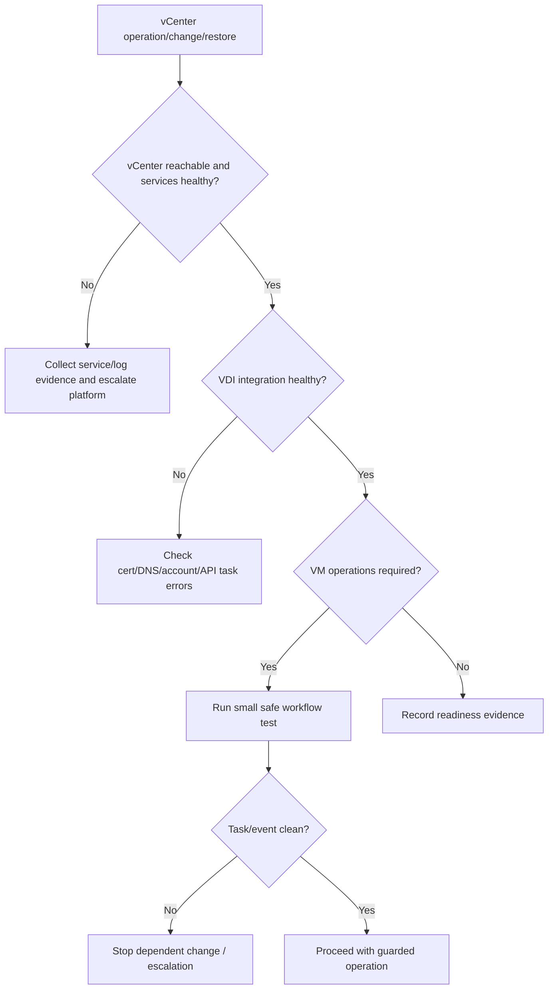

## Summary

Shard này bao phủ vCenter Server Installation and Setup và vCenter Server Upgrade trong corpus vSphere 8.0. Với VDI, vCenter là control dependency của Horizon và có thể là hypervisor connection của CVAD: nếu vCenter mất, VDI session đang chạy có thể vẫn chạy, nhưng provisioning, power operation, image publish, snapshot, host maintenance và inventory management sẽ bị ảnh hưởng.

## Chapter Knowledge Insight Report

Báo cáo insight của chương này biến vCenter từ một thành phần quản trị quen thuộc thành mô hình control plane cho vận hành VDI. Insight chính là: vCenter không nhất thiết nằm trên đường dữ liệu phiên người dùng, nhưng nó là nơi phát sinh, kiểm soát và ghi bằng chứng cho rất nhiều thao tác sống còn như provisioning, power task, snapshot, template, host maintenance, backup/restore và upgrade.

Các nội dung VCSA, deployment, DNS/time, backup/restore, upgrade, repoint, logs và support bundle là `Source-backed` từ lines 90798-103073. Việc phân biệt control plane với user session data path trong VDI là `Inference from source`. Topology vCenter, SSO domain, backup target, restore runbook, service account của Horizon/CVAD và RPO/RTO khách hàng là `Need Customer Confirmation`.

## Central Knowledge Thesis

**Thesis:** Trong VDI, vCenter là control plane của hạ tầng VM: nó không luôn nằm trên data path của session đang chạy, nhưng lại quyết định khả năng tạo, bật/tắt, snapshot, publish image, di chuyển và quan sát desktop VM. Khi vCenter lỗi hoặc sau upgrade có thay đổi hành vi, user session hiện hữu có thể chưa rớt ngay, nhưng vận hành pool/catalog và xử lý incident sẽ bị giới hạn mạnh. Vì vậy engineer phải tách câu hỏi "user còn dùng được không" khỏi câu hỏi "operations còn điều khiển được VM không". Bằng chứng cốt lõi nằm ở vCenter service health, task/event, backup/restore record và integration postcheck với Horizon/CVAD.

## Insight and Depth Control

| Trường | Giá trị |
|---|---|
| Depth target | Complete required insight and technical extraction sections |
| Character target | No fixed minimum |
| Required insight sections completed | Yes |
| Required technical sections completed | Yes |
| Chapter report thesis present | Yes |
| Insight report reads independently | Yes |
| Source-backed vs inference separated | Yes |
| Depth Exception | Not applicable |

## Runbook Best Practices Extracted

### Runbook Inventory

| Runbook ID | Tên runbook | Dùng khi nào | Đối tượng thực hiện | Mức rủi ro | Source locator |
|---|---|---|---|---|---|
| RB-01 | vCenter dependency precheck cho VDI operations | Daily hoặc trước provisioning/image/change lớn | System Engineer / Platform Admin | High | Lines 90798-103073 |
| RB-02 | vCenter backup/restore validation cho VDI | Trước upgrade, DR test hoặc sau restore | Platform Admin / DR Owner | High | Lines 90798-103073 |
| RB-03 | vCenter upgrade postcheck với Horizon/CVAD integration | Sau upgrade/patch vCenter | Platform Admin / VDI Owner | High | Lines 90798-103073 |

### RB-01 - vCenter dependency precheck cho VDI operations

**Mục tiêu:** Xác nhận vCenter đủ khỏe để xử lý power, provisioning, snapshot, template và host maintenance workflow của VDI.

**Khi áp dụng:**
- Trigger: Daily ops, trước image publish, trước mở rộng pool/catalog, trước host maintenance.
- Phạm vi ảnh hưởng: vCenter task, inventory, desktop VM, template, datastore/network mapping.
- Không áp dụng khi: Chỉ kiểm tra user protocol path không liên quan thao tác vCenter.

**Điều kiện tiên quyết:**
- Quyền truy cập: vCenter read access, task/event access.
- Công cụ/console: vSphere Client, VAMI nếu có quyền, Horizon/CVAD console nếu cần.
- Thông tin đầu vào: vCenter FQDN, SSO/domain, VDI integration endpoint, affected cluster.
- Customer confirmation cần có: vCenter topology, backup owner, service account mapping.

**Các bước thực hiện:**

| Bước | Hành động | Expected normal | Abnormal signal | Evidence cần lưu |
|---|---|---|---|---|
| 1 | Kiểm tra vSphere Client/vCenter service reachability | Login thành công, services healthy | UI/API unavailable, service degraded | Service/UI screenshot |
| 2 | Kiểm tra tasks/events gần nhất | Không có lỗi lặp lại | Power/clone/snapshot/permission/storage task fail | Task/event export |
| 3 | Kiểm tra inventory path cho VDI objects | Cluster/folder/datastore/network visible | Missing inventory hoặc stale object | Inventory screenshot |
| 4 | Kiểm tra VDI integration nếu có change lớn | Horizon/CVAD thấy vCenter healthy | Connection/API error | Broker console evidence |

**Điểm dừng và rollback:**
- Stop condition: vCenter task/API không ổn định hoặc inventory thiếu.
- Rollback point: Hoãn image/provision/maintenance change.
- Không được làm: Chạy image publish hoặc bulk power operation khi vCenter đang lỗi.

**Escalation:**
- Escalate cho ai: vCenter/platform owner, VDI owner.
- Gói evidence tối thiểu: Service status, task/event, inventory path, broker integration error.
- Câu hỏi cần gửi khi escalation: vCenter lỗi control plane hay chỉ lỗi một workflow?

**Source grounding:**
- Source-backed: vCenter components, deployment, service/log/support bundle, upgrade.
- Inference from source: vCenter dependency precheck cho VDI operations.
- Need Customer Confirmation: Integration account và operational ownership.

### RB-02 - vCenter backup/restore validation cho VDI

**Mục tiêu:** Bảo đảm backup/restore vCenter không chỉ "restore appliance" mà còn phục hồi khả năng vận hành VDI.

**Khi áp dụng:**
- Trigger: Trước upgrade, DR test, sau restore hoặc khi xác minh backup định kỳ.
- Phạm vi ảnh hưởng: vCenter control plane, inventory, roles, certificates, VDI integration.
- Không áp dụng khi: Backup thuộc tầng khác không chứa vCenter.

**Các bước thực hiện:**

| Bước | Hành động | Expected normal | Abnormal signal | Evidence cần lưu |
|---|---|---|---|---|
| 1 | Xác nhận backup recent và restore target | Backup thành công, có retention | Backup lỗi hoặc retention không đủ | Backup job record |
| 2 | Kiểm tra DNS/time/cert sau restore/test | FQDN/time/cert hợp lệ | Cert/DNS/time mismatch | Validation screenshot |
| 3 | Kiểm tra hosts/datastores/networks visible | Inventory đầy đủ | Host disconnected, datastore/network missing | Inventory export |
| 4 | Kiểm tra VDI operation nhỏ | Power/query/snapshot test theo policy OK | Broker không thao tác được VM | Task/broker evidence |

**Điểm dừng và rollback:**
- Stop condition: Restore xong nhưng VDI operation fail.
- Rollback point: Restore lại backup khác hoặc failback theo DR runbook.
- Không được làm: Tuyên bố DR thành công chỉ vì VCSA bật lên.

**Escalation:**
- Escalate cho ai: DR owner, vCenter owner, VDI owner.
- Gói evidence tối thiểu: Backup job, restore log, inventory status, VDI operation test.
- Câu hỏi cần gửi khi escalation: Restore có giữ được identity/cert/integration dependency không?

**Source grounding:**
- Source-backed: File-based/image-based backup and restore, deployment requirements.
- Inference from source: Validate restore bằng VDI operations.
- Need Customer Confirmation: RPO/RTO, backup target, restore authority.

### RB-03 - vCenter upgrade postcheck với Horizon/CVAD integration

**Mục tiêu:** Xác nhận upgrade vCenter không phá các workflow VDI phụ thuộc API/inventory/task.

**Khi áp dụng:**
- Trigger: Sau patch/upgrade vCenter.
- Phạm vi ảnh hưởng: Provisioning, power operations, image publish, host maintenance.
- Không áp dụng khi: vCenter không tích hợp với VDI platform đang xét.

**Các bước thực hiện:**

| Bước | Hành động | Expected normal | Abnormal signal | Evidence cần lưu |
|---|---|---|---|---|
| 1 | Ghi vCenter build trước/sau | Build đúng target | Build mismatch hoặc service warning | Version screenshot |
| 2 | Kiểm tra vCenter tasks/events | Không có lỗi upgrade hoặc API | Task timeout, permission/cert/API error | Task/event export |
| 3 | Kiểm tra broker hypervisor connection | Connection healthy | Horizon/CVAD báo vCenter unavailable | Broker screenshot |
| 4 | Thực hiện VDI smoke workflow | Query VM, power small test, snapshot/template check OK | Workflow fail | Test result |

**Điểm dừng và rollback:**
- Stop condition: Broker integration hoặc vCenter task fail sau upgrade.
- Rollback point: vCenter backup/restore hoặc rollback plan approved.
- Không được làm: Rollout dependent VDI changes ngay sau upgrade chưa postcheck.

**Escalation:**
- Escalate cho ai: Platform owner, VDI owner, VMware/vendor support.
- Gói evidence tối thiểu: Build, upgrade log, task/event, broker integration error.
- Câu hỏi cần gửi khi escalation: Đây là cert/API/permission issue hay upgrade regression?

**Source grounding:**
- Source-backed: vCenter upgrade, logs, support bundle, component behavior changes.
- Inference from source: Postcheck qua Horizon/CVAD integration.
- Need Customer Confirmation: Broker connection details và approved test actions.

### Max-depth runbook layer for CH03

#### RACI and ownership

| Runbook | Responsible | Accountable | Consulted | Informed | Required access |
|---|---|---|---|---|---|
| RB-01 | System Engineer / Platform Admin | Platform Owner | VDI owner, DNS/Identity owner | NOC | vSphere Client, vCenter task/event, broker read view |
| RB-02 | Platform Admin / DR Owner | DR Manager | Backup owner, VDI owner, Security | Service owner | VAMI/backup console, restore logs, vCenter inventory |
| RB-03 | Change Owner | CAB / Platform Owner | VDI owner, VMware support | Helpdesk/NOC | vCenter upgrade logs, broker integration, task/event export |

#### Decision tree

#### Evidence pack by control-plane layer

| Layer | Evidence | Normal | Abnormal | Use |
|---|---|---|---|---|
| Appliance/service | vCenter service health, UI/API response | Reachable, services green | UI/API down, degraded service | Proves control-plane availability |
| Inventory | Hosts/datastores/networks/folders visible | Required objects visible | Missing/disconnected objects | Proves broker can target objects |
| Task/event | Task ID, error, object path, timestamp | No repeated failures | Permission/storage/network/API errors | RCA and escalation |
| Backup/restore | Backup job, restore log, DNS/time/cert validation | Recent backup and validated restore | Backup gap, cert/DNS mismatch | DR readiness |
| VDI integration | Broker connection and safe VM operation | Healthy connection and task success | Hypervisor connection failed | Service-level validation |

#### Postcheck and completion criteria

| Runbook | Pass criteria | Fail signal | If fail |
|---|---|---|---|
| RB-01 | vCenter reachable, inventory visible, tasks clean | API/UI failure, repeated VM task error | Stop dependent operation |
| RB-02 | Restore validates inventory and VDI workflow | VCSA up but broker/VM task fail | DR not complete; escalate |
| RB-03 | Build correct, services healthy, broker test pass | Cert/API/task/integration fail | Hold rollout and rollback/restore if approved |

#### Anti-patterns

| Anti-pattern | Vì sao nguy hiểm | Cách làm đúng |
|---|---|---|
| Xem vCenter restore thành công khi appliance bật | VDI operations có thể vẫn fail | Validate inventory, roles, cert, broker workflow |
| Upgrade xong chỉ kiểm tra login vSphere Client | Không chứng minh API/task cho VDI | Test broker connection và safe VM operation |
| Nhầm vCenter outage với full user-session outage | Có thể báo sai impact | Tách control plane khỏi active session data path |

#### Context variants

| Ngữ cảnh | Điều chỉnh runbook |
|---|---|
| Daily operations | RB-01: service health + repeated task failures |
| Pre-change | RB-01/RB-03 đầy đủ, freeze dependent VDI changes nếu warning |
| Incident bridge | Tách user session impact và operations impact |
| DR/Recovery | RB-02 bắt buộc, không kết thúc DR nếu VDI operation chưa pass |
| Audit/compliance | Backup/restore proof, upgrade logs, postcheck evidence |

#### Runbook Depth Score

| Runbook | Trigger/scope | RACI | Precheck | Decision tree | Steps/evidence | Evidence pack | Stop/rollback | Postcheck | Escalation | Anti-patterns | Grounding |
|---|---|---|---|---|---|---|---|---|---|---|---|
| RB-01 | Yes | Yes | Yes | Yes | Yes | Yes | Yes | Yes | Yes | Yes | Yes |
| RB-02 | Yes | Yes | Yes | Yes | Yes | Yes | Yes | Yes | Yes | Yes | Yes |
| RB-03 | Yes | Yes | Yes | Yes | Yes | Yes | Yes | Yes | Yes | Yes | Yes |

### Tutorial practice layer for CH03

| Runbook | Tutorial scenario | Open where / inspect what | Walkthrough notes | Sample observations | Handover note mẫu | Practice exercise |
|---|---|---|---|---|---|---|
| RB-01 | Trước image publish lớn, engineer cần xác nhận vCenter đủ khỏe để broker thực hiện clone, power, snapshot và inventory lookup. | Mở vSphere Client service/inventory/tasks, VAMI nếu có, Horizon/CVAD hypervisor connection. | Kiểm tra vCenter reachable, inventory visible, task/event sạch, rồi mới kiểm tra broker integration. Nếu vCenter task đã lỗi, không chạy workflow phụ thuộc. | `vSphere Client login OK but clone tasks timing out`; `Datastore visible in vCenter but broker connection unhealthy`; `Repeated permission event`. | `Precheck: vCenter dependency. Scope: image/pool. Findings: ... Evidence: service, task/event, broker connection. Decision: continue/stop.` | Học viên nhận vCenter task history và quyết định có nên chạy image publish không. |
| RB-02 | Sau restore vCenter trong DR test, appliance đã chạy nhưng cần chứng minh VDI operations phục hồi thật. | Mở backup/restore log, vCenter inventory, DNS/time/cert view, broker console, safe VM operation test. | Restore chỉ là bước đầu. Validate DNS/time/cert, host/datastore/network inventory và một workflow VDI an toàn. Nếu broker không thao tác VM được, DR chưa đạt. | `VCSA restored but hosts disconnected`; `Certificate warning after restore`; `Broker cannot power test VM`. | `DR validation: vCenter restore. Evidence: restore log, inventory, cert/time, VDI test. Status: pass/fail. Open questions: ...` | Học viên phân biệt "appliance restored" và "VDI service restored" qua 5 evidence. |
| RB-03 | vCenter vừa upgrade, cần xác nhận Horizon/CVAD integration còn dùng được trước khi mở thay đổi tiếp theo. | Mở vCenter version/build, upgrade logs, Tasks/Events, broker hypervisor connection, smoke test checklist. | Ghi build, kiểm tra lỗi upgrade/API/cert, kiểm tra broker connection và test VM operation nhỏ. Fail ở integration thì rollback/hold dependent changes. | `Build correct but broker reports certificate/API error`; `Power operation task succeeds`; `Upgrade log has warning but smoke test pass`. | `Post-upgrade: vCenter. Build: ... Integration: pass/fail. Evidence: logs, tasks, broker test. Next owner: ...` | Học viên nhận kết quả postcheck mixed và viết quyết định tiếp tục hay hold. |

### Mandatory Installation and Configuration Runbooks

| Source procedure / config heading | Procedure type | Runbook required? | Runbook ID | Nếu không tạo, lý do |
|---|---|---|---|---|
| Preparing for Deployment of the vCenter Server Appliance | Prepare | Yes | RB-04 | N/A |
| GUI/CLI Deployment of the vCenter Server Appliance | Deploy | Yes | RB-05 | N/A |
| File-Based Backup and Restore of vCenter Server | Backup / Restore | Yes | RB-06 | N/A |
| Image-Based Backup and Restore / Enhanced Linked Mode restore | Recovery | Yes | RB-07 | N/A |
| Repoint vCenter Server to another domain | Reconfigure / Migrate | Yes | RB-08 | N/A |
| Collect Deployment Logs / Export Support Bundle | Troubleshooting / Escalation | Yes | RB-09 | N/A |

### RB-04 - Tutorial: Chuẩn bị triển khai VCSA

**Tutorial scenario:** Khách hàng cần triển khai hoặc rebuild vCenter Server Appliance. Engineer phải chuẩn bị DNS, time, sizing, storage, network và thông tin deployment trước khi chạy installer.

| Bước | Thao tác thực hành | Expected normal | Abnormal signal | Evidence |
|---|---|---|---|---|
| 1 | Xác nhận FQDN, forward/reverse DNS, IP, gateway, VLAN | DNS/IP rõ và không trùng | FQDN không resolve hoặc reverse mismatch | DNS validation |
| 2 | Xác nhận time/NTP cho vCenter/ESXi/domain | Time sync | Time drift | NTP evidence |
| 3 | Chọn deployment size/storage theo inventory khách hàng | Size phù hợp | Unknown workload/host count | Sizing note |
| 4 | Chuẩn bị SSO/domain/admin/password handling theo policy | Owner và secret handling rõ | Credential chia sẻ không an toàn | Deployment worksheet |

**Walkthrough notes:** vCenter là control plane; lỗi DNS/time/cert từ đầu sẽ gây lỗi SSO, certificate và integration về sau. Không deploy khi FQDN/time chưa chắc.

**Practice exercise:** Học viên nhận worksheet thiếu reverse DNS và NTP; viết stop condition.

### RB-05 - Tutorial: Deploy VCSA bằng GUI hoặc CLI

**Tutorial scenario:** Engineer triển khai VCSA theo GUI hoặc CLI installer và cần tạo evidence đủ cho handover.

| Bước | Thao tác thực hành | Expected normal | Abnormal signal | Evidence |
|---|---|---|---|---|
| 1 | Mount/download installer đúng version | Installer đúng build | Build sai hoặc nguồn không rõ | Installer/build note |
| 2 | Chọn target ESXi/cluster/datastore/network | Target đúng plan | Sai datastore/network | Deployment screenshot/json |
| 3 | Nhập appliance config từ worksheet | FQDN/IP/SSO đúng | Typo hoặc DNS fail | Installer review |
| 4 | Theo dõi stage 1 và stage 2 | Completed | Deployment fail | Installer log |
| 5 | Login vSphere Client và ghi service health | Login OK | Service/cert/DNS warning | Post-deploy evidence |

**Rollback/undo:** Nếu deploy fail trước production integration, remove failed appliance theo process và redeploy từ worksheet đã sửa.

**Handover:** `VCSA deployed. Build: ... FQDN: ... SSO domain: ... Datastore/network: ... Service health: ...`

### RB-06 - Tutorial: Cấu hình file-based backup và restore test cho vCenter

**Tutorial scenario:** Trước upgrade hoặc go-live, engineer cần bảo đảm vCenter có backup có thể restore.

| Bước | Thao tác thực hành | Expected normal | Abnormal signal | Evidence |
|---|---|---|---|---|
| 1 | Mở VAMI/backup configuration | Backup target configured | No backup target | Backup config |
| 2 | Xác nhận protocol/path/credential/retention theo policy | Backup job thành công | Auth/path failure | Backup job result |
| 3 | Ghi restore prerequisites | Restore target and owner known | Không có restore owner | Restore runbook note |
| 4 | Thực hiện restore test nếu trong phạm vi | Inventory and service validate | Restore fail or integration fail | Restore test evidence |

**Postcheck:** vCenter reachable, hosts/datastores visible, VDI broker connection hoặc safe workflow pass.

### RB-07 - Tutorial: Image-based restore / Enhanced Linked Mode recovery validation

**Tutorial scenario:** Môi trường có restore image-based hoặc Enhanced Linked Mode. Engineer phải kiểm tra không chỉ appliance mà cả domain/link/inventory.

| Bước | Thao tác thực hành | Expected normal | Abnormal signal | Evidence |
|---|---|---|---|---|
| 1 | Xác định topology vCenter/ELM | Nodes/domain rõ | Unknown replication partner | Topology note |
| 2 | Restore theo runbook DR được approve | Restore completes | Node/domain mismatch | Restore log |
| 3 | Validate linked inventory, roles, licenses | Inventory and roles visible | Missing partner/role/license | Validation evidence |
| 4 | Validate VDI workflows | Broker operations pass | Integration fail | VDI smoke evidence |

**Need Customer Confirmation:** ELM topology, RPO/RTO, DR owner, restore authority.

### RB-08 - Tutorial: Repoint vCenter domain có kiểm soát

**Tutorial scenario:** vCenter cần repoint sang domain khác hoặc thay đổi domain relationship. Đây là change high-risk với identity/license/integration.

| Bước | Thao tác thực hành | Expected normal | Abnormal signal | Evidence |
|---|---|---|---|---|
| 1 | Xác nhận lý do repoint và topology hiện tại | Business/technical reason rõ | Không rõ mục tiêu | Change rationale |
| 2 | Kiểm tra license, SSO, identity source, integration dependency | Dependency documented | Unknown service account/broker impact | Dependency map |
| 3 | Backup trước repoint | Backup valid | Backup missing | Backup evidence |
| 4 | Thực hiện repoint theo approved window | Task complete | Repoint fail / login issue | Task/log |
| 5 | Postcheck roles, login, VDI integration | Admin/service workflows pass | Permission/API/login fail | Postcheck |

**Anti-patterns:** repoint khi chưa backup; không map service account; không test broker operations.

### RB-09 - Tutorial: Thu deployment log/support bundle khi vCenter deploy/upgrade fail

**Tutorial scenario:** Deployment hoặc upgrade vCenter fail, cần gửi evidence cho platform/vendor.

| Bước | Thao tác thực hành | Expected normal | Abnormal signal | Evidence |
|---|---|---|---|---|
| 1 | Ghi stage fail và timestamp | Stage rõ | Không biết fail ở stage nào | Timeline |
| 2 | Collect deployment logs/support bundle | Bundle/log available | Collection fail | Bundle reference |
| 3 | Thu DNS/time/cert/input worksheet | Inputs rõ | Input mismatch | Worksheet evidence |
| 4 | Gửi escalation package | Owner nhận đủ dữ liệu | Vendor hỏi lại basic info | Escalation ticket |

**Practice exercise:** Học viên nhận deployment failure summary và liệt kê evidence còn thiếu trước khi escalate.

## Coverage

| Trường | Giá trị |
|---|---|
| Raw file | `raw/sources/vmware-vsphere-8-0.txt` |
| Line range | 90798-103073 |
| Source locator | vCenter Server Installation and Setup; vCenter Server Upgrade |
| Extraction status | Extracted |
| Overview | [[sources/vmware-vsphere-8-0]] |

## Why This Chapter Matters for VDI Training

vCenter là control dependency của Horizon và có thể là control dependency của CVAD khi dùng VMware. Nếu vCenter lỗi, user session đang chạy có thể chưa mất ngay, nhưng image publish, provisioning, power operation, host maintenance, snapshot và inventory task sẽ bị ảnh hưởng. Chương này dạy engineer phân biệt data-plane VDI còn chạy với control-plane vCenter đang hỏng.

## Reading Passes

| Pass | Kết quả |
|---|---|
| Structural Read | Tách vCenter install/setup, VCSA prerequisites, backup/restore và upgrade. |
| Technical Read | Bóc tách VCSA, SSO, certificate, DNS/time, deployment and backup objects. |
| Operational Read | Chuyển thành vCenter health, backup status, integration postcheck. |
| Failure Read | Tách failure mode: vSphere Client inaccessible, API task fail, restore incomplete. |
| Training Read | Chuyển thành backup/recovery checklist, vCenter dependency scenario. |

## Knowledge Atoms

| ID | Knowledge atom | Loại tri thức | Vì sao quan trọng trong VDI | Source locator | Dùng cho topic |
|---|---|---|---|---|---|
| KA-01 | VCSA là management VM chứa vCenter services và authentication services. | Architecture | VDI automation phụ thuộc vào vCenter control plane. | Lines 90798-103073 | [[topics/7_Hypervisor_and_HCI_Operations_Guide]] |
| KA-02 | vCenter backup là precheck bắt buộc trước upgrade. | Backup | Nếu upgrade fail, restore là đường recovery chính. | Lines 90798-103073 | [[topics/22_VDI_Backup_and_Recovery_Guide]] |
| KA-03 | Restore vCenter phải validate Horizon/CVAD integration. | Recovery | Restore login vSphere thành công chưa đủ chứng minh VDI operation OK. | Lines 90798-103073 | [[topics/23_VDI_High_Availability_and_Disaster_Recovery_Guide]] |
| KA-04 | DNS/time/certificate sai có thể gây lỗi login/API/integration. | Troubleshooting | Lỗi vCenter có thể nhìn giống lỗi broker provisioning. | Lines 90798-103073 | [[topics/6_Identity_and_Domain_Integration_Guide]] |
| KA-05 | vCenter upgrade có thể làm thay đổi behavior của workflow/API. | Change | Image/pool operation có thể fail sau upgrade. | Lines 90798-103073 | [[topics/21_VDI_Patch_and_Upgrade_Guide]] |
| KA-06 | Service account integration phải được test sau restore/upgrade. | RBAC | Thiếu quyền làm provisioning/power task fail. | Lines 90798-103073 | [[topics/24_VDI_Access_Control_and_RBAC_Guide]] |
| KA-07 | vCenter task/event là evidence chính khi VDI power/provision fail. | Evidence | Giúp phân biệt broker lỗi hay vCenter task lỗi. | Lines 90798-103073 | [[topics/25_VDI_Support_and_Escalation_Guide]] |
| KA-08 | Enhanced Linked Mode nếu có làm recovery phức tạp hơn. | Architecture | Multi-vCenter/SSO ảnh hưởng DR và admin scope. | Lines 90798-103073 | [[topics/23_VDI_High_Availability_and_Disaster_Recovery_Guide]] |
| KA-09 | VCSA resource/disk health cần được monitoring. | Monitoring | vCenter down làm mất control operation. | Lines 90798-103073 | [[topics/15_VDI_Monitoring_and_Alerting_Guide]] |
| KA-10 | vCenter không nằm trực tiếp trong user protocol path nhưng nằm trong operations path. | Training | Engineer cần tránh kết luận sai khi user session còn chạy. | Lines 90798-103073 | [[topics/1_VDI_Foundation_Overview]] |

## Architecture Knowledge

- vCenter Server Appliance là management VM chạy vCenter services, authentication services, certificate authority và vSphere Client.
- vCenter upgrade ảnh hưởng API/task layer mà Horizon/CVAD thường dùng để quản lý VM.
- vCenter backup/restore, DNS, NTP/time, certificate, SSO và Enhanced Linked Mode nếu có là dependency cho recovery.

## Operational Knowledge

| Thành phần / thao tác | Engineer cần hiểu gì | Khi nào kiểm tra | Evidence |
|---|---|---|---|
| VCSA health | vCenter appliance cần đủ resource và service khỏe | Daily check, trước VDI change | Appliance health |
| vCenter backup | Restore vCenter phụ thuộc backup hợp lệ | Trước upgrade, DR drill | Last backup status |
| DNS/time/cert | Sai DNS/cert/time gây login/API/integration lỗi | Khi vCenter/Horizon/CVAD task lỗi | DNS lookup, cert chain, time sync |
| Upgrade precheck | Upgrade có behavior changes | Trước vCenter patch/upgrade | Precheck report |
| Integration postcheck | Horizon/CVAD phải còn kết nối vCenter | Sau restore/upgrade | Broker console status, vCenter task test |

## Troubleshooting Knowledge

| Triệu chứng | Nguyên nhân có thể | Lớp cần kiểm tra | Evidence | Hướng xử lý | Escalation |
|---|---|---|---|---|---|
| Horizon/CVAD power/provision fail | vCenter service/API/permission issue | vCenter, Integration, RBAC | vCenter task error, broker error | Kiểm tra service, role, inventory, datastore | Escalate virtualization/platform |
| Không mở được vSphere Client | VCSA service, cert, DNS, resource | vCenter, DNS, Certificate | Browser error, service health | Kiểm tra appliance, DNS, certificate | Escalate vCenter owner |
| Sau vCenter upgrade, inventory/task lỗi | Upgrade regression or plugin/workflow change | Lifecycle, vCenter | Upgrade log, release note, task history | Dừng rollout, dùng backup/rollback plan nếu cần | Escalate VMware |
| Restore vCenter xong nhưng VDI vẫn lỗi | Chưa validate integration | Recovery, VDI Platform | Integration status, task test | Test Horizon/CVAD connection and VM operation | Escalate DR owner |

## Monitoring and Evidence

- vCenter service health.
- VCSA CPU/memory/disk.
- Backup success/failure.
- Certificate expiry.
- vCenter task failure trend.
- Horizon/CVAD integration status.

## Change, Patch and Rollback

- Change type: vCenter deploy, backup config, restore, upgrade, certificate, SSO/identity source.
- Precheck: backup success, service health, integration state, maintenance window.
- Impact: provisioning/power/image operations may pause or fail.
- Rollback point: file-based backup/image-based backup per approved method.
- Postcheck: vSphere Client login, host inventory, datastore, task creation, Horizon/CVAD integration.
- Stop condition: backup unavailable, integration fails in precheck, critical vCenter alarm.

## Backup, Recovery, HA and DR

- vCenter backup must be restore-tested.
- vCenter recovery validation must include VDI platform integration, not only vSphere login.
- If Enhanced Linked Mode exists, recovery is more complex and needs customer-specific runbook.

## Security and RBAC

- vCenter admin and SSO admin are high privilege.
- Backup artifacts and support bundles can contain sensitive config.
- Certificate and SSO changes require approval.

## Concepts to Create or Update

| Concept | Nội dung cần cập nhật | Source locator |
|---|---|---|
| [[concepts/vcenter-server-appliance]] | VCSA backup, service health, upgrade | Lines 90798-103073 |
| [[concepts/vcenter-server]] | API/control dependency for VDI | Lines 90798-103073 |
| [[concepts/backup-and-recovery]] | vCenter restore validation | Lines 90798-103073 |
| [[concepts/certificate-management]] | vCenter certificate dependency | Lines 90798-103073 |

## Topic Mapping

| Topic | Vì sao chunk này hỗ trợ |
|---|---|
| [[topics/7_Hypervisor_and_HCI_Operations_Guide]] | vCenter operations |
| [[topics/21_VDI_Patch_and_Upgrade_Guide]] | vCenter upgrade |
| [[topics/22_VDI_Backup_and_Recovery_Guide]] | vCenter backup/restore |
| [[topics/23_VDI_High_Availability_and_Disaster_Recovery_Guide]] | vCenter recovery dependency |
| [[topics/24_VDI_Access_Control_and_RBAC_Guide]] | vCenter admin/SSO access |

## Scenario Based Extraction

| Scenario | Bối cảnh | Triệu chứng | Câu hỏi cho engineer | Phân tích mong đợi | Evidence cần lấy | Escalation |
|---|---|---|---|---|---|---|
| vCenter down during business hours | vSphere Client không truy cập được. | User session cũ vẫn chạy, nhưng pool power operation fail. | Đây là data-plane hay control-plane issue? | Xác định user session không nhất thiết phụ thuộc vCenter tức thời, nhưng operations phụ thuộc. | vCenter service health, broker integration error, task failures. | Escalate virtualization/platform. |
| vCenter restore incomplete | Sau restore, vSphere Client login được. | Horizon/CVAD vẫn không provisioning được. | Đã validate service account và inventory chưa? | Kiểm tra host/datastore/network inventory và integration task test. | Restore record, integration status, task error. | Escalate DR owner/platform. |
| Certificate expired | Browser/API báo certificate error. | Admin hoặc integration có thể fail. | Certificate thuộc vCenter, SSO hay reverse proxy? | Kiểm tra certificate chain/expiry và change history. | Cert detail, timestamp, affected integration. | Escalate security/platform. |

## Training Conversion Notes

| Training asset | Nội dung lấy từ chương | Topic đích |
|---|---|---|
| Concept explanation | vCenter as VDI control dependency | [[topics/7_Hypervisor_and_HCI_Operations_Guide]] |
| Recovery checklist | vCenter restore validation for VDI | [[topics/22_VDI_Backup_and_Recovery_Guide]] |
| Scenario | vCenter down but sessions still run | [[topics/18_VDI_Troubleshooting_Playbook]] |
| RBAC note | Service account post-upgrade validation | [[topics/24_VDI_Access_Control_and_RBAC_Guide]] |

## Gaps

- Need Customer Confirmation: VCSA topology, backup schedule/location, restore test date, ELM usage, certificate process, Horizon/CVAD integration accounts.

## Chapter Self Review

- [x] Đã đọc đúng line range/chapter.
- [x] Có đủ 5 reading passes.
- [x] Có Knowledge Atoms.
- [x] Có architecture, operation, troubleshooting, monitoring/evidence.
- [x] Có change/rollback, backup/HA/DR, security/RBAC.
- [x] Có concept mapping, topic mapping, scenario, training conversion.
- [x] Có gaps và không bịa thông tin khách hàng.
