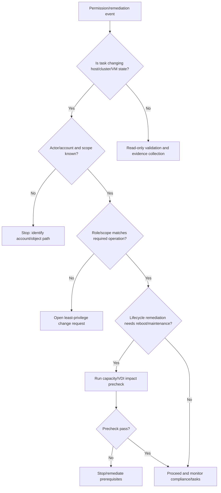

## Summary

Shard này bao phủ vSphere Authentication và Managing Host and Cluster Lifecycle. Với VDI, hai mảng này kết nối trực tiếp với quyền vận hành và tính ổn định của cluster: ai được thao tác gì trên vCenter/host, service account Horizon/CVAD có đủ quyền không, cluster lifecycle/desired image/host remediation có ảnh hưởng tới desktop VM không.

## Chapter Knowledge Insight Report

Báo cáo insight của chương này đặt identity/RBAC và lifecycle vào cùng một mô hình: ai được phép thay đổi state của cluster, và state đó được duy trì qua remediation như thế nào. Insight chính là: lỗi vận hành VDI có thể đến từ quyền sai scope hoặc từ lifecycle drift/remediation, dù triệu chứng phía trên chỉ là provisioning fail, power task fail hoặc host maintenance bị kẹt.

Các nội dung authentication, permission, role, certificate/lifecycle, desired image, remediation và host/cluster lifecycle là `Source-backed` từ lines 103074-123608. Việc diễn giải chúng thành mô hình "authority + desired state" cho VDI operations là `Inference from source`. Service account thực tế, quyền theo folder/cluster/datastore/network, approval model và remediation window của khách hàng là `Need Customer Confirmation`.

## Central Knowledge Thesis

**Thesis:** Trong vSphere cho VDI, vận hành an toàn cần hai điều kiện cùng lúc: đúng quyền thao tác và đúng desired state của host/cluster. Một service account có role sai scope có thể làm Horizon/CVAD không power/provision được VM; một remediation hoặc lifecycle change không được kiểm soát có thể reboot host hoặc thay đổi build trong lúc desktop đang phục vụ người dùng. Vì vậy engineer phải nhìn authentication/RBAC và lifecycle như một chuỗi kiểm soát state, không phải hai chủ đề rời rạc. Evidence cần chứng minh cả "ai/ứng dụng nào thực hiện thao tác" và "cluster/host đang tuân thủ desired image nào".

## Insight and Depth Control

| Trường | Giá trị |
|---|---|
| Depth target | Complete required insight and technical extraction sections |
| Character target | No fixed minimum |
| Required insight sections completed | Yes |
| Required technical sections completed | Yes |
| Chapter report thesis present | Yes |
| Insight report reads independently | Yes |
| Source-backed vs inference separated | Yes |
| Depth Exception | Not applicable |

## Runbook Best Practices Extracted

### Runbook Inventory

| Runbook ID | Tên runbook | Dùng khi nào | Đối tượng thực hiện | Mức rủi ro | Source locator |
|---|---|---|---|---|---|
| RB-01 | vSphere RBAC/service account validation | Trước provisioning/power/image workflow hoặc khi task permission denied | System Engineer / Security Admin | High | Lines 103074-123608 |
| RB-02 | Lifecycle remediation precheck | Trước host/cluster remediation hoặc desired image change | Platform Admin / Change Owner | High | Lines 103074-123608 |
| RB-03 | Permission-denied incident triage | Khi Horizon/CVAD/vCenter task fail vì quyền | System Engineer / Security Admin | Medium | Lines 103074-123608 |

### RB-01 - vSphere RBAC/service account validation

**Mục tiêu:** Xác nhận service account và admin role có quyền đúng scope để vận hành VDI mà không cấp quyền quá rộng.

**Khi áp dụng:**
- Trigger: Trước kết nối Horizon/CVAD với vCenter, sau thay đổi role, trước image/provisioning wave.
- Phạm vi ảnh hưởng: Folder, cluster, datastore, network, VM, template/snapshot.
- Không áp dụng khi: Tác vụ không dùng vCenter permission.

**Điều kiện tiên quyết:**
- Quyền truy cập: Read permission vào vSphere permissions/roles.
- Công cụ/console: vSphere Client, broker console, change record.
- Thông tin đầu vào: Service account name, object scope, required operations.
- Customer confirmation cần có: Least privilege policy, approval owner, service account inventory.

**Các bước thực hiện:**

| Bước | Hành động | Expected normal | Abnormal signal | Evidence cần lưu |
|---|---|---|---|---|
| 1 | Xác định service account đang dùng | Account rõ ràng, không dùng cá nhân | Unknown/shared admin account | Account mapping |
| 2 | Kiểm tra role và scope | Role áp dụng đúng folder/cluster/datastore/network | Role đúng tên nhưng sai scope | Permission screenshot |
| 3 | Test workflow nhỏ | Query/power/snapshot hoặc permitted task OK | Permission denied | Task error |
| 4 | Ghi approval nếu cần thay đổi quyền | Change approved | Grant global admin tạm thời | Approval record |

**Điểm dừng và rollback:**
- Stop condition: Thiếu quyền trên object scope production hoặc yêu cầu quyền quá rộng chưa approved.
- Rollback point: Role assignment trước change.
- Không được làm: Cấp Administrator global để "test nhanh" nếu không có approval.

**Escalation:**
- Escalate cho ai: Security admin, platform owner, VDI owner.
- Gói evidence tối thiểu: Task error, role/scope screenshot, account name, object path.
- Câu hỏi cần gửi khi escalation: Quyền thiếu là privilege nào và scope nào?

**Source grounding:**
- Source-backed: Authentication, roles, permissions.
- Inference from source: Service account validation cho VDI automation.
- Need Customer Confirmation: Least privilege design và approval path.

### RB-02 - Lifecycle remediation precheck

**Mục tiêu:** Tránh remediation/desired image change gây reboot hoặc drift ngoài kiểm soát đối với host chạy desktop VM.

**Khi áp dụng:**
- Trigger: Trước cluster image remediation, host patch, compliance remediation.
- Phạm vi ảnh hưởng: Host, VM placement, desktop sessions, HA/DRS capacity.
- Không áp dụng khi: Remediation chỉ là lab/non-production.

**Các bước thực hiện:**

| Bước | Hành động | Expected normal | Abnormal signal | Evidence cần lưu |
|---|---|---|---|---|
| 1 | Xác định desired image/current compliance | Compliance rõ | Host drift hoặc unknown desired state | Compliance report |
| 2 | Kiểm tra remediation có cần reboot/maintenance | Có window và capacity | Reboot/maintenance chưa approved | Remediation plan |
| 3 | Map affected VDI workload | VM/session impact rõ | Không biết pool/catalog nào trên host | Affected workload list |
| 4 | Chạy pilot/remediate từng phần | Remediation thành công, VDI postcheck OK | Host/VDI symptom sau remediation | Task/postcheck evidence |

**Điểm dừng và rollback:**
- Stop condition: Compliance unknown, capacity không đủ, pilot fail.
- Rollback point: Desired image/build trước đó theo policy.
- Không được làm: Remediate toàn cluster khi chưa biết active VDI impact.

**Escalation:**
- Escalate cho ai: Change owner, platform owner, VDI owner.
- Gói evidence tối thiểu: Compliance report, affected workload, remediation tasks, postcheck.
- Câu hỏi cần gửi khi escalation: Remediation có bắt buộc reboot host chạy production VDI không?

**Source grounding:**
- Source-backed: Host and cluster lifecycle, desired image, remediation.
- Inference from source: VDI-aware remediation gate.
- Need Customer Confirmation: Maintenance window, DRS/HA policy, rollback path.

### RB-03 - Permission-denied incident triage

**Mục tiêu:** Xử lý task fail do quyền bằng chứng cụ thể thay vì mở rộng quyền tùy tiện.

**Khi áp dụng:**
- Trigger: vCenter/Horizon/CVAD task báo permission denied hoặc unauthorized.
- Phạm vi ảnh hưởng: Provisioning, power, snapshot, datastore/network operation.
- Không áp dụng khi: Lỗi task do storage/network/host chứ không phải quyền.

**Các bước thực hiện:**

| Bước | Hành động | Expected normal | Abnormal signal | Evidence cần lưu |
|---|---|---|---|---|
| 1 | Lấy task error đầy đủ | Error nêu object/privilege | Error bị rút gọn, thiếu object | Task detail |
| 2 | Xác định account thực hiện task | Account đúng service | Account không mong đợi | Event/account evidence |
| 3 | Kiểm tra role/scope tại object path | Privilege đúng scope | Thiếu privilege hoặc sai inheritance | Role/scope screenshot |
| 4 | Đề xuất sửa quyền có approval | Least privilege change | Yêu cầu quyền quá rộng | Change request |

**Điểm dừng và rollback:**
- Stop condition: Không xác định được account/object/privilege.
- Rollback point: Role assignment trước thay đổi.
- Không được làm: Sửa quyền nhiều nơi mà không ghi scope.

**Escalation:**
- Escalate cho ai: Security admin/platform owner.
- Gói evidence tối thiểu: Error, account, object path, current role/scope.
- Câu hỏi cần gửi khi escalation: Có được cấp privilege tối thiểu tại scope này không?

**Source grounding:**
- Source-backed: Authentication and permissions.
- Inference from source: Permission-denied triage cho VDI workflows.
- Need Customer Confirmation: Role model và security approval.

### Max-depth runbook layer for CH04

#### RACI and ownership

| Runbook | Responsible | Accountable | Consulted | Informed | Required access |
|---|---|---|---|---|---|
| RB-01 | Security Admin / Platform Admin | Security Owner | VDI owner, app owner | Change owner | vSphere roles/permissions, broker service account inventory |
| RB-02 | Platform Admin | Platform Owner | VDI owner, CAB | NOC/Helpdesk | Lifecycle Manager, compliance report, cluster/host view |
| RB-03 | Incident Owner / System Engineer | Security Owner | Platform owner, VDI owner | Helpdesk/NOC | Task/event, permissions view, account audit evidence |

#### Decision tree

#### Evidence pack

| Evidence | Source | Proves | Required for |
|---|---|---|---|
| Account and object path | vCenter task/event | Which actor attempted what | RB-01/RB-03 |
| Role and privilege scope | vSphere Permissions | Whether least privilege is sufficient | RB-01/RB-03 |
| Compliance/desired image report | Lifecycle Manager | Host/cluster state and drift | RB-02 |
| Remediation task/event | vCenter/Lifecycle | What changed and when | RB-02 |
| VDI smoke evidence | Broker + vCenter task | Automation still works | All |

#### Postcheck and completion criteria

| Runbook | Pass criteria | Fail signal | If fail |
|---|---|---|---|
| RB-01 | Required workflow succeeds with least privilege | Permission denied or excessive privilege request | Adjust scoped role with approval |
| RB-02 | Compliance achieved and VDI smoke test passes | Remediation fail, host reboot surprise, pool impact | Stop rollout, rollback/hold host |
| RB-03 | Error maps to account/privilege/object | Unknown actor/scope or broad permission ask | Escalate security/platform with evidence |

#### Anti-patterns

| Anti-pattern | Vì sao nguy hiểm | Cách làm đúng |
|---|---|---|
| Cấp global admin để hết lỗi | Tạo rủi ro bảo mật và audit | Cấp privilege tối thiểu đúng scope |
| Remediate cluster không map desktop impact | Có thể reboot/di chuyển host gây gián đoạn | Compliance + capacity + affected workload precheck |
| Chỉ nhìn role name, không nhìn scope | Role đúng nhưng áp sai object vẫn fail | Kiểm tra inheritance/object path |

#### Context variants

| Ngữ cảnh | Điều chỉnh runbook |
|---|---|
| Daily operations | Review failed permission tasks and compliance warnings |
| Pre-change | RB-01/RB-02 đầy đủ, cần approval |
| Incident bridge | RB-03: account/object/privilege evidence trước khi sửa |
| DR/Recovery | Confirm restored roles/service accounts before VDI operations |
| Audit/compliance | Export role/scope and remediation evidence |

#### Runbook Depth Score

| Runbook | Trigger/scope | RACI | Precheck | Decision tree | Steps/evidence | Evidence pack | Stop/rollback | Postcheck | Escalation | Anti-patterns | Grounding |
|---|---|---|---|---|---|---|---|---|---|---|---|
| RB-01 | Yes | Yes | Yes | Yes | Yes | Yes | Yes | Yes | Yes | Yes | Yes |
| RB-02 | Yes | Yes | Yes | Yes | Yes | Yes | Yes | Yes | Yes | Yes | Yes |
| RB-03 | Yes | Yes | Yes | Yes | Yes | Yes | Yes | Yes | Yes | Yes | Yes |

### Tutorial practice layer for CH04

| Runbook | Tutorial scenario | Open where / inspect what | Walkthrough notes | Sample observations | Handover note mẫu | Practice exercise |
|---|---|---|---|---|---|---|
| RB-01 | Horizon/CVAD service account cần quyền vCenter để provision/power VM. Engineer phải xác nhận least privilege đúng scope. | Mở vSphere Permissions/Roles, object hierarchy, broker connection settings, task/event. | Xác định account thật, object path, role và scope. Test workflow nhỏ nếu được approve. Nếu thiếu quyền, đề xuất privilege tối thiểu, không cấp global admin. | `Role assigned at folder but datastore scope missing`; `Task says permission denied on network`; `Account is personal admin, not service account`. | `RBAC validation. Account: ... Scope: ... Missing privilege: ... Evidence: role screenshot/task error. Requested action: ...` | Học viên đọc một permission error và xác định cần kiểm tra role hay scope. |
| RB-02 | Cluster remediation planned; engineer phải xác định desired image/remediation có ảnh hưởng desktop VM không. | Mở Lifecycle Manager compliance, cluster/host view, DRS/HA capacity, affected VM/pool list. | Bắt đầu bằng compliance report, sau đó xác định reboot/maintenance need, affected workload và pilot. Nếu capacity/impact chưa rõ, không remediate. | `Host non-compliant but maintenance mode requires evacuation`; `DRS disabled`; `Affected pool contains active sessions`. | `Remediation precheck. Compliance: ... Impact: ... Capacity: ... Decision: proceed/stop. Evidence: ...` | Học viên nhận compliance report và chọn điều kiện nào yêu cầu dừng remediation. |
| RB-03 | vCenter task fail "permission denied" khi broker power on VM. Engineer cần phân tích account/privilege/object. | Mở vCenter task detail, Events, Permissions tab trên object liên quan, broker service account mapping. | Lấy task error nguyên văn, xác định account, object path và privilege. Nếu không rõ actor/scope, không sửa quyền. Escalate security với evidence. | `Permission denied on datastore browse`; `Account correct but inheritance blocked`; `Task done by unexpected account`. | `Permission incident. Task ID: ... Account: ... Object: ... Suspected missing privilege: ... Evidence attached: ...` | Học viên map 3 permission errors sang object scope cần kiểm tra. |

### Mandatory Installation and Configuration Runbooks

| Source procedure / config heading | Procedure type | Runbook required? | Runbook ID | Nếu không tạo, lý do |
|---|---|---|---|---|
| Configure identity source / authentication | Configure | Yes | RB-04 | N/A |
| Create or assign roles and permissions | Configure / RBAC | Yes | RB-05 | N/A |
| Configure lifecycle desired image / compliance | Configure / Remediate | Yes | RB-06 | N/A |
| Remediate host or cluster | Remediate | Yes | RB-07 | N/A |

### RB-04 - Tutorial: Cấu hình identity source cho vSphere

**Tutorial scenario:** vCenter cần dùng identity source để admin hoặc service account đăng nhập/quản trị đúng cách.

| Bước | Thao tác thực hành | Expected normal | Abnormal signal | Evidence |
|---|---|---|---|---|
| 1 | Xác nhận domain/identity source owner và DNS/time | Domain reachable, time sync | DNS/time/domain unreachable | Precheck evidence |
| 2 | Thêm/cấu hình identity source theo policy | Source visible and test login OK | Bind/login fail | Config screenshot |
| 3 | Test admin group login bằng account được approve | Login and role applies | Login OK but no permission | Test evidence |
| 4 | Ghi rollback/remove plan | Previous auth path known | Risk of admin lockout | Rollback note |

**Need Customer Confirmation:** domain type, bind account, MFA/conditional access, break-glass account.

### RB-05 - Tutorial: Tạo role và permission scope cho VDI service account

**Tutorial scenario:** Horizon/CVAD cần service account thao tác VM nhưng không nên được cấp quyền toàn cục.

| Bước | Thao tác thực hành | Expected normal | Abnormal signal | Evidence |
|---|---|---|---|---|
| 1 | Xác định workflow cần quyền: power, clone, snapshot, datastore, network | Required operations rõ | Không biết broker làm gì | Requirement note |
| 2 | Tạo/chọn role theo least privilege | Role có privilege cần thiết | Role quá rộng hoặc thiếu privilege | Role export |
| 3 | Gán permission đúng object scope | Folder/cluster/datastore/network scope đúng | Gán sai level hoặc thiếu inheritance | Permission screenshot |
| 4 | Test workflow nhỏ | Task succeeds | Permission denied | Task evidence |

**Practice exercise:** Học viên nhận permission denied trên datastore và phải xác định scope cần bổ sung.

### RB-06 - Tutorial: Cấu hình lifecycle desired image/compliance

**Tutorial scenario:** Platform muốn chuẩn hóa cluster bằng desired image. Engineer cần cấu hình mà không làm gián đoạn VDI.

| Bước | Thao tác thực hành | Expected normal | Abnormal signal | Evidence |
|---|---|---|---|---|
| 1 | Xác định desired image target | Image rõ, approved | Image không rõ source | Image evidence |
| 2 | Kiểm tra compliance report | Drift hiểu được | Unknown drift | Compliance export |
| 3 | Chọn pilot/remediation group | Pilot giới hạn | Toàn cluster without pilot | Pilot plan |
| 4 | Postcheck host build và VDI smoke | Build/compliance pass | Desktop impact | Postcheck |

**Anti-pattern:** Remediate toàn cluster khi chưa có affected workload và capacity check.

### RB-07 - Tutorial: Remediate host/cluster có kiểm soát

**Tutorial scenario:** Một hoặc nhiều host cần remediation để đạt compliance.

| Bước | Thao tác thực hành | Expected normal | Abnormal signal | Evidence |
|---|---|---|---|---|
| 1 | Kiểm tra active VDI workload và HA/DRS capacity | Có thể evacuate | Capacity warning | Capacity evidence |
| 2 | Remediate pilot host | Task completes | Remediation fail/reboot surprise | Task event |
| 3 | Validate compliance after remediation | Host compliant | Still non-compliant | Compliance report |
| 4 | Validate VDI login/launch/reconnect | User journey pass | Launch/reconnect fail | Smoke test |

**Handover:** `Remediation host: ... Compliance before/after: ... VDI postcheck: ... Rollout decision: ...`

## Coverage

| Trường | Giá trị |
|---|---|
| Raw file | `raw/sources/vmware-vsphere-8-0.txt` |
| Line range | 103074-123608 |
| Source locator | vSphere Authentication; Managing Host and Cluster Lifecycle |
| Extraction status | Extracted |
| Overview | [[sources/vmware-vsphere-8-0]] |

## Why This Chapter Matters for VDI Training

Authentication và lifecycle là hai mặt của control plane vSphere: ai được thao tác và thao tác lifecycle được áp dụng lên host/cluster như thế nào. Với VDI, chỉ một service account thiếu quyền hoặc remediation sai thời điểm cũng có thể làm image publish, provisioning hoặc host maintenance thất bại diện rộng.

## Reading Passes

| Pass | Kết quả |
|---|---|
| Structural Read | Tách authentication/permissions và host-cluster lifecycle/remediation. |
| Technical Read | Bóc tách identity source, role/permission, desired image, compliance, remediation. |
| Operational Read | Chuyển thành kiểm tra service account, role scope, compliance report, remediation plan. |
| Failure Read | Tách lỗi permission denied, admin login fail, remediation làm gián đoạn VDI. |
| Training Read | Chuyển thành module RBAC, patch/change governance và escalation evidence. |

## Knowledge Atoms

| ID | Knowledge atom | Loại tri thức | Vì sao quan trọng trong VDI | Source locator | Dùng cho topic |
|---|---|---|---|---|---|
| KA-01 | vSphere permissions kiểm soát mọi task của Horizon/CVAD trên vCenter. | RBAC | Thiếu quyền làm provisioning/power/snapshot fail. | Lines 103074-123608 | [[topics/24_VDI_Access_Control_and_RBAC_Guide]] |
| KA-02 | Role assignment phải đúng cả quyền và object scope. | Operation | Quyền đúng nhưng scope sai vẫn làm task fail. | Lines 103074-123608 | [[topics/11_VDI_Provisioning_and_Allocation_Guide]] |
| KA-03 | Identity source/SSO lỗi ảnh hưởng admin access. | Troubleshooting | Không quản trị được vCenter khi incident. | Lines 103074-123608 | [[topics/6_Identity_and_Domain_Integration_Guide]] |
| KA-04 | Lifecycle compliance report là precheck trước remediation. | Change | Host drift có thể gây patch không đồng nhất. | Lines 103074-123608 | [[topics/21_VDI_Patch_and_Upgrade_Guide]] |
| KA-05 | Remediation có thể reboot host hoặc thay component. | Change | Blast radius có thể là cả host/cluster VDI. | Lines 103074-123608 | [[topics/20_VDI_Change_Management_Guide]] |
| KA-06 | Desired image thay đổi là change cluster-level. | Lifecycle | Có thể ảnh hưởng nhiều host chạy desktop VM. | Lines 103074-123608 | [[topics/7_Hypervisor_and_HCI_Operations_Guide]] |
| KA-07 | Permission denied task là evidence rõ để phân tuyến security/platform. | Evidence | Tránh đổ lỗi nhầm cho broker. | Lines 103074-123608 | [[topics/25_VDI_Support_and_Escalation_Guide]] |
| KA-08 | Remediation cần check active VDI sessions/capacity. | Operation | Tránh gián đoạn user do host maintenance. | Lines 103074-123608 | [[topics/16_Daily_Operations_Checklist]] |
| KA-09 | RBAC thay đổi phải audit được. | Security | Quyền cao có thể gây rủi ro cấu hình hoặc dữ liệu. | Lines 103074-123608 | [[topics/10_VDI_Security_and_Policy_Management_Guide]] |
| KA-10 | Lifecycle state cần biết trong DR để tránh restore vào host không tương thích. | DR | DR fail nếu destination cluster không đúng lifecycle state. | Lines 103074-123608 | [[topics/23_VDI_High_Availability_and_Disaster_Recovery_Guide]] |

## Architecture Knowledge

- vSphere Authentication liên quan identity source, SSO, users/groups, roles and permissions.
- Host and Cluster Lifecycle quản lý desired state, remediation, compliance, images/baselines và update flow.
- Trong VDI, lifecycle change ở cluster có thể làm host reboot, evacuate VM, thay driver/firmware, hoặc thay behavior của VM operations.

## Operational Knowledge

| Thành phần / thao tác | Engineer cần hiểu gì | Khi nào kiểm tra | Evidence |
|---|---|---|---|
| Identity source | AD/LDAP/SSO source quyết định admin login | Login/admin access issue | Identity source config |
| Roles/permissions | Service account Horizon/CVAD cần quyền đúng scope | Provisioning/power/snapshot fail | Role assignment evidence |
| Lifecycle compliance | Host drift/non-compliance gây patch risk | Pre-maintenance | Compliance screenshot |
| Remediation | Có thể reboot host hoặc thay component | Change execution | Remediation plan |
| Cluster image | Desired image thay đổi nhiều host | Patch baseline/image update | Desired image/export |

## Troubleshooting Knowledge

| Triệu chứng | Nguyên nhân có thể | Lớp cần kiểm tra | Evidence | Hướng xử lý | Escalation |
|---|---|---|---|---|---|
| Horizon/CVAD không tạo/power VM | Service account thiếu permission | RBAC, vCenter | Task error, role assignment | So sánh quyền cần và scope object | Escalate platform/security |
| Admin không login được vCenter | Identity source/SSO issue | Authentication | Login error, identity source status | Kiểm tra AD/LDAP/SSO, cert/time | Escalate identity/vCenter |
| Remediation làm gián đoạn VDI | Host lifecycle không kiểm soát session/capacity | Change, Cluster | Remediation task, active VM list | Dừng remediation, validate maintenance plan | Escalate change owner |
| Cluster compliance fail | Host drift/image depot issue | Lifecycle | Compliance report | Sửa depot/image or host state | Escalate virtualization |

## Monitoring and Evidence

- Failed admin login and permission denied events.
- vCenter task failure due to privilege.
- Cluster compliance status.
- Remediation task status.
- Host reboot/maintenance events.

## Change, Patch and Rollback

- Change type: identity source, role/permission, cluster desired image, remediation, lifecycle manager configuration.
- Precheck: role export, active sessions, cluster capacity, compliance report.
- Impact: provisioning failure, host reboot, session disruption.
- Rollback point: role mapping evidence, previous image/baseline, change record.
- Postcheck: service account task test, host compliance, VDI login/launch.
- Stop condition: permission errors appear, host evacuation fails, cluster capacity insufficient.

## Backup, Recovery, HA and DR

- RBAC misconfiguration can block recovery even when infrastructure is up.
- Lifecycle state must be known in DR to avoid restoring into incompatible hosts.

## Security and RBAC

- Least privilege must be balanced with operational requirements for VDI service accounts.
- Separate helpdesk, system engineer, platform admin and security admin roles.
- Audit all permission and identity-source changes.

## Concepts to Create or Update

| Concept | Nội dung cần cập nhật | Source locator |
|---|---|---|
| [[concepts/identity-and-access-management]] | vSphere identity source and permissions | Lines 103074-123608 |
| [[concepts/lifecycle-management]] | Cluster desired state/remediation | Lines 103074-123608 |
| [[concepts/vcenter-server]] | Permission-controlled control plane | Lines 103074-123608 |
| [[concepts/change-management]] | Remediation as high-risk change | Lines 103074-123608 |

## Topic Mapping

| Topic | Vì sao chunk này hỗ trợ |
|---|---|
| [[topics/7_Hypervisor_and_HCI_Operations_Guide]] | Cluster lifecycle operations |
| [[topics/20_VDI_Change_Management_Guide]] | Remediation/permission change |
| [[topics/21_VDI_Patch_and_Upgrade_Guide]] | Lifecycle manager and desired image |
| [[topics/24_VDI_Access_Control_and_RBAC_Guide]] | Roles/permissions/service accounts |
| [[topics/25_VDI_Support_and_Escalation_Guide]] | Permission evidence for escalation |

## Scenario Based Extraction

| Scenario | Bối cảnh | Triệu chứng | Câu hỏi cho engineer | Phân tích mong đợi | Evidence cần lấy | Escalation |
|---|---|---|---|---|---|---|
| Service account thiếu quyền | Sau RBAC cleanup, Horizon không power VM. | Pool operation fail với permission denied. | Quyền thiếu hay object scope sai? | Kiểm tra role assignment tại đúng folder/cluster/datastore/network. | Task error, role mapping, affected object. | Escalate security/platform. |
| Remediation ngoài ý muốn | Lifecycle remediation chạy trong giờ làm việc. | Nhiều session disconnect do host reboot. | Remediation có change approval không? | Kiểm tra task timeline, active sessions, cluster capacity. | Remediation task, host events, change ticket. | Escalate change owner. |
| Admin không login vCenter | Admin console không truy cập được. | Không xử lý được incident. | Identity source hay SSO/certificate? | Kiểm tra SSO, AD/LDAP, time, certificate. | Login error, identity source status. | Escalate identity/vCenter. |

## Training Conversion Notes

| Training asset | Nội dung lấy từ chương | Topic đích |
|---|---|---|
| RBAC matrix | vSphere role/scope for VDI operations | [[topics/24_VDI_Access_Control_and_RBAC_Guide]] |
| Change checklist | Lifecycle remediation precheck | [[topics/20_VDI_Change_Management_Guide]] |
| Troubleshooting scenario | Permission denied provisioning | [[topics/18_VDI_Troubleshooting_Playbook]] |
| Daily checklist | Cluster lifecycle compliance | [[topics/16_Daily_Operations_Checklist]] |

## Gaps

- Need Customer Confirmation: AD/SSO identity source, service account roles, lifecycle manager method, approval process for remediation.

## Chapter Self Review

- [x] Đã đọc đúng line range/chapter.
- [x] Có đủ 5 reading passes.
- [x] Có Knowledge Atoms.
- [x] Có architecture, operation, troubleshooting, monitoring/evidence.
- [x] Có change/rollback, backup/HA/DR, security/RBAC.
- [x] Có concept mapping, topic mapping, scenario, training conversion.
- [x] Có gaps và không bịa thông tin khách hàng.
