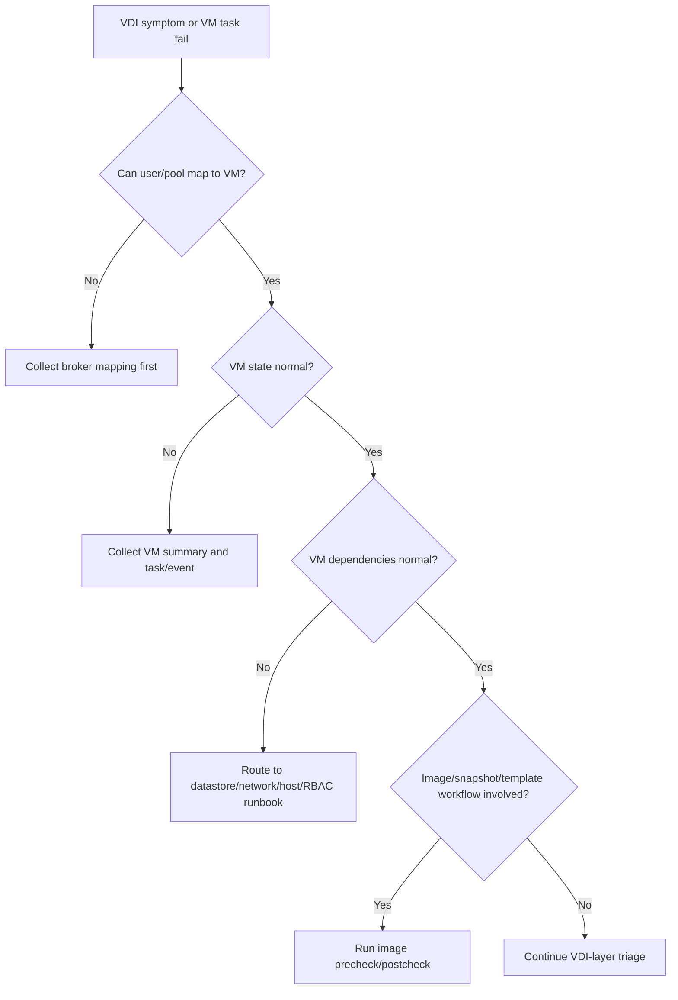

## Summary

Shard này bao phủ vCenter Server Configuration, vCenter Server and Host Management, và vSphere Virtual Machine Administration. Đây là vùng tri thức vận hành trực tiếp nhất cho VDI: VM power state, templates, snapshots, clone, migration, VMware Tools, VM hardware, folder/resource pool/datastore mapping và vCenter tasks.

## Chapter Knowledge Insight Report

Báo cáo insight của chương này xem VM administration như ngôn ngữ vận hành hằng ngày giữa nền tảng vSphere và VDI broker. Insight chính là: nhiều sự cố người dùng được báo ở Horizon/CVAD thực chất cần được đọc qua state của VM, task/event, template, snapshot, VMware Tools, inventory path và host placement trong vCenter.

Các nội dung vCenter configuration, host management, VM power operations, template, snapshot, VMware Tools, migration, task/event và inventory là `Source-backed` từ lines 123609-150042. Việc chuyển chúng thành mô hình chẩn đoán launch/provision/image của VDI là `Inference from source`. Naming convention, folder/resource pool/datastore layout, snapshot retention và quyền thao tác VM của khách hàng là `Need Customer Confirmation`.

## Central Knowledge Thesis

**Thesis:** Trong VDI, desktop không chỉ là một phiên người dùng mà còn là một VM có state, lịch sử task, network, storage, snapshot và guest tools. Khi user launch fail, pool thiếu máy hoặc image update lỗi, câu trả lời thường nằm trong quan hệ giữa broker request và vCenter VM operation. Vì vậy engineer phải biết đọc VM như một object vận hành: power state, VMware Tools, snapshot tree, task error, host placement, datastore và inventory scope. Chỉ khi nối được user symptom với VM evidence, escalation mới đủ chính xác.

## Insight and Depth Control

| Trường | Giá trị |
|---|---|
| Depth target | Complete required insight and technical extraction sections |
| Character target | No fixed minimum |
| Required insight sections completed | Yes |
| Required technical sections completed | Yes |
| Chapter report thesis present | Yes |
| Insight report reads independently | Yes |
| Source-backed vs inference separated | Yes |
| Depth Exception | Not applicable |

## Runbook Best Practices Extracted

### Runbook Inventory

| Runbook ID | Tên runbook | Dùng khi nào | Đối tượng thực hiện | Mức rủi ro | Source locator |
|---|---|---|---|---|---|
| RB-01 | VDI launch fail VM-state triage | Khi user không launch được desktop hoặc desktop unavailable | System Engineer / VDI Operator | Medium | Lines 123609-150042 |
| RB-02 | Master image snapshot/template precheck | Trước image publish hoặc rollback image | VDI Engineer / Platform Admin | High | Lines 123609-150042 |
| RB-03 | VM task/event RCA package | Khi cần RCA hoặc escalation cho VM operation fail | System Engineer / Incident Owner | Medium | Lines 123609-150042 |

### RB-01 - VDI launch fail VM-state triage

**Mục tiêu:** Nối symptom của user với state thật của VM trong vCenter.

**Khi áp dụng:**
- Trigger: Launch fail, desktop unavailable, black screen, machine stuck.
- Phạm vi ảnh hưởng: Một VM, nhóm VM theo host/datastore/network/pool.
- Không áp dụng khi: Lỗi dừng ở authentication/entitlement trước khi chọn VM.

**Điều kiện tiên quyết:**
- Quyền truy cập: Read access vào VM summary, tasks/events.
- Công cụ/console: vSphere Client, Horizon/CVAD console.
- Thông tin đầu vào: User, pool/catalog, VM name, incident time.
- Customer confirmation cần có: Naming convention và ownership boundary.

**Các bước thực hiện:**

| Bước | Hành động | Expected normal | Abnormal signal | Evidence cần lưu |
|---|---|---|---|---|
| 1 | Map user/pool sang VM name | VM xác định rõ | Không tìm thấy VM hoặc duplicate name | Broker mapping |
| 2 | Kiểm tra VM power state và host placement | Powered on, host healthy | Powered off/suspended/orphaned/host issue | VM summary |
| 3 | Kiểm tra VMware Tools/guest state | Tools running/guest responsive | Tools not running, guest hung | Tools status |
| 4 | Xem tasks/events quanh incident | Không có task fail | Power/snapshot/datastore/network task fail | Task/event export |

**Điểm dừng và rollback:**
- Stop condition: VM task fail do datastore/host/permission; chuyển đúng team.
- Rollback point: Không tự delete/recreate VM khi chưa rõ pool policy.
- Không được làm: Reset/power off desktop production nếu chưa có approval và user impact.

**Escalation:**
- Escalate cho ai: VDI owner, platform owner, storage/network/security nếu evidence chỉ ra.
- Gói evidence tối thiểu: VM state, host, datastore, tasks/events, broker error.
- Câu hỏi cần gửi khi escalation: Lỗi nằm ở broker request hay vCenter VM operation?

**Source grounding:**
- Source-backed: VM administration, power operations, tasks/events, VMware Tools.
- Inference from source: VM-state triage cho launch fail.
- Need Customer Confirmation: Allowed remediation actions.

### RB-02 - Master image snapshot/template precheck

**Mục tiêu:** Giảm rủi ro image publish fail hoặc rollback sai do snapshot/template/datastore không sẵn sàng.

**Khi áp dụng:**
- Trigger: Trước image update, snapshot, clone, template publish.
- Phạm vi ảnh hưởng: Pool/catalog, master image, datastore, VM hardware/tools.
- Không áp dụng khi: Image workflow không dùng vSphere snapshot/template.

**Các bước thực hiện:**

| Bước | Hành động | Expected normal | Abnormal signal | Evidence cần lưu |
|---|---|---|---|---|
| 1 | Xác định source VM/template và snapshot point | Đúng image/version | Sai VM hoặc snapshot cũ | Image object screenshot |
| 2 | Kiểm tra snapshot tree/datastore capacity | Snapshot gọn, datastore đủ | Snapshot chain sâu, datastore low | Snapshot/capacity evidence |
| 3 | Kiểm tra VMware Tools/guest shutdown state | Tools OK, OS clean | Tools lỗi hoặc pending reboot | Guest/tools status |
| 4 | Tạo rollback note và pilot scope | Rollback rõ, pilot giới hạn | Không có rollback point | Change record |

**Điểm dừng và rollback:**
- Stop condition: Snapshot/datastore/Tools bất thường hoặc source image không xác định.
- Rollback point: Snapshot/version trước đó theo image process.
- Không được làm: Xóa snapshot hoặc consolidate tùy tiện trên production image.

**Escalation:**
- Escalate cho ai: VDI image owner, platform/storage owner.
- Gói evidence tối thiểu: Source image, snapshot tree, datastore, task/event, rollback point.
- Câu hỏi cần gửi khi escalation: Image publish fail do image, datastore hay vCenter task?

**Source grounding:**
- Source-backed: Templates, snapshots, VMware Tools, VM tasks.
- Inference from source: Image precheck cho VDI.
- Need Customer Confirmation: Golden image process và retention policy.

### RB-03 - VM task/event RCA package

**Mục tiêu:** Chuẩn hóa evidence khi VM operation fail để escalation không thiếu dữ liệu.

**Khi áp dụng:**
- Trigger: Power, clone, snapshot, migration, reconfigure hoặc task fail.
- Phạm vi ảnh hưởng: VM, host, datastore, network, vCenter workflow.
- Không áp dụng khi: Incident không liên quan VM task.

**Các bước thực hiện:**

| Bước | Hành động | Expected normal | Abnormal signal | Evidence cần lưu |
|---|---|---|---|---|
| 1 | Lấy task ID/error/time/object | Task detail đầy đủ | Error chung chung | Task export |
| 2 | Lấy VM summary cùng thời điểm | State rõ | VM inaccessible/orphaned | VM summary |
| 3 | Lấy datastore/network/host liên quan | Dependencies healthy | Datastore full, wrong port group, host issue | Dependency evidence |
| 4 | Gắn timeline với change/incident | Có correlation rõ | Không có time window | Timeline |

**Điểm dừng và rollback:**
- Stop condition: Task fail lặp lại trên cùng dependency.
- Rollback point: Dừng bulk workflow, giữ nguyên evidence.
- Không được làm: Retry hàng loạt khi task fail chưa rõ nguyên nhân.

**Escalation:**
- Escalate cho ai: Platform owner hoặc dependency owner.
- Gói evidence tối thiểu: Task ID, event timeline, VM summary, dependency state.
- Câu hỏi cần gửi khi escalation: Dependency nào làm task fail và có workaround không?

**Source grounding:**
- Source-backed: vCenter tasks/events, VM admin operations.
- Inference from source: RCA package cho VDI VM workflow.
- Need Customer Confirmation: Evidence retention và escalation template.

### Max-depth runbook layer for CH05

#### RACI and ownership

| Runbook | Responsible | Accountable | Consulted | Informed | Required access |
|---|---|---|---|---|---|
| RB-01 | System Engineer / VDI Operator | Incident Owner | Platform owner, VDI owner | Helpdesk | Broker console, vCenter VM summary, tasks/events |
| RB-02 | VDI Image Engineer | VDI Owner | Platform/storage owner | Change owner | Template/snapshot/datastore/VM tools view |
| RB-03 | Incident Owner | Platform Owner | Storage/network/security as indicated | Service owner | vCenter task/event export, VM dependency view |

#### Decision tree

#### Evidence pack

| Evidence | Source | Proves | Used by |
|---|---|---|---|
| User/pool to VM mapping | Horizon/CVAD console | Correct object under investigation | RB-01 |
| VM power/tools/snapshot state | vSphere Client | Runtime and guest operation state | RB-01/RB-02 |
| Task/event ID and error | vCenter Tasks/Events | Operation failure point | RB-03 |
| Datastore/host/network dependency | VM summary | Infra boundary of failure | RB-01/RB-03 |
| Image object/version/rollback | Template/snapshot/change record | Image workflow safety | RB-02 |

#### Postcheck and completion criteria

| Runbook | Pass criteria | Fail signal | If fail |
|---|---|---|---|
| RB-01 | VM state normal or clear dependency identified | VM orphaned/off, Tools down, task failed | Route to dependency owner with evidence |
| RB-02 | Snapshot/template/datastore/tools ready and rollback point recorded | Snapshot chain, datastore risk, unknown source image | Stop image publish |
| RB-03 | RCA package has task ID, object, dependency and timeline | Missing time/object/error | Re-collect before escalation |

#### Anti-patterns

| Anti-pattern | Vì sao nguy hiểm | Cách làm đúng |
|---|---|---|
| Reset VM ngay khi user báo lỗi | Có thể mất dữ liệu/session và che mất evidence | Collect state/tasks first |
| Xem snapshot là backup | Snapshot growth có thể gây datastore/performance risk | Treat snapshot as temporary rollback point |
| Retry bulk clone/power task khi lỗi lặp lại | Có thể làm datastore/task queue tệ hơn | Stop, scope, collect task errors |

#### Context variants

| Ngữ cảnh | Điều chỉnh runbook |
|---|---|
| Daily operations | Review repeated VM task failures and snapshot warnings |
| Pre-change | RB-02 đầy đủ trước image publish |
| Incident bridge | RB-01/RB-03 evidence first, no blind reset |
| DR/Recovery | Confirm VM inventory, power, network, Tools, image source |
| Audit/compliance | Keep image version, snapshot, task ID, rollback record |

#### Runbook Depth Score

| Runbook | Trigger/scope | RACI | Precheck | Decision tree | Steps/evidence | Evidence pack | Stop/rollback | Postcheck | Escalation | Anti-patterns | Grounding |
|---|---|---|---|---|---|---|---|---|---|---|---|
| RB-01 | Yes | Yes | Yes | Yes | Yes | Yes | Yes | Yes | Yes | Yes | Yes |
| RB-02 | Yes | Yes | Yes | Yes | Yes | Yes | Yes | Yes | Yes | Yes | Yes |
| RB-03 | Yes | Yes | Yes | Yes | Yes | Yes | Yes | Yes | Yes | Yes | Yes |

### Tutorial practice layer for CH05

| Runbook | Tutorial scenario | Open where / inspect what | Walkthrough notes | Sample observations | Handover note mẫu | Practice exercise |
|---|---|---|---|---|---|---|
| RB-01 | User không launch được desktop; broker báo machine unavailable. Engineer cần kiểm tra VM state trước khi reset hoặc blame broker. | Mở broker console để map user->VM, vSphere VM summary, Tasks/Events, VMware Tools, host/datastore/network summary. | Map đúng VM, xem power/tools/host/datastore/network và task timeline. Nếu VM off do task fail, lấy task detail; nếu VM OK, chuyển VDI-layer triage. | `VM powered off with failed power-on task`; `Tools not running`; `VM on wrong host with datastore alarm`. | `Launch triage. User/VM: ... VM state: ... Task/event: ... Dependency signal: ... Next owner: ...` | Học viên nhận 4 VM states và chọn bước tiếp theo an toàn. |
| RB-02 | Trước khi publish master image, engineer cần xác nhận snapshot/template/datastore an toàn và rollback rõ. | Mở source VM/template, snapshot manager, datastore capacity, VMware Tools/guest state, change ticket. | Xác định image object đúng, kiểm tra snapshot tree, datastore headroom, Tools/guest state và rollback note. Nếu source image không rõ hoặc datastore rủi ro, stop. | `Snapshot tree has old snapshots`; `Template name mismatch`; `Datastore near threshold: Need Customer Confirmation`. | `Image precheck. Source: ... Snapshot: ... Datastore: ... Rollback: ... Decision: ...` | Học viên phân tích một snapshot tree và quyết định publish hay dừng. |
| RB-03 | Clone/power/snapshot task fail; engineer cần tạo RCA package đủ cho platform/storage/network/security. | Mở vCenter task detail, VM summary, dependency tabs, Events, change/incident timeline. | Lấy task ID, object, timestamp và error. Sau đó gắn dependency: datastore, host, network, permission. Retry chỉ sau khi failure layer rõ. | `Task timeout on datastore`; `Permission denied on network`; `Migration failed on host compatibility`. | `VM task RCA. Task ID: ... Error: ... Object: ... Dependency: ... Evidence: ... Escalation target: ...` | Học viên đọc task errors và route đúng owner với evidence tối thiểu. |

### Mandatory Installation and Configuration Runbooks

| Source procedure / config heading | Procedure type | Runbook required? | Runbook ID | Nếu không tạo, lý do |
|---|---|---|---|---|
| vCenter Server Configuration | Configure | Yes | RB-04 | N/A |
| Host management / add or configure host | Configure | Yes | RB-05 | N/A |
| Create/register/configure VM | Configure / Provision | Yes | RB-06 | N/A |
| Configure VM hardware, VMware Tools, templates and snapshots | Configure / Image | Yes | RB-07 | N/A |

### RB-04 - Tutorial: Cấu hình vCenter Server settings phục vụ VDI operations

| Bước | Thao tác thực hành | Expected normal | Abnormal signal | Evidence |
|---|---|---|---|---|
| 1 | Review vCenter general settings liên quan inventory/tasks/events | Settings rõ | Unknown config owner | Config note |
| 2 | Kiểm tra roles, alarms, tasks/events retention nếu có | Evidence retention phù hợp | Không đủ retention | Config screenshot |
| 3 | Validate service account workflows | Task success | Permission/API error | Task evidence |

**Tutorial note:** Đây là runbook cấu hình nền; không thay đổi setting nếu không có change/owner.

### RB-05 - Tutorial: Add/configure ESXi host trong vCenter

| Bước | Thao tác thực hành | Expected normal | Abnormal signal | Evidence |
|---|---|---|---|---|
| 1 | Xác định target datacenter/cluster/folder | Object path đúng | Add sai cluster/folder | Inventory path |
| 2 | Add host với FQDN/credential approved | Host connected | Cert/trust/login fail | Add-host task |
| 3 | Assign license/network/storage/HA-DRS policy theo baseline | Host matches cluster | Missing datastore/port group | Host summary |
| 4 | Validate VDI readiness | VM placement allowed | DRS/HA/network/storage warning | Readiness evidence |

### RB-06 - Tutorial: Tạo/register/configure VM cho VDI workflow

| Bước | Thao tác thực hành | Expected normal | Abnormal signal | Evidence |
|---|---|---|---|---|
| 1 | Xác định folder/resource pool/datastore/network | Placement đúng | Sai datastore/network | Placement note |
| 2 | Create/register VM hoặc clone theo policy | VM created/registered | Task fail | Task ID |
| 3 | Configure CPU/memory/disk/NIC theo template | VM matches spec | Config drift | VM config screenshot |
| 4 | Validate power/tools/network | VM reachable | Tools/network issue | Postcheck |

**Practice exercise:** Học viên chọn placement đúng cho VM VDI dựa trên folder/resource pool/datastore/network mapping.

### RB-07 - Tutorial: Cấu hình template, snapshot và VMware Tools cho master image

| Bước | Thao tác thực hành | Expected normal | Abnormal signal | Evidence |
|---|---|---|---|---|
| 1 | Xác định source VM/template | Source đúng version | Wrong image source | Image evidence |
| 2 | Kiểm tra VMware Tools và guest clean state | Tools OK | Tools stale/not running | Tools screenshot |
| 3 | Tạo snapshot/template theo change | Snapshot/template created | Task fail/datastore warning | Task evidence |
| 4 | Ghi rollback/version note | Rollback clear | Không biết rollback point | Version note |

**Anti-pattern:** Snapshot để lâu như backup; publish image khi source VM pending reboot.

## Coverage

| Trường | Giá trị |
|---|---|
| Raw file | `raw/sources/vmware-vsphere-8-0.txt` |
| Line range | 123609-150042 |
| Source locator | vCenter Server Configuration; vCenter Server and Host Management; vSphere Virtual Machine Administration |
| Extraction status | Extracted |
| Overview | [[sources/vmware-vsphere-8-0]] |

## Why This Chapter Matters for VDI Training

Đây là chương nối trực tiếp giữa vSphere và vận hành VDI hằng ngày. Desktop VM, template, snapshot, VMware Tools, power state, inventory path và vCenter task là nơi engineer kiểm tra khi user không launch được desktop, pool thiếu máy hoặc image publish lỗi.

## Reading Passes

| Pass | Kết quả |
|---|---|
| Structural Read | Tách vCenter config, host management và VM administration. |
| Technical Read | Bóc tách VM lifecycle, template, snapshot, VMware Tools, inventory, task/event. |
| Operational Read | Chuyển thành task kiểm tra VM state, Tools, snapshot, resource placement. |
| Failure Read | Tách lỗi power task, image publish, wrong network, snapshot consolidation. |
| Training Read | Chuyển thành checklist provisioning/image/troubleshooting. |

## Knowledge Atoms

| ID | Knowledge atom | Loại tri thức | Vì sao quan trọng trong VDI | Source locator | Dùng cho topic |
|---|---|---|---|---|---|
| KA-01 | VM power state là check đầu tiên khi desktop launch fail. | Operation | Broker có thể đúng nhưng VM không sẵn sàng. | Lines 123609-150042 | [[topics/18_VDI_Troubleshooting_Playbook]] |
| KA-02 | VMware Tools status ảnh hưởng guest visibility và operations. | Operation | Shutdown/reboot/status có thể sai nếu Tools lỗi. | Lines 123609-150042 | [[topics/7_Hypervisor_and_HCI_Operations_Guide]] |
| KA-03 | Snapshot/template là nền của master image workflow. | Architecture | Image publish/rollback phụ thuộc snapshot đúng. | Lines 123609-150042 | [[topics/12_Master_Image_Management_Guide]] |
| KA-04 | vCenter task/event là evidence chính cho VM operation failure. | Evidence | Cần timestamp và task error để RCA. | Lines 123609-150042 | [[topics/25_VDI_Support_and_Escalation_Guide]] |
| KA-05 | Inventory path sai có thể làm automation không tìm được object. | Troubleshooting | Folder/resource pool/datastore mapping ảnh hưởng provisioning. | Lines 123609-150042 | [[topics/11_VDI_Provisioning_and_Allocation_Guide]] |
| KA-06 | Network mapping của template ảnh hưởng toàn bộ VM được provision. | Change | Sai port group có thể làm VDI unreachable hàng loạt. | Lines 123609-150042 | [[topics/9_Network_Operations_for_VDI]] |
| KA-07 | Snapshot không phải backup dài hạn. | Backup | Snapshot tồn lâu làm datastore tăng và performance giảm. | Lines 123609-150042 | [[topics/22_VDI_Backup_and_Recovery_Guide]] |
| KA-08 | VM hardware compatibility cần align với host/vCenter. | Lifecycle | Hardware mismatch có thể gây lỗi sau upgrade. | Lines 123609-150042 | [[topics/21_VDI_Patch_and_Upgrade_Guide]] |
| KA-09 | Resource pool/placement ảnh hưởng capacity và performance. | Capacity | VDI có thể bị giới hạn tài nguyên nếu đặt sai. | Lines 123609-150042 | [[topics/19_VDI_Performance_and_Capacity_Guide]] |
| KA-10 | Move/reconfigure/delete VM là thao tác cần RBAC và audit. | Security | Có thể phá vỡ pool hoặc mất VM production. | Lines 123609-150042 | [[topics/24_VDI_Access_Control_and_RBAC_Guide]] |

## Architecture Knowledge

- vCenter configuration controls how hosts, clusters, inventory, certificates, services and integrations are managed.
- VM administration covers power operations, clone, template, snapshot, migration, VM hardware and VMware Tools.
- Horizon/CVAD provisioning depends on correct inventory objects: folder, datastore, resource pool/cluster, network and template/snapshot.

## Operational Knowledge

| Thành phần / thao tác | Engineer cần hiểu gì | Khi nào kiểm tra | Evidence |
|---|---|---|---|
| VM power state | Desktop VM must be powered/available for session | Launch fail, pool capacity issue | VM state, task event |
| Template/snapshot | Master image/pool operation depends on snapshot/template | Image publish/update | Snapshot tree, template name |
| VMware Tools | Affects guest operations and visibility | VM not responding, shutdown/reboot issue | Tools status |
| Resource pool/folder | Misplacement can break automation or permissions | Provisioning fail | Inventory path |
| vCenter tasks/events | Primary evidence for VM operation failure | Any provisioning/power/migration issue | Task/event timestamp |
| VM hardware compatibility | Must align with ESXi/vCenter support | Image/hardware upgrade | VM compatibility level |

## Troubleshooting Knowledge

| Triệu chứng | Nguyên nhân có thể | Lớp cần kiểm tra | Evidence | Hướng xử lý | Escalation |
|---|---|---|---|---|---|
| Desktop launch fail | VM off/suspended, Tools issue, task fail | VM, vCenter | VM state, Tools status, task error | Power/check VM, verify pool entitlement separately | Escalate virtualization if task fails |
| Image publish/recompose fail | Snapshot/template/datastore/resource pool issue | VM Admin, Storage, RBAC | Snapshot tree, template path, task error | Validate source image and target inventory | Escalate VDI platform/virtualization |
| VM stuck during power/migration | vCenter task lock, host/datastore issue | vCenter, Host, Storage | Task/event, host/datastore status | Avoid force actions without approval; collect evidence | Escalate platform |
| Many VMs in wrong network | Template/port group mapping issue | VM Admin, Network | VM network config, port group | Stop rollout, correct template/mapping | Escalate change owner |

## Monitoring and Evidence

- VM power state distribution by pool/catalog.
- VMware Tools running/not running.
- Snapshot count/age and consolidation warnings.
- vCenter failed tasks.
- VM migration/power/reconfigure events.
- Inventory path for affected VDI.

## Change, Patch and Rollback

- Change type: template update, snapshot creation/removal, VM hardware upgrade, network/datastore mapping change, resource pool/folder move.
- Precheck: backup/snapshot, active sessions, pool/catalog mapping, datastore capacity.
- Impact: mass provisioning failure, wrong network, unavailable desktops.
- Rollback point: previous snapshot/template and mapping evidence.
- Postcheck: pilot VM power/login/launch/profile/app access.
- Stop condition: pilot VM fails, task errors repeat, datastore/network alarm.

## Backup, Recovery, HA and DR

- Master image/template must be recoverable.
- Snapshot is not a backup; long-lived snapshots risk datastore growth and performance impact.
- DR must validate VM inventory, network, datastore, resource pool and service account rights.

## Security and RBAC

- VM admin rights should be scoped; helpdesk should not perform snapshot/template changes.
- Service accounts need enough rights for VDI automation but limited object scope.
- Audit VM reconfigure, delete, snapshot and migration operations.

## Concepts to Create or Update

| Concept | Nội dung cần cập nhật | Source locator |
|---|---|---|
| [[concepts/virtual-machine]] | VM state/tasks/tools/hardware | Lines 123609-150042 |
| [[concepts/snapshot]] | Snapshot use and risk | Lines 123609-150042 |
| [[concepts/vcenter-server]] | Tasks/events/inventory | Lines 123609-150042 |
| [[concepts/datastore]] | VM placement and capacity | Lines 123609-150042 |

## Topic Mapping

| Topic | Vì sao chunk này hỗ trợ |
|---|---|
| [[topics/11_VDI_Provisioning_and_Allocation_Guide]] | VM lifecycle and allocation |
| [[topics/12_Master_Image_Management_Guide]] | Template/snapshot/image management |
| [[topics/18_VDI_Troubleshooting_Playbook]] | VM task-based troubleshooting |
| [[topics/20_VDI_Change_Management_Guide]] | Template/snapshot/network mapping changes |
| [[topics/22_VDI_Backup_and_Recovery_Guide]] | Image/template recovery |

## Scenario Based Extraction

| Scenario | Bối cảnh | Triệu chứng | Câu hỏi cho engineer | Phân tích mong đợi | Evidence cần lấy | Escalation |
|---|---|---|---|---|---|---|
| Desktop launch fail | User click desktop nhưng không vào được. | Broker báo launch fail. | VM power state và Tools ra sao? | Kiểm tra VM state, Tools, vCenter task, Agent/VDA sau đó. | VM state, Tools status, task/event, pool name. | Escalate virtualization nếu power task fail. |
| Image publish lỗi | Master image update đang triển khai. | Pool update fail. | Snapshot/template/datastore/network mapping đúng chưa? | Kiểm tra source snapshot, template path, datastore capacity, task error. | Snapshot tree, task error, datastore free. | Escalate VDI platform/virtualization. |
| VM vào sai network | New VDI không register agent. | VM không reach broker/DC. | Port group trong template/pool có sai không? | So sánh working VM và failed VM network mapping. | VM NIC config, port group, VLAN, route test. | Escalate network/platform. |

## Training Conversion Notes

| Training asset | Nội dung lấy từ chương | Topic đích |
|---|---|---|
| Checklist | VM state, Tools, task/event, snapshot checks | [[topics/18_VDI_Troubleshooting_Playbook]] |
| Image flow | Template/snapshot validation | [[topics/12_Master_Image_Management_Guide]] |
| Provisioning task | Inventory path and datastore/network mapping | [[topics/11_VDI_Provisioning_and_Allocation_Guide]] |
| Evidence pack | vCenter tasks/events for escalation | [[topics/25_VDI_Support_and_Escalation_Guide]] |

## Gaps

- Need Customer Confirmation: Horizon/CVAD object mapping in vCenter, naming convention, snapshot retention policy, image rollback procedure.

## Chapter Self Review

- [x] Đã đọc đúng line range/chapter.
- [x] Có đủ 5 reading passes.
- [x] Có Knowledge Atoms.
- [x] Có architecture, operation, troubleshooting, monitoring/evidence.
- [x] Có change/rollback, backup/HA/DR, security/RBAC.
- [x] Có concept mapping, topic mapping, scenario, training conversion.
- [x] Có gaps và không bịa thông tin khách hàng.
