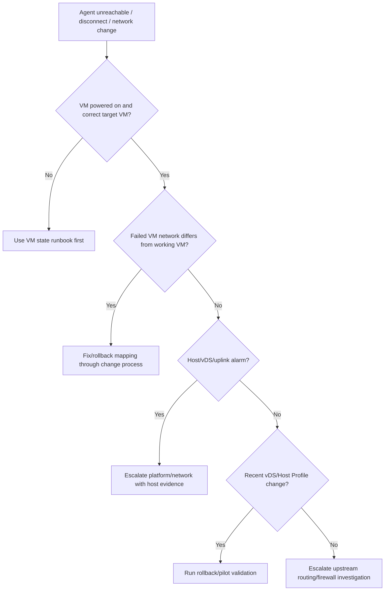

## Summary

Shard này bao phủ vSphere Host Profiles và vSphere Networking. Với VDI, networking sai là nguyên nhân điển hình của VDA/Horizon Agent unreachable, desktop launch fail, session disconnect, profile/app access failure và management outage. Host Profiles giúp chuẩn hóa host configuration nhưng cũng có thể đẩy cấu hình sai hàng loạt nếu change thiếu kiểm soát.

## Chapter Knowledge Insight Report

Báo cáo insight của chương này đặt networking và Host Profiles vào cùng một mô hình cấu hình lặp lại ở quy mô lớn. Insight chính là: network của VDI không chỉ là port group hay VLAN riêng lẻ, mà là một dependency chain từ physical uplink, vSwitch/vDS, VMkernel, port group, firewall, host profile và VM NIC mapping; sai ở một mắt xích có thể làm agent unreachable hoặc gây lỗi diện rộng.

Các nội dung Host Profiles, vSphere Networking, vSwitch/vDS, port group, uplink, VMkernel, firewall và rollback/recovery là `Source-backed` từ lines 150043-165229. Việc diễn giải Host Profiles như cơ chế vừa chuẩn hóa vừa có nguy cơ nhân rộng lỗi là `Inference from source`. VLAN, port group naming, uplink design, profile baseline, change approval và rollback owner của khách hàng là `Need Customer Confirmation`.

## Central Knowledge Thesis

**Thesis:** Trong VDI, network phải được hiểu như chuỗi ánh xạ giữa VM, host và hạ tầng vật lý, không phải chỉ là một cấu hình VLAN. Host Profiles và distributed networking giúp chuẩn hóa ở quy mô lớn, nhưng nếu baseline sai thì lỗi cũng lan ở quy mô lớn. Vì vậy engineer cần kiểm tra network theo đường đi: VM NIC -> port group -> vSwitch/vDS -> uplink -> VMkernel/service path -> firewall/routing. Evidence tốt nhất là so sánh VM lỗi với VM hoạt động, host lỗi với host khỏe, và thay đổi network gần nhất với thời điểm phát sinh triệu chứng.

## Insight and Depth Control

| Trường | Giá trị |
|---|---|
| Depth target | Complete required insight and technical extraction sections |
| Character target | No fixed minimum |
| Required insight sections completed | Yes |
| Required technical sections completed | Yes |
| Chapter report thesis present | Yes |
| Insight report reads independently | Yes |
| Source-backed vs inference separated | Yes |
| Depth Exception | Not applicable |

## Runbook Best Practices Extracted

### Runbook Inventory

| Runbook ID | Tên runbook | Dùng khi nào | Đối tượng thực hiện | Mức rủi ro | Source locator |
|---|---|---|---|---|---|
| RB-01 | VDI network path triage | Khi Agent/VDA unreachable, launch fail hoặc disconnect | System Engineer / Network-Platform Admin | High | Lines 150043-165229 |
| RB-02 | vDS/port group change precheck | Trước thay đổi port group, VLAN, uplink, vDS | Platform Admin / Network Admin | High | Lines 150043-165229 |
| RB-03 | Host Profile network compliance remediation | Khi host drift hoặc apply Host Profile | Platform Admin | High | Lines 150043-165229 |

### RB-01 - VDI network path triage

**Mục tiêu:** Khoanh vùng lỗi mạng theo chuỗi VM NIC -> port group -> vSwitch/vDS -> uplink -> routing/firewall.

**Khi áp dụng:**
- Trigger: VDA/Horizon Agent unreachable, desktop launch fail, session disconnect, profile/app path fail.
- Phạm vi ảnh hưởng: Một VM, một port group, một host, một cluster hoặc một VLAN.
- Không áp dụng khi: VM powered off hoặc broker entitlement fail trước network phase.

**Điều kiện tiên quyết:**
- Quyền truy cập: Read access VM network, host networking, port group.
- Công cụ/console: vSphere Client, network monitoring, broker console.
- Thông tin đầu vào: Failed VM, working VM, pool/catalog, time window.
- Customer confirmation cần có: VLAN map, firewall path, port group standard.

**Các bước thực hiện:**

| Bước | Hành động | Expected normal | Abnormal signal | Evidence cần lưu |
|---|---|---|---|---|
| 1 | So sánh NIC/port group của VM lỗi và VM khỏe | Cùng port group/VLAN expected | VM lỗi nằm sai port group | VM NIC screenshot |
| 2 | Kiểm tra host/vDS/uplink state | Uplinks healthy, no critical alarms | Uplink down, vDS warning | Network summary |
| 3 | Kiểm tra VMkernel/service path nếu liên quan | Management/storage/vMotion path OK | VMkernel issue hoặc route/firewall block | VMkernel evidence |
| 4 | Correlate với change gần nhất | Không có network change | Change trùng thời điểm lỗi | Change/timeline |

**Điểm dừng và rollback:**
- Stop condition: Sai port group/uplink down ảnh hưởng nhiều VM.
- Rollback point: Port group/VLAN/uplink config trước change.
- Không được làm: Mass edit port group khi chưa pilot một VM/host.

**Escalation:**
- Escalate cho ai: Network owner, platform owner, VDI owner.
- Gói evidence tối thiểu: VM NIC mapping, port group, host/uplink state, failed vs working comparison.
- Câu hỏi cần gửi khi escalation: Lỗi nằm ở virtual network mapping hay physical/network firewall path?

**Source grounding:**
- Source-backed: vSwitch/vDS, port group, VMkernel, firewall, networking.
- Inference from source: Network path triage theo VDI symptom.
- Need Customer Confirmation: VLAN/firewall/routing design.

### RB-02 - vDS/port group change precheck

**Mục tiêu:** Ngăn thay đổi distributed networking gây mất kết nối diện rộng cho desktop VM.

**Khi áp dụng:**
- Trigger: Trước đổi VLAN, port group, uplink, vDS policy hoặc migration network.
- Phạm vi ảnh hưởng: VM trên port group, host trong vDS, management/storage path nếu liên quan.
- Không áp dụng khi: Change lab không ảnh hưởng production.

**Các bước thực hiện:**

| Bước | Hành động | Expected normal | Abnormal signal | Evidence cần lưu |
|---|---|---|---|---|
| 1 | Liệt kê VM/host dùng port group/vDS | Scope rõ | Không biết impacted VMs | Impact export |
| 2 | Xác nhận rollback config | Có cấu hình trước change | Không có backup/rollback | Before screenshot |
| 3 | Kiểm tra pilot path | Pilot VM/host đại diện | Không có pilot hoặc test path | Pilot plan |
| 4 | Postcheck connectivity | Agent/VDA reachable, session OK | Agent unregister/disconnect | Postcheck result |

**Điểm dừng và rollback:**
- Stop condition: Pilot mất kết nối hoặc host/vDS alarm.
- Rollback point: Port group/VLAN/uplink config trước change.
- Không được làm: Áp dụng toàn vDS khi chưa biết affected scope.

**Escalation:**
- Escalate cho ai: Network admin, platform owner.
- Gói evidence tối thiểu: Affected scope, before/after config, pilot result, rollback action.
- Câu hỏi cần gửi khi escalation: Có route/firewall/VLAN upstream nào thay đổi cùng lúc không?

**Source grounding:**
- Source-backed: vDS, port group, networking rollback/recovery.
- Inference from source: VDI change guardrail cho vDS.
- Need Customer Confirmation: Network change authority.

### RB-03 - Host Profile network compliance remediation

**Mục tiêu:** Dùng Host Profiles để chuẩn hóa host nhưng tránh nhân rộng cấu hình mạng sai.

**Khi áp dụng:**
- Trigger: Host drift, host rebuild, apply profile hoặc compliance remediation.
- Phạm vi ảnh hưởng: Host networking, VMkernel, port groups, uplinks.
- Không áp dụng khi: Host profile không quản lý phần network đang xét.

**Các bước thực hiện:**

| Bước | Hành động | Expected normal | Abnormal signal | Evidence cần lưu |
|---|---|---|---|---|
| 1 | Kiểm tra compliance report | Drift rõ và explainable | Drift lớn không rõ nguyên nhân | Compliance report |
| 2 | So sánh profile với host khỏe | Baseline đúng | Baseline sai hoặc outdated | Profile comparison |
| 3 | Apply trên pilot host | Network giữ kết nối | Management/VM network bị ảnh hưởng | Task/event |
| 4 | Postcheck VDI workload | VM reachable, agent registered | Agent unreachable/disconnect | VDI smoke test |

**Điểm dừng và rollback:**
- Stop condition: Pilot host mất network hoặc VMkernel issue.
- Rollback point: Host/network config trước remediation.
- Không được làm: Apply Host Profile diện rộng khi baseline chưa được validate.

**Escalation:**
- Escalate cho ai: Platform owner, network owner.
- Gói evidence tối thiểu: Compliance report, profile diff, task/event, VDI postcheck.
- Câu hỏi cần gửi khi escalation: Baseline profile có còn khớp thiết kế production không?

**Source grounding:**
- Source-backed: Host Profiles và vSphere Networking.
- Inference from source: Host Profile remediation safety for VDI.
- Need Customer Confirmation: Baseline owner và rollback mechanism.

### Max-depth runbook layer for CH06

#### RACI and ownership

| Runbook | Responsible | Accountable | Consulted | Informed | Required access |
|---|---|---|---|---|---|
| RB-01 | System Engineer | Incident Owner | Network owner, Platform owner, VDI owner | Helpdesk/NOC | VM NIC, port group, host/vDS/uplink read view |
| RB-02 | Network/Platform Admin | Change Owner | VDI owner, Security | NOC/Helpdesk | vDS/port group config, change ticket |
| RB-03 | Platform Admin | Platform Owner | Network owner | VDI owner | Host Profile, compliance, host network view |

#### Decision tree

#### Evidence pack

| Evidence | Source | Proves | Used by |
|---|---|---|---|
| Failed vs working VM NIC/port group | vSphere Client | Mapping difference | RB-01 |
| vDS/port group before/after | vSphere Client / change record | Config delta | RB-02 |
| Host uplink/vmk state | Host networking view | Host or physical path issue | RB-01/RB-02 |
| Host Profile compliance diff | Host Profiles | Drift or baseline problem | RB-03 |
| Broker agent registration state | Horizon/CVAD | VDI symptom correlation | RB-01/RB-03 |

#### Postcheck and completion criteria

| Runbook | Pass criteria | Fail signal | If fail |
|---|---|---|---|
| RB-01 | VM on correct port group, agent reachable, no host/vDS alarm | Wrong port group, uplink alarm, repeated unregister | Escalate network/platform |
| RB-02 | Pilot VM/host connectivity OK before broad rollout | Pilot loses reachability or port group mismatch | Rollback and stop change |
| RB-03 | Compliance applied without network loss and VDI smoke passes | Host loses mgmt/VM connectivity | Rollback profile/config |

#### Anti-patterns

| Anti-pattern | Vì sao nguy hiểm | Cách làm đúng |
|---|---|---|
| Sửa port group hàng loạt vì một VM lỗi | Có thể gây outage nhiều pool | So sánh failed/working VM trước |
| Apply Host Profile khi baseline chưa validate | Nhân rộng cấu hình sai | Pilot host và diff baseline |
| Chỉ ping gateway rồi kết luận network OK | Không chứng minh broker/DC/profile/app path | Kiểm tra đúng path theo symptom |

#### Context variants

| Ngữ cảnh | Điều chỉnh runbook |
|---|---|
| Daily operations | Review vDS/uplink/port group alarms |
| Pre-change | RB-02 bắt buộc với affected VM export và rollback config |
| Incident bridge | RB-01: compare failed vs working object |
| DR/Recovery | Validate port group/VLAN mapping after restore/failover |
| Audit/compliance | Store Host Profile diff and change approval |

#### Runbook Depth Score

| Runbook | Trigger/scope | RACI | Precheck | Decision tree | Steps/evidence | Evidence pack | Stop/rollback | Postcheck | Escalation | Anti-patterns | Grounding |
|---|---|---|---|---|---|---|---|---|---|---|---|
| RB-01 | Yes | Yes | Yes | Yes | Yes | Yes | Yes | Yes | Yes | Yes | Yes |
| RB-02 | Yes | Yes | Yes | Yes | Yes | Yes | Yes | Yes | Yes | Yes | Yes |
| RB-03 | Yes | Yes | Yes | Yes | Yes | Yes | Yes | Yes | Yes | Yes | Yes |

### Tutorial practice layer for CH06

| Runbook | Tutorial scenario | Open where / inspect what | Walkthrough notes | Sample observations | Handover note mẫu | Practice exercise |
|---|---|---|---|---|---|---|
| RB-01 | Nhiều desktop trong một pool không register Agent/VDA sau khi VM được tạo. Engineer cần kiểm tra network path từ VM NIC tới upstream. | Mở VM hardware/NIC, port group, vDS/uplink view, host networking, broker registration state. | So sánh VM lỗi với VM khỏe. Nếu khác port group/VLAN, xử lý mapping. Nếu giống, kiểm tra host/uplink/vDS alarm rồi route network/platform. | `Failed VM on quarantine port group`; `Working VM uses same port group but host uplink alarm exists`; `No vDS alarm, firewall path suspected`. | `Network triage. Failed VM: ... Working VM: ... Port group/uplink: ... Evidence: ... Next owner: ...` | Học viên so sánh 2 VM NIC configs và xác định lỗi mapping hay upstream. |
| RB-02 | Network team chuẩn bị đổi VLAN/port group trên vDS chứa VDI workloads. Engineer cần kiểm soát blast radius. | Mở vDS/port group, VM list on port group, change ticket, before config screenshot, pilot VM test. | Đầu tiên export affected VMs. Chụp before config. Thực hiện pilot nhỏ và test agent/session. Rollback nếu pilot mất reachability. | `Port group has 600 desktop VMs`; `Pilot VM loses broker reachability`; `Before config missing`. | `vDS change. Scope: ... Before config: ... Pilot result: ... Decision: go/no-go. Rollback: ...` | Học viên nhận affected VM count và pilot result để viết quyết định CAB. |
| RB-03 | Host Profile compliance báo drift network; platform muốn apply profile. Engineer phải tránh đẩy cấu hình sai hàng loạt. | Mở Host Profiles compliance, profile diff, host networking, pilot host, VDI smoke test. | Đọc compliance diff, so sánh baseline với host khỏe. Apply pilot nếu approved. Nếu VMkernel/port group thay đổi bất thường, rollback. | `Profile wants to remove VMkernel adapter`; `Port group label differs from baseline`; `Pilot host passes VDI smoke`. | `Host Profile remediation. Drift: ... Pilot host: ... VDI postcheck: ... Evidence: ... Decision: ...` | Học viên đánh giá profile diff và chọn item nào cần customer confirmation. |

### Mandatory Installation and Configuration Runbooks

| Source procedure / config heading | Procedure type | Runbook required? | Runbook ID | Nếu không tạo, lý do |
|---|---|---|---|---|
| Create/configure standard switch, distributed switch, port group | Configure network | Yes | RB-04 | N/A |
| Configure VMkernel adapters and services | Configure network service | Yes | RB-05 | N/A |
| Configure uplinks, VLANs, NIC teaming / failover | Configure physical/virtual path | Yes | RB-06 | N/A |
| Create/apply Host Profile | Configure / Remediate | Yes | RB-07 | N/A |

### RB-04 - Tutorial: Tạo/cấu hình vSwitch/vDS/port group cho VDI

| Bước | Thao tác thực hành | Expected normal | Abnormal signal | Evidence |
|---|---|---|---|---|
| 1 | Xác định network purpose: desktop, management, storage, vMotion | Purpose rõ | Dùng chung không rõ ranh giới | Design note |
| 2 | Tạo hoặc chọn vSwitch/vDS theo chuẩn khách hàng | Switch đúng cluster/host | Host thiếu vDS membership | Switch screenshot |
| 3 | Tạo port group/VLAN label đúng naming | VLAN/label đúng | Sai VLAN/name | Port group evidence |
| 4 | Test pilot VM/adapter | Reachability pass | Agent/DC/broker unreachable | Test result |

**Practice exercise:** Học viên nhận 3 port group tên gần giống nhau và chọn port group đúng cho desktop network.

### RB-05 - Tutorial: Cấu hình VMkernel adapter cho management/storage/vMotion

| Bước | Thao tác thực hành | Expected normal | Abnormal signal | Evidence |
|---|---|---|---|---|
| 1 | Xác định service của VMkernel adapter | Service đúng mục đích | Bật sai service trên adapter | vmk config |
| 2 | Gán IP/VLAN/MTU theo design | Reachability OK | MTU/VLAN mismatch | Network test |
| 3 | Validate path tới vCenter/storage/vMotion peer | Path pass | Timeout/packet loss | Test evidence |
| 4 | Ghi owner và monitoring | Owner rõ | Không ai monitor path | Handover |

### RB-06 - Tutorial: Cấu hình uplink, VLAN, NIC teaming/failover

| Bước | Thao tác thực hành | Expected normal | Abnormal signal | Evidence |
|---|---|---|---|---|
| 1 | Xác định uplink physical mapping | Uplink map rõ | Unknown cabling/uplink | Uplink evidence |
| 2 | Cấu hình teaming/failover theo baseline | Redundancy đúng | Single uplink risk | Teaming screenshot |
| 3 | Validate failover/pilot nếu được approve | Traffic survives failover | Disconnect/session drop | Test result |
| 4 | Postcheck alarms/events | No critical alarm | Link/vDS alarm | Alarm evidence |

### RB-07 - Tutorial: Tạo/apply Host Profile cho network baseline

| Bước | Thao tác thực hành | Expected normal | Abnormal signal | Evidence |
|---|---|---|---|---|
| 1 | Extract profile từ host chuẩn đã validate | Baseline host healthy | Source host chưa chuẩn | Baseline note |
| 2 | Review captured network settings | Settings expected | Profile capture includes wrong transient config | Profile diff |
| 3 | Attach/apply to pilot host | Compliance pass | Network drift breaks path | Compliance/task |
| 4 | Rollout sau smoke test | VDI smoke pass | Agent/session issue | Smoke evidence |

## Coverage

| Trường | Giá trị |
|---|---|
| Raw file | `raw/sources/vmware-vsphere-8-0.txt` |
| Line range | 150043-165229 |
| Source locator | vSphere Host Profiles; vSphere Networking |
| Extraction status | Extracted |
| Overview | [[sources/vmware-vsphere-8-0]] |

## Why This Chapter Matters for VDI Training

VDI phụ thuộc rất mạnh vào network mapping đúng giữa VM, port group, VLAN, uplink, storage/vMotion/management network và broker/profile/application path. Một network change sai trên distributed switch hoặc Host Profile có thể ảnh hưởng nhiều host cùng lúc. Chương này giúp engineer chẩn đoán lỗi nhìn giống VDI nhưng gốc nằm ở mạng ảo.

## Reading Passes

| Pass | Kết quả |
|---|---|
| Structural Read | Tách Host Profiles và vSphere Networking. |
| Technical Read | Bóc tách vSwitch/vDS, port group, VMkernel, uplink, VLAN, rollback/recovery. |
| Operational Read | Chuyển thành kiểm tra VM network, host uplink, distributed switch, port group. |
| Failure Read | Tách lỗi Agent unreachable, session disconnect, wrong network, management loss. |
| Training Read | Chuyển thành network operations checklist và scenario rollback. |

## Knowledge Atoms

| ID | Knowledge atom | Loại tri thức | Vì sao quan trọng trong VDI | Source locator | Dùng cho topic |
|---|---|---|---|---|---|
| KA-01 | Port group mapping quyết định VM thuộc VLAN/network nào. | Architecture | Sai mapping làm Agent/VDA không register. | Lines 150043-165229 | [[topics/9_Network_Operations_for_VDI]] |
| KA-02 | vDS change có blast radius nhiều host. | Change | Một lỗi distributed switch có thể ảnh hưởng nhiều pool. | Lines 150043-165229 | [[topics/20_VDI_Change_Management_Guide]] |
| KA-03 | VMkernel network phục vụ management/storage/vMotion, không giống VM network. | Architecture | Cần tách path khi troubleshoot host và desktop. | Lines 150043-165229 | [[topics/7_Hypervisor_and_HCI_Operations_Guide]] |
| KA-04 | Uplink/NIC lỗi có thể gây disconnect theo host. | Troubleshooting | User thấy session rớt hàng loạt theo host. | Lines 150043-165229 | [[topics/18_VDI_Troubleshooting_Playbook]] |
| KA-05 | Network rollback/recovery là bắt buộc trước vDS change. | Change | Tránh mất management path. | Lines 150043-165229 | [[topics/20_VDI_Change_Management_Guide]] |
| KA-06 | Host Profile có thể chuẩn hóa hoặc nhân rộng cấu hình sai. | Operation | Compliance drift cần kiểm soát trước apply. | Lines 150043-165229 | [[topics/16_Daily_Operations_Checklist]] |
| KA-07 | Network evidence cần gồm VM NIC, port group, VLAN, host uplink. | Evidence | Ping đơn lẻ không đủ chứng minh nguyên nhân. | Lines 150043-165229 | [[topics/25_VDI_Support_and_Escalation_Guide]] |
| KA-08 | Internal VDI path gồm VM tới broker/DC/profile/app backend. | Operation | Lỗi không chỉ nằm ở client đến gateway. | Lines 150043-165229 | [[topics/5_VDI_Access_Flow_Design]] |
| KA-09 | Network change cần pilot host/VM trước rollout. | Change | Giảm blast radius trong VDI lớn. | Lines 150043-165229 | [[topics/20_VDI_Change_Management_Guide]] |
| KA-10 | Network ownership thường cần escalation cross-team. | Support | VDI engineer cần evidence đủ để chuyển network team. | Lines 150043-165229 | [[topics/25_VDI_Support_and_Escalation_Guide]] |

## Architecture Knowledge

- Host Profiles capture and apply host configuration consistency.
- vSphere Networking includes standard switches, distributed switches, port groups, VMkernel adapters, uplinks, VLAN and network rollback/recovery mechanisms.
- In VDI, there are separate traffic concerns: management, storage/vMotion, desktop VM network, broker/agent communication, profile/app/backend access.

## Operational Knowledge

| Thành phần / thao tác | Engineer cần hiểu gì | Khi nào kiểm tra | Evidence |
|---|---|---|---|
| Port group | VM network mapping depends on correct port group | VDI unreachable, wrong VLAN | VM network config |
| vDS/vSwitch | Central network config can affect many hosts | Network change/incident | Switch config screenshot/export |
| Uplink/NIC | Physical path impacts packet loss/disconnect | Session drop, host path alarm | NIC status/errors |
| VMkernel network | Management/storage/vMotion path dependency | Host management/storage issue | VMkernel config |
| Network rollback | Needed when change cuts management path | Network change | Before/after config |
| Host Profile | Enforces host config consistency | Host drift/compliance | Profile compliance |

## Troubleshooting Knowledge

| Triệu chứng | Nguyên nhân có thể | Lớp cần kiểm tra | Evidence | Hướng xử lý | Escalation |
|---|---|---|---|---|---|
| VDA/Agent unreachable | VM port group/VLAN/firewall/uplink issue | VM Network, Host Network | VM NIC config, port group, ping/path evidence | Compare working vs failing VM/host/network | Escalate network/virtualization |
| Many VMs on one host disconnect | Host uplink/bond/physical NIC issue | Host Network | NIC errors, host events, affected VM list | Move workload if approved, check uplink | Escalate network/HCI |
| After network change, management lost | vDS/vSwitch/VMkernel misconfig | Management Network | Change diff, rollback config | Use rollback/recovery procedure | Escalate platform/network immediately |
| New pool uses wrong network | Template or provisioning network mapping wrong | VM Admin, Network | Template NIC, pool config | Stop provisioning, fix mapping | Escalate VDI/platform change owner |

## Monitoring and Evidence

- Port group/VLAN mapping.
- NIC/uplink error counters.
- Distributed switch health.
- Host management network reachability.
- Packet loss/latency between VDI and broker/profile/app/DC.
- vCenter network task/event.

## Change, Patch and Rollback

- Change type: vDS/vSwitch, port group, VLAN, uplink, VMkernel, Host Profile application.
- Precheck: export config, identify affected clusters/pools, confirm out-of-band access, pilot host.
- Impact: mass disconnect, management loss, storage path issue.
- Rollback point: previous switch/port group/host profile config.
- Postcheck: host reachable, VDI launch, agent registration, profile/app access.
- Stop condition: management network unstable, pilot VM loses connectivity.

## Backup, Recovery, HA and DR

- Network config must be reproducible in DR site.
- HA failover is not useful if destination host/network mapping is wrong.
- Recovery validation must include broker-agent and VDI-backend paths.

## Security and RBAC

- Network changes require approval from network/security owners.
- Limit who can modify distributed switch and port groups.
- Audit port group and uplink changes.

## Concepts to Create or Update

| Concept | Nội dung cần cập nhật | Source locator |
|---|---|---|
| [[concepts/virtual-networking]] | vSwitch/vDS/port group/uplink | Lines 150043-165229 |
| [[concepts/firewall-ports]] | Network path evidence | Lines 150043-165229 |
| [[concepts/load-balancing]] | Related path dependency for VDI access | Lines 150043-165229 |
| [[concepts/change-management]] | Network rollback | Lines 150043-165229 |

## Topic Mapping

| Topic | Vì sao chunk này hỗ trợ |
|---|---|
| [[topics/9_Network_Operations_for_VDI]] | vSphere network operations |
| [[topics/18_VDI_Troubleshooting_Playbook]] | Agent unreachable/session disconnect |
| [[topics/20_VDI_Change_Management_Guide]] | Network change rollback |
| [[topics/23_VDI_High_Availability_and_Disaster_Recovery_Guide]] | Network consistency across HA/DR |

## Scenario Based Extraction

| Scenario | Bối cảnh | Triệu chứng | Câu hỏi cho engineer | Phân tích mong đợi | Evidence cần lấy | Escalation |
|---|---|---|---|---|---|---|
| New VDIs unregistered | Sau image/provisioning, nhiều VM không register. | Agent/VDA unreachable. | VM port group/VLAN có đúng không? | So sánh failed VM với working VM về NIC/port group/VLAN. | VM NIC, port group, VLAN, broker reachability. | Escalate network/platform. |
| vDS change gây mất management | Change network vừa thực hiện. | Host mất kết nối vCenter. | Có rollback/recovery path không? | Kiểm tra change diff, management VMkernel, uplink. | vDS config, host events, rollback record. | Escalate network/virtualization khẩn. |
| Session disconnect theo host | Nhiều user trên cùng host bị rớt. | Host vẫn online nhưng VM network lỗi. | Uplink/NIC/bond có lỗi không? | Khoanh theo host/uplink, kiểm tra packet loss/error counter. | NIC stats, affected VM list, host network events. | Escalate network/HCI. |

## Training Conversion Notes

| Training asset | Nội dung lấy từ chương | Topic đích |
|---|---|---|
| Network checklist | VM NIC, port group, VLAN, uplink, VMkernel | [[topics/9_Network_Operations_for_VDI]] |
| Change scenario | vDS rollback and management loss | [[topics/20_VDI_Change_Management_Guide]] |
| Troubleshooting table | Agent unreachable due to network mapping | [[topics/18_VDI_Troubleshooting_Playbook]] |
| Evidence guide | Network evidence package for escalation | [[topics/25_VDI_Support_and_Escalation_Guide]] |

## Gaps

- Need Customer Confirmation: VLAN/port group naming, vDS design, management/storage/VDI network separation, rollback method, network ownership.

## Chapter Self Review

- [x] Đã đọc đúng line range/chapter.
- [x] Có đủ 5 reading passes.
- [x] Có Knowledge Atoms.
- [x] Có architecture, operation, troubleshooting, monitoring/evidence.
- [x] Có change/rollback, backup/HA/DR, security/RBAC.
- [x] Có concept mapping, topic mapping, scenario, training conversion.
- [x] Có gaps và không bịa thông tin khách hàng.
