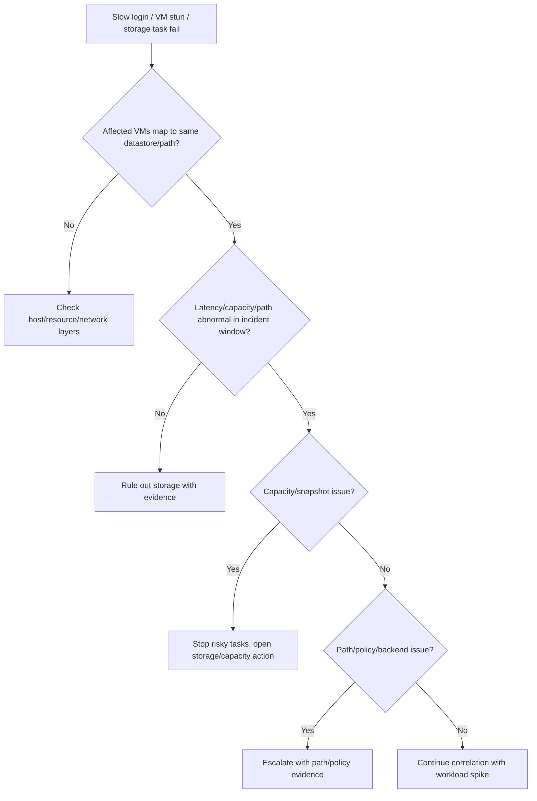

## Summary

Shard này bao phủ vSphere Storage. Với VDI, storage là lớp hay gây triệu chứng gián tiếp: login chậm, boot storm, logon storm, black screen, profile delay, VM stun, snapshot growth, provisioning slow và datastore full. Source này là nền để đào tạo engineer không chỉ nói “kiểm tra storage” mà biết kiểm tra datastore, path, latency, policy, capacity và snapshot.

## Chapter Knowledge Insight Report

Báo cáo insight của chương này chuyển storage từ một "nơi chứa VM" thành mô hình hiệu năng, placement và bằng chứng cho trải nghiệm VDI. Insight chính là: datastore còn dung lượng không đủ để kết luận storage khỏe; engineer phải đọc storage qua latency, path, policy, snapshot growth, VM stun, provisioning behavior và tương quan thời gian với login/boot storm.

Các nội dung datastore, VMFS, NFS, vSAN, VVols, storage policy, multipathing, datastore cluster, capacity và latency là `Source-backed` từ lines 165230-182830. Việc liên hệ các tín hiệu này với login chậm, launch slow, image publish và profile delay trong VDI là `Inference from source`. Storage backend thật, threshold latency, profile location, pool-to-datastore mapping và owner escalation là `Need Customer Confirmation`.

## Central Knowledge Thesis

**Thesis:** Trong VDI, storage là lớp biến tải đồng thời của người dùng thành latency, queue, snapshot growth và provisioning delay. Dung lượng datastore chỉ là một tín hiệu; trải nghiệm người dùng phụ thuộc vào việc VM disk, snapshot, template, profile path và storage path có đáp ứng đúng thời điểm hay không. Vì vậy engineer phải troubleshoot storage bằng tương quan thời gian: lúc user chậm, datastore nào tăng latency, host nào bị path issue, snapshot nào phình, task nào fail. Nếu không có evidence theo time window, rất dễ nhầm storage issue với lỗi broker, agent hoặc policy.

## Insight and Depth Control

| Trường | Giá trị |
|---|---|
| Depth target | Complete required insight and technical extraction sections |
| Character target | No fixed minimum |
| Required insight sections completed | Yes |
| Required technical sections completed | Yes |
| Chapter report thesis present | Yes |
| Insight report reads independently | Yes |
| Source-backed vs inference separated | Yes |
| Depth Exception | Not applicable |

## Runbook Best Practices Extracted

### Runbook Inventory

| Runbook ID | Tên runbook | Dùng khi nào | Đối tượng thực hiện | Mức rủi ro | Source locator |
|---|---|---|---|---|---|
| RB-01 | Datastore latency triage cho VDI slow | Khi login/launch/session chậm hoặc VM stun | System Engineer / Storage-Platform Admin | High | Lines 165230-182830 |
| RB-02 | Datastore capacity and snapshot growth guardrail | Daily, trước image publish hoặc khi datastore gần đầy | System Engineer / Platform Admin | High | Lines 165230-182830 |
| RB-03 | Storage policy/path escalation package | Khi provisioning/power/storage task fail hoặc path bất thường | Platform Admin / Storage Owner | High | Lines 165230-182830 |

### RB-01 - Datastore latency triage cho VDI slow

**Mục tiêu:** Chứng minh hoặc loại trừ storage latency như nguyên nhân login/launch chậm bằng time-correlated evidence.

**Khi áp dụng:**
- Trigger: Login storm, boot storm, black screen, session lag, VM stun.
- Phạm vi ảnh hưởng: Datastore, host, pool/catalog, profile/image workload.
- Không áp dụng khi: Chỉ một user/app lỗi không có signal storage.

**Điều kiện tiên quyết:**
- Quyền truy cập: vSphere performance read, datastore view.
- Công cụ/console: vSphere Client/Aria/storage dashboard nếu có.
- Thông tin đầu vào: Time window, affected VMs/pool, datastore mapping.
- Customer confirmation cần có: Latency threshold, storage backend owner, profile location.

**Các bước thực hiện:**

| Bước | Hành động | Expected normal | Abnormal signal | Evidence cần lưu |
|---|---|---|---|---|
| 1 | Map affected VMs/pool tới datastore | Scope rõ | Không biết datastore chứa VM/profile | VM-datastore mapping |
| 2 | Xem latency/IOPS/throughput quanh time window | Stable theo baseline | Latency spike khớp symptom | Perf chart |
| 3 | Kiểm tra host/storage path events | Path healthy | Path down/degraded/reset | Event/log summary |
| 4 | Correlate với backup/image/login storm | Không có contention rõ | Backup/image task/logon storm cùng lúc | Timeline |

**Điểm dừng và rollback:**
- Stop condition: Latency cao trên production datastore hoặc path issue.
- Rollback point: Dừng image/provisioning/backup task nếu thuộc quyền và được approve.
- Không được làm: Kết luận broker lỗi khi storage metric khớp symptom.

**Escalation:**
- Escalate cho ai: Storage/HCI owner, platform owner.
- Gói evidence tối thiểu: Time window, affected VMs, datastore chart, path events, task timeline.
- Câu hỏi cần gửi khi escalation: Latency đến từ backend, path, snapshot hay workload spike?

**Source grounding:**
- Source-backed: Datastore, storage types, performance, path/multipathing.
- Inference from source: VDI slow triage bằng storage correlation.
- Need Customer Confirmation: Threshold và backend design.

### RB-02 - Datastore capacity and snapshot growth guardrail

**Mục tiêu:** Ngăn datastore full, snapshot growth hoặc consolidation issue làm fail image/provisioning/power task.

**Khi áp dụng:**
- Trigger: Daily check, trước image publish, trước snapshot, khi capacity alarm.
- Phạm vi ảnh hưởng: VM disks, snapshots, templates, logs, pool/catalog.
- Không áp dụng khi: Storage không chứa VDI workload.

**Các bước thực hiện:**

| Bước | Hành động | Expected normal | Abnormal signal | Evidence cần lưu |
|---|---|---|---|---|
| 1 | Kiểm tra datastore free/capacity trend | Free space trong ngưỡng customer | Near full hoặc growth nhanh | Capacity chart |
| 2 | Kiểm tra snapshot tree/consolidation warnings | Snapshot kiểm soát | Snapshot chain sâu, consolidation needed | Snapshot evidence |
| 3 | Kiểm tra pending image/provision tasks | Không có burst ngoài kế hoạch | Bulk clone/image task sắp chạy | Task/change list |
| 4 | Ghi mitigation/owner | Owner rõ | Không ai sở hữu cleanup/expand | Ticket note |

**Điểm dừng và rollback:**
- Stop condition: Datastore gần đầy trước image/provisioning.
- Rollback point: Hoãn change, cleanup/expand theo approval.
- Không được làm: Xóa file datastore hoặc snapshot production tùy tiện.

**Escalation:**
- Escalate cho ai: Storage owner, VDI image owner, platform owner.
- Gói evidence tối thiểu: Capacity chart, snapshot list, affected VMs, pending tasks.
- Câu hỏi cần gửi khi escalation: Có thể expand datastore, cleanup snapshot, hay dời workload không?

**Source grounding:**
- Source-backed: Datastore, snapshot/storage impact, capacity.
- Inference from source: Capacity guardrail cho VDI image/provisioning.
- Need Customer Confirmation: Capacity threshold và snapshot policy.

### RB-03 - Storage policy/path escalation package

**Mục tiêu:** Chuẩn hóa evidence khi storage policy, multipathing hoặc datastore access gây task fail.

**Khi áp dụng:**
- Trigger: Power/provision/snapshot/migration fail với storage-related error.
- Phạm vi ảnh hưởng: Datastore, storage policy, path, host, affected VMs.
- Không áp dụng khi: Error do permission/network rõ ràng.

**Các bước thực hiện:**

| Bước | Hành động | Expected normal | Abnormal signal | Evidence cần lưu |
|---|---|---|---|---|
| 1 | Lấy task error và datastore object | Error/object rõ | Error thiếu object | Task detail |
| 2 | Kiểm tra datastore accessibility từ host liên quan | Accessible | Inaccessible/APD/PDL/path issue | Datastore/host status |
| 3 | Kiểm tra policy/compliance nếu dùng | Compliant | Non-compliant/wrong policy | Policy evidence |
| 4 | Kiểm tra path/multipathing events | Paths healthy | Path down/flapping | Path events |

**Điểm dừng và rollback:**
- Stop condition: Path/datastore access bất thường nhiều host/VM.
- Rollback point: Dừng workflow gây thêm I/O hoặc provisioning theo approval.
- Không được làm: Retry bulk task khi datastore/path đang lỗi.

**Escalation:**
- Escalate cho ai: Storage/HCI owner, VMware support nếu cần.
- Gói evidence tối thiểu: Task error, datastore, host list, policy, path events, time window.
- Câu hỏi cần gửi khi escalation: Storage backend hay vSphere path đang gây lỗi?

**Source grounding:**
- Source-backed: Storage policy, datastore, multipathing/path.
- Inference from source: Escalation package cho VDI storage failures.
- Need Customer Confirmation: Storage policy design và owner.

### Max-depth runbook layer for CH07

#### RACI and ownership

| Runbook | Responsible | Accountable | Consulted | Informed | Required access |
|---|---|---|---|---|---|
| RB-01 | System Engineer / Platform Admin | Incident Owner | Storage/HCI owner, VDI owner | Helpdesk/NOC | Datastore performance, VM mapping, events |
| RB-02 | Platform Admin | Storage/Platform Owner | VDI image owner | Change owner | Datastore capacity, snapshot view, task list |
| RB-03 | Platform Admin | Storage Owner | VMware/HCI support, VDI owner | Incident bridge | Storage policy, path/multipathing, datastore events |

#### Decision tree

#### Evidence pack

| Evidence | Source | Proves | Used by |
|---|---|---|---|
| VM/pool to datastore mapping | vSphere Client | Impact boundary | RB-01/RB-02 |
| Latency/IOPS/throughput chart | vSphere/Aria/storage tool | Time correlation | RB-01 |
| Capacity and snapshot tree | Datastore/VM snapshot view | Full/growth risk | RB-02 |
| Path/multipathing events | Host/datastore events | Storage path instability | RB-03 |
| Task errors | vCenter tasks | Operation failure mechanism | RB-03 |

#### Postcheck and completion criteria

| Runbook | Pass criteria | Fail signal | If fail |
|---|---|---|---|
| RB-01 | Latency normal or issue escalated with time-correlated chart | Spike matches user symptom | Escalate storage/HCI and consider workload stop |
| RB-02 | Capacity healthy, snapshot risk controlled, image/provision task safe | Near full, consolidation warning, growth spike | Stop change; cleanup/expand by approval |
| RB-03 | Path/policy state known and owner engaged | APD/PDL/path flap/non-compliance | Escalate storage/HCI/vendor |

#### Anti-patterns

| Anti-pattern | Vì sao nguy hiểm | Cách làm đúng |
|---|---|---|
| Chỉ xem free space rồi kết luận storage ổn | Latency/path mới là nguồn user pain | Xem capacity + latency + path + task |
| Xóa snapshot/datastore file thủ công | Có thể hỏng VM hoặc mất rollback | Dùng workflow approved và evidence |
| Retry clone/power khi datastore/path lỗi | Làm queue/latency tệ hơn | Stop bulk tasks, scope datastore |

#### Context variants

| Ngữ cảnh | Điều chỉnh runbook |
|---|---|
| Daily operations | RB-02 capacity/snapshot trend |
| Pre-change | Check datastore headroom before image/provisioning |
| Incident bridge | RB-01 latency and scope first |
| DR/Recovery | Validate datastore visibility, policy, path and VDI launch |
| Audit/compliance | Store threshold, capacity trend and owner response |

#### Runbook Depth Score

| Runbook | Trigger/scope | RACI | Precheck | Decision tree | Steps/evidence | Evidence pack | Stop/rollback | Postcheck | Escalation | Anti-patterns | Grounding |
|---|---|---|---|---|---|---|---|---|---|---|---|
| RB-01 | Yes | Yes | Yes | Yes | Yes | Yes | Yes | Yes | Yes | Yes | Yes |
| RB-02 | Yes | Yes | Yes | Yes | Yes | Yes | Yes | Yes | Yes | Yes | Yes |
| RB-03 | Yes | Yes | Yes | Yes | Yes | Yes | Yes | Yes | Yes | Yes | Yes |

### Tutorial practice layer for CH07

| Runbook | Tutorial scenario | Open where / inspect what | Walkthrough notes | Sample observations | Handover note mẫu | Practice exercise |
|---|---|---|---|---|---|---|
| RB-01 | Buổi sáng nhiều user báo login chậm. Engineer cần chứng minh storage latency có hoặc không liên quan. | Mở broker affected pool, VM-to-datastore mapping, vSphere/Aria datastore performance, host/storage events. | Chốt time window, map VM vào datastore, xem latency/IOPS/throughput và path events. Nếu spike khớp symptom, escalate storage/HCI với chart. | `Latency spike matches 08:00 logon storm`; `Only one datastore affected`; `No storage spike, CPU contention suspected`. | `Storage latency triage. Time: ... Datastore: ... Metric: ... Finding: ... Evidence: chart/events. Next owner: ...` | Học viên đọc 3 chart mô tả và xác định chart nào đủ chứng minh storage correlation. |
| RB-02 | Trước image publish, datastore chứa master image gần đầy và có snapshot cũ. Engineer cần quyết định stop hay proceed. | Mở datastore capacity, VM snapshot manager, pending tasks/change, image object. | Kiểm tra free/trend, snapshot tree, pending clone/image tasks. Nếu capacity/snapshot risk rõ, dừng publish và route cleanup/expand. | `Snapshot older than policy: Need Customer Confirmation`; `Capacity growth accelerating`; `No rollback owner`. | `Capacity guardrail. Datastore: ... Snapshot risk: ... Pending task: ... Decision: stop/proceed. Owner: ...` | Học viên nhận capacity/snapshot tình huống và viết stop condition. |
| RB-03 | VM power-on fails with storage error. Engineer cần tạo package cho storage/platform. | Mở vCenter task detail, datastore accessibility, host path/multipathing events, storage policy compliance. | Lấy task error trước, xác định datastore/host/path/policy. Nếu path issue nhiều host, dừng retry và escalate storage/HCI. | `APD/PDL event on host`; `Policy non-compliant`; `Datastore accessible from some hosts only`. | `Storage escalation. Task ID: ... Datastore: ... Host/path: ... Policy: ... Evidence: ... Question: ...` | Học viên map 3 storage errors sang datastore capacity, path hay policy. |

### Mandatory Installation and Configuration Runbooks

| Source procedure / config heading | Procedure type | Runbook required? | Runbook ID | Nếu không tạo, lý do |
|---|---|---|---|---|
| Configure datastore / VMFS / NFS / vSAN / VVols access | Configure storage | Yes | RB-04 | N/A |
| Configure storage policy and compliance | Configure policy | Yes | RB-05 | N/A |
| Configure multipathing/path selection | Configure path | Yes | RB-06 | N/A |
| Configure datastore cluster / placement if used | Configure placement | Yes | RB-07 | N/A |

### RB-04 - Tutorial: Cấu hình datastore access cho VDI workload

| Bước | Thao tác thực hành | Expected normal | Abnormal signal | Evidence |
|---|---|---|---|---|
| 1 | Xác định datastore type và owner | VMFS/NFS/vSAN/VVols rõ | Unknown backend | Storage design note |
| 2 | Mount/present datastore tới host/cluster theo policy | Visible on required hosts | Visible only subset | Datastore accessibility |
| 3 | Validate capacity/latency baseline | Within threshold | Threshold unknown or latency high | Baseline chart |
| 4 | Map VDI pool/image/profile dependency | Mapping documented | Unknown workload placement | Mapping record |

### RB-05 - Tutorial: Cấu hình storage policy và kiểm tra compliance

| Bước | Thao tác thực hành | Expected normal | Abnormal signal | Evidence |
|---|---|---|---|---|
| 1 | Xác định policy requirement | Policy maps to resilience/performance need | Requirement unknown | Policy requirement note |
| 2 | Apply policy to pilot VM/template | Compliant | Non-compliant | Compliance screenshot |
| 3 | Validate placement and VDI operation | VM task pass | Provision/power issue | Task evidence |
| 4 | Document exception | Exception approved | Untracked exception | Ticket note |

### RB-06 - Tutorial: Cấu hình multipathing/path selection

| Bước | Thao tác thực hành | Expected normal | Abnormal signal | Evidence |
|---|---|---|---|---|
| 1 | Xác định storage path baseline | Multiple healthy paths | Single/dead path | Path view |
| 2 | Review path selection policy | Matches backend guidance | Unknown or inconsistent | Policy screenshot |
| 3 | Validate path events after change | No path flap | APD/PDL/path down | Event export |
| 4 | Escalate backend issue nếu path abnormal | Owner engaged | Retry workload despite path error | Escalation evidence |

### RB-07 - Tutorial: Cấu hình datastore cluster/placement guardrail

| Bước | Thao tác thực hành | Expected normal | Abnormal signal | Evidence |
|---|---|---|---|---|
| 1 | Xác định placement rule/tier | VM lands on intended tier | VM placed wrong datastore | Placement evidence |
| 2 | Validate capacity balance | No near-full datastore | Imbalanced capacity | Capacity chart |
| 3 | Test provisioning/image workflow | Task succeeds | Placement or policy fail | Task evidence |
| 4 | Document exceptions | Exceptions approved | Untracked placement drift | Exception note |

## Coverage

| Trường | Giá trị |
|---|---|
| Raw file | `raw/sources/vmware-vsphere-8-0.txt` |
| Line range | 165230-182830 |
| Source locator | vSphere Storage |
| Extraction status | Extracted |
| Overview | [[sources/vmware-vsphere-8-0]] |

## Why This Chapter Matters for VDI Training

Storage là một trong các lớp gây lỗi VDI khó nhìn nhất: user có thể báo login chậm, black screen, app mở lâu hoặc session lag, trong khi nguyên nhân nằm ở datastore latency, snapshot growth, storage path hoặc backup IO. Chương này giúp engineer chuyển từ câu “kiểm tra storage” sang checklist cụ thể: datastore nào, metric nào, task nào, evidence nào, escalation nào.

## Reading Passes

| Pass | Kết quả |
|---|---|
| Structural Read | Tách datastore, VMFS/NFS/vSAN/VVols, storage policies, multipathing, snapshot/capacity. |
| Technical Read | Bóc tách datastore type, policy, path, capacity, latency, backend dependency. |
| Operational Read | Chuyển thành daily capacity/latency/path/snapshot checks. |
| Failure Read | Tách lỗi datastore full, high latency, snapshot consolidation, VM stun. |
| Training Read | Chuyển thành storage operations, performance/capacity và troubleshooting scenarios. |

## Knowledge Atoms

| ID | Knowledge atom | Loại tri thức | Vì sao quan trọng trong VDI | Source locator | Dùng cho topic |
|---|---|---|---|---|---|
| KA-01 | Datastore chứa disk/config/snapshot/log của VM. | Architecture | Desktop VM phụ thuộc trực tiếp vào datastore. | Lines 165230-182830 | [[topics/8_Storage_Operations_for_VDI]] |
| KA-02 | Datastore full có thể làm power/provision/snapshot fail. | Troubleshooting | Pool/catalog có thể thiếu máy available. | Lines 165230-182830 | [[topics/18_VDI_Troubleshooting_Playbook]] |
| KA-03 | Storage latency ảnh hưởng login, launch và user experience. | Performance | Boot/logon storm làm symptom lan rộng. | Lines 165230-182830 | [[topics/19_VDI_Performance_and_Capacity_Guide]] |
| KA-04 | Snapshot growth tiêu thụ capacity và có thể làm giảm performance. | Change | Image/backup task sai có thể gây datastore pressure. | Lines 165230-182830 | [[topics/12_Master_Image_Management_Guide]] |
| KA-05 | Storage policy quyết định placement/compliance. | Operation | Sai policy có thể đặt VM sai tier hoặc sai resilience. | Lines 165230-182830 | [[topics/11_VDI_Provisioning_and_Allocation_Guide]] |
| KA-06 | Multipathing/path state là evidence khi datastore chập chờn. | Evidence | Một path lỗi có thể gây latency thay vì outage rõ ràng. | Lines 165230-182830 | [[topics/25_VDI_Support_and_Escalation_Guide]] |
| KA-07 | Backup IO có thể cạnh tranh với VDI workload. | Backup | Backup window sai có thể làm login chậm. | Lines 165230-182830 | [[topics/22_VDI_Backup_and_Recovery_Guide]] |
| KA-08 | vSAN/VVols/NFS/VMFS có signal và owner khác nhau. | Support | Escalation phải đúng storage/HCI/backend owner. | Lines 165230-182830 | [[topics/25_VDI_Support_and_Escalation_Guide]] |
| KA-09 | Storage monitoring phải gồm capacity, latency, IOPS, throughput. | Monitoring | Một chỉ số không đủ để kết luận. | Lines 165230-182830 | [[topics/15_VDI_Monitoring_and_Alerting_Guide]] |
| KA-10 | DR phải giữ đúng datastore/network/inventory mapping. | DR | Restore VM mà sai mapping vẫn không chạy VDI được. | Lines 165230-182830 | [[topics/23_VDI_High_Availability_and_Disaster_Recovery_Guide]] |

## Architecture Knowledge

- vSphere storage includes datastore types such as VMFS, NFS, vSAN and vSphere Virtual Volumes depending on design.
- Storage policies and datastore placement affect performance, availability and compliance.
- Multipathing, protocol, backend array/HCI and datastore capacity all matter for VDI at scale.

## Operational Knowledge

| Thành phần / thao tác | Engineer cần hiểu gì | Khi nào kiểm tra | Evidence |
|---|---|---|---|
| Datastore capacity | Full datastore can break power/snapshot/provisioning | Daily check, launch/provision fail | Capacity chart |
| Storage latency | Login/session performance depends on latency | Login slow, boot storm | Latency metric |
| Snapshot growth | Snapshots consume datastore and affect performance | Image change, backup window | Snapshot tree/age |
| Storage policy | Wrong policy can place VM on wrong tier | Provisioning/performance issue | Policy assignment |
| Multipathing | Path failure creates latency/unavailable datastore | Storage alert | Path state |
| vSAN/VVols/NFS/VMFS | Each backend has different failure signals | Storage-specific incident | Datastore type and events |

## Troubleshooting Knowledge

| Triệu chứng | Nguyên nhân có thể | Lớp cần kiểm tra | Evidence | Hướng xử lý | Escalation |
|---|---|---|---|---|---|
| Login chậm diện rộng | Datastore latency, logon storm, profile/image contention | Storage, Host, Profile | Datastore latency, session trend | Correlate logon time with latency and active sessions | Escalate storage/HCI |
| VM power/provision fail | Datastore full/unavailable, policy mismatch | Datastore, VM Admin | Task error, datastore free | Free/expand/migrate per change; stop provisioning | Escalate storage |
| Snapshot consolidation warning | Long snapshot chain, backup/image process | Snapshot, Datastore | Snapshot tree, consolidation task | Do not delete blindly; follow approved consolidation | Escalate virtualization/storage |
| Random disconnect/black screen | VM stun due to storage latency | Storage, Host | Latency spike, VM event | Check backend/path/load | Escalate storage/HCI |

## Monitoring and Evidence

- Datastore capacity and free space.
- Read/write latency.
- IOPS and throughput.
- Storage path status.
- Snapshot count, age, consolidation warnings.
- Storage policy compliance.
- vCenter storage tasks/events.

## Change, Patch and Rollback

- Change type: datastore expansion, storage policy change, datastore migration, snapshot/consolidation, storage backend maintenance.
- Precheck: capacity, active VDI sessions, backup window, snapshot state.
- Impact: VM stun, provisioning fail, performance degradation.
- Rollback point: previous policy, placement record, snapshot/change evidence.
- Postcheck: VDI login/launch, datastore latency, task success.
- Stop condition: latency spike, datastore near full, snapshot task error.

## Backup, Recovery, HA and DR

- Backup workload can cause IO contention; schedule matters for VDI.
- Replication/DR must preserve datastore/network/inventory mapping.
- Snapshot is not backup and should not be long-lived without approval.

## Security and RBAC

- Datastore browse/delete/snapshot/consolidate permissions should be restricted.
- Evidence should not expose sensitive file paths beyond approved detail.

## Concepts to Create or Update

| Concept | Nội dung cần cập nhật | Source locator |
|---|---|---|
| [[concepts/datastore]] | Capacity/latency/policy/path | Lines 165230-182830 |
| [[concepts/snapshot]] | Growth/consolidation risk | Lines 165230-182830 |
| [[concepts/storage-repository]] | Cross-platform storage concept | Lines 165230-182830 |
| [[concepts/capacity-management]] | Storage capacity trend | Lines 165230-182830 |

## Topic Mapping

| Topic | Vì sao chunk này hỗ trợ |
|---|---|
| [[topics/8_Storage_Operations_for_VDI]] | Source chính cho vSphere datastore operations |
| [[topics/18_VDI_Troubleshooting_Playbook]] | Storage-rooted VDI issues |
| [[topics/19_VDI_Performance_and_Capacity_Guide]] | Latency/IOPS/capacity |
| [[topics/22_VDI_Backup_and_Recovery_Guide]] | Backup/snapshot/storage recovery |
| [[topics/23_VDI_High_Availability_and_Disaster_Recovery_Guide]] | Storage availability/DR |

## Scenario Based Extraction

| Scenario | Bối cảnh | Triệu chứng | Câu hỏi cho engineer | Phân tích mong đợi | Evidence cần lấy | Escalation |
|---|---|---|---|---|---|---|
| Morning login storm | 8h sáng nhiều user đăng nhập. | Login chậm, profile/app load lâu. | Datastore latency có spike cùng thời điểm không? | Correlate login duration với datastore latency/IOPS và active sessions. | Login metric, datastore latency, IOPS, session count. | Escalate storage/capacity nếu vượt ngưỡng. |
| Datastore gần đầy | Pool update hoặc provisioning fail. | VM power/snapshot task lỗi. | Datastore nào, snapshot nào, task nào? | Kiểm tra datastore free, snapshot tree, task/event. | Capacity chart, task error, snapshot list. | Escalate storage/VDI platform. |
| Backup gây chậm | Backup chạy trong giờ cao điểm. | Session lag hoặc VM stun. | Backup IO overlap với VDI workload không? | So sánh backup window với latency spike và user complaints. | Backup job time, datastore metrics, affected pool. | Escalate backup/storage owner. |

## Training Conversion Notes

| Training asset | Nội dung lấy từ chương | Topic đích |
|---|---|---|
| Checklist | Datastore capacity, latency, path, snapshot | [[topics/8_Storage_Operations_for_VDI]] |
| Scenario | Login storm vs storage latency | [[topics/19_VDI_Performance_and_Capacity_Guide]] |
| Troubleshooting table | Datastore full and snapshot consolidation | [[topics/18_VDI_Troubleshooting_Playbook]] |
| Evidence guide | Storage metrics and vCenter tasks | [[topics/25_VDI_Support_and_Escalation_Guide]] |

## Gaps

- Need Customer Confirmation: datastore type, HCI/vSAN/array vendor, profile/image storage placement, threshold, backup window, snapshot retention.

## Chapter Self Review

- [x] Đã đọc đúng line range/chapter.
- [x] Có đủ 5 reading passes.
- [x] Có Knowledge Atoms.
- [x] Có architecture, operation, troubleshooting, monitoring/evidence.
- [x] Có change/rollback, backup/HA/DR, security/RBAC.
- [x] Có concept mapping, topic mapping, scenario, training conversion.
- [x] Có gaps và không bịa thông tin khách hàng.
