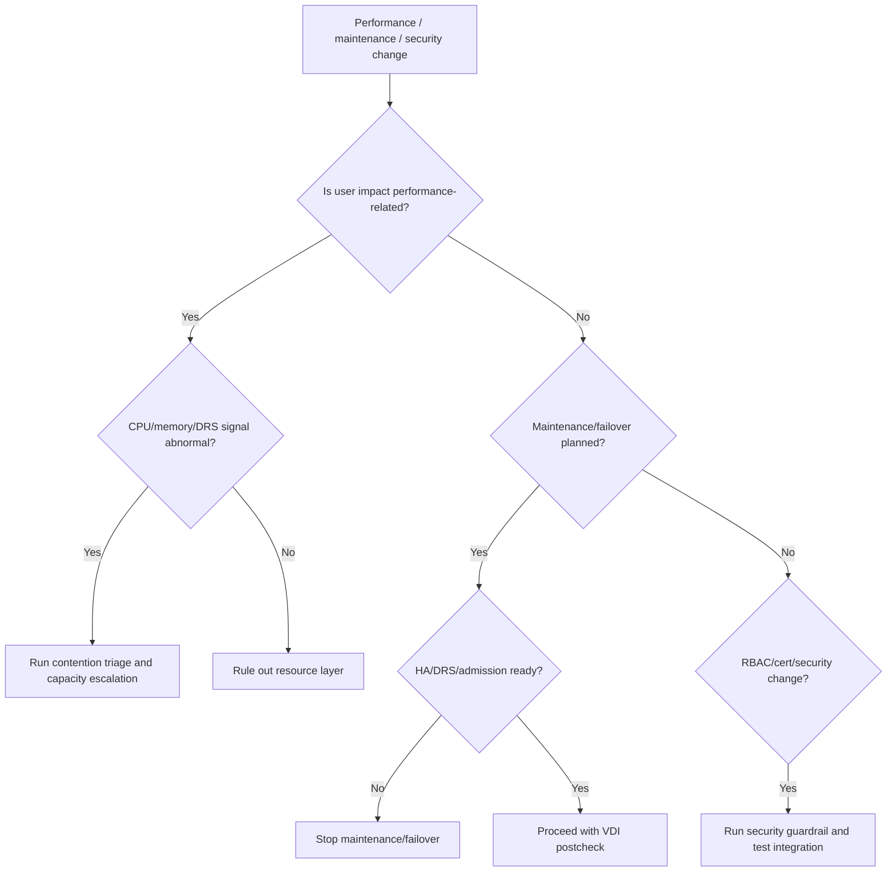

## Summary

Shard này bao phủ vSphere Security, Resource Management và Availability. Với VDI, đây là vùng tri thức quyết định ai được thao tác, workload có đủ CPU/memory không, DRS có phân phối VM hợp lý không, HA có đủ capacity không, và failover có thật sự giúp user khôi phục dịch vụ không.

## Chapter Knowledge Insight Report

Báo cáo insight của chương này gom security, resource management và availability thành một mô hình đảm bảo dịch vụ VDI: quyền đúng, tài nguyên đủ, failover có capacity và policy không phá trải nghiệm người dùng. Insight chính là: HA/DRS/RBAC không nên được đánh giá bằng trạng thái bật/tắt, mà bằng khả năng duy trì user journey khi có contention, host failure, change hoặc incident.

Các nội dung security, roles/permissions, certificates, CPU/memory resource management, DRS, HA, admission control và FT là `Source-backed` từ lines 182831-221104. Việc chuyển chúng thành mô hình "service assurance" cho VDI là `Inference from source`. Chính sách DRS/HA, admission control, resource pool, service account, certificate process, RTO/RPO và test failover của khách hàng là `Need Customer Confirmation`.

## Central Knowledge Thesis

**Thesis:** Trong VDI, availability không chỉ là HA đã bật và security không chỉ là ai đăng nhập được. Dịch vụ ổn định khi quyền thao tác đúng scope, tài nguyên CPU/memory được phân phối hợp lý, DRS không tạo lệch tải, HA có đủ admission capacity và failover được validate bằng user journey thật. Vì vậy engineer phải nối RBAC, resource contention và HA/DR thành cùng một câu hỏi: "người dùng có thể tiếp tục làm việc và đội vận hành có đủ quyền/evidence để xử lý không?" Nếu chỉ nhìn trạng thái cấu hình, môi trường có thể trông khỏe nhưng fail khi cần chịu lỗi.

## Insight and Depth Control

| Trường | Giá trị |
|---|---|
| Depth target | Complete required insight and technical extraction sections |
| Character target | No fixed minimum |
| Required insight sections completed | Yes |
| Required technical sections completed | Yes |
| Chapter report thesis present | Yes |
| Insight report reads independently | Yes |
| Source-backed vs inference separated | Yes |
| Depth Exception | Not applicable |

## Runbook Best Practices Extracted

### Runbook Inventory

| Runbook ID | Tên runbook | Dùng khi nào | Đối tượng thực hiện | Mức rủi ro | Source locator |
|---|---|---|---|---|---|
| RB-01 | Resource contention triage cho VDI performance | Khi nhiều user chậm nhưng broker health bình thường | System Engineer / Platform Admin | High | Lines 182831-221104 |
| RB-02 | HA/DRS readiness precheck trước maintenance | Trước host maintenance, patch hoặc failover test | Platform Admin / Change Owner | High | Lines 182831-221104 |
| RB-03 | RBAC/certificate/security change guardrail | Trước thay đổi quyền, certificate hoặc security posture | Security Admin / Platform Admin | High | Lines 182831-221104 |

### RB-01 - Resource contention triage cho VDI performance

**Mục tiêu:** Phân biệt VDI chậm do CPU/memory/DRS/resource contention với lỗi broker hoặc agent.

**Khi áp dụng:**
- Trigger: Nhiều user chậm, login/launch slow, app lag, host imbalance.
- Phạm vi ảnh hưởng: Host, cluster, resource pool, VM group.
- Không áp dụng khi: Chỉ một user hoặc ứng dụng lỗi cục bộ.

**Điều kiện tiên quyết:**
- Quyền truy cập: Performance read access.
- Công cụ/console: vSphere Client, Aria nếu có, broker monitoring.
- Thông tin đầu vào: Time window, affected pool/catalog, host/cluster.
- Customer confirmation cần có: Baseline CPU/memory threshold và DRS mode.

**Các bước thực hiện:**

| Bước | Hành động | Expected normal | Abnormal signal | Evidence cần lưu |
|---|---|---|---|---|
| 1 | Map affected VMs tới host/cluster | Scope rõ | Tập trung vào host quá tải | VM-host mapping |
| 2 | Kiểm tra CPU/memory contention metrics | Theo baseline | Ready/balloon/swap/high usage bất thường | Perf chart |
| 3 | Kiểm tra DRS balance/recommendations | Cluster balanced | Imbalance hoặc DRS không di chuyển | DRS evidence |
| 4 | Correlate với login storm/change | Không có spike | Spike trùng symptom | Timeline |

**Điểm dừng và rollback:**
- Stop condition: Contention production vượt threshold khách hàng.
- Rollback point: Dừng workload thêm, revert resource change theo approval.
- Không được làm: Tăng resource từng VM hàng loạt khi chưa hiểu cluster capacity.

**Escalation:**
- Escalate cho ai: Platform/capacity owner.
- Gói evidence tối thiểu: Affected VMs, host metrics, DRS state, timeline.
- Câu hỏi cần gửi khi escalation: Đây là capacity thiếu, imbalance hay policy/resource pool sai?

**Source grounding:**
- Source-backed: Resource management, CPU/memory, DRS.
- Inference from source: VDI performance triage theo resource contention.
- Need Customer Confirmation: Threshold và capacity model.

### RB-02 - HA/DRS readiness precheck trước maintenance

**Mục tiêu:** Đảm bảo maintenance/failover không làm thiếu capacity hoặc phá user journey.

**Khi áp dụng:**
- Trigger: Host maintenance, patch, failover test, planned outage.
- Phạm vi ảnh hưởng: Cluster, HA admission capacity, DRS placement, desktop sessions.
- Không áp dụng khi: Không có workload production.

**Các bước thực hiện:**

| Bước | Hành động | Expected normal | Abnormal signal | Evidence cần lưu |
|---|---|---|---|---|
| 1 | Kiểm tra HA/DRS status | Healthy, no critical alarm | HA warning, DRS disabled/imbalanced | Cluster summary |
| 2 | Kiểm tra admission/failover capacity | Đủ capacity theo policy | Không đủ capacity hoặc overcommit cao | Capacity evidence |
| 3 | Xác định affected VMs/sessions | Scope rõ | Unknown active sessions | Affected list |
| 4 | Postcheck sau evacuation/failover | VM restarted/migrated, login/launch OK | Partial restart/session impact | HA/DRS task + smoke test |

**Điểm dừng và rollback:**
- Stop condition: HA warning hoặc failover capacity không đủ.
- Rollback point: Hoãn maintenance, đưa host/workload về trạng thái trước change nếu có thể.
- Không được làm: Tuyên bố HA OK nếu chưa test user journey.

**Escalation:**
- Escalate cho ai: Platform owner, DR owner, VDI owner.
- Gói evidence tối thiểu: HA/DRS state, capacity, affected VMs, smoke test.
- Câu hỏi cần gửi khi escalation: Cluster có đủ capacity để mất một host mà vẫn phục vụ VDI không?

**Source grounding:**
- Source-backed: HA, DRS, admission control, availability.
- Inference from source: HA validation bằng VDI service journey.
- Need Customer Confirmation: RTO/RPO và failover policy.

### RB-03 - RBAC/certificate/security change guardrail

**Mục tiêu:** Tránh security change làm mất quyền vận hành hoặc phá trust path của vCenter/VDI integration.

**Khi áp dụng:**
- Trigger: Thay role/permission, certificate, hardening, privileged access policy.
- Phạm vi ảnh hưởng: Admin access, service account, API integration, audit.
- Không áp dụng khi: Change không ảnh hưởng vCenter/security plane.

**Các bước thực hiện:**

| Bước | Hành động | Expected normal | Abnormal signal | Evidence cần lưu |
|---|---|---|---|---|
| 1 | Xác định account/integration bị ảnh hưởng | Scope rõ | Không biết service account nào dùng quyền | Account inventory |
| 2 | Kiểm tra certificate/trust dependency | Cert valid, chain trusted | Expired/untrusted/mismatch | Cert evidence |
| 3 | Test least-privilege workflow | Required tasks OK | Permission/API/cert error | Task/broker evidence |
| 4 | Xác nhận audit/rollback | Audit log và rollback rõ | Không có rollback hoặc audit gap | Change record |

**Điểm dừng và rollback:**
- Stop condition: Service account/broker integration fail hoặc admin lockout risk.
- Rollback point: Previous role/cert/config.
- Không được làm: Thay certificate/role production không có break-glass plan.

**Escalation:**
- Escalate cho ai: Security admin, platform owner, VDI owner.
- Gói evidence tối thiểu: Role/cert before-after, failed task/API, audit record.
- Câu hỏi cần gửi khi escalation: Change này ảnh hưởng human admin, service account hay cả hai?

**Source grounding:**
- Source-backed: Security, RBAC, certificates.
- Inference from source: Security change guardrail cho VDI integration.
- Need Customer Confirmation: Certificate process, break-glass, audit policy.

### Max-depth runbook layer for CH08

#### RACI and ownership

| Runbook | Responsible | Accountable | Consulted | Informed | Required access |
|---|---|---|---|---|---|
| RB-01 | System Engineer / Platform Admin | Capacity Owner | VDI owner, NOC | Service owner | Cluster performance, DRS/resource pool view |
| RB-02 | Platform Admin / Change Owner | Platform Owner | VDI/DR owner | Helpdesk/NOC | HA/DRS/admission control, VM placement |
| RB-03 | Security Admin / Platform Admin | Security Owner | VDI owner, audit/compliance | Change owner | Roles, certificates, audit logs |

#### Decision tree

#### Evidence pack

| Evidence | Source | Proves | Used by |
|---|---|---|---|
| CPU/memory contention metrics | vSphere/Aria | Resource pressure | RB-01 |
| DRS recommendations/balance | Cluster DRS view | Placement health | RB-01/RB-02 |
| HA/admission state | Cluster HA view | Failover capacity | RB-02 |
| Role/cert before-after | vSphere security/cert view | Security change impact | RB-03 |
| VDI user journey postcheck | Broker + test VM | Service-level success | RB-02/RB-03 |

#### Postcheck and completion criteria

| Runbook | Pass criteria | Fail signal | If fail |
|---|---|---|---|
| RB-01 | Metrics within baseline or capacity owner engaged | Contention spikes match user symptom | Escalate capacity and stop workload growth |
| RB-02 | HA/DRS healthy and VDI launch/reconnect passes | Admission warning, partial restart, launch fail | Stop maintenance/failover claim |
| RB-03 | Admin/service account and cert trust path work | Permission/API/cert error | Rollback/security escalation |

#### Anti-patterns

| Anti-pattern | Vì sao nguy hiểm | Cách làm đúng |
|---|---|---|
| "HA bật" nghĩa là DR/availability ổn | Không chứng minh capacity hoặc user journey | Validate admission + VDI smoke |
| Tăng resource từng VM không xét cluster | Có thể che contention và gây overcommit | Phân tích host/cluster/resource pool |
| Thay certificate/role không test integration | Có thể làm broker/service account fail | Test API/workflow after change |

#### Context variants

| Ngữ cảnh | Điều chỉnh runbook |
|---|---|
| Daily operations | Resource/HA alarms and DRS imbalance review |
| Pre-change | RB-02/RB-03 with rollback and approval |
| Incident bridge | RB-01 for broad slowness, RB-03 for permission/cert symptom |
| DR/Recovery | Validate HA capacity plus user journey |
| Audit/compliance | Preserve role/cert before-after and approval |

#### Runbook Depth Score

| Runbook | Trigger/scope | RACI | Precheck | Decision tree | Steps/evidence | Evidence pack | Stop/rollback | Postcheck | Escalation | Anti-patterns | Grounding |
|---|---|---|---|---|---|---|---|---|---|---|---|
| RB-01 | Yes | Yes | Yes | Yes | Yes | Yes | Yes | Yes | Yes | Yes | Yes |
| RB-02 | Yes | Yes | Yes | Yes | Yes | Yes | Yes | Yes | Yes | Yes | Yes |
| RB-03 | Yes | Yes | Yes | Yes | Yes | Yes | Yes | Yes | Yes | Yes | Yes |

### Tutorial practice layer for CH08

| Runbook | Tutorial scenario | Open where / inspect what | Walkthrough notes | Sample observations | Handover note mẫu | Practice exercise |
|---|---|---|---|---|---|---|
| RB-01 | User experience chậm trên nhiều desktops nhưng broker health xanh. Engineer cần kiểm tra resource contention. | Mở cluster/host performance, DRS view, resource pool, affected VM placement, broker symptom time. | Map VMs to hosts, xem CPU/memory contention và DRS balance. Nếu metric khớp time window, escalate capacity/platform. | `Affected VMs cluster on one host`; `DRS recommendations pending`; `CPU ready threshold: Need Customer Confirmation`. | `Resource triage. Scope: ... Metric: ... DRS: ... Finding: ... Evidence: chart/placement. Next owner: ...` | Học viên nhận placement + metric sample và xác định contention hay không. |
| RB-02 | Host maintenance planned; engineer cần xác nhận HA/DRS/admission control đủ để không mất service. | Mở cluster HA/DRS, admission capacity, affected VM/session list, maintenance tasks, VDI smoke test. | Kiểm tra HA/DRS healthy, capacity, affected sessions. Sau evacuation/failover, validate launch/reconnect, không chỉ VM powered on. | `HA warning before maintenance`; `Evacuation succeeds but launch test fails`; `Partial HA restart`. | `HA/DRS precheck. Capacity: ... Affected VMs: ... Postcheck: ... Decision: ...` | Học viên chọn maintenance go/no-go dựa trên HA/admission và VDI smoke result. |
| RB-03 | Security team đổi certificate/role; sau đó broker task fail. Engineer cần kiểm tra trust/RBAC impact. | Mở certificate view, permissions/roles, broker integration, task/event, audit/change record. | Xác định change before/after, test service account workflow, đọc task/cert error. Nếu admin/service account path fail, rollback hoặc security escalation. | `Certificate untrusted by integration`; `Role scope changed at wrong folder`; `Audit log missing approval`. | `Security change triage. Change: ... Account/cert: ... Task error: ... Evidence: ... Rollback/escalation: ...` | Học viên nhận cert/permission error và xác định cần rollback role hay renew trust. |

### Mandatory Installation and Configuration Runbooks

| Source procedure / config heading | Procedure type | Runbook required? | Runbook ID | Nếu không tạo, lý do |
|---|---|---|---|---|
| Configure permissions, roles, certificates and security controls | Configure security | Yes | RB-04 | N/A |
| Configure resource pools, shares, reservations, limits | Configure resource | Yes | RB-05 | N/A |
| Configure DRS and cluster resource behavior | Configure availability/resource | Yes | RB-06 | N/A |
| Configure vSphere HA / admission control / FT if used | Configure availability | Yes | RB-07 | N/A |

### RB-04 - Tutorial: Cấu hình security controls, role và certificate guardrail

| Bước | Thao tác thực hành | Expected normal | Abnormal signal | Evidence |
|---|---|---|---|---|
| 1 | Xác định security change object: role, cert, lockdown, access | Object/scope rõ | Unknown affected integration | Change scope |
| 2 | Backup/export before state nếu có thể | Before state recorded | No rollback evidence | Before evidence |
| 3 | Apply change trong window approved | Change succeeds | Admin/API/service account fails | Task/audit evidence |
| 4 | Test admin and service workflows | Login/API/task pass | Permission/cert error | Postcheck evidence |

### RB-05 - Tutorial: Cấu hình resource pool/shares/reservations/limits cho VDI

| Bước | Thao tác thực hành | Expected normal | Abnormal signal | Evidence |
|---|---|---|---|---|
| 1 | Xác định workload/pool cần resource policy | Scope rõ | Policy áp nhầm workload | Workload mapping |
| 2 | Review current shares/reservation/limit | No unexpected cap | Limit throttles VDI | Resource config |
| 3 | Apply change nhỏ/pilot nếu được approve | Metrics stable | Contention or user impact | Perf evidence |
| 4 | Postcheck login/launch/perf | Pass | Slow/fail | Smoke result |

### RB-06 - Tutorial: Cấu hình DRS cho cluster chạy VDI

| Bước | Thao tác thực hành | Expected normal | Abnormal signal | Evidence |
|---|---|---|---|---|
| 1 | Xác nhận DRS mode theo policy | Mode rõ | Unknown/manual unexpected | DRS screenshot |
| 2 | Review rules/affinity if any | Rules documented | Rule causes imbalance | Rule evidence |
| 3 | Validate recommendations/migrations | Healthy balance | Repeated imbalance | DRS evidence |
| 4 | Postcheck user journey after change | Login/launch OK | Session impact | Smoke test |

### RB-07 - Tutorial: Cấu hình HA/admission control/FT readiness

| Bước | Thao tác thực hành | Expected normal | Abnormal signal | Evidence |
|---|---|---|---|---|
| 1 | Review HA enabled/admission policy | Policy known | HA warning/unknown policy | HA config |
| 2 | Check failover capacity | Capacity meets requirement | Admission warning | Capacity evidence |
| 3 | Validate restart priority/dependencies if used | Critical VMs covered | Wrong priority | Config evidence |
| 4 | Test or tabletop failover validation | User journey validated | Only VM power checked | Test result |

## Coverage

| Trường | Giá trị |
|---|---|
| Raw file | `raw/sources/vmware-vsphere-8-0.txt` |
| Line range | 182831-221104 |
| Source locator | vSphere Security; vSphere Resource Management; vSphere Availability |
| Extraction status | Extracted |
| Overview | [[sources/vmware-vsphere-8-0]] |

## Why This Chapter Matters for VDI Training

Security, resource management và availability là ba lớp quyết định nền tảng VDI có vừa an toàn vừa đủ capacity hay không. Engineer cần hiểu quyền truy cập, certificate, CPU/memory contention, DRS placement, HA/admission control và failover capacity vì các lỗi này thường biểu hiện thành provisioning fail, session chậm hoặc outage nhiều user.

## Reading Passes

| Pass | Kết quả |
|---|---|
| Structural Read | Tách security/RBAC, resource management và availability. |
| Technical Read | Bóc tách permissions, certificates, resource pools, DRS, HA, admission control. |
| Operational Read | Chuyển thành kiểm tra RBAC, CPU/memory, DRS/HA alarms, cluster capacity. |
| Failure Read | Tách lỗi permission denied, CPU contention, HA failover không đủ, certificate issue. |
| Training Read | Chuyển thành RBAC guide, capacity guide và HA/DR scenarios. |

## Knowledge Atoms

| ID | Knowledge atom | Loại tri thức | Vì sao quan trọng trong VDI | Source locator | Dùng cho topic |
|---|---|---|---|---|---|
| KA-01 | vSphere RBAC ảnh hưởng trực tiếp VDI automation. | Security | Thiếu quyền làm task VDI fail; quá quyền gây rủi ro. | Lines 182831-221104 | [[topics/24_VDI_Access_Control_and_RBAC_Guide]] |
| KA-02 | Certificate issue có thể phá trust/API/admin access. | Security | Lỗi trông giống platform outage. | Lines 182831-221104 | [[topics/10_VDI_Security_and_Policy_Management_Guide]] |
| KA-03 | CPU/memory contention gây session chậm dù broker khỏe. | Performance | User experience phụ thuộc host resource. | Lines 182831-221104 | [[topics/19_VDI_Performance_and_Capacity_Guide]] |
| KA-04 | Resource pool limits/shares có thể starve VDI workload. | Operation | Sai cấu hình làm cả pool chậm. | Lines 182831-221104 | [[topics/7_Hypervisor_and_HCI_Operations_Guide]] |
| KA-05 | DRS placement ảnh hưởng balancing và maintenance. | Availability | Host imbalance làm login/launch chậm. | Lines 182831-221104 | [[topics/23_VDI_High_Availability_and_Disaster_Recovery_Guide]] |
| KA-06 | HA admission control quyết định failover capacity. | HA/DR | HA bật nhưng không đủ capacity vẫn mất dịch vụ. | Lines 182831-221104 | [[topics/23_VDI_High_Availability_and_Disaster_Recovery_Guide]] |
| KA-07 | Permission denied event là evidence security/RBAC. | Evidence | Cần chuyển đúng owner thay vì troubleshoot broker. | Lines 182831-221104 | [[topics/25_VDI_Support_and_Escalation_Guide]] |
| KA-08 | HA/DR validation phải test user login/launch, không chỉ VM restart. | DR | VM up chưa chắc VDI usable. | Lines 182831-221104 | [[topics/22_VDI_Backup_and_Recovery_Guide]] |
| KA-09 | Resource management change có blast radius cluster/pool. | Change | Limits/reservations sai có thể gây chậm hàng loạt. | Lines 182831-221104 | [[topics/20_VDI_Change_Management_Guide]] |
| KA-10 | Audit thao tác quyền, certificate, HA/DRS là bắt buộc. | Security | Giúp truy vết thay đổi gây incident. | Lines 182831-221104 | [[topics/17_VDI_Incident_Classification_Guide]] |

## Architecture Knowledge

- Security covers certificates, permissions, roles, authentication, lockdown and host/vCenter hardening controls.
- Resource Management covers CPU, memory, reservations, limits, shares, resource pools, DRS and capacity behavior.
- Availability covers vSphere HA, admission control, FT and cluster failover mechanics.

## Operational Knowledge

| Thành phần / thao tác | Engineer cần hiểu gì | Khi nào kiểm tra | Evidence |
|---|---|---|---|
| RBAC | Wrong permissions can break automation or overexpose control | Permission denied, audit review | Role assignment |
| Certificates | Cert issue can break trust/API/client access | Login/API/cert warning | Certificate chain/expiry |
| CPU/memory | Contention affects session performance | User lag, login slow | Performance charts |
| Resource pools | Bad limits/shares can starve VDI | Pool-wide performance issue | Resource pool settings |
| DRS | Placement affects balance and maintenance | Host imbalance, evacuation | DRS recommendations |
| HA/admission control | Determines failover capacity | HA alarm, host failure | HA config and event |

## Troubleshooting Knowledge

| Triệu chứng | Nguyên nhân có thể | Lớp cần kiểm tra | Evidence | Hướng xử lý | Escalation |
|---|---|---|---|---|---|
| VDI sluggish but storage normal | CPU/memory contention, limits/reservations | Resource, Cluster | CPU ready/usage, mem pressure, resource pool config | Review DRS/resource pool/host load | Escalate capacity/platform |
| Provisioning task permission denied | Role/scope/service account issue | Security/RBAC | Task error, role assignment | Correct least-privilege role/scope | Escalate security/platform |
| HA failover does not start all desktops | Admission/capacity/datastore/network issue | HA, Cluster, Storage, Network | HA event, capacity state | Review admission control and failover capacity | Escalate DR owner |
| Certificate-related management issue | Expired/untrusted cert | Certificate, vCenter/Host | Browser/API error, cert detail | Replace/renew per change | Escalate security/platform |

## Monitoring and Evidence

- CPU usage, CPU ready if available.
- Memory usage, ballooning/swapping if available.
- Resource pool limits/shares.
- DRS imbalance/recommendations.
- HA alarms, failover events, admission control warnings.
- Permission denied events.
- Certificate expiry monitoring.

## Change, Patch and Rollback

- Change type: role/permission, certificate, resource pool config, DRS/HA/admission control, reservations/limits.
- Precheck: export current config, identify affected pools/catalogs, active session impact.
- Impact: automation failure, performance degradation, failover failure.
- Rollback point: prior role/cert/resource/HA config.
- Postcheck: task success, login/launch/performance, HA/DRS alarms clear.
- Stop condition: service account task fails, CPU/memory contention rises, HA warnings appear.

## Backup, Recovery, HA and DR

- HA is a cluster feature, not a complete DR strategy.
- Admission control and spare capacity must be validated against VDI concurrency.
- FT/HA/restart behavior must be tested with real desktop/application validation.

## Security and RBAC

- Follow least privilege for helpdesk/system engineer/platform admin.
- Audit high-risk operations: permission, certificate, HA/DRS, resource pool limits.
- Do not store private keys or credentials in wiki/evidence.

## Concepts to Create or Update

| Concept | Nội dung cần cập nhật | Source locator |
|---|---|---|
| [[concepts/identity-and-access-management]] | vSphere roles/permissions | Lines 182831-221104 |
| [[concepts/capacity-management]] | CPU/memory/resource pools/DRS | Lines 182831-221104 |
| [[concepts/high-availability]] | HA/admission/failover | Lines 182831-221104 |
| [[concepts/certificate-management]] | vSphere certificate dependency | Lines 182831-221104 |

## Topic Mapping

| Topic | Vì sao chunk này hỗ trợ |
|---|---|
| [[topics/19_VDI_Performance_and_Capacity_Guide]] | Resource management and DRS |
| [[topics/23_VDI_High_Availability_and_Disaster_Recovery_Guide]] | HA/admission/failover |
| [[topics/24_VDI_Access_Control_and_RBAC_Guide]] | Roles, permissions, least privilege |
| [[topics/20_VDI_Change_Management_Guide]] | Security/resource/HA config changes |
| [[topics/18_VDI_Troubleshooting_Playbook]] | Performance and HA-related issues |

## Scenario Based Extraction

| Scenario | Bối cảnh | Triệu chứng | Câu hỏi cho engineer | Phân tích mong đợi | Evidence cần lấy | Escalation |
|---|---|---|---|---|---|---|
| VDI sluggish | User báo session lag nhưng storage bình thường. | CPU ready/memory pressure tăng. | Resource pool/DRS/host load có bất thường không? | Kiểm tra host metrics, resource pool limits, DRS placement. | Perf chart, resource config, affected pool. | Escalate capacity/platform. |
| HA failover thiếu capacity | Một host mất. | Không phải tất cả desktop restart. | Admission control và spare capacity có đủ không? | Kiểm tra HA event, cluster capacity, failed VM restart. | HA event, capacity summary, affected VM list. | Escalate DR/platform owner. |
| Service account permission denied | Provisioning fail sau security cleanup. | vCenter task permission denied. | Quyền thiếu ở object nào? | Kiểm tra role, scope và task error. | Role assignment, task error, change record. | Escalate security/platform. |

## Training Conversion Notes

| Training asset | Nội dung lấy từ chương | Topic đích |
|---|---|---|
| RBAC guide | Roles, permissions, least privilege, audit | [[topics/24_VDI_Access_Control_and_RBAC_Guide]] |
| Capacity scenario | CPU/memory contention and DRS | [[topics/19_VDI_Performance_and_Capacity_Guide]] |
| HA checklist | HA admission and failover validation | [[topics/23_VDI_High_Availability_and_Disaster_Recovery_Guide]] |
| Change risk table | Resource/HA/RBAC/certificate change | [[topics/20_VDI_Change_Management_Guide]] |

## Gaps

- Need Customer Confirmation: DRS mode, HA admission policy, resource pool design, service account roles, certificate renewal process, spare capacity target.

## Chapter Self Review

- [x] Đã đọc đúng line range/chapter.
- [x] Có đủ 5 reading passes.
- [x] Có Knowledge Atoms.
- [x] Có architecture, operation, troubleshooting, monitoring/evidence.
- [x] Có change/rollback, backup/HA/DR, security/RBAC.
- [x] Có concept mapping, topic mapping, scenario, training conversion.
- [x] Có gaps và không bịa thông tin khách hàng.
