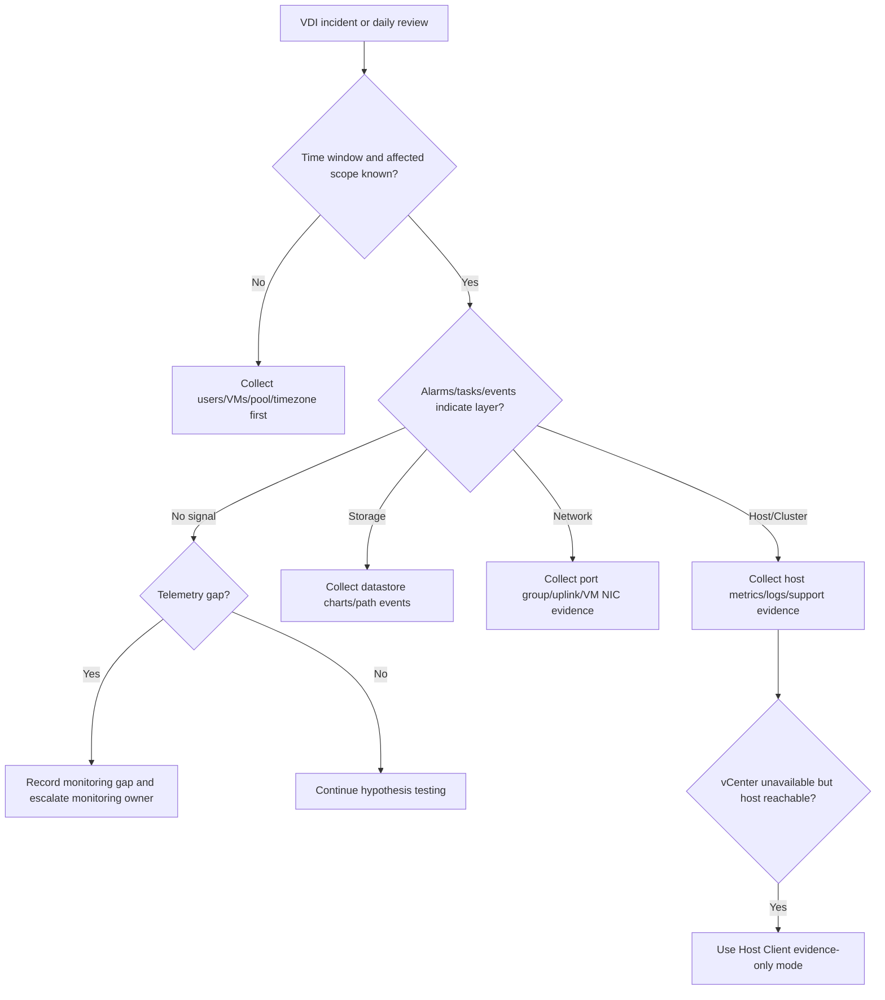

## Summary

Shard này bao phủ vSphere Monitoring and Performance, Single Host Management bằng VMware Host Client, và VMware Aria Operations Plug-In in vCenter Server. Đây là shard evidence: khi sự cố VDI xảy ra, engineer cần số liệu, alarm, event, performance chart, syslog, host client view và nếu có, Aria Operations để phân tích thay vì đoán.

## Chapter Knowledge Insight Report

Báo cáo insight của chương này xem monitoring như evidence plane của VDI infrastructure. Insight chính là: troubleshooting đáng tin không bắt đầu từ cảm giác "hệ thống chậm", mà từ time window, affected scope, alarm, task/event, metric, syslog, Host Client view và dashboard correlation đủ để chứng minh hoặc loại trừ từng lớp hạ tầng.

Các nội dung alarms, events, tasks, performance charts, syslog, Host Client và Aria Operations plug-in là `Source-backed` từ lines 221105-243951. Việc diễn giải chúng thành evidence model cho incident, change validation và escalation VDI là `Inference from source`. Monitoring tool thật, retention, threshold, alert routing, syslog target, Aria deployment và chính sách chia sẻ log của khách hàng là `Need Customer Confirmation`.

## Central Knowledge Thesis

**Thesis:** Trong VDI, monitoring là lớp biến triệu chứng người dùng thành bằng chứng có thể hành động. Nếu thiếu alarm, task/event, performance chart, syslog hoặc time correlation, engineer chỉ có thể đoán lỗi nằm ở broker, host, storage, network hay resource. Vì vậy mỗi incident cần được đóng khung bằng time window, affected users/VMs/pools, object vSphere liên quan và evidence từ nhiều bề mặt quan sát. Monitoring không chỉ phục vụ RCA sau sự cố; nó là điều kiện để daily operations, change postcheck và escalation có chất lượng.

## Insight and Depth Control

| Trường | Giá trị |
|---|---|
| Depth target | Complete required insight and technical extraction sections |
| Character target | No fixed minimum |
| Required insight sections completed | Yes |
| Required technical sections completed | Yes |
| Chapter report thesis present | Yes |
| Insight report reads independently | Yes |
| Source-backed vs inference separated | Yes |
| Depth Exception | Not applicable |

## Runbook Best Practices Extracted

### Runbook Inventory

| Runbook ID | Tên runbook | Dùng khi nào | Đối tượng thực hiện | Mức rủi ro | Source locator |
|---|---|---|---|---|---|
| RB-01 | VDI infrastructure incident evidence pack | Khi cần RCA/escalation cho incident VDI nghi do hạ tầng | System Engineer / Incident Owner | Medium | Lines 221105-243951 |
| RB-02 | Daily vSphere alarm and health review | Daily operations hoặc đầu ca trực | System Engineer / NOC / Platform Admin | Medium | Lines 221105-243951 |
| RB-03 | Host Client fallback evidence collection | Khi vCenter hạn chế nhưng host còn truy cập được | Platform Admin / System Engineer | High | Lines 221105-243951 |

### RB-01 - VDI infrastructure incident evidence pack

**Mục tiêu:** Chuẩn hóa gói evidence để phân biệt lỗi host, datastore, network, resource, vCenter task hoặc monitoring gap.

**Khi áp dụng:**
- Trigger: Incident VDI có nhiều user, nhiều VM, launch slow/fail, disconnect hoặc RCA cần hạ tầng.
- Phạm vi ảnh hưởng: User, pool/catalog, VM, host, datastore, network, cluster.
- Không áp dụng khi: Lỗi đã được chứng minh là ứng dụng/user profile riêng lẻ.

**Điều kiện tiên quyết:**
- Quyền truy cập: vSphere read access, task/event/performance.
- Công cụ/console: vSphere Client, Aria nếu có, syslog/log platform, broker console.
- Thông tin đầu vào: Time window, timezone, affected users/VMs/pool.
- Customer confirmation cần có: Monitoring retention, threshold, log sharing policy.

**Các bước thực hiện:**

| Bước | Hành động | Expected normal | Abnormal signal | Evidence cần lưu |
|---|---|---|---|---|
| 1 | Xác định time window/timezone và affected scope | Scope rõ | Time window mơ hồ | Incident header |
| 2 | Thu tasks/events vCenter quanh thời điểm lỗi | Không có task fail liên quan | Task fail/host/storage/network event | Task/event export |
| 3 | Thu performance charts host/datastore/network | Metrics theo baseline | Spike/correlation với symptom | Perf charts |
| 4 | Kiểm tra alarms/syslog/support bundle need | Alarms/logs đủ | Missing logs hoặc alarm gap | Evidence gap note |

**Điểm dừng và rollback:**
- Stop condition: Evidence chỉ ra production host/datastore/network critical issue.
- Rollback point: Dừng change liên quan hoặc chuyển incident owner theo dependency.
- Không được làm: Kết luận RCA nếu không có time-correlated evidence.

**Escalation:**
- Escalate cho ai: Platform/storage/network/VDI owner hoặc vendor.
- Gói evidence tối thiểu: Time window, affected objects, alarms, tasks/events, charts, syslog status.
- Câu hỏi cần gửi khi escalation: Evidence đang chỉ vào layer nào và còn thiếu telemetry gì?

**Source grounding:**
- Source-backed: Alarms, tasks/events, performance charts, syslog, Host Client, Aria.
- Inference from source: Evidence pack cho VDI incident.
- Need Customer Confirmation: Retention/threshold/log handling.

### RB-02 - Daily vSphere alarm and health review

**Mục tiêu:** Phát hiện sớm host/datastore/HA/resource issue trước khi user report.

**Khi áp dụng:**
- Trigger: Daily operations, start of shift, before business peak.
- Phạm vi ảnh hưởng: vCenter, cluster, hosts, datastores, critical VDI VMs.
- Không áp dụng khi: Monitoring được tự động route đầy đủ và đã có runbook NOC tương đương.

**Các bước thực hiện:**

| Bước | Hành động | Expected normal | Abnormal signal | Evidence cần lưu |
|---|---|---|---|---|
| 1 | Review critical alarms | No unacknowledged critical alarms | Host/datastore/HA/network critical alarm | Alarm list |
| 2 | Review failed/recent tasks | No repeated failures | Repeated power/snapshot/storage/network task fail | Task summary |
| 3 | Review top datastore/host performance | Within baseline | Latency/resource spikes | Dashboard/chart |
| 4 | Ghi handover/action owner | Owner rõ | Alarm không có owner | Daily ops note |

**Điểm dừng và rollback:**
- Stop condition: Critical alarm có production impact chưa có owner.
- Rollback point: Không áp dụng; mở incident hoặc route owner.
- Không được làm: Acknowledge/clear alarm mà không ghi owner/action.

**Escalation:**
- Escalate cho ai: NOC/platform/storage/network owner.
- Gói evidence tối thiểu: Alarm name, object, time, severity, related tasks/events.
- Câu hỏi cần gửi khi escalation: Alarm này ảnh hưởng pool/catalog nào và cần xử lý trước giờ cao điểm không?

**Source grounding:**
- Source-backed: Alarms, monitoring/performance, events/tasks.
- Inference from source: Daily health review cho VDI operations.
- Need Customer Confirmation: NOC routing, alarm severity mapping.

### RB-03 - Host Client fallback evidence collection

**Mục tiêu:** Thu evidence host-level khi vCenter gặp sự cố nhưng host còn truy cập được, không biến fallback thành thao tác rủi ro.

**Khi áp dụng:**
- Trigger: vCenter UI/API unavailable, một host cần kiểm tra trực tiếp, incident host-level.
- Phạm vi ảnh hưởng: Một ESXi host và VM trên host đó.
- Không áp dụng khi: Host unreachable hoặc chính sách khách hàng cấm truy cập trực tiếp.

**Các bước thực hiện:**

| Bước | Hành động | Expected normal | Abnormal signal | Evidence cần lưu |
|---|---|---|---|---|
| 1 | Truy cập Host Client theo policy | Login được bằng account approved | Không login được hoặc policy cấm | Access note |
| 2 | Kiểm tra host summary và VM list | Host/VM state rõ | Host alarm, VM state bất thường | Screenshot/export |
| 3 | Kiểm tra logs/events nếu cần | Có log quanh time window | Missing logs hoặc critical error | Log summary |
| 4 | Tránh thao tác thay đổi state nếu chưa approve | Evidence-only mode | Power/reconfigure ngoài change | Action log |

**Điểm dừng và rollback:**
- Stop condition: Host có critical alarm/hardware/path issue.
- Rollback point: Không thao tác state; chuyển sang incident/change process.
- Không được làm: Power off/reset VM hoặc thay config trực tiếp từ Host Client nếu chưa approved.

**Escalation:**
- Escalate cho ai: vCenter/platform owner, hardware/HCI owner.
- Gói evidence tối thiểu: Host state, VM list, logs/events, vCenter access error.
- Câu hỏi cần gửi khi escalation: Đây là vCenter control-plane outage hay host-level issue?

**Source grounding:**
- Source-backed: VMware Host Client, monitoring, logs/events.
- Inference from source: Host Client fallback evidence mode.
- Need Customer Confirmation: Direct host access policy.

### Max-depth runbook layer for CH09

#### RACI and ownership

| Runbook | Responsible | Accountable | Consulted | Informed | Required access |
|---|---|---|---|---|---|
| RB-01 | Incident Owner / System Engineer | Service Owner | Platform, storage, network, VDI owner | Helpdesk/NOC | vCenter alarms, tasks/events, performance, syslog/Aria |
| RB-02 | NOC / System Engineer | Operations Manager | Platform owner | VDI owner | Alarm dashboard, task/event, performance dashboards |
| RB-03 | Platform Admin | Platform Owner | Security, hardware/HCI owner | Incident bridge | Host Client, host logs, approved direct host access |

#### Decision tree

#### Evidence pack

| Evidence | Source | Proves | Used by |
|---|---|---|---|
| Time window/timezone and affected objects | Incident ticket + broker | Scope and correlation basis | RB-01 |
| Alarms | vSphere/Aria | First platform signal | RB-01/RB-02 |
| Tasks/events | vCenter | Change/action timeline | RB-01 |
| Performance charts | vSphere/Aria | Resource/storage/network correlation | RB-01/RB-02 |
| Syslog/support bundle | Syslog/ESXi/vCenter | Host/service detail for escalation | RB-01/RB-03 |
| Host Client screenshots | Host Client | Host state when vCenter limited | RB-03 |

#### Postcheck and completion criteria

| Runbook | Pass criteria | Fail signal | If fail |
|---|---|---|---|
| RB-01 | Evidence maps symptom to layer or documents telemetry gap | No time window, missing logs, no affected objects | Re-scope incident; escalate monitoring gap |
| RB-02 | Critical alarms reviewed, owner assigned, evidence retained | Unowned critical alarm or repeated failed task | Open incident/action ticket |
| RB-03 | Host evidence collected without unsafe changes | Direct host action taken without approval | Stop and escalate governance issue |

#### Anti-patterns

| Anti-pattern | Vì sao nguy hiểm | Cách làm đúng |
|---|---|---|
| RCA không có time window/timezone | Metric correlation sai | Start with time window and affected objects |
| Clear/ack alarm không ghi action owner | Mất dấu incident | Assign owner and preserve alarm evidence |
| Dùng Host Client để thao tác state khi vCenter down | Có thể phá change control | Evidence-only unless approved |

#### Context variants

| Ngữ cảnh | Điều chỉnh runbook |
|---|---|
| Daily operations | RB-02: alarms, failed tasks, top resource/storage trend |
| Pre-change | Capture before metrics/alarms and define postcheck |
| Incident bridge | RB-01: evidence pack drives layer routing |
| DR/Recovery | Validate monitoring resumes after failover/restore |
| Audit/compliance | Keep evidence retention and log handling notes |

#### Runbook Depth Score

| Runbook | Trigger/scope | RACI | Precheck | Decision tree | Steps/evidence | Evidence pack | Stop/rollback | Postcheck | Escalation | Anti-patterns | Grounding |
|---|---|---|---|---|---|---|---|---|---|---|---|
| RB-01 | Yes | Yes | Yes | Yes | Yes | Yes | Yes | Yes | Yes | Yes | Yes |
| RB-02 | Yes | Yes | Yes | Yes | Yes | Yes | Yes | Yes | Yes | Yes | Yes |
| RB-03 | Yes | Yes | Yes | Yes | Yes | Yes | Yes | Yes | Yes | Yes | Yes |

### Tutorial practice layer for CH09

| Runbook | Tutorial scenario | Open where / inspect what | Walkthrough notes | Sample observations | Handover note mẫu | Practice exercise |
|---|---|---|---|---|---|---|
| RB-01 | Incident bridge cần biết VDI chậm do host, datastore, network hay thiếu telemetry. Engineer phải dựng evidence pack. | Mở incident ticket, broker affected scope, vCenter alarms/tasks/events, performance charts, syslog/Aria. | Bắt đầu bằng time window và affected objects. Thu alarms, tasks/events, charts theo đúng window. Nếu không có telemetry, ghi monitoring gap thay vì bịa RCA. | `No metric for incident window`; `Datastore latency chart matches symptom`; `Task failure occurs after change`. | `Evidence pack. Time: ... Scope: ... Signals: ... Missing telemetry: ... Probable layer: ... Next owner: ...` | Học viên nhận incident timeline và chọn evidence cần gắn để route đúng layer. |
| RB-02 | Đầu ca trực, NOC cần kiểm tra vSphere health trước giờ cao điểm VDI. | Mở vSphere alarms, failed tasks, performance dashboard, daily ops ticket. | Review critical alarms trước, sau đó failed tasks và top resource/storage trend. Mỗi alarm phải có owner/action, không chỉ acknowledge. | `Unowned datastore alarm`; `Repeated snapshot task fail`; `CPU trend rising before business peak`. | `Daily review. Critical alarms: ... Failed tasks: ... Owner assigned: ... Risk before peak: ...` | Học viên xử lý danh sách alarm và xác định cái nào cần mở incident. |
| RB-03 | vCenter không truy cập được nhưng một host vẫn vào Host Client được. Engineer cần thu evidence read-only, không thao tác state bừa. | Mở Host Client theo policy, host summary, VM list, logs/events, vCenter access error. | Xác nhận direct access được phép. Thu host state, VM list và logs. Không power/reset/reconfigure nếu chưa có change/approval. | `Host reachable while vCenter UI down`; `VM list shows running desktops`; `Hardware alarm visible in Host Client`. | `Host Client fallback. Reason: ... Host state: ... VM impact: ... Evidence: ... Actions avoided: state change.` | Học viên nhận tình huống vCenter down và chọn việc nào read-only, việc nào cần approval. |

### Mandatory Installation and Configuration Runbooks

| Source procedure / config heading | Procedure type | Runbook required? | Runbook ID | Nếu không tạo, lý do |
|---|---|---|---|---|
| Configure alarms and monitoring views | Configure monitoring | Yes | RB-04 | N/A |
| Configure performance chart/dashboard usage | Configure evidence workflow | Yes | RB-05 | N/A |
| Configure/use Host Client access policy | Configure host management | Yes | RB-06 | N/A |
| Configure/use Aria Operations Plug-In in vCenter if deployed | Configure integration | Yes | RB-07 | N/A |

### RB-04 - Tutorial: Cấu hình alarm review và routing cho VDI infrastructure

| Bước | Thao tác thực hành | Expected normal | Abnormal signal | Evidence |
|---|---|---|---|---|
| 1 | Xác định alarm categories quan trọng: host, datastore, HA, network, task | Categories mapped | Unowned critical alarms | Alarm matrix |
| 2 | Configure/review notification/routing nếu trong scope | Owner receives alert | Alert goes nowhere | Routing evidence |
| 3 | Test alarm handling/tabletop | Owner/action clear | No response path | Test note |
| 4 | Document severity mapping | Severity understood | Noise or missed critical | Ops note |

### RB-05 - Tutorial: Cấu hình performance chart/dashboard workflow

| Bước | Thao tác thực hành | Expected normal | Abnormal signal | Evidence |
|---|---|---|---|---|
| 1 | Chọn metric set cho host/datastore/network/resource | Metrics relevant to VDI | Missing datastore/host metric | Dashboard screenshot |
| 2 | Set time range/timezone discipline | Window matches incident | Wrong timezone | Chart export |
| 3 | Save/export dashboard or chart for incident | Export usable | Screenshot missing axis/time | Evidence file |
| 4 | Link dashboard to runbook/ticket | Reusable | One-off undocumented | Ticket link |

### RB-06 - Tutorial: Cấu hình và dùng Host Client theo chế độ an toàn

| Bước | Thao tác thực hành | Expected normal | Abnormal signal | Evidence |
|---|---|---|---|---|
| 1 | Xác nhận direct host access policy | Approved path | Policy unknown | Access approval |
| 2 | Login Host Client read-only/evidence mode | View host state | Login fail or unauthorized | Access evidence |
| 3 | Collect host summary/events/logs | Evidence enough | Need support bundle | Host evidence |
| 4 | Avoid state changes without approval | No unsafe action | Power/reset/reconfigure attempted | Action log |

### RB-07 - Tutorial: Cấu hình/khai thác Aria Operations Plug-In nếu có

| Bước | Thao tác thực hành | Expected normal | Abnormal signal | Evidence |
|---|---|---|---|---|
| 1 | Xác nhận Aria deployed/integrated | Plugin/dashboard available | Not deployed | Tooling note |
| 2 | Map VDI clusters/datastores/hosts into views | Objects visible | Missing objects | Dashboard evidence |
| 3 | Use trend/correlation for incident/capacity | Trend explains risk | No retention/data gap | Report export |
| 4 | Document thresholds/owners | Owner/threshold known | Need Customer Confirmation | Ops note |

## Coverage

| Trường | Giá trị |
|---|---|
| Raw file | `raw/sources/vmware-vsphere-8-0.txt` |
| Line range | 221105-243951 |
| Source locator | vSphere Monitoring and Performance; vSphere Single Host Management - VMware Host Client; VMware Aria Operations Plug-In in vCenter Server |
| Extraction status | Extracted |
| Overview | [[sources/vmware-vsphere-8-0]] |

## Why This Chapter Matters for VDI Training

Monitoring là thứ biến troubleshooting từ đoán sang chứng minh. Với VDI lớn, engineer cần biết lấy alarm, task, event, performance chart, syslog, support bundle và nếu có Aria Operations để chứng minh lỗi nằm ở host, storage, network, resource hay vCenter workflow. Chương này cung cấp lớp evidence cho toàn bộ tài liệu training.

## Reading Passes

| Pass | Kết quả |
|---|---|
| Structural Read | Tách monitoring/performance, Host Client và Aria Operations plug-in. |
| Technical Read | Bóc tách alarms, events, tasks, performance charts, syslog, host direct view, Aria dashboard. |
| Operational Read | Chuyển thành evidence pack cho incident/change/daily ops. |
| Failure Read | Tách lỗi thiếu evidence, missed alarms, wrong time window, noisy alerts. |
| Training Read | Chuyển thành monitoring guide, daily checklist, support escalation package. |

## Knowledge Atoms

| ID | Knowledge atom | Loại tri thức | Vì sao quan trọng trong VDI | Source locator | Dùng cho topic |
|---|---|---|---|---|---|
| KA-01 | vSphere alarms là tín hiệu đầu tiên cho host/datastore/network/HA issues. | Monitoring | Giúp phát hiện trước khi user báo lỗi. | Lines 221105-243951 | [[topics/15_VDI_Monitoring_and_Alerting_Guide]] |
| KA-02 | Tasks/events tạo timeline cho RCA và change validation. | Evidence | Cần biết lỗi xảy ra sau thao tác nào. | Lines 221105-243951 | [[topics/17_VDI_Incident_Classification_Guide]] |
| KA-03 | Performance charts giúp correlate user symptom với infra metrics. | Troubleshooting | Tránh kết luận thiếu dữ liệu. | Lines 221105-243951 | [[topics/19_VDI_Performance_and_Capacity_Guide]] |
| KA-04 | Syslog cần được cấu hình trước incident. | Operation | Sau incident mới bật log thì quá muộn. | Lines 221105-243951 | [[topics/16_Daily_Operations_Checklist]] |
| KA-05 | Host Client hữu ích khi cần xem một host trực tiếp. | Operation | Khi vCenter hạn chế, vẫn có thể lấy một phần evidence. | Lines 221105-243951 | [[topics/7_Hypervisor_and_HCI_Operations_Guide]] |
| KA-06 | Aria Operations nếu có giúp capacity/performance correlation. | Monitoring | Tốt cho trend analysis trong VDI lớn. | Lines 221105-243951 | [[topics/15_VDI_Monitoring_and_Alerting_Guide]] |
| KA-07 | Evidence phải có time window và timezone. | Evidence | Sai thời gian làm correlation sai. | Lines 221105-243951 | [[topics/25_VDI_Support_and_Escalation_Guide]] |
| KA-08 | No evidence là operational gap, không phải chỉ là incident gap. | Operation | Cần cải thiện monitoring baseline. | Lines 221105-243951 | [[topics/26_VDI_Operational_Knowledge_Base]] |
| KA-09 | Monitoring change cũng cần rollback nếu alert routing hỏng. | Change | Mất alert có thể làm outage kéo dài. | Lines 221105-243951 | [[topics/20_VDI_Change_Management_Guide]] |
| KA-10 | Logs/support bundles có thể chứa thông tin nhạy cảm. | Security | Cần xử lý theo chính sách khách hàng. | Lines 221105-243951 | [[topics/24_VDI_Access_Control_and_RBAC_Guide]] |

## Architecture Knowledge

- vSphere monitoring surfaces include alarms, events, tasks, performance charts, logs and host-level tools.
- VMware Host Client is useful when managing or checking a single ESXi host directly.
- Aria Operations plugin can extend monitoring and correlation inside vCenter if deployed.

## Operational Knowledge

| Thành phần / thao tác | Engineer cần hiểu gì | Khi nào kiểm tra | Evidence |
|---|---|---|---|
| Alarms | First signal for host/datastore/network/HA issues | Daily check, incident triage | Alarm name/severity/time |
| Events/tasks | Timeline of what changed or failed | RCA, change validation | Event/task export |
| Performance charts | CPU/memory/storage/network trend | Slow login/session lag | Chart around incident |
| Syslog | Central log evidence | Host issue/RCA | Syslog target, log snippet summary |
| Host Client | Direct host view if vCenter limited | vCenter issue/single host check | Host Client screenshot |
| Aria Operations | Advanced correlation/capacity if available | Capacity/performance analysis | Dashboard/report |

## Troubleshooting Knowledge

| Triệu chứng | Nguyên nhân có thể | Lớp cần kiểm tra | Evidence | Hướng xử lý | Escalation |
|---|---|---|---|---|---|
| No clear root cause | Missing logs/metrics or wrong time window | Monitoring | Alarm/event/perf gaps | Collect correct time-correlated evidence | Escalate monitoring owner if coverage missing |
| Login/session slow | CPU/mem/storage/network trend | Performance | Perf charts, datastore latency, host load | Correlate VDI symptom with infra metrics | Escalate capacity/storage/network |
| Host alarm ignored | Daily operations gap | Operations | Alarm history | Classify severity and route owner | Escalate NOC/platform |
| vCenter unavailable but host reachable | vCenter issue, host still manageable | Host Client | Host Client status, host logs | Use direct host view for evidence only, follow change policy | Escalate vCenter/platform |

## Monitoring and Evidence

Minimum evidence pack for VDI infra incident:

- Time window and timezone.
- Affected users/pool/catalog/desktop VM.
- vCenter alarms.
- vCenter tasks/events.
- Host metrics: CPU/memory/network.
- Datastore metrics: capacity/latency/IOPS if available.
- VM events and VMware Tools state.
- Syslog/support bundle if host-level issue.
- Aria dashboard if customer deploys it.

## Change, Patch and Rollback

- Change type: alarm definition, monitoring threshold, syslog target, Aria integration, host management setting.
- Precheck: existing alert coverage, owner, test alert path.
- Impact: missed incidents or noisy alerts.
- Rollback point: previous alarm/syslog/monitoring config.
- Postcheck: test alert, evidence visibility, dashboard update.
- Stop condition: critical alarms no longer visible or alert routing broken.

## Backup, Recovery, HA and DR

- Monitoring must cover HA/DR events and recovery validation.
- After failover/restore, collect evidence that cluster, datastore, network and VDI services are healthy.

## Security and RBAC

- Monitoring roles should allow read-only visibility for support while limiting configuration changes.
- Logs/support bundles can contain sensitive infrastructure details; handle per customer policy.

## Concepts to Create or Update

| Concept | Nội dung cần cập nhật | Source locator |
|---|---|---|
| [[concepts/monitoring-and-logs]] | Alarms/events/tasks/perf/syslog | Lines 221105-243951 |
| [[concepts/daily-operations]] | Daily alarm and health review | Lines 221105-243951 |
| [[concepts/capacity-management]] | Performance/capacity monitoring | Lines 221105-243951 |
| [[concepts/esxi]] | Host Client as single-host view | Lines 221105-243951 |

## Topic Mapping

| Topic | Vì sao chunk này hỗ trợ |
|---|---|
| [[topics/15_VDI_Monitoring_and_Alerting_Guide]] | Monitoring/evidence source |
| [[topics/16_Daily_Operations_Checklist]] | Daily alarm/event review |
| [[topics/18_VDI_Troubleshooting_Playbook]] | Evidence-driven troubleshooting |
| [[topics/19_VDI_Performance_and_Capacity_Guide]] | Performance charts and trend |
| [[topics/25_VDI_Support_and_Escalation_Guide]] | Evidence package for escalation |

## Scenario Based Extraction

| Scenario | Bối cảnh | Triệu chứng | Câu hỏi cho engineer | Phân tích mong đợi | Evidence cần lấy | Escalation |
|---|---|---|---|---|---|---|
| RCA không đủ dữ liệu | User báo chậm nhưng không có metric đúng thời điểm. | Không xác định được layer lỗi. | Monitoring có lưu metric/log đúng time window không? | Xác định gap monitoring và bổ sung alert/evidence baseline. | Alarm history, performance chart, syslog availability. | Escalate monitoring owner. |
| Datastore latency spike | Nhiều user login chậm. | Performance chart cho datastore tăng cao. | Spike có khớp login storm/backup/change không? | Correlate session count, backup window, datastore metric. | Time window, charts, backup/change record. | Escalate storage/capacity. |
| vCenter unavailable | Không vào được vSphere Client. | Host vẫn có thể truy cập Host Client. | Có thể lấy evidence host trực tiếp không? | Dùng Host Client chỉ để xem trạng thái, không thao tác rủi ro. | Host status, logs, affected VM list. | Escalate vCenter/platform. |

## Training Conversion Notes

| Training asset | Nội dung lấy từ chương | Topic đích |
|---|---|---|
| Monitoring guide | Alarms, events, performance charts, syslog | [[topics/15_VDI_Monitoring_and_Alerting_Guide]] |
| Daily checklist | Review critical alarms and evidence readiness | [[topics/16_Daily_Operations_Checklist]] |
| Escalation package | Time window, affected objects, logs and metrics | [[topics/25_VDI_Support_and_Escalation_Guide]] |
| Scenario | Troubleshooting without evidence | [[topics/18_VDI_Troubleshooting_Playbook]] |

## Gaps

- Need Customer Confirmation: whether VMware Aria Operations is deployed, monitoring thresholds, NOC routing, syslog target, retention and evidence policy.

## Chapter Self Review

- [x] Đã đọc đúng line range/chapter.
- [x] Có đủ 5 reading passes.
- [x] Có Knowledge Atoms.
- [x] Có architecture, operation, troubleshooting, monitoring/evidence.
- [x] Có change/rollback, backup/HA/DR, security/RBAC.
- [x] Có concept mapping, topic mapping, scenario, training conversion.
- [x] Có gaps và không bịa thông tin khách hàng.
