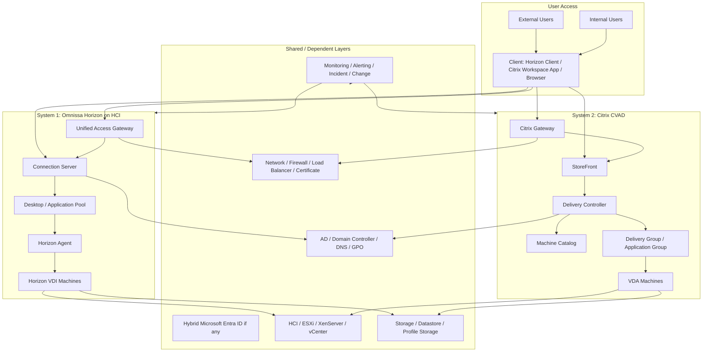

# Customer VDI Landscape Overview

## 0. Document Control

| Trường | Giá trị |
|---|---|
| Thứ tự | 2 |
| Tên tài liệu | Customer VDI Landscape Overview |
| Tên file | 02_Customer_VDI_Landscape_Overview.md |
| Mục đích tài liệu | Mô tả tổng quan hai hệ thống VDI của khách hàng, quy mô 1500 đến hơn 2000 VDI, nền tảng sử dụng và phạm vi vận hành cần nắm. |
| Nguồn điều khiển | [[sources/vdi-training-idea]], [[sources/vdi-documentation-list-context]] |
| Trạng thái thông tin | Có bối cảnh cấp cao; topology, version, IP, owner, SLA, monitoring và flow thật vẫn là Need Customer Confirmation. |

### 0.1 Source Grounding

| Nhóm tri thức | Nguồn sử dụng | Mức độ tin cậy | Ghi chú |
|---|---|---|---|
| Bối cảnh hai hệ thống VDI, quy mô, mục tiêu đào tạo và cách nhìn theo lớp | [[sources/vdi-training-idea]] | High | Đây là nguồn chính cho landscape của khách hàng trong bộ tài liệu. |
| Tên tài liệu, thứ tự, tên file và mục đích | [[sources/vdi-documentation-list-context]] | High | Source of truth cho phạm vi tài liệu này. |
| Omnissa Horizon, Connection Server, Unified Access Gateway, Horizon Agent, pod/block, access flow | [[sources/horizon-8-architecture]], [[sources/understand-and-troubleshoot-horizon-connections]] | High | Dùng để mô tả hệ thống Horizon ở mức landscape, không thay thế tài liệu kiến trúc Horizon chi tiết. |
| Citrix CVAD, Delivery Controller, StoreFront, Citrix Gateway, VDA, Site Database, Machine Catalog, Delivery Group | [[sources/citrix-virtual-apps-and-desktops-7-2603]] | High | Dùng để mô tả hệ thống Citrix ở mức landscape, không thay thế tài liệu kiến trúc Citrix chi tiết. |
| VMware ESXi, vCenter, datastore, VM lifecycle, network, snapshot | [[sources/vmware-vsphere-8-0]], [[sources/vcenter-server-installation-and-setup]] | High | Dùng để mô tả lớp hạ tầng có thể nằm dưới Horizon hoặc Citrix. |
| XenServer host, pool, VM, storage repository, network, HA | [[sources/xenserver-8-4]] | High | Dùng để mô tả khả năng Citrix CVAD chạy trên XenServer. |
| Profile container, profile storage và rủi ro login/profile | [[sources/fslogix-documentation]] | High | Dùng để nhắc landscape cần xác định profile solution, không mặc định khách hàng đang dùng FSLogix. |

### 0.2 In Scope

- Mô tả bức tranh tổng quan khách hàng có 2 hệ thống VDI riêng: Omnissa Horizon on HCI và Citrix CVAD trên XenServer hoặc VMware ESXi.
- Giải thích vì sao engineer phải nhìn landscape theo platform, site, access path, identity, broker, session, hypervisor, storage, network, monitoring và operation process.
- Làm rõ các thành phần engineer cần nhận diện trước khi vào vận hành.
- Đưa ra câu hỏi cần xác nhận với khách hàng để biến landscape cấp cao thành sơ đồ vận hành thực tế.
- Cung cấp checklist khảo sát, lỗi landscape thường gặp, tình huống học tập và knowledge check.

### 0.3 Out of Scope

- Không mô tả chi tiết kiến trúc Horizon, Citrix CVAD, access flow, identity, storage, network hoặc HA/DR ở mức SOP; các phần đó thuộc tài liệu riêng.
- Không giả định version, topology, IP, hostname, số node, VIP, subnet, firewall rule, monitoring tool, SLA hoặc ownership khi chưa được khách hàng xác nhận.
- Không đưa hướng dẫn thay đổi cấu hình production.
- Không yêu cầu secret, password, token hoặc credential.

## 1. Tài liệu này giúp engineer làm được gì

Tài liệu này là bản đồ định hướng trước khi engineer đi vào từng tài liệu chuyên sâu. Nếu `VDI Foundation Overview` trả lời câu hỏi "VDI là gì?", tài liệu này trả lời câu hỏi "Khách hàng đang có những hệ thống VDI nào, chúng nằm trên lớp hạ tầng nào, và engineer cần nắm phạm vi vận hành gì?"

Sau khi học xong, engineer cần làm được:

1. Mô tả được khách hàng có 2 hệ thống VDI khác nhau và không trộn lẫn khái niệm giữa hai nền tảng.
2. Nhìn mỗi hệ thống như một platform nhiều lớp thay vì chỉ là danh sách VM.
3. Biết các thành phần tối thiểu cần hỏi hoặc kiểm tra khi tiếp cận hệ thống thật.
4. Phân biệt thông tin đã biết từ tài liệu với thông tin còn Unknown.
5. Xác định được lỗi hoặc ticket thuộc hệ thống Horizon, hệ thống Citrix, hay lớp dùng chung như AD, storage, network, monitoring.
6. Chuẩn bị được bộ câu hỏi khảo sát để làm việc với khách hàng hoặc đội vận hành hiện hữu.

## 2. Bức tranh khách hàng đã biết

Theo [[sources/vdi-training-idea]], khách hàng có 2 hệ thống VDI quy mô lớn:

| Hệ thống | Nền tảng VDI | Hạ tầng bên dưới | Quy mô | Điều engineer phải nhớ |
|---|---|---|---|---|
| Hệ thống 1 | Omnissa Horizon, trước đây là VMware Horizon | HCI, có liên quan vCenter, hypervisor, storage, network | Khoảng 1500 đến hơn 2000 VDI | Đây là hệ sinh thái Horizon. Khi xử lý ticket, cần nghĩ tới Horizon Client, Unified Access Gateway, Connection Server, Horizon Agent, desktop pool, entitlement và lớp HCI. |
| Hệ thống 2 | Citrix Virtual Apps and Desktops, viết tắt CVAD | XenServer hoặc VMware ESXi | Khoảng 1500 đến hơn 2000 VDI | Đây là hệ sinh thái Citrix. Khi xử lý ticket, cần nghĩ tới Citrix Workspace App, StoreFront, Citrix Gateway, Delivery Controller, VDA, Machine Catalog, Delivery Group và hypervisor tương ứng. |

Bối cảnh này mới là mô tả cấp cao. Chưa có đủ thông tin để kết luận:

- Mỗi hệ thống có bao nhiêu site, pod, cluster hoặc datacenter.
- User nội bộ và user bên ngoài đi qua gateway nào.
- Có bao nhiêu broker, gateway, load balancer, database, host, datastore.
- Có dùng persistent hay non-persistent desktop.
- Có dùng published application ở mức nào.
- Có dùng FSLogix, Citrix Profile Management, roaming profile hay giải pháp khác.
- Monitoring, SLA và escalation path cụ thể.

Vì vậy, khi đọc landscape, engineer phải giữ kỷ luật: phần nào đã biết thì dùng, phần nào chưa biết thì ghi `Need Customer Confirmation`.

## 3. Vì sao landscape quan trọng trong VDI quy mô 1500 đến hơn 2000 máy

Trong môi trường nhỏ, engineer có thể nhìn từng VM riêng lẻ. Trong môi trường 1500 đến hơn 2000 VDI, cách tiếp cận đó sẽ rất dễ sai vì nhiều thành phần là dùng chung. Một lỗi ở lớp chung có thể ảnh hưởng rất rộng.

Ví dụ:

- Một Connection Server hoặc Delivery Controller lỗi có thể làm nhiều user không thấy resource hoặc launch fail.
- Một gateway hoặc certificate lỗi có thể làm toàn bộ user bên ngoài không truy cập được.
- Một lỗi profile storage có thể làm hàng trăm user login chậm.
- Một datastore hoặc storage repository latency cao có thể làm nhiều desktop cùng chậm dù từng VM không báo lỗi rõ ràng.
- Một GPO hoặc AD group sai có thể làm entitlement, printer, clipboard, drive mapping hoặc session timeout bị áp sai.
- Một image update lỗi có thể làm cả pool/catalog bị unregistered.

Landscape giúp engineer trả lời 5 câu hỏi sống còn:

1. Ticket này thuộc hệ thống Horizon hay Citrix?
2. User đi theo access path nội bộ hay bên ngoài?
3. Lỗi nằm ở lớp riêng của nền tảng hay lớp dùng chung?
4. Impact đang là một user, một pool/catalog, một gateway, một cluster hay toàn platform?
5. Cần gọi đội nào: VDI platform, identity, network, storage, hypervisor, security hay application?

## 4. Landscape tổng thể theo lớp

Sơ đồ trên là mô hình đào tạo. Nó không phải sơ đồ topology thật. Khi vào dự án, engineer cần thay mô hình này bằng bản đồ thực tế có site, subnet, VIP, hostname, số lượng node, HA pair, load balancer pool, firewall path và owner từng lớp.

## 5. Hệ thống 1: Omnissa Horizon on HCI

### 5.1 Vai trò trong landscape

Hệ thống Horizon là nền tảng cung cấp desktop hoặc application thông qua Omnissa Horizon. Theo bối cảnh đầu vào, hệ thống này chạy trên HCI và có quy mô khoảng 1500 đến hơn 2000 VDI. Engineer phải hiểu đây là một nền tảng gồm cả control plane Horizon và lớp hạ tầng HCI bên dưới.

Không nên nhìn Horizon chỉ là "Connection Server". Một phiên Horizon cần các lớp sau cùng hoạt động:

- Horizon Client hoặc browser trên endpoint.
- Unified Access Gateway nếu user đi từ ngoài hoặc thiết kế yêu cầu đi qua gateway.
- Connection Server làm broker, authentication/entitlement và điều phối resource.
- Desktop pool hoặc application pool.
- Horizon Agent trong desktop hoặc RDS host.
- Active Directory, DNS, policy và user/group.
- vCenter, ESXi/HCI, datastore, network và monitoring.

### 5.2 Thành phần cần nhận diện

| Thành phần | Vai trò trong landscape | Câu hỏi engineer cần đặt |
|---|---|---|
| Horizon Client / Browser | Điểm user bắt đầu truy cập | User dùng client nào, version nào, internal hay external? |
| Unified Access Gateway | Gateway bảo vệ truy cập từ ngoài hoặc vùng biên | Có bao nhiêu UAG, có load balancer không, certificate/VIP nào, user nào đi qua UAG? |
| Connection Server | Broker và control plane Horizon | Có bao nhiêu server, có load balancing không, replication/health ra sao? |
| Desktop Pool / Application Pool | Nhóm resource được cấp cho user | Pool nào critical, pool nào persistent/non-persistent, entitlement theo group nào? |
| Horizon Agent | Agent trong desktop/session host | Registration trend ra sao, agent version nào, lỗi unregistered có thường gặp không? |
| vCenter / HCI | Quản lý VM, host, cluster, datastore | Horizon tích hợp với vCenter nào, cluster nào, datastore nào? |
| Storage | Lưu VM disk, image, profile nếu có | Capacity, latency, snapshot, boot/logon storm được theo dõi thế nào? |
| Network | Nối client, gateway, broker, agent, AD, app backend | Internal/external path, firewall port, DNS, certificate và LB nằm ở đâu? |

### 5.3 Vấn đề landscape hay bị nhầm với Horizon

Không phải lỗi nào user báo trên Horizon cũng nằm ở Horizon:

- User không login được có thể do AD, DNS, MFA hoặc certificate.
- Login được nhưng không launch được có thể do UAG, firewall, protocol path hoặc Agent.
- Nhiều desktop chậm có thể do HCI, datastore, profile storage hoặc network.
- Nhiều VM unregistered sau maintenance có thể do image, agent version, GPO, DNS hoặc firewall.

Landscape đúng giúp engineer không dừng ở câu "Horizon lỗi", mà phải nói rõ: lỗi ở access path, broker, entitlement, agent, HCI, storage, network hay identity.

## 6. Hệ thống 2: Citrix CVAD trên XenServer hoặc VMware ESXi

### 6.1 Vai trò trong landscape

Hệ thống Citrix CVAD là nền tảng cung cấp virtual apps và desktops. Theo bối cảnh đầu vào, hypervisor có thể là XenServer hoặc VMware ESXi, quy mô khoảng 1500 đến hơn 2000 VDI. Điều này có nghĩa là engineer phải nắm cả Citrix control plane và lớp hypervisor tương ứng.

Một phiên Citrix thường liên quan:

- Citrix Workspace App hoặc browser.
- Citrix Gateway nếu user đi từ ngoài.
- StoreFront để user đăng nhập và nhìn thấy resource.
- Delivery Controller làm broker/control plane.
- Site Database, Monitoring Database, Configuration Logging nếu có.
- Machine Catalog, Delivery Group, Application Group.
- VDA trong desktop hoặc session host.
- License Server.
- Active Directory, DNS, GPO, policy.
- XenServer hoặc VMware ESXi/vCenter.
- Storage, network, profile solution và monitoring.

### 6.2 Thành phần cần nhận diện

| Thành phần | Vai trò trong landscape | Câu hỏi engineer cần đặt |
|---|---|---|
| Citrix Workspace App / Browser | Điểm user bắt đầu truy cập | User dùng Workspace version nào, internal hay external, lỗi xuất hiện trước hay sau resource list? |
| Citrix Gateway | Gateway cho external access | Gateway có HA/LB không, certificate nào, có MFA không, có dùng cho internal không? |
| StoreFront | Portal hiển thị desktop/application | Có bao nhiêu StoreFront server, Store nào, authentication method nào? |
| Delivery Controller | Broker và control plane của Citrix Site | Có bao nhiêu Controller, Site health ra sao, database connectivity thế nào? |
| Site Database | Lưu cấu hình và trạng thái Site | Database HA thế nào, backup thế nào, owner là ai? |
| Machine Catalog | Nhóm máy được quản lý | Catalog nào chứa desktop nào, OS nào, provisioning method nào? |
| Delivery Group / Application Group | Gán user vào desktop/app | User/group nào được cấp resource nào, critical app nằm trong group nào? |
| VDA | Agent cung cấp desktop/app session | Registration trend, VDA version, lỗi unregistered, session count ra sao? |
| License Server | Quản lý license | License status và expiry có được monitor không? |
| XenServer / ESXi / vCenter | Chạy VM workload | Citrix đang dùng hypervisor nào cho từng catalog/site? |

### 6.3 Vấn đề landscape hay bị nhầm với Citrix

Không phải mọi lỗi trong Citrix đều do Delivery Controller:

- User không thấy app có thể do AD group, StoreFront store, Delivery Group, Application Group hoặc entitlement.
- Launch fail có thể do VDA unregistered, machine unavailable, ICA/HDX path, Gateway hoặc firewall.
- Một catalog lỗi sau patch có thể liên quan master image, VDA version hoặc hypervisor.
- Director báo session chậm nhưng nguyên nhân có thể ở profile storage, application backend, network hoặc host contention.

Khi tiếp cận Citrix landscape, engineer phải xác định rõ: lỗi nằm ở StoreFront, Gateway, Controller, VDA, catalog/group, database, license, hypervisor hay lớp dùng chung.

## 7. Các lớp dùng chung giữa hai hệ thống

Hai hệ thống Horizon và Citrix khác nền tảng, nhưng nhiều lớp bên dưới hoặc xung quanh có thể giống nhau hoặc phụ thuộc cùng một đội vận hành. Đây là điểm cực kỳ quan trọng khi phân loại incident.

### 7.1 Identity và Domain

Các thành phần cần xác nhận:

- Domain Controller.
- Active Directory forest/domain.
- DNS.
- Group Policy.
- User group và computer OU.
- Service account hoặc integration account nếu có.
- Hybrid Microsoft Entra ID nếu có.
- MFA hoặc identity provider nếu có.

Ảnh hưởng đến cả hai hệ thống:

- User login fail.
- User không thấy resource do group sai.
- Machine không join domain hoặc computer account lỗi.
- Agent/VDA không registered do DNS/time sync.
- Policy áp sai làm clipboard, USB, printer, drive mapping hoặc session timeout sai.

### 7.2 Hypervisor và HCI

Horizon on HCI phụ thuộc mạnh vào cụm HCI, vCenter, host, datastore, network và lifecycle VM. Citrix CVAD có thể phụ thuộc XenServer hoặc VMware ESXi.

Engineer cần xác định:

- Hệ thống nào chạy trên cluster nào.
- Mapping giữa pool/catalog và cluster/datastore.
- Host maintenance ảnh hưởng pool/catalog nào.
- Snapshot hoặc image lưu ở đâu.
- DRS/HA/pool HA có dùng không.
- Ai sở hữu hypervisor: VDI team hay infrastructure team.

### 7.3 Storage

Storage trong landscape có thể gồm:

- Datastore cho VM.
- Storage repository trong XenServer.
- Image/template repository.
- Profile storage.
- File share dùng cho user data hoặc app config.
- Backup/replication storage.

Storage issue thường tạo triệu chứng "VDI chậm" thay vì báo lỗi rõ. Trong landscape, engineer cần biết storage nào phục vụ hệ thống nào để tránh escalation sai.

### 7.4 Network, Gateway và Load Balancer

Network landscape phải được hiểu theo các đoạn:

1. User endpoint tới gateway/portal.
2. Gateway tới broker/StoreFront/Connection Server.
3. Broker tới agent/VDA.
4. Agent/VDA tới AD, DNS, profile storage, application backend.
5. Broker tới hypervisor manager.
6. Monitoring tới các thành phần.

Cần xác nhận có load balancer nào trước UAG, Connection Server, Citrix Gateway, StoreFront, Delivery Controller hay không. Với external access, certificate, NAT, firewall và routing là các điểm rủi ro cao.

### 7.5 Monitoring và Operation

Landscape không hoàn chỉnh nếu chỉ có sơ đồ kỹ thuật mà không có cách vận hành:

- Monitoring tool nào là nguồn chính?
- Dashboard nào dùng cho Horizon, Citrix, hypervisor, storage, network?
- Alert nào là critical?
- Ai nhận alert?
- Incident phân loại theo priority nào?
- Change được phê duyệt ra sao?
- Evidence lưu ở đâu?
- Khi escalation, cần gửi thông tin gì?

Đây là phần thường bị thiếu khi chỉ nhận bàn giao sơ đồ kiến trúc.

## 8. Bảng inventory cần có khi tiếp cận khách hàng

Engineer nên yêu cầu hoặc tự lập bảng inventory sau. Không cần ghi secret hoặc credential.

| Nhóm inventory | Thông tin cần có | Vì sao cần |
|---|---|---|
| Platform | Horizon/CVAD version, edition, site/pod name, environment prod/non-prod | Xác định tài liệu vendor đúng version và scope vận hành |
| Access | Internal URL, external URL, gateway, VIP, certificate owner, MFA nếu có | Khoanh vùng lỗi user access và certificate/gateway |
| Broker | Connection Server, Delivery Controller, StoreFront, database, license | Kiểm tra control plane và lỗi resource/launch |
| Resource mapping | Pool, catalog, delivery group, application group, entitlement | Biết user thuộc resource nào và impact scope |
| Hypervisor | HCI cluster, ESXi/vCenter, XenServer pool, host count | Xử lý VM power, capacity, host maintenance |
| Storage | Datastore, storage repository, profile storage, image location | Xử lý latency, capacity, profile/login issue |
| Network | VLAN, firewall path, load balancer, DNS, routing, NAT | Xử lý timeout, black screen, disconnect |
| Identity | Domain, DC, DNS, OU, GPO, AD groups, Entra/MFA nếu có | Xử lý login, entitlement, policy, registration |
| Monitoring | Tool, dashboard, alert owner, metric baseline | Health check và incident triage |
| Operation | SLA, RACI, escalation path, change window, evidence location | Tránh xử lý vượt quyền hoặc thiếu thông tin khi escalation |

## 9. Cách đọc incident theo landscape

Khi có ticket hoặc alert, engineer không nên bắt đầu bằng sản phẩm yêu thích của mình. Hãy bắt đầu bằng landscape.

### 9.1 Bước 1: Xác định hệ thống

- User đang dùng Horizon hay Citrix?
- Resource là desktop pool, application pool, machine catalog, delivery group hay published application?
- Ticket đến từ user nội bộ, user bên ngoài hay monitoring?

### 9.2 Bước 2: Xác định access path

- Internal access hay external access?
- Có gateway không?
- Có load balancer không?
- User có login portal được không?
- Lỗi xảy ra trước hay sau khi chọn desktop/app?

### 9.3 Bước 3: Xác định phạm vi ảnh hưởng

| Scope | Ý nghĩa landscape | Hướng kiểm tra |
|---|---|---|
| Một user | Có thể là endpoint, account, group, profile cá nhân | User account, client, entitlement, profile |
| Nhiều user cùng external path | Có thể là gateway, certificate, LB, firewall | Gateway/LB/cert/firewall, external protocol path |
| Nhiều user cùng pool/catalog | Có thể là broker, agent/VDA, image, storage, host | Pool/catalog health, registration, recent image/change |
| Nhiều user cả Horizon và Citrix | Có thể là AD, DNS, network, storage dùng chung | Shared dependency, incident diện rộng |
| Một host/cluster | Có thể là hypervisor/HCI/storage | Host metrics, datastore, VM placement |
| Toàn platform | Có thể là broker/database/gateway/core dependency | Platform health, database, license, change, escalation |

### 9.4 Bước 4: Kiểm tra recent change

Landscape phải luôn đi kèm lịch thay đổi:

- Image update.
- Agent/VDA update.
- Broker/gateway patch.
- Certificate renewal.
- Firewall/LB change.
- AD/GPO change.
- Storage expansion hoặc migration.
- Host maintenance.
- Monitoring policy hoặc alert threshold change.

Nhiều incident lớn trong VDI không xuất hiện ngẫu nhiên; chúng xuất hiện sau thay đổi ở một lớp dùng chung.

## 10. Lỗi landscape thường gặp và hướng chẩn đoán

| Triệu chứng | Giả thuyết landscape | Lớp cần kiểm tra | Evidence cần thu thập | Khi nào cần escalation |
|---|---|---|---|---|
| User báo "VDI down" nhưng chỉ user ngoài công ty bị | External access path có vấn đề | Gateway, load balancer, certificate, firewall, NAT, DNS ngoài | User sample, timestamp, external URL, cert status, gateway/LB health, broker failed session | Nhiều user external, cần network/security/platform owner |
| Horizon và Citrix đều login chậm | Lớp dùng chung bị ảnh hưởng | AD, DNS, GPO, profile storage, network, monitoring trend | Login duration, DC/DNS health, GPO time, storage latency, network latency | Ảnh hưởng cả hai platform hoặc vượt SLA |
| Chỉ một Citrix Delivery Group lỗi | Lỗi giới hạn trong resource group | Delivery Group, Machine Catalog, VDA, hypervisor placement, image | Delivery Group state, VDA registration, machine availability, recent image/change | Nhiều user/business unit, cần Citrix platform hoặc hypervisor owner |
| Chỉ một Horizon desktop pool unregistered hàng loạt | Lỗi pool/image/agent/cluster | Desktop pool, Horizon Agent, image, DNS, host/datastore | Registration trend, image version, agent log, VM state, host/storage metrics | Sau image update hoặc ảnh hưởng nhiều máy |
| Cùng một host có nhiều desktop chậm | Hạ tầng bên dưới có vấn đề | Hypervisor, HCI, datastore, network uplink | Host CPU/memory, datastore latency, VM placement, network errors | Cần infrastructure/storage/network owner |
| User không thấy resource sau khi đổi team | Entitlement hoặc AD group chưa đúng | AD group, Horizon entitlement, Delivery Group/Application Group | User group membership, entitlement mapping, approval request | Cần thay đổi quyền hoặc xác nhận owner business |
| Monitoring báo gateway healthy nhưng user vẫn launch fail | Health check chưa bao phủ session path | Gateway-to-broker, gateway-to-agent/VDA, display protocol, firewall | Synthetic login/launch, gateway log, failed session, protocol error | Nhiều user hoặc thiếu quyền kiểm tra network |

## 11. Checklist khảo sát landscape cho engineer

### 11.1 Trước buổi làm việc với khách hàng

- [ ] Đọc `VDI Foundation Overview` để nắm mô hình nhiều lớp.
- [ ] Ghi lại mục tiêu của tài liệu này: hiểu hai hệ thống, quy mô, nền tảng và phạm vi vận hành.
- [ ] Chuẩn bị bảng câu hỏi theo platform, access, identity, hypervisor, storage, network, monitoring, operation.
- [ ] Xác định phần nào đã biết từ tài liệu và phần nào đang Unknown.

### 11.2 Trong buổi khảo sát

- [ ] Yêu cầu sơ đồ high-level cho Horizon.
- [ ] Yêu cầu sơ đồ high-level cho Citrix CVAD.
- [ ] Yêu cầu sơ đồ access flow internal và external.
- [ ] Xác nhận version từng nền tảng.
- [ ] Xác nhận số lượng node broker/gateway/database/hypervisor host.
- [ ] Xác nhận mapping pool/catalog với cluster/datastore.
- [ ] Xác nhận profile solution.
- [ ] Xác nhận monitoring dashboard và alert owner.
- [ ] Xác nhận RACI và escalation path.
- [ ] Xác nhận quy trình change, maintenance window, rollback expectation.

### 11.3 Sau buổi khảo sát

- [ ] Vẽ lại landscape bằng sơ đồ một trang.
- [ ] Lập inventory không chứa credential.
- [ ] Gắn owner cho từng lớp.
- [ ] Đánh dấu các dependency dùng chung giữa Horizon và Citrix.
- [ ] Ghi Unknown còn tồn tại.
- [ ] Cập nhật tài liệu liên quan: access flow, identity, hypervisor, storage, network, monitoring, escalation.

## 12. Tình huống học tập

### Tình huống 1: Không rõ ticket thuộc Horizon hay Citrix

**Bối cảnh:** User gửi ticket: "Không vào được VDI", không ghi rõ đang dùng portal nào.

**Câu hỏi cho học viên:**

- Cần hỏi user thêm gì trước khi kiểm tra kỹ thuật?
- Làm sao xác định ticket thuộc platform nào?
- Evidence nào cần ghi vào ticket?

**Gợi ý phân tích:**

Landscape triage bắt đầu từ nhận diện platform và access path. Nếu không biết user dùng Horizon Client hay Citrix Workspace App, không nên vội kiểm tra broker.

**Hướng xử lý đề xuất:**

1. Hỏi user URL/client đang dùng.
2. Hỏi lỗi xảy ra ở bước nào: mở portal, login, thấy resource, launch, hay đang dùng.
3. Hỏi user đang ở nội bộ hay bên ngoài.
4. Ghi resource name nếu user thấy được.
5. Sau đó mới chuyển sang checklist Horizon hoặc Citrix.

**Evidence cần lưu:** client/URL, screenshot, timestamp, user, location, platform nghi vấn, resource name nếu có.

### Tình huống 2: Cả Horizon và Citrix đều có user login chậm

**Bối cảnh:** Trong cùng khung giờ, user Horizon và user Citrix đều báo login chậm.

**Câu hỏi cho học viên:**

- Vì sao không nên xử lý riêng từng platform ngay?
- Lớp dùng chung nào cần kiểm tra?
- Dấu hiệu nào giúp phân biệt AD/GPO, profile storage và network?

**Gợi ý phân tích:**

Khi hai platform cùng bị, giả thuyết landscape nên chuyển sang lớp dùng chung: AD, DNS, GPO, profile storage, network, monitoring hoặc thay đổi hạ tầng.

**Hướng xử lý đề xuất:**

1. Lấy timestamp và user sample từ cả hai platform.
2. Kiểm tra recent change chung.
3. So sánh login duration, GPO processing, profile log, DC/DNS response, storage latency.
4. Escalate đúng owner theo evidence.

**Evidence cần lưu:** sample từ Horizon và Citrix, metric cùng khung giờ, AD/DNS/GPO/profile/storage/network evidence.

### Tình huống 3: External user lỗi, internal user bình thường

**Bối cảnh:** User bên ngoài không launch được desktop, user trong văn phòng vẫn dùng bình thường.

**Câu hỏi cho học viên:**

- Landscape gợi ý lớp nào?
- Cần kiểm tra theo Horizon và Citrix khác nhau ra sao?
- Khi nào cần network/security escalation?

**Gợi ý phân tích:**

External-only thường chỉ về gateway, LB, certificate, firewall, NAT hoặc display protocol path. Với Horizon là UAG/Connection Server/Agent path. Với Citrix là Citrix Gateway/StoreFront/Controller/VDA path.

**Hướng xử lý đề xuất:** So sánh internal/external test, kiểm tra gateway health, cert, LB, failed session và recent network/cert change.

**Evidence cần lưu:** external URL, internal test, gateway log, cert/LB status, failed session, firewall change record nếu có.

### Tình huống 4: Một business unit dùng Citrix bị ảnh hưởng, nhóm khác bình thường

**Bối cảnh:** Một nhóm user thuộc business unit A không thấy application; business unit B vẫn bình thường.

**Câu hỏi cho học viên:**

- Scope này gợi ý lỗi toàn Citrix hay lỗi theo resource mapping?
- Cần kiểm tra AD group hay Delivery Group trước?
- Cần xác nhận ownership nào?

**Gợi ý phân tích:**

Nếu chỉ một business unit bị, khả năng cao liên quan AD group, Application Group, Delivery Group, StoreFront store hoặc entitlement mapping.

**Hướng xử lý đề xuất:** Kiểm tra group membership, Delivery Group/Application Group entitlement, change gần đây trong AD hoặc Citrix policy.

**Evidence cần lưu:** user mẫu, group membership, app/resource name, mapping hiện tại, approval/change record.

## 13. Bài tập tư duy

### Bài tập 1: Vẽ landscape một trang

Từ mô tả trong tài liệu, hãy vẽ một sơ đồ gồm:

- User internal và external.
- Horizon Client/Citrix Workspace App.
- UAG, Citrix Gateway.
- Connection Server, StoreFront, Delivery Controller.
- Horizon Agent, VDA.
- AD/DNS/GPO.
- vCenter/HCI/ESXi/XenServer.
- Storage, network, monitoring.

Đánh dấu các thành phần nào đã biết và thành phần nào cần khách hàng xác nhận.

### Bài tập 2: Phân loại owner

Cho các lỗi sau, hãy chọn owner khả dĩ:

| Lỗi | Owner khả dĩ |
|---|---|
| Certificate external gateway hết hạn | Security/Network/VDI platform tùy RACI |
| VDA unregistered trong một catalog | Citrix platform, có thể cần hypervisor/AD/network |
| Datastore latency cao | Storage/Hypervisor |
| User thiếu entitlement | VDI platform/Identity/Business approver |
| DNS lookup broker thất bại | AD/DNS/Network |

### Bài tập 3: Tạo bảng Unknown

Hãy tạo bảng `Need Customer Confirmation` gồm ít nhất 15 dòng cho môi trường này. Mỗi dòng cần có:

- Câu hỏi.
- Lớp liên quan.
- Vì sao cần biết.
- Owner cần hỏi.

### Bài tập 4: Triage theo landscape

Bạn nhận 10 ticket launch fail trong 15 phút. Hãy lập kế hoạch kiểm tra trong 20 phút đầu:

1. Phân loại platform.
2. Phân loại internal/external.
3. Xác định resource chung.
4. Kiểm tra recent change.
5. Lấy dashboard broker/gateway/agent.
6. Quyết định escalation.

## 14. Knowledge Check

### Câu 1

**Khách hàng có mấy hệ thống VDI chính trong bối cảnh tài liệu này?**

**Đáp án:** Hai hệ thống: Omnissa Horizon on HCI và Citrix CVAD trên XenServer hoặc VMware ESXi.

### Câu 2

**Vì sao không nên trộn thuật ngữ Desktop Pool và Delivery Group?**

**Đáp án:** Desktop Pool thuộc bối cảnh Horizon, còn Delivery Group thuộc Citrix CVAD. Trộn thuật ngữ dễ dẫn tới kiểm tra sai console, sai owner và sai quy trình.

### Câu 3

**Khi cả Horizon và Citrix đều có lỗi login chậm, lớp nào cần nghĩ tới trước?**

**Đáp án:** Các lớp dùng chung như AD, DNS, GPO, profile storage, network, storage hoặc thay đổi hạ tầng chung.

### Câu 4

**External-only issue thường gợi ý lớp nào trong landscape?**

**Đáp án:** Gateway, load balancer, certificate, firewall, NAT, DNS ngoài hoặc display protocol path.

### Câu 5

**Citrix CVAD có thể chạy trên những hypervisor nào theo bối cảnh tài liệu?**

**Đáp án:** XenServer hoặc VMware ESXi; cần xác nhận thực tế từng cụm hoặc từng catalog với khách hàng.

### Câu 6

**Horizon on HCI cần engineer chú ý các lớp hạ tầng nào?**

**Đáp án:** HCI cluster, vCenter, hypervisor host, datastore, network, storage latency, image/snapshot và monitoring.

### Câu 7

**Một user không thấy resource sau khi đổi phòng ban gợi ý kiểm tra gì?**

**Đáp án:** AD group, entitlement, Delivery Group/Application Group hoặc desktop/application pool mapping, kèm approval thay đổi quyền.

### Câu 8

**Vì sao landscape phải có owner/RACI?**

**Đáp án:** Vì VDI phụ thuộc nhiều lớp. Nếu không biết owner từng lớp, escalation chậm, dễ xử lý vượt quyền hoặc thiếu evidence đúng nhóm.

### Câu 9

**Thông tin nào không được tự giả định khi viết SOP vận hành?**

**Đáp án:** Version, topology, IP, hostname, VIP, monitoring tool, profile solution, HA/DR, access flow, SLA, escalation path, owner, change process.

### Câu 10

**Một lỗi chỉ ảnh hưởng một Machine Catalog trong Citrix nên kiểm tra gì?**

**Đáp án:** Machine Catalog, Delivery Group, VDA registration, image/provisioning, hypervisor placement, datastore/storage repository và recent change.

## 15. Hiểu nhầm thường gặp

| Hiểu nhầm | Vì sao sai | Cách nghĩ đúng |
|---|---|---|
| "Khách hàng có VDI nên chỉ cần biết một nền tảng" | Khách hàng có hai hệ thống khác nhau: Horizon và Citrix. | Luôn xác định platform trước khi triage. |
| "Horizon và Citrix lỗi giống nhau nên xử lý giống nhau" | Có lớp giống nhau nhưng control plane, agent, entitlement và console khác nhau. | Dùng mô hình chung để khoanh vùng, sau đó đi vào runbook nền tảng tương ứng. |
| "Nếu cả hai platform lỗi thì cả hai broker cùng lỗi" | Có thể lỗi nằm ở lớp dùng chung như AD, DNS, storage, network. | Kiểm tra dependency chung trước khi xử lý riêng từng platform. |
| "Landscape chỉ là sơ đồ kiến trúc" | Landscape còn gồm owner, SLA, monitoring, change, escalation và inventory. | Xem landscape như bản đồ vận hành, không chỉ bản vẽ kỹ thuật. |
| "Thiếu thông tin thì có thể giả định theo best practice" | Mỗi khách hàng có topology và RACI riêng. | Ghi Unknown hoặc Need Customer Confirmation. |

## 16. Need Customer Confirmation

| Nhóm | Câu hỏi cần xác nhận | Vì sao cần |
|---|---|---|
| Version | Horizon, CVAD, ESXi, XenServer, vCenter đang ở version nào? | Chọn đúng tài liệu vendor và known issues. |
| Topology | Có bao nhiêu site/datacenter/pod/Site/cluster? | Xác định phạm vi impact và HA. |
| Horizon | Có bao nhiêu UAG, Connection Server, desktop pool, app pool? | Lập bản đồ Horizon control plane và resource. |
| Citrix | Có bao nhiêu Gateway, StoreFront, Delivery Controller, Site Database, Machine Catalog, Delivery Group? | Lập bản đồ Citrix control plane và resource. |
| Access flow | User internal và external đi qua thành phần nào? | Triage lỗi access, launch, black screen, disconnect. |
| Load balancing | Load balancer nằm trước thành phần nào, health check ra sao? | Xử lý lỗi mất cân bằng hoặc member lỗi. |
| Certificate | Certificate nào dùng cho gateway/portal, owner và ngày hết hạn? | Tránh external outage do cert. |
| Identity | Domain, OU, AD group, GPO, DC, DNS, Entra/MFA có thiết kế ra sao? | Xử lý login, entitlement và policy. |
| Profile | Dùng FSLogix, Citrix Profile Management, roaming profile hay giải pháp khác? | Xử lý login chậm và mất profile. |
| Hypervisor | Citrix đang dùng XenServer hay ESXi ở từng khu vực/catalog? | Xác định console và owner hạ tầng. |
| Storage | Datastore/profile/image storage mapping ra sao? | Xử lý capacity, latency, boot/logon storm. |
| Network | VLAN, firewall path, NAT, routing, DNS path cho từng luồng? | Xử lý timeout, protocol failure, disconnect. |
| Monitoring | Tool nào là nguồn chính, dashboard nào dùng cho từng lớp? | Health check và alert triage. |
| SLA | SLA cho login, launch, performance, outage là gì? | Phân loại priority và urgency. |
| Ownership | RACI cho VDI, AD, network, storage, hypervisor, security, app là gì? | Escalation đúng nhóm. |
| Change | Quy trình change, maintenance window, rollback expectation? | Tránh gây impact khi thay đổi. |
| Evidence | Ticket, log, screenshot, dashboard export lưu ở đâu? | Hỗ trợ RCA và handover. |

## 17. Related Wiki Links

### Source pages

- [[sources/vdi-training-idea]]
- [[sources/vdi-documentation-list-context]]
- [[sources/horizon-8-architecture]]
- [[sources/understand-and-troubleshoot-horizon-connections]]
- [[sources/citrix-virtual-apps-and-desktops-7-2603]]
- [[sources/vmware-vsphere-8-0]]
- [[sources/vcenter-server-installation-and-setup]]
- [[sources/xenserver-8-4]]
- [[sources/fslogix-documentation]]

### Concept pages

- [[concepts/vdi-documentation-architecture]]
- [[concepts/vdi-operational-readiness]]
- [[concepts/vdi-connection-flow]]
- [[concepts/omnissa-horizon]]
- [[concepts/citrix-virtual-apps-and-desktops]]
- [[concepts/connection-server]]
- [[concepts/unified-access-gateway]]
- [[concepts/delivery-controller]]
- [[concepts/storefront]]
- [[concepts/virtual-delivery-agent]]
- [[concepts/delivery-group]]
- [[concepts/identity-and-access-management]]
- [[concepts/monitoring-and-logs]]
- [[concepts/vmware-vsphere]]
- [[concepts/vcenter-server]]
- [[concepts/xenserver]]

### Topic pages nên đọc tiếp

- [[topics/1_VDI_Foundation_Overview]]: nắm khái niệm nền VDI trước khi đọc landscape.
- [[topics/3_Omnissa_Horizon_Architecture_Overview]]: đi sâu vào hệ thống Horizon.
- [[topics/4_Citrix_CVAD_Architecture_Overview]]: đi sâu vào hệ thống Citrix CVAD.
- [[topics/5_VDI_Access_Flow_Design]]: làm rõ internal/external access path.
- [[topics/15_VDI_Monitoring_and_Alerting_Guide]]: chuyển landscape thành monitoring view.
- [[topics/25_VDI_Support_and_Escalation_Guide]]: gắn landscape với support và escalation.

## 18. Summary for Learners

Landscape của khách hàng gồm hai hệ thống VDI lớn: Omnissa Horizon on HCI và Citrix CVAD trên XenServer hoặc VMware ESXi. Mỗi hệ thống có control plane, gateway, broker, agent, resource grouping và hypervisor dependency riêng, nhưng cả hai có thể cùng phụ thuộc vào AD, DNS, GPO, storage, network, monitoring, policy, incident và change process.

Điều engineer cần nhớ:

- Luôn xác định platform trước: Horizon hay Citrix.
- Luôn xác định access path: internal hay external.
- Luôn xác định scope: một user, một resource group, một gateway, một cluster hay cả platform.
- Nếu cả hai hệ thống cùng ảnh hưởng, ưu tiên kiểm tra dependency chung.
- Không tự giả định topology, version, owner hoặc SLA.
- Landscape tốt phải có cả sơ đồ kỹ thuật, inventory, owner, monitoring view, change process và escalation path.

Thứ tự kiểm tra khuyến nghị khi mới nhận môi trường: đọc bối cảnh, lập inventory, vẽ access flow, map resource với hạ tầng, xác định owner từng lớp, xác nhận monitoring/SLA, sau đó mới viết SOP chi tiết.

