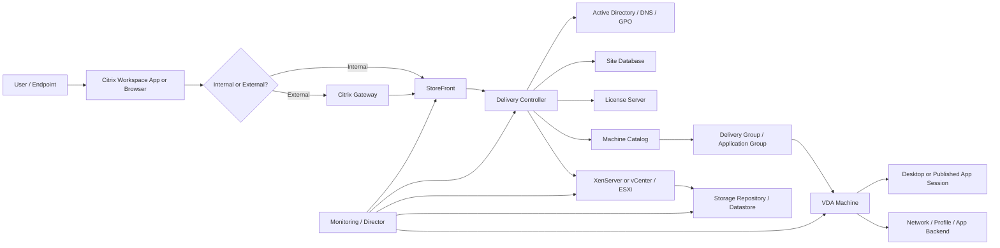
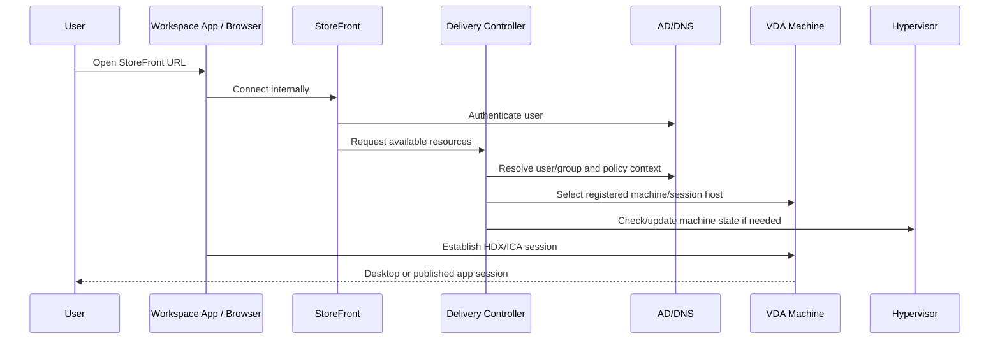
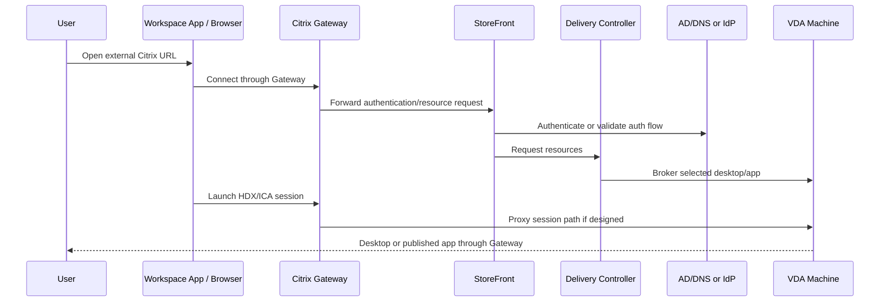

# Citrix CVAD Architecture Overview

## 0. Document Control

| Trường | Giá trị |
|---|---|
| Thứ tự | 4 |
| Tên tài liệu | Citrix CVAD Architecture Overview |
| Tên file | 04_Citrix_CVAD_Architecture_Overview.md |
| Mục đích tài liệu | Giải thích kiến trúc Citrix Virtual Apps and Desktops, vai trò của Delivery Controller, StoreFront, Citrix Gateway, VDA, Site Database, License Server, Machine Catalog và Delivery Group. |
| Nguồn điều khiển | [[sources/vdi-training-idea]], [[sources/vdi-documentation-list-context]] |
| Trạng thái thông tin | Có tri thức kiến trúc nền tảng; topology, version, Site design, database HA, gateway path, hypervisor mapping và owner thật vẫn là Need Customer Confirmation. |

### 0.1 Source Grounding

| Nhóm tri thức | Nguồn sử dụng | Mức độ tin cậy | Ghi chú |
|---|---|---|---|
| Bối cảnh khách hàng có hệ thống Citrix CVAD quy mô 1500 đến hơn 2000 VDI | [[sources/vdi-training-idea]] | High | Nguồn điều khiển bối cảnh và định hướng vận hành theo lớp. |
| Tên tài liệu, tên file, mục đích và phạm vi | [[sources/vdi-documentation-list-context]] | High | Source of truth cho scope tài liệu này. |
| Delivery Controller, StoreFront, Site Database, VDA, Machine Catalog, Delivery Group, HDX, ICA channel, machine identity | [[sources/citrix-virtual-apps-and-desktops-7-2603]] | High | Nguồn chính cho kiến trúc Citrix CVAD. |
| XenServer host, pool, VM, storage repository, networking, HA, update | [[sources/xenserver-8-4]] | High | Dùng để giải thích trường hợp CVAD chạy trên XenServer. |
| VMware ESXi, vCenter, VM, datastore, virtual networking, snapshot | [[sources/vmware-vsphere-8-0]], [[sources/vcenter-server-installation-and-setup]] | High | Dùng để giải thích trường hợp CVAD chạy trên VMware ESXi/vCenter. |

### 0.2 In Scope

- Giải thích kiến trúc Citrix Virtual Apps and Desktops ở mức system engineer cần để vận hành.
- Làm rõ vai trò của Citrix Gateway, StoreFront, Delivery Controller, Site Database, License Server, VDA, Machine Catalog và Delivery Group.
- Phân biệt desktop, published application, Machine Catalog, Delivery Group và VDA registration.
- Mô tả luồng truy cập nội bộ và bên ngoài.
- Giải thích dependency với Active Directory, hypervisor, storage, network, monitoring và policy.
- Cung cấp cách đọc lỗi CVAD theo lớp, evidence cần lấy và khi nào cần escalation.

### 0.3 Out of Scope

- Không thay thế runbook cấu hình Citrix CVAD chi tiết.
- Không hướng dẫn triển khai mới Delivery Controller, StoreFront, Gateway, SQL hoặc hypervisor.
- Không mô tả chi tiết Omnissa Horizon; Horizon thuộc tài liệu riêng.
- Không giả định CVAD đang chạy on-premises Site, Citrix Cloud hay mô hình lai khi chưa xác nhận.
- Không giả định version, topology, hostname, VIP, IP, firewall rule, database HA, license model, monitoring tool hoặc owner.
- Không yêu cầu secret, password, token hoặc credential.

## 1. Tài liệu này giúp engineer làm được gì

Tài liệu này giúp engineer hiểu Citrix CVAD như một nền tảng cung cấp desktop và published application, không chỉ là một console có danh sách máy. Khi user báo "Citrix lỗi", engineer cần biết lỗi có thể nằm ở Citrix Workspace App, Gateway, StoreFront, Delivery Controller, database, license, Machine Catalog, Delivery Group, VDA, hypervisor, storage, network, AD/DNS hoặc HDX/ICA path.

Sau khi học xong, engineer cần làm được:

1. Mô tả được kiến trúc logic của Citrix CVAD.
2. Phân biệt vai trò StoreFront, Delivery Controller, Citrix Gateway và VDA.
3. Hiểu Site Database và License Server ảnh hưởng thế nào tới control plane.
4. Giải thích Machine Catalog và Delivery Group trong quá trình cấp desktop/application.
5. Mô tả luồng truy cập nội bộ và bên ngoài.
6. Khoanh vùng lỗi theo lớp và chuẩn bị evidence trước escalation.

## 2. Citrix CVAD trong bối cảnh khách hàng

Theo [[sources/vdi-training-idea]], khách hàng có một hệ thống Citrix Virtual Apps and Desktops, viết tắt CVAD, có thể chạy trên XenServer hoặc VMware ESXi, quy mô khoảng 1500 đến hơn 2000 VDI.

Với quy mô này, CVAD cần được nhìn như một platform nhiều lớp:

- User access: Citrix Workspace App hoặc browser.
- Gateway: Citrix Gateway nếu user truy cập từ ngoài hoặc theo thiết kế bảo mật.
- Portal: StoreFront để user đăng nhập và nhìn thấy resource.
- Broker/control plane: Delivery Controller.
- Data/config layer: Site Database, Monitoring Database, Configuration Logging nếu có.
- Resource grouping: Machine Catalog, Delivery Group, Application Group.
- Session layer: desktop VM, server OS machine hoặc VDA machine.
- Experience protocol: HDX/ICA và các virtual channel.
- Infrastructure layer: XenServer hoặc VMware ESXi/vCenter, storage, network.
- Operation layer: monitoring, Director nếu có, alerting, incident, change, support.

Thông tin hiện có chỉ cho biết hypervisor có thể là XenServer hoặc VMware ESXi. Chưa đủ để biết từng catalog chạy trên nền nào. Đây là điểm cần xác nhận sớm vì cách kiểm tra VM, host, storage repository/datastore và maintenance sẽ khác nhau.

## 3. Kiến trúc CVAD ở mức dễ hiểu

Sơ đồ trên là mô hình đào tạo, không phải topology thật của khách hàng.

Một phiên CVAD thành công thường cần:

1. User mở Citrix Workspace App hoặc StoreFront website.
2. User đến đúng URL nội bộ hoặc external Gateway.
3. Certificate, DNS, load balancer và firewall path hoạt động.
4. User xác thực thành công với identity system.
5. StoreFront lấy danh sách resource user được phép thấy.
6. Delivery Controller kiểm tra policy, entitlement và chọn VDA/machine phù hợp.
7. Machine Catalog và Delivery Group có machine available.
8. VDA registered với Delivery Controller.
9. HDX/ICA session thiết lập được giữa client/gateway và VDA.
10. Profile, policy, printer, clipboard, drive mapping và application backend hoạt động.

Nếu user nói "không vào được Citrix", câu đầu tiên của engineer không nên là "Controller có lỗi không?", mà nên là "user đang kẹt ở bước nào trong chuỗi trên?"

## 4. Thành phần chính và vai trò

| Thành phần | Vai trò trong CVAD | Phụ thuộc vào | Triệu chứng khi lỗi | Engineer cần kiểm tra | Evidence cần lưu |
|---|---|---|---|---|---|
| Citrix Workspace App / Browser | Client để user truy cập desktop/app | Client version, endpoint network, certificate trust, Store URL | Không mở portal, launch fail, lỗi client-side | Client version, URL, internal/external, screenshot | Screenshot, timestamp, endpoint, user location |
| Citrix Gateway | Gateway cho external access và proxy session path nếu thiết kế dùng | DNS, certificate, load balancer, firewall, StoreFront, STA path | External-only issue, timeout, cert warning, launch fail | Gateway health, cert, LB member, firewall/NAT, session policy | Gateway log/status, cert info, LB status |
| StoreFront | Portal hiển thị desktop/application cho user | AD/auth config, Delivery Controller, store config, certificate/LB | Login fail, không thấy resource, Store unavailable | Store health, authentication method, store config, Controller connectivity | StoreFront event/log, user/resource screenshot |
| Delivery Controller | Broker/control plane của Citrix Site | Site Database, AD/DNS, License Server, VDA, hypervisor connection | Không broker được session, resource unavailable, failed session | Controller service, Site health, DB connectivity, VDA registration, hypervisor connection | Controller event, Site health, failed session |
| Site Database | Lưu cấu hình và trạng thái quan trọng của Site | SQL Server, network, DB HA/backup, permissions | Site degraded, config không đọc/ghi được, brokering bị ảnh hưởng | DB connectivity, DB health, SQL HA, recent DB maintenance | DB status, Controller DB connectivity |
| License Server | Cung cấp license cho Citrix components/session | License file, service, network reachability, expiry | License warning, session/resource bị giới hạn tùy trạng thái | License service, expiry, usage, alert | License dashboard/screenshot |
| Machine Catalog | Nhóm máy được quản lý cùng loại/provisioning | Master image, hypervisor, VDA, machine identity, storage | Machine unavailable, provisioning lỗi, nhiều VDA unregistered | Catalog state, machine count, provisioning method, image version | Catalog screenshot, machine list, image/change ID |
| Delivery Group | Gán machine/resource cho user/group | Machine Catalog, AD group, application/desktop assignment, policy | User không thấy resource, resource unavailable, launch fail | Entitlement, user group, machine availability, assigned apps/desktops | Delivery Group mapping, user/group evidence |
| VDA | Agent trên desktop/session host để nhận session | Controller list, DNS, domain, service, firewall, image, policy | VDA unregistered, launch fail, black screen, session disconnect | VDA service, registration, event log, Controller reachability, VM state | VDA log/event, registration status, VM state |
| Hypervisor | Chạy VM workload và lifecycle machine | XenServer/ESXi/vCenter, host, pool/cluster, storage, network | VM off, stuck provisioning, host/storage issue, performance degradation | Host/cluster health, VM power, task/event, datastore/SR | Hypervisor event, host/storage metrics |
| Storage/Network | Nền cho VM, profile, image, ICA/HDX path và app backend | Capacity, latency, routing, firewall, DNS, LB, profile share | Login chậm, disconnect, black screen, app chậm, VDA unregistered | Storage latency/capacity, packet loss, firewall path, DNS | Metrics, test result, network/storage alert |

## 5. StoreFront: portal và resource presentation

StoreFront là nơi user thường tương tác để đăng nhập và nhìn thấy desktop/application. Nó không phải là nơi chạy session, nhưng là thành phần rất quan trọng trong user experience.

StoreFront làm các việc chính:

- Nhận truy cập từ Citrix Workspace App hoặc browser.
- Xử lý authentication theo cấu hình.
- Kết nối tới Delivery Controller để lấy danh sách resource.
- Trình bày desktop/application user được phép dùng.
- Tạo thông tin cần thiết để client launch resource.

### 5.1 Khi nào nghi ngờ StoreFront

| Dấu hiệu | Cách nghĩ |
|---|---|
| User không mở được Store URL | Có thể StoreFront, DNS, LB, certificate hoặc network |
| User login fail tại portal | Có thể authentication method, AD, StoreFront config hoặc Gateway path |
| User login được nhưng không thấy app/desktop | Có thể StoreFront không lấy được resource, Delivery Group/entitlement sai hoặc Controller issue |
| Một Store lỗi, Store khác bình thường | Có thể Store config, server member, LB hoặc certificate |

### 5.2 Evidence nên lấy

- Store URL, internal/external.
- Screenshot lỗi.
- StoreFront event/log.
- Authentication method.
- StoreFront-to-Controller connectivity.
- User group và resource mapping.
- Recent StoreFront, certificate hoặc load balancer change.

## 6. Delivery Controller: broker và control plane

Delivery Controller là thành phần trung tâm của Citrix Site. Nó quản lý brokering, machine state, session, policy và giao tiếp với database, VDA, hypervisor và các thành phần liên quan.

Delivery Controller không chạy desktop của user. Nó điều phối việc user sẽ đi tới VDA/machine nào.

Các vai trò chính:

- Broker connection giữa user và resource.
- Quản lý trạng thái machine và session.
- Giao tiếp với Site Database.
- Giao tiếp với VDA để nhận registration và điều phối session.
- Giao tiếp với hypervisor để quản lý machine lifecycle nếu thiết kế yêu cầu.
- Áp policy và kiểm tra cấu hình liên quan.

### 6.1 Delivery Controller phụ thuộc gì

| Dependency | Nếu lỗi thì có thể thấy gì |
|---|---|
| Site Database | Site degraded, config/session brokering bị ảnh hưởng, console thao tác lỗi |
| AD/DNS | Authentication lỗi, user/group không resolve, VDA registration lỗi |
| License Server | License warning, nguy cơ gián đoạn hoặc giới hạn theo trạng thái license |
| VDA | VDA unregistered, launch fail, machine unavailable |
| Hypervisor connection | Provisioning/power task lỗi, machine state không cập nhật |
| Network/firewall | Controller không giao tiếp được StoreFront, VDA, DB, hypervisor |

### 6.2 Khi nào nghi ngờ Delivery Controller

- Nhiều user ở nhiều Delivery Group cùng launch fail.
- VDA registration giảm hàng loạt nhưng VM vẫn chạy.
- StoreFront login được nhưng resource launch lỗi hàng loạt.
- Site health hoặc broker service có alert.
- Controller không kết nối được database hoặc hypervisor.

## 7. Site Database và License Server

### 7.1 Site Database

Site Database lưu cấu hình và thông tin quan trọng của Citrix Site. Trong vận hành, database là dependency nền của control plane. Nếu database gặp vấn đề, hệ thống có thể bị giảm khả năng quản trị, brokering hoặc ghi nhận trạng thái tùy thiết kế và tình huống lỗi.

Engineer không cần trở thành DBA để vận hành CVAD, nhưng cần biết:

- Database nằm ở đâu.
- Có HA không.
- Ai sở hữu SQL/backup.
- Delivery Controller kết nối database qua path nào.
- Có recent DB maintenance, failover hoặc network issue không.

Evidence cần lấy khi nghi database:

- Site/Controller health.
- Database connectivity status.
- SQL/server alert nếu được cấp.
- Thời điểm lỗi so với DB maintenance.
- Impact scope: một Controller hay toàn Site.

### 7.2 License Server

License Server là thành phần cần theo dõi vì license status ảnh hưởng tới khả năng sử dụng hợp lệ và có thể tạo cảnh báo vận hành. Engineer cần biết license không phải là nơi đầu tiên kiểm tra cho mọi lỗi launch, nhưng không được bỏ qua trong health check.

Cần xác nhận:

- License Server ở đâu.
- License model và expiry.
- Alert threshold.
- Ai sở hữu license renewal.
- Dashboard nào là nguồn tin cậy.

## 8. VDA và session layer

VDA, viết tắt Virtual Delivery Agent, là thành phần cài trên máy cung cấp desktop hoặc application. VDA là cầu nối giữa Citrix control plane và workload thực tế của user.

VDA cần:

- Máy chạy và network hoạt động.
- Join domain đúng nếu thiết kế yêu cầu.
- DNS và time sync ổn.
- VDA service chạy.
- Biết Delivery Controller hoặc có cơ chế discovery đúng.
- Firewall/path tới Controller và session path không bị chặn.
- Version tương thích với Site.
- Image không bị lỗi sau patch/update.

### 8.1 VDA registration

VDA registration là trạng thái VDA đăng ký thành công với Delivery Controller. Đây là chỉ số vận hành quan trọng nhất ở session layer.

| Trạng thái | Ý nghĩa vận hành |
|---|---|
| Registered | Machine sẵn sàng được broker cân nhắc cấp session |
| Unregistered | Controller không thể broker session tới machine đó |
| In maintenance mode | Machine không nhận session mới theo chủ ý vận hành |
| Power state mismatch | Controller/hypervisor thấy trạng thái không khớp hoặc chưa cập nhật |
| Session active/disconnected | User session đang chạy hoặc đã mất kết nối |

Tên trạng thái cụ thể phụ thuộc console/version; cần xác nhận với môi trường thật.

### 8.2 Khi nhiều VDA unregistered

Nếu một VDA unregistered, có thể là lỗi máy đơn lẻ. Nếu nhiều VDA trong cùng Machine Catalog hoặc Delivery Group unregistered, cần nghĩ tới:

- Recent image update.
- VDA version hoặc service lỗi.
- DNS/AD/GPO issue.
- Controller list hoặc discovery sai.
- Firewall/network path tới Controller.
- Hypervisor/VM power issue.
- Storage repository/datastore hoặc cluster issue.

Không nên reboot hàng loạt trước khi lấy evidence.

## 9. Machine Catalog và Delivery Group

Machine Catalog và Delivery Group là hai khái niệm người mới rất dễ nhầm.

### 9.1 Machine Catalog

Machine Catalog là nhóm machine có cùng cách quản lý/provisioning hoặc cùng loại workload. Nó trả lời câu hỏi: "Citrix có những máy nào để cung cấp desktop/app?"

Machine Catalog thường liên quan:

- Loại OS: single-session desktop OS hoặc multi-session/server OS.
- Provisioning method.
- Master image hoặc template.
- Hypervisor connection.
- Machine identity.
- VDA version.
- VM power và registration state.

### 9.2 Delivery Group

Delivery Group trả lời câu hỏi: "User/group nào được dùng machine hoặc application nào?" Delivery Group lấy machine từ Machine Catalog và gán cho user hoặc nhóm user.

Delivery Group thường liên quan:

- AD user/group.
- Desktop assignment.
- Published application.
- Application Group nếu có.
- Policy áp dụng cho session.
- Machine availability.

### 9.3 Bảng phân biệt

| Nội dung | Machine Catalog | Delivery Group |
|---|---|---|
| Câu hỏi chính | Có những máy nào và máy được tạo/quản lý thế nào? | User nào được dùng desktop/app nào? |
| Liên quan nhiều tới | Image, provisioning, hypervisor, VDA, machine identity | Entitlement, app publish, desktop assignment, policy |
| Lỗi thường gặp | VDA unregistered, machine unavailable, provisioning lỗi | User không thấy resource, resource unavailable, launch fail |
| Evidence cần lấy | Catalog state, machine list, image/provisioning, hypervisor task | User group, Delivery Group mapping, app/desktop assignment |

## 10. Citrix Gateway và luồng truy cập bên ngoài

Citrix Gateway là điểm truy cập an toàn cho user bên ngoài nếu thiết kế sử dụng gateway. Nó thường liên quan certificate, load balancer, firewall, authentication policy và session/ICA path.

Gateway issue thường có mẫu:

- User bên ngoài lỗi, user nội bộ bình thường.
- Certificate warning hoặc TLS error.
- Login được nhưng launch fail.
- ICA/HDX session timeout.
- Disconnect hoặc session reliability issue.

Cần tách hai phần:

- Access/authentication path: user tới Gateway/StoreFront/Controller để đăng nhập và thấy resource.
- Session path: client hoặc Gateway thiết lập kết nối HDX/ICA tới VDA theo thiết kế.

Nếu user login được nhưng launch fail, đừng kết luận StoreFront đã sai. Hãy kiểm tra Gateway, STA/session ticket, Controller brokering, VDA registration và HDX/ICA path.

## 11. Hypervisor, storage và network bên dưới CVAD

Theo bối cảnh, CVAD của khách hàng có thể chạy trên XenServer hoặc VMware ESXi.

### 11.1 Nếu chạy trên XenServer

Theo [[sources/xenserver-8-4]], XenServer tổ chức tài nguyên theo host, pool, VM, storage repository và network. Với CVAD, engineer cần biết:

- Machine Catalog nào chạy trên XenServer pool nào.
- Pool master/host health ra sao.
- Storage repository nào chứa VM/image.
- Network/bonding/VLAN nào phục vụ VDA.
- HA hoặc host maintenance ảnh hưởng machine nào.
- Update host hoặc licensing có impact gì.

### 11.2 Nếu chạy trên VMware ESXi/vCenter

Với ESXi/vCenter, engineer cần biết:

- Machine Catalog nào gắn với vCenter/cluster/datastore nào.
- vCenter connection từ Citrix có healthy không.
- VM power task, clone/provisioning task, snapshot/task có lỗi không.
- Datastore capacity/latency.
- Host maintenance, HA/DRS nếu có.
- Quyền integration account giữa Citrix và vCenter.

### 11.3 Storage và network

Storage và network có thể làm user nghĩ "Citrix lỗi" dù control plane vẫn khỏe:

- Storage latency làm login chậm, app launch chậm, VM boot chậm.
- Profile storage lỗi làm user mất profile hoặc logon lâu.
- Network packet loss làm HDX/ICA giật, disconnect, audio/video kém.
- Firewall path lỗi làm VDA không registered hoặc external launch fail.
- DNS lỗi làm Controller, StoreFront, VDA hoặc AD lookup không ổn định.

## 12. Luồng truy cập nội bộ và bên ngoài

### 12.1 Luồng user nội bộ

Điểm kiểm tra khi internal user lỗi:

- StoreFront URL/DNS/certificate.
- StoreFront authentication.
- StoreFront-to-Controller connectivity.
- Controller-to-Database connectivity.
- User/group entitlement.
- Delivery Group/Application Group.
- VDA registration.
- HDX/ICA path tới VDA.
- Hypervisor/storage/network nếu nhiều machine ảnh hưởng.

### 12.2 Luồng user bên ngoài

Điểm kiểm tra khi external user lỗi:

- External DNS.
- Gateway certificate.
- Gateway/LB health.
- Firewall/NAT.
- Gateway-to-StoreFront path.
- StoreFront-to-Controller path.
- Controller-to-VDA registration.
- Gateway/session path tới VDA.
- So sánh với internal access cùng user/resource.

## 13. Monitoring và chỉ số cần quan sát

| Nhóm chỉ số | Vì sao cần theo dõi | Ví dụ evidence |
|---|---|---|
| StoreFront health | User portal và resource list phụ thuộc StoreFront | Store availability, event log, auth error |
| Delivery Controller health | Broker/session control phụ thuộc Controller | Service status, Site health, broker events |
| Database connectivity | Control plane cần Site DB | DB connection status, SQL alert, failover event |
| License status | Tránh rủi ro license ảnh hưởng dịch vụ | License usage, expiry, alert |
| VDA registration | Chỉ báo machine có sẵn sàng nhận session không | Registered/unregistered count, trend by catalog |
| Machine availability | Biết catalog/group còn đủ máy không | Available/used/maintenance/power state |
| Session count | Theo dõi tải và concurrency | Active/disconnected/failed sessions |
| Failed launch | Phát hiện lỗi brokering/session path | Failed session trend, error category |
| Login duration | Phát hiện profile/GPO/storage/DC issue | Logon duration, profile/GPO breakdown nếu có |
| Hypervisor health | VM workload phụ thuộc host/pool/cluster | Host CPU/memory, task failures, VM power |
| Storage latency/capacity | Ảnh hưởng boot/logon/session | Datastore/SR latency, capacity, IOPS |
| Network quality | Ảnh hưởng HDX/ICA và disconnect | Latency, packet loss, firewall/LB log |

Monitoring tool thật của khách hàng là Unknown. Cần xác nhận Director, third-party monitoring, hypervisor dashboard, storage dashboard và alert owner.

## 14. Lỗi CVAD thường gặp và hướng chẩn đoán

| Triệu chứng | Nguyên nhân có thể | Lớp cần kiểm tra | Evidence cần thu thập | Hướng chẩn đoán | Khi nào escalation |
|---|---|---|---|---|---|
| User không mở được StoreFront/Gateway URL | DNS, certificate, LB, Gateway/StoreFront down, firewall | User access, Gateway, StoreFront, Network | URL, screenshot, internal/external, cert, DNS result | Tách internal/external; kiểm tra Gateway/StoreFront/LB/cert | Nhiều user hoặc cần network/security/platform owner |
| Login fail | AD account, MFA/IdP nếu có, StoreFront auth, Gateway policy | Identity, Gateway, StoreFront | User, timestamp, auth log, StoreFront/Gateway event | Kiểm tra account/group/DC/DNS/time sync và auth path | Nhiều user hoặc cần identity/security |
| Login được nhưng không thấy desktop/app | Delivery Group, Application Group, AD group, Store config, Controller issue | StoreFront, Controller, Entitlement | User group, resource mapping, StoreFront resource list, Controller event | Kiểm tra entitlement và Delivery Group/Application Group | Cần thay đổi quyền hoặc ảnh hưởng business group |
| Click app/desktop nhưng launch fail | VDA unregistered, machine unavailable, HDX/ICA path, Gateway, Controller brokering | Controller, VDA, Gateway, Network | Failed launch, VDA registration, machine state, Gateway/Controller log | Kiểm tra VDA, machine availability, session path | Nhiều user/machine hoặc cần network/hypervisor |
| VDA unregistered hàng loạt | Image/VDA update, DNS/GPO, Controller discovery, firewall, hypervisor | VDA, Identity, Network, Image, Hypervisor | Registration trend, VDA log, image/change ID, DNS result | Tìm điểm chung theo catalog/image/Controller/path | Ảnh hưởng nhiều máy hoặc cần rollback |
| Một Delivery Group không có machine available | Catalog issue, maintenance mode, power state, provisioning, capacity | Delivery Group, Machine Catalog, Hypervisor | Machine list, maintenance state, power state, hypervisor tasks | Kiểm tra catalog/group và VM lifecycle | Cần Citrix platform/hypervisor owner |
| Published app mở rồi crash | App config, session host, user profile, policy, backend dependency | VDA, Application, Profile, Policy, Backend | App event log, user sample, session host, profile log | Phân biệt app crash với launch/session failure | Nhiều user cùng app hoặc cần app owner |
| Login chậm | Profile, GPO, storage latency, DC latency, logon storm | Profile, Identity, Storage, Performance | Logon duration, profile/GPO log, storage/DC metrics | Correlate theo timestamp và scope | Vượt SLA hoặc ảnh hưởng nhiều user |
| Session disconnect/HDX kém | Network latency/loss, Gateway, firewall idle timeout, endpoint, host contention | Network, Gateway, VDA, Hypervisor | Packet loss, Gateway log, session reconnect log, host metrics | Tách internal/external và theo timeframe | Diện rộng hoặc cần network/security |
| Database warning/Site degraded | SQL issue, DB HA/failover, network to DB | Database, Controller, Network | Controller DB connectivity, SQL alert, failover time | Kiểm tra DB health và impact Site | Cần DBA/platform owner |

## 15. Operational checklist cho CVAD engineer

### Khi nhận ticket Citrix

- [ ] Xác nhận user đang dùng Citrix, không nhầm với Horizon.
- [ ] Xác nhận user dùng Workspace App hay browser.
- [ ] Xác nhận internal hay external access.
- [ ] Xác nhận lỗi xảy ra ở bước nào: mở URL, login, thấy resource, launch, app chạy, session chậm, disconnect.
- [ ] Ghi timestamp, screenshot, user, endpoint, network location.
- [ ] Xác định resource: desktop, published app, Delivery Group, Application Group nếu biết.
- [ ] Kiểm tra recent change: Gateway, StoreFront, Controller, VDA/image, policy, AD group, firewall, storage, hypervisor.

### Kiểm tra theo lớp

- [ ] Client/URL/DNS.
- [ ] Gateway nếu external.
- [ ] StoreFront health và authentication.
- [ ] Delivery Controller health.
- [ ] Site Database connectivity.
- [ ] License status.
- [ ] User group và entitlement.
- [ ] Delivery Group/Application Group.
- [ ] Machine Catalog.
- [ ] VDA registration.
- [ ] VM power và hypervisor task/event.
- [ ] Storage/network/profile nếu performance hoặc diện rộng.

### Evidence cần lưu

- [ ] Ticket ID và impact scope.
- [ ] User sample và thời điểm lỗi.
- [ ] Internal/external path.
- [ ] Screenshot lỗi.
- [ ] StoreFront/Gateway event nếu liên quan access.
- [ ] Delivery Controller event hoặc failed session.
- [ ] Delivery Group/Application Group mapping.
- [ ] Machine Catalog và VDA registration state.
- [ ] Hypervisor task/event nếu liên quan VM/provisioning.
- [ ] Storage/network metrics nếu có dấu hiệu performance.
- [ ] Recent change ID nếu có.

## 16. Tình huống học tập

### Tình huống 1: User login được nhưng không thấy published application

**Bối cảnh:** User đăng nhập StoreFront thành công nhưng không thấy ứng dụng được yêu cầu.

**Câu hỏi cho học viên:**

- Có nên kiểm tra VDA đầu tiên không?
- Cần kiểm tra StoreFront, Delivery Group hay AD group?
- Evidence nào cần có trước khi yêu cầu cấp quyền?

**Gợi ý phân tích:**

Nếu user login được nhưng không thấy app, lỗi thường nằm ở resource presentation hoặc entitlement: AD group, Delivery Group, Application Group, StoreFront store hoặc Controller resource enumeration. VDA là bước sau khi user launch.

**Hướng xử lý đề xuất:**

1. Xác nhận app name và user.
2. Kiểm tra user group membership.
3. Kiểm tra Delivery Group/Application Group mapping.
4. Kiểm tra StoreFront resource enumeration nếu nhiều user cùng không thấy.
5. Nếu cần cấp quyền, yêu cầu approval theo quy trình.

**Evidence cần lưu:** screenshot resource list, user/group, app name, Delivery Group/Application Group mapping, approval/change request.

### Tình huống 2: External user launch fail, internal user bình thường

**Bối cảnh:** User ngoài công ty đăng nhập được Citrix Gateway và thấy desktop, nhưng launch bị timeout. User nội bộ launch cùng desktop bình thường.

**Câu hỏi cho học viên:**

- Điều này gợi ý lớp nào?
- StoreFront có chắc là root cause không?
- Cần kiểm tra session path nào?

**Gợi ý phân tích:**

External-only launch fail gợi ý Gateway, firewall, NAT, certificate, STA/session path hoặc HDX/ICA proxy path. Vì internal user bình thường, Delivery Controller và VDA có thể hoạt động với path nội bộ.

**Hướng xử lý đề xuất:**

1. So sánh internal/external với cùng resource.
2. Kiểm tra Gateway health, certificate, LB member.
3. Kiểm tra Controller failed launch.
4. Kiểm tra VDA registration.
5. Kiểm tra firewall/path từ Gateway tới VDA theo thiết kế.

**Evidence cần lưu:** external URL, user sample, Gateway log, Controller event, VDA state, internal comparison.

### Tình huống 3: Nhiều VDA unregistered trong một Machine Catalog

**Bối cảnh:** Sau maintenance, một Machine Catalog có nhiều máy unregistered, các catalog khác bình thường.

**Câu hỏi cho học viên:**

- Điểm chung cần tìm là gì?
- Vì sao không nên reboot toàn bộ catalog ngay?
- Khi nào cần rollback image?

**Gợi ý phân tích:**

Nếu lỗi tập trung ở một catalog, kiểm tra image, VDA version, provisioning method, AD/DNS/GPO, Controller discovery, firewall path và hypervisor/storage mapping của catalog đó.

**Hướng xử lý đề xuất:**

1. Xác nhận change ID và image/VDA version.
2. So sánh máy registered và unregistered.
3. Kiểm tra VDA event/log trên máy mẫu.
4. Kiểm tra DNS/AD/GPO/firewall.
5. Kiểm tra hypervisor task và VM power.
6. Dừng rollout hoặc rollback nếu image/VDA update là điểm chung.

**Evidence cần lưu:** catalog state, registration trend, image/change ID, VDA log, hypervisor event, máy mẫu.

### Tình huống 4: Site cảnh báo database connectivity

**Bối cảnh:** Monitoring báo Delivery Controller có lỗi kết nối Site Database, user bắt đầu báo launch chập chờn.

**Câu hỏi cho học viên:**

- Database thuộc lớp nào của CVAD?
- Cần kiểm tra gì trước khi kết luận Controller lỗi?
- Owner nào cần escalation?

**Gợi ý phân tích:**

Site Database là dependency của control plane. Nếu database hoặc network tới database lỗi, Controller có thể bị ảnh hưởng dù service còn chạy.

**Hướng xử lý đề xuất:**

1. Kiểm tra Controller health.
2. Kiểm tra database connectivity từ Controller.
3. Kiểm tra SQL/DB HA/failover event nếu có quyền.
4. Xác định impact scope: một Controller hay toàn Site.
5. Escalate DBA/platform/network theo RACI.

**Evidence cần lưu:** Controller event, DB connectivity status, SQL alert/failover time, user impact, timestamp.

## 17. Bài tập tư duy

### Bài tập 1: Vẽ luồng external CVAD

Vẽ lại luồng user external vào published application, gồm Citrix Workspace App, Citrix Gateway, StoreFront, Delivery Controller, AD/DNS, Delivery Group, VDA, hypervisor, storage và network. Đánh dấu đoạn nào liên quan resource enumeration và đoạn nào liên quan HDX/ICA session.

### Bài tập 2: Phân biệt Catalog và Delivery Group

Tạo bảng cho một ứng dụng quan trọng:

- Application name.
- Delivery Group.
- Application Group nếu có.
- AD group entitlement.
- Machine Catalog.
- VDA version.
- Hypervisor/cluster.
- Profile solution.
- Owner.
- Unknown cần hỏi.

### Bài tập 3: Phân loại lỗi theo lớp

| Triệu chứng | Lớp ưu tiên |
|---|---|
| User không mở được external URL | Gateway/certificate/DNS/LB/firewall |
| User login được nhưng không thấy app | StoreFront/resource enumeration/entitlement |
| Click app bị launch fail | Delivery Controller/VDA/HDX path/Gateway |
| Nhiều VDA unregistered cùng catalog | VDA/image/DNS/GPO/firewall/hypervisor |
| Site DB connectivity warning | Database/Controller/network |

### Bài tập 4: Evidence trước escalation

Bạn cần escalation lỗi "Citrix external launch fail" sang network/security. Chuẩn bị evidence gồm: user sample, timestamp, internal/external comparison, Gateway log, StoreFront/Controller event, Delivery Group, VDA registration, certificate/LB status và firewall path nghi vấn.

## 18. Knowledge Check

### Câu 1

**StoreFront trong CVAD làm gì?**

**Đáp án:** StoreFront là portal để user đăng nhập và nhìn thấy desktop/application được cấp quyền; nó lấy resource từ Delivery Controller và phục vụ Citrix Workspace App hoặc browser.

### Câu 2

**Delivery Controller khác StoreFront như thế nào?**

**Đáp án:** StoreFront trình bày resource cho user; Delivery Controller là broker/control plane quản lý machine, session, policy, VDA registration và brokering.

### Câu 3

**VDA registration quan trọng vì sao?**

**Đáp án:** Nếu VDA không registered với Delivery Controller, machine không sẵn sàng nhận session, dẫn tới launch fail hoặc thiếu machine available.

### Câu 4

**Machine Catalog khác Delivery Group như thế nào?**

**Đáp án:** Machine Catalog trả lời "có những máy nào và được quản lý/provision thế nào"; Delivery Group trả lời "user/group nào được dùng desktop/app nào trên các máy đó".

### Câu 5

**User login được nhưng không thấy app nên kiểm tra gì trước?**

**Đáp án:** AD group, StoreFront resource enumeration, Delivery Group/Application Group entitlement và Controller/resource mapping.

### Câu 6

**External-only launch fail thường gợi ý lớp nào?**

**Đáp án:** Citrix Gateway, certificate, load balancer, firewall/NAT, Gateway-to-VDA path hoặc HDX/ICA proxy/session path.

### Câu 7

**Site Database ảnh hưởng gì tới CVAD?**

**Đáp án:** Site Database lưu cấu hình và thông tin quan trọng của Site; lỗi database hoặc kết nối DB có thể ảnh hưởng control plane, quản trị và brokering tùy tình huống.

### Câu 8

**License Server có nên nằm trong health check không?**

**Đáp án:** Có. License status, expiry và usage cần theo dõi để tránh rủi ro vận hành và cảnh báo license.

### Câu 9

**Nếu nhiều VDA trong cùng Machine Catalog unregistered sau image update, cần nghĩ tới gì?**

**Đáp án:** Image/VDA version, VDA service, DNS/GPO, Controller discovery, firewall path, hypervisor/storage mapping và recent change.

### Câu 10

**Thông tin nào cần xác nhận trước khi viết SOP CVAD chi tiết?**

**Đáp án:** Version, topology, Site design, Gateway/StoreFront/Controller count, database HA, license model, hypervisor mapping, Machine Catalog/Delivery Group mapping, profile solution, monitoring, access flow, owner và escalation path.

## 19. Hiểu nhầm thường gặp

| Hiểu nhầm | Vì sao sai | Cách nghĩ đúng |
|---|---|---|
| "Citrix lỗi là Delivery Controller lỗi" | Lỗi có thể nằm ở StoreFront, Gateway, VDA, DB, license, hypervisor, storage, network hoặc identity. | Xác định bước lỗi trước rồi kiểm tra theo lớp. |
| "Login được nghĩa là Gateway ổn" | Gateway/session path vẫn có thể lỗi khi launch HDX/ICA. | Tách authentication/resource enumeration và session launch path. |
| "Không thấy app là do app server down" | Có thể user chưa được entitlement hoặc StoreFront/Delivery Group không trả resource. | Kiểm tra AD group, Delivery Group/Application Group trước. |
| "VDA unregistered chỉ cần reboot máy" | Có thể do image, DNS/GPO, firewall, Controller discovery hoặc hypervisor. | Tìm điểm chung và lưu evidence trước khi reboot hàng loạt. |
| "Machine Catalog và Delivery Group giống nhau" | Một bên quản lý máy, một bên gán user/resource. | Dùng đúng khái niệm để triage đúng. |
| "Database chỉ là việc của DBA" | Database là dependency của Citrix control plane. | Engineer cần biết DB health, owner và evidence cần escalation. |

## 20. Need Customer Confirmation

| Nhóm | Câu hỏi cần xác nhận | Vì sao cần |
|---|---|---|
| Version | CVAD, StoreFront, Gateway/ADC, VDA, License Server version là gì? | Xác định compatibility, known issues và đúng tài liệu vendor. |
| Deployment model | Hệ thống là on-premises Site, Citrix Cloud hay hybrid? | Xác định control plane và owner. |
| Topology | Có bao nhiêu Site, Delivery Controller, StoreFront, Gateway, datacenter? | Hiểu HA, scope impact và troubleshooting path. |
| Gateway | User external đi qua Gateway nào, có LB/HA không, dùng certificate nào? | Xử lý external access và launch issue. |
| StoreFront | Có bao nhiêu StoreFront server, store nào phục vụ user nào? | Xử lý login/resource enumeration. |
| Controller | Controller nào thuộc Site nào, health check và load balancing ra sao? | Xử lý broker/session issue. |
| Database | Site DB, Monitoring DB, Logging DB nằm ở đâu, HA/backup thế nào? | Xử lý control plane và audit/monitoring issue. |
| License | License Server, license model, expiry, owner renewal là ai? | Theo dõi rủi ro license. |
| Catalog | Machine Catalog mapping với image, hypervisor, datastore/SR ra sao? | Xử lý VDA/provisioning/capacity. |
| Delivery Group | Delivery Group/Application Group mapping với AD group thế nào? | Xử lý user không thấy resource. |
| VDA | VDA version, update process, Controller discovery method là gì? | Xử lý unregistered và launch fail. |
| Hypervisor | Catalog nào chạy trên XenServer, catalog nào chạy trên ESXi/vCenter? | Xác định console, owner và evidence hạ tầng. |
| Storage | Storage repository/datastore/profile storage mapping ra sao? | Xử lý login chậm, storage latency, capacity. |
| Network | Firewall path cho Gateway-SF-Controller-VDA-DB-hypervisor là gì? | Xử lý timeout, HDX/ICA và registration issue. |
| Profile | Dùng FSLogix, Citrix Profile Management hay giải pháp khác? | Xử lý login/profile issue. |
| Monitoring | Director và tool monitoring nào là nguồn chính? | Health check và alert triage. |
| Ownership | Ai sở hữu Citrix, Gateway/ADC, SQL, AD, network, storage, hypervisor, security? | Escalation đúng nhóm. |
| Change | Quy trình thay đổi image, VDA, policy, Gateway, StoreFront, Controller, DB là gì? | Giảm rủi ro impact diện rộng. |

## 21. Related Wiki Links

### Source pages

- [[sources/vdi-training-idea]]
- [[sources/vdi-documentation-list-context]]
- [[sources/citrix-virtual-apps-and-desktops-7-2603]]
- [[sources/xenserver-8-4]]
- [[sources/vmware-vsphere-8-0]]
- [[sources/vcenter-server-installation-and-setup]]

### Concept pages

- [[concepts/citrix-virtual-apps-and-desktops]]
- [[concepts/delivery-controller]]
- [[concepts/storefront]]
- [[concepts/virtual-delivery-agent]]
- [[concepts/delivery-group]]
- [[concepts/hdx]]
- [[concepts/ica-virtual-channel]]
- [[concepts/machine-identity]]
- [[concepts/vdi-connection-flow]]
- [[concepts/xenserver]]
- [[concepts/hypervisor-pool]]
- [[concepts/storage-repository]]
- [[concepts/vmware-vsphere]]
- [[concepts/esxi]]
- [[concepts/vcenter-server]]
- [[concepts/identity-and-access-management]]
- [[concepts/virtual-networking]]

### Topic pages nên đọc tiếp

- [[topics/1_VDI_Foundation_Overview]]: nắm nền tảng VDI trước khi đọc kiến trúc Citrix.
- [[topics/2_Customer_VDI_Landscape_Overview]]: đặt CVAD vào bức tranh hai hệ thống của khách hàng.
- [[topics/5_VDI_Access_Flow_Design]]: đi sâu vào access flow nội bộ và bên ngoài.
- [[topics/7_Hypervisor_and_HCI_Operations_Guide]]: hiểu lớp hypervisor bên dưới CVAD.
- [[topics/13_Citrix_Machine_Catalog_and_Delivery_Group_Guide]]: đi sâu vào Catalog, Delivery Group và Application Group.
- [[topics/18_VDI_Troubleshooting_Playbook]]: dùng kiến trúc này để xử lý sự cố.

## 22. Summary for Learners

Citrix CVAD là nền tảng nhiều lớp để cung cấp desktop và published application. StoreFront là nơi user thấy resource; Delivery Controller là broker/control plane; Site Database là dependency cấu hình/trạng thái quan trọng; License Server cần được theo dõi; Machine Catalog quản lý nhóm máy; Delivery Group gán máy/app cho user; VDA là agent trong máy cung cấp session; Gateway bảo vệ access path bên ngoài; hypervisor, storage và network quyết định workload có chạy ổn không.

Điều engineer cần nhớ:

- Đừng gọi chung mọi lỗi là "Citrix lỗi"; hãy chỉ ra lớp lỗi.
- Tách StoreFront resource enumeration và HDX/ICA launch path.
- Khi user không thấy app, kiểm tra entitlement, StoreFront, Delivery Group/Application Group.
- Khi launch fail, kiểm tra Delivery Controller, VDA registration, machine availability, Gateway/session path.
- Khi nhiều VDA unregistered, tìm điểm chung theo catalog, image, Controller, DNS/GPO, firewall, hypervisor hoặc recent change.
- Khi cả Site có dấu hiệu bất thường, kiểm tra database, license, Controller health và dependency chung.
- Luôn lưu evidence trước escalation hoặc thay đổi.

Thứ tự kiểm tra khuyến nghị: xác định internal/external, xác định bước lỗi, kiểm tra recent change, kiểm tra Gateway/StoreFront theo access path, kiểm tra Controller/Site/DB/license, kiểm tra entitlement/Delivery Group, kiểm tra Machine Catalog/VDA, kiểm tra hypervisor/storage/network, rồi escalation đúng owner.

