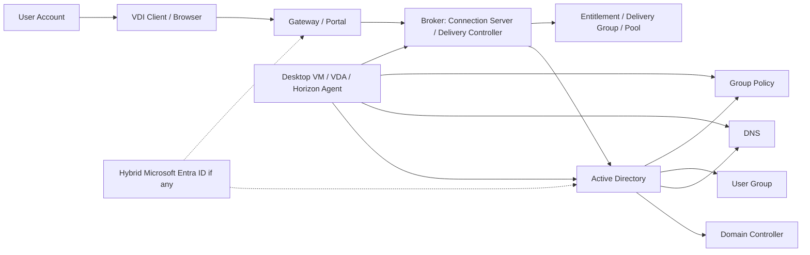

# Identity and Domain Integration Guide

## 0. Document Control

| Trường | Giá trị |
|---|---|
| Thứ tự | 6 |
| Tên tài liệu | Identity and Domain Integration Guide |
| Tên file | 06_Identity_and_Domain_Integration_Guide.md |
| Mục đích tài liệu | Cung cấp kiến thức về Domain Controller, Active Directory, DNS, Group Policy, user group, computer account và khả năng tích hợp Hybrid Microsoft Entra ID. |
| Nguồn điều khiển | [[sources/vdi-training-idea]], [[sources/vdi-documentation-list-context]] |
| Trạng thái thông tin | Có khung đào tạo identity/domain cho VDI; domain topology, OU, GPO, Entra ID, MFA, service account, trust và owner thật vẫn là Need Customer Confirmation. |

### 0.1 Source Grounding

| Nhóm tri thức | Nguồn sử dụng | Mức độ tin cậy | Ghi chú |
|---|---|---|---|
| Bối cảnh hai hệ thống VDI, identity là lớp dùng chung cần bao quát | [[sources/vdi-training-idea]] | High | Nguồn điều khiển định hướng vận hành theo lớp. |
| Tên tài liệu, tên file, mục đích và phạm vi | [[sources/vdi-documentation-list-context]] | High | Source of truth cho scope tài liệu này. |
| Horizon liên quan authentication, entitlement, Connection Server, UAG, True SSO nếu có | [[sources/horizon-8-architecture]] | High | Dùng để giải thích identity trong Horizon ở mức kiến trúc. |
| Citrix liên quan authentication, user access, machine identity, Delivery Group, VDA | [[sources/citrix-virtual-apps-and-desktops-7-2603]] | High | Dùng để giải thích identity trong Citrix ở mức kiến trúc. |
| DNS, time sync, certificate và integration dependency | [[sources/vcenter-server-installation-and-setup]], [[concepts/dns-and-time-sync]], [[concepts/identity-and-access-management]] | Medium | Dùng làm tri thức nền; cần kiểm chứng theo môi trường khách hàng. |

### 0.2 In Scope

- Giải thích vai trò của Domain Controller, Active Directory, DNS, Group Policy, user group, computer account trong VDI.
- Làm rõ identity ảnh hưởng tới login, entitlement, Agent/VDA registration, policy, profile và access flow.
- So sánh cách Horizon và Citrix phụ thuộc vào identity ở mức vận hành.
- Giải thích Hybrid Microsoft Entra ID ở mức khái niệm và các câu hỏi cần xác nhận, không giả định khách hàng đang dùng.
- Cung cấp checklist, bảng lỗi, scenario và knowledge check cho system engineer.

### 0.3 Out of Scope

- Không thay thế tài liệu AD/Entra ID chuyên sâu.
- Không hướng dẫn tạo/xóa/sửa user, group, OU, GPO hoặc computer account trên production.
- Không cung cấp command thay đổi cấu hình domain.
- Không yêu cầu secret, password, token, credential hoặc service account password.
- Không giả định domain topology, trust, OU, GPO, MFA, Conditional Access, Entra Connect hoặc identity provider khi chưa được khách hàng xác nhận.

## 1. Tài liệu này giúp engineer làm được gì

Identity là lớp nền của VDI. Nếu lớp này lỗi, Horizon và Citrix có thể cùng biểu hiện lỗi dù broker, gateway hoặc VM vẫn đang chạy. Với quy mô 1500 đến hơn 2000 VDI, một thay đổi AD group, GPO, DNS hoặc time sync sai có thể ảnh hưởng rất rộng.

Sau khi học xong, engineer cần làm được:

1. Giải thích được Domain Controller, AD, DNS, GPO, user group và computer account ảnh hưởng gì tới VDI.
2. Phân biệt lỗi authentication, authorization/entitlement, policy và machine registration.
3. Biết khi nào kiểm tra AD group thay vì kiểm tra VM.
4. Biết DNS/time sync có thể làm Agent/VDA registration, Kerberos, certificate hoặc SSO lỗi.
5. Biết evidence cần lấy trước khi escalation sang AD/Identity/Security team.
6. Biết phần nào liên quan Hybrid Microsoft Entra ID cần hỏi khách hàng.

## 2. Identity nằm ở đâu trong VDI

Identity không chỉ xuất hiện lúc user nhập username/password. Nó xuất hiện ở nhiều điểm:

- User authentication: user có được xác thực không.
- Authorization/entitlement: user có thuộc group được cấp desktop/app không.
- Machine identity: desktop VM, VDA hoặc Horizon Agent có computer account đúng không.
- DNS: broker, gateway, Agent/VDA, DC, vCenter và các server có resolve đúng không.
- GPO: policy nào áp vào user và computer, có làm login chậm hoặc chặn chức năng không.
- Time sync: Kerberos, certificate và SSO có thể lỗi nếu lệch thời gian.
- Hybrid identity: nếu có Entra ID/MFA/Conditional Access, access flow sẽ có thêm dependency.

## 3. Thành phần identity chính

| Thành phần | Vai trò trong VDI | Khi lỗi thường thấy | Engineer cần kiểm tra gì | Evidence cần lưu |
|---|---|---|---|---|
| Domain Controller | Xác thực user/machine, phục vụ LDAP/Kerberos, xử lý domain request | Login fail, join domain lỗi, GPO chậm, Agent/VDA registration bất thường | DC reachable không, lỗi có theo site/DC không, auth failure tăng không | Timestamp, user/machine, DC liên quan, auth/event evidence nếu có |
| Active Directory | Lưu user, group, computer, OU, policy scope | User không thấy resource, policy sai, computer account lỗi | User enabled/locked? group đúng? OU đúng? computer account tồn tại? | User/group/computer evidence, request/approval |
| DNS | Phân giải tên broker, gateway, DC, VDA/Agent, vCenter, backend | Portal không vào, Agent/VDA unregistered, timeout, cert mismatch | FQDN resolve đúng không, internal/external DNS khác nhau không | DNS result, FQDN, source network |
| Group Policy | Áp cấu hình user/computer, security, printer, drive, script, session control | Login chậm, USB/clipboard/printer sai, agent bị chặn, policy conflict | GPO nào áp lên OU/user, recent GPO change, processing time | GPO report, gpresult nếu được phép, change ID |
| User Group | Nền để cấp entitlement/pool/delivery group | Login được nhưng không thấy desktop/app | User thuộc group nào, group có map với resource không | Group membership, entitlement mapping |
| Computer Account | Danh tính domain của desktop/VDA/Agent | Trust lỗi, GPO không áp, registration lỗi, login issue trên máy | Computer account tồn tại, OU đúng, disabled/stale không | Machine name, OU, account state |
| Service/Integration Account | Tài khoản tích hợp nền tảng nếu có | Broker không query AD, vCenter/Citrix/Horizon integration lỗi | Chỉ kiểm tra trạng thái/owner, không yêu cầu password | Owner, account name nếu được phép, error log không chứa secret |
| Hybrid Microsoft Entra ID | Identity cloud/hybrid, MFA/Conditional Access nếu có | Login/MFA fail, external access issue, policy cloud chặn | Có dùng Entra không, flow nào qua Entra, owner nào | IdP/MFA status, sign-in evidence nếu được cấp |

## 4. AD group và entitlement

Trong VDI, user thường không được cấp desktop/app thủ công từng người. Thực tế vận hành thường dùng AD group để gán quyền.

### 4.1 Horizon

Trong Horizon, user hoặc group có thể được entitlement vào desktop pool hoặc application pool. Nếu user login được nhưng không thấy desktop/app, hãy nghĩ tới:

- User chưa thuộc đúng AD group.
- Entitlement chưa gán group vào pool.
- Group membership mới thay đổi nhưng user session/token chưa cập nhật.
- Pool/application bị disabled hoặc không có resource available.
- User đang vào sai pod/site/portal.

### 4.2 Citrix

Trong Citrix CVAD, user thường thấy resource dựa trên StoreFront, Delivery Group, Application Group và AD group assignment. Nếu user login được nhưng không thấy app/desktop, hãy nghĩ tới:

- User không thuộc AD group được gán.
- Delivery Group/Application Group không publish resource cho group đó.
- StoreFront không enumerate được resource.
- Delivery Controller hoặc Site có lỗi resource enumeration.
- App/desktop bị thay đổi hoặc unpublish.

### 4.3 Checklist entitlement

- [ ] User chính xác là ai, UPN/sAMAccountName nào?
- [ ] User đang truy cập Horizon hay Citrix?
- [ ] Resource mong đợi là desktop pool, application pool, Delivery Group hay Application Group?
- [ ] User thuộc AD group nào?
- [ ] Group đó có được gán entitlement không?
- [ ] Có approval cấp quyền không?
- [ ] Có recent AD group hoặc entitlement change không?
- [ ] Lỗi chỉ một user hay cả nhóm cùng group?

## 5. Computer account, machine identity và registration

Desktop VM, VDA machine hoặc Horizon Agent machine không chỉ là VM. Nó còn là domain computer nếu môi trường thiết kế như vậy. Computer account sai có thể làm máy không đăng ký được với broker hoặc không áp policy đúng.

### 5.1 Vì sao computer account quan trọng

Computer account ảnh hưởng:

- Join domain.
- Trust relationship.
- Group Policy áp cho máy.
- DNS record của máy.
- Kerberos hoặc domain authentication.
- VDA/Horizon Agent registration nếu dependency domain/DNS bị lỗi.
- Access tới profile share, file share hoặc application backend.

### 5.2 Dấu hiệu nghi computer account hoặc machine identity

| Triệu chứng | Giả thuyết |
|---|---|
| Một máy VDI/VDA unregistered nhưng VM vẫn powered on | Agent/VDA service, DNS, domain trust, firewall hoặc broker list |
| Nhiều máy sau image update unregistered | Image, domain join process, machine account, GPO, DNS |
| User vào máy báo trust relationship lỗi | Computer account hoặc domain trust issue |
| GPO không áp trên một nhóm máy | OU sai, computer account sai, GPO filter/security filtering |
| Máy không resolve được broker/DC | DNS hoặc network path |

Không nên tự reset computer account hoặc rejoin domain nếu chưa có quy trình và approval, vì thao tác này có thể ảnh hưởng nhiều desktop hoặc làm mất evidence.

## 6. DNS và time sync

DNS và time sync là hai thứ rất "âm thầm", nhưng khi lỗi sẽ làm VDI trông như broker hoặc gateway lỗi.

Theo [[concepts/dns-and-time-sync]], DNS và time sync là điều kiện nền cho certificate, Kerberos, SSO và tích hợp dịch vụ.

### 6.1 DNS ảnh hưởng gì

DNS cần cho:

- Client resolve portal/gateway.
- Gateway resolve broker/StoreFront/Connection Server.
- Broker resolve Domain Controller, Agent/VDA, vCenter/hypervisor manager.
- Agent/VDA resolve broker, DC, DNS, profile storage, backend app.
- Monitoring resolve endpoint cần kiểm tra.

DNS lỗi có thể gây:

- Không mở được URL.
- Certificate mismatch nếu trỏ sai host.
- Agent/VDA unregistered.
- Login chậm do DC lookup sai site.
- Backend app không truy cập được.

### 6.2 Time sync ảnh hưởng gì

Time sync cần cho:

- Kerberos authentication.
- Certificate validation.
- SSO hoặc True SSO nếu có.
- Log correlation khi troubleshooting.
- Token hoặc MFA flow nếu có.

Nếu log giữa gateway, broker, DC và Agent/VDA lệch thời gian, RCA sẽ rất khó. Engineer cần luôn ghi timestamp và timezone.

## 7. Group Policy trong VDI

GPO có thể ảnh hưởng rất mạnh tới user experience. Một GPO sai có thể làm hàng loạt user login chậm, mất printer, bị chặn clipboard/USB, drive mapping lỗi hoặc VDA/Agent bị ảnh hưởng.

### 7.1 Nhóm GPO thường gặp trong VDI

| Nhóm GPO | Ảnh hưởng |
|---|---|
| Security baseline | Firewall, service, local rights, hardening |
| User environment | Desktop setting, Start menu, mapped drive, printer |
| Session control | Timeout, reconnect, logoff, idle session |
| Device redirection | Clipboard, USB, printer, drive mapping |
| Profile/logon | Logon script, folder redirection, profile setting |
| Browser/application | Proxy, certificate trust, application policy |
| VDI agent support | Có thể ảnh hưởng service, firewall, registry, driver |

### 7.2 Khi nào nghi GPO

- Nhiều user login chậm sau change window.
- User vào được nhưng printer/clipboard/USB/drive mapping sai.
- Chỉ user trong một OU hoặc group bị lỗi.
- Chỉ máy trong một OU bị VDA/Agent issue.
- Lỗi xuất hiện sau GPO/security baseline update.

### 7.3 Evidence GPO cần lấy

- User và computer thuộc OU nào.
- GPO nào áp vào user/computer.
- Recent GPO change ID.
- Login duration hoặc GPO processing time nếu có.
- Sample user/machine bị lỗi và không bị lỗi để so sánh.

## 8. Hybrid Microsoft Entra ID nếu có

`training_idea.md` yêu cầu bao quát Hybrid Microsoft Entra ID nếu có, nhưng hiện chưa có thông tin xác nhận khách hàng đang dùng hay topology thế nào. Vì vậy phần này chỉ là mô hình cần hỏi, không phải khẳng định môi trường có.

Hybrid identity có thể xuất hiện trong VDI khi:

- User identity được đồng bộ từ AD lên Microsoft Entra ID.
- External access dùng MFA hoặc Conditional Access.
- Gateway hoặc portal tích hợp IdP.
- Thiết bị hoặc session có chính sách cloud identity.
- SSO hoặc certificate-based authentication có tham gia.

Các câu hỏi cần xác nhận:

- Có dùng Microsoft Entra ID không?
- Có dùng Entra Connect hoặc cloud sync không?
- UPN trong AD và Entra có khớp không?
- Có MFA/Conditional Access áp cho VDI không?
- Horizon/Citrix external access có đi qua IdP không?
- Log sign-in nằm ở đâu và ai có quyền xem?
- Khi Entra/MFA lỗi thì escalation path là ai?

Không được tự giả định Conditional Access policy, tenant ID, app registration, token hoặc secret.

## 9. Identity trong Horizon và Citrix

| Chủ đề | Horizon | Citrix CVAD | Điểm engineer cần nhớ |
|---|---|---|---|
| Authentication | Connection Server/UAG flow có thể tích hợp AD/IdP/True SSO tùy thiết kế | Gateway/StoreFront/Controller flow có thể tích hợp AD/IdP/MFA tùy thiết kế | Xác định user đang lỗi ở portal/gateway/broker hay IdP |
| Entitlement | User/group được gán vào desktop/application pool | User/group được gán vào Delivery Group/Application Group | Login được nhưng không thấy resource thường là group/entitlement |
| Machine identity | Horizon Agent desktop/RDS host cần domain/DNS/path phù hợp | VDA machine cần domain/DNS/Controller discovery phù hợp | Unregistered thường liên quan DNS, domain, firewall, agent/VDA |
| Policy | Horizon policy/GPO có thể ảnh hưởng session | Citrix Policy/GPO có thể ảnh hưởng session | Policy sai tạo lỗi clipboard, USB, printer, timeout |
| SSO/MFA | True SSO/IdP nếu có | Gateway/StoreFront/IdP/MFA nếu có | Đây là Need Customer Confirmation |

## 10. Lỗi identity/domain thường gặp và hướng chẩn đoán

| Triệu chứng | Nguyên nhân có thể | Lớp cần kiểm tra | Evidence cần thu thập | Hướng xử lý ban đầu | Khi nào escalation |
|---|---|---|---|---|---|
| User login fail | Account locked/disabled, password expired, DC/DNS issue, MFA/IdP nếu có | User identity, DC, DNS, Gateway/Broker auth | User, timestamp, error, auth log, DC/DNS status | Xác định một user hay nhiều user; kiểm tra auth path | Nhiều user, DC/MFA/IdP lỗi, cần identity/security |
| User login được nhưng không thấy resource | AD group sai, entitlement chưa cấp, group replication/token chưa cập nhật | AD group, Horizon entitlement, Delivery Group/Application Group | User group, resource mapping, approval | Kiểm tra group và entitlement trước khi kiểm tra VM | Cần thay đổi quyền hoặc business approval |
| VDA/Horizon Agent unregistered | DNS, domain trust, computer account, GPO/firewall, broker discovery | Machine identity, DNS, GPO, network | Machine name, registration status, agent/VDA log, DNS result | So sánh máy lỗi và máy khỏe, tìm điểm chung OU/image | Nhiều máy hoặc cần AD/network/platform |
| Login chậm ở bước profile/GPO | GPO processing, logon script, DC latency, profile storage | GPO, DC, DNS, profile | Login duration, GPO report, DC latency, profile log | Correlate theo timestamp và OU/group | Nhiều user hoặc vượt SLA |
| Policy clipboard/USB/printer sai | GPO, Citrix Policy, Horizon Policy, security filtering | Policy layer | User/computer OU, applied policies, recent change | Xác định policy nào áp, so sánh user/machine mẫu | Cần policy/security owner |
| Certificate/SSO lỗi | DNS sai, time lệch, cert trust, IdP/True SSO/MFA | DNS, time, certificate, identity provider | Error, timestamp, cert chain, time, sign-in log nếu có | Tách local AD auth và IdP/MFA flow | External-wide hoặc security/identity owner |
| Computer trust lỗi | Computer account stale/reset, domain trust broken, image clone issue | Computer account, domain join, image | Machine name, OU, account state, event log | Không tự reset nếu chưa có quy trình; lấy evidence | Nhiều máy hoặc cần AD/platform |

## 11. Operational checklist cho identity issue

### Khi nhận ticket

- [ ] Xác định user, UPN/sAMAccountName và domain.
- [ ] Xác định platform: Horizon hay Citrix.
- [ ] Xác định lỗi ở bước nào: login, không thấy resource, launch, registration, policy, profile.
- [ ] Ghi timestamp và timezone.
- [ ] Hỏi user internal/external và client/URL đang dùng.
- [ ] Kiểm tra có nhiều user cùng group/OU/location bị không.
- [ ] Kiểm tra recent change: AD group, GPO, OU move, MFA/IdP, DNS, certificate, image.

### Kiểm tra user/group

- [ ] Account enabled/locked/expired hay không, nếu có quyền xem.
- [ ] User thuộc AD group nào.
- [ ] Group đó map với pool/Delivery Group/Application Group nào.
- [ ] Có approval cấp quyền không.
- [ ] Lỗi chỉ một user hay cả group.

### Kiểm tra machine identity

- [ ] Máy là Horizon Agent hay Citrix VDA.
- [ ] Machine name và domain/OU.
- [ ] Registration state.
- [ ] DNS resolve broker/DC đúng không.
- [ ] GPO hoặc firewall policy có thay đổi không.
- [ ] Máy có cùng image/catalog/pool với nhóm lỗi không.

### Evidence cần lưu

- [ ] User/machine sample.
- [ ] Timestamp/timezone.
- [ ] Error screenshot.
- [ ] AD group hoặc entitlement evidence.
- [ ] Broker/gateway auth event nếu có.
- [ ] GPO/report hoặc change ID nếu có.
- [ ] Agent/VDA registration evidence.
- [ ] DNS/time sync evidence.
- [ ] Impact scope.

## 12. Tình huống học tập

### Tình huống 1: User login được nhưng không thấy desktop

**Bối cảnh:** User mới chuyển phòng ban login Horizon/Citrix thành công nhưng không thấy desktop/app cần dùng.

**Câu hỏi cho học viên:**

- Đây có phải lỗi Domain Controller không?
- Kiểm tra AD group hay Agent/VDA trước?
- Evidence nào cần có trước khi yêu cầu cấp quyền?

**Gợi ý phân tích:**

Login thành công cho thấy authentication cơ bản đã qua. Không thấy resource thường liên quan authorization/entitlement: AD group, Horizon entitlement, Delivery Group/Application Group hoặc Store/portal resource enumeration.

**Hướng xử lý đề xuất:** Kiểm tra user group, mapping với resource, approval cấp quyền và recent group change.

**Evidence cần lưu:** screenshot resource list, user/group, entitlement mapping, approval/change request.

### Tình huống 2: Nhiều VDA trong cùng OU unregistered

**Bối cảnh:** Một nhóm Citrix VDA trong cùng OU unregistered sau khi security baseline mới được áp.

**Câu hỏi cho học viên:**

- Điểm chung identity/domain là gì?
- GPO có thể ảnh hưởng registration như thế nào?
- Cần escalation nhóm nào?

**Gợi ý phân tích:**

Nếu máy lỗi cùng OU sau GPO/security change, cần kiểm tra policy, firewall local, service permission, DNS và Controller discovery. Không nên reboot hàng loạt ngay.

**Hướng xử lý đề xuất:** So sánh máy lỗi/khỏe, kiểm tra applied GPO, VDA log, DNS result, firewall/service state, change ID.

**Evidence cần lưu:** OU, GPO change, VDA registration trend, machine sample, event/log.

### Tình huống 3: Cả Horizon và Citrix đều login chậm

**Bối cảnh:** Trong cùng khung giờ, user của cả hai nền tảng đều login chậm.

**Câu hỏi cho học viên:**

- Vì sao cần nghĩ tới lớp dùng chung?
- AD/DNS/GPO/profile liên quan ra sao?
- Metric nào cần lấy?

**Gợi ý phân tích:**

Khi cả hai platform bị, khả năng cao là dependency chung: DC/DNS latency, GPO processing, profile storage, network hoặc recent domain policy change.

**Hướng xử lý đề xuất:** Lấy sample từ cả Horizon và Citrix, so sánh login duration, GPO time, DC/DNS health, profile/storage metrics.

**Evidence cần lưu:** user sample hai platform, timestamp, login duration, GPO/profile/DC/DNS metrics.

### Tình huống 4: External login fail sau khi bật MFA

**Bối cảnh:** Sau một thay đổi bảo mật, user bên ngoài không login được VDI; user nội bộ vẫn bình thường.

**Câu hỏi cho học viên:**

- Đây có thể là lỗi broker không?
- Cần xác nhận Hybrid Entra ID/MFA gì?
- Evidence nào giúp security team xử lý?

**Gợi ý phân tích:**

External-only sau MFA/IdP change gợi ý identity provider, Conditional Access, MFA policy, Gateway integration hoặc certificate/redirect flow.

**Hướng xử lý đề xuất:** Xác nhận change, lấy sign-in error nếu có, gateway/portal log, user sample, internal/external comparison và escalation identity/security.

**Evidence cần lưu:** change ID, user sample, timestamp, error, gateway log, sign-in evidence nếu được cấp.

## 13. Bài tập tư duy

### Bài tập 1: Vẽ dependency identity

Vẽ sơ đồ cho một user login vào VDI, gồm user account, AD group, DC, DNS, broker, entitlement, Agent/VDA, computer account và GPO.

### Bài tập 2: Phân loại lỗi identity

| Triệu chứng | Lớp ưu tiên |
|---|---|
| User login fail | Authentication/DC/MFA |
| User không thấy app | AD group/entitlement |
| VDA unregistered | Computer account/DNS/GPO/firewall |
| Login chậm sau GPO change | GPO/DC/profile |
| External-only MFA fail | Entra/IdP/MFA/Gateway integration |

### Bài tập 3: Evidence escalation

Chuẩn bị evidence escalation cho identity team khi 20 user cùng group không thấy resource:

- Danh sách user mẫu.
- AD group hiện tại.
- Resource cần truy cập.
- Entitlement/Delivery Group mapping hiện tại.
- Approval hoặc request cấp quyền.
- Timestamp.
- Platform: Horizon hay Citrix.

### Bài tập 4: So sánh user lỗi và user khỏe

Chọn một user bị lỗi và một user khỏe. So sánh:

- OU.
- Group membership.
- Resource entitlement.
- Login path.
- GPO applied.
- Profile path nếu có.
- Client/location.

## 14. Knowledge Check

### Câu 1

**Identity trong VDI chỉ xuất hiện lúc user nhập mật khẩu, đúng hay sai?**

**Đáp án:** Sai. Identity còn ảnh hưởng AD group, entitlement, computer account, DNS, GPO, Agent/VDA registration, policy và SSO/MFA nếu có.

### Câu 2

**User login được nhưng không thấy desktop/app nên kiểm tra gì trước?**

**Đáp án:** AD group, entitlement, Horizon pool hoặc Citrix Delivery Group/Application Group mapping.

### Câu 3

**DNS lỗi có thể gây VDA/Horizon Agent unregistered không?**

**Đáp án:** Có. Agent/VDA cần resolve broker/Controller/Connection Server, DC và các dependency khác.

### Câu 4

**Time sync quan trọng vì sao?**

**Đáp án:** Time sync ảnh hưởng Kerberos, certificate validation, SSO/MFA flow và log correlation.

### Câu 5

**Computer account ảnh hưởng gì tới desktop/VDA?**

**Đáp án:** Nó là danh tính domain của máy, ảnh hưởng trust, GPO, DNS, domain authentication và có thể gián tiếp ảnh hưởng registration.

### Câu 6

**Khi nhiều user cả Horizon và Citrix đều login chậm, cần nghĩ tới gì?**

**Đáp án:** Dependency chung như DC/DNS, GPO, profile storage, network hoặc recent identity/domain change.

### Câu 7

**Hybrid Microsoft Entra ID có được giả định là đang dùng không?**

**Đáp án:** Không. Chỉ ghi là khả năng cần xác nhận nếu chưa có topology hoặc thông tin từ khách hàng.

### Câu 8

**GPO có thể gây lỗi gì trong VDI?**

**Đáp án:** Login chậm, policy clipboard/USB/printer sai, drive mapping lỗi, firewall/service bị chặn, profile/logon script lỗi.

### Câu 9

**Evidence tối thiểu khi escalation lỗi entitlement là gì?**

**Đáp án:** User, group membership, resource cần truy cập, mapping entitlement hiện tại, screenshot lỗi, timestamp và approval nếu có.

### Câu 10

**Vì sao không nên tự reset computer account trong production?**

**Đáp án:** Có thể làm mất evidence, ảnh hưởng nhiều desktop hoặc phá vỡ quy trình domain join/provisioning; cần approval và owner AD/platform.

## 15. Hiểu nhầm thường gặp

| Hiểu nhầm | Vì sao sai | Cách nghĩ đúng |
|---|---|---|
| "Login được là AD không liên quan nữa" | AD group, GPO, computer account và DNS vẫn ảnh hưởng sau login. | Tách authentication, authorization, policy và machine identity. |
| "Không thấy app là do app chưa cài" | Có thể user chưa được AD group/entitlement phù hợp. | Kiểm tra group/resource mapping trước. |
| "VDA/Agent unregistered là lỗi Citrix/Horizon thuần túy" | DNS, domain trust, GPO, firewall và computer account đều có thể gây unregistered. | Kiểm tra machine identity và path tới broker. |
| "GPO chỉ là việc của AD team" | GPO ảnh hưởng trực tiếp login, session, device redirection và agent behavior. | Engineer cần đọc triệu chứng và escalation có evidence. |
| "Hybrid Entra ID chắc chắn có nếu user external" | External access có thể dùng nhiều kiểu identity khác nhau. | Ghi Need Customer Confirmation. |
| "Chỉ cần nói user lỗi login là đủ để escalation" | Identity team cần timestamp, user, path, error, scope và log liên quan. | Chuẩn bị evidence đầy đủ. |

## 16. Need Customer Confirmation

| Nhóm | Câu hỏi cần xác nhận | Vì sao cần |
|---|---|---|
| Domain topology | Có bao nhiêu domain/forest/site và domain trust nào? | Xử lý auth, group và scope ảnh hưởng. |
| Domain Controller | DC nào phục vụ VDI site, có DC local cho VDI không? | Xử lý login chậm, DC latency, outage. |
| DNS | DNS zone, split DNS, forwarder và record cho gateway/broker/VDA/Agent ra sao? | Xử lý resolve, cert mismatch, registration. |
| OU design | User, VDI computer, VDA, broker/gateway nằm trong OU nào? | Xác định GPO và policy scope. |
| GPO | GPO nào áp cho user/computer VDI? Ai owner? | Xử lý login, policy, agent/VDA issue. |
| AD group | Group nào dùng cho Horizon entitlement và Citrix Delivery Group/Application Group? | Xử lý user không thấy resource. |
| Computer account | Quy trình tạo/reset/reuse computer account cho VDI ra sao? | Xử lý trust/registration/provisioning. |
| Time sync | NTP/time source cho DC, broker, gateway, hypervisor, VM là gì? | Xử lý Kerberos/certificate/log correlation. |
| MFA/IdP | Có dùng MFA, SAML/OIDC, ADFS, Entra ID hoặc IdP khác không? | Xử lý external login và security policy. |
| Hybrid Entra ID | Có Entra Connect/cloud sync không, UPN mapping thế nào? | Xử lý hybrid identity và sign-in issue. |
| Conditional Access | Có policy áp cho VDI access không? | Xử lý external access bị chặn. |
| Service account | Có account tích hợp Horizon/Citrix/vCenter/AD không, owner là ai? | Xử lý integration issue mà không hỏi credential. |
| Audit log | Log auth, group change, GPO change, sign-in nằm ở đâu? | Evidence và RCA. |
| SLA/Owner | Identity incident SLA và escalation path là gì? | Escalation đúng nhóm. |
| Change process | Quy trình thay đổi AD group, GPO, MFA, DNS, OU là gì? | Tránh impact diện rộng. |

## 17. Related Wiki Links

### Source pages

- [[sources/vdi-training-idea]]
- [[sources/vdi-documentation-list-context]]
- [[sources/horizon-8-architecture]]
- [[sources/citrix-virtual-apps-and-desktops-7-2603]]
- [[sources/vcenter-server-installation-and-setup]]

### Concept pages

- [[concepts/identity-and-access-management]]
- [[concepts/dns-and-time-sync]]
- [[concepts/machine-identity]]
- [[concepts/certificate-management]]
- [[concepts/true-sso]]
- [[concepts/omnissa-horizon]]
- [[concepts/citrix-virtual-apps-and-desktops]]
- [[concepts/connection-server]]
- [[concepts/delivery-controller]]
- [[concepts/virtual-delivery-agent]]
- [[concepts/delivery-group]]
- [[concepts/vdi-connection-flow]]

### Topic pages nên đọc tiếp

- [[topics/1_VDI_Foundation_Overview]]: nắm nền tảng VDI.
- [[topics/2_Customer_VDI_Landscape_Overview]]: hiểu hai hệ thống và lớp dùng chung.
- [[topics/5_VDI_Access_Flow_Design]]: đặt identity vào access flow.
- [[topics/10_VDI_Security_and_Policy_Management_Guide]]: đi sâu policy và security controls.
- [[topics/18_VDI_Troubleshooting_Playbook]]: dùng identity checklist khi xử lý sự cố.
- [[topics/24_VDI_Access_Control_and_RBAC_Guide]]: phân quyền quản trị và least privilege.

## 18. Summary for Learners

Identity và domain integration là lớp dùng chung cực kỳ quan trọng trong VDI. Domain Controller, Active Directory, DNS, Group Policy, user group và computer account ảnh hưởng trực tiếp tới login, entitlement, policy, Agent/VDA registration và user experience. Hybrid Microsoft Entra ID có thể tham gia nếu môi trường có MFA, Conditional Access hoặc identity cloud, nhưng phải xác nhận với khách hàng.

Điều engineer cần nhớ:

- Tách authentication, authorization/entitlement, policy và machine identity.
- Login được chưa đủ để loại trừ AD.
- Không thấy resource thường bắt đầu từ AD group và entitlement.
- Unregistered Agent/VDA có thể do DNS, GPO, computer account hoặc firewall.
- GPO có thể gây login chậm và policy sai hàng loạt.
- Hybrid Entra ID, MFA và Conditional Access là Need Customer Confirmation nếu chưa có topology.
- Không thực hiện thay đổi user/group/GPO/computer account nếu chưa có approval.

Thứ tự kiểm tra khuyến nghị: xác định symptom, xác định platform, kiểm tra user/auth, kiểm tra AD group/entitlement, kiểm tra DNS/time sync, kiểm tra GPO/policy, kiểm tra computer account và Agent/VDA registration, lưu evidence, rồi escalation đúng owner.

