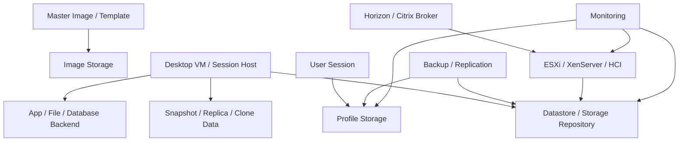

# Storage Operations for VDI

## 0. Document Control

| Trường | Giá trị |
|---|---|
| Thứ tự | 8 |
| Tên tài liệu | Storage Operations for VDI |
| Tên file | 08_Storage_Operations_for_VDI.md |
| Mục đích tài liệu | Giải thích vai trò của storage trong VDI, gồm datastore, profile storage, image storage, capacity, latency, IOPS, snapshot growth, boot storm và logon storm. |
| Nguồn điều khiển | [[sources/vdi-training-idea]], [[sources/vdi-documentation-list-context]] |
| Trạng thái thông tin | Có tri thức vận hành storage nền; storage vendor, datastore/SR mapping, latency baseline, profile solution, HA/replication và owner thật vẫn là Need Customer Confirmation. |

### 0.1 Source Grounding

| Nhóm tri thức | Nguồn sử dụng | Mức độ tin cậy | Ghi chú |
|---|---|---|---|
| Bối cảnh VDI quy mô lớn, storage là lớp cần bao quát cho image, profile, snapshot, backup và performance | [[sources/vdi-training-idea]] | High | Nguồn điều khiển cách nhìn storage trong vận hành VDI. |
| Tên tài liệu, tên file, mục đích và phạm vi | [[sources/vdi-documentation-list-context]] | High | Source of truth cho scope tài liệu này. |
| VMware datastore, VM operations, snapshot, lifecycle, storage dependency | [[sources/vmware-vsphere-8-0]] | High | Dùng để giải thích datastore trong Horizon/Citrix trên VMware. |
| XenServer storage repository, host/pool, HA và networking | [[sources/xenserver-8-4]] | High | Dùng để giải thích storage repository khi Citrix chạy trên XenServer. |
| FSLogix profile container, ODFC, Cloud Cache, storage permission, profile troubleshooting | [[sources/fslogix-documentation]] | High | Dùng để giải thích profile storage và ảnh hưởng tới login/user experience. |

### 0.2 In Scope

- Giải thích các loại storage trong VDI: datastore/storage repository, image storage, profile storage, backup/replication storage.
- Làm rõ capacity, latency, IOPS, throughput, snapshot growth, boot storm và logon storm ảnh hưởng thế nào tới VDI.
- Hướng dẫn engineer đọc triệu chứng user theo lớp storage: login chậm, desktop lag, VM không power on, provisioning fail, profile lỗi.
- Cung cấp checklist, bảng lỗi, scenario, knowledge check và câu hỏi cần xác nhận với khách hàng.

### 0.3 Out of Scope

- Không thay thế tài liệu quản trị SAN/NAS/vSAN/HCI/storage vendor chuyên sâu.
- Không hướng dẫn thay đổi storage production, delete snapshot, expand datastore, migrate volume hoặc chỉnh replication khi chưa có approval.
- Không giả định khách hàng dùng FSLogix, vSAN, NetApp, Azure Files, SAN, NAS hoặc storage vendor nào.
- Không yêu cầu secret, password, token hoặc credential.

## 1. Tài liệu này giúp engineer làm được gì

Storage là một trong các lớp ảnh hưởng mạnh nhất tới trải nghiệm VDI. Khi storage có vấn đề, user thường không báo "storage lỗi"; họ báo login chậm, desktop đứng, app mở lâu, màn hình đen, profile mất, VM không bật hoặc VDA/Horizon Agent unregistered.

Sau khi học xong, engineer cần làm được:

1. Phân biệt datastore, storage repository, image storage, profile storage và backup/replication storage.
2. Hiểu capacity, latency, IOPS và throughput khác nhau thế nào.
3. Nhận diện boot storm, logon storm và snapshot growth trong VDI.
4. Biết khi nào cần nghi storage thay vì chỉ kiểm tra broker hoặc VM.
5. Biết evidence cần lấy trước khi escalation sang storage/HCI/hypervisor team.
6. Biết các thao tác storage nào cần change control và rollback plan.

## 2. Storage nằm ở đâu trong VDI

Trong VDI, storage không chỉ là nơi chứa VM disk. Nó có nhiều vai trò:

- Chứa desktop VM hoặc session host.
- Chứa master image/template.
- Chứa snapshot, clone, replica hoặc delta disk tùy công nghệ.
- Chứa profile hoặc profile container.
- Chứa user data, log, application cache hoặc file share liên quan.
- Là đích backup hoặc replication.

Một lỗi storage ở mỗi vùng sẽ tạo triệu chứng khác nhau. Vì vậy engineer cần biết "storage nào" chứ không chỉ nói chung là "kiểm tra storage".

## 3. Các loại storage trong VDI

| Loại storage | Dùng cho | Nếu lỗi thường thấy | Engineer cần kiểm tra |
|---|---|---|---|
| Datastore VMware | VM disk, template, snapshot, clone | VM chậm, không power on, provisioning fail, datastore full | Capacity, latency, IOPS, task/event, VM mapping |
| Storage Repository XenServer | VM disk, image, storage cho XenServer pool | VDA chậm/unavailable, VM không start, SR alert | SR capacity, SR latency, host/pool mapping |
| HCI datastore | Compute/storage tích hợp cho Horizon hoặc workload khác | Cluster degraded, logon/boot storm, latency tăng | HCI health, resync/rebuild, host/storage metrics |
| Image storage | Master image, template, snapshot image | Nhiều VM tạo từ image lỗi, publish/clone fail | Image version, snapshot, location, recent change |
| Profile storage | User profile, FSLogix container, ODFC, roaming data | Login chậm, profile không attach, mất setting, Outlook/OneDrive lỗi | Path, permission, latency, lock, container health |
| Application/user data storage | File share, app config, working data | Desktop vào được nhưng app/file lỗi | Backend reachability, permission, latency |
| Backup/replication storage | Backup image, config, profile, datastore | Restore fail, RPO/RTO không đạt | Backup job, restore test, owner, retention |

Theo [[sources/fslogix-documentation]], profile container giúp tách hồ sơ user khỏi máy phiên, nhưng nơi đặt container, permission và HA ảnh hưởng trực tiếp tới tốc độ login và độ ổn định phiên. Không được mặc định khách hàng đang dùng FSLogix nếu chưa xác nhận.

## 4. Capacity, latency, IOPS và throughput

### 4.1 Capacity

Capacity là dung lượng còn lại. Datastore hoặc profile storage đầy có thể gây:

- VM không power on.
- Provisioning/clone fail.
- Snapshot không tạo được hoặc tăng dung lượng nguy hiểm.
- Profile không ghi được.
- User mất setting hoặc app cache lỗi.

Capacity cần xem theo trend, không chỉ tại thời điểm hiện tại. Một datastore 75% có thể vẫn an toàn, nhưng nếu snapshot hoặc clone đang tăng nhanh thì rủi ro cao.

### 4.2 Latency

Latency là độ trễ đọc/ghi. Trong VDI, latency cao thường biểu hiện thành:

- Login chậm.
- Desktop lag.
- Application mở lâu.
- Black screen hoặc preparing desktop lâu.
- VM stun hoặc task kéo dài.
- User disconnect nếu kéo theo timeout.

Latency quan trọng hơn capacity trong nhiều sự cố trải nghiệm. Một datastore còn nhiều dung lượng nhưng latency cao vẫn làm user phàn nàn.

### 4.3 IOPS

IOPS là số thao tác đọc/ghi mỗi giây. VDI tạo IOPS theo pattern rất đặc biệt:

- Boot storm: nhiều VM boot cùng lúc.
- Logon storm: nhiều user login cùng lúc.
- Antivirus scan hoặc patching: nhiều máy đọc/ghi đồng loạt.
- Profile load/write-back: nhiều profile container hoặc file nhỏ.
- Application cache: Outlook/OneDrive/browser/app cache.

### 4.4 Throughput

Throughput là lưu lượng đọc/ghi theo MB/s hoặc GB/s. Nó quan trọng khi:

- Copy image hoặc template lớn.
- Backup/restore.
- Replication.
- Large profile/container operations.
- Application workload đọc/ghi nhiều dữ liệu.

Engineer cần hiểu metric nào phù hợp với symptom. Login chậm thường cần latency/profile/GPO correlation; image copy chậm có thể liên quan throughput; boot storm có thể liên quan IOPS và latency.

## 5. Boot storm và logon storm

### 5.1 Boot storm

Boot storm xảy ra khi nhiều desktop VM khởi động gần cùng thời điểm. Thường gặp sau:

- Maintenance window.
- Power policy bật nhiều VM đầu ngày.
- Host failover.
- Pool/catalog refresh.
- Disaster recovery drill.

Tác động:

- Tăng IOPS đọc image/OS disk.
- Tăng CPU/memory host.
- Tăng load storage/HCI.
- VM power on chậm.
- Agent/VDA registration chậm.

### 5.2 Logon storm

Logon storm xảy ra khi nhiều user đăng nhập cùng lúc, thường đầu giờ làm việc.

Tác động:

- Profile storage bị đọc/ghi đồng thời.
- GPO/logon script tăng tải.
- DC/DNS bị truy vấn nhiều.
- Broker tăng session activity.
- Desktop/app host tăng CPU/memory.
- Storage latency tăng.

### 5.3 Cách phân biệt

| Đặc điểm | Boot storm | Logon storm |
|---|---|---|
| Thời điểm | Khi nhiều VM bật/refresh | Khi nhiều user login |
| Triệu chứng | VM power on chậm, registration chậm | Login duration tăng, profile/GPO chậm |
| Metric chính | VM power task, datastore IOPS/latency, host load | Login duration, profile storage, DC/GPO, datastore latency |
| Evidence | Power event, VM count, cluster/storage metric | User sample, logon time, profile/GPO/storage metric |

## 6. Snapshot growth và image storage

Snapshot và image rất quan trọng trong VDI, nhưng cũng là nguồn rủi ro.

### 6.1 Snapshot dùng để làm gì

- Rollback point trước image update.
- Test bản image mới.
- Hỗ trợ clone/provisioning tùy công nghệ.
- Mốc thay đổi trong maintenance.

### 6.2 Rủi ro snapshot

- Snapshot để lâu có thể tăng dung lượng.
- Datastore capacity giảm nhanh.
- Consolidation có thể cần maintenance window.
- Xóa nhầm snapshot có thể ảnh hưởng rollback.
- Snapshot không thay thế backup.

### 6.3 Image storage

Image storage chứa master image/template/snapshot dùng cho nhiều VM. Nếu image storage lỗi:

- Provisioning fail.
- Pool/catalog update fail.
- Nhiều VM tạo từ image mới có cùng lỗi.
- Rollback khó nếu không có mốc an toàn.

Engineer cần luôn liên hệ image/snapshot với change ID, owner, version và rollback plan.

## 7. Profile storage

Profile storage là nơi chứa dữ liệu user. Nó có thể là FSLogix container, Citrix Profile Management, roaming profile, folder redirection hoặc giải pháp khác. Hiện chưa biết khách hàng dùng gì, nên cần xác nhận.

### 7.1 Profile storage ảnh hưởng gì

- Login duration.
- Desktop personalization.
- Outlook/OneDrive/browser cache.
- AppData và setting ứng dụng.
- Logoff/write-back.
- Multi-session hoặc reconnect experience.

Theo [[sources/fslogix-documentation]], FSLogix dùng container để tách profile khỏi máy phiên, giúp user có trải nghiệm nhất quán. Nhưng nếu storage chứa container chậm, permission sai hoặc container lock, login có thể rất chậm hoặc profile không attach.

### 7.2 Dấu hiệu profile storage issue

| Triệu chứng | Gợi ý |
|---|---|
| User login lâu ở loading profile | Profile storage latency, container attach, permission |
| User mất setting cá nhân | Profile không load, profile mới tạm, path sai |
| Outlook/OneDrive lỗi | ODFC/profile cache issue, container problem |
| Chỉ một user bị | Profile cá nhân lock/corrupt/permission |
| Nhiều user cùng bị đầu giờ | Profile storage latency hoặc logon storm |

## 8. Storage mapping trong Horizon và Citrix

### 8.1 Horizon on HCI

Với Horizon trên HCI, cần map:

- Desktop pool -> cluster/HCI datastore.
- Image/snapshot -> datastore.
- VM -> host.
- Profile solution -> storage path nếu có.
- Uptime/performance issue -> cluster/storage metric.

Nếu một Horizon desktop pool chậm, engineer cần biết pool đó nằm trên datastore/cluster nào trước khi escalation.

### 8.2 Citrix CVAD trên ESXi hoặc XenServer

Với Citrix, cần map:

- Machine Catalog -> hypervisor connection.
- Catalog -> datastore hoặc storage repository.
- VDA machine -> host/pool.
- Delivery Group -> Machine Catalog.
- Profile path -> profile storage.

Nếu một Machine Catalog có nhiều VDA unavailable, storage mapping giúp xác định lỗi ở SR/datastore, image, provisioning hay hypervisor.

## 9. Monitoring và evidence storage

| Nhóm metric | Ý nghĩa | Evidence nên lưu |
|---|---|---|
| Capacity | Dung lượng còn lại và trend tăng | Capacity chart, threshold, affected datastore/SR |
| Latency | Độ trễ đọc/ghi ảnh hưởng user experience | Latency chart theo timeframe user báo lỗi |
| IOPS | Tải thao tác đọc/ghi | IOPS chart, boot/logon storm correlation |
| Throughput | Lưu lượng đọc/ghi lớn | Throughput chart khi backup/image copy |
| Snapshot | Rủi ro tăng dung lượng và rollback | Snapshot list, age, size, owner/change ID |
| VM task | Provisioning/power/snapshot/consolidate | vCenter/XenServer task/event |
| Profile | Attach/load/write-back trạng thái | Profile log, container path, permission evidence |
| Queue/congestion | Dấu hiệu storage nghẽn nếu tool có | Storage dashboard, alert |
| Error/event | Storage path, APD/PDL, SR unavailable, VM inaccessible | Event log, affected VM list |

Khi báo cáo storage issue, luôn kèm timeframe. Metric storage không có timestamp rất khó dùng để RCA.

## 10. Lỗi storage thường gặp và hướng chẩn đoán

| Triệu chứng | Nguyên nhân có thể | Lớp cần kiểm tra | Evidence cần thu thập | Hướng xử lý ban đầu | Khi nào escalation |
|---|---|---|---|---|---|
| Login chậm hàng loạt | Profile storage latency, logon storm, datastore latency, GPO/DC liên quan | Profile storage, datastore, identity | User sample, login duration, profile log, storage latency | Correlate theo timestamp và user group | Nhiều user hoặc vượt SLA |
| VM không power on | Datastore full, file lock, storage path lỗi, host issue | Datastore/SR, host, VM task | Power task error, capacity, VM event | Không retry liên tục; lấy task error | Cần storage/hypervisor owner |
| Provisioning/clone fail | Image storage, datastore capacity, permission, snapshot issue | Image/datastore/hypervisor | Failed task, image version, datastore capacity | Kiểm tra task và recent image/change | Ảnh hưởng pool/catalog |
| Desktop lag dù broker healthy | Storage latency, host contention, backend storage | Datastore/HCI/profile/backend | Latency chart, affected VM mapping | Map VM với datastore/host | Cần storage/HCI owner |
| Profile không load | Permission, path sai, container lock/corrupt, storage unavailable | Profile storage | User, profile path, profile log, storage status | Xác định một user hay nhiều user | Cần profile/storage/identity owner |
| Datastore/SR gần đầy | Snapshot growth, clone/replica, backup/temp data | Capacity/snapshot | Capacity trend, snapshot list, owner | Không xóa tùy tiện; xác định owner/change | Nguy cơ outage/cần expansion |
| Black screen sau launch | Profile/logon hang, storage latency, disk issue, protocol cũng có thể | Profile/datastore/session | Session log, profile log, latency, VM metric | Tách display issue và logon/profile issue | Diện rộng hoặc sau change |
| Backup/replication làm chậm VDI | Backup window trùng giờ cao điểm, throughput/IOPS cao | Backup/storage | Backup job time, throughput, latency | Correlate backup with user impact | Cần backup/storage owner |

## 11. Operational checklist cho storage issue

### Khi nhận incident nghi storage

- [ ] Xác định platform: Horizon hay Citrix.
- [ ] Xác định resource: pool/catalog/delivery group/user group.
- [ ] Xác định symptom: login chậm, launch fail, VM power fail, profile issue, desktop lag.
- [ ] Xác định timeframe chính xác.
- [ ] Lấy danh sách user/machine bị ảnh hưởng.
- [ ] Map affected VM với datastore/SR/host/cluster.
- [ ] Kiểm tra recent change: image, snapshot, backup, storage expansion, host maintenance.
- [ ] Kiểm tra capacity, latency, IOPS, throughput trong cùng timeframe.
- [ ] Kiểm tra snapshot age/size nếu liên quan.
- [ ] Kiểm tra profile storage nếu lỗi login/profile.

### Evidence trước escalation

- [ ] Ticket ID.
- [ ] Impact scope.
- [ ] User/machine sample.
- [ ] Resource mapping với datastore/SR/profile path.
- [ ] Metric chart có timestamp.
- [ ] Failed task/event nếu có.
- [ ] Snapshot list nếu nghi snapshot growth.
- [ ] Recent change ID.
- [ ] So sánh resource khỏe và resource lỗi nếu có.

### Không tự làm nếu chưa có approval

- [ ] Không xóa snapshot production.
- [ ] Không consolidate snapshot.
- [ ] Không expand datastore hoặc volume.
- [ ] Không migrate VM hàng loạt.
- [ ] Không đổi profile path.
- [ ] Không sửa permission profile storage hàng loạt.
- [ ] Không dừng backup/replication job nếu chưa có owner phê duyệt.

## 12. Tình huống học tập

### Tình huống 1: Login chậm đầu giờ sáng

**Bối cảnh:** Từ 8:00 đến 8:45, nhiều user Horizon và Citrix login rất lâu.

**Câu hỏi cho học viên:**

- Đây là boot storm hay logon storm?
- Metric storage nào cần kiểm tra?
- Làm sao phân biệt profile storage và datastore latency?

**Gợi ý phân tích:** Nếu nhiều user đang đăng nhập, ưu tiên logon storm. Cần xem login duration, profile log, profile storage latency, datastore latency và DC/GPO.

**Hướng xử lý đề xuất:** Lấy sample user, profile evidence, storage latency theo timestamp, so sánh pool/catalog khác nhau.

**Evidence cần lưu:** User sample, login duration, profile path/log, datastore/profile latency chart.

### Tình huống 2: Datastore gần đầy sau image update

**Bối cảnh:** Sau maintenance image, datastore tăng nhanh và provisioning bắt đầu fail.

**Câu hỏi cho học viên:**

- Snapshot growth có thể liên quan thế nào?
- Có nên xóa snapshot ngay không?
- Cần hỏi owner nào?

**Gợi ý phân tích:** Image update và snapshot có thể tạo tăng trưởng storage. Không xóa snapshot nếu chưa xác định rollback point và owner.

**Hướng xử lý đề xuất:** Lấy snapshot list, capacity trend, image/change ID, affected pool/catalog và escalation storage/platform/change owner.

**Evidence cần lưu:** Capacity chart, snapshot age/size, change ID, failed task.

### Tình huống 3: Một Machine Catalog trên XenServer bị chậm

**Bối cảnh:** User trong một Machine Catalog Citrix báo app chậm; catalog khác bình thường.

**Câu hỏi cho học viên:**

- Cần map catalog với storage nào?
- Storage Repository có thể là điểm chung không?
- Evidence nào chứng minh storage liên quan?

**Gợi ý phân tích:** Nếu catalog cùng dùng một SR hoặc host pool, cần kiểm tra SR latency/capacity và host/pool event.

**Hướng xử lý đề xuất:** Map VDA tới SR/host, lấy SR metrics, so sánh catalog khác, kiểm tra recent SR/host change.

**Evidence cần lưu:** Catalog, VDA list, SR mapping, SR metrics, XenServer event.

### Tình huống 4: Một user mất profile

**Bối cảnh:** Một user vào desktop được nhưng mất setting cá nhân và Outlook cache lỗi.

**Câu hỏi cho học viên:**

- Đây có phải broker issue không?
- Cần kiểm tra profile storage gì?
- Khi nào escalation identity/storage/profile owner?

**Gợi ý phân tích:** Desktop session vào được nên access/broker cơ bản hoạt động. Lỗi tập trung vào profile/container/path/permission.

**Hướng xử lý đề xuất:** Kiểm tra profile path, profile/container log nếu có, permission, lock, recent profile change.

**Evidence cần lưu:** User, profile path, error, profile log, timestamp, affected scope.

## 13. Bài tập tư duy

### Bài tập 1: Map storage

Tạo bảng cho một pool/catalog:

- Resource name.
- Platform.
- Datastore/SR.
- Image/template location.
- Snapshot owner.
- Profile storage.
- Backup/replication.
- Monitoring dashboard.
- Owner.
- Unknown cần hỏi.

### Bài tập 2: Phân loại metric

| Triệu chứng | Metric ưu tiên |
|---|---|
| Login chậm | Profile latency, login duration, datastore latency |
| VM không power on | Capacity, task error, datastore/SR state |
| Provisioning fail | Image storage, datastore capacity, task/event |
| Desktop lag | Latency, IOPS, host metrics |
| Backup làm chậm | Throughput, latency, backup job window |

### Bài tập 3: Snapshot review

Đọc danh sách snapshot giả định và đánh dấu:

- Snapshot nào có owner/change ID.
- Snapshot nào quá cũ.
- Snapshot nào tăng size nhanh.
- Snapshot nào có thể là rollback point cần giữ.
- Cần hỏi ai trước khi xử lý.

### Bài tập 4: Logon storm analysis

Thiết kế cách kiểm tra logon storm gồm user sample, login duration, profile storage, datastore latency, DC/GPO và broker session trend.

## 14. Knowledge Check

### Câu 1

**Storage trong VDI gồm những loại nào?**

**Đáp án:** Datastore/storage repository cho VM, image/template storage, snapshot/clone data, profile storage, application/user data storage và backup/replication storage.

### Câu 2

**Capacity và latency khác nhau thế nào?**

**Đáp án:** Capacity là dung lượng còn lại; latency là độ trễ đọc/ghi. Storage còn dung lượng nhưng latency cao vẫn có thể làm VDI chậm.

### Câu 3

**Logon storm ảnh hưởng storage thế nào?**

**Đáp án:** Nhiều user login cùng lúc tạo tải profile, GPO, DC và datastore, làm tăng IOPS/latency và kéo dài login.

### Câu 4

**Snapshot có phải backup dài hạn không?**

**Đáp án:** Không. Snapshot là rollback point ngắn hạn và có rủi ro tăng dung lượng/performance nếu để lâu.

### Câu 5

**Profile storage lỗi thường có triệu chứng gì?**

**Đáp án:** Login chậm, profile không attach/load, mất setting, Outlook/OneDrive cache lỗi, logoff/write-back lỗi.

### Câu 6

**Provisioning fail có thể liên quan storage như thế nào?**

**Đáp án:** Datastore/SR full, image storage lỗi, snapshot issue, permission hoặc task storage/hypervisor fail.

### Câu 7

**Khi desktop lag hàng loạt nhưng broker healthy, cần nghĩ tới gì?**

**Đáp án:** Storage latency, host contention, network, profile storage hoặc backend storage.

### Câu 8

**Evidence storage escalation cần có gì?**

**Đáp án:** Timestamp, affected resource/VM/user, datastore/SR/profile path mapping, capacity/latency/IOPS chart, failed task/event, recent change.

### Câu 9

**Tại sao không nên xóa snapshot production tùy tiện?**

**Đáp án:** Snapshot có thể là rollback point; xóa/consolidate sai có thể mất khả năng rollback hoặc gây impact storage/VM.

### Câu 10

**Thông tin nào cần hỏi khách hàng về storage?**

**Đáp án:** Storage vendor, datastore/SR mapping, profile solution, latency baseline, capacity threshold, snapshot policy, backup/replication, HA/DR, owner và escalation path.

## 15. Hiểu nhầm thường gặp

| Hiểu nhầm | Vì sao sai | Cách nghĩ đúng |
|---|---|---|
| "Storage còn dung lượng là ổn" | Latency/IOPS vẫn có thể gây chậm. | Xem capacity, latency, IOPS, throughput và trend. |
| "Login chậm chắc do AD" | Profile storage và datastore latency cũng gây login chậm. | Correlate AD/GPO/profile/storage theo timestamp. |
| "Snapshot là backup" | Snapshot không thay thế backup và có rủi ro capacity. | Quản lý snapshot theo change/owner/retention. |
| "Broker healthy nghĩa là storage không lỗi" | Broker có thể khỏe trong khi VM/profile storage chậm. | Kiểm tra user experience với storage metrics. |
| "Profile issue chỉ ảnh hưởng một user" | Profile storage chung có thể làm nhiều user login chậm. | Xác định một user hay nhiều user cùng path. |
| "Xóa bớt file để giải phóng datastore là nhanh nhất" | Xóa sai có thể gây mất dữ liệu hoặc mất rollback. | Cần owner, approval và backup/rollback plan. |

## 16. Need Customer Confirmation

| Nhóm | Câu hỏi cần xác nhận | Vì sao cần |
|---|---|---|
| Storage platform | Khách hàng dùng SAN, NAS, vSAN/HCI, local, cloud file hay nền tảng nào? | Xác định metric và owner. |
| Datastore/SR mapping | Pool/catalog nào dùng datastore/SR nào? | Khoanh vùng incident. |
| Profile solution | Dùng FSLogix, Citrix Profile Management, roaming profile hay giải pháp khác? | Xử lý login/profile issue. |
| Profile path | Profile/container lưu ở đâu, HA/replication thế nào? | Đánh giá rủi ro và escalation. |
| Image storage | Master image/template/snapshot lưu ở đâu? | Xử lý image/provisioning issue. |
| Baseline | Latency, IOPS, throughput baseline giờ bình thường/cao điểm là gì? | Phân biệt bất thường và bình thường. |
| Threshold | Capacity/latency alert threshold là gì? | Health check và alert triage. |
| Snapshot policy | Snapshot retention, owner, naming, cleanup process? | Tránh datastore full và mất rollback. |
| Backup | Backup/replication window có trùng giờ cao điểm không? | Xử lý performance issue. |
| Monitoring | Dashboard nào là nguồn tin cậy cho datastore/profile/storage? | Evidence và daily check. |
| Ownership | Ai sở hữu datastore, profile storage, backup, HCI storage? | Escalation đúng nhóm. |
| Change | Quy trình expand datastore, migrate volume, delete snapshot, change profile path? | Kiểm soát rủi ro. |
| SLA | SLA cho storage performance/capacity incident là gì? | Phân loại priority. |
| DR | Storage replication/RPO/RTO cho VM image/profile là gì? | Khả năng phục hồi. |

## 17. Related Wiki Links

### Source pages

- [[sources/vdi-training-idea]]
- [[sources/vdi-documentation-list-context]]
- [[sources/vmware-vsphere-8-0]]
- [[sources/xenserver-8-4]]
- [[sources/fslogix-documentation]]

### Concept pages

- [[concepts/datastore]]
- [[concepts/storage-repository]]
- [[concepts/snapshot]]
- [[concepts/fslogix]]
- [[concepts/profile-container]]
- [[concepts/odfc-container]]
- [[concepts/cloud-cache]]
- [[concepts/user-profile-management]]
- [[concepts/storage-permissions]]
- [[concepts/high-availability]]
- [[concepts/vmware-vsphere]]
- [[concepts/xenserver]]
- [[concepts/monitoring-and-logs]]

### Topic pages nên đọc tiếp

- [[topics/7_Hypervisor_and_HCI_Operations_Guide]]: hiểu datastore/SR trong lớp hypervisor.
- [[topics/12_Master_Image_Management_Guide]]: hiểu image, snapshot và rollback.
- [[topics/15_VDI_Monitoring_and_Alerting_Guide]]: theo dõi storage metric.
- [[topics/19_VDI_Performance_and_Capacity_Guide]]: phân tích bottleneck/capacity.
- [[topics/22_VDI_Backup_and_Recovery_Guide]]: hiểu backup/restore cho image, profile và config.

## 18. Summary for Learners

Storage trong VDI không chỉ là datastore chứa VM. Nó gồm datastore/storage repository, image storage, snapshot/clone data, profile storage, application/user data và backup/replication. Mỗi loại storage tạo ra triệu chứng khác nhau khi lỗi.

Điều engineer cần nhớ:

- Storage issue thường biểu hiện thành login chậm, desktop lag, launch/provisioning fail hoặc profile lỗi.
- Capacity, latency, IOPS và throughput là các chỉ số khác nhau.
- Boot storm và logon storm là pattern tải đặc thù của VDI.
- Snapshot không phải backup dài hạn.
- Profile storage là lớp rất nhạy cảm với user experience.
- Luôn map pool/catalog với datastore/SR/profile path trước khi escalation.
- Không xóa snapshot, đổi profile path hoặc thay đổi storage production nếu chưa có approval.

Thứ tự kiểm tra khuyến nghị: xác định symptom, xác định resource, map datastore/SR/profile path, kiểm tra timeframe và recent change, xem capacity/latency/IOPS/throughput, kiểm tra snapshot/profile evidence, lưu metric có timestamp, rồi escalation đúng owner.

