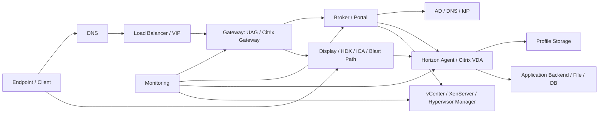
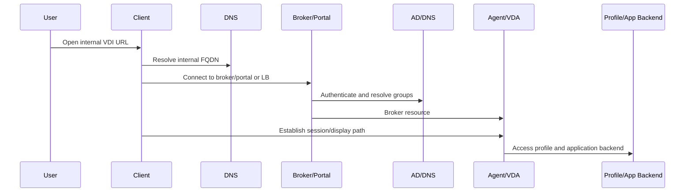
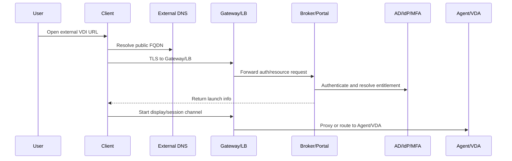

# Network Operations for VDI

## 0. Document Control

| Trường | Giá trị |
|---|---|
| Thứ tự | 9 |
| Tên tài liệu | Network Operations for VDI |
| Tên file | 09_Network_Operations_for_VDI.md |
| Mục đích tài liệu | Mô tả các thành phần mạng cần vận hành như VLAN, routing, firewall, load balancer, DNS, certificate, gateway, latency, packet loss và bandwidth. |
| Nguồn điều khiển | [[sources/vdi-training-idea]], [[sources/vdi-documentation-list-context]] |
| Trạng thái thông tin | Có mô hình network operations đào tạo; VLAN, subnet, firewall rule, VIP, certificate, NAT, DNS zone, latency baseline và owner thật vẫn là Need Customer Confirmation. |

### 0.1 Source Grounding

| Nhóm tri thức | Nguồn sử dụng | Mức độ tin cậy | Ghi chú |
|---|---|---|---|
| Bối cảnh VDI quy mô lớn, network là lớp cần bao quát trong vận hành | [[sources/vdi-training-idea]] | High | Nguồn điều khiển cách nhìn network theo lớp trong VDI. |
| Tên tài liệu, tên file, mục đích và phạm vi | [[sources/vdi-documentation-list-context]] | High | Source of truth cho scope tài liệu này. |
| Horizon internal/external flow, UAG, primary/secondary protocol, firewall, load balancing, certificate | [[sources/understand-and-troubleshoot-horizon-connections]], [[sources/horizon-8-architecture]] | High | Dùng để giải thích network path và lỗi external/display protocol trong Horizon. |
| Citrix Workspace, StoreFront, Gateway, Delivery Controller, VDA, HDX/ICA, virtual channels | [[sources/citrix-virtual-apps-and-desktops-7-2603]] | High | Dùng để giải thích network path và HDX/ICA trong Citrix CVAD. |
| Virtual networking, vCenter/ESXi, host networking | [[sources/vmware-vsphere-8-0]], [[sources/vcenter-server-installation-and-setup]] | Medium | Dùng để nhắc dependency mạng bên dưới VM/hypervisor. |
| XenServer networking, host/pool, storage repository | [[sources/xenserver-8-4]] | Medium | Dùng để nhắc network khi Citrix chạy trên XenServer. |

### 0.2 In Scope

- Giải thích network operations cho VDI: VLAN, routing, firewall, load balancer, DNS, certificate, gateway, latency, packet loss, bandwidth.
- Mô tả các đoạn network path quan trọng: endpoint-gateway, gateway-broker, broker-agent/VDA, VM-AD/DNS, VM-profile/backend, broker-hypervisor, monitoring.
- Phân biệt lỗi network của user nội bộ và user bên ngoài.
- Chỉ ra cách network issue biểu hiện thành login fail, launch fail, black screen, disconnect, VDA/Agent unregistered, profile/backend issue.
- Cung cấp checklist, troubleshooting table, scenario, knowledge check và câu hỏi cần xác nhận với khách hàng.

### 0.3 Out of Scope

- Không thay thế tài liệu thiết kế mạng, firewall, load balancer hoặc PKI chuyên sâu.
- Không đưa port/IP/VIP/firewall rule thật khi chưa có dữ liệu khách hàng.
- Không hướng dẫn mở firewall, thay certificate, đổi routing, NAT, VLAN hoặc load balancer trên production khi chưa có change approval.
- Không yêu cầu secret, password, token hoặc private key.

## 1. Tài liệu này giúp engineer làm được gì

Network trong VDI không phải một đường nối đơn giản. Một user session có nhiều đoạn mạng khác nhau: từ endpoint đến gateway, từ gateway đến broker, từ broker đến Agent/VDA, từ client/gateway đến display protocol, từ desktop đến AD/DNS/profile storage/backend app, và từ broker đến hypervisor manager.

Sau khi học xong, engineer cần làm được:

1. Vẽ được các đoạn network path quan trọng của Horizon và Citrix.
2. Phân biệt lỗi DNS, certificate, gateway, load balancer, firewall, routing, latency, packet loss và bandwidth.
3. Biết khi nào external-only issue gợi ý gateway/LB/firewall/cert.
4. Biết khi nào VDA/Horizon Agent unregistered có thể liên quan DNS/firewall/routing.
5. Biết evidence cần lấy trước khi escalation sang network/security/load balancer team.
6. Không escalation chung chung kiểu "network issue" mà chỉ rõ đoạn flow, source/destination, timestamp và symptom.

## 2. Network nằm ở đâu trong VDI

Mỗi mũi tên là một đoạn có thể lỗi. Engineer cần nói rõ đoạn nào đang nghi ngờ:

- Client tới DNS.
- Client tới Gateway/LB.
- Gateway tới StoreFront/Connection Server.
- StoreFront tới Delivery Controller.
- Connection Server/Delivery Controller tới AD/DNS.
- Broker tới Horizon Agent/VDA.
- Client hoặc Gateway tới Agent/VDA cho display protocol.
- Desktop/VDA tới profile storage.
- Desktop/VDA tới application backend.
- Broker tới vCenter/XenServer.
- Monitoring tới từng thành phần.

## 3. Thành phần mạng cần hiểu

| Thành phần | Vai trò trong VDI | Nếu lỗi thường thấy | Engineer cần kiểm tra | Evidence cần lưu |
|---|---|---|---|---|
| VLAN/Subnet | Phân tách vùng endpoint, gateway, broker, desktop, management, storage/backend | Không route được, sai segment, Agent/VDA không liên lạc broker | VM/host nằm subnet nào, path giữa subnet | VLAN/subnet mapping, affected segment |
| Routing | Đưa traffic giữa các subnet/site | Timeout, one-way traffic, external/internal lệch | Source/destination, route path, asymmetric routing nếu nghi | Trace/test result, network owner notes |
| Firewall | Kiểm soát traffic giữa zone | Login fail, launch fail, Agent/VDA unregistered, backend timeout | Rule theo source/destination/service, recent change | Firewall log/drop, rule ID nếu có |
| Load Balancer | Phân phối traffic tới gateway/portal/broker | Lỗi không ổn định, một số user lỗi, member down | VIP, pool member, health check, persistence/affinity | LB status, member state, timestamp |
| DNS | Resolve URL, broker, gateway, DC, VDA/Agent, backend | Wrong endpoint, cert mismatch, unregistered, timeout | Internal/external DNS, FQDN, split DNS | DNS result từ đúng source network |
| Certificate | TLS trust cho gateway/portal/LB | Certificate warning, login fail, client không connect | Expiry, CN/SAN, chain, bound service | Cert detail, expiry, affected URL |
| Gateway | Entry point external hoặc security boundary | External-only issue, launch timeout, disconnect | Gateway health, cert, path tới broker/Agent/VDA | Gateway logs/status |
| NAT/Proxy | Chuyển đổi hoặc trung gian traffic external | External-only, source IP sai, callback/path lỗi | NAT rule, source/destination translation | NAT/proxy evidence, external IP |
| Latency | Độ trễ network | Session lag, audio/video kém, login/backend chậm | Latency theo path và thời điểm | Ping/synthetic/session metric |
| Packet loss | Mất gói | Disconnect, black screen, HDX/Blast giật | Loss theo path, interface errors | Loss test, network monitoring |
| Bandwidth | Băng thông khả dụng | Display chậm, file/app transfer chậm, media kém | Link utilization, concurrent session, QoS nếu có | Bandwidth chart, timeframe |

## 4. Network path nội bộ và bên ngoài

### 4.1 Internal access path

Internal issue thường liên quan:

- Internal DNS.
- Internal LB/VIP.
- Broker/portal reachability.
- AD/DNS path.
- Broker-to-Agent/VDA firewall.
- Client-to-Agent/VDA display path nếu thiết kế direct.
- Desktop-to-profile/backend path.

### 4.2 External access path

External issue thường liên quan:

- Public DNS.
- Certificate trên gateway/LB.
- NAT/firewall.
- Gateway health.
- Load balancer member.
- Gateway-to-broker path.
- Gateway-to-Agent/VDA display/session path.
- IdP/MFA nếu có.

Nếu internal hoạt động nhưng external lỗi, ưu tiên gateway, LB, certificate, NAT, firewall và external display/session path.

## 5. Horizon network operations

Theo [[sources/understand-and-troubleshoot-horizon-connections]], troubleshooting Horizon hiệu quả cần tách từng đoạn: client tới UAG, UAG tới identity provider, UAG tới Connection Server, rồi tới desktop hoặc RDS host. Nguồn này cũng nhấn mạnh khác biệt giữa primary protocol và secondary/display protocol.

### 5.1 Đoạn mạng Horizon cần biết

| Đoạn | Vai trò | Lỗi thường gặp |
|---|---|---|
| Horizon Client -> UAG/Connection Server | Mở portal, authentication, resource list | DNS, cert, LB, firewall |
| UAG -> Connection Server | External access chuyển vào broker | Firewall, routing, UAG config, CS health |
| Connection Server -> AD/DNS | Authentication, group, entitlement | DC/DNS latency, auth fail |
| Connection Server -> Horizon Agent | Broker biết desktop state | Agent unreachable, firewall, DNS |
| Client/UAG -> Horizon Agent | Display protocol/session | Secondary protocol fail, black screen, timeout |
| Desktop -> profile/backend | User runtime | Profile latency, backend firewall/DNS |
| Connection Server -> vCenter | VM lifecycle | vCenter path, DNS, firewall, permission |

### 5.2 Dấu hiệu network trong Horizon

- External login được nhưng launch fail: nghi UAG-to-Agent/display path.
- Internal OK external lỗi: nghi UAG/LB/cert/firewall/NAT.
- Nhiều Agent unreachable: nghi broker-Agent network, DNS, firewall hoặc VM segment.
- Black screen: có thể là display protocol, packet loss, firewall, profile/logon.

## 6. Citrix CVAD network operations

Theo [[sources/citrix-virtual-apps-and-desktops-7-2603]], Citrix CVAD có các thành phần StoreFront, Delivery Controller, VDA, HDX/ICA và các kênh ảo. Network ảnh hưởng cả resource enumeration và session experience.

### 6.1 Đoạn mạng Citrix cần biết

| Đoạn | Vai trò | Lỗi thường gặp |
|---|---|---|
| Workspace App -> Gateway/StoreFront | User mở portal và login | DNS, cert, Gateway/LB, StoreFront |
| Gateway -> StoreFront | External access vào StoreFront | Firewall, routing, Gateway policy |
| StoreFront -> Delivery Controller | Lấy resource user được cấp | Controller unreachable, firewall, DNS |
| Delivery Controller -> AD/DNS | User/group/policy context | Auth/group lookup issue |
| Delivery Controller -> VDA | VDA registration và brokering | VDA unregistered, firewall, DNS |
| Client/Gateway -> VDA | HDX/ICA session | Launch fail, disconnect, packet loss |
| VDA -> profile/backend | Runtime và app dependency | App/file/DB timeout, profile issue |
| Controller -> hypervisor | Power/provisioning | vCenter/XenServer network path |

### 6.2 Dấu hiệu network trong Citrix

- Login được nhưng không thấy app: có thể StoreFront-Controller hoặc entitlement, không vội kết luận network.
- Thấy app nhưng launch fail: nghi VDA registration, HDX/ICA path, Gateway, firewall.
- External-only launch fail: nghi Citrix Gateway, STA/session path, LB/cert/firewall.
- Session disconnect hoặc audio/video kém: nghi latency, packet loss, bandwidth, Gateway timeout, endpoint network.

## 7. DNS, certificate và load balancer

### 7.1 DNS

DNS phải được kiểm tra theo đúng vị trí nguồn:

- Endpoint external resolve external URL.
- Endpoint internal resolve internal URL.
- Gateway resolve broker/StoreFront/Connection Server.
- Broker resolve AD/DC/Agent/VDA/vCenter.
- Desktop/VDA resolve profile storage và backend app.

Một FQDN resolve đúng từ máy admin không chứng minh nó đúng từ endpoint hoặc gateway. Luôn ghi rõ test được thực hiện từ đâu.

### 7.2 Certificate

Certificate lỗi thường gây:

- Client warning.
- Không login được qua gateway/portal.
- Mobile/thin client không tin cậy cert.
- TLS handshake fail.
- External access outage khi cert hết hạn.

Engineer cần kiểm tra:

- CN/SAN có khớp FQDN không.
- Certificate còn hạn không.
- Chain có đầy đủ không.
- Certificate đang bind đúng service/VIP không.
- Recent certificate renewal có xảy ra không.

Không yêu cầu private key hoặc secret.

### 7.3 Load balancer

Load balancer có thể gây lỗi "khó chịu" vì chỉ một số user bị nếu một member lỗi.

Cần kiểm tra:

- VIP.
- Pool member.
- Health check.
- Persistence/affinity nếu ứng dụng yêu cầu.
- TLS offload/bridge mode nếu có.
- Recent change.

Nếu user lỗi không ổn định, lúc được lúc không, hãy nghĩ tới LB member hoặc persistence.

## 8. Latency, packet loss và bandwidth

### 8.1 Latency

Latency cao làm VDI có cảm giác chậm. Với display protocol, latency cao có thể làm thao tác chuột/phím trễ, audio/video kém hoặc app phản hồi chậm.

### 8.2 Packet loss

Packet loss làm session không ổn định:

- Disconnect ngẫu nhiên.
- Black screen.
- Reconnect loop.
- Audio/video giật.
- Printing/clipboard/USB channel lỗi.

### 8.3 Bandwidth

Bandwidth thiếu thường thấy khi:

- Nhiều session đồng thời.
- Multimedia, video, camera, screen sharing.
- Printing hoặc file transfer.
- App backend truyền dữ liệu lớn.

### 8.4 Cần đo theo đúng path

Metric network phải theo đoạn path. "Latency mạng bình thường" là không đủ nếu chỉ đo từ monitoring server. Cần biết:

- Endpoint tới gateway.
- Gateway tới broker.
- Gateway tới Agent/VDA.
- Client tới Agent/VDA nếu direct.
- Desktop tới backend.
- Desktop tới profile storage.

## 9. Firewall và segmentation

VDI thường đi qua nhiều security zone:

- User network.
- DMZ/gateway zone.
- Broker/management zone.
- Desktop/session VM zone.
- AD/DNS zone.
- Storage/profile/backend zone.
- Hypervisor management zone.

Firewall issue có thể gây:

- Portal timeout.
- Login fail.
- Resource list OK nhưng launch fail.
- Agent/VDA unregistered.
- Profile load fail.
- App backend timeout.
- Monitoring không thấy service.

Khi escalation firewall, cần chuẩn bị:

- Source.
- Destination.
- Service/protocol nếu biết.
- Timestamp.
- User/session sample.
- Error.
- Business impact.
- Recent change.

Không gửi credential hoặc yêu cầu mở rule chung chung.

## 10. Monitoring và evidence network

| Nhóm | Metric/evidence | Ý nghĩa |
|---|---|---|
| DNS | Resolve result theo source network | Xác nhận tên trỏ đúng IP/VIP |
| Certificate | Expiry, CN/SAN, chain, binding | Xử lý TLS/client warning |
| Gateway | Health, connection count, error log | Khoanh vùng external access |
| Load Balancer | VIP, member state, health check, persistence | Phát hiện member lỗi hoặc phân phối sai |
| Firewall | Allow/deny log, rule hit, recent policy change | Chứng minh path bị chặn |
| Latency | RTT theo từng đoạn path | Xử lý session lag |
| Packet loss | Loss rate, interface errors | Xử lý disconnect/black screen |
| Bandwidth | Link utilization, session count | Xử lý media/printing/file transfer chậm |
| Broker event | Failed session, resource enumeration, launch error | Correlate network với platform |
| Agent/VDA state | Registered/unregistered trend | Chứng minh broker-agent path |

Evidence network phải có thời điểm. Nếu user báo lỗi lúc 09:10, metric lúc 11:30 không đủ mạnh để RCA.

## 11. Lỗi network thường gặp và hướng chẩn đoán

| Triệu chứng | Nguyên nhân có thể | Đoạn network cần kiểm tra | Evidence cần thu thập | Hướng xử lý ban đầu | Khi nào escalation |
|---|---|---|---|---|---|
| External user không mở được portal | Public DNS, cert, gateway/LB, firewall/NAT | Client -> DNS -> Gateway/LB | URL, DNS result, cert, LB/GW status | So sánh internal/external; kiểm tra cert/LB | Nhiều user external |
| Internal OK, external launch fail | Gateway-to-Agent/VDA path, firewall, NAT, display protocol | Gateway -> Agent/VDA | Gateway log, failed session, Agent/VDA state | Tách login flow và session flow | Network/security/platform owner |
| Login fail nhiều user | DC/DNS path, IdP/MFA, broker auth path | Broker/Gateway -> AD/IdP | Auth log, DNS/DC status, gateway/broker event | Xác định identity hay network path | Nhiều user hoặc auth outage |
| Resource list OK nhưng launch timeout | Agent/VDA unreachable, display protocol blocked | Broker -> Agent/VDA; Client/Gateway -> Agent/VDA | Failed launch, registration, firewall log | Kiểm tra registration và session path | Ảnh hưởng nhiều resource |
| VDA/Agent unregistered hàng loạt | DNS, firewall, route, VM network segment | Agent/VDA -> Broker/Controller | Registration trend, DNS, path test | Tìm điểm chung VLAN/subnet/firewall | Nhiều machines/pool/catalog |
| Black screen | Packet loss, display protocol path, gateway timeout, profile/logon | Session path and profile path | Protocol log, latency/loss, profile log | Phân biệt network/display và logon/profile | Diện rộng hoặc external-only |
| Disconnect ngẫu nhiên | Packet loss, idle timeout, endpoint network, LB/Gateway | Client/Gateway session path | Reconnect timeline, packet loss, gateway log | Correlate theo location/path | Nhiều user cùng location |
| Desktop vào được nhưng app backend timeout | Desktop-to-backend firewall/DNS/routing | VDI VM -> app/file/DB | App error, backend FQDN/IP, path test | Chứng minh VDI session OK, chuyển app/network owner | Nhiều user cùng app |
| Một số user lỗi lúc được lúc không | LB member lỗi, persistence, asymmetric routing | LB/Gateway/Broker | LB member state, request distribution | Kiểm tra member theo timestamp | LB/network owner |

## 12. Operational checklist cho network issue

### Khi nhận ticket

- [ ] Xác định platform: Horizon hay Citrix.
- [ ] Xác định user internal hay external.
- [ ] Xác định lỗi ở bước nào: portal, login, resource list, launch, session, backend.
- [ ] Ghi URL, client, timestamp, source location.
- [ ] Hỏi lỗi xảy ra với một user, một site, một subnet, một gateway hay nhiều platform.
- [ ] Kiểm tra recent change: firewall, LB, cert, DNS, gateway, routing, VLAN, proxy.

### Kiểm tra theo đoạn

- [ ] Endpoint/client tới DNS.
- [ ] Endpoint/client tới gateway/portal.
- [ ] Certificate trên URL/VIP.
- [ ] Load balancer member và health.
- [ ] Gateway tới broker/StoreFront/Connection Server.
- [ ] Broker tới AD/DNS.
- [ ] Broker tới Agent/VDA.
- [ ] Client/Gateway tới Agent/VDA cho display protocol.
- [ ] Desktop/VDA tới profile storage.
- [ ] Desktop/VDA tới application backend.
- [ ] Broker tới vCenter/XenServer nếu provisioning/power issue.

### Evidence trước escalation

- [ ] Source và destination theo tên thành phần.
- [ ] Internal/external comparison.
- [ ] Timestamp/timezone.
- [ ] User/session/resource sample.
- [ ] Error screenshot.
- [ ] DNS result.
- [ ] Cert detail nếu liên quan.
- [ ] Gateway/LB status nếu liên quan.
- [ ] Broker/Agent/VDA evidence.
- [ ] Network metric: latency, packet loss, bandwidth nếu có.
- [ ] Recent change ID.

## 13. Tình huống học tập

### Tình huống 1: External launch fail, internal bình thường

**Bối cảnh:** User bên ngoài login được và thấy desktop, nhưng launch timeout. User nội bộ cùng desktop/pool launch được.

**Câu hỏi cho học viên:**

- Vì sao authentication flow không đủ để kết luận mạng ổn?
- Đoạn network nào cần kiểm tra?
- Evidence nào cần gửi network/security?

**Gợi ý phân tích:** Login/resource list đã qua; lỗi nằm ở session/display path external, gateway, firewall/NAT hoặc Agent/VDA reachability.

**Hướng xử lý đề xuất:** Kiểm tra gateway log, failed session, Agent/VDA registration, gateway-to-Agent/VDA path, firewall/LB recent change.

**Evidence cần lưu:** Internal/external comparison, user/resource, timestamp, gateway log, failed launch, destination Agent/VDA.

### Tình huống 2: Một subnet VDI có nhiều VDA unregistered

**Bối cảnh:** Một nhóm VDA trong cùng subnet/VLAN unregistered, nhóm khác bình thường.

**Câu hỏi cho học viên:**

- Điểm chung network là gì?
- Cần kiểm tra DNS hay firewall?
- Làm sao chứng minh không phải Delivery Controller lỗi?

**Gợi ý phân tích:** Nếu lỗi theo subnet/VLAN, ưu tiên network path từ VDA tới Controller, DNS, firewall, routing hoặc port group.

**Hướng xử lý đề xuất:** So sánh VDA cùng Controller nhưng khác subnet, lấy DNS/path evidence và registration trend.

**Evidence cần lưu:** VDA list, subnet/VLAN, Controller target, DNS result, firewall/network log.

### Tình huống 3: Session disconnect theo chi nhánh

**Bối cảnh:** User ở một chi nhánh thường xuyên disconnect khỏi VDI, user ở site khác bình thường.

**Câu hỏi cho học viên:**

- Đây có phải lỗi broker không?
- Cần đo latency, packet loss hay bandwidth?
- Cần map path nào?

**Gợi ý phân tích:** Scope theo chi nhánh gợi ý WAN/ISP/VPN/firewall/LB path. Cần đo path endpoint tới gateway hoặc endpoint tới Agent/VDA tùy thiết kế.

**Hướng xử lý đề xuất:** Lấy reconnect timeline, packet loss/latency, gateway log, user sample cùng location.

**Evidence cần lưu:** Branch, user sample, timestamp, packet loss/latency chart, gateway/session logs.

### Tình huống 4: Desktop vào được nhưng app backend timeout

**Bối cảnh:** User vào desktop VDI thành công nhưng ứng dụng trong desktop không kết nối được database.

**Câu hỏi cho học viên:**

- VDI access flow đã thành công tới đâu?
- Đoạn network nào còn lại?
- Escalation nên gửi cho ai?

**Gợi ý phân tích:** Session đã thành công; lỗi có thể nằm ở desktop-to-backend DNS/routing/firewall/app server.

**Hướng xử lý đề xuất:** Test từ desktop tới backend theo FQDN/service, lấy app error và chuyển network/app owner với evidence.

**Evidence cần lưu:** Desktop session success, backend target, app error, DNS/path test, affected users.

## 14. Bài tập tư duy

### Bài tập 1: Vẽ network path

Vẽ 2 sơ đồ:

- External Horizon user tới desktop qua UAG.
- External Citrix user tới published app qua Citrix Gateway.

Mỗi sơ đồ phải có DNS, certificate, LB, gateway, broker/portal, Agent/VDA, profile/backend.

### Bài tập 2: Chuẩn bị firewall escalation

Tạo gói escalation cho lỗi launch fail gồm:

- Source component.
- Destination component.
- Platform.
- Internal/external.
- Timestamp.
- User/resource sample.
- Broker evidence.
- Agent/VDA state.
- Gateway/LB evidence.
- Recent change.

### Bài tập 3: Phân loại network symptom

| Triệu chứng | Network layer ưu tiên |
|---|---|
| Cert warning | Certificate/LB/Gateway |
| External-only timeout | Gateway/LB/NAT/firewall |
| VDA unregistered theo subnet | VLAN/routing/firewall/DNS |
| Session giật, disconnect | Latency/packet loss/bandwidth |
| Desktop app DB timeout | Desktop-to-backend routing/firewall/DNS |

### Bài tập 4: DNS split check

Lập bảng kiểm tra cùng một FQDN từ:

- Endpoint external.
- Endpoint internal.
- Gateway.
- Broker.
- Desktop/VDA.

Ghi lại IP trả về, zone, thời điểm và ý nghĩa.

## 15. Knowledge Check

### Câu 1

**Vì sao không nên escalation chung chung "network issue"?**

**Đáp án:** Vì VDI có nhiều đoạn network khác nhau. Cần chỉ rõ source, destination, flow stage, timestamp, symptom và evidence.

### Câu 2

**Internal OK nhưng external lỗi thường gợi ý gì?**

**Đáp án:** Public DNS, gateway, load balancer, certificate, NAT, firewall hoặc external display/session path.

### Câu 3

**Login được nhưng launch fail có thể là network không?**

**Đáp án:** Có. Authentication/resource enumeration có thể thành công trong khi display/session protocol tới Agent/VDA bị chặn hoặc lỗi.

### Câu 4

**DNS phải test từ đâu?**

**Đáp án:** Từ đúng source liên quan: endpoint internal/external, gateway, broker, Agent/VDA hoặc desktop, vì kết quả có thể khác nhau.

### Câu 5

**Load balancer lỗi có thể biểu hiện thế nào?**

**Đáp án:** Lỗi không ổn định, một số user lỗi, lúc được lúc không, hoặc chỉ khi traffic vào member lỗi.

### Câu 6

**Packet loss ảnh hưởng gì tới VDI?**

**Đáp án:** Disconnect, black screen, reconnect loop, audio/video giật, HDX/Blast/ICA kém, channel như printing/clipboard lỗi.

### Câu 7

**Certificate issue thường cần evidence gì?**

**Đáp án:** FQDN, certificate expiry, CN/SAN, chain, binding/VIP nếu biết, screenshot lỗi và timestamp.

### Câu 8

**VDA/Agent unregistered có thể do network thế nào?**

**Đáp án:** DNS sai, routing/firewall chặn Agent/VDA tới broker/Controller, VLAN/port group sai hoặc packet loss/path instability.

### Câu 9

**Desktop vào được nhưng app backend timeout nên kiểm tra đoạn nào?**

**Đáp án:** Desktop/VDA tới application backend: DNS, routing, firewall, database/file/API service path.

### Câu 10

**Thông tin network nào cần xác nhận với khách hàng?**

**Đáp án:** VLAN/subnet, routing, firewall path, LB/VIP, gateway, DNS split, certificate owner, NAT/proxy, latency baseline, bandwidth, monitoring, owner và escalation path.

## 16. Hiểu nhầm thường gặp

| Hiểu nhầm | Vì sao sai | Cách nghĩ đúng |
|---|---|---|
| "Portal mở được nghĩa là network ổn" | Session/display path có thể khác portal path. | Tách portal/auth flow và session flow. |
| "External lỗi là do internet user" | Gateway/LB/cert/NAT/firewall có thể là root cause. | So sánh internal/external với evidence. |
| "DNS resolve trên máy admin là đủ" | Split DNS và source network khác nhau có thể trả kết quả khác. | Test DNS từ đúng điểm trong flow. |
| "Packet loss nhỏ không quan trọng" | Real-time display protocol rất nhạy với loss/jitter. | Correlate packet loss với disconnect/session lag. |
| "Firewall chỉ ảnh hưởng login" | Firewall cũng ảnh hưởng broker-Agent, gateway-Agent, desktop-backend. | Map firewall theo từng đoạn. |
| "LB healthy nghĩa là app healthy" | Health check có thể quá nông hoặc member vẫn lỗi session path. | Kiểm tra member, persistence và log theo timestamp. |

## 17. Need Customer Confirmation

| Nhóm | Câu hỏi cần xác nhận | Vì sao cần |
|---|---|---|
| VLAN/Subnet | Các subnet cho endpoint, gateway, broker, desktop, management, storage/backend là gì? | Map path và impact. |
| Routing | Routing giữa các zone/site/VPN/branch như thế nào? | Xử lý timeout/asymmetric path. |
| Firewall | Rule giữa client-gateway, gateway-broker, broker-Agent/VDA, gateway-Agent/VDA, desktop-backend? | Triage launch, registration, backend issue. |
| Load balancer | VIP nào cho gateway, StoreFront, Connection Server, Controller? Health check/persistence? | Xử lý member lỗi và session affinity. |
| DNS | Public/private DNS, split DNS, FQDN chính là gì? | Xử lý resolve/cert mismatch. |
| Certificate | Cert nào dùng ở gateway/LB/portal, owner và expiry? | Tránh access outage. |
| Gateway | UAG/Citrix Gateway topology, HA, DMZ placement, owner? | External access troubleshooting. |
| NAT/Proxy | NAT/proxy/reverse proxy có tham gia external path không? | Xử lý external source/destination. |
| Protocol | Horizon Blast/RDP và Citrix HDX/ICA path đi qua đâu? | Xử lý launch/black screen/disconnect. |
| Monitoring | Tool nào đo latency, packet loss, bandwidth, LB/GW/firewall logs? | Evidence và alert. |
| Baseline | Latency/packet loss/bandwidth baseline theo site/branch là gì? | Phân biệt bất thường. |
| Ownership | Ai sở hữu DNS, firewall, LB, gateway, network, certificate? | Escalation đúng nhóm. |
| Change | Quy trình thay đổi firewall/LB/DNS/cert/routing là gì? | Kiểm soát rủi ro. |
| SLA | SLA cho network/gateway/access outage là gì? | Phân loại priority. |

## 18. Related Wiki Links

### Source pages

- [[sources/vdi-training-idea]]
- [[sources/vdi-documentation-list-context]]
- [[sources/understand-and-troubleshoot-horizon-connections]]
- [[sources/horizon-8-architecture]]
- [[sources/citrix-virtual-apps-and-desktops-7-2603]]
- [[sources/vmware-vsphere-8-0]]
- [[sources/vcenter-server-installation-and-setup]]
- [[sources/xenserver-8-4]]

### Concept pages

- [[concepts/vdi-connection-flow]]
- [[concepts/primary-and-secondary-protocols]]
- [[concepts/unified-access-gateway]]
- [[concepts/connection-server]]
- [[concepts/blast-extreme]]
- [[concepts/load-balancing]]
- [[concepts/certificate-management]]
- [[concepts/firewall-ports]]
- [[concepts/citrix-virtual-apps-and-desktops]]
- [[concepts/storefront]]
- [[concepts/delivery-controller]]
- [[concepts/virtual-delivery-agent]]
- [[concepts/hdx]]
- [[concepts/ica-virtual-channel]]
- [[concepts/virtual-networking]]
- [[concepts/dns-and-time-sync]]

### Topic pages nên đọc tiếp

- [[topics/5_VDI_Access_Flow_Design]]: hiểu luồng truy cập end-to-end.
- [[topics/3_Omnissa_Horizon_Architecture_Overview]]: chi tiết network path Horizon.
- [[topics/4_Citrix_CVAD_Architecture_Overview]]: chi tiết network path Citrix.
- [[topics/6_Identity_and_Domain_Integration_Guide]]: DNS, AD, auth path.
- [[topics/7_Hypervisor_and_HCI_Operations_Guide]]: virtual networking và host/network dependency.
- [[topics/18_VDI_Troubleshooting_Playbook]]: áp dụng network triage vào incident.

## 19. Summary for Learners

Network operations cho VDI là khả năng đọc từng đoạn path thay vì nói chung "mạng lỗi". Một phiên VDI có nhiều đoạn: endpoint-DNS, endpoint-gateway, gateway-broker, broker-identity, broker-Agent/VDA, client/gateway-Agent/VDA cho display protocol, desktop-profile/backend và broker-hypervisor.

Điều engineer cần nhớ:

- Internal và external path khác nhau.
- Login path và session/display path khác nhau.
- DNS, certificate, LB, gateway, firewall, routing, latency, packet loss và bandwidth đều có thể tạo triệu chứng VDI.
- External-only issue thường bắt đầu từ gateway/LB/cert/firewall/NAT.
- Launch fail sau khi login được thường liên quan session protocol, Agent/VDA, gateway hoặc firewall path.
- Desktop vào được nhưng backend lỗi là đoạn desktop-to-backend, không nhất thiết là broker/gateway.
- Escalation network tốt phải có source, destination, timestamp, symptom, impact và evidence.

Thứ tự kiểm tra khuyến nghị: xác định platform, xác định internal/external, xác định giai đoạn lỗi, kiểm tra DNS/certificate/LB/gateway, kiểm tra broker/Agent/VDA path, kiểm tra session protocol path, kiểm tra profile/backend path, lấy latency/packet loss/bandwidth evidence và escalation đúng owner.

