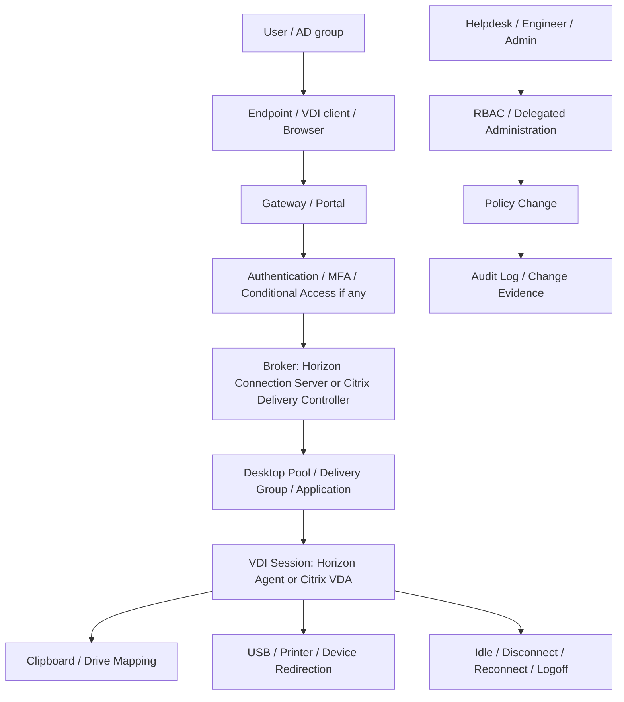

# VDI Security and Policy Management Guide

## 0. Document Control

| Trường | Giá trị |
|---|---|
| Thứ tự | 10 |
| Tên tài liệu | VDI Security and Policy Management Guide |
| Tên file | 10_VDI_Security_and_Policy_Management_Guide.md |
| Mục đích tài liệu | Hướng dẫn quản trị policy liên quan đến clipboard, USB, printer, drive mapping, session timeout, MFA, conditional access, RBAC và audit log. |
| Nguồn điều khiển | [[sources/vdi-training-idea]], [[sources/vdi-documentation-list-context]] |
| Trạng thái | Bản đào tạo vận hành. Các giá trị policy thật, role matrix, MFA/Conditional Access, audit source và quy trình exception là Need Customer Confirmation. |

### 0.1 Source Grounding

| Nội dung | Nguồn sử dụng | Mức độ tin cậy | Ghi chú |
|---|---|---|---|
| Bối cảnh VDI quy mô 1500 đến hơn 2000 máy, cần nhìn theo lớp identity, broker, policy, monitoring, change và support | [[sources/vdi-training-idea]] | High | Dùng làm khung đào tạo và nguyên tắc không bịa dữ liệu khách hàng. |
| Tên tài liệu, tên file và mục đích tài liệu | [[sources/vdi-documentation-list-context]] | High | Source of truth cho scope tài liệu này. |
| Citrix policy, HDX, ICA virtual channel, clipboard, USB, printer và device/session feature | [[sources/citrix-virtual-apps-and-desktops-7-2603]], [[concepts/hdx]], [[concepts/ica-virtual-channel]] | High | Dùng để giải thích policy ảnh hưởng tới trải nghiệm trong Citrix session. |
| Horizon access, UAG, Connection Server, entitlement và security boundary | [[sources/horizon-8-architecture]], [[sources/understand-and-troubleshoot-horizon-connections]] | Medium | Dùng để đặt policy trong luồng Horizon; cấu hình thực tế cần xác nhận. |
| Identity, certificate, monitoring, log và change control | [[concepts/identity-and-access-management]], [[concepts/certificate-management]], [[concepts/monitoring-and-logs]], [[concepts/change-management]] | Medium | Tri thức nền trong wiki, cần đối chiếu môi trường khách hàng. |

### 0.2 In Scope

- Quản trị và vận hành policy liên quan trực tiếp tới VDI session: clipboard, USB, printer, drive mapping, session timeout, disconnect, reconnect và logoff.
- Giải thích MFA, Conditional Access, RBAC và audit log theo góc nhìn system engineer vận hành VDI.
- Cách chẩn đoán lỗi do policy: user không copy/paste được, không thấy USB, không in được, mất drive mapping, bị timeout hoặc bị chặn khi đăng nhập.
- Cách đánh giá rủi ro khi thay đổi policy, cách pilot, rollback và lưu evidence.
- Phân biệt policy từ Citrix, Horizon, Active Directory Group Policy, gateway, identity provider và endpoint/client setting.

### 0.3 Out of Scope

- Không thay thế tài liệu security architecture, IAM/PAM, SIEM, GRC hoặc hardening baseline chuyên sâu.
- Không hướng dẫn bypass MFA, tắt security control, mở USB/clipboard/drive mapping trên production nếu chưa có phê duyệt.
- Không yêu cầu hoặc ghi nhận secret, password, token, certificate private key hoặc credential.
- Không mô tả chính sách bảo mật nội bộ của khách hàng như dữ kiện chắc chắn khi chưa được cung cấp.
- Không đi sâu provisioning, image management, incident process hoặc RBAC chi tiết; các phần đó liên kết sang tài liệu chuyên biệt.

## 1. Learning Objectives

Sau khi học xong, engineer cần làm được:

- Hiểu policy trong VDI không chỉ là cấu hình tiện ích, mà là lớp kiểm soát bảo mật, trải nghiệm người dùng và rủi ro vận hành.
- Phân biệt các nhóm policy: data movement, device redirection, printer, session lifecycle, access security, admin privilege và audit.
- Xác định policy đang áp theo user, AD group, OU, endpoint, location, pool, Delivery Group, gateway hay platform.
- Triage được các lỗi thường gặp liên quan tới clipboard, USB, printer, drive mapping, timeout, MFA và Conditional Access.
- Biết evidence cần lưu trước khi đề xuất thay đổi policy hoặc escalation.
- Biết khi nào phải dừng xử lý kỹ thuật và chuyển sang approval/security/change process.

## 2. Vì sao policy quan trọng trong VDI quy mô lớn

Trong VDI 1500 đến hơn 2000 máy, một thay đổi policy nhỏ có thể ảnh hưởng hàng trăm hoặc hàng nghìn phiên. Ví dụ:

- Mở clipboard hai chiều cho toàn bộ user có thể làm tăng nguy cơ rò rỉ dữ liệu.
- Chặn clipboard quá rộng có thể làm workflow nghiệp vụ dừng lại.
- Cho phép USB storage rộng có thể tạo đường copy dữ liệu ra endpoint.
- Tắt drive mapping có thể làm user không truy cập được file cần thiết.
- Timeout quá ngắn làm user mất phiên và mất dữ liệu chưa lưu.
- Timeout quá dài làm session treo giữ tài nguyên, license và tăng rủi ro bảo mật.
- RBAC quá rộng làm tăng nguy cơ engineer thay đổi nhầm production.
- Không có audit log làm RCA sau incident gần như mù.

Vì vậy, engineer không được xử lý policy theo kiểu "mở cho xong". Cách đúng là xác định phạm vi, hiểu rủi ro, lấy evidence, kiểm tra approval và thay đổi có kiểm soát.

## 3. Policy nằm ở đâu trong kiến trúc VDI

Policy có thể đến từ nhiều lớp:

| Lớp | Ví dụ policy | Engineer cần nhớ |
|---|---|---|
| Identity | MFA, Conditional Access, user group, device/location condition | Login fail chưa chắc do Horizon/Citrix; có thể bị chặn trước khi vào broker. |
| Gateway | External access policy, certificate, authentication requirement | Lỗi chỉ xảy ra từ ngoài thường cần xem gateway/auth path. |
| Broker | Entitlement, pool/Delivery Group assignment, session control | User không thấy resource thường liên quan entitlement hoặc group mapping. |
| Session agent | Clipboard, USB, printer, drive mapping, display/session feature | Phiên vẫn mở được nhưng tính năng bên trong lỗi thường nằm ở policy hoặc virtual channel. |
| Active Directory | GPO user/computer, OU, security filtering, loopback nếu có | GPO conflict có thể ghi đè hoặc làm policy áp khác giữa nhóm user. |
| Endpoint/client | Client setting, local device visibility, browser/client version | Không thấy USB/printer có thể bắt đầu từ endpoint trước khi vào VDI. |
| Admin/RBAC | Role, scope, delegated administration | Engineer thiếu quyền không phải lỗi hệ thống; cần role đúng và approval. |
| Audit/change | Log thao tác, change ticket, approval | Không có evidence thì không nên kết luận nguyên nhân. |

## 4. Các nhóm policy cần nắm

| Nhóm policy | Mục tiêu vận hành | Rủi ro nếu quá mở | Rủi ro nếu quá chặt | Evidence cần lưu |
|---|---|---|---|---|
| Clipboard | Cho phép copy/paste khi cần | Rò rỉ dữ liệu từ VDI ra endpoint | User không làm được workflow cần copy/paste | User, group, chiều copy, policy applied, resource |
| USB redirection | Cho phép thiết bị ngoại vi cần thiết | USB storage hoặc thiết bị không kiểm soát | Thiết bị nghiệp vụ không dùng được | Device type, endpoint, policy, client/session log |
| Printer redirection | Cho phép in từ session | In sai nơi, lộ dữ liệu qua máy in | User không in được, workflow dừng | Printer name, print path, session host, event/log |
| Drive mapping | Cho phép truy cập ổ local/network nếu được duyệt | Copy dữ liệu ra/vào không kiểm soát | User không truy cập file cần thiết | Drive type, user, endpoint, policy, screenshot |
| Session timeout | Quản lý idle/disconnect/logoff | Session treo, giữ tài nguyên, tăng rủi ro | User mất phiên, mất dữ liệu chưa lưu | Session state, timestamp, policy value |
| MFA | Tăng bảo đảm xác thực | Nếu thiết kế sai có thể gây bypass hoặc mệt mỏi MFA | Login fail, MFA loop, user không vào được | User, timestamp, access path, error, sign-in evidence nếu có |
| Conditional Access | Kiểm soát theo điều kiện user/device/location/risk | Chính sách quá lỏng | Chặn nhầm user/location/device | Policy/result nếu security cung cấp, gateway/auth log |
| RBAC | Giới hạn quyền quản trị | Admin quá rộng, thay đổi sai | Engineer không đủ quyền xử lý | Role, scope, action attempted, approval |
| Audit log | Truy vết thay đổi | Không phát hiện misuse nếu không log | Không RCA được nếu thiếu log | Admin, action, object, timestamp, change ID |

## 5. Data Movement Policy: clipboard và drive mapping

### 5.1 Clipboard

Clipboard policy kiểm soát copy/paste giữa endpoint và session. Với engineer mới, điểm quan trọng là clipboard có hướng:

- Endpoint sang VDI.
- VDI sang endpoint.
- Hai chiều.
- Chặn hoàn toàn.
- Có thể giới hạn theo loại dữ liệu hoặc theo chính sách nền tảng, tùy thiết kế.

Khi user nói "copy paste không được", không nên vội kết luận lỗi client. Hãy hỏi rõ:

- Copy từ đâu sang đâu?
- Chỉ text, file, hình ảnh hay mọi loại dữ liệu?
- Lỗi trong một app hay toàn session?
- Chỉ một user, một group hay toàn bộ pool/Delivery Group?
- Internal và external có khác nhau không?
- Có security/policy change gần đây không?

Điểm đào tạo quan trọng: clipboard là đường di chuyển dữ liệu. Nếu cần mở, phải mở đúng chiều, đúng nhóm, đúng resource, có approval và có rollback.

### 5.2 Drive mapping

Drive mapping cho phép ổ local hoặc network drive xuất hiện trong VDI session. Nó tiện cho user, nhưng rủi ro cao nếu user có thể copy dữ liệu ra endpoint không kiểm soát.

Phân biệt khi triage:

- Local drive mapping từ endpoint.
- Network drive mapping qua GPO hoặc file service.
- Drive xuất hiện nhưng không ghi được.
- Drive không xuất hiện hoàn toàn.
- Chỉ lỗi một endpoint, một user group hay toàn bộ resource.

Không nên xử lý drive mapping bằng cách mở toàn bộ local drives. Cần xác định business need và loại dữ liệu liên quan.

## 6. Device Redirection Policy: USB và printer

### 6.1 USB redirection

USB redirection không nên được nhìn như một policy "bật/tắt" đơn giản. Cần phân biệt loại thiết bị:

- USB storage.
- Smart card/token.
- Scanner.
- Camera.
- Serial/COM device.
- Thiết bị nghiệp vụ chuyên dụng.

USB storage thường nhạy cảm hơn vì liên quan copy dữ liệu. Thiết bị nghiệp vụ có thể cần exception theo device class, group hoặc resource cụ thể.

Checklist triage USB:

- Endpoint có nhận thiết bị không?
- Client VDI có quyền redirect thiết bị không?
- Policy có cho phép loại thiết bị đó không?
- Lỗi xảy ra trên Horizon, Citrix hay cả hai?
- Lỗi xảy ra internal hay external?
- Thiết bị này có được security phê duyệt không?

### 6.2 Printer redirection

Printer issue trong VDI thường gây nhiễu vì có nhiều lớp:

- Printer policy.
- Client printer mapping.
- Universal printer hoặc native driver.
- Print server.
- Windows Print Spooler.
- Network path tới print server.
- HDX/ICA virtual channel trong Citrix hoặc display/session channel tương ứng ở nền tảng.

Phân loại triệu chứng trước khi xử lý:

| Triệu chứng | Gợi ý lớp kiểm tra |
|---|---|
| Không thấy printer nào trong session | Printer policy, client mapping, GPO, session channel |
| Chỉ một printer không xuất hiện | Printer assignment, driver, print server, user permission |
| Printer hiện nhưng in không ra | Print server, queue, spooler, network, driver |
| In chậm | Network, print server load, driver, session channel |
| In sai máy | Default printer mapping, user profile, GPO, policy |

Không nên cài driver hoặc đổi printer policy trên diện rộng nếu chưa biết lỗi nằm ở user, endpoint, session host hay print backend.

## 7. Session Lifecycle Policy

Session lifecycle policy điều khiển vòng đời phiên:

- Idle timeout: user không thao tác bao lâu thì bị xử lý.
- Disconnect timeout: phiên disconnected được giữ bao lâu.
- Logoff timeout: khi nào phiên bị kết thúc.
- Reconnect behavior: user quay lại phiên cũ hay tạo phiên mới.
- Session reliability hoặc cơ chế giữ phiên nếu nền tảng hỗ trợ.

### 7.1 Phân biệt disconnect và logoff

| Trạng thái | Ý nghĩa | Ảnh hưởng |
|---|---|---|
| Active | User đang dùng session | Tài nguyên đang được sử dụng bình thường. |
| Idle | Session mở nhưng user không thao tác | Có thể bị policy xử lý nếu quá thời gian. |
| Disconnected | Kết nối client mất nhưng session có thể vẫn còn | User có thể reconnect nếu policy cho phép. |
| Logged off | Session đã kết thúc | App đóng, dữ liệu chưa lưu có thể mất. |
| Stale/hung | Session treo hoặc không phản hồi | Cần triage trước khi logoff/restart. |

Nếu user nói "bị văng", engineer phải hỏi: văng khỏi client, disconnected, hay logoff hẳn? Đây là khác biệt sống còn khi tìm nguyên nhân.

### 7.2 Cân bằng bảo mật và trải nghiệm

Timeout quá chặt:

- User mất phiên khi đang xử lý nghiệp vụ.
- Ứng dụng đóng đột ngột.
- Ticket tăng.
- Có thể mất dữ liệu chưa lưu.

Timeout quá lỏng:

- Session treo lâu.
- Tài nguyên CPU/memory/license bị giữ.
- Rủi ro người khác dùng endpoint đang mở session.
- Khó dọn session orphan.

Trong hệ thống lớn, session timeout cần được quản trị như một policy vận hành có impact, không phải setting nhỏ.

## 8. MFA và Conditional Access

MFA và Conditional Access nằm ở lớp xác thực/truy cập. Trong bối cảnh khách hàng, việc có dùng Hybrid Microsoft Entra ID, MFA hoặc Conditional Access hay không là Need Customer Confirmation.

### 8.1 Khi nào nghi lỗi MFA hoặc Conditional Access

- User external bị lỗi, user internal vẫn vào được.
- Lỗi xảy ra trước khi thấy desktop/app.
- User bị vòng lặp MFA.
- User không nhận prompt.
- Browser vào được nhưng client không vào được, hoặc ngược lại.
- Chỉ một location, một nhóm user hoặc một loại device bị chặn.
- Sau security change, nhiều user bị login fail.

### 8.2 Evidence cần lấy

- User bị ảnh hưởng.
- Timestamp chính xác.
- Access path: internal hay external.
- Client type: browser, Horizon Client, Citrix Workspace App.
- URL/portal/gateway liên quan nếu được phép ghi nhận.
- Error message hoặc screenshot.
- Gateway/authentication log nếu có quyền xem.
- Sign-in log hoặc Conditional Access result nếu security team cung cấp.
- Change ID nếu có thay đổi MFA/CA gần đây.

Engineer không được yêu cầu user cung cấp mã MFA, password, token hoặc secret.

## 9. RBAC và least privilege

RBAC giúp giới hạn quyền quản trị theo vai trò. Trong VDI, một thao tác sai có thể ảnh hưởng rộng: đổi entitlement, mở USB, thay timeout, publish image, đổi gateway setting hoặc logoff hàng loạt.

### 9.1 Vai trò vận hành điển hình

| Vai trò | Nên làm | Cần tránh nếu chưa được phê duyệt |
|---|---|---|
| Helpdesk | Xem user/session, thu evidence, hỗ trợ bước đầu theo SOP | Thay policy, cấp entitlement rộng, đổi image |
| System Engineer | Health check, triage, xử lý incident theo SOP, đề xuất change | Bypass security control, mở policy diện rộng |
| Platform Admin | Quản trị Horizon/Citrix policy, pool, catalog, broker, gateway trong phạm vi | Thay đổi ngoài change window hoặc thiếu audit |
| Security Admin | MFA, Conditional Access, security exception, audit review | Tự đổi VDI resource nếu không thuộc ownership |
| Infrastructure Admin | Hypervisor, storage, network, certificate/LB theo RACI | Thay VDI entitlement/policy nếu không có owner |

### 9.2 Nguyên tắc thực tế

- Tách quyền xem, quyền hỗ trợ user và quyền thay đổi cấu hình.
- Không dùng quyền full admin cho công việc L1/L2 thường ngày.
- Thao tác mở clipboard, USB, drive mapping hoặc thay MFA/CA cần approval.
- Mọi thay đổi policy phải có change/evidence/audit.
- Khi thiếu quyền, ghi rõ action cần làm, object cần thao tác, lý do nghiệp vụ và gửi escalation; không xin quyền rộng chung chung.

## 10. Audit log và evidence

Audit log giúp trả lời các câu hỏi trong RCA:

- Ai thay đổi policy?
- Thay đổi lúc nào?
- Thay trên object nào?
- Giá trị trước và sau là gì?
- Có change ticket hoặc approval không?
- Thay đổi có trùng thời điểm incident không?
- Có rollback không?

Các thao tác cần audit kỹ:

- Mở hoặc tắt clipboard.
- Mở hoặc tắt USB redirection.
- Thay printer hoặc drive mapping policy.
- Thay idle/disconnect/logoff timeout.
- Thay entitlement, Delivery Group, desktop pool.
- Thay MFA hoặc Conditional Access.
- Thay role/RBAC.
- Thay gateway, certificate, load balancer hoặc access policy.

Nếu audit log không có hoặc engineer không có quyền xem, phải ghi rõ Unknown và escalation tới owner phù hợp. Không nên kết luận "do ai đó đổi policy" nếu chưa có log hoặc change evidence.

## 11. Citrix, Horizon và GPO: tránh nhầm nguồn policy

| Chủ đề | Citrix CVAD | Omnissa Horizon | Active Directory/GPO |
|---|---|---|---|
| Resource visibility | Delivery Group, Application Group, entitlement | Desktop/application pool entitlement | AD group membership có thể là đầu vào |
| Clipboard/USB/printer | Citrix Policy, HDX/ICA virtual channel, VDA/session | Horizon policy/client/session setting tùy thiết kế | GPO có thể áp user/computer |
| Drive mapping | Citrix Policy, client drive mapping, GPO | Horizon/client/GPO tùy thiết kế | GPO drive mapping hoặc security filtering |
| Timeout | Citrix policy/session setting/Delivery Group/GPO | Pool/session/client/GPO tùy thiết kế | User/computer policy có thể ghi đè |
| MFA/CA | Gateway/StoreFront/IdP integration tùy thiết kế | UAG/Connection Server/IdP integration tùy thiết kế | AD/Entra group hoặc condition là đầu vào |
| RBAC | Delegated administration/RBAC | Horizon admin role | Admin group membership nếu dùng |
| Audit | Citrix logging/Studio/Director/Site logging nếu bật | Horizon events/admin logs nếu bật | GPO change/audit nếu có |

Điểm cần nhớ: cùng một triệu chứng có thể do nhiều nguồn policy. Engineer phải tìm policy source of truth trong môi trường khách hàng, không chỉ nhìn một console.

## 12. Operational Workflow khi xử lý policy issue

### 12.1 Detect

- Nhận ticket, alert hoặc phản ánh từ user.
- Ghi lại triệu chứng bằng ngôn ngữ của user nhưng phải chuẩn hóa thành kỹ thuật: clipboard, USB, printer, drive, timeout, MFA, access block, RBAC hoặc audit.

### 12.2 Classify

- Một user hay nhiều user?
- Một endpoint hay nhiều endpoint?
- Một pool/Delivery Group hay toàn nền tảng?
- Internal hay external?
- Horizon, Citrix hay cả hai?
- Sau change hay không rõ thời điểm?

### 12.3 Triage

- Xác định user/group/resource.
- Xác định policy source có khả năng liên quan.
- Kiểm tra policy applied hoặc evidence tương đương.
- Kiểm tra recent change.
- Kiểm tra log nếu có quyền.
- Không thay đổi policy khi chưa hiểu impact.

### 12.4 Resolve hoặc Escalate

- Nếu là cấu hình trong phạm vi SOP và có approval, xử lý theo quy trình.
- Nếu cần exception bảo mật, chuyển security owner.
- Nếu cần thay policy production, mở change.
- Nếu liên quan MFA/CA, chuyển identity/security owner.
- Nếu liên quan printer backend, network, storage hoặc endpoint, chuyển đúng nhóm owner.

### 12.5 Validate và Close

- Test lại bằng user/resource mẫu.
- Xác nhận tính năng hoạt động đúng và không mở quá phạm vi.
- Lưu evidence trước/sau.
- Ghi rõ root cause nếu có bằng chứng; nếu chưa đủ, ghi probable cause.
- Cập nhật KB nếu lỗi có khả năng lặp lại.

## 13. Common Issues and Troubleshooting

| Triệu chứng | Nguyên nhân có thể | Lớp cần kiểm tra | Evidence cần thu thập | Cách kiểm tra | Hướng xử lý | Khi nào cần escalation |
|---|---|---|---|---|---|---|
| Không copy/paste được | Clipboard policy, GPO, client setting, app restriction, security baseline | Session policy, endpoint, app | User, group, chiều copy, resource, screenshot, policy applied | Test chiều copy, so sánh user khác cùng group, kiểm tra policy source | Nếu policy đúng, giải thích theo baseline; nếu cần mở, tạo exception/change | Cần mở clipboard hoặc có xung đột policy không rõ |
| Chỉ copy được một chiều | Policy giới hạn direction | Session policy/security | Direction, policy value, business case | Kiểm tra policy direction và nhóm áp dụng | Điều chỉnh đúng chiều nếu được phê duyệt | Cần security approval |
| USB không xuất hiện | USB class bị chặn, endpoint không nhận, client không redirect, device driver issue | Endpoint, client, session policy | Device type, endpoint, platform, policy, log nếu có | Xác nhận endpoint nhận thiết bị, kiểm tra policy theo device class | Mở exception theo device class/resource nếu được duyệt | USB storage hoặc thiết bị nhạy cảm |
| Không thấy printer | Printer policy, GPO, client printer mapping, print server, virtual channel | Printer/session/backend | Printer name, user, session host, policy, event/log | Phân biệt không thấy printer và printer có nhưng không in | Sửa mapping/policy/driver theo owner | Nhiều user, print server, hoặc cần đổi policy |
| Printer hiện nhưng in chậm | Print server load, driver, network, session channel | Backend/network/session | Queue, timestamp, printer, session host | So sánh app/user/printer khác, kiểm tra queue/log | Chuyển print/network owner nếu backend | Ảnh hưởng nhiều user hoặc site |
| Không thấy local drive | Drive mapping bị chặn, client setting, GPO, security baseline | Drive redirection/GPO | User, endpoint, drive type, resource, screenshot | Kiểm tra policy và client setting | Xác nhận baseline; mở exception nếu được phê duyệt | Cần mở local drive hoặc liên quan dữ liệu nhạy cảm |
| User bị disconnect/logoff quá sớm | Idle/disconnect/logoff policy, gateway timeout, network drop | Session lifecycle, gateway, network | Session state, timestamp, idle time, policy | Phân biệt disconnect và logoff, xem recent change | Điều chỉnh policy nếu có approval; nếu network, chuyển network | Ảnh hưởng nhiều user hoặc thay đổi timeout |
| Session không tự logoff | Timeout quá lỏng, app giữ session, policy không áp | Session lifecycle | Session state, policy, user/app, timestamp | Kiểm tra session state và policy applied | Điều chỉnh theo capacity/security requirement | Tài nguyên bị giữ diện rộng |
| MFA loop | IdP/MFA/Gateway integration, CA policy, cookie/session issue | Identity/access security | User, timestamp, access path, error, sign-in evidence nếu có | So sánh internal/external, browser/client, recent security change | Escalate identity/security với evidence | Luôn escalation nếu không thuộc quyền VDI |
| Conditional Access block | Location/device/risk/group policy chặn | Identity/security | Error, user, location, device state nếu có, sign-in log | Xác định policy result qua security owner | Không bypass; yêu cầu security review | Security owner |
| Engineer không thấy menu/quyền | RBAC thiếu role hoặc scope sai | Admin/RBAC | Admin user, action, object, role | Kiểm tra role assignment và scope | Yêu cầu quyền tối thiểu cho action cụ thể | Cần role mới hoặc thay đổi quyền |
| Không truy được ai đổi policy | Audit log không bật, thiếu quyền xem, log retention hết | Audit/change | Object, timestamp, admin nếu biết, change ticket | Tìm log source, đối chiếu change window | Ghi Unknown nếu thiếu evidence | Platform/security owner |

## 14. Field Checklist

### 14.1 Checklist triage nhanh

- [ ] Xác định triệu chứng thuộc nhóm nào: clipboard, USB, printer, drive, timeout, MFA/CA, RBAC hay audit.
- [ ] Ghi user, AD group nếu biết, endpoint, platform, resource, thời điểm.
- [ ] Xác định phạm vi: một user, nhóm user, pool/Delivery Group, site hay toàn hệ thống.
- [ ] Xác định access path: internal hay external.
- [ ] Kiểm tra recent change trong policy/security/access flow.
- [ ] Kiểm tra policy source có khả năng liên quan.
- [ ] Lưu screenshot/log/event trước khi thay đổi.
- [ ] Không mở policy diện rộng khi chưa có approval.

### 14.2 Checklist trước policy change

- [ ] Có business reason rõ ràng.
- [ ] Có owner phê duyệt.
- [ ] Xác định exact policy/object/user group.
- [ ] Xác định giá trị hiện tại và giá trị sau thay đổi.
- [ ] Đánh giá impact và rủi ro bảo mật.
- [ ] Có pilot group nếu khả thi.
- [ ] Có rollback plan.
- [ ] Có change record.
- [ ] Có người xác nhận sau change.

### 14.3 Checklist postcheck

- [ ] Test với user/resource mẫu.
- [ ] Xác nhận tính năng hoạt động đúng.
- [ ] Xác nhận không mở ngoài phạm vi.
- [ ] Kiểm tra audit log ghi nhận thao tác.
- [ ] Theo dõi ticket/alert liên quan.
- [ ] Lưu evidence trước/sau.
- [ ] Cập nhật KB nếu có pattern mới.

## 15. Monitoring and Evidence

| Nhóm | Chỉ số hoặc evidence nên theo dõi | Ý nghĩa |
|---|---|---|
| Session | Active/disconnected/logged off session, idle duration | Phát hiện timeout quá chặt hoặc quá lỏng. |
| User experience | Failed login, launch failure, reconnect failure | Có thể liên quan access/MFA/session policy. |
| Clipboard/drive/USB | Ticket trend theo tính năng | Policy issue thường lộ qua ticket pattern hơn là metric hạ tầng. |
| Printer | Print queue, print failure, printer ticket trend | Xác định lỗi cá biệt hay backend rộng. |
| MFA/CA | Sign-in failure, MFA failure, CA block nếu có quyền xem | Cần phối hợp identity/security owner. |
| RBAC | Admin action denied, role change, privileged action | Phát hiện thiếu quyền hoặc quyền quá rộng. |
| Audit | Policy change log, entitlement change, admin login | Dùng cho RCA và compliance. |
| Change | Change ticket, approval, rollback evidence | Chứng minh thay đổi được kiểm soát. |

Evidence tối thiểu khi tạo ticket/escalation:

- User hoặc nhóm user bị ảnh hưởng.
- Resource: pool, Delivery Group, app hoặc desktop.
- Platform: Horizon hoặc Citrix.
- Time window.
- Access path.
- Symptom rõ ràng.
- Screenshot hoặc log.
- Policy/value hiện tại nếu xem được.
- Recent change nếu có.
- Impact và số lượng user.

## 16. Change, Risk and Rollback Considerations

Policy change trong VDI phải được quản lý như change có rủi ro, vì ảnh hưởng có thể lan rộng.

### 16.1 Các thay đổi cần kiểm soát

- Mở/tắt clipboard.
- Mở/tắt USB redirection.
- Thay drive mapping.
- Thay printer redirection hoặc default printer behavior.
- Thay idle/disconnect/logoff timeout.
- Thay MFA/Conditional Access.
- Thay RBAC/admin role.
- Thay audit/logging setting.
- Thay policy áp cho toàn Delivery Group, pool, OU hoặc AD group lớn.

### 16.2 Precheck

- Đọc policy hiện tại.
- Export/chụp evidence cấu hình hiện tại nếu công cụ cho phép.
- Xác định object bị ảnh hưởng.
- Kiểm tra số lượng user/resource liên quan.
- Xác nhận owner và approval.
- Xác định maintenance window nếu impact lớn.
- Chuẩn bị rollback value.

### 16.3 Implementation

- Ưu tiên pilot với nhóm nhỏ.
- Không thay nhiều policy cùng lúc nếu không cần.
- Ghi lại từng thay đổi.
- Theo dõi ticket, alert, session và login sau thay đổi.

### 16.4 Rollback

Rollback nên là đưa policy về giá trị trước thay đổi, không phải chỉnh thêm một policy mới để "bù". Điều kiện rollback:

- User impact ngoài phạm vi dự kiến.
- Login/session bị ảnh hưởng rộng.
- Security owner yêu cầu dừng.
- Không xác minh được kết quả.
- Có dấu hiệu mở dữ liệu ngoài phạm vi approval.

### 16.5 Evidence

- Giá trị trước/sau.
- Change ID.
- Approval.
- Người thực hiện.
- Timestamp.
- User/resource test.
- Kết quả postcheck.
- Audit log.

## 17. Security and Access Control Considerations

Nguyên tắc nền:

- Least privilege: cấp quyền đúng việc, đúng thời điểm, đúng phạm vi.
- Separation of duties: người yêu cầu, người phê duyệt và người thực hiện nên tách biệt với thay đổi rủi ro cao.
- No credential collection: không xin password, token, mã MFA hoặc secret của user.
- Approval before exception: mọi ngoại lệ clipboard, USB, drive mapping, MFA/CA cần owner phê duyệt.
- Auditability: thao tác quản trị phải truy vết được.

Thao tác cần phê duyệt rõ:

- Mở USB storage.
- Mở clipboard từ VDI ra endpoint.
- Mở drive mapping cho dữ liệu nhạy cảm.
- Thay timeout làm session giữ lâu hơn.
- Thêm quyền admin hoặc role rộng.
- Tắt hoặc nới MFA/Conditional Access.
- Tắt audit/logging.

## 18. Scenario Based Learning

### Scenario 1: Clipboard bị chặn sau security change

**Bối cảnh:** Một nhóm user Citrix báo không copy dữ liệu từ VDI về laptop sau cuối tuần.

**Câu hỏi cho học viên:**

- Cần xác định copy theo hướng nào?
- Đây có thể là policy hay lỗi app?
- Có nên mở clipboard hai chiều cho toàn bộ Delivery Group không?

**Gợi ý phân tích:** Triệu chứng liên quan data movement. Cần kiểm tra user group, Delivery Group, Citrix Policy/GPO, recent security change và business reason.

**Hướng xử lý đề xuất:** Thu evidence, xác nhận policy applied, hỏi change record. Nếu cần mở, đề xuất exception theo nhóm/resource và yêu cầu approval.

**Evidence cần lưu:** User/group, direction, screenshot, policy, change ID, approval.

### Scenario 2: USB thiết bị chuyên dụng không nhận

**Bối cảnh:** Một bộ phận cần dùng thiết bị USB chuyên dụng trong Horizon desktop, nhưng thiết bị không xuất hiện trong session.

**Câu hỏi cho học viên:**

- Cần phân loại thiết bị thế nào?
- Endpoint có nhận thiết bị không?
- Mở toàn bộ USB có phải hướng xử lý đúng không?

**Gợi ý phân tích:** USB redirection cần xem device class, client, policy, platform và approval bảo mật. Thiết bị chuyên dụng có thể cần exception hẹp.

**Hướng xử lý đề xuất:** Lấy thông tin thiết bị, user group, pool, endpoint, test client và policy. Escalate security/platform nếu cần exception.

**Evidence cần lưu:** Device type, endpoint, pool, user sample, policy, test result.

### Scenario 3: External user bị MFA loop

**Bối cảnh:** User bên ngoài truy cập qua gateway bị lặp MFA, user nội bộ không lỗi.

**Câu hỏi cho học viên:**

- Lỗi nằm trước hay sau broker?
- Evidence nào cần gửi identity/security team?
- Có nên đổi desktop pool không?

**Gợi ý phân tích:** External-only MFA loop thường nằm ở access security: gateway, IdP, MFA hoặc Conditional Access. Desktop pool không phải điểm kiểm tra đầu tiên.

**Hướng xử lý đề xuất:** Thu user, timestamp, access path, error, client/browser, gateway/auth log nếu có và recent security change. Escalate identity/security owner.

**Evidence cần lưu:** Screenshot, timestamp, user, URL/path, sign-in evidence nếu có, change ID.

### Scenario 4: Session logoff sau 15 phút idle

**Bối cảnh:** User báo phiên bị đóng và mất dữ liệu khi rời máy 15 phút.

**Câu hỏi cho học viên:**

- Đây là disconnect hay logoff?
- Policy nào có thể gây ra?
- Cần cân bằng bảo mật và trải nghiệm ra sao?

**Gợi ý phân tích:** Session lifecycle policy cần đọc đúng lớp: Citrix/Horizon/GPO/gateway/client. Không thể đổi timeout nếu không biết baseline và owner.

**Hướng xử lý đề xuất:** Thu timeline, session state, policy value, group/resource và recent change. Nếu cần thay đổi timeout, thực hiện qua change.

**Evidence cần lưu:** Session state, timestamp, policy, user/resource, approval nếu thay đổi.

## 19. Hands On or Lab Thinking Exercises

### Bài tập 1: Policy impact matrix

Tạo bảng cho clipboard, USB, printer, drive mapping và timeout. Với mỗi policy, ghi:

- Business need.
- Security risk.
- User group.
- Object áp dụng.
- Default value.
- Exception path.
- Evidence cần lưu.

### Bài tập 2: RBAC decision

Phân loại role phù hợp cho các thao tác:

- Xem session.
- Logoff session.
- Gán entitlement.
- Mở USB cho một nhóm user.
- Thay timeout cho toàn Delivery Group.
- Xem audit log.

### Bài tập 3: Audit trail

Giả sử clipboard policy bị mở toàn hệ thống lúc 22:10. Hãy lập danh sách evidence cần tìm:

- Audit log.
- Change ticket.
- Admin account.
- Object bị thay đổi.
- Giá trị trước/sau.
- User group bị ảnh hưởng.
- Ticket/incident phát sinh sau thay đổi.

### Bài tập 4: MFA triage

Thiết kế checklist 10 bước để triage lỗi MFA cho external user mà không yêu cầu password, token hoặc mã MFA của user.

## 20. Knowledge Check

### Câu 1

**Vì sao không nên mở clipboard/USB toàn hệ thống để xử lý nhanh ticket?**

**Đáp án:** Vì clipboard và USB là đường di chuyển dữ liệu, có rủi ro rò rỉ hoặc đưa dữ liệu không kiểm soát vào session. Cần scope, approval, pilot và rollback.

### Câu 2

**User không thấy desktop/app thường thuộc nhóm policy nào?**

**Đáp án:** Thường liên quan entitlement/resource assignment hoặc AD group, không phải clipboard/USB policy.

### Câu 3

**USB không nhận trong session cần kiểm tra tối thiểu những gì?**

**Đáp án:** Endpoint có nhận thiết bị không, client có redirect không, device class, user/group, platform resource, USB policy và evidence/log.

### Câu 4

**Printer hiện nhưng không in được khác gì không thấy printer?**

**Đáp án:** Không thấy printer thường liên quan mapping/policy. Printer hiện nhưng không in được có thể liên quan print server, queue, driver, spooler, network hoặc session channel.

### Câu 5

**Disconnect khác logoff thế nào?**

**Đáp án:** Disconnect là mất kết nối nhưng session có thể còn tồn tại để reconnect. Logoff là kết thúc session, app đóng và dữ liệu chưa lưu có thể mất.

### Câu 6

**MFA/Conditional Access nên được kiểm tra ở lớp nào?**

**Đáp án:** Lớp access/authentication trước hoặc trong khi vào gateway/portal/broker, tùy thiết kế.

### Câu 7

**RBAC giúp giảm rủi ro gì?**

**Đáp án:** Giảm quyền quá mức, hạn chế thay đổi sai production, hỗ trợ audit và giúp escalation đúng phạm vi.

### Câu 8

**Audit log cần trả lời các câu hỏi nào?**

**Đáp án:** Ai thay đổi, thay đổi gì, khi nào, trên object nào, có approval/change ticket không và có rollback không.

### Câu 9

**Khi user bị timeout quá sớm, evidence quan trọng nhất là gì?**

**Đáp án:** Session state, timestamp, idle duration, policy value, user/resource, access path và recent change.

### Câu 10

**Khi thiếu dữ liệu thực tế về policy khách hàng, tài liệu hoặc ticket nên ghi gì?**

**Đáp án:** Ghi Unknown hoặc Need Customer Confirmation, kèm câu hỏi cụ thể về policy baseline, owner, approval path và log source.

## 21. Common Misconceptions

| Hiểu nhầm | Vì sao sai | Cách nghĩ đúng |
|---|---|---|
| Policy chỉ là cấu hình tiện ích | Policy kiểm soát bảo mật, dữ liệu, phiên và quyền quản trị. | Mỗi thay đổi policy cần impact/risk/approval. |
| Không copy được chắc do client lỗi | Có thể do clipboard policy, GPO, security baseline hoặc app restriction. | Xác định direction, user group và policy source. |
| USB nào cũng như nhau | USB storage khác thiết bị chuyên dụng về rủi ro. | Phân loại device class và mở exception hẹp nếu cần. |
| Timeout càng ngắn càng tốt | Quá ngắn gây mất dữ liệu và gián đoạn workflow. | Cân bằng security, capacity và business process. |
| Helpdesk cần full admin để hỗ trợ nhanh | Full admin làm tăng rủi ro thay đổi sai. | Dùng least privilege và escalation rõ. |
| Ticket note đủ thay audit log | Ticket không thay thế log hệ thống. | Audit log là evidence chính cho RCA. |
| MFA lỗi thì sửa VDI desktop | Nhiều lỗi MFA xảy ra trước khi vào desktop. | Kiểm tra access/authentication path trước. |

## 22. Need Customer Confirmation

| Nhóm | Câu hỏi cần hỏi khách hàng | Vì sao cần |
|---|---|---|
| Policy baseline | Clipboard, USB, printer, drive mapping và timeout mặc định đang là gì? | Xác định trạng thái chuẩn trước khi chẩn đoán. |
| Policy source of truth | Policy được quản trị chủ yếu ở Citrix, Horizon, GPO, gateway hay security platform nào? | Tránh kiểm tra nhầm console. |
| Citrix policy | Citrix Policy áp theo Delivery Group, user group, location hay tag nào? | Triage đúng scope. |
| Horizon policy | Horizon policy/pool setting/GPO nào kiểm soát session feature? | Triage đúng lớp Horizon. |
| GPO | OU, security filtering, loopback và GPO liên quan VDI là gì? | Xử lý policy conflict. |
| MFA | Có dùng MFA không, áp cho internal/external ra sao? | Xử lý access failure. |
| Conditional Access | Có dùng Microsoft Entra Conditional Access hoặc IdP policy tương đương không? | Xử lý user bị chặn theo điều kiện. |
| RBAC | Role matrix cho helpdesk, system engineer, platform admin, security admin là gì? | Áp least privilege và escalation đúng. |
| Audit log | Log quản trị nằm ở đâu, giữ bao lâu, ai có quyền xem? | Hỗ trợ RCA và compliance. |
| Exception process | Ai phê duyệt mở clipboard, USB, drive mapping hoặc timeout exception? | Tránh mở policy sai thẩm quyền. |
| Change process | Policy change cần loại change nào, precheck/postcheck ra sao? | Kiểm soát rủi ro production. |
| SLA/escalation | Sự cố policy/security cần escalation theo SLA nào? | Phân tuyến xử lý đúng. |
| Ownership | Owner của VDI policy, security policy, print, identity và endpoint là ai? | Tránh ticket vòng lặp giữa các nhóm. |

## 23. Related Wiki Links

### Source pages

- [[sources/vdi-training-idea]]
- [[sources/vdi-documentation-list-context]]
- [[sources/citrix-virtual-apps-and-desktops-7-2603]]
- [[sources/horizon-8-architecture]]
- [[sources/understand-and-troubleshoot-horizon-connections]]

### Concept pages

- [[concepts/identity-and-access-management]]
- [[concepts/certificate-management]]
- [[concepts/hdx]]
- [[concepts/ica-virtual-channel]]
- [[concepts/monitoring-and-logs]]
- [[concepts/change-management]]
- [[concepts/vdi-connection-flow]]
- [[concepts/omnissa-horizon]]
- [[concepts/citrix-virtual-apps-and-desktops]]
- [[concepts/delivery-group]]
- [[concepts/unified-access-gateway]]
- [[concepts/machine-identity]]

### Topic pages nên đọc tiếp

- [[topics/5_VDI_Access_Flow_Design]]: hiểu policy nằm ở đoạn nào trong internal/external access flow.
- [[topics/6_Identity_and_Domain_Integration_Guide]]: hiểu AD group, GPO, MFA và Hybrid Entra ID nếu có.
- [[topics/11_VDI_Provisioning_and_Allocation_Guide]]: hiểu cấp phát resource và entitlement ở mức vận hành.
- [[topics/13_Citrix_Machine_Catalog_and_Delivery_Group_Guide]]: hiểu Delivery Group và policy trong Citrix.
- [[topics/14_Omnissa_Desktop_Pool_and_Entitlement_Guide]]: hiểu pool, entitlement và policy trong Horizon.
- [[topics/20_VDI_Change_Management_Guide]]: kiểm soát policy change.
- [[topics/24_VDI_Access_Control_and_RBAC_Guide]]: đi sâu RBAC và least privilege.
- [[topics/25_VDI_Support_and_Escalation_Guide]]: phân tuyến escalation theo owner.

## 24. Summary for Learners

Security và policy trong VDI là lớp quyết định user được làm gì trong phiên, dữ liệu có thể đi đâu, session sống bao lâu, ai được thay đổi hệ thống và thay đổi đó có truy vết được không.

Thứ tự kiểm tra khuyến nghị khi gặp lỗi policy:

1. Chuẩn hóa triệu chứng: clipboard, USB, printer, drive, timeout, MFA/CA, RBAC hay audit.
2. Xác định phạm vi: một user, nhóm user, resource, platform hay toàn hệ thống.
3. Xác định access path: internal/external, Horizon/Citrix, client/browser.
4. Xác định policy source: Citrix, Horizon, GPO, gateway, identity provider, endpoint hoặc security baseline.
5. Lấy evidence trước khi thay đổi.
6. Kiểm tra recent change và approval.
7. Nếu cần thay policy, đi qua change/exception process.
8. Postcheck, lưu audit/evidence và cập nhật KB nếu lỗi có thể lặp lại.

Điều cần nhớ nhất: policy issue thường không phải lỗi hạ tầng thuần túy. Nó là điểm giao giữa security, user experience, identity, broker, endpoint và quy trình change. Engineer giỏi là người biết mở đúng phạm vi, đúng bằng chứng, đúng approval, không phải người mở nhanh nhất.

