# VDI Provisioning and Allocation Guide

## 0. Document Control

| Trường | Giá trị |
|---|---|
| Thứ tự | 11 |
| Tên tài liệu | VDI Provisioning and Allocation Guide |
| Tên file | 11_VDI_Provisioning_and_Allocation_Guide.md |
| Mục đích tài liệu | Mô tả quy trình tạo mới, cấp phát, mở rộng, thu hồi VDI, gán quyền user, gán AD group và kiểm tra trạng thái desktop sau cấp phát. |
| Nguồn điều khiển | [[sources/vdi-training-idea]], [[sources/vdi-documentation-list-context]] |
| Trạng thái | Tài liệu đào tạo vận hành; thông tin topology, workflow phê duyệt, naming convention, provisioning method và owner thực tế là Need Customer Confirmation |

### Source Grounding

| Nội dung | Nguồn sử dụng | Mức độ tin cậy | Ghi chú |
|---|---|---|---|
| Bối cảnh hai hệ thống VDI, quy mô 1500-2000+ VDI, yêu cầu vận hành theo lớp | [[sources/vdi-training-idea]] | High | Dùng làm bối cảnh chính cho toàn bộ tài liệu. |
| Tên tài liệu, tên file và mục đích tài liệu | [[sources/vdi-documentation-list-context]] | High | Source of truth cho scope của tài liệu này. |
| Khái niệm Horizon desktop pool, entitlement, Connection Server, Horizon Agent | [[sources/horizon-8-architecture]], [[concepts/omnissa-horizon]], [[concepts/connection-server]] | High | Dùng để giải thích phần cấp phát trên Omnissa Horizon. |
| Khái niệm Citrix Machine Catalog, Delivery Group, VDA, Delivery Controller | [[sources/citrix-virtual-apps-and-desktops-7-2603]], [[concepts/citrix-virtual-apps-and-desktops]], [[concepts/delivery-controller]], [[concepts/delivery-group]], [[concepts/virtual-delivery-agent]] | High | Dùng để giải thích phần cấp phát trên Citrix CVAD. |
| Phụ thuộc hypervisor, VM, vCenter, ESXi, XenServer, datastore/storage repository | [[sources/vmware-vsphere-8-0]], [[sources/vcenter-server-installation-and-setup]], [[sources/xenserver-8-4]], [[concepts/vcenter-server]], [[concepts/esxi]], [[concepts/xenserver]], [[concepts/datastore]], [[concepts/storage-repository]] | High | Dùng cho phần tạo mới, mở rộng capacity và kiểm tra trạng thái VM. |
| Identity, AD group, computer account, machine identity, monitoring, change và capacity | [[concepts/identity-and-access-management]], [[concepts/machine-identity]], [[concepts/monitoring-and-logs]], [[concepts/change-management]], [[concepts/capacity-management]] | Medium | Dùng để kết nối provisioning với vận hành thực tế. |

## 1. Tài liệu này dạy engineer điều gì

Provisioning và allocation là phần biến nhu cầu người dùng thành tài nguyên VDI có thể dùng được. Nếu làm đúng, user được cấp đúng desktop hoặc application, đúng policy, đúng nhóm quyền và có thể launch session sau khi request hoàn tất. Nếu làm sai, user có thể không thấy resource, thấy nhưng không launch được, được cấp nhầm pool, hoặc một thay đổi nhỏ có thể làm thiếu capacity cho hàng trăm người.

Tài liệu này giúp engineer:

- Phân biệt rõ tạo mới VDI, cấp phát quyền, mở rộng số lượng máy, thu hồi quyền và kiểm tra sau cấp phát.
- Hiểu khác biệt giữa cách nhìn của Omnissa Horizon và Citrix CVAD khi cấp phát tài nguyên.
- Biết kiểm tra AD group, entitlement, desktop pool, machine catalog, delivery group, VM state, Agent/VDA registration và capacity trước khi đóng ticket.
- Biết rủi ro khi cấp phát hàng loạt ở môi trường 1500-2000+ VDI.
- Biết evidence nào cần lưu khi provisioning thành công, thất bại hoặc cần escalation.

Tài liệu này không thay thế SOP thao tác chi tiết trên console của khách hàng. SOP thật cần bổ sung sau khi xác nhận version, topology, quyền quản trị, naming convention, workflow ticket, monitoring tool và chuẩn phê duyệt.

## 2. Khái niệm nền tảng

### Provisioning

Provisioning là quá trình tạo hoặc chuẩn bị tài nguyên desktop/application để nền tảng VDI có thể cung cấp cho user. Trong thực tế, provisioning có thể là tạo thêm VM, mở rộng desktop pool, tạo hoặc cập nhật machine catalog, thêm machine vào delivery group, hoặc chuẩn bị published application.

Với Omnissa Horizon, engineer thường nhìn theo desktop pool hoặc application pool, entitlement, VM trong vCenter/HCI và trạng thái Horizon Agent. Với Citrix CVAD, engineer thường nhìn theo Machine Catalog, Delivery Group, Application Group nếu có, VDA registration và hypervisor connection.

Thông tin khách hàng chưa xác nhận: môi trường thật đang dùng cơ chế provisioning nào, ví dụ Instant Clone, Full Clone, manual VM, Citrix MCS, Citrix Provisioning/PVS hoặc mô hình khác. Vì vậy tài liệu này mô tả quy trình vận hành chung, không khẳng định method cụ thể.

### Allocation

Allocation là quyết định user hoặc nhóm user nào được dùng tài nguyên nào. Allocation không chỉ là tạo máy. Một máy có thể tồn tại nhưng user vẫn không dùng được nếu chưa được gán đúng AD group, entitlement, Delivery Group hoặc policy.

Ví dụ: một VDI đã powered on và Agent/VDA đã registered, nhưng user không thấy desktop trên portal. Lỗi lúc này thường nằm ở lớp entitlement, AD group membership, Delivery Group assignment, StoreFront/Connection Server resource enumeration hoặc cache/replication, chứ chưa chắc là VM lỗi.

### Entitlement

Entitlement là quyền truy cập vào resource VDI. Trong Horizon, entitlement quyết định user/group nào được truy cập desktop pool hoặc application pool. Trong Citrix CVAD, quyền truy cập thường gắn với Delivery Group, Application Group và user/group assignment trong Active Directory.

Engineer cần nhớ: entitlement là quyền nhìn thấy và được broker chọn resource, không đảm bảo resource đó đang healthy. Sau entitlement vẫn phải kiểm tra resource availability, registration, power state và launch test.

### AD group assignment

Trong môi trường doanh nghiệp, cấp quyền trực tiếp cho từng user thường khó kiểm soát. Mô hình phổ biến hơn là cấp quyền thông qua AD group. User được thêm vào đúng group, group đó được map vào pool, catalog, delivery group hoặc application.

Rủi ro vận hành:

- User bị thêm nhầm group.
- Group đúng nhưng chưa đồng bộ hoặc chưa được broker/portal nhận.
- User thuộc nhiều group dẫn tới thấy nhiều resource hơn dự kiến.
- Remove user khỏi group nhưng session hiện tại vẫn còn tồn tại hoặc cache chưa hết hạn.
- AD replication chậm làm kết quả kiểm tra giữa các DC khác nhau không đồng nhất.

### Registration

Registration là trạng thái Agent/VDA trên desktop liên lạc thành công với broker/control plane. Một VDI chưa registered thường không sẵn sàng nhận session, dù VM vẫn powered on.

Trong Horizon, cần quan sát Horizon Agent và desktop state trong pool. Trong Citrix, cần quan sát VDA registration với Delivery Controller. Nếu machine mới tạo nhưng unregistered, kiểm tra DNS, domain join, computer account, agent service, firewall, broker list, time sync, image version và network path.

### Reclaim hoặc thu hồi

Thu hồi không chỉ là xóa máy. Thu hồi có thể gồm remove entitlement, remove user khỏi AD group, unassign dedicated desktop, shutdown hoặc delete VM, cleanup computer account, cleanup profile/data theo chính sách, cập nhật CMDB và lưu audit evidence.

Với persistent desktop, thu hồi có rủi ro dữ liệu cá nhân cao hơn. Không được xóa VM, profile hoặc disk nếu chưa có chính sách retention và phê duyệt rõ.

## 3. Mô hình vận hành provisioning và allocation

```mermaid
flowchart LR
  R["Request / ticket"] --> A["Approval and scope"]
  A --> I["Identity and AD group"]
  I --> P["Pool / Catalog / Delivery Group"]
  P --> H["Hypervisor / HCI / Storage"]
  H --> M["VDI machine created or selected"]
  M --> G["Agent / VDA registered"]
  G --> E["Entitlement visible to user"]
  E --> V["Launch validation"]
  V --> C["Evidence and ticket closure"]
```

Luồng trên là mô hình đào tạo. Trong môi trường thật, mỗi bước cần map vào công cụ cụ thể của khách hàng: ticket system, AD console, Horizon Console, Citrix Studio, Citrix Director, vCenter, XenCenter/XenServer, monitoring dashboard, CMDB và change system nếu có.

Điểm quan trọng: không đóng ticket chỉ vì đã thêm user vào group hoặc đã tạo VM. Ticket chỉ nên đóng khi có evidence rằng resource được cấp đúng, trạng thái desktop sẵn sàng và user hoặc tài khoản kiểm thử có thể nhìn thấy hoặc launch resource theo phạm vi yêu cầu.

## 4. Phân loại request trước khi xử lý

| Loại request | Câu hỏi cần làm rõ | Thành phần thường liên quan | Output mong muốn | Rủi ro chính |
|---|---|---|---|---|
| Cấp user vào resource đã có | User cần desktop/app nào? Theo group nào? Có approval chưa? | AD group, entitlement, Delivery Group, desktop pool | User nhìn thấy và launch được resource | Gán nhầm group hoặc thiếu policy |
| Tạo mới VDI riêng lẻ | Cần persistent hay non-persistent? Image nào? Owner nào? | Master image, pool/catalog, VM, AD computer account | Desktop mới available và đúng owner | Tạo sai image, sai network, sai naming |
| Mở rộng pool/catalog | Tăng bao nhiêu máy? Khi nào cần? Có đủ capacity không? | Pool/catalog, hypervisor, storage, license, monitoring | Tăng available capacity có kiểm soát | Boot storm, datastore full, unregistered hàng loạt |
| Thu hồi VDI/quyền | Thu hồi quyền hay xóa máy? Có dữ liệu cần giữ không? | AD group, entitlement, session, profile, VM, CMDB | User không còn quyền, tài nguyên được reclaim đúng chính sách | Mất dữ liệu hoặc thu hồi nhầm user |
| Chuyển user sang nhóm khác | Resource cũ có cần remove không? Policy mới là gì? | AD group, policy, pool/catalog, profile | User nhận đúng resource mới | User thấy cả resource cũ và mới |
| Published application access | App publish qua nền tảng nào? Nhóm nào được dùng? | Application Group/Pool, Delivery Group, entitlement | User thấy app và mở được backend cần thiết | App mở được nhưng backend/network/profile lỗi |

Nếu request thiếu approval, thiếu thông tin user/resource hoặc không rõ impact, engineer không nên tự suy diễn. Ghi Need Customer Confirmation vào ticket và yêu cầu bổ sung.

## 5. Thành phần chính và vai trò

| Thành phần | Vai trò trong provisioning/allocation | Liên quan đến vận hành | Lỗi thường gặp | Engineer cần kiểm tra gì |
|---|---|---|---|---|
| Ticket/request | Nguồn yêu cầu chính thức | Xác định scope, approval, deadline, người nhận | Thiếu approval, thiếu user/resource, request mơ hồ | Ticket ID, approver, user, group, resource, deadline, impact |
| Active Directory user | Danh tính người được cấp quyền | Login, group membership, policy, profile | User disabled/locked, sai OU, group chưa cập nhật | Account state, group membership, OU, UPN/sAMAccountName nếu cần |
| AD group | Cơ chế cấp quyền theo nhóm | Map vào entitlement/policy/resource | Sai group, nested group không được xử lý như kỳ vọng, replication delay | Group name, membership, owner, replication, mapping |
| Computer account | Danh tính máy VDI trong domain | Domain join, GPO, agent registration | Duplicate name, stale object, trust lỗi | Computer object, OU, DNS record, domain trust |
| Horizon desktop/application pool | Nhóm resource Horizon | Nơi cấp desktop/app cho user | Pool disabled, thiếu available machine, sai image | Pool status, entitlement, machine state, Agent registration |
| Horizon entitlement | Quyền user/group với pool | Quyết định user thấy resource nào | User không thấy desktop/app, gán nhầm group | User/group mapping, effective entitlement, recent change |
| Citrix Machine Catalog | Tập máy dùng làm nguồn cho Delivery Group | Quản lý loại máy, image, provisioning | Machine không tạo được, catalog cạn machine, sai image | Catalog type, machine count, provisioning tasks, machine health |
| Citrix Delivery Group | Gán machine/app cho user/group | Nơi user nhận desktop/app | User không thấy resource, VDA unavailable, sai assignment | DG status, user assignment, machine availability, access policy |
| Citrix Application Group | Nhóm published application nếu có | Phân quyền và tổ chức app chi tiết hơn | App không hiện, app hiện sai nhóm | App assignment, linked DG, AD group |
| Broker/control plane | Chọn resource và điều phối session | Connection Server hoặc Delivery Controller | Failed session, không enumerate resource | Service health, logs, failed session, database/hypervisor connectivity |
| Agent/VDA | Cho phép broker quản lý desktop/session | Registration và session runtime | Unregistered, unreachable, service stop | Agent/VDA service, registration, broker list, firewall, DNS |
| vCenter/ESXi/HCI/XenServer | Tạo và chạy VM | Power state, clone task, host placement | Task fail, host full, VM powered off, snapshot issue | Task/event log, host resource, VM state, datastore |
| Storage/datastore/profile storage | Lưu VM disk, image, profile | Capacity và latency ảnh hưởng provisioning/login | Datastore full, latency cao, profile inaccessible | Capacity, latency, snapshot growth, profile path |
| Monitoring/CMDB | Theo dõi và ghi nhận | Xác nhận trạng thái và inventory | Không có alert hoặc inventory lệch | Dashboard, alert, asset record, trend |

## 6. Workflow tạo mới hoặc mở rộng VDI

### 6.1 Precheck

Trước khi tạo mới hoặc mở rộng, engineer cần kiểm tra:

- Request đã có approval và business justification.
- Loại resource cần cấp: full desktop, published application, persistent desktop, non-persistent desktop, pooled desktop hay dedicated desktop.
- Nền tảng đích: Omnissa Horizon hay Citrix CVAD.
- Pool/catalog/delivery group/application group đích đã xác định rõ.
- Master image/golden image được phép dùng là phiên bản nào.
- Capacity còn đủ ở hypervisor/HCI: CPU, memory, datastore, storage latency, IOPS, host placement.
- License còn đủ nếu monitoring hoặc console có cảnh báo license.
- Network/VLAN/subnet/DNS/DHCP/IPAM nếu tạo VM mới cần địa chỉ hoặc phân đoạn mạng.
- Naming convention và OU chứa computer account.
- Maintenance window hoặc change record nếu mở rộng hàng loạt.
- Rollback point: remove entitlement, disable machine, rollback image, delete VM chưa bàn giao, hoặc giảm số lượng machine theo SOP.

### 6.2 Thực hiện ở mức vận hành

Không nên ghi thao tác console cụ thể khi chưa biết version và SOP của khách hàng. Về logic, engineer cần đi qua các bước:

1. Xác định pool/catalog/delivery group đích.
2. Kiểm tra image hoặc snapshot được duyệt.
3. Tạo thêm machine hoặc tăng target count theo quy trình nền tảng.
4. Theo dõi task provisioning trên Horizon/Citrix và hypervisor manager.
5. Xác nhận VM được tạo hoặc được chọn đúng cluster/datastore/network.
6. Xác nhận machine join domain hoặc có machine identity hợp lệ.
7. Xác nhận Horizon Agent hoặc Citrix VDA registered.
8. Xác nhận machine available trong pool/catalog/delivery group.
9. Nếu có user cụ thể, gán entitlement hoặc AD group theo request.
10. Thực hiện launch test hoặc yêu cầu user validate.

### 6.3 Postcheck

Sau khi tạo mới hoặc mở rộng:

- Số lượng total/available machine tăng đúng yêu cầu.
- Không có spike bất thường ở failed provisioning task, unregistered machine, datastore latency hoặc host contention.
- Desktop/app được enumerate đúng cho user hoặc test account.
- Launch thành công, không lỗi profile, policy hoặc backend app.
- Monitoring không phát sinh alert mới.
- Ticket cập nhật đầy đủ evidence: before/after count, resource name, user/group, timestamp, screenshot/log, người phê duyệt.

## 7. Workflow cấp phát user vào resource đã có

Đây là request thường gặp nhất trong vận hành. Engineer cần phân biệt "cấp quyền" với "tạo máy". Nhiều trường hợp chỉ cần gán user vào group hoặc entitlement có sẵn.

### 7.1 Luồng xử lý

1. Nhận ticket: user nào, cần resource nào, nền tảng nào, thời hạn nào.
2. Kiểm tra approval: ai phê duyệt, request có nằm trong catalog dịch vụ chuẩn không.
3. Xác định group hoặc entitlement chính thức.
4. Kiểm tra user account: active, không locked/disabled, đúng domain/UPN.
5. Thêm user vào AD group hoặc cấu hình entitlement theo SOP.
6. Chờ AD replication/cache theo quy định môi trường.
7. Kiểm tra user có thấy resource trên StoreFront/Horizon portal không.
8. Kiểm tra launch test hoặc hướng dẫn user đăng xuất/đăng nhập lại nếu cần.
9. Lưu evidence và đóng ticket.

### 7.2 Điều không nên làm

- Không cấp quyền trực tiếp cho user nếu mô hình khách hàng yêu cầu cấp qua AD group.
- Không tự tạo AD group mới nếu chưa có owner và naming standard.
- Không thêm user vào group quyền rộng chỉ để xử lý nhanh.
- Không đóng ticket khi chưa xác nhận user thấy resource hoặc chưa ghi rõ cần user validate.
- Không bỏ qua kiểm tra pool/catalog availability, vì user có quyền nhưng không có máy available vẫn launch fail.

## 8. Workflow mở rộng pool hoặc catalog

Mở rộng pool/catalog có thể ảnh hưởng lớn hơn cấp quyền user lẻ. Với 1500-2000+ VDI, thêm hàng chục hoặc hàng trăm máy cùng lúc có thể tạo tải lên broker, vCenter/XenServer, datastore, profile storage, DHCP/DNS và network.

### 8.1 Khi nào cần mở rộng

- Số available machine thường xuyên thấp.
- Onboarding một nhóm user mới.
- Peak usage tăng theo mùa/vận hành.
- Tách workload sang pool/catalog riêng.
- Chuẩn bị trước đợt change hoặc migration.

### 8.2 Precheck mở rộng

| Nhóm kiểm tra | Cần xem gì | Vì sao quan trọng |
|---|---|---|
| Capacity | CPU, memory, datastore capacity, storage latency, IOPS, cluster headroom | Tránh tạo thêm máy vượt năng lực hạ tầng. |
| Image | Image/snapshot hiện tại đã được duyệt chưa | Tránh nhân rộng lỗi image. |
| Broker | Connection Server/Delivery Controller health, database/hypervisor connection | Broker phải điều phối được machine mới. |
| Identity | OU, computer account naming, domain join, DNS | Machine mới cần identity hợp lệ. |
| Network | VLAN/subnet, IP pool/DHCP, firewall, DNS | Machine mới cần network path tới broker, DC, profile, app backend. |
| License | License warning hoặc usage | Tránh tạo machine nhưng user không launch được do license. |
| Monitoring | Dashboard và alert rule có cover machine mới không | Tránh máy mới nằm ngoài giám sát. |

### 8.3 Cách triển khai an toàn

- Ưu tiên tăng theo batch nhỏ nếu chưa có baseline rõ.
- Theo dõi provisioning task và registration trend sau mỗi batch.
- Không chạy mở rộng lớn trùng giờ cao điểm nếu có nguy cơ boot storm/logon storm.
- Nếu nhiều machine mới unregistered, dừng mở rộng và điều tra trước khi tiếp tục.
- Nếu datastore latency tăng mạnh, phối hợp storage/hypervisor owner ngay.
- Sau khi hoàn tất, cập nhật capacity baseline và CMDB nếu khách hàng có quy trình.

## 9. Workflow thu hồi VDI hoặc quyền truy cập

Thu hồi có thể là remove quyền truy cập hoặc reclaim tài nguyên. Đây là khu vực dễ gây mất dữ liệu nếu xử lý vội.

### 9.1 Phân loại thu hồi

| Loại thu hồi | Hành động chính | Cần cẩn trọng |
|---|---|---|
| Remove entitlement | User/group không còn thấy resource | Session đang chạy, cache, group replication |
| Remove user khỏi AD group | Thu hồi theo mô hình group-based access | User thuộc nested group khác vẫn có quyền |
| Unassign dedicated desktop | Gỡ liên kết user với desktop riêng | Dữ liệu/persistent disk/profile |
| Reclaim VM | Shutdown/delete/recompose machine theo SOP | Không xóa khi chưa có retention/approval |
| Reclaim published app access | Gỡ app entitlement | App có phụ thuộc workflow nghiệp vụ |

### 9.2 Checklist trước thu hồi

- Ticket có nêu rõ thu hồi quyền hay thu hồi cả tài nguyên.
- Xác nhận user, group, desktop, pool/catalog/delivery group chính xác.
- Kiểm tra active/disconnected session.
- Kiểm tra loại desktop: persistent hay non-persistent.
- Xác nhận chính sách dữ liệu/profile: giữ bao lâu, ai owner, có backup không.
- Xác nhận cần thông báo user hay manager không.
- Xác nhận rollback: có thể thêm lại entitlement/group hoặc restore VM/profile không.

### 9.3 Sau thu hồi

- User không còn thấy resource sau khi đăng nhập lại.
- Resource trở về pool available hoặc được xóa/disable theo SOP.
- AD group membership, entitlement và assignment được cập nhật đúng.
- CMDB/inventory/ticket được cập nhật.
- Evidence gồm before/after, timestamp, người phê duyệt, session state và hành động thực hiện.

## 10. Kiểm tra trạng thái desktop sau cấp phát

Post-provision validation là phần bắt buộc. Engineer nên kiểm tra theo thứ tự:

1. **Identity:** user active, đúng group, group đã map với resource.
2. **Broker view:** pool/catalog/delivery group enabled, resource visible, không có failed state.
3. **Machine availability:** có machine available hoặc dedicated machine assigned đúng user.
4. **Power state:** VM powered on hoặc có power policy phù hợp.
5. **Registration:** Horizon Agent/VDA registered.
6. **Policy:** user nhận đúng policy, không bị rule chặn clipboard/printer/USB/app nếu request có liên quan.
7. **Launch:** user hoặc test account launch được desktop/app.
8. **Session health:** session active, không disconnect ngay, không black screen.
9. **Profile:** profile load bình thường, không temporary profile nếu có kiểm tra.
10. **Monitoring:** không có alert mới liên quan broker, agent, host, datastore, network.

Không cần kiểm tra mọi thứ cho mọi ticket nhỏ, nhưng với onboarding nhóm lớn, tạo máy mới, mở rộng pool/catalog hoặc ticket đã từng lỗi, checklist này nên được dùng đầy đủ.

## 11. Lỗi thường gặp và hướng xử lý

| Triệu chứng | Nguyên nhân có thể | Lớp cần kiểm tra | Cách kiểm tra | Hướng xử lý | Khi nào cần escalation |
|---|---|---|---|---|---|
| User không thấy desktop/app sau khi được cấp | Sai AD group, entitlement chưa map, AD replication delay, resource disabled, cache portal | Identity, Broker, Entitlement | Kiểm tra group membership, mapping, pool/DG status, login lại portal | Sửa group/entitlement theo approval, chờ replication, yêu cầu user đăng nhập lại | Nhiều user cùng nhóm không thấy resource hoặc nghi broker/portal lỗi |
| User thấy resource nhưng launch fail | Không có machine available, Agent/VDA unregistered, VM off, license issue, protocol path lỗi | Broker, Agent/VDA, Hypervisor, Network | Xem failed session, machine availability, registration, VM power, gateway/protocol log | Khôi phục machine, xử lý registration, kiểm tra network/protocol path | Ảnh hưởng nhiều machine hoặc sau change image/network |
| Machine mới tạo nhưng unregistered | Agent/VDA service lỗi, DNS/domain join lỗi, broker list sai, firewall chặn, time sync, image lỗi | Agent/VDA, Identity, Network, Image | Kiểm tra service, event log, DNS, computer account, firewall path, broker config | Sửa theo evidence, rollback image nếu nhiều máy mới lỗi | Nhiều máy cùng batch unregistered hoặc nghi image/provisioning method lỗi |
| Provisioning task thất bại | Hypervisor connection lỗi, datastore full, permission thiếu, naming conflict, image/snapshot lỗi | Hypervisor, Storage, Image, RBAC | Kiểm tra task/event ở vCenter/XenServer và console VDI | Sửa điều kiện nền, retry theo SOP, không retry hàng loạt khi chưa rõ nguyên nhân | Task fail diện rộng hoặc liên quan datastore/permission |
| Mở rộng pool/catalog xong vẫn thiếu available machine | Machine ở maintenance/off/unregistered, assignment sai, power policy chưa chạy, license thiếu | Broker, Power, Agent, License | So sánh total, available, registered, powered on, maintenance state | Enable/power/register machine theo SOP; kiểm tra license | Không tăng được available capacity sau nhiều batch |
| User được cấp nhầm resource | Sai group, group quyền rộng, request hiểu sai, nested group | Identity, Governance | Kiểm tra ticket, approval, group membership, audit log | Remove quyền sai, cấp lại đúng group, ghi incident nếu có risk | Có rủi ro dữ liệu/bảo mật hoặc nhiều user bị ảnh hưởng |
| Thu hồi làm user mất dữ liệu | Reclaim persistent desktop/profile sai chính sách, xóa VM/disk trước khi retention | Reclaim, Storage, Profile, Governance | Kiểm tra ticket, action log, backup/retention, profile path | Dừng hành động, escalate owner, phục hồi nếu có backup | Mọi trường hợp nghi mất dữ liệu phải escalation ngay |
| User mới login rất chậm sau cấp phát | Profile mới, GPO, logon script, storage latency, DC latency, AV scan | Profile, Identity, Storage, Performance | Login duration, GPO processing, profile log, storage/DC metrics | Khoanh vùng bottleneck; không đổ lỗi cho VDI khi thiếu evidence | Nhiều user mới cùng chậm hoặc vượt SLA |
| AD group đã thêm nhưng hiệu lực chậm | AD replication, token chưa refresh, portal cache, user chưa logoff/login | Identity, Broker/Portal | Kiểm tra DC được query, group membership, user logon session | Yêu cầu logoff/login, chờ replication theo policy, xác nhận trên DC phù hợp | Replication bất thường hoặc nhiều group change không hiệu lực |

## 12. Checklist cho engineer

### Request intake

- [ ] Có ticket/request chính thức.
- [ ] Có approver hoặc rule cấp phát chuẩn.
- [ ] Xác định đúng user, group, resource, nền tảng, thời hạn.
- [ ] Xác định request là cấp quyền, tạo mới, mở rộng hay thu hồi.
- [ ] Xác định có cần change record không.

### Pre-provision hoặc pre-allocation

- [ ] User account active và đúng domain.
- [ ] AD group chính thức đã xác định.
- [ ] Pool/catalog/delivery group/application group đúng mục tiêu.
- [ ] Capacity còn đủ nếu tạo mới/mở rộng.
- [ ] Image/snapshot được duyệt nếu tạo machine mới.
- [ ] Naming convention, OU, computer account rule rõ ràng.
- [ ] Rollback option được biết trước.

### Trong quá trình xử lý

- [ ] Theo dõi task provisioning hoặc thay đổi entitlement.
- [ ] Không retry hàng loạt khi có lỗi chưa rõ nguyên nhân.
- [ ] Không cấp quyền rộng hơn request.
- [ ] Không xóa VM/profile/disk nếu chưa có phê duyệt và retention policy.
- [ ] Lưu lại timestamp và màn hình trạng thái quan trọng.

### Postcheck

- [ ] User hoặc test account thấy resource.
- [ ] Launch desktop/app thành công.
- [ ] Machine available, powered on nếu cần, Agent/VDA registered.
- [ ] Không có alert mới liên quan pool/catalog/broker/hypervisor/storage.
- [ ] Ticket được cập nhật before/after, action, result, evidence.

### Evidence cần lưu

- [ ] Ticket ID và approval.
- [ ] User/group/resource được cấp hoặc thu hồi.
- [ ] Screenshot group membership hoặc entitlement trước/sau nếu được phép theo quy định.
- [ ] Pool/catalog/DG before/after count khi mở rộng.
- [ ] Registration state và launch validation.
- [ ] Provisioning task result hoặc error nếu thất bại.
- [ ] Change ID nếu có.

## 13. Monitoring và chỉ số cần theo dõi

| Nhóm chỉ số | Chỉ số cần xem | Ý nghĩa vận hành |
|---|---|---|
| Resource availability | Total machines, available machines, assigned machines, machines in maintenance | Xác định pool/catalog có đủ máy cấp cho user không. |
| Registration | Registered, unregistered, agent unreachable, VDA unavailable | Phát hiện máy mới tạo nhưng chưa sẵn sàng. |
| Provisioning task | Successful/failed tasks, task duration, clone/create error | Theo dõi lỗi trong quá trình tạo/mở rộng. |
| Session | Active, disconnected, failed session, launch failure | Xác nhận user dùng được resource sau cấp phát. |
| Hypervisor | VM power state, host CPU/memory, task/event log | Xác định VM đã chạy đúng và không bị host contention. |
| Storage | Datastore capacity, latency, snapshot growth, profile storage capacity | Tránh tạo thêm máy khi storage không đủ hoặc đang latency cao. |
| Identity | AD replication, account state, group change audit, GPO error | Kiểm tra hiệu lực cấp quyền và policy. |
| License | License usage/warning nếu có | Tránh user có quyền nhưng không launch được do license. |
| Change trend | Provisioning theo batch, onboarding volume, reclaim volume | Phục vụ capacity planning và audit. |

Nếu monitoring tool thực tế chưa được xác nhận, ghi Unknown trong tài liệu vận hành môi trường thật. Không tự đặt threshold khi chưa có baseline khách hàng.

## 14. Change, risk và rollback

### Khi nào chỉ là service request

Các thao tác cấp user vào group có sẵn, remove user khỏi group theo request chuẩn, hoặc kiểm tra trạng thái desktop thường là service request nếu quy trình khách hàng định nghĩa như vậy. Tuy nhiên vẫn cần approval và audit evidence.

### Khi nào cần change control

Các tình huống sau thường cần change hoặc phê duyệt nâng cao:

- Mở rộng pool/catalog với số lượng lớn.
- Tạo resource mới dựa trên image hoặc snapshot mới.
- Thay đổi mapping AD group với pool/catalog/delivery group.
- Chuyển user group sang resource khác.
- Thu hồi/xóa persistent desktop, disk, profile hoặc dữ liệu.
- Thay đổi power policy, naming convention, OU placement hoặc provisioning method.

### Rollback theo tình huống

| Tình huống | Rollback có thể dùng | Điều kiện dừng |
|---|---|---|
| Cấp nhầm entitlement | Remove entitlement/group membership, xác nhận user không còn thấy resource | Nếu resource chứa dữ liệu nhạy cảm hoặc user đã truy cập |
| Mở rộng batch lỗi | Dừng batch, disable/remove machine lỗi theo SOP, quay lại target count trước | Nhiều machine unregistered hoặc datastore latency tăng |
| Image gây lỗi máy mới | Không publish thêm, rollback image/snapshot nếu thuộc image change | Lỗi lặp lại trên nhiều machine cùng image |
| Thu hồi nhầm user | Add lại entitlement/group, restore assignment nếu có | Có nguy cơ mất dữ liệu hoặc user production bị gián đoạn |
| Provisioning task fail | Không retry hàng loạt, xử lý nguyên nhân trước | Task fail do storage/hypervisor/permission |

## 15. Security và quyền truy cập

- Áp dụng least privilege: engineer chỉ nên có quyền đúng với vai trò vận hành.
- Helpdesk có thể được phép kiểm tra session, hướng dẫn user, reset/logoff theo chính sách, nhưng không nên có quyền thay đổi image hoặc xóa VM.
- System engineer có thể xử lý entitlement, kiểm tra pool/catalog và phối hợp hạ tầng nếu được phân quyền.
- Platform admin thực hiện thay đổi lớn như mở rộng hàng loạt, sửa catalog/pool, publish image, thay đổi policy hoặc reclaim tài nguyên rủi ro cao.
- Security/admin owner cần tham gia khi cấp quyền vào nhóm nhạy cảm, external access, MFA/conditional access hoặc dữ liệu nhạy cảm.
- Mọi thao tác cấp quyền và thu hồi cần có audit trail.
- Không ghi password, token, secret, private key hoặc credential vào ticket/evidence.

## 16. Scenario Based Learning

### Scenario 1: User mới onboard nhưng không thấy desktop

**Bối cảnh:** HR báo user đã được tạo account và ticket VDI đã hoàn tất, nhưng user đăng nhập portal không thấy desktop.

**Câu hỏi cho học viên:**

1. Đây là lỗi provisioning, allocation hay launch?
2. Kiểm tra lớp nào trước?
3. Evidence nào cần lưu?

**Gợi ý phân tích:** User đã vào được portal nên authentication cơ bản có thể đã qua. Trọng tâm ban đầu là AD group, entitlement, Delivery Group/pool mapping, resource visibility và AD replication/cache.

**Hướng xử lý đề xuất:** Kiểm tra ticket và approver, xác nhận user có trong group đúng, group đó được map vào resource đúng, pool/catalog/DG enabled, user đăng xuất/đăng nhập lại. Nếu nhiều user cùng nhóm không thấy resource, kiểm tra broker/portal hoặc mapping.

**Evidence cần lưu:** Ticket ID, user, group, resource, membership before/after, entitlement mapping, screenshot portal hoặc broker view, timestamp.

### Scenario 2: Mở rộng thêm 100 VDI nhưng nhiều máy unregistered

**Bối cảnh:** Sau một đợt mở rộng pool/catalog, total machine tăng nhưng available machine không tăng tương ứng.

**Câu hỏi cho học viên:**

1. Có nên tiếp tục tăng thêm batch không?
2. Những lớp nào cần kiểm tra?
3. Khi nào rollback hoặc escalation?

**Gợi ý phân tích:** Nếu machine mới unregistered hàng loạt, cần dừng batch. Kiểm tra image, Agent/VDA, DNS, domain join, firewall path tới broker, computer account, time sync và provisioning task.

**Hướng xử lý đề xuất:** Dừng mở rộng, thu thập task logs, registration state, agent logs, VM power, DNS/domain evidence. Escalate platform/image/hypervisor/network theo evidence. Nếu lỗi liên quan image mới, rollback hoặc quay lại image trước theo change plan.

**Evidence cần lưu:** Batch size, danh sách machine lỗi, image/snapshot version, task/event log, registration dashboard, storage/host metrics.

### Scenario 3: Thu hồi nhầm quyền của user production

**Bối cảnh:** Một user production không còn thấy desktop sau khi có request offboarding cho người khác.

**Câu hỏi cho học viên:**

1. Kiểm tra gì để xác định có thu hồi nhầm không?
2. Hành động khôi phục nào ít rủi ro nhất?
3. Có cần incident/security escalation không?

**Gợi ý phân tích:** Đối chiếu ticket, audit log, group membership change, entitlement change và thời điểm user mất quyền.

**Hướng xử lý đề xuất:** Nếu xác nhận thu hồi nhầm, khôi phục group/entitlement theo approval khẩn cấp, validate user thấy resource, ghi incident và RCA nếu quy trình yêu cầu. Không xóa evidence.

**Evidence cần lưu:** Audit log, before/after group membership, ticket gốc, timeline, confirmation của user.

### Scenario 4: Onboarding 200 user trong một ngày

**Bối cảnh:** Business yêu cầu cấp VDI cho 200 user mới trong ngày đầu vận hành.

**Câu hỏi cho học viên:**

1. Vì sao không chỉ thêm toàn bộ user vào AD group rồi đóng ticket?
2. Cần precheck capacity nào?
3. Nên validate theo cách nào?

**Gợi ý phân tích:** Cấp quyền hàng loạt có thể tạo logon storm, thiếu available machine, license issue, storage/profile bottleneck và lỗi AD group. Cần chia batch và theo dõi trend.

**Hướng xử lý đề xuất:** Xác nhận approval danh sách user, kiểm tra available capacity, license, profile storage, broker health, pilot một nhóm nhỏ, sau đó mở rộng theo batch và lưu before/after metrics.

**Evidence cần lưu:** Danh sách user/group, batch plan, before/after capacity, failed session trend, login validation sample.

## 17. Hands-on hoặc bài tập tư duy

1. Cho một ticket "cấp VDI cho user A", hãy viết 10 câu hỏi cần làm rõ trước khi thao tác.
2. Vẽ luồng từ AD group đến user thấy desktop trên portal cho cả Horizon và Citrix.
3. Lập checklist postcheck cho request mở rộng thêm 50 máy.
4. Nhìn vào tình huống "VM powered on nhưng user launch fail", liệt kê ít nhất 6 nguyên nhân không nằm ở power state.
5. Thiết kế evidence package để escalation lỗi "20 machine mới tạo đều unregistered".
6. Phân biệt các hành động: remove entitlement, remove AD group, unassign desktop, delete VM, cleanup profile. Hành động nào rủi ro nhất và vì sao?

## 18. Knowledge Check

**Câu 1. Provisioning khác allocation như thế nào?**  
Provisioning là tạo hoặc chuẩn bị tài nguyên. Allocation là gán tài nguyên/quyền cho user hoặc group. Một máy đã được provision vẫn có thể chưa được allocation cho user.

**Câu 2. Vì sao thêm user vào AD group chưa đủ để đóng ticket?**  
Vì cần xác nhận group được map đúng resource, quyền đã có hiệu lực, user thấy resource và resource có thể launch được.

**Câu 3. User thấy desktop nhưng launch fail, nên kiểm tra gì tiếp theo?**  
Kiểm tra machine availability, Agent/VDA registration, VM power state, failed session, license và protocol/network path.

**Câu 4. Machine mới tạo nhưng unregistered. Ba nhóm nguyên nhân thường gặp là gì?**  
Agent/VDA hoặc image lỗi; identity/DNS/domain join/computer account lỗi; network/firewall/time sync/broker list lỗi.

**Câu 5. Khi mở rộng pool/catalog, vì sao phải kiểm tra datastore latency chứ không chỉ capacity?**  
Vì datastore còn dung lượng nhưng latency cao vẫn có thể làm boot/login chậm, provisioning fail hoặc session kém ổn định.

**Câu 6. Thu hồi persistent desktop cần cẩn trọng hơn non-persistent desktop vì sao?**  
Persistent desktop có thể chứa dữ liệu, cấu hình hoặc trạng thái riêng của user. Xóa hoặc reclaim sai có thể gây mất dữ liệu.

**Câu 7. AD replication delay có thể biểu hiện như thế nào trong VDI?**  
User đã được thêm group nhưng chưa thấy resource, hoặc kết quả kiểm tra khác nhau tùy DC/broker truy vấn.

**Câu 8. Vì sao không nên cấp quyền trực tiếp cho user nếu khách hàng dùng mô hình group-based access?**  
Vì phá vỡ audit, khó thu hồi, dễ sai lệch với quy trình owner/group và tăng rủi ro cấp quyền ngoài chuẩn.

**Câu 9. Khi nào provisioning/allocation cần escalation?**  
Khi ảnh hưởng nhiều user, có dấu hiệu lỗi nền tảng, cần quyền ngoài phạm vi, liên quan dữ liệu/bảo mật, hoặc vượt SLA/change scope.

**Câu 10. Evidence tối thiểu của một request cấp quyền thành công gồm gì?**  
Ticket/approval, user/group/resource, before/after entitlement hoặc group membership, machine/resource state, launch validation hoặc user confirmation, timestamp.

## 19. Common Misconceptions

- "Tạo VM xong là user dùng được." Sai. VM cần đúng identity, đúng agent, đúng broker registration, đúng entitlement và launch path.
- "User không thấy desktop chắc là Citrix/Horizon lỗi." Chưa chắc. Có thể là AD group, entitlement, cache, replication hoặc request sai resource.
- "Unregistered machine chỉ cần reboot." Reboot có thể giúp tạm thời nhưng không thay thế kiểm tra DNS, domain join, firewall, broker list, agent service và image.
- "Mở rộng càng nhiều càng tốt để tránh thiếu máy." Sai. Mở rộng vượt capacity có thể tạo boot storm, storage latency và lỗi hàng loạt.
- "Thu hồi quyền chỉ là xóa user khỏi group." Chưa đủ. Cần kiểm tra session, assignment, dữ liệu, profile, CMDB, audit và rollback.
- "Helpdesk có thể cấp quyền nhanh nếu user cần gấp." Chỉ đúng nếu có quy trình, approval và RBAC cho phép.

## 20. Need Customer Confirmation

Các thông tin sau cần hỏi khách hàng trước khi chuyển tài liệu này thành SOP chi tiết:

- Horizon đang dùng provisioning method nào: Instant Clone, Full Clone, manual pool hay phương án khác?
- Citrix đang dùng MCS, Citrix Provisioning/PVS, manual machine hay phương án khác?
- Desktop type theo từng nhóm user: persistent, non-persistent, dedicated, pooled, single-session, multi-session?
- Naming convention cho VM, computer account, pool, catalog, delivery group và AD group là gì?
- OU nào chứa computer account VDI? GPO nào áp dụng?
- Mô hình cấp quyền chuẩn là AD group hay direct entitlement? Có nested group không?
- Ai là owner của từng AD group và ai được phê duyệt thêm/xóa user?
- Ticket system và workflow approval hiện tại là gì?
- Khi nào request cấp quyền được xem là service request, khi nào phải mở change?
- Capacity threshold chính thức trước khi mở rộng pool/catalog là gì?
- Monitoring tool nào hiển thị available machine, unregistered machine, provisioning task, failed session và storage latency?
- License threshold hoặc license owner là ai?
- Chính sách thu hồi persistent desktop, profile, user data và retention là gì?
- Có CMDB/inventory cần cập nhật khi tạo hoặc xóa VDI không?
- SLA cho provisioning request, onboarding batch và incident do cấp phát sai là gì?
- Escalation path giữa VDI, AD/IAM, hypervisor, storage, network, security và application owner là gì?

## 21. Related Wiki Links

### Source summaries

- [[sources/vdi-training-idea]]
- [[sources/vdi-documentation-list-context]]
- [[sources/horizon-8-architecture]]
- [[sources/citrix-virtual-apps-and-desktops-7-2603]]
- [[sources/vmware-vsphere-8-0]]
- [[sources/vcenter-server-installation-and-setup]]
- [[sources/xenserver-8-4]]

### Concepts

- [[concepts/vdi-connection-flow]]
- [[concepts/identity-and-access-management]]
- [[concepts/machine-identity]]
- [[concepts/omnissa-horizon]]
- [[concepts/connection-server]]
- [[concepts/citrix-virtual-apps-and-desktops]]
- [[concepts/delivery-controller]]
- [[concepts/delivery-group]]
- [[concepts/virtual-delivery-agent]]
- [[concepts/vcenter-server]]
- [[concepts/esxi]]
- [[concepts/xenserver]]
- [[concepts/datastore]]
- [[concepts/storage-repository]]
- [[concepts/virtual-machine]]
- [[concepts/snapshot]]
- [[concepts/monitoring-and-logs]]
- [[concepts/change-management]]
- [[concepts/capacity-management]]
- [[concepts/incident-management]]
- [[concepts/user-profile-management]]

### Topic documents

- [[topics/5_VDI_Access_Flow_Design]]
- [[topics/6_Identity_and_Domain_Integration_Guide]]
- [[topics/7_Hypervisor_and_HCI_Operations_Guide]]
- [[topics/8_Storage_Operations_for_VDI]]
- [[topics/12_Master_Image_Management_Guide]]
- [[topics/13_Citrix_Machine_Catalog_and_Delivery_Group_Guide]]
- [[topics/14_Omnissa_Desktop_Pool_and_Entitlement_Guide]]
- [[topics/15_VDI_Monitoring_and_Alerting_Guide]]
- [[topics/16_Daily_Operations_Checklist]]
- [[topics/17_VDI_Incident_Classification_Guide]]
- [[topics/18_VDI_Troubleshooting_Playbook]]
- [[topics/20_VDI_Change_Management_Guide]]
- [[topics/24_VDI_Access_Control_and_RBAC_Guide]]

## 22. Summary for Learners

Khi xử lý provisioning và allocation, engineer cần nhớ thứ tự kiểm tra:

1. Request có rõ user, resource, approval và loại hành động không?
2. Đây là cấp quyền, tạo mới, mở rộng hay thu hồi?
3. AD user/group và entitlement có đúng không?
4. Pool/catalog/delivery group có enabled và có available capacity không?
5. Machine có powered on, đúng domain, Agent/VDA registered không?
6. User có thấy resource và launch được không?
7. Monitoring có alert mới sau thao tác không?
8. Evidence đã đủ để audit, rollback hoặc escalation chưa?

Tư duy quan trọng nhất: cấp phát VDI là một chuỗi nhiều lớp, không phải một thao tác đơn lẻ trên console. Mỗi thao tác cấp quyền hoặc tạo máy đều phải kết thúc bằng trạng thái người dùng dùng được resource đúng yêu cầu, không mở rộng quyền quá mức và không để lại rủi ro dữ liệu hoặc capacity.

## 23. Self Review

- [x] Đúng tên tài liệu trong list_context.txt.
- [x] Đúng tên file trong cột Name File.
- [x] Đúng mục đích: tạo mới, cấp phát, mở rộng, thu hồi VDI, gán quyền user, gán AD group và kiểm tra trạng thái desktop sau cấp phát.
- [x] Bám bối cảnh training_idea.md: hai hệ thống VDI, Horizon on HCI và Citrix CVAD trên XenServer/ESXi, quy mô 1500-2000+ VDI.
- [x] Không bịa version, topology, provisioning method, monitoring tool, SLA hoặc owner của khách hàng.
- [x] Có phân biệt Need Customer Confirmation.
- [x] Có workflow vận hành, checklist, troubleshooting, scenario và knowledge check.
- [x] Có liên kết tới tài liệu/concept/source liên quan.
- [x] Phù hợp cho system engineer chuẩn bị vận hành thực tế.
