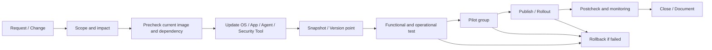

# Master Image Management Guide

## 0. Document Control

| Trường | Giá trị |
|---|---|
| Thứ tự | 12 |
| Tên tài liệu | Master Image Management Guide |
| Tên file | 12_Master_Image_Management_Guide.md |
| Mục đích tài liệu | Hướng dẫn quản trị master image, cập nhật OS, application, agent, security tool, snapshot, publish image, kiểm thử image và rollback khi phát sinh lỗi. |
| Nguồn điều khiển | [[sources/vdi-training-idea]], [[sources/vdi-documentation-list-context]] |
| Trạng thái | Bản đào tạo vận hành. Version, image pipeline, naming convention, test group, snapshot policy, rollback method và owner thực tế là Need Customer Confirmation. |

### 0.1 Source Grounding

| Nội dung | Nguồn sử dụng | Mức độ tin cậy | Ghi chú |
|---|---|---|---|
| Bối cảnh hai hệ thống VDI: Omnissa Horizon trên HCI và Citrix CVAD trên XenServer hoặc VMware ESXi, quy mô 1500 đến hơn 2000 VDI | [[sources/vdi-training-idea]] | High | Dùng để đặt master image vào vận hành quy mô lớn. |
| Tên tài liệu, tên file và mục đích | [[sources/vdi-documentation-list-context]] | High | Source of truth cho scope. |
| VM, template, snapshot, datastore và vận hành vSphere/vCenter | [[sources/vmware-vsphere-8-0]], [[sources/vcenter-server-installation-and-setup]], [[concepts/virtual-machine]], [[concepts/snapshot]], [[concepts/vcenter-server]] | High | Dùng để giải thích mốc snapshot, rủi ro datastore và VM lifecycle. |
| Citrix VDA, Delivery Controller, Machine Catalog, Delivery Group và HDX/session dependency | [[sources/citrix-virtual-apps-and-desktops-7-2603]], [[concepts/virtual-delivery-agent]], [[concepts/delivery-group]] | High | Dùng để giải thích image lỗi có thể làm VDA unregistered hoặc session lỗi trong CVAD. |
| Horizon Connection Server, UAG, pool, entitlement và agent/session dependency | [[sources/horizon-8-architecture]], [[sources/understand-and-troubleshoot-horizon-connections]], [[concepts/omnissa-horizon]], [[concepts/connection-server]] | Medium | Dùng ở mức kiến trúc và luồng vận hành; chi tiết image/pool thật cần xác nhận. |

### 0.2 In Scope

- Vai trò của master image/golden image trong VDI quy mô lớn.
- Vòng đời image: chuẩn bị, update OS, update application, update agent, update security tool, snapshot, publish, pilot, rollout và rollback.
- Rủi ro khi image lỗi ảnh hưởng hàng loạt VDI.
- Checklist precheck, test case, postcheck, evidence và escalation.
- Cách phân tích lỗi sau image update: VDI không boot, agent/VDA không đăng ký, login chậm, black screen, app lỗi, security tool chặn, performance giảm.

### 0.3 Out of Scope

- Không thay thế SOP chi tiết theo console Horizon, Citrix Studio, MCS/PVS, Instant Clone hoặc công cụ HCI cụ thể.
- Không tự giả định khách hàng dùng Instant Clone, Linked Clone, Full Clone, MCS, PVS hoặc phương án clone cụ thể nếu chưa xác nhận.
- Không cung cấp lệnh phá hủy hoặc thao tác production thiếu change approval.
- Không quyết định policy bảo mật, patch exception hoặc application compatibility thay cho customer owner.
- Không thay thế tài liệu Patch and Upgrade Guide; tài liệu này tập trung vào image như một artifact rollout cho VDI.

## 1. Tài liệu này giúp engineer làm được gì

Master image là "nguồn giống" dùng để tạo hoặc cập nhật nhiều desktop/session host. Trong môi trường 1500 đến hơn 2000 VDI, image không còn là một VM riêng lẻ. Nó là điểm hội tụ của OS, application, agent, security tool, policy baseline, profile dependency, driver/tool và các cấu hình giúp máy đăng ký với broker.

Engineer đọc xong cần làm được:

- Hiểu master image là gì và vì sao thay đổi image có blast radius lớn.
- Biết các bước chuẩn trong vòng đời image từ request đến rollback.
- Biết kiểm tra gì trước khi publish image.
- Biết test image như một user thật, không chỉ kiểm tra VM boot được.
- Biết dấu hiệu image lỗi thường xuất hiện ở lớp nào.
- Biết khi nào phải dừng rollout và rollback.
- Biết evidence cần lưu để RCA và cải tiến image pipeline.

## 2. Khái niệm nền tảng

### 2.1 Master image và golden image

Trong vận hành VDI, master image hoặc golden image là image chuẩn đã được cài hệ điều hành, application, agent, security tool, cấu hình nền và tối ưu hóa cần thiết. Từ image này, nền tảng VDI tạo hoặc cập nhật nhiều desktop VM/session host.

Điểm quan trọng: user không làm việc trực tiếp trên master image. User làm việc trên desktop/session được sinh ra hoặc cập nhật từ image. Vì vậy, lỗi nhỏ trong image có thể nhân rộng thành lỗi hàng loạt.

### 2.2 Image không chỉ là Windows patch

Một image có thể chứa:

- OS patch và configuration baseline.
- Application nghiệp vụ.
- Citrix VDA hoặc Horizon Agent.
- Hypervisor tools hoặc driver liên quan.
- Security agent như antivirus/EDR/DLP nếu có.
- Browser, runtime, middleware.
- Certificate, trusted root hoặc cấu hình kết nối nếu có.
- Policy baseline hoặc local setting cần thiết.
- Optimization cho VDI.

Nếu chỉ kiểm tra "Windows boot được" thì chưa đủ. Image phải được kiểm tra theo login, registration, launch, application, profile, policy, printing/clipboard nếu liên quan và monitoring.

### 2.3 Snapshot không phải backup dài hạn

Snapshot là mốc trạng thái của VM tại một thời điểm. Nó hữu ích trước khi cập nhật hoặc làm base cho publish image. Nhưng snapshot để lâu có thể làm datastore tăng trưởng, ảnh hưởng hiệu năng và làm quy trình rollback rối.

Nguyên tắc đào tạo:

- Snapshot là rollback point ngắn hạn hoặc mốc publish, không phải backup dài hạn.
- Snapshot cần naming convention rõ.
- Snapshot cũ cần được dọn theo policy.
- Không rollback nhầm snapshot khi không biết snapshot đó thuộc change nào.

### 2.4 Publish image

Publish image là đưa image mới vào pool/catalog/delivery mechanism để các desktop/session host mới hoặc hiện có sử dụng. Tùy nền tảng, publish có thể gắn với snapshot, template, catalog, pool, provisioning scheme hoặc mechanism khác. Chi tiết thật của khách hàng là Need Customer Confirmation.

Điểm vận hành: publish image không kết thúc ở việc bấm publish. Nó chỉ kết thúc khi postcheck chứng minh user có thể đăng nhập, resource hoạt động, agent/VDA registered, app chạy được và monitoring không có trend xấu.

## 3. Vòng đời master image

Vòng đời này phải có điểm dừng. Nếu test fail, không publish. Nếu pilot fail, không rollout rộng. Nếu postcheck phát hiện lỗi diện rộng, rollback theo kế hoạch.

## 4. Thành phần chính và vai trò

| Thành phần | Vai trò trong master image | Phụ thuộc vào | Nếu lỗi sẽ thấy gì | Engineer cần kiểm tra | Evidence cần lưu |
|---|---|---|---|---|---|
| Master image VM | Nơi cập nhật OS/app/agent/security tool | Hypervisor, datastore, network, domain, tool/driver | Image không boot, update fail, snapshot fail | VM state, disk, NIC, domain, event log | VM name, snapshot, change ID, screenshot |
| OS baseline | Nền chạy desktop/session | Patch, domain, GPO, driver, security baseline | Boot chậm, login fail, app lỗi | Patch level, services, event log, GPO | Patch list, event log, test result |
| Application | Ứng dụng user dùng | Runtime, license, backend, profile, firewall | App crash, launch chậm, thiếu plugin | App version, launch test, dependency | App test evidence, error log |
| Horizon Agent | Agent cho Horizon desktop/session | Connection Server, DNS, firewall, protocol, image compatibility | Agent unreachable, desktop unavailable, black screen | Agent service, registration, broker connectivity | Agent log, pool state, registration trend |
| Citrix VDA | Agent cho Citrix session | Delivery Controller, DNS, firewall, machine identity, VDA version | VDA unregistered, launch fail, HDX issue | VDA service, registration, machine catalog | VDA log, registration state |
| Security tool | AV/EDR/DLP hoặc control endpoint nếu có | Management server, policy, exclusions, network | Login chậm, app bị chặn, high CPU, registration fail | Agent health, policy, quarantine/block event | Security event, policy version |
| Hypervisor tools/driver | Tối ưu VM, network, storage, display | Hypervisor version, OS compatibility | Network/display/storage issue, performance thấp | Tool version, driver status | Tool version, VM metrics |
| Snapshot/version point | Mốc rollback/publish | Datastore capacity, naming, change process | Rollback nhầm, datastore tăng, snapshot chain dài | Snapshot name, age, datastore usage | Snapshot evidence, owner |
| Pool/Catalog | Nhóm desktop nhận image | Broker, provisioning, entitlement, capacity | User nhận image sai, thiếu máy, launch fail | Pool/catalog state, machine count | Pool/catalog status |
| Test/Pilot group | Nhóm xác nhận trước rollout rộng | User mẫu, app owner, helpdesk, monitoring | Lỗi lọt vào production nếu test yếu | Test case, pilot result, ticket trend | Sign-off, test evidence |

## 5. Image update cần quản trị những gì

### 5.1 OS update

OS update có thể sửa lỗi bảo mật nhưng cũng có thể gây xung đột với agent, driver, application hoặc security tool. Không nên coi OS patch trong image là thao tác "Windows Update bình thường".

Precheck:

- Image hiện tại đang dùng cho pool/catalog nào?
- Có snapshot/version point hiện tại không?
- Patch có ảnh hưởng driver, .NET, browser, authentication, printing hoặc protocol không?
- Có maintenance window và pilot không?
- Có rollback point không?

Test sau OS update:

- Boot time.
- Domain login.
- GPO processing.
- Agent/VDA registration.
- Launch desktop/app.
- Profile load.
- Printing/clipboard/USB/drive mapping nếu liên quan.
- Security tool health.
- Performance baseline.

### 5.2 Application update

Application update thường gây lỗi khó thấy nếu chỉ login test. Cần có app owner hoặc user đại diện xác nhận workflow.

Test nên gồm:

- Mở app.
- Login vào app nếu có backend.
- Mở file/dữ liệu mẫu.
- In, export, copy/paste nếu app cần.
- Kiểm tra plugin/add-in.
- Kiểm tra license.
- Kiểm tra network/backend endpoint nếu app phụ thuộc.

Nếu app có dữ liệu nghiệp vụ nhạy cảm, không dùng dữ liệu thật trong evidence trừ khi quy trình cho phép.

### 5.3 Agent update

Agent là cầu nối giữa desktop/session và broker. Với Citrix là VDA; với Horizon là Horizon Agent. Nếu agent lỗi, VM có thể boot bình thường nhưng user vẫn không vào được.

Rủi ro agent update:

- VDA/Agent không registered.
- Broker không nhận máy.
- Protocol/display issue.
- Black screen.
- Session launch fail.
- USB/clipboard/printer behavior thay đổi.
- Incompatibility với OS patch hoặc hypervisor tools.

Postcheck bắt buộc:

- Registration state.
- Launch session.
- Reconnect/disconnect.
- Basic display/audio/clipboard/printer nếu policy cho phép.
- Broker log hoặc dashboard.

### 5.4 Security tool update

Security tool có thể ảnh hưởng mạnh tới VDI:

- Scan lúc logon làm login chậm.
- Chặn agent/VDA service hoặc broker communication.
- Chặn app nghiệp vụ.
- Tăng CPU/memory.
- Tạo lock trên profile/container.
- Chặn script hoặc driver cần thiết.

Engineer không tự tạo exclusion nếu không có security approval. Cần thu evidence và phối hợp security owner.

### 5.5 Optimization và cleanup

Image thường cần cleanup trước snapshot/publish:

- Xóa file tạm không cần thiết.
- Đảm bảo service cần thiết ở trạng thái đúng.
- Kiểm tra pending reboot.
- Kiểm tra Windows activation/licensing theo policy.
- Kiểm tra domain join hoặc preparation state tùy quy trình.
- Kiểm tra agent/broker configuration.
- Đảm bảo không lưu credential, file cá nhân, log nhạy cảm hoặc dữ liệu test không phù hợp trong image.

Chi tiết optimization cần theo vendor/customer baseline, không tự tối ưu quá mức vì có thể làm hỏng application hoặc agent.

## 6. Quy trình vận hành master image

### 6.1 Request và scope

Trước khi chạm vào image, cần trả lời:

- Vì sao cần update image?
- Update cho OS, app, agent, security tool hay nhiều thành phần cùng lúc?
- Image này đang cấp cho pool/catalog nào?
- Có bao nhiêu VDI/session host bị ảnh hưởng?
- User group nào bị ảnh hưởng?
- Có yêu cầu rollback trong bao lâu?
- Ai sign-off test?

Nếu một change cập nhật cả OS, agent và security tool, rủi ro tăng mạnh. Nên tách change nếu có thể.

### 6.2 Precheck

- Xác nhận image hiện tại, version, snapshot, owner.
- Xác nhận pool/catalog đang sử dụng image.
- Kiểm tra datastore capacity và snapshot policy.
- Kiểm tra health broker, agent/VDA registration, session baseline.
- Kiểm tra monitoring hiện tại không có incident nền.
- Xác nhận maintenance window.
- Xác nhận rollback point.
- Xác nhận test case và pilot group.
- Lưu evidence trạng thái trước change.

### 6.3 Update

Thực hiện update theo phạm vi đã duyệt:

- OS patch.
- Application update.
- Agent/VDA/Horizon Agent update.
- Hypervisor tools/driver nếu có.
- Security tool update.
- Configuration baseline.

Sau từng nhóm thay đổi, cần reboot/test cơ bản nếu thay đổi yêu cầu. Không nên gom quá nhiều thay đổi rồi mới test vì sẽ khó tìm nguyên nhân khi lỗi.

### 6.4 Snapshot/version point

Snapshot cần có tên rõ:

- Ngày giờ.
- Change ID.
- Nội dung chính.
- Người thực hiện hoặc owner.
- Trạng thái: pre-update, post-update, candidate, approved.

Ví dụ naming concept: `IMG-WIN10-VDI-20260522-CHG12345-agent-update-candidate`. Đây chỉ là ví dụ, naming thật cần khách hàng xác nhận.

### 6.5 Test

Test image phải mô phỏng người dùng thật:

- Boot VM.
- Login bằng user test.
- Agent/VDA registered.
- Desktop/app launch.
- Profile load.
- GPO applied.
- App nghiệp vụ chạy.
- Printer/clipboard/drive mapping theo policy.
- Monitoring không có alert bất thường.
- Log không có lỗi critical mới.

### 6.6 Pilot

Pilot là bước giảm rủi ro trước rollout diện rộng:

- Chọn nhóm user nhỏ nhưng đại diện.
- Có app owner hoặc business user xác nhận.
- Theo dõi ticket trong pilot window.
- Không rollout rộng nếu pilot chưa sign-off.
- Lưu kết quả pilot vào change/ticket.

### 6.7 Publish và rollout

Publish cần kiểm soát theo đợt nếu platform cho phép:

- Publish cho pool/catalog nhỏ trước.
- Theo dõi registration, failed session, login duration, app error.
- Mở rộng theo batch.
- Có điểm dừng nếu metric xấu.
- Không publish vào thời điểm peak nếu không có yêu cầu khẩn cấp.

### 6.8 Postcheck và close

- Xác nhận số máy nhận image đúng.
- Xác nhận agent/VDA registration ổn định.
- Test login/launch.
- Kiểm tra failed session trend.
- Kiểm tra CPU/memory/storage/network nếu image có tác động hiệu năng.
- Kiểm tra ticket trend 24-48 giờ nếu cần.
- Ghi kết quả vào change.
- Cập nhật image inventory/KB.

## 7. Horizon và Citrix: điểm khác nhau cần nhớ

| Nội dung | Omnissa Horizon | Citrix CVAD | Ý nghĩa vận hành |
|---|---|---|---|
| Agent | Horizon Agent | Citrix VDA | Agent lỗi có thể làm desktop không nhận session dù VM boot được. |
| Broker/control | Connection Server | Delivery Controller | Image phải giúp máy đăng ký đúng broker/controller. |
| Resource container | Desktop pool/application pool | Machine Catalog/Delivery Group/Application Group | Publish image sai resource có thể ảnh hưởng sai nhóm user. |
| Access dependency | UAG nếu external, protocol/display path | Citrix Gateway/StoreFront nếu external, HDX/ICA | Image lỗi đôi khi chỉ lộ khi launch session. |
| Hypervisor | HCI/vCenter theo bối cảnh | XenServer hoặc VMware ESXi theo bối cảnh | Snapshot/template/publish workflow phụ thuộc hypervisor/provisioning. |
| Evidence | Pool state, agent registration, connection/session logs | Catalog/DG state, VDA registration, Director/Studio/logs nếu có | Cần dùng đúng console/log theo nền tảng. |

Thông tin clone/provisioning cụ thể của khách hàng là Unknown. Không được giả định họ dùng công nghệ nào nếu chưa xác nhận.

## 8. Test case tối thiểu cho image

| Nhóm test | Cần kiểm tra | Dấu hiệu pass | Evidence |
|---|---|---|---|
| Boot | VM khởi động bình thường | Không lỗi boot, service chính chạy | Screenshot/VM state |
| Domain | Login domain, DNS, time sync | Login thành công, không lỗi trust/time | Event/log, timestamp |
| Agent/VDA | Registration với broker | Registered/Available | Dashboard/log |
| Session launch | User mở desktop/app | Launch thành công | Screenshot/session ID |
| Profile | Profile attach/load | Không profile temp, login time bình thường | Profile log/login duration |
| GPO/Policy | Policy áp đúng | GPO/policy expected | gpresult hoặc evidence tương đương nếu được phép |
| Application | App nghiệp vụ chạy | Workflow chính pass | App owner sign-off |
| Printing | Printer theo policy | Printer hiện/in được nếu scope yêu cầu | Print test |
| Clipboard/drive/USB | Device/data policy | Hành vi đúng policy | Test result |
| Security tool | Agent healthy, không block sai | Không quarantine/block bất thường | Security console/event nếu có |
| Performance | CPU/memory/login duration | Không xấu hơn baseline đáng kể | Monitoring metric |
| Rollback | Có thể quay lại image trước | Rollback point rõ | Snapshot/version evidence |

Không phải mọi image đều cần test tất cả app, nhưng những app nằm trong nhóm business-critical phải có test case và owner xác nhận.

## 9. Operational Tasks

### Task 1: Chuẩn bị image update

**Mục đích:** Đảm bảo change có phạm vi, rollback và test rõ.

**Khi thực hiện:** Trước mọi update OS/app/agent/security tool trên master image.

**Precheck:**

- Xác định image hiện tại và pool/catalog liên quan.
- Xác định số lượng VDI/session host ảnh hưởng.
- Kiểm tra snapshot/version point.
- Kiểm tra datastore capacity.
- Kiểm tra health hiện tại của broker/registration/session.

**Evidence:** Image version, pool/catalog mapping, snapshot, dashboard health, change approval.

**Escalation:** Thiếu rollback, thiếu owner, ảnh hưởng production ngoài phạm vi hoặc không rõ image đang dùng ở đâu.

### Task 2: Cập nhật và kiểm thử agent/VDA

**Mục đích:** Đảm bảo desktop/session đăng ký được với broker sau update.

**Khi thực hiện:** Khi cập nhật Horizon Agent, Citrix VDA hoặc dependency liên quan.

**Precheck:**

- Kiểm tra version compatibility theo vendor/customer matrix.
- Kiểm tra broker/controller health.
- Chuẩn bị test user/resource.

**Expected evidence:** Agent/VDA version, registration state, launch test, log nếu lỗi.

**Rủi ro:** VDI hàng loạt unregistered hoặc launch fail.

**Escalation:** Registration fail nhiều máy, black screen diện rộng, hoặc cần rollback image.

### Task 3: Publish image theo pilot

**Mục đích:** Giảm rủi ro trước rollout lớn.

**Khi thực hiện:** Sau khi image candidate pass test cơ bản.

**Precheck:**

- Pilot group đã xác nhận.
- Rollback point rõ.
- Monitoring/ticket theo dõi sẵn.

**Expected evidence:** Pilot result, user sign-off, session metrics, failed session trend.

**Rủi ro:** Pilot không đại diện hoặc lỗi lọt vào production.

**Escalation:** Pilot fail, app critical lỗi, login duration tăng mạnh, agent/VDA registration giảm.

### Task 4: Rollback image

**Mục đích:** Khôi phục nhanh khi image mới gây lỗi.

**Khi thực hiện:** Khi postcheck/pilot phát hiện lỗi ngoài phạm vi chấp nhận.

**Precheck:**

- Xác định image/snapshot trước thay đổi.
- Xác định pool/catalog đã nhận image mới.
- Thông báo owner và người xác nhận.

**Expected evidence:** Rollback action, image version after rollback, registration/session recovery.

**Rủi ro:** Rollback nhầm snapshot hoặc không đồng bộ giữa image và desktop đã provisioned.

**Escalation:** Không rõ rollback point, ảnh hưởng dữ liệu/user, hoặc nền tảng không cho rollback đơn giản.

## 10. Lỗi thường gặp và hướng xử lý

| Triệu chứng | Nguyên nhân có thể | Lớp cần kiểm tra | Evidence cần thu thập | Cách kiểm tra | Hướng xử lý | Khi nào escalation |
|---|---|---|---|---|---|---|
| Nhiều VDI unregistered sau image update | Agent/VDA lỗi, broker address sai, DNS/time sync, firewall, security tool chặn | Agent/Broker/Identity/Security | Image version, registration trend, agent log, event log, recent change | So sánh máy image cũ/mới, kiểm tra service, DNS, broker connectivity | Dừng rollout, pilot lại, rollback nếu diện rộng | Ảnh hưởng nhiều pool/catalog hoặc không rõ nguyên nhân |
| Desktop boot fail | OS patch lỗi, driver/tool lỗi, disk issue, snapshot sai | OS/Hypervisor/Storage | VM console, boot error, snapshot, datastore | Boot console, event/recovery log, compare snapshot | Rollback image/snapshot, giữ evidence | Boot fail hàng loạt |
| Login rất chậm sau image mới | Security scan, GPO, profile, service startup, app init | OS/Security/Profile/Identity/Storage | Login duration, event log, profile log, security event | So sánh image cũ/mới, test user mẫu | Tối ưu hoặc rollback thành phần gây chậm | Login chậm diện rộng/vượt SLA |
| Black screen sau launch | Agent/display protocol, driver, tools, GPU/display setting, security tool | Agent/Protocol/Driver/Security | Session log, agent log, version, VM metrics | Test internal/external, app/desktop, compare version | Rollback agent/driver nếu chứng minh liên quan | Nhiều user hoặc sau agent update |
| App critical không chạy | App update lỗi, thiếu runtime, license, backend, security block | Application/Security/Network | App error, event log, version, user workflow | Test app case, compare backend/license | Rollback app hoặc sửa dependency qua owner | Business-critical impact |
| Printer/clipboard/USB thay đổi hành vi | Agent/VDA update, policy conflict, driver/channel change | Policy/Agent/Session channel | Policy value, test result, agent version | Test trên image cũ/mới, kiểm tra policy applied | Adjust policy hoặc rollback agent nếu cần | Cần security approval hoặc nhiều user |
| Security tool high CPU | Scan policy, new version bug, missing exclusion, definition update | Security/OS/Performance | CPU metric, security event, process detail | Correlate login/boot time và process | Escalate security owner; không tự tạo exclusion | CPU cao diện rộng |
| Snapshot/datastore tăng nhanh | Snapshot giữ lâu, chain nhiều, publish không dọn | Storage/Hypervisor | Snapshot list, datastore usage, change ID | Kiểm tra tuổi/kích thước snapshot | Dọn theo policy sau xác nhận | Datastore gần đầy hoặc không rõ snapshot owner |
| User nhận image sai | Publish sai pool/catalog, batch nhầm, entitlement/resource mapping | Broker/Provisioning | Pool/catalog mapping, image version per machine, change evidence | Kiểm tra resource mapping và machine version | Dừng rollout, rollback đúng nhóm | Ảnh hưởng nhầm business group |

Không được khẳng định "do image" nếu chưa có correlation với change, image version, log hoặc so sánh image cũ/mới.

## 11. Scenario Based Learning

### Scenario 1: Sau cập nhật VDA, nhiều máy Citrix unregistered

**Bối cảnh:** Sau maintenance window, nhiều desktop trong cùng Machine Catalog không còn available.

**Câu hỏi cho học viên:**

- Bạn kiểm tra agent, broker hay hypervisor trước?
- Evidence nào chứng minh lỗi liên quan image?
- Khi nào phải rollback?

**Gợi ý phân tích:** Vì lỗi xuất hiện sau update và tập trung cùng catalog, cần kiểm tra image version, VDA service, Controller connectivity, DNS/time sync, security event và registration trend.

**Hướng xử lý đề xuất:** Dừng rollout, giữ image mới ở phạm vi nhỏ, so sánh máy image cũ/mới, thu VDA log. Nếu nhiều user không launch được và chưa có fix nhanh, rollback.

**Evidence cần lưu:** Change ID, image version, catalog, registration dashboard, VDA log, rollback action.

### Scenario 2: OS patch làm login chậm đầu giờ

**Bối cảnh:** Image mới pass boot test nhưng sau publish, user mất 5-7 phút để vào desktop.

**Câu hỏi cho học viên:**

- Vì sao boot test không đủ?
- Metric nào cần so sánh với image cũ?
- Lớp nào có thể gây login chậm?

**Gợi ý phân tích:** Login chậm có thể do GPO, profile, security scan, service startup, storage latency hoặc DC latency. Cần login duration và timestamp.

**Hướng xử lý đề xuất:** Correlate login duration, profile log, GPO processing, security tool event và storage metric. Dừng rollout nếu trend xấu.

**Evidence cần lưu:** Login duration, user sample, image version, monitoring metric, event/security logs.

### Scenario 3: App nghiệp vụ lỗi sau application update

**Bối cảnh:** App mở được nhưng chức năng in/export bị lỗi, chỉ sau image mới.

**Câu hỏi cho học viên:**

- Test case image ban đầu thiếu gì?
- Cần app owner tham gia ở bước nào?
- Rollback app hay rollback image?

**Gợi ý phân tích:** App test không chỉ là mở app. Cần test workflow nghiệp vụ chính, print/export, plugin, backend và license.

**Hướng xử lý đề xuất:** Thu app error, xác định version, so sánh image cũ/mới, hỏi app owner. Nếu impact rộng và chưa có fix, rollback image hoặc app theo plan.

**Evidence cần lưu:** App version, screenshot lỗi, workflow fail, user group, app owner sign-off hoặc reject.

### Scenario 4: Security tool chặn Horizon Agent

**Bối cảnh:** Sau update security tool trên image, Horizon desktop boot được nhưng agent unreachable.

**Câu hỏi cho học viên:**

- Có được tự thêm exclusion không?
- Evidence nào cần gửi security team?
- Nếu security owner chưa phản hồi, có nên rollout tiếp?

**Gợi ý phân tích:** Security tool có thể chặn service, process hoặc network. Không tự bypass security control. Dừng rollout và escalation.

**Hướng xử lý đề xuất:** Thu agent log, security event, process/service status, timestamp và change ID. Escalate security/platform owner. Rollback nếu production impact.

**Evidence cần lưu:** Security block event, agent log, image version, affected pool, rollback decision.

## 12. Hands On hoặc bài tập tư duy

### Bài tập 1: Thiết kế test case image

Tạo test case cho một image mới gồm OS patch, agent update và browser update. Tối thiểu phải có:

- Login test.
- Agent/VDA registration.
- Launch desktop.
- Profile load.
- App critical.
- Printing/clipboard nếu thuộc scope.
- Monitoring metric.
- Rollback criteria.

### Bài tập 2: Phân loại lỗi sau image

Cho triệu chứng "VDI boot được nhưng user không launch được", hãy liệt kê 6 lớp cần kiểm tra và evidence tương ứng.

### Bài tập 3: Rollout plan

Thiết kế rollout theo batch cho 2000 VDI:

- Pilot bao nhiêu user?
- Batch theo pool/catalog hay theo business group?
- Metric nào là stop condition?
- Ai sign-off?
- Khi nào rollback?

### Bài tập 4: RCA image incident

Một image mới gây login chậm. Hãy viết RCA skeleton gồm timeline, change, impact, evidence, probable cause, corrective action và prevention.

## 13. Knowledge Check

### Câu 1

**Master image khác desktop VM người dùng thế nào?**

**Đáp án:** Master image là nguồn chuẩn dùng để tạo/cập nhật nhiều desktop/session; user không làm việc trực tiếp trên đó.

### Câu 2

**Vì sao image update có rủi ro lớn trong VDI quy mô lớn?**

**Đáp án:** Vì một lỗi trong image có thể được nhân rộng tới hàng trăm hoặc hàng nghìn VDI.

### Câu 3

**Snapshot có phải backup dài hạn không?**

**Đáp án:** Không. Snapshot là mốc tạm thời/rollback ngắn hạn; để lâu có thể làm tăng datastore và ảnh hưởng hiệu năng.

### Câu 4

**Agent/VDA lỗi sau image update có thể gây triệu chứng gì?**

**Đáp án:** Máy unregistered, launch fail, agent unreachable, black screen hoặc session disconnect.

### Câu 5

**Test image chỉ cần boot VM thành công có đủ không?**

**Đáp án:** Không. Cần test login, registration, launch, profile, app, policy/session feature và monitoring.

### Câu 6

**Khi nào nên dừng rollout image?**

**Đáp án:** Khi pilot fail, registration giảm, failed session tăng, app critical lỗi, login duration tăng mạnh hoặc impact vượt phạm vi duyệt.

### Câu 7

**Security tool chặn app hoặc agent thì engineer có nên tự tạo exclusion không?**

**Đáp án:** Không. Cần evidence và approval từ security owner.

### Câu 8

**Evidence tối thiểu cho rollback image là gì?**

**Đáp án:** Change ID, image version trước/sau, affected pool/catalog, triệu chứng, metric/log, quyết định rollback, kết quả sau rollback.

### Câu 9

**Vì sao cần pilot group?**

**Đáp án:** Để phát hiện lỗi trên nhóm nhỏ trước khi image lan rộng vào production.

### Câu 10

**Nếu không biết khách hàng dùng MCS, PVS, Instant Clone hay clone khác thì phải ghi gì?**

**Đáp án:** Ghi Unknown hoặc Need Customer Confirmation, không giả định quy trình publish cụ thể.

## 14. Hiểu nhầm thường gặp

| Hiểu nhầm | Vì sao sai | Cách nghĩ đúng |
|---|---|---|
| Image update chỉ là Windows patch | Image còn gồm app, agent, security tool, driver, policy và tối ưu VDI. | Quản trị image như artifact production. |
| VM boot được nghĩa là image tốt | User có thể vẫn fail ở login, registration, profile, app hoặc policy. | Test theo end-to-end user workflow. |
| Snapshot là backup | Snapshot để lâu có rủi ro datastore/performance. | Dùng snapshot đúng mục đích và dọn theo policy. |
| Publish xong là hoàn tất | Publish chỉ là bước triển khai. | Cần postcheck, monitoring và ticket trend. |
| Agent update ít rủi ro | Agent là cầu nối broker-session. | Agent update cần compatibility và registration test. |
| Rollback luôn đơn giản | Có thể phụ thuộc clone/provisioning, snapshot, pool/catalog và trạng thái desktop. | Rollback phải được thiết kế trước change. |

## 15. Checklist vận hành

### 15.1 Precheck

- [ ] Xác định image name/version hiện tại.
- [ ] Xác định pool/catalog/Delivery Group liên quan.
- [ ] Xác định số lượng VDI/session host ảnh hưởng.
- [ ] Xác định nội dung update: OS, app, agent, security tool, driver.
- [ ] Xác nhận owner và approval.
- [ ] Kiểm tra broker/agent/session baseline trước change.
- [ ] Kiểm tra datastore capacity và snapshot state.
- [ ] Xác nhận rollback point.
- [ ] Chuẩn bị test case và pilot group.
- [ ] Lưu evidence trước change.

### 15.2 Trong quá trình update

- [ ] Cập nhật theo nhóm thay đổi có kiểm soát.
- [ ] Reboot khi cần và kiểm tra service.
- [ ] Ghi version trước/sau.
- [ ] Không để pending reboot trước snapshot/publish.
- [ ] Không lưu dữ liệu test hoặc credential trong image.
- [ ] Chụp snapshot/version point với tên rõ.
- [ ] Thực hiện test cơ bản trước pilot.

### 15.3 Postcheck

- [ ] Agent/VDA registered.
- [ ] User test login được.
- [ ] Desktop/app launch được.
- [ ] Profile load bình thường.
- [ ] App critical pass.
- [ ] Không có alert mới bất thường.
- [ ] Failed session không tăng.
- [ ] Login duration không xấu hơn baseline đáng kể.
- [ ] Pilot sign-off.
- [ ] Update inventory/KB/change record.

### 15.4 Evidence cần lưu

- [ ] Change ID.
- [ ] Image version trước/sau.
- [ ] Snapshot/version point.
- [ ] Pool/catalog mapping.
- [ ] Test result.
- [ ] Pilot sign-off.
- [ ] Monitoring screenshot/metric.
- [ ] Log lỗi nếu có.
- [ ] Rollback evidence nếu rollback.

## 16. Monitoring and Evidence

Khi rollout image, theo dõi tối thiểu:

- VDI registered/unregistered.
- VDA/Horizon Agent registration state.
- Failed session hoặc launch failure.
- Login duration.
- Profile loading time.
- CPU/memory trên desktop/session host.
- Storage latency và datastore capacity.
- Network error nếu session protocol lỗi.
- Security tool events.
- Application error trend.
- Ticket trend theo pool/catalog.

Metric cần so sánh với baseline trước change. Một con số cao chưa đủ kết luận; cần correlation với thời điểm publish, image version và phạm vi ảnh hưởng.

## 17. Change, Risk and Rollback

### 17.1 Thay đổi nào cần change

- OS patch trong image.
- Application update.
- Agent/VDA/Horizon Agent update.
- Security tool update.
- Hypervisor tools/driver update.
- Policy/local baseline change trong image.
- Publish image cho pool/catalog production.
- Cleanup snapshot có thể ảnh hưởng rollback.

### 17.2 Risk assessment

Đánh giá:

- Số lượng VDI bị ảnh hưởng.
- Business group bị ảnh hưởng.
- App critical trong image.
- Khả năng rollback.
- Thời gian rollout.
- Khả năng giám sát sau rollout.
- Owner sign-off.

### 17.3 Rollback plan

Rollback plan phải trả lời:

- Rollback về image/snapshot nào?
- Pool/catalog nào cần rollback?
- Desktop đã nhận image mới sẽ xử lý ra sao?
- User đang active session có bị ảnh hưởng không?
- Ai quyết định rollback?
- Postcheck sau rollback là gì?

Không publish image nếu rollback point không rõ.

### 17.4 Stop condition

Dừng rollout khi:

- Registration giảm bất thường.
- Failed session tăng.
- Login duration tăng mạnh.
- App critical fail.
- Security tool block nhiều máy.
- Storage/datastore cảnh báo.
- Ticket tăng theo cùng một pattern.
- Owner yêu cầu dừng.

## 18. Security and Access Control Considerations

- Chỉ người có quyền được phê duyệt mới được sửa master image.
- Tách quyền update image và quyền approve rollout nếu quy trình yêu cầu.
- Không lưu credential, token, private key hoặc dữ liệu nhạy cảm trong image.
- Không disable security tool để test production nếu chưa có approval.
- Không tự thêm exclusion cho AV/EDR/DLP nếu không có security owner.
- Image change phải có audit trail.
- Image repository, snapshot và template phải có quyền truy cập hạn chế.

## 19. Need Customer Confirmation

| Nhóm | Câu hỏi cần xác nhận | Vì sao cần |
|---|---|---|
| Image technology | Horizon/Citrix đang dùng Instant Clone, Full Clone, MCS, PVS, template hay cơ chế khác? | Quy trình publish/rollback phụ thuộc công nghệ. |
| Image inventory | Danh sách master image hiện có, version, owner, pool/catalog mapping là gì? | Tránh cập nhật nhầm image. |
| Naming convention | Quy tắc đặt tên image, snapshot, version và change ID là gì? | Truy vết và rollback. |
| Test process | Ai là user/app owner test, test case chuẩn là gì? | Đảm bảo image pass nghiệp vụ thật. |
| Pilot strategy | Pilot group, pilot duration và sign-off criteria là gì? | Giảm rủi ro rollout rộng. |
| Rollback method | Rollback image thực hiện bằng cách nào trên từng nền tảng? | Không thể chờ tới incident mới nghĩ rollback. |
| Snapshot policy | Snapshot giữ bao lâu, ai dọn, ngưỡng datastore là gì? | Tránh tăng trưởng datastore. |
| Agent compatibility | Matrix version Horizon Agent/Citrix VDA với broker và OS là gì? | Tránh registration/session lỗi. |
| Security tool | AV/EDR/DLP nào đang chạy, owner và exception process là gì? | Xử lý block/performance đúng thẩm quyền. |
| Monitoring | Dashboard nào theo dõi registration, failed session, login duration, app error? | Postcheck rollout. |
| Change process | Image update thuộc loại change nào, cần approval nào? | Kiểm soát production. |
| SLA/escalation | Khi image lỗi diện rộng, escalation path và SLA là gì? | Phản ứng nhanh khi blast radius lớn. |

## 20. Related Wiki Links

### Source pages

- [[sources/vdi-training-idea]]
- [[sources/vdi-documentation-list-context]]
- [[sources/vmware-vsphere-8-0]]
- [[sources/vcenter-server-installation-and-setup]]
- [[sources/citrix-virtual-apps-and-desktops-7-2603]]
- [[sources/horizon-8-architecture]]
- [[sources/understand-and-troubleshoot-horizon-connections]]

### Concept pages

- [[concepts/virtual-machine]]
- [[concepts/snapshot]]
- [[concepts/vcenter-server]]
- [[concepts/vmware-vsphere]]
- [[concepts/esxi]]
- [[concepts/xenserver]]
- [[concepts/datastore]]
- [[concepts/storage-repository]]
- [[concepts/virtual-delivery-agent]]
- [[concepts/delivery-controller]]
- [[concepts/delivery-group]]
- [[concepts/omnissa-horizon]]
- [[concepts/connection-server]]
- [[concepts/lifecycle-management]]
- [[concepts/monitoring-and-logs]]
- [[concepts/change-management]]

### Topic pages nên đọc tiếp

- [[topics/7_Hypervisor_and_HCI_Operations_Guide]]: hiểu VM, host, datastore và snapshot dependency.
- [[topics/8_Storage_Operations_for_VDI]]: hiểu rủi ro datastore, latency và snapshot growth.
- [[topics/13_Citrix_Machine_Catalog_and_Delivery_Group_Guide]]: hiểu image gắn với Machine Catalog/Delivery Group trong CVAD.
- [[topics/14_Omnissa_Desktop_Pool_and_Entitlement_Guide]]: hiểu image gắn với desktop pool trong Horizon.
- [[topics/15_VDI_Monitoring_and_Alerting_Guide]]: theo dõi registration, failed session và login duration sau rollout.
- [[topics/20_VDI_Change_Management_Guide]]: quản trị image update như production change.
- [[topics/21_VDI_Patch_and_Upgrade_Guide]]: đi sâu patch/upgrade component.
- [[topics/22_VDI_Backup_and_Recovery_Guide]]: hiểu backup/recovery liên quan image.

## 21. Summary for Learners

Master image là một trong những điểm rủi ro lớn nhất của VDI. Một image tốt giúp rollout nhất quán; một image lỗi có thể làm hàng loạt desktop không đăng ký, login chậm, app lỗi hoặc user không launch được.

Thứ tự kiểm tra khi xử lý sự cố sau image update:

1. Xác định image version và change ID.
2. Xác định pool/catalog/user group bị ảnh hưởng.
3. So sánh máy image mới và image cũ.
4. Kiểm tra agent/VDA registration.
5. Kiểm tra login, profile, app và security tool.
6. Kiểm tra hypervisor/storage nếu có boot/performance issue.
7. Dừng rollout nếu impact tăng.
8. Rollback nếu lỗi diện rộng hoặc không có fix nhanh.
9. Lưu evidence và cập nhật KB/RCA.

Điều engineer cần nhớ: publish image không phải là thao tác kỹ thuật đơn lẻ. Nó là một change production có test, pilot, monitoring, rollback và owner rõ ràng.

