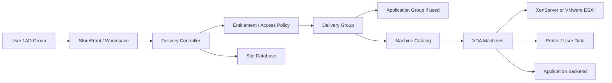
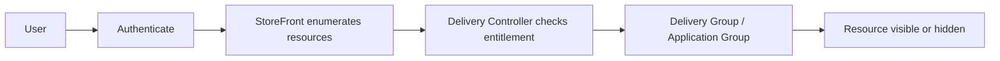
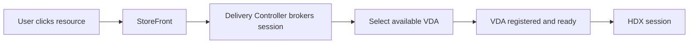

# Citrix Machine Catalog and Delivery Group Guide

## 0. Document Control

| Trường | Giá trị |
|---|---|
| Thứ tự | 13 |
| Tên tài liệu | Citrix Machine Catalog and Delivery Group Guide |
| Tên file | 13_Citrix_Machine_Catalog_and_Delivery_Group_Guide.md |
| Mục đích tài liệu | Giải thích cách quản trị Machine Catalog, Delivery Group, Application Group, entitlement, VDA registration và các tình huống vận hành thường gặp trong CVAD. |
| Nguồn điều khiển | [[sources/vdi-training-idea]], [[sources/vdi-documentation-list-context]] |
| Trạng thái | Bản đào tạo vận hành. Citrix version, provisioning method, catalog design, Delivery Group mapping, Application Group policy, naming convention, SLA và owner thực tế là Need Customer Confirmation. |

### 0.1 Source Grounding

| Nội dung | Nguồn sử dụng | Mức độ tin cậy | Ghi chú |
|---|---|---|---|
| Bối cảnh khách hàng có hệ thống Citrix CVAD quy mô 1500 đến hơn 2000 VDI, hypervisor có thể là XenServer hoặc VMware ESXi | [[sources/vdi-training-idea]] | High | Dùng để đặt Catalog/DG vào vận hành quy mô lớn. |
| Tên tài liệu, tên file và mục đích | [[sources/vdi-documentation-list-context]] | High | Source of truth cho scope tài liệu này. |
| Kiến trúc CVAD: Delivery Controller, StoreFront, Site Database, VDA, machine resource, user access, configuration data, HDX/ICA | [[sources/citrix-virtual-apps-and-desktops-7-2603]] | High | Dùng làm nền giải thích Machine Catalog, Delivery Group và VDA registration. |
| VDA, Delivery Controller, Delivery Group, StoreFront, HDX, ICA virtual channel, machine identity | [[concepts/virtual-delivery-agent]], [[concepts/delivery-controller]], [[concepts/delivery-group]], [[concepts/storefront]], [[concepts/hdx]], [[concepts/ica-virtual-channel]], [[concepts/machine-identity]] | Medium | Concept đã ingest trong wiki; chi tiết môi trường thật cần xác nhận. |
| Hypervisor nền cho CVAD có thể là XenServer hoặc VMware ESXi/vSphere | [[sources/xenserver-8-4]], [[sources/vmware-vsphere-8-0]], [[concepts/xenserver]], [[concepts/vmware-vsphere]], [[concepts/esxi]] | Medium | Dùng để nhắc dependency, không giả định nền tảng thật. |

### 0.2 In Scope

- Giải thích Machine Catalog, Delivery Group, Application Group, entitlement và VDA registration theo góc nhìn vận hành.
- Chỉ ra mối quan hệ giữa user, AD group, StoreFront, Delivery Controller, Catalog, Delivery Group, VDA và hypervisor.
- Hướng dẫn triage các lỗi: user không thấy desktop/app, launch fail, VDA unregistered, không đủ máy available, user bị gán sai resource, app không hiển thị, session không phân phối đúng.
- Cung cấp checklist cho cấp phát, mở rộng, thu hồi và kiểm tra trạng thái resource trong CVAD.
- Nêu evidence cần lưu trước khi escalation hoặc change.

### 0.3 Out of Scope

- Không thay thế tài liệu kiến trúc CVAD tổng thể; xem [[topics/4_Citrix_CVAD_Architecture_Overview]].
- Không đi sâu toàn bộ provisioning/image workflow; xem [[topics/12_Master_Image_Management_Guide]] và [[topics/11_VDI_Provisioning_and_Allocation_Guide]].
- Không giả định khách hàng dùng MCS, PVS, manual provisioning, Citrix Cloud hay on-premises Site khi chưa xác nhận.
- Không cung cấp thao tác xóa máy, reset catalog, publish image hoặc change production thiếu approval.
- Không yêu cầu secret, password, token hoặc credential.

## 1. Tài liệu này giúp engineer làm được gì

Trong Citrix CVAD, Machine Catalog và Delivery Group là hai khái niệm rất dễ bị nhầm:

- Machine Catalog trả lời câu hỏi: "Những máy nào có thể được quản lý và cấp phát?"
- Delivery Group trả lời câu hỏi: "Những máy hoặc app nào được phân phối cho user nào?"

Application Group bổ sung thêm cách nhóm và quản trị published applications. Entitlement quyết định user hoặc AD group nào được thấy resource trên StoreFront/Workspace. VDA registration quyết định máy có sẵn sàng nhận session hay không.

Sau khi học xong, engineer cần làm được:

- Đọc được đường đi từ user đến resource trong CVAD.
- Phân biệt lỗi "không thấy resource" với lỗi "thấy resource nhưng launch fail".
- Biết kiểm tra Catalog, Delivery Group, Application Group, entitlement và VDA registration theo thứ tự.
- Hiểu machine availability, maintenance mode, power state, registration state và user assignment ảnh hưởng vận hành thế nào.
- Biết evidence cần thu thập trước khi escalation tới Citrix platform, identity, hypervisor, storage, network hoặc application owner.

## 2. Mô hình tư duy CVAD cho Catalog và Delivery Group

Điểm cần nhớ:

- StoreFront hiển thị resource cho user dựa trên thông tin từ Delivery Controller và entitlement.
- Delivery Controller broker session và chọn máy phù hợp.
- Delivery Group là lớp phân phối resource cho user.
- Machine Catalog là nhóm máy có cùng đặc điểm quản trị/provisioning.
- VDA phải registered và available thì mới nhận session ổn định.
- Hypervisor, storage, network, AD/DNS và profile vẫn có thể làm Catalog/DG "trông đúng" nhưng session vẫn fail.

## 3. Core Concepts

### 3.1 Machine Catalog

Machine Catalog là tập hợp máy được CVAD quản lý. Các máy trong cùng catalog thường có cùng loại OS, provisioning method, image/base, hypervisor connection hoặc mục đích vận hành.

Engineer cần đọc Catalog để biết:

- Có bao nhiêu machine.
- Machine đang registered hay unregistered.
- Machine đang powered on/off hay unknown.
- Machine có ở maintenance mode không.
- Machine thuộc image/provisioning batch nào nếu có.
- Machine có đủ cho nhu cầu concurrent session không.

Không nên xem Catalog chỉ là "danh sách máy". Nó là nơi nhìn sức khỏe tài nguyên máy trước khi Delivery Group phân phối cho user.

### 3.2 Delivery Group

Delivery Group là lớp quyết định machine/app nào được đưa cho user nào. Một Delivery Group có thể cung cấp desktop, app hoặc cả hai tùy thiết kế.

Engineer cần đọc Delivery Group để biết:

- Resource này phục vụ user group nào.
- Có bao nhiêu máy available.
- Có bao nhiêu session active/disconnected.
- Có máy nào đang maintenance mode không.
- Có policy hoặc access rule nào áp riêng không.
- Delivery Group có đang bị disable hoặc thiếu capacity không.

### 3.3 Application Group

Application Group dùng để nhóm published applications và kiểm soát cách ứng dụng được phân phối. Không phải môi trường nào cũng dùng Application Group theo cùng một cách.

Engineer cần hỏi:

- App được publish trực tiếp từ Delivery Group hay qua Application Group?
- AD group nào được thấy app?
- App phụ thuộc backend nào?
- App có giới hạn user, location, policy hay tag không?

### 3.4 Entitlement

Entitlement là quyền user/AD group được thấy và dùng resource. Một lỗi entitlement thường biểu hiện như:

- User login được StoreFront nhưng không thấy desktop/app.
- User thấy sai resource.
- User mới được thêm group nhưng chưa thấy resource.
- Một nhóm user mất app sau thay đổi AD group hoặc Delivery Group.

Điểm đào tạo: entitlement issue không giống launch issue. Nếu user không thấy resource, hãy kiểm tra entitlement, AD group, StoreFront enumeration và Delivery Group mapping trước khi kiểm tra VDA.

### 3.5 VDA registration

VDA registration là trạng thái máy VDA đăng ký thành công với Delivery Controller. Nếu VDA unregistered, Controller thường không thể broker session tới máy đó.

VDA unregistered có thể do:

- VDA service lỗi.
- Delivery Controller không reachable.
- DNS lỗi.
- Time sync/domain trust issue.
- Firewall/port bị chặn.
- Machine account hoặc AD issue.
- Image/agent update lỗi.
- Security tool chặn.
- Hypervisor/power state bất thường.

Không nên chỉ reboot VDA khi unregistered. Reboot có thể là mitigation, nhưng RCA cần kiểm tra dependency.

## 4. Thành phần chính và vai trò

| Thành phần | Vai trò | Phụ thuộc vào | Ảnh hưởng khi lỗi | Engineer cần kiểm tra | Evidence cần lưu |
|---|---|---|---|---|---|
| StoreFront / Workspace entry | Hiển thị resource cho user | Delivery Controller, auth, certificate, network | User login được/không được, không thấy app/desktop | Resource enumeration, user, auth path | Screenshot user view, timestamp |
| Delivery Controller | Broker session, đọc config, chọn VDA | Site DB, AD, DNS, VDA, hosting connection | Launch fail, resource không enumerate, VDA registration issue | Service health, failed session, controller events | Controller log/event, failed session ID |
| Site Database | Lưu cấu hình Site | SQL/DB HA, network, permissions | Controller mất cấu hình hoặc hoạt động gián đoạn | DB connectivity, service health | DB alert/log nếu có |
| Machine Catalog | Tập hợp máy được quản lý | Provisioning, image, hypervisor, AD machine identity | Thiếu máy, máy sai image, unregistered hàng loạt | Machine count, power/registration state, image/provisioning info | Catalog status, machine list |
| Delivery Group | Phân phối desktop/app cho user | Catalog, entitlement, policy, capacity | User không thấy resource, launch fail, thiếu available machines | DG enabled, associated catalog, users/groups, sessions | DG config/status |
| Application Group | Nhóm published apps | Delivery Group, app path, user assignment, backend | App không hiện, app launch fail, app sai nhóm | App assignment, command/path, user group | App config, error screenshot |
| VDA Machine | Nhận session người dùng | Controller, DNS, AD, firewall, image, profile, hypervisor | Unregistered, launch fail, black screen, app lỗi | VDA service, registration, event log, machine state | VDA log/event, VM state |
| AD Group/User | Nền entitlement | AD, group membership, replication, identity process | User không thấy hoặc thấy sai resource | Group membership, effective access | AD group evidence |
| Hosting Connection | Kết nối tới hypervisor | vCenter/ESXi hoặc XenServer, credentials/scope, network | Power action fail, provisioning fail, machine state sai | Hosting connection health, task failure | Task log, connection alert |
| Profile/App backend | Nơi dữ liệu/app chạy | Storage, network, permissions, backend service | Login chậm, app mở nhưng lỗi | Profile load, backend reachability | Profile/app logs |

## 5. Luồng user thấy và launch resource

### 5.1 User không thấy resource

Khi user không thấy desktop/app:

1. Xác định user login vào đúng StoreFront/URL không.
2. Xác định user thuộc AD group nào.
3. Kiểm tra resource được gán cho user/group nào.
4. Kiểm tra Delivery Group/Application Group có enabled không.
5. Kiểm tra resource có bị filter theo access policy, tag, location hoặc condition nào không.
6. Kiểm tra thay đổi AD group/entitlement gần đây.
7. Chỉ kiểm tra VDA sau khi resource visibility đã đúng.

### 5.2 User thấy resource nhưng launch fail

Khi user thấy resource nhưng launch fail:

1. Kiểm tra failed session trên Controller/monitoring.
2. Kiểm tra Delivery Group còn machine available không.
3. Kiểm tra VDA registration state.
4. Kiểm tra machine power state và maintenance mode.
5. Kiểm tra hosting connection nếu power/provisioning fail.
6. Kiểm tra network/protocol path nếu external/internal khác nhau.
7. Kiểm tra recent image/policy/security change.

## 6. Quản trị Machine Catalog

### 6.1 Engineer cần đọc gì trong Catalog

- Catalog name và naming convention.
- Machine type hoặc OS type.
- Provisioning method nếu có.
- Số lượng machine total/available/unregistered.
- Machine power state.
- Machine registration state.
- Maintenance mode.
- Image/base version nếu nền tảng hiển thị.
- Associated Delivery Group.
- Hosting connection/hypervisor liên quan.

### 6.2 Các tác vụ thường gặp

| Tác vụ | Mục đích | Precheck | Evidence | Rủi ro |
|---|---|---|---|---|
| Kiểm tra machine availability | Biết Catalog có đủ máy sẵn sàng không | Xác định Catalog/DG đúng | Machine count, registered/unregistered | Nhầm Catalog dẫn tới kết luận sai |
| Kiểm tra unregistered machines | Khoanh vùng launch failure | Recent image/network/AD change | Registration trend, VDA logs | Reboot hàng loạt làm mất evidence |
| Đưa máy vào maintenance mode | Ngăn máy nhận session khi xử lý | Xác nhận không có active session hoặc đã thông báo | Machine state before/after | Làm thiếu capacity nếu áp quá rộng |
| Mở rộng số máy | Bổ sung capacity | Capacity, storage, hypervisor, license, image | Request, machine count, postcheck | Provisioning sai image hoặc thiếu tài nguyên |
| Thu hồi/remove machine | Dọn máy không dùng hoặc lỗi | Xác nhận assignment/session/data impact | Approval, machine identity, task log | Xóa nhầm máy còn user/session |

### 6.3 Vận hành Catalog quy mô lớn

Ở quy mô 1500 đến hơn 2000 VDI, không nên xử lý Catalog bằng cách nhìn từng máy rời rạc. Cần nhìn theo pattern:

- Một vài máy unregistered: ưu tiên machine-level issue.
- Nhiều máy cùng Catalog unregistered sau image update: nghi image/agent/security tool.
- Nhiều máy trên cùng host/storage lỗi: nghi hypervisor/storage.
- Nhiều máy across Catalog lỗi đăng ký: nghi Controller/DNS/AD/network.
- Machine available giảm dần theo ngày: nghi capacity, stuck session, power management hoặc provisioning.

## 7. Quản trị Delivery Group và Application Group

### 7.1 Delivery Group cần kiểm tra gì

- Delivery Group enabled hay disabled.
- Associated Machine Catalog.
- Desktop/app được publish từ DG nào.
- User/AD group được gán.
- Machine availability.
- Session count.
- Maintenance mode ở machine hoặc DG nếu có.
- Policy áp theo DG.
- Access rule, tag hoặc filter nếu có.

### 7.2 Application Group cần kiểm tra gì

- App name user nhìn thấy.
- App executable/path/command line nếu được quản trị tại đây.
- Associated Delivery Group.
- User/AD group assignment.
- App visibility.
- Policy hoặc tag/filter nếu có.
- App backend dependency.

### 7.3 Entitlement và AD group

Entitlement là nơi rất dễ gây lỗi khi onboarding user hoặc thay đổi tổ chức.

Checklist:

- User account active không.
- User thuộc đúng AD group không.
- AD group đó được gán vào Delivery Group/Application Group không.
- Có nested group không và nền tảng có đọc nested group theo kỳ vọng không.
- Có AD replication delay không.
- User đã sign out/in lại hoặc resource enumeration refresh chưa.
- Có policy/filter khác chặn resource không.

Không nên thêm user trực tiếp vào nhiều resource nếu quy trình chuẩn là qua AD group. Cần giữ mô hình quản trị nhất quán.

## 8. VDA Registration Deep Dive

### 8.1 Registration state nói gì

| Trạng thái | Ý nghĩa vận hành | Hướng kiểm tra |
|---|---|---|
| Registered | VDA đã đăng ký với Controller | Có thể nhận session nếu DG/capacity/policy cho phép |
| Unregistered | VDA chưa đăng ký hoặc mất đăng ký | Kiểm tra VDA service, Controller, DNS, AD, firewall, image/security |
| Unknown | Controller không có trạng thái rõ hoặc mất liên lạc | Kiểm tra network, power state, monitoring/Controller |
| In maintenance | Máy không nhận session mới | Kiểm tra lý do maintenance, owner, change |
| Powered off | Máy không chạy | Kiểm tra power management/hosting connection/hypervisor |

### 8.2 Nguyên nhân VDA unregistered

- VDA service không chạy.
- Controller address/list sai.
- DNS không resolve Controller.
- Time sync lệch.
- Domain trust hoặc machine account lỗi.
- Firewall/port bị chặn.
- Security tool chặn process/network.
- Image update làm agent lỗi.
- Hosting connection không đọc đúng power state.
- VM trên host/storage/network đang lỗi.

### 8.3 Evidence cần có trước escalation

- Catalog và Delivery Group.
- Machine name.
- Registration state.
- Power state.
- Time window.
- Recent change.
- VDA version nếu có.
- Controller liên quan nếu biết.
- VDA event/log.
- DNS/time/domain evidence nếu nghi identity.
- Hypervisor task/VM state nếu nghi hạ tầng.

## 9. Quy trình vận hành thường gặp

### 9.1 Cấp quyền user vào desktop/app

1. Xác định request hợp lệ và approval.
2. Xác định resource: desktop, published app hoặc application group.
3. Xác định AD group chuẩn.
4. Kiểm tra Delivery Group/Application Group đang gán group nào.
5. Thêm user vào group theo quy trình identity hoặc gửi identity team nếu không thuộc quyền.
6. Kiểm tra resource enumeration.
7. Test launch nếu cần.
8. Lưu evidence: request, approval, group, resource, result.

### 9.2 Kiểm tra thiếu capacity

1. Xác định Delivery Group bị ảnh hưởng.
2. Kiểm tra total/available machines.
3. Kiểm tra active/disconnected sessions.
4. Kiểm tra unregistered/maintenance/powered off machines.
5. Kiểm tra hosting connection nếu power action fail.
6. Kiểm tra license hoặc provisioning limit nếu có.
7. Đề xuất mở rộng capacity qua change nếu cần.

### 9.3 Đưa máy lỗi ra khỏi phục vụ

1. Xác định machine và active session.
2. Lưu evidence lỗi trước.
3. Nếu có user đang dùng, xử lý theo SLA/thông báo.
4. Đưa machine vào maintenance mode nếu được phép.
5. Troubleshoot VDA/OS/hypervisor.
6. Chỉ remove/recreate machine nếu có approval và hiểu impact.

### 9.4 Mở rộng Machine Catalog

1. Xác nhận nhu cầu capacity.
2. Xác nhận image/provisioning method.
3. Xác nhận hypervisor/storage/network capacity.
4. Xác nhận naming convention và AD computer account process.
5. Tạo/mở rộng theo change.
6. Kiểm tra machine power, domain, VDA registration.
7. Gắn vào Delivery Group nếu cần.
8. Postcheck user launch/session.

## 10. Lỗi thường gặp và hướng xử lý

| Triệu chứng | Nguyên nhân có thể | Lớp cần kiểm tra | Evidence cần thu thập | Cách kiểm tra | Hướng xử lý | Khi nào escalation |
|---|---|---|---|---|---|---|
| User login được nhưng không thấy desktop/app | Thiếu entitlement, sai AD group, DG/App Group disabled, StoreFront enumeration issue | Entitlement/DG/App Group/AD | User, AD group, resource name, screenshot, recent change | Kiểm tra group assignment, DG/App Group visibility, StoreFront view | Sửa assignment theo approval hoặc chuyển identity/platform | Ảnh hưởng nhiều user hoặc không rõ policy/filter |
| User thấy resource nhưng launch fail | Không có VDA available, VDA unregistered, machine powered off, protocol path lỗi | DG/Catalog/VDA/Hypervisor/Network | Failed session, DG availability, VDA state, machine power | Kiểm tra failed session, available machines, VDA registration | Khôi phục VDA/capacity hoặc rollback recent change | Nhiều user/DG hoặc after image change |
| Nhiều VDA unregistered cùng Catalog | Image/agent/security update lỗi, DNS/AD/network, Controller reachability | Catalog/VDA/Identity/Network | Registration trend, image/change ID, VDA logs | So sánh máy cũ/mới, kiểm tra service/DNS/time | Dừng rollout, rollback image hoặc xử lý dependency | Diện rộng hoặc không có fix nhanh |
| Không đủ machine available | Capacity thiếu, machine maintenance, powered off, unregistered, stuck sessions | DG/Catalog/Hypervisor | Machine count, session count, maintenance list | Kiểm tra available/unregistered/powered off | Giải phóng session, bật máy, mở rộng capacity qua change | Thiếu capacity ảnh hưởng business |
| User nhận sai desktop/app | Sai AD group, sai DG/App Group assignment, direct assignment cũ | Entitlement/Governance | User groups, resource mapping, approval | So sánh expected vs actual assignment | Sửa mapping theo quy trình | Có rủi ro access sai dữ liệu |
| App không launch nhưng desktop OK | App path lỗi, backend app down, permission, App Group config, policy | Application/App Group/Backend | App name, error, user, backend dependency | Test app bằng user mẫu, kiểm tra event/app log | Chuyển app owner nếu backend/app lỗi | App critical hoặc nhiều user |
| Power action fail | Hosting connection, hypervisor permission, host/storage issue | Hosting/Hypervisor | Task error, hosting connection status, VM state | Kiểm tra hosting connection và hypervisor task | Chuyển hypervisor owner nếu ngoài CVAD | Power action fail nhiều máy |
| Máy stuck maintenance mode | Quên remove maintenance, change chưa close, machine đang lỗi | Operations/DG/Catalog | Machine list, owner, change/ticket | Kiểm tra reason và active incident/change | Gỡ maintenance nếu được phép và máy healthy | Không rõ owner hoặc impact capacity |
| New user chưa thấy resource sau khi thêm group | AD replication/cache, user chưa refresh session, wrong group | AD/Entitlement/StoreFront | Time added, group, user screenshot | Kiểm tra group membership và refresh enumeration | Chờ replication hoặc sửa group đúng | Nhiều user onboarding lỗi |

## 11. Checklist cho engineer

### 11.1 Khi user không thấy resource

- [ ] Lấy username, resource expected, thời điểm, screenshot.
- [ ] Xác định user dùng StoreFront/Workspace path nào.
- [ ] Kiểm tra AD group membership.
- [ ] Kiểm tra Delivery Group/Application Group assignment.
- [ ] Kiểm tra resource enabled/visible.
- [ ] Kiểm tra recent entitlement/group change.
- [ ] Không xử lý VDA trước khi xác nhận resource visibility.
- [ ] Lưu evidence và chuyển identity/platform nếu vượt quyền.

### 11.2 Khi user launch fail

- [ ] Xác định resource user đã thấy và bấm launch.
- [ ] Lấy failed session/error/timestamp.
- [ ] Kiểm tra Delivery Group có machine available không.
- [ ] Kiểm tra VDA registration.
- [ ] Kiểm tra machine power state.
- [ ] Kiểm tra maintenance mode.
- [ ] Kiểm tra recent image/policy/network/security change.
- [ ] Nếu external-only, liên hệ access/gateway/network path.

### 11.3 Khi nhiều VDA unregistered

- [ ] Khoanh vùng theo Catalog, Delivery Group, host, subnet, image version.
- [ ] Kiểm tra recent change.
- [ ] Kiểm tra Controller reachability, DNS, time, domain trust.
- [ ] Kiểm tra VDA service/log.
- [ ] Kiểm tra security tool event.
- [ ] Kiểm tra hypervisor power/host/storage nếu cùng cụm.
- [ ] Dừng rollout nếu liên quan image mới.
- [ ] Escalate kèm evidence.

### 11.4 Evidence cần lưu

- [ ] User/resource/timestamp.
- [ ] StoreFront screenshot hoặc error.
- [ ] AD group evidence.
- [ ] Delivery Group/Application Group config liên quan.
- [ ] Machine Catalog status.
- [ ] VDA registration state.
- [ ] Machine power/maintenance state.
- [ ] Failed session/log/event.
- [ ] Change ID nếu có.

## 12. Monitoring and Evidence

Các chỉ số cần theo dõi cho Catalog/DG:

- Total machines.
- Available machines.
- Registered/unregistered VDAs.
- Machines in maintenance mode.
- Powered off/unknown machines.
- Active/disconnected sessions.
- Failed session count.
- Launch failure trend.
- Resource enumeration complaints.
- Delivery Controller service health.
- Site Database connectivity.
- Hosting connection task failure.
- Login duration nếu nghi profile/GPO/app.
- Ticket trend theo Catalog/DG.

Điểm quan trọng là theo dõi theo nhóm: theo Catalog, Delivery Group, image version, host cluster, subnet hoặc business group. Ở quy mô lớn, chỉ nhìn tổng số toàn Site có thể che mất lỗi cục bộ.

## 13. Change, Risk and Rollback

### 13.1 Những thay đổi cần kiểm soát

- Tạo mới hoặc xóa Machine Catalog.
- Thêm/xóa số lượng lớn machine.
- Gán hoặc gỡ Delivery Group khỏi Catalog.
- Thay user/AD group entitlement.
- Thay Application Group hoặc app publish.
- Đưa nhiều machine vào maintenance mode.
- Thay image/base của Catalog.
- Thay policy áp theo Delivery Group.
- Thay hosting connection hoặc hypervisor mapping.

### 13.2 Precheck

- Xác định Catalog/DG/App Group bị thay đổi.
- Xác định số lượng user/machine/session ảnh hưởng.
- Xác nhận approval và owner.
- Export/chụp cấu hình hiện tại nếu có thể.
- Kiểm tra health hiện tại: Controller, DB, VDA registration, capacity.
- Xác định rollback: group cũ, DG mapping cũ, app assignment cũ, image cũ.

### 13.3 Rollback

Rollback cần đưa cấu hình về trạng thái trước:

- AD group/entitlement trước thay đổi.
- Delivery Group/Application Group assignment trước thay đổi.
- Machine maintenance state trước thay đổi.
- Image/catalog mapping trước thay đổi.
- Machine count hoặc batch trước thay đổi nếu khả thi.

Không rollback bằng cách thêm nhiều cấu hình mới nếu chưa hiểu vì sao change lỗi.

### 13.4 Stop condition

Dừng change khi:

- User không thấy resource sau thay đổi entitlement.
- Launch failure tăng.
- VDA unregistered tăng.
- Machine availability giảm mạnh.
- App critical lỗi.
- Security/access risk phát sinh.
- Không xác định được rollback point.

## 14. Security and Access Control Considerations

- Entitlement là quyền truy cập resource; thay đổi sai có thể cấp app/desktop cho sai người.
- Nên dùng AD group chuẩn thay vì gán user trực tiếp tùy tiện.
- Helpdesk nên có quyền xem và hỗ trợ theo SOP, không nhất thiết có quyền sửa DG/Catalog.
- Platform admin thay Catalog/DG/App Group phải có change và audit.
- Thao tác remove machine, xóa assignment, thay image hoặc thay group diện rộng cần approval.
- Không ghi password, token, secret hoặc thông tin nhạy cảm vào ticket/evidence.
- Audit log cần trả lời ai thay entitlement, thay lúc nào, trên resource nào và theo change nào.

## 15. Scenario Based Learning

### Scenario 1: User không thấy published app

**Bối cảnh:** User mới vào bộ phận kế toán login StoreFront được nhưng không thấy app kế toán.

**Câu hỏi cho học viên:**

- Kiểm tra VDA trước có đúng không?
- Evidence nào cần lấy từ user và identity?
- App nằm ở Delivery Group hay Application Group?

**Gợi ý phân tích:** User không thấy resource là vấn đề enumeration/entitlement trước. Cần kiểm tra AD group, Application Group/DG assignment và recent onboarding.

**Hướng xử lý đề xuất:** Thu screenshot, xác định expected app, kiểm tra group membership và app assignment. Nếu cần thêm quyền, làm theo approval.

**Evidence cần lưu:** User, AD group, app name, assignment, approval, screenshot sau khi resource hiện.

### Scenario 2: Nhiều desktop trong một Catalog unregistered

**Bối cảnh:** Sau cập nhật image đêm qua, một Catalog có 40% máy unregistered.

**Câu hỏi cho học viên:**

- Pattern này gợi ý machine-level hay catalog/image-level?
- Nên reboot hàng loạt không?
- Escalation cần evidence nào?

**Gợi ý phân tích:** Lỗi tập trung theo Catalog sau image change gợi ý image/VDA/security/DNS dependency. Reboot hàng loạt có thể mất evidence và không giải quyết root cause.

**Hướng xử lý đề xuất:** Dừng rollout, lấy registration trend, VDA log, image version, event/security log, so sánh máy image cũ/mới, rollback nếu impact lớn.

**Evidence cần lưu:** Catalog, machine list, change ID, image version, VDA logs, dashboard trước/sau rollback.

### Scenario 3: User thấy desktop nhưng launch fail

**Bối cảnh:** Một nhóm user thấy desktop trên StoreFront nhưng bấm vào thì lỗi launch.

**Câu hỏi cho học viên:**

- Vì sao đây không phải lỗi entitlement đầu tiên?
- Kiểm tra Delivery Group hay Machine Catalog trước?
- Khi nào kiểm tra hypervisor?

**Gợi ý phân tích:** Resource đã visible nên entitlement cơ bản có thể đúng. Tiếp theo kiểm tra failed session, DG availability, VDA registration, power/maintenance state và protocol path.

**Hướng xử lý đề xuất:** Lấy failed session, kiểm tra available machines trong DG, trạng thái VDA, power state. Nếu power action fail hoặc nhiều máy off, chuyển hypervisor owner.

**Evidence cần lưu:** Error, failed session, DG machine availability, VDA state, VM power state.

### Scenario 4: App hiện sai cho user

**Bối cảnh:** User ngoài nhóm finance thấy app finance sau khi thay đổi Application Group.

**Câu hỏi cho học viên:**

- Đây là incident security hay chỉ ticket access?
- Cần dừng thay đổi gì?
- Evidence nào cần giữ?

**Gợi ý phân tích:** Cấp sai app là access control issue. Cần xử lý như sự cố phân quyền, không chỉ chỉnh UI.

**Hướng xử lý đề xuất:** Thu evidence assignment, xác định nhóm bị ảnh hưởng, rollback entitlement/App Group change, thông báo owner/security nếu có rủi ro dữ liệu.

**Evidence cần lưu:** User, app, group assignment trước/sau, audit/change ID, screenshot.

## 16. Hands On hoặc bài tập tư duy

### Bài tập 1: Vẽ resource path

Vẽ đường đi từ AD group đến published app trong CVAD, gồm StoreFront, Delivery Controller, Application Group, Delivery Group, Machine Catalog và VDA.

### Bài tập 2: Phân loại lỗi

Phân loại các ticket sau vào nhóm entitlement, launch, VDA registration, capacity hoặc application backend:

- "Tôi login được nhưng không thấy app."
- "Tôi thấy desktop nhưng bấm vào báo lỗi."
- "Nhiều máy trong Catalog unregistered."
- "App mở lên nhưng báo lỗi kết nối database."
- "Không còn máy available trong Delivery Group."

### Bài tập 3: Tạo evidence package

Tạo checklist evidence trước khi escalation một lỗi launch fail diện rộng trong một Delivery Group.

### Bài tập 4: Change review

Đọc một change giả định thay AD group cho Application Group. Chỉ ra precheck, rollback, security risk và postcheck còn thiếu.

## 17. Knowledge Check

### Câu 1

**Machine Catalog trả lời câu hỏi vận hành nào?**

**Đáp án:** Catalog cho biết nhóm máy nào được CVAD quản lý, trạng thái máy, provisioning/image/hypervisor liên quan và nguồn capacity cho Delivery Group.

### Câu 2

**Delivery Group khác Machine Catalog thế nào?**

**Đáp án:** Catalog là nhóm máy; Delivery Group là lớp phân phối desktop/app từ các máy đó tới user/group.

### Câu 3

**User không thấy app thì kiểm tra VDA registration trước có hợp lý không?**

**Đáp án:** Thường không. Cần kiểm tra entitlement, AD group, Application Group/Delivery Group và StoreFront enumeration trước.

### Câu 4

**User thấy desktop nhưng launch fail thì kiểm tra gì?**

**Đáp án:** Failed session, Delivery Group availability, VDA registration, machine power state, maintenance mode, hosting connection và protocol path.

### Câu 5

**VDA unregistered có thể do những lớp nào?**

**Đáp án:** VDA service, Controller reachability, DNS, AD/time sync, firewall, image/agent update, security tool, hypervisor/power state.

### Câu 6

**Vì sao không nên gán user trực tiếp tùy tiện vào resource?**

**Đáp án:** Dễ làm mất kiểm soát access, khó audit và lệch chuẩn vận hành; nên dùng AD group/approval chuẩn.

### Câu 7

**Machine maintenance mode ảnh hưởng gì?**

**Đáp án:** Máy thường không nhận session mới, có thể làm giảm available capacity nếu áp quá rộng hoặc quên gỡ.

### Câu 8

**Khi nhiều VDA cùng Catalog unregistered sau image update, hướng xử lý đầu tiên là gì?**

**Đáp án:** Dừng rollout, thu evidence registration/log/image version, so sánh image cũ/mới và rollback nếu impact lớn.

### Câu 9

**Power action fail thường cần kiểm tra lớp nào?**

**Đáp án:** Hosting connection, hypervisor, quyền/scope kết nối, host/storage và task log.

### Câu 10

**Thông tin nào là Need Customer Confirmation cho tài liệu này?**

**Đáp án:** CVAD version, provisioning method, Catalog/DG design, App Group usage, AD group model, naming convention, owner, monitoring dashboard, change/rollback process.

## 18. Hiểu nhầm thường gặp

| Hiểu nhầm | Vì sao sai | Cách nghĩ đúng |
|---|---|---|
| Catalog và Delivery Group giống nhau | Catalog là nhóm máy; DG là lớp phân phối resource. | Luôn xác định lỗi nằm ở machine pool hay access/resource mapping. |
| User không thấy app là do VDA lỗi | Nếu resource không hiện, entitlement/enumeration thường là lớp đầu tiên. | Kiểm tra AD group, DG/App Group, StoreFront trước. |
| VDA unregistered chỉ cần reboot | Reboot có thể che mất evidence và không xử lý DNS/AD/image/security root cause. | Thu evidence, tìm pattern rồi mới action. |
| Có nhiều máy total nghĩa là đủ capacity | Máy total không đồng nghĩa available/registered. | Theo dõi available, registered, maintenance và active sessions. |
| Thêm trực tiếp user vào resource nhanh hơn | Nhanh nhưng khó audit, dễ cấp sai. | Dùng AD group và approval chuẩn. |
| Launch fail luôn do Citrix Controller | Có thể do VDA, hypervisor, network, profile, app backend hoặc gateway path. | Triage theo flow và evidence. |

## 19. Need Customer Confirmation

| Nhóm | Câu hỏi cần xác nhận | Vì sao cần |
|---|---|---|
| CVAD version | Khách hàng đang dùng CVAD version/build nào? | Compatibility, console/log behavior và feature khác nhau. |
| Deployment model | On-premises Site, Citrix Cloud hay mô hình lai? | Ảnh hưởng Controller/Cloud Connector/management path. |
| Provisioning method | Machine Catalog dùng MCS, PVS, manual, existing machine hay phương án khác? | Quy trình mở rộng/rollback khác nhau. |
| Hypervisor | Catalog chạy trên XenServer hay VMware ESXi/vCenter? | Kiểm tra power/provisioning/hosting connection đúng nơi. |
| Catalog design | Catalog được chia theo OS, image, business group, location hay workload? | Triage pattern đúng. |
| Delivery Group mapping | DG map với Catalog/user group/app như thế nào? | Xác định resource path. |
| Application Group usage | Có dùng Application Group không, dùng để nhóm app theo mô hình nào? | Tránh kiểm tra thiếu lớp. |
| AD group model | Entitlement dùng AD group nào, nested group có được chấp nhận không? | Xử lý user không thấy resource. |
| Naming convention | Quy tắc đặt tên Catalog, DG, App Group, machine là gì? | Đọc nhanh scope và owner. |
| Monitoring | Dashboard nào theo dõi VDA registration, failed session, DG capacity? | Postcheck và incident triage. |
| Change process | Thay entitlement/DG/Catalog cần change loại nào? | Kiểm soát access và production risk. |
| Rollback | Rollback entitlement, App Group, Catalog expansion hoặc image publish thực hiện ra sao? | Không chờ incident mới thiết kế rollback. |
| Ownership | Owner của Citrix platform, AD group, hypervisor, app, profile, network là ai? | Escalation đúng nhóm. |
| SLA | Sự cố không thấy resource/launch fail/VDA unregistered có SLA nào? | Phân loại incident và ưu tiên xử lý. |

## 20. Related Wiki Links

### Source pages

- [[sources/vdi-training-idea]]
- [[sources/vdi-documentation-list-context]]
- [[sources/citrix-virtual-apps-and-desktops-7-2603]]
- [[sources/xenserver-8-4]]
- [[sources/vmware-vsphere-8-0]]

### Concept pages

- [[concepts/citrix-virtual-apps-and-desktops]]
- [[concepts/delivery-controller]]
- [[concepts/storefront]]
- [[concepts/virtual-delivery-agent]]
- [[concepts/delivery-group]]
- [[concepts/hdx]]
- [[concepts/ica-virtual-channel]]
- [[concepts/machine-identity]]
- [[concepts/vdi-connection-flow]]
- [[concepts/xenserver]]
- [[concepts/vmware-vsphere]]
- [[concepts/esxi]]
- [[concepts/vcenter-server]]
- [[concepts/identity-and-access-management]]
- [[concepts/monitoring-and-logs]]
- [[concepts/change-management]]

### Topic pages nên đọc tiếp

- [[topics/4_Citrix_CVAD_Architecture_Overview]]: bức tranh kiến trúc CVAD đầy đủ.
- [[topics/5_VDI_Access_Flow_Design]]: phân biệt resource enumeration và session launch flow.
- [[topics/6_Identity_and_Domain_Integration_Guide]]: AD group, DNS, domain và identity dependency.
- [[topics/10_VDI_Security_and_Policy_Management_Guide]]: policy, RBAC, audit và access control.
- [[topics/11_VDI_Provisioning_and_Allocation_Guide]]: quy trình cấp phát/mở rộng/thu hồi VDI.
- [[topics/12_Master_Image_Management_Guide]]: image update và VDA registration risk.
- [[topics/15_VDI_Monitoring_and_Alerting_Guide]]: monitoring registration, failed session và capacity.
- [[topics/18_VDI_Troubleshooting_Playbook]]: playbook xử lý lỗi VDI tổng hợp.

## 21. Summary for Learners

Machine Catalog, Delivery Group, Application Group, entitlement và VDA registration là phần lõi để vận hành Citrix CVAD. Khi user gặp lỗi, hãy phân biệt thật rõ:

- Không thấy resource: kiểm tra StoreFront enumeration, entitlement, AD group, Delivery Group và Application Group.
- Thấy resource nhưng launch fail: kiểm tra failed session, Delivery Group availability, VDA registration, machine power, maintenance mode và protocol path.
- Nhiều VDA unregistered: kiểm tra pattern theo Catalog, image, Controller, DNS/AD, network, security tool và hypervisor.
- Thiếu capacity: kiểm tra available machines, sessions, maintenance mode, powered off/unregistered machines và provisioning.
- App lỗi sau launch: kiểm tra Application Group, app config, backend, profile, policy và app owner.

Thứ tự kiểm tra khuyến nghị: user/resource/timestamp -> resource visibility -> entitlement/AD group -> Delivery Group/Application Group -> Machine Catalog capacity -> VDA registration -> machine power/maintenance -> recent change -> hypervisor/storage/network/profile/app dependency -> escalation kèm evidence.

