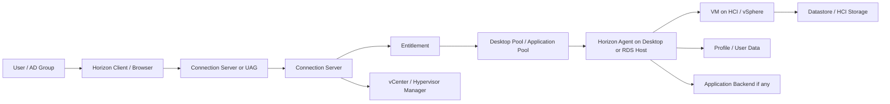
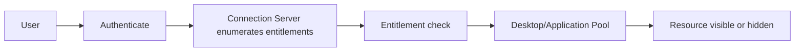
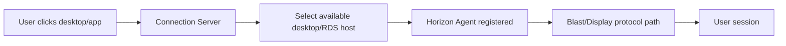

# Omnissa Desktop Pool and Entitlement Guide

## 0. Document Control

| Trường | Giá trị |
|---|---|
| Thứ tự | 14 |
| Tên tài liệu | Omnissa Desktop Pool and Entitlement Guide |
| Tên file | 14_Omnissa_Desktop_Pool_and_Entitlement_Guide.md |
| Mục đích tài liệu | Giải thích cách quản trị desktop pool, application pool, entitlement, Horizon Agent registration, pool availability và các tình huống vận hành thường gặp trong Horizon. |
| Nguồn điều khiển | [[sources/vdi-training-idea]], [[sources/vdi-documentation-list-context]] |
| Trạng thái | Bản đào tạo vận hành. Horizon version, pool type, provisioning method, pod/block topology, entitlement model, naming convention, monitoring dashboard và owner thực tế là Need Customer Confirmation. |

### 0.1 Source Grounding

| Nội dung | Nguồn sử dụng | Mức độ tin cậy | Ghi chú |
|---|---|---|---|
| Bối cảnh khách hàng có hệ thống Omnissa Horizon trên HCI, quy mô 1500 đến hơn 2000 VDI | [[sources/vdi-training-idea]] | High | Dùng để đặt desktop pool và entitlement vào vận hành quy mô lớn. |
| Tên tài liệu, tên file và mục đích | [[sources/vdi-documentation-list-context]] | High | Source of truth cho scope tài liệu này. |
| Kiến trúc Horizon: Connection Server, pod/block, hypervisor manager, Unified Access Gateway, authentication, entitlement và gateway | [[sources/horizon-8-architecture]] | High | Nền tảng để hiểu pool, entitlement và đường đi phiên. |
| Troubleshooting Horizon connection: primary/secondary protocol, internal/external flow, UAG, firewall, certificate, load balancing | [[sources/understand-and-troubleshoot-horizon-connections]] | High | Dùng để phân biệt lỗi thấy resource nhưng session/Blast không vào được. |
| Concepts Horizon, Connection Server, UAG, display protocol, Blast, load balancing và identity | [[concepts/omnissa-horizon]], [[concepts/connection-server]], [[concepts/unified-access-gateway]], [[concepts/display-protocol]], [[concepts/blast-extreme]], [[concepts/load-balancing]], [[concepts/identity-and-access-management]] | Medium | Concept đã có trong wiki; chi tiết vận hành thật cần xác nhận với khách hàng. |
| Hạ tầng dưới Horizon: vCenter, ESXi, datastore, HCI/storage/network | [[sources/vmware-vsphere-8-0]], [[concepts/vcenter-server]], [[concepts/esxi]], [[concepts/datastore]] | Medium | Dùng để nhắc dependency khi pool availability hoặc agent registration lỗi. |

### 0.2 In Scope

- Giải thích desktop pool, application pool, entitlement, Horizon Agent registration và pool availability theo góc nhìn vận hành.
- Chỉ ra luồng từ user/AD group đến resource trong Horizon.
- Hướng dẫn triage các lỗi: user không thấy desktop/app, thấy resource nhưng launch fail, Horizon Agent unreachable/unregistered, pool thiếu máy available, user được gán sai resource, session black screen hoặc external-only failure.
- Cung cấp checklist cho cấp quyền, kiểm tra pool health, xử lý agent registration và thay đổi entitlement/pool.
- Nêu rõ evidence cần lưu trước khi escalation hoặc change.

### 0.3 Out of Scope

- Không thay thế tài liệu kiến trúc Horizon tổng thể; xem [[topics/3_Omnissa_Horizon_Architecture_Overview]].
- Không đi sâu master image hoặc patch agent; xem [[topics/12_Master_Image_Management_Guide]] và [[topics/21_VDI_Patch_and_Upgrade_Guide]].
- Không giả định khách hàng dùng Instant Clone, Full Clone, dedicated/floating pool, RDSH app pool, Horizon Cloud hoặc Cloud Pod Architecture nếu chưa xác nhận.
- Không cung cấp thao tác xóa pool, publish image, reset desktop hàng loạt hoặc thay production entitlement thiếu approval.
- Không yêu cầu secret, password, token hoặc credential.

## 1. Tài liệu này giúp engineer làm được gì

Trong Horizon, desktop pool và application pool là nơi resource được đóng gói để user truy cập. Entitlement quyết định user hoặc AD group nào được thấy resource đó. Horizon Agent registration quyết định desktop/RDS host có đủ sẵn sàng để Connection Server broker session hay không. Pool availability cho biết pool còn đủ máy, đủ trạng thái registered/available và đủ capacity để phục vụ user không.

Sau khi học xong, engineer cần làm được:

- Đọc được đường đi từ user đến desktop/application trong Horizon.
- Phân biệt lỗi "không thấy resource" với lỗi "thấy resource nhưng launch fail".
- Biết kiểm tra entitlement, desktop pool, application pool, Horizon Agent registration và pool availability theo thứ tự.
- Hiểu vì sao agent registration có thể lỗi dù VM vẫn powered on.
- Biết khi nào cần kiểm tra Connection Server, UAG, vCenter/HCI, storage, network, AD/DNS hoặc image.
- Biết evidence cần lưu trước khi escalation hoặc thay đổi pool/entitlement.

## 2. Mô hình tư duy Horizon cho pool và entitlement

Điểm cần nhớ:

- User không thấy resource thường liên quan entitlement, AD group, pool state hoặc resource visibility.
- User thấy resource nhưng launch fail thường liên quan pool availability, Agent registration, protocol path, VM state hoặc hạ tầng.
- External user launch fail nhưng internal user ổn thường cần kiểm tra UAG, firewall, certificate, external URL, load balancer hoặc secondary protocol.
- Pool trông "có máy" chưa chắc có máy available. Cần kiểm tra trạng thái registered/available/maintenance/assigned/powered.

## 3. Core Concepts

### 3.1 Desktop Pool

Desktop pool là tập hợp desktop được Horizon phân phối cho user. Pool có thể được thiết kế theo nhiều mô hình khác nhau, ví dụ dedicated, floating, clone-based hoặc full VM tùy môi trường. Tài liệu này không giả định mô hình cụ thể của khách hàng.

Engineer cần đọc desktop pool để biết:

- Pool enabled hay disabled.
- Pool type và assignment model là gì.
- User/AD group nào được entitlement.
- Có bao nhiêu desktop total/available/assigned.
- Desktop có registered với Connection Server không.
- Desktop có powered on/off hoặc in maintenance không.
- Pool có đủ capacity cho concurrent user không.
- Pool đang dùng image/version/provisioning nào nếu có thông tin.

### 3.2 Application Pool

Application pool là cách Horizon publish ứng dụng cho user. Ứng dụng có thể chạy từ RDS host hoặc mô hình khác tùy thiết kế. Điều engineer cần nắm là user thấy app không có nghĩa app chắc chắn chạy được.

Khi app lỗi, cần phân biệt:

- User không thấy app: entitlement/pool visibility.
- User thấy app nhưng launch fail: broker/agent/RDS host/protocol.
- App mở nhưng chức năng lỗi: application backend, permission, profile, network hoặc app owner.

### 3.3 Entitlement

Entitlement là quyền user hoặc AD group được truy cập desktop pool/application pool. Đây là lớp đầu tiên cần kiểm tra khi user nói "tôi không thấy desktop/app".

Entitlement issue thường xuất hiện khi:

- User mới onboard.
- User đổi phòng ban.
- AD group được thay đổi.
- Pool mới tạo nhưng chưa gán đúng group.
- Có nested group hoặc replication delay.
- User nhìn sai portal/pod/site.

### 3.4 Horizon Agent Registration

Horizon Agent là thành phần trên desktop/RDS host để máy giao tiếp với Horizon. Nếu agent không registered hoặc unreachable, Connection Server có thể không broker session được, dù VM vẫn đang chạy.

Registration có thể bị ảnh hưởng bởi:

- Agent service lỗi.
- Connection Server không reachable.
- DNS hoặc time sync lỗi.
- Domain trust hoặc machine account lỗi.
- Firewall/network path.
- Image/agent update lỗi.
- Security tool chặn agent.
- VM powered off, stuck boot, hoặc hạ tầng HCI/vSphere có vấn đề.

### 3.5 Pool Availability

Pool availability là khả năng pool còn máy sẵn sàng phục vụ user. Một pool có thể thiếu availability vì:

- Nhiều desktop unregistered.
- Nhiều desktop powered off.
- Desktop đang maintenance.
- Desktop đã assigned hết.
- Pool provisioning không tạo đủ máy.
- Image mới lỗi.
- vCenter/HCI/storage/network issue.
- Session disconnected/stale giữ tài nguyên.

## 4. Thành phần chính và vai trò

| Thành phần | Vai trò | Phụ thuộc vào | Ảnh hưởng khi lỗi | Engineer cần kiểm tra | Evidence cần lưu |
|---|---|---|---|---|---|
| Horizon Client/Browser | Điểm user truy cập resource | Client version, DNS, network, certificate trust | Login/launch fail, lỗi chỉ trên một endpoint | Client type, location, error | Screenshot, timestamp, client info |
| Unified Access Gateway | Gateway cho user bên ngoài nếu có | Certificate, firewall, load balancer, Connection Server | External-only login/launch fail, Blast fail | UAG health, external URL, certificate, path | UAG/LB/cert evidence |
| Connection Server | Broker, entitlement, pool selection, session orchestration | AD, DNS, pool config, vCenter, Agent, DB/config | Không thấy resource, launch fail, pool state sai | Service health, events, entitlement, pool status | Event/log, failed launch evidence |
| Desktop Pool | Nhóm desktop phân phối cho user | Entitlement, image/provisioning, vCenter/HCI, Agent | Thiếu resource, sai user, thiếu capacity | Pool enabled, entitlement, machine availability | Pool config/status |
| Application Pool | Nhóm app publish cho user | RDS/app host, entitlement, app path/backend | App không hiện hoặc app launch fail | App pool config, entitlement, host availability | App config/error |
| Horizon Agent | Đăng ký desktop/RDS host với Horizon | Connection Server, DNS, AD, firewall, image, security tool | Agent unreachable/unregistered, launch fail | Agent service, registration, event/log | Agent log/event, registration state |
| vCenter/HCI | Quản lý VM, power, clone, host/storage | ESXi/HCI, datastore, permissions, network | Power/provisioning fail, pool availability giảm | VM power, tasks, host/storage health | vCenter task, VM state |
| AD Group/User | Đầu vào entitlement | AD, group membership, replication, identity process | User không thấy resource hoặc thấy sai resource | Group membership, effective entitlement | AD/group evidence |
| Profile/App backend | Dữ liệu và app nghiệp vụ | Storage, network, permission, backend service | Login chậm, app mở nhưng lỗi | Profile load, app connectivity | Profile/app logs |

## 5. Luồng user thấy và launch resource

### 5.1 User không thấy desktop/app

Khi user không thấy resource:

1. Xác định user login đúng portal/pod/site chưa.
2. Xác định user dùng internal hay external path.
3. Kiểm tra user/AD group membership.
4. Kiểm tra entitlement của desktop pool/application pool.
5. Kiểm tra pool enabled/disabled hoặc hidden policy nếu có.
6. Kiểm tra AD replication hoặc recent identity change.
7. Chỉ chuyển sang kiểm tra agent sau khi resource visibility đã đúng.

### 5.2 User thấy resource nhưng launch fail

Khi user thấy resource nhưng launch fail:

1. Kiểm tra failed launch/session event.
2. Kiểm tra pool còn machine available không.
3. Kiểm tra Horizon Agent registration.
4. Kiểm tra VM power state và maintenance state.
5. Kiểm tra protocol path nếu lỗi khác nhau giữa internal/external.
6. Kiểm tra recent image/agent/security/network change.
7. Kiểm tra vCenter/HCI nếu power/provisioning/task fail.

## 6. Quản trị desktop pool

### 6.1 Engineer cần đọc gì trong pool

- Pool name và naming convention.
- Pool type và assignment model.
- Pool enabled/disabled.
- Entitled user/AD group.
- Total desktops.
- Available desktops.
- Assigned desktops nếu là dedicated/assigned model.
- Registered/unregistered desktops.
- Maintenance state.
- Image/version/provisioning state nếu có.
- vCenter/HCI hoặc datastore liên quan.
- Recent change.

### 6.2 Tác vụ thường gặp

| Tác vụ | Mục đích | Precheck | Evidence | Rủi ro |
|---|---|---|---|---|
| Kiểm tra pool availability | Biết pool có đủ máy phục vụ user không | Xác định đúng pool/user group | Total/available/registered/assigned count | Nhìn total mà bỏ qua available |
| Kiểm tra unregistered desktops | Khoanh vùng launch failure | Recent image/network/AD/security change | Registration trend, agent logs | Reboot hàng loạt mất evidence |
| Đưa desktop vào maintenance | Ngăn desktop nhận session khi xử lý | Active session, user impact, approval | State before/after | Giảm capacity nếu áp quá rộng |
| Mở rộng pool | Bổ sung capacity | HCI/storage/license/image/AD naming | Request, pool count, postcheck | Tạo máy sai image hoặc thiếu resource |
| Thu hồi/disable desktop | Dọn máy lỗi hoặc không dùng | User assignment/data/session impact | Approval, machine info | Ảnh hưởng user nếu sai máy |

### 6.3 Đọc pattern ở quy mô lớn

Ở quy mô 1500 đến hơn 2000 VDI, hãy tìm pattern:

- Một vài desktop unregistered: machine-level issue.
- Nhiều desktop trong cùng pool unregistered sau image update: image/agent/security issue.
- Nhiều pool cùng lỗi launch: Connection Server, AD/DNS, network hoặc infrastructure dependency.
- External-only launch fail: UAG/firewall/certificate/secondary protocol.
- Pool available giảm dần: capacity, assignment, stale session, power management hoặc provisioning issue.

## 7. Quản trị application pool và entitlement

### 7.1 Application pool cần kiểm tra gì

- App name user nhìn thấy.
- Pool/app enabled hay disabled.
- Entitled AD group.
- App host/RDS host availability nếu có.
- Application path/command nếu quản trị tại đây.
- Backend dependency.
- Policy/session control liên quan.

### 7.2 Entitlement checklist

- User account active không.
- User thuộc đúng AD group không.
- AD group đó được entitlement vào desktop/application pool không.
- Có nested group không và Horizon xử lý theo kỳ vọng không.
- User login đúng pod/site/portal không.
- Có Cloud Pod/global entitlement không nếu môi trường dùng CPA? Đây là Need Customer Confirmation.
- Có AD replication delay hoặc cache/resource enumeration issue không.
- Có recent entitlement change không.

### 7.3 Cấp quyền và thu hồi quyền

Khi cấp quyền:

1. Có request và approval.
2. Xác định resource chính xác.
3. Xác định AD group chuẩn.
4. Thực hiện qua quy trình identity/platform được duyệt.
5. Kiểm tra user thấy resource.
6. Test launch nếu scope yêu cầu.
7. Lưu evidence.

Khi thu hồi:

1. Xác nhận user/group/resource cần thu hồi.
2. Kiểm tra active assignment/session nếu có.
3. Xác nhận impact với owner.
4. Thu hồi theo quy trình.
5. Kiểm tra user không còn thấy resource.
6. Lưu audit/evidence.

Không nên cấp trực tiếp cho user nếu mô hình chuẩn là cấp qua AD group, trừ khi quy trình khách hàng cho phép.

## 8. Horizon Agent Registration Deep Dive

### 8.1 Registration state nói gì

| Trạng thái | Ý nghĩa vận hành | Hướng kiểm tra |
|---|---|---|
| Registered/Available | Agent đã liên lạc với Horizon và có thể nhận session nếu pool cho phép | Kiểm tra capacity và entitlement nếu user vẫn lỗi |
| Unregistered/Unreachable | Desktop/RDS host không sẵn sàng nhận session | Kiểm tra Agent, DNS, AD, firewall, Connection Server, image, security |
| Powered off | VM không chạy | Kiểm tra vCenter/HCI power state và power policy |
| In maintenance | Không nhận session mới | Kiểm tra reason, owner, change/ticket |
| Assigned but unavailable | User có assignment nhưng desktop không sẵn sàng | Kiểm tra VM/Agent/power/session state |

Tên trạng thái cụ thể có thể khác theo version/console; cần xác nhận trong môi trường khách hàng.

### 8.2 Nguyên nhân Agent không registered

- Horizon Agent service không chạy.
- Desktop không resolve được Connection Server.
- DNS hoặc time sync lỗi.
- Domain trust/machine account lỗi.
- Firewall hoặc network path bị chặn.
- Agent/broker version không tương thích sau update.
- Image mới lỗi.
- Security tool chặn service/process/network.
- VM không boot hoàn chỉnh.
- vCenter/HCI báo power state sai hoặc host/storage lỗi.

### 8.3 Evidence trước escalation

- Pool name.
- Desktop/machine name.
- Agent registration state.
- Power state.
- User/session bị ảnh hưởng nếu có.
- Time window.
- Recent change.
- Agent version nếu có.
- Event/log trên desktop nếu truy cập được.
- Connection Server event nếu có.
- vCenter task/VM state nếu nghi hạ tầng.
- Internal/external path nếu lỗi launch.

## 9. Pool Availability và capacity

Pool availability không chỉ là số desktop trong pool. Engineer cần nhìn:

- Total desktops.
- Available/ready desktops.
- Registered desktops.
- Assigned desktops.
- Desktops in use.
- Disconnected/stale sessions.
- Desktops in maintenance.
- Powered off hoặc error state.
- Provisioning task pending/failed.
- Capacity theo giờ cao điểm.

Ví dụ: Pool có 500 desktop nhưng 200 desktop unregistered, 100 desktop đang maintenance và 150 desktop đã assigned/in use thì số available thật có thể rất thấp. Nếu chỉ đọc total count, engineer sẽ bỏ sót capacity issue.

## 10. Quy trình vận hành thường gặp

### 10.1 User không thấy desktop/app

1. Lấy username, expected resource, screenshot và timestamp.
2. Xác nhận access path: internal/external, client/browser.
3. Kiểm tra user login đúng Horizon environment/pod chưa.
4. Kiểm tra AD group membership.
5. Kiểm tra entitlement của desktop/application pool.
6. Kiểm tra pool enabled và visibility.
7. Kiểm tra recent entitlement/AD change.
8. Lưu evidence và xử lý theo approval.

### 10.2 User thấy resource nhưng launch fail

1. Lấy error, timestamp, resource name.
2. Kiểm tra pool availability.
3. Kiểm tra Agent registration.
4. Kiểm tra desktop power/maintenance state.
5. Kiểm tra failed session/Connection Server event.
6. Nếu external-only, kiểm tra UAG/firewall/certificate/secondary protocol.
7. Nếu nhiều desktop cùng lỗi, kiểm tra recent image/agent/security change.

### 10.3 Mở rộng pool

1. Xác nhận nhu cầu capacity và business group.
2. Xác nhận pool/provisioning method.
3. Xác nhận HCI/vCenter/storage/network capacity.
4. Xác nhận naming convention và AD computer account process.
5. Thực hiện qua change.
6. Kiểm tra desktop created/powered/registered.
7. Kiểm tra entitlement và user launch.
8. Theo dõi monitoring sau mở rộng.

### 10.4 Xử lý desktop lỗi

1. Lưu evidence trước khi action.
2. Kiểm tra active session.
3. Đưa desktop vào maintenance nếu cần và được phép.
4. Kiểm tra Agent, OS, power, network, AD/DNS.
5. Reboot/reset/recompose/rebuild chỉ khi có SOP/approval và hiểu impact.
6. Đưa desktop về pool khi healthy.

## 11. Lỗi thường gặp và hướng xử lý

| Triệu chứng | Nguyên nhân có thể | Lớp cần kiểm tra | Evidence cần thu thập | Cách kiểm tra | Hướng xử lý | Khi nào escalation |
|---|---|---|---|---|---|---|
| User login được nhưng không thấy desktop/app | Thiếu entitlement, sai AD group, pool disabled, user vào sai pod/site, replication delay | Entitlement/AD/Pool | User, group, expected resource, screenshot, recent change | Kiểm tra group membership, pool entitlement, resource visibility | Cập nhật entitlement theo approval hoặc chuyển identity/platform | Ảnh hưởng nhiều user hoặc access sai nhóm |
| User thấy resource nhưng launch fail | Không có desktop available, Agent unregistered, VM off, protocol path lỗi | Pool/Agent/VM/Protocol | Error, pool availability, agent state, machine state | Kiểm tra failed event, pool count, registration, power | Khôi phục availability/agent hoặc rollback change | Nhiều user/pool hoặc external-only |
| Nhiều desktop unregistered trong cùng pool | Image/agent/security update lỗi, DNS/AD/network, Connection Server reachability | Pool/Agent/Identity/Network | Registration trend, change ID, agent logs | So sánh desktop image cũ/mới, service/DNS/time | Dừng rollout, rollback image/agent nếu cần | Diện rộng hoặc không có fix nhanh |
| Pool thiếu available desktops | Assigned hết, maintenance quá nhiều, powered off, unregistered, provisioning fail | Pool/Capacity/vCenter | Total/available/assigned/maintenance count | Kiểm tra pool status, session count, vCenter tasks | Giải phóng session, gỡ maintenance, mở rộng qua change | Ảnh hưởng business giờ cao điểm |
| User được gán sai desktop/app | Sai AD group, entitlement trực tiếp cũ, group nesting sai | Entitlement/Governance | User groups, pool entitlement, audit/change | So sánh expected vs actual | Rollback assignment, sửa group theo approval | Có rủi ro truy cập dữ liệu sai |
| External user launch fail, internal OK | UAG, firewall, certificate, external URL, secondary protocol, LB affinity | UAG/Network/Protocol | User path, error, UAG/LB/cert evidence | So sánh internal/external, kiểm tra protocol path | Escalate network/platform với evidence | Nhiều external user hoặc lỗi không ổn định |
| Black screen sau launch | Display protocol, Agent, driver/tools, security tool, network loss | Protocol/Agent/VM/Network | Session event, Agent log, display protocol info | Khoanh vùng pool, image, internal/external | Rollback agent/image hoặc xử lý network/protocol | Diện rộng hoặc sau change |
| Application pool app mở nhưng lỗi chức năng | App backend, permission, profile, network, app config | App/Profile/Backend | App error, user, backend, timestamp | Test app workflow, kiểm tra backend/profile | Chuyển app owner nếu backend/app lỗi | App critical hoặc nhiều user |
| Power/provisioning task fail | vCenter/HCI permission, host/storage issue, template/image issue | vCenter/HCI/Storage | Task log, VM state, datastore metric | Kiểm tra vCenter tasks, host/datastore | Escalate infrastructure owner | Nhiều VM hoặc datastore/host alert |

Không được khẳng định nguyên nhân nếu chưa có log, state, metric hoặc correlation với change.

## 12. Checklist cho engineer

### 12.1 Khi user không thấy resource

- [ ] Lấy username, expected desktop/app, screenshot.
- [ ] Xác định user dùng internal/external path.
- [ ] Xác định portal/pod/site nếu có nhiều entry point.
- [ ] Kiểm tra AD group membership.
- [ ] Kiểm tra pool entitlement.
- [ ] Kiểm tra pool/application enabled và visible.
- [ ] Kiểm tra recent entitlement/AD change.
- [ ] Không xử lý Agent trước khi resource visibility rõ.

### 12.2 Khi launch fail

- [ ] Lấy error, timestamp, resource name.
- [ ] Kiểm tra pool availability.
- [ ] Kiểm tra Agent registration.
- [ ] Kiểm tra VM power state.
- [ ] Kiểm tra maintenance/assigned state.
- [ ] Kiểm tra internal/external khác nhau không.
- [ ] Kiểm tra recent image/agent/security/network change.
- [ ] Lưu failed event/log trước khi reboot/reset.

### 12.3 Khi nhiều Agent unregistered

- [ ] Khoanh vùng theo pool, image version, host, subnet, Connection Server.
- [ ] Kiểm tra recent change.
- [ ] Kiểm tra Agent service/log.
- [ ] Kiểm tra DNS/time/domain trust.
- [ ] Kiểm tra Connection Server reachability.
- [ ] Kiểm tra security tool event.
- [ ] Kiểm tra vCenter/HCI power/host/storage nếu cùng cụm.
- [ ] Dừng rollout nếu liên quan image mới.

### 12.4 Evidence cần lưu

- [ ] User/resource/timestamp.
- [ ] Screenshot error hoặc resource list.
- [ ] AD group/entitlement evidence.
- [ ] Pool/application pool config liên quan.
- [ ] Pool availability metrics.
- [ ] Agent registration state.
- [ ] VM power/maintenance state.
- [ ] Connection Server/UAG event nếu liên quan.
- [ ] vCenter task hoặc infrastructure alert nếu nghi hạ tầng.
- [ ] Change ID nếu có.

## 13. Monitoring and Evidence

Các chỉ số cần theo dõi cho pool và entitlement:

- Total desktops per pool.
- Available desktops.
- Registered/unregistered Agent count.
- Machines in maintenance.
- Powered off/error desktops.
- Active/disconnected sessions.
- Failed launch/session count.
- Resource visibility complaints.
- Connection Server service/event health.
- UAG health nếu external access.
- vCenter task failure.
- Login duration và profile loading time nếu user experience xấu.
- Ticket trend theo pool, app, image version, site hoặc business group.

Ở quy mô lớn, nên theo dõi theo pool và business group, không chỉ nhìn toàn hệ thống. Một pool critical lỗi có thể bị che khuất nếu dashboard chỉ hiển thị tổng số toàn nền.

## 14. Change, Risk and Rollback

### 14.1 Thay đổi cần kiểm soát

- Tạo/xóa desktop pool hoặc application pool.
- Thay entitlement user/AD group.
- Thay pool enable/disable hoặc visibility.
- Thay image/provisioning của pool.
- Mở rộng hoặc giảm số desktop.
- Đưa nhiều desktop vào maintenance.
- Thay policy áp theo pool.
- Thay UAG/Connection Server path ảnh hưởng pool.

### 14.2 Precheck

- Xác định pool/application pool bị thay đổi.
- Xác định số user/session/desktop ảnh hưởng.
- Xác nhận owner và approval.
- Lưu cấu hình hiện tại.
- Kiểm tra pool health hiện tại: availability, registration, failed session.
- Xác định rollback: entitlement cũ, pool setting cũ, image cũ, desktop count cũ.

### 14.3 Rollback

Rollback nên đưa cấu hình về trạng thái trước thay đổi:

- Entitlement/AD group trước thay đổi.
- Pool/application setting trước thay đổi.
- Image/provisioning version trước thay đổi.
- Maintenance state trước thay đổi.
- Desktop count hoặc assignment trước thay đổi nếu khả thi.

Không nên rollback bằng cách chồng thêm nhiều cấu hình mới nếu chưa hiểu nguyên nhân lỗi.

### 14.4 Stop condition

Dừng change khi:

- User không thấy resource sau entitlement change.
- Failed launch tăng.
- Agent unregistered tăng.
- Pool availability giảm mạnh.
- External launch fail sau gateway/path change.
- User được cấp sai resource.
- Rollback point không rõ.

## 15. Security and Access Control Considerations

- Entitlement là quyền truy cập desktop/app; thay sai có thể cấp resource cho sai người.
- Nên dùng AD group chuẩn và approval, tránh cấp trực tiếp tùy tiện.
- Helpdesk nên có quyền xem và hỗ trợ theo SOP, không tự thay entitlement/pool diện rộng.
- Platform admin thay pool/entitlement cần change và audit.
- Thao tác remove desktop, reset desktop, thay image hoặc entitlement rộng cần phê duyệt.
- Không ghi secret, password, token hoặc thông tin nhạy cảm vào ticket/evidence.
- Audit log cần truy vết ai thay entitlement, thay lúc nào, trên pool/app nào và theo change nào.

## 16. Scenario Based Learning

### Scenario 1: User không thấy desktop pool

**Bối cảnh:** User mới vào nhóm vận hành login Horizon được nhưng không thấy desktop pool cần dùng.

**Câu hỏi cho học viên:**

- Kiểm tra Agent registration trước có đúng không?
- AD group và entitlement cần đối chiếu thế nào?
- Evidence nào cần lưu?

**Gợi ý phân tích:** User không thấy resource là lỗi visibility/entitlement trước. Agent chỉ cần kiểm tra khi resource đã hiện nhưng launch fail.

**Hướng xử lý đề xuất:** Lấy screenshot, xác định expected pool, kiểm tra user group, pool entitlement và recent onboarding. Nếu cần thêm quyền, làm theo approval.

**Evidence cần lưu:** User, group, pool name, entitlement config, approval, screenshot sau khi resource hiện.

### Scenario 2: Nhiều desktop trong một pool Agent unreachable

**Bối cảnh:** Sau cập nhật image, 30% desktop trong pool không registered.

**Câu hỏi cho học viên:**

- Pattern này gợi ý machine-level hay pool/image-level?
- Có nên reset toàn bộ desktop không?
- Cần escalation với evidence gì?

**Gợi ý phân tích:** Lỗi tập trung theo pool sau image change gợi ý image/Agent/security/DNS dependency. Reset hàng loạt có thể mất evidence.

**Hướng xử lý đề xuất:** Dừng rollout, lấy registration trend, Agent log, image version, event/security log, so sánh desktop image cũ/mới, rollback nếu impact lớn.

**Evidence cần lưu:** Pool, affected desktop list, change ID, image version, Agent logs, dashboard trước/sau.

### Scenario 3: External user thấy desktop nhưng Blast không vào được

**Bối cảnh:** User bên ngoài thấy desktop sau login nhưng bấm launch thì timeout. User nội bộ vẫn launch được.

**Câu hỏi cho học viên:**

- Vì sao entitlement có thể không phải nguyên nhân chính?
- Lớp nào cần kiểm tra?
- Evidence nào cần gửi network/platform team?

**Gợi ý phân tích:** Resource đã hiện nên entitlement cơ bản OK. External-only launch fail thường liên quan UAG, firewall, certificate, external URL, load balancer hoặc secondary protocol.

**Hướng xử lý đề xuất:** Thu error, user path, timestamp, UAG/LB/cert evidence, Connection Server event và protocol path. Escalate network/platform nếu nhiều user.

**Evidence cần lưu:** Screenshot, user path, UAG/cert/LB status, event/log, affected user count.

### Scenario 4: User được cấp sai application pool

**Bối cảnh:** Một user không thuộc nhóm finance thấy finance app sau entitlement change.

**Câu hỏi cho học viên:**

- Đây chỉ là ticket thông thường hay access control issue?
- Rollback cần làm ở đâu?
- Evidence nào cần giữ?

**Gợi ý phân tích:** Cấp sai application là rủi ro access control. Cần rollback entitlement/group mapping và review audit.

**Hướng xử lý đề xuất:** Thu user/app/group evidence, xác định phạm vi affected users, rollback entitlement theo change, báo owner/security nếu có rủi ro dữ liệu.

**Evidence cần lưu:** User, app, group mapping trước/sau, audit/change ID, screenshot.

## 17. Hands On hoặc bài tập tư duy

### Bài tập 1: Vẽ resource path

Vẽ đường đi từ AD group tới desktop pool trong Horizon, gồm Horizon Client, UAG nếu external, Connection Server, entitlement, pool, Horizon Agent và VM.

### Bài tập 2: Phân loại lỗi

Phân loại các ticket sau vào nhóm entitlement, launch, Agent registration, pool capacity hoặc application backend:

- "Tôi login được nhưng không thấy desktop."
- "Tôi thấy desktop nhưng bấm vào bị timeout."
- "Nhiều máy trong pool Agent unreachable."
- "App mở lên nhưng không kết nối được backend."
- "Pool còn nhiều desktop total nhưng không có available desktop."

### Bài tập 3: Tạo evidence package

Tạo checklist evidence trước khi escalation lỗi external-only launch failure cho một desktop pool.

### Bài tập 4: Change review

Đọc một change giả định thay entitlement cho application pool. Chỉ ra precheck, rollback, security risk và postcheck còn thiếu.

## 18. Knowledge Check

### Câu 1

**Desktop pool trả lời câu hỏi vận hành nào?**

**Đáp án:** Pool cho biết desktop/app nào được tổ chức và phân phối, trạng thái capacity/availability ra sao và user/group nào được entitlement.

### Câu 2

**Entitlement khác Agent registration thế nào?**

**Đáp án:** Entitlement quyết định user có thấy resource không; Agent registration quyết định desktop/RDS host có sẵn sàng nhận session không.

### Câu 3

**User không thấy desktop thì kiểm tra Agent trước có hợp lý không?**

**Đáp án:** Thường không. Cần kiểm tra user/AD group, entitlement, pool visibility và đúng portal/pod trước.

### Câu 4

**User thấy desktop nhưng launch fail thì kiểm tra gì?**

**Đáp án:** Failed event, pool availability, Agent registration, VM power/maintenance, protocol path và recent change.

### Câu 5

**Agent unregistered có thể do những lớp nào?**

**Đáp án:** Agent service, Connection Server reachability, DNS, AD/time sync, firewall, image/agent update, security tool, VM/hypervisor.

### Câu 6

**External-only launch fail gợi ý lớp nào?**

**Đáp án:** UAG, firewall, certificate, external URL, load balancer, secondary protocol hoặc network path ngoài.

### Câu 7

**Pool total desktops cao có đảm bảo đủ capacity không?**

**Đáp án:** Không. Cần xem available, registered, assigned, in use, maintenance, powered off và stale sessions.

### Câu 8

**Vì sao không nên cấp user trực tiếp tùy tiện vào pool?**

**Đáp án:** Khó audit, dễ cấp sai quyền và lệch mô hình quản trị; nên dùng AD group và approval chuẩn.

### Câu 9

**Khi nhiều Agent trong cùng pool lỗi sau image update, hướng đầu tiên là gì?**

**Đáp án:** Dừng rollout, thu evidence registration/log/image version, so sánh image cũ/mới và rollback nếu impact lớn.

### Câu 10

**Thông tin nào cần xác nhận với khách hàng cho tài liệu này?**

**Đáp án:** Horizon version, pool type, provisioning method, pod/block topology, entitlement model, UAG/internal-external flow, monitoring dashboard, owner, change và rollback process.

## 19. Hiểu nhầm thường gặp

| Hiểu nhầm | Vì sao sai | Cách nghĩ đúng |
|---|---|---|
| Pool có nhiều máy là đủ capacity | Total không đồng nghĩa available/registered. | Luôn xem available, registration, assignment và maintenance. |
| User không thấy desktop là do Agent lỗi | Agent liên quan launch/session, không phải visibility đầu tiên. | Kiểm tra entitlement và AD group trước. |
| Agent unreachable chỉ cần reboot | Reboot có thể mất evidence và không xử lý DNS/AD/image/security root cause. | Thu evidence và tìm pattern. |
| Internal launch OK thì Horizon pool chắc chắn OK | External path còn phụ thuộc UAG, firewall, cert, secondary protocol. | So sánh internal/external flow. |
| Entitlement change là thao tác nhỏ | Sai entitlement có thể cấp resource nhầm người. | Cần approval, audit và rollback. |
| App launch được nghĩa là app hoạt động | App có thể lỗi backend, permission hoặc profile sau khi mở. | Test workflow nghiệp vụ chính. |

## 20. Need Customer Confirmation

| Nhóm | Câu hỏi cần xác nhận | Vì sao cần |
|---|---|---|
| Horizon version | Khách hàng đang dùng Horizon/Omnissa version/build nào? | Ảnh hưởng console, log, feature và compatibility. |
| Deployment model | On-premises, Horizon Cloud, hybrid hay Cloud Pod Architecture? | Entitlement/pod/resource path khác nhau. |
| Pool type | Desktop pool là dedicated, floating, instant clone, full clone hay loại khác? | Availability, assignment và rollback khác nhau. |
| Application pool | Có dùng application pool/RDS host không, mô hình publish app ra sao? | Triage app visibility và launch. |
| Pod/block topology | Pod, block, Connection Server, load balancer được thiết kế thế nào? | Khoanh vùng lỗi theo site/pod. |
| Entitlement model | Dùng AD group nào, nested group có hỗ trợ không, có global entitlement không? | Xử lý user không thấy resource. |
| UAG/external flow | User ngoài đi qua UAG/LB/firewall/cert path nào? | Xử lý external-only launch fail. |
| Provisioning/image | Pool dùng image/provisioning method nào? | Xử lý Agent registration và image rollout. |
| vCenter/HCI | vCenter/HCI/datastore mapping với pool ra sao? | Xử lý power/provisioning/capacity. |
| Monitoring | Dashboard nào theo dõi Agent registration, failed launch, pool availability? | Postcheck và incident triage. |
| Change process | Thay pool/entitlement/image cần change loại nào? | Kiểm soát production risk. |
| Rollback | Rollback entitlement, image/pool change hoặc pool expansion thực hiện ra sao? | Không chờ sự cố mới thiết kế rollback. |
| Ownership | Owner của Horizon platform, AD group, UAG/network, HCI/storage, app/profile là ai? | Escalation đúng nhóm. |
| SLA | Sự cố không thấy resource, launch fail, Agent unregistered có SLA nào? | Phân loại incident và ưu tiên xử lý. |

## 21. Related Wiki Links

### Source pages

- [[sources/vdi-training-idea]]
- [[sources/vdi-documentation-list-context]]
- [[sources/horizon-8-architecture]]
- [[sources/understand-and-troubleshoot-horizon-connections]]
- [[sources/vmware-vsphere-8-0]]

### Concept pages

- [[concepts/omnissa-horizon]]
- [[concepts/connection-server]]
- [[concepts/unified-access-gateway]]
- [[concepts/vdi-connection-flow]]
- [[concepts/primary-and-secondary-protocols]]
- [[concepts/blast-extreme]]
- [[concepts/display-protocol]]
- [[concepts/load-balancing]]
- [[concepts/certificate-management]]
- [[concepts/firewall-ports]]
- [[concepts/pod-and-block]]
- [[concepts/cloud-pod-architecture]]
- [[concepts/vcenter-server]]
- [[concepts/vmware-vsphere]]
- [[concepts/esxi]]
- [[concepts/datastore]]
- [[concepts/identity-and-access-management]]
- [[concepts/monitoring-and-logs]]
- [[concepts/change-management]]

### Topic pages nên đọc tiếp

- [[topics/3_Omnissa_Horizon_Architecture_Overview]]: bức tranh kiến trúc Horizon đầy đủ.
- [[topics/5_VDI_Access_Flow_Design]]: phân biệt resource visibility và session launch flow.
- [[topics/6_Identity_and_Domain_Integration_Guide]]: AD group, DNS, domain và identity dependency.
- [[topics/7_Hypervisor_and_HCI_Operations_Guide]]: vCenter/HCI dependency cho pool availability.
- [[topics/10_VDI_Security_and_Policy_Management_Guide]]: policy, RBAC, audit và access control.
- [[topics/11_VDI_Provisioning_and_Allocation_Guide]]: quy trình cấp phát/mở rộng/thu hồi VDI.
- [[topics/12_Master_Image_Management_Guide]]: image update và Agent registration risk.
- [[topics/15_VDI_Monitoring_and_Alerting_Guide]]: monitoring Agent registration, failed launch và pool capacity.
- [[topics/18_VDI_Troubleshooting_Playbook]]: playbook xử lý lỗi VDI tổng hợp.

## 22. Summary for Learners

Desktop pool, application pool, entitlement, Horizon Agent registration và pool availability là lõi vận hành Horizon. Khi user gặp lỗi, hãy phân biệt thật rõ:

- Không thấy resource: kiểm tra portal/pod, AD group, entitlement, pool/application visibility.
- Thấy resource nhưng launch fail: kiểm tra failed event, pool availability, Agent registration, VM power/maintenance và protocol path.
- Nhiều Agent unreachable: kiểm tra pattern theo pool, image, Connection Server, DNS/AD, network, security tool và vCenter/HCI.
- External-only launch fail: kiểm tra UAG, certificate, load balancer, firewall và secondary protocol.
- Pool thiếu capacity: kiểm tra available, registered, assigned, maintenance, powered off và stale sessions.

Thứ tự kiểm tra khuyến nghị: user/resource/timestamp -> internal/external path -> resource visibility -> entitlement/AD group -> pool/application status -> pool availability -> Agent registration -> VM power/maintenance -> recent change -> UAG/protocol path nếu external -> vCenter/HCI/storage/network/profile/app dependency -> escalation kèm evidence.

