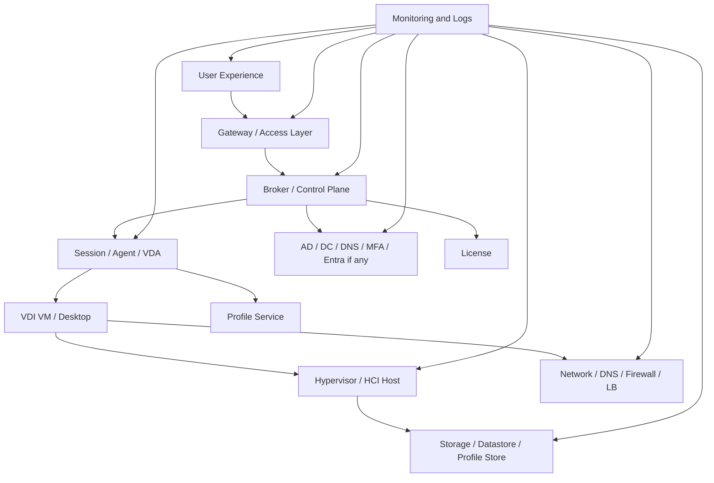
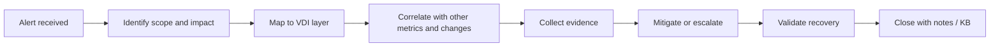

# VDI Monitoring and Alerting Guide

## 0. Document Control

| Trường | Giá trị |
|---|---|
| Thứ tự | 15 |
| Tên tài liệu | VDI Monitoring and Alerting Guide |
| Tên file | 15_VDI_Monitoring_and_Alerting_Guide.md |
| Mục đích tài liệu | Xác định các chỉ số cần giám sát cho broker, gateway, VDI, session, host, storage, network, identity, license và profile service. |
| Nguồn điều khiển | [[sources/vdi-training-idea]], [[sources/vdi-documentation-list-context]] |
| Trạng thái | Bản đào tạo vận hành. Tool monitoring, dashboard, threshold, alert routing, SLA, owner và baseline thật là Need Customer Confirmation. |

### 0.1 Source Grounding

| Nội dung | Nguồn sử dụng | Mức độ tin cậy | Ghi chú |
|---|---|---|---|
| Bối cảnh VDI quy mô 1500 đến hơn 2000 máy, cần nhìn theo lớp identity, broker, image, hypervisor, storage, network, policy, monitoring và operation | [[sources/vdi-training-idea]] | High | Dùng làm khung đào tạo monitoring theo lớp. |
| Tên tài liệu, tên file và mục đích | [[sources/vdi-documentation-list-context]] | High | Source of truth cho phạm vi tài liệu. |
| Horizon Connection Server, UAG, internal/external flow, protocol, certificate, firewall và troubleshooting kết nối | [[sources/horizon-8-architecture]], [[sources/understand-and-troubleshoot-horizon-connections]], [[concepts/connection-server]], [[concepts/unified-access-gateway]] | High | Dùng để xác định metric và alert cho Horizon broker/gateway/path. |
| Citrix Delivery Controller, StoreFront, Site DB, VDA, HDX/ICA, machine/session dependency | [[sources/citrix-virtual-apps-and-desktops-7-2603]], [[concepts/delivery-controller]], [[concepts/storefront]], [[concepts/virtual-delivery-agent]], [[concepts/hdx]] | High | Dùng để xác định metric và alert cho CVAD broker/session/VDA. |
| Hypervisor, vCenter, ESXi, XenServer, datastore, storage repository và VM metrics | [[sources/vmware-vsphere-8-0]], [[sources/xenserver-8-4]], [[concepts/vcenter-server]], [[concepts/esxi]], [[concepts/xenserver]], [[concepts/datastore]], [[concepts/storage-repository]] | Medium | Dùng để liên hệ VDI symptoms với host/storage/hypervisor metrics. |
| Profile, FSLogix/profile container, Cloud Cache, storage permission và log | [[sources/fslogix-documentation]], [[concepts/profile-container]], [[concepts/cloud-cache]], [[concepts/user-profile-management]], [[concepts/monitoring-and-logs]] | Medium | Dùng để xác định metric/evidence cho login chậm và profile issue. |

### 0.2 In Scope

- Các nhóm chỉ số cần giám sát cho broker, gateway, VDI/desktop, session, host, storage, network, identity, license và profile service.
- Cách đọc alert theo lớp thay vì chỉ nhìn alert đơn lẻ.
- Cách phân loại alert theo impact: một user, một pool/catalog, một gateway, một cluster, một storage path hoặc toàn nền tảng.
- Checklist health check, alert triage, evidence package và escalation.
- Các scenario thực tế: failed session tăng, VDI unregistered hàng loạt, storage latency, login chậm, gateway external issue, license nearing limit.

### 0.3 Out of Scope

- Không thay thế tài liệu Daily Operations Checklist; tài liệu này giải thích logic monitoring và alert, không chỉ checklist đầu ca.
- Không đưa threshold cụ thể như giá trị SLA nếu khách hàng chưa cung cấp baseline.
- Không thay thế tài liệu chuyên sâu cho monitoring tool như vROps, Director, Horizon Console, Zabbix, SolarWinds, SCOM, Splunk, Grafana hoặc SIEM.
- Không tự giả định khách hàng đang dùng công cụ monitoring nào.
- Không yêu cầu secret, password, token hoặc credential để truy cập dashboard/log.

## 1. Tài liệu này giúp engineer làm được gì

Monitoring trong VDI không phải chỉ là nhìn dashboard có màu xanh hay đỏ. Với hệ thống 1500 đến hơn 2000 VDI, engineer cần biết alert đang nói về lớp nào, ảnh hưởng bao nhiêu user, có liên quan recent change không và evidence nào đủ để escalation.

Sau khi học xong, engineer cần làm được:

- Nhìn một alert và xác định nó thuộc lớp broker, gateway, session, desktop, hypervisor, storage, network, identity, license hay profile.
- Phân biệt alert triệu chứng và alert nguyên nhân có thể.
- Biết chỉ số nào cần xem khi user báo login fail, launch fail, session disconnect, login chậm, black screen hoặc profile issue.
- Biết cách gom nhiều alert thành một incident thay vì mở nhiều ticket rời rạc.
- Biết evidence cần lưu: dashboard, metric timeline, affected scope, log, screenshot, alert ID và change ID.
- Biết khi nào cần escalation tới platform, identity, network, storage, security, hypervisor hoặc application owner.

## 2. Mô hình monitoring theo lớp

Một alert tốt phải giúp trả lời ít nhất một trong các câu hỏi:

- Lớp nào đang bất thường?
- Bất thường bắt đầu từ khi nào?
- Ảnh hưởng bao nhiêu user/resource?
- Có trùng recent change không?
- Có metric nào khác cùng tăng/giảm không?
- Có cần action ngay hay chỉ theo dõi?

## 3. Nguyên tắc đọc monitoring

### 3.1 Alert không phải root cause

Ví dụ "failed session tăng" là triệu chứng. Nguyên nhân có thể là VDA unregistered, broker service issue, gateway path, license, profile, storage latency, network loss hoặc image change. Engineer phải dùng alert để định hướng kiểm tra, không xem alert là kết luận.

### 3.2 Scope quan trọng hơn màu sắc

Một alert đỏ cho một VM ít quan trọng hơn alert vàng nhưng ảnh hưởng toàn bộ external access. Khi nhận alert, hãy xác định scope:

- Một user.
- Một desktop.
- Một pool/catalog.
- Một Delivery Group/application pool.
- Một Connection Server/Delivery Controller.
- Một gateway/UAG/Citrix Gateway.
- Một host/cluster.
- Một datastore/profile store.
- Một network path.
- Toàn nền tảng.

### 3.3 Baseline quan trọng hơn threshold chung

Không có baseline thì threshold dễ gây nhiễu. Ví dụ CPU 85% có thể bình thường trong logon storm ngắn, nhưng storage latency tăng gấp nhiều lần baseline trong giờ login có thể là dấu hiệu nghiêm trọng. Threshold thật của khách hàng là Need Customer Confirmation.

### 3.4 Correlation là kỹ năng chính

Monitoring VDI cần nối nhiều tín hiệu:

- Failed session tăng cùng VDA unregistered tăng.
- Login duration tăng cùng profile loading time tăng.
- Profile issue tăng cùng storage latency tăng.
- External launch fail cùng gateway/LB/certificate alert.
- Pool available giảm cùng nhiều machine maintenance/powered off.
- User không thấy resource cùng entitlement/AD group change.

## 4. Chỉ số cần giám sát theo lớp

| Lớp | Chỉ số cần theo dõi | Dấu hiệu bất thường | Evidence nên lưu |
|---|---|---|---|
| Broker | Service health, failed session, launch failure, resource enumeration, controller/connection events | User không thấy resource, launch fail diện rộng | Broker dashboard, event/log, failed session ID |
| Gateway | Gateway health, LB member, certificate status, external URL/path, auth errors | External-only login/launch fail, TLS warning | Gateway/LB/cert evidence, timestamp |
| VDI/Desktop | Registered/unregistered, powered on/off, maintenance, agent service, VM tools | Agent unreachable, desktop unavailable | Machine list, agent state, VM state |
| Session | Active, disconnected, failed, reconnect, logoff trend | Session spike/drop, stale session, disconnect storm | Session dashboard, user sample |
| Host/HCI | CPU, memory, ready/co-stop nếu có, host health, cluster health | Nhiều VDI chậm trên cùng host | Host metrics, affected VM list |
| Storage | Datastore capacity, latency, IOPS, throughput, snapshot growth | Login chậm, profile issue, boot/logon storm | Storage timeline, datastore/path metrics |
| Network | Latency, packet loss, DNS failure, firewall/LB status, bandwidth | Disconnect, black screen, external/internal difference | Ping/path evidence, LB/firewall log nếu có |
| Identity | DC health, DNS, authentication failure, group lookup, time sync, MFA/CA errors | Login fail, resource enumeration issue, registration issue | Auth log, DC/DNS evidence, sign-in result nếu có |
| License | License usage, nearing limit, grace/error state | User không launch được dù resource OK | License dashboard/error |
| Profile | Profile load time, container attach, lock, file share availability, permission | Login chậm, temp profile, profile not loaded | Profile log, file share/storage metric |

## 5. Broker monitoring

Broker là lớp điều phối resource và session. Với Horizon là Connection Server. Với Citrix CVAD là Delivery Controller, đi cùng StoreFront, Site DB và VDA relationship.

### 5.1 Chỉ số cần xem

- Broker service health.
- Failed session/failed launch.
- Resource enumeration failure.
- Entitlement lookup issue.
- Controller/Connection Server event.
- Database connectivity đối với CVAD nếu có.
- Connection Server/UAG relationship đối với Horizon external path.
- Number of registered/available machines.
- Licensing status nếu broker hiển thị.

### 5.2 Alert cần chú ý

| Alert | Có thể ảnh hưởng | Kiểm tra tiếp |
|---|---|---|
| Broker service down/degraded | Nhiều user login/launch fail | Service health, peer node, load balancer, recent change |
| Failed session tăng | User launch fail | Agent/VDA registration, pool/catalog availability, protocol path |
| Resource enumeration fail | User không thấy desktop/app | AD group, entitlement, StoreFront/Connection Server |
| Database connectivity issue | CVAD control plane lỗi | Site DB, SQL/DB owner, Controller events |
| Machine registration drop | Pool/catalog không đủ máy | Agent/VDA, DNS, AD, image, network, security |

## 6. Gateway và external access monitoring

Gateway là nơi lỗi chỉ xảy ra với user bên ngoài. Horizon thường dùng Unified Access Gateway; Citrix có thể dùng Citrix Gateway/ADC nếu triển khai.

### 6.1 Chỉ số cần xem

- Gateway appliance health.
- Load balancer member state.
- Certificate validity/expiry.
- TLS/SSL error.
- Authentication error.
- External URL/path.
- Firewall/NAT/proxy path nếu có.
- Session/protocol connection error.

### 6.2 Cách đọc alert external-only

Nếu user nội bộ ổn nhưng user bên ngoài lỗi, đừng bắt đầu bằng desktop reset. Hãy kiểm tra:

1. Gateway health.
2. Load balancer member.
3. Certificate.
4. Authentication/MFA path.
5. Firewall/NAT.
6. Secondary protocol/display protocol path.
7. Broker event.
8. Agent/Desktop state.

Evidence tối thiểu: user, timestamp, external URL/path, error screenshot, gateway/LB/cert status, internal comparison.

## 7. VDI, Agent và session monitoring

### 7.1 VDI/Agent metrics

- VDI registered/unregistered.
- Horizon Agent reachable/unreachable.
- Citrix VDA registered/unregistered.
- VM power state.
- Maintenance mode.
- Agent service health.
- Machine assigned/available.
- Recent image version nếu dashboard có.

### 7.2 Session metrics

- Active sessions.
- Disconnected sessions.
- Failed sessions.
- Reconnect failures.
- Logoff trend.
- Session duration.
- User concurrency peak.
- Black screen/disconnect ticket trend.

### 7.3 Cách đọc pattern

| Pattern | Gợi ý kiểm tra |
|---|---|
| Một desktop unregistered | Machine OS, Agent/VDA service, VM state |
| Nhiều desktop cùng pool/catalog unregistered | Image, agent update, security tool, DNS/AD, network |
| Nhiều desktop trên cùng host chậm | Host CPU/memory, datastore, HCI/storage |
| Failed sessions tăng nhưng registration bình thường | Protocol path, broker, license, profile, app/backend |
| Disconnected sessions tăng đột biến | Network, gateway, client path, policy timeout |

## 8. Host, HCI và hypervisor monitoring

Horizon chạy trên HCI theo bối cảnh khách hàng. Citrix CVAD có thể chạy trên XenServer hoặc VMware ESXi. Dù nền tảng khác nhau, engineer vẫn cần nhìn host/hypervisor như lớp cung cấp compute cho VDI.

### 8.1 Chỉ số cần xem

- Host CPU.
- Host memory.
- Cluster health.
- VM power/task failure.
- Hypervisor management connection.
- Resource pool nếu có.
- Host maintenance state.
- Tool/driver/guest health nếu dashboard có.
- VM placement imbalance.

### 8.2 Alert cần triage nhanh

- Host down hoặc disconnected.
- Cluster degraded.
- Nhiều VM power action fail.
- CPU/memory contention trên host chứa nhiều VDI.
- Hypervisor management connection lỗi.
- Host maintenance ảnh hưởng pool/catalog capacity.

Alert host thường cần correlation với user impact: pool nào nằm trên host đó, bao nhiêu VDI, bao nhiêu active session, có datastore/network chung không.

## 9. Storage và profile monitoring

Storage ảnh hưởng mạnh tới VDI vì boot storm, logon storm, profile load, snapshot growth và image rollout đều phụ thuộc I/O.

### 9.1 Storage metrics

- Datastore capacity.
- Storage latency.
- IOPS.
- Throughput.
- Snapshot growth.
- Queue/degradation nếu tool hiển thị.
- Profile share capacity/availability.
- File lock hoặc permission issue nếu có log.

### 9.2 Profile metrics và evidence

- Profile loading time.
- FSLogix/profile container attach success/failure nếu dùng.
- Temp profile count.
- Profile lock issue.
- File share availability.
- Permission errors.
- Cloud Cache status nếu dùng.

Profile solution thật của khách hàng là Unknown. Không được giả định FSLogix hoặc Citrix Profile Management nếu chưa xác nhận.

### 9.3 Alert storage cần ưu tiên

| Alert | Vì sao quan trọng | Evidence |
|---|---|---|
| Datastore gần đầy | Có thể làm VM/snapshot/provisioning lỗi | Datastore capacity timeline, affected pool |
| Latency tăng trong giờ login | Gây login chậm, profile issue, app chậm | Latency chart, login duration, profile log |
| Snapshot growth bất thường | Có thể ăn capacity và giảm performance | Snapshot list, datastore trend, change ID |
| Profile share unavailable | Nhiều user login fail/temp profile | File share status, profile log, affected users |

## 10. Network, DNS và certificate monitoring

Network issue trong VDI thường xuất hiện như disconnect, black screen, launch timeout, login chậm hoặc external-only failure.

### 10.1 Chỉ số cần xem

- Network latency.
- Packet loss.
- Bandwidth saturation.
- DNS lookup failure.
- Firewall deny/drop nếu có quyền xem.
- Load balancer member health.
- Certificate expiry/invalid.
- NAT/proxy issue nếu có.

### 10.2 Cách đọc network symptoms

- Internal và external đều lỗi: broker, agent, DNS, core network hoặc hạ tầng chung.
- Chỉ external lỗi: gateway, LB, firewall, certificate, NAT, external URL.
- Chỉ một site/location lỗi: WAN, routing, local firewall, DNS resolver.
- Chỉ một pool/subnet lỗi: VLAN, subnet firewall, host network, desktop network.
- Black screen sau authentication: display/secondary protocol path cần được kiểm tra.

## 11. Identity và license monitoring

### 11.1 Identity metrics

- Authentication failure.
- DC availability.
- DNS health.
- Time sync.
- Group lookup/entitlement lookup issue.
- Account lockout trend.
- MFA/Conditional Access failure nếu có.

Identity issue có thể làm:

- Login fail.
- User không thấy resource.
- Agent/VDA registration fail do domain/DNS/time.
- GPO/profile/login chậm.

### 11.2 License metrics

- License usage.
- License nearing limit.
- License server/service health nếu có.
- Grace/error state.
- Feature entitlement/license mismatch nếu tool hiển thị.

License issue thường dễ bị bỏ qua vì hạ tầng trông healthy nhưng launch vẫn fail. Khi failed session tăng mà broker/agent/storage/network không rõ lỗi, luôn kiểm tra license status.

## 12. Alert triage workflow

### 12.1 Bước 1: Xác định scope

- Alert ảnh hưởng một object hay nhiều object?
- Có user ticket đi kèm không?
- Có dịch vụ critical không?
- Có đang trong giờ cao điểm không?
- Có alert khác cùng thời điểm không?

### 12.2 Bước 2: Map alert vào lớp

Ví dụ:

- `VDI unregistered`: Agent/desktop, nhưng có thể do image, DNS, AD, network, security.
- `Datastore latency`: storage, nhưng tác động lên login/session/app.
- `Gateway unhealthy`: access layer, đặc biệt external user.
- `Authentication failure`: identity, nhưng ảnh hưởng broker/resource visibility.

### 12.3 Bước 3: Correlate

Tìm quan hệ:

- Có recent change không?
- Alert bắt đầu sau change nào?
- Metrics khác có cùng đổi không?
- Ticket user có cùng pattern không?
- Scope có cùng pool/catalog/site/host/datastore/subnet không?

### 12.4 Bước 4: Evidence package

Một evidence package tốt gồm:

- Alert name/ID.
- Timestamp và time window.
- Affected user/resource/object.
- Dashboard screenshot.
- Metric timeline trước/sau.
- Relevant logs/events.
- Recent change ID nếu có.
- Initial impact assessment.
- Action đã thực hiện.
- Kết quả postcheck.

## 13. Alert severity và ưu tiên phản ứng

| Severity đề xuất | Điều kiện | Ví dụ | Hành động |
|---|---|---|---|
| Critical | Ảnh hưởng nhiều user, mất truy cập, dữ liệu/capacity nguy cấp | Broker down, gateway external down, datastore full, profile share unavailable | Mở incident, escalation ngay, cập nhật liên tục |
| High | Ảnh hưởng một pool/catalog/site hoặc tăng nhanh | VDA unregistered hàng loạt, failed session tăng, storage latency cao | Triage trong thời gian ngắn, xác định owner |
| Medium | Ảnh hưởng giới hạn, có workaround | Một nhóm user login chậm, một host degraded nhưng HA còn | Theo dõi, mở ticket, xử lý theo SOP |
| Low | Cảnh báo sớm hoặc không impact user hiện tại | Capacity trend tăng, certificate sắp hết hạn xa | Ghi nhận, lập kế hoạch change |

Severity thật cần khớp SLA khách hàng. Bảng trên là khung đào tạo, không phải SLA chính thức.

## 14. Operational Tasks

### 14.1 Daily monitoring review

**Mục đích:** Phát hiện sớm bất thường trước khi user mở nhiều ticket.

**Khi thực hiện:** Đầu ca, trước/sau giờ cao điểm, sau maintenance window.

**Kiểm tra:**

- Broker/gateway health.
- Registered/unregistered VDI.
- Failed sessions.
- Pool/catalog availability.
- Active/disconnected sessions.
- Host CPU/memory.
- Datastore capacity/latency.
- Network latency/packet loss nếu có.
- Identity/auth failure.
- Profile/login duration.
- License status.

**Evidence:** Dashboard screenshot, timestamp, bất thường và ticket/alert ID.

### 14.2 Alert triage

**Mục đích:** Xác định alert là noise, symptom hay incident thật.

**Precheck:** Có alert ID, time window, affected object.

**Các bước:**

1. Xác định scope.
2. Map lớp.
3. Correlate metric.
4. Kiểm tra recent change.
5. Kiểm tra user impact.
6. Thu evidence.
7. Mitigate hoặc escalate.

**Escalation condition:** Critical service impact, nhiều user, vượt quyền, cần owner khác hoặc không có evidence đủ để xử lý an toàn.

### 14.3 Post-change monitoring

**Mục đích:** Xác nhận change không gây regression.

**Theo dõi:**

- Failed session.
- Registration state.
- Login duration.
- Profile load time.
- Gateway/broker health.
- Host/storage/network metric.
- Ticket trend.

**Evidence:** Baseline trước change, metric sau change, pass/fail, rollback decision nếu cần.

### 14.4 Capacity trend review

**Mục đích:** Phát hiện rủi ro trước khi thành incident.

**Theo dõi:**

- Concurrent sessions peak.
- Pool/catalog availability trend.
- Host CPU/memory trend.
- Datastore capacity growth.
- Storage latency trend.
- Profile storage growth.
- License usage trend.

**Output:** Capacity risk, thời điểm dự kiến cần mở rộng, owner và đề xuất change.

## 15. Lỗi thường gặp và hướng xử lý

| Triệu chứng/Alert | Nguyên nhân có thể | Lớp cần kiểm tra | Evidence cần thu thập | Cách kiểm tra | Hướng xử lý | Khi nào escalation |
|---|---|---|---|---|---|---|
| Failed session tăng | Broker issue, VDA/Agent unregistered, license, protocol path, profile/storage | Broker/Agent/License/Network/Profile | Failed session trend, resource, user samples, logs | Khoanh vùng theo pool/catalog/platform/time | Mitigate theo lớp, rollback nếu sau change | Nhiều user hoặc tăng nhanh |
| VDI unregistered tăng | Agent service, DNS/AD, image change, security tool, network | Agent/Identity/Image/Security/Network | Machine list, registration timeline, change ID | So sánh theo pool/image/host/subnet | Dừng rollout, xử lý dependency | Hàng loạt hoặc cùng pool critical |
| Gateway health đỏ | Appliance down, LB member down, certificate, network | Gateway/LB/Certificate/Network | Gateway status, LB status, cert info | So sánh internal/external, kiểm tra member | Chuyển gateway/network owner | External user impact |
| Datastore capacity cao | Snapshot growth, profile growth, log/temp, provisioning | Storage/Snapshot/Profile | Capacity trend, snapshot list, affected datastore | Xem growth timeline và recent change | Dọn theo policy hoặc mở rộng qua change | Gần đầy hoặc ảnh hưởng VM |
| Storage latency cao | I/O storm, storage issue, snapshot chain, contention | Storage/HCI/Profile | Latency/IOPS chart, login duration, user tickets | Correlate boot/logon storm và affected pool | Escalate storage/HCI owner | Login/app chậm diện rộng |
| Login duration tăng | GPO, profile, DC latency, storage, security scan | Identity/Profile/Storage/Security | Login duration, profile logs, GPO time | So sánh baseline, user sample | Triage theo component chậm nhất | Vượt SLA hoặc nhiều user |
| Disconnected sessions tăng | Network instability, gateway issue, policy timeout, client issue | Network/Gateway/Policy/Client | Session trend, user location, path | So sánh site/internal/external | Escalate network/gateway nếu pattern rõ | Disconnect storm |
| License nearing limit | User concurrency tăng, license pool thiếu, license server issue | License/Broker | Usage trend, error, peak sessions | Kiểm tra license dashboard và failed launch | Mở capacity/license process | Sắp chạm limit hoặc user impact |
| Authentication failure tăng | DC/MFA/CA/account lockout/DNS | Identity/Access | Auth failure trend, user groups, timestamp | Kiểm tra DC/DNS/MFA path nếu có | Escalate identity/security owner | Nhiều user hoặc access outage |
| Profile attach failure | Profile store unavailable, permission, lock, storage latency | Profile/Storage/Permission | Profile log, file share status, user sample | Kiểm tra profile path, lock, storage metric | Escalate profile/storage owner | Nhiều user hoặc temp profile |

## 16. Field Checklist

### 16.1 Alert intake

- [ ] Ghi alert name/ID.
- [ ] Ghi timestamp và time window.
- [ ] Xác định affected object.
- [ ] Xác định user impact nếu có.
- [ ] Xác định scope: user, pool, site, gateway, host, datastore, platform.
- [ ] Kiểm tra alert liên quan cùng thời điểm.
- [ ] Kiểm tra recent change.

### 16.2 Triage theo lớp

- [ ] Broker/gateway health.
- [ ] VDI registered/unregistered.
- [ ] Session failed/active/disconnected.
- [ ] Pool/catalog availability.
- [ ] Host CPU/memory/health.
- [ ] Storage capacity/latency.
- [ ] Network latency/packet loss/LB/firewall.
- [ ] Identity/DC/DNS/MFA.
- [ ] License usage/status.
- [ ] Profile service/logon metric.

### 16.3 Evidence trước escalation

- [ ] Dashboard screenshot.
- [ ] Metric timeline.
- [ ] Affected users/resources.
- [ ] Logs/events.
- [ ] Alert IDs.
- [ ] Recent change IDs.
- [ ] Action đã thử.
- [ ] Postcheck result.

### 16.4 Close alert/incident

- [ ] Xác nhận metric về bình thường hoặc trong baseline.
- [ ] Xác nhận user impact hết.
- [ ] Ghi root cause nếu có evidence.
- [ ] Nếu chưa chắc, ghi probable cause và pending action.
- [ ] Cập nhật KB nếu pattern có thể lặp lại.
- [ ] Đề xuất threshold/runbook cải tiến nếu alert nhiễu.

## 17. Scenario Based Learning

### Scenario 1: Failed session tăng sau image update

**Bối cảnh:** Sau maintenance window, failed session trong một pool tăng mạnh.

**Câu hỏi cho học viên:**

- Alert này thuộc lớp nào đầu tiên?
- Metric nào cần correlate?
- Khi nào rollback image?

**Gợi ý phân tích:** Failed session là triệu chứng. Cần xem Agent/VDA registration, image version, pool availability, security tool event, login duration và recent change.

**Hướng xử lý đề xuất:** Dừng rollout, thu metric trước/sau, lấy failed session sample, kiểm tra registration trend. Rollback nếu impact rộng và không có fix nhanh.

**Evidence cần lưu:** Change ID, image version, failed session chart, registration chart, affected pool, rollback result.

### Scenario 2: External user đồng loạt launch fail

**Bối cảnh:** User nội bộ launch được, user bên ngoài qua gateway timeout.

**Câu hỏi cho học viên:**

- Vì sao không nên reset desktop trước?
- Alert nào cần xem?
- Owner nào cần tham gia?

**Gợi ý phân tích:** External-only issue gợi ý gateway/LB/certificate/firewall/secondary protocol. Desktop/pool có thể vẫn healthy.

**Hướng xử lý đề xuất:** Kiểm tra gateway health, LB member, certificate, external URL/path, firewall/protocol. Escalate network/platform owner.

**Evidence cần lưu:** Internal vs external comparison, gateway/LB/cert status, error screenshot, timestamp.

### Scenario 3: Login chậm đầu giờ sáng

**Bối cảnh:** Login duration tăng từ 45 giây lên 4 phút trong giờ cao điểm.

**Câu hỏi cho học viên:**

- Cần xem CPU trước hay profile/storage trước?
- Metric nào chứng minh storage/profile liên quan?
- Khi nào cần mở incident?

**Gợi ý phân tích:** Login chậm có thể do GPO, profile, DC, storage, security scan, logon storm. Cần correlation theo timeline.

**Hướng xử lý đề xuất:** So sánh login duration, profile load time, storage latency, DC/DNS metric, host CPU và ticket trend.

**Evidence cần lưu:** Login duration chart, profile logs, storage latency chart, user samples, affected pools.

### Scenario 4: Datastore gần đầy do snapshot growth

**Bối cảnh:** Datastore chứa nhiều VDI báo 90% capacity sau các change image.

**Câu hỏi cho học viên:**

- Vì sao đây có thể thành incident lớn?
- Có được xóa snapshot ngay không?
- Evidence cần có trước escalation là gì?

**Gợi ý phân tích:** Datastore full có thể làm VM/provisioning/session lỗi. Nhưng xóa snapshot cần biết owner/change/rollback dependency.

**Hướng xử lý đề xuất:** Thu snapshot list, growth trend, affected pools, recent change. Escalate storage/platform owner và xử lý theo change.

**Evidence cần lưu:** Datastore capacity chart, snapshot list, affected VM/pool, change IDs.

## 18. Hands On hoặc bài tập tư duy

### Bài tập 1: Alert mapping

Với mỗi alert sau, xác định lớp chính, lớp phụ và evidence:

- VDI unregistered tăng.
- Gateway member down.
- Profile load time tăng.
- License usage 95%.
- Datastore latency tăng.
- Failed session tăng.

### Bài tập 2: Correlation timeline

Tạo timeline 2 giờ quanh một incident login chậm, gồm:

- Change event.
- Login duration.
- Storage latency.
- Profile attach failure.
- DC/auth failures.
- Ticket user.

### Bài tập 3: Dashboard thiết yếu

Thiết kế dashboard tối thiểu cho ca trực VDI gồm 12 widget. Mỗi widget phải ghi rõ dùng để phát hiện lỗi gì.

### Bài tập 4: Alert noise review

Chọn một alert thường xuyên nhưng không có user impact. Đề xuất cách đánh giá lại threshold, suppression hoặc runbook mà không bỏ qua rủi ro thật.

## 19. Knowledge Check

### Câu 1

**Vì sao alert không phải root cause?**

**Đáp án:** Alert chỉ báo một trạng thái bất thường. Nguyên nhân cần được xác minh bằng metric, log, scope, correlation và recent change.

### Câu 2

**Failed session tăng cần kiểm tra những lớp nào?**

**Đáp án:** Broker, Agent/VDA, pool/catalog availability, protocol path, profile/storage, license, recent change.

### Câu 3

**External user lỗi nhưng internal user bình thường gợi ý gì?**

**Đáp án:** Gateway, load balancer, certificate, firewall, NAT, external URL hoặc secondary/display protocol path.

### Câu 4

**Pool có nhiều machine total nhưng user vẫn launch fail vì sao?**

**Đáp án:** Machine total không đồng nghĩa available; có thể unregistered, maintenance, powered off, assigned hết hoặc provisioning lỗi.

### Câu 5

**Metric nào thường liên quan login chậm?**

**Đáp án:** Login duration, profile loading time, GPO processing, DC/DNS/auth latency, storage latency, host CPU/memory và security scan events.

### Câu 6

**Datastore capacity alert cần evidence gì?**

**Đáp án:** Capacity timeline, datastore name, affected VDI/pool, snapshot growth, recent change và owner.

### Câu 7

**Khi nào license alert trở thành incident?**

**Đáp án:** Khi usage gần/đạt limit, launch fail xuất hiện hoặc license service/status ảnh hưởng user.

### Câu 8

**Evidence package trước escalation gồm gì?**

**Đáp án:** Alert ID, timestamp, affected scope, dashboard screenshot, metric timeline, logs/events, recent change, action đã thử và impact.

### Câu 9

**Tại sao cần baseline khách hàng?**

**Đáp án:** Vì threshold chung có thể sai với workload thực tế; baseline giúp phân biệt bình thường, spike theo giờ và bất thường thật.

### Câu 10

**Nếu chưa biết monitoring tool và threshold thật thì ghi gì?**

**Đáp án:** Ghi Unknown hoặc Need Customer Confirmation, kèm câu hỏi về tool, dashboard, threshold, owner, SLA và alert routing.

## 20. Hiểu nhầm thường gặp

| Hiểu nhầm | Vì sao sai | Cách nghĩ đúng |
|---|---|---|
| Dashboard xanh nghĩa là hệ thống ổn | Dashboard có thể thiếu metric hoặc che lỗi cục bộ. | Luôn kết hợp user impact, scope và metric theo lớp. |
| Alert đỏ nào cũng là incident | Một alert đỏ đơn lẻ có thể không impact; một trend vàng có thể nguy hiểm. | Đánh giá impact, scope và trend. |
| CPU cao luôn là nguyên nhân login chậm | Login chậm có thể do profile, GPO, DC, storage hoặc security tool. | Correlate nhiều metric. |
| User ticket quan trọng hơn monitoring | Ticket và monitoring bổ sung nhau. | Ticket cho biết trải nghiệm, monitoring cho biết pattern và lớp lỗi. |
| Chỉ cần xem broker dashboard | VDI phụ thuộc gateway, identity, hypervisor, storage, network và profile. | Monitoring phải end-to-end. |
| Threshold vendor mặc định là đủ | Mỗi môi trường có workload/baseline khác nhau. | Cần baseline khách hàng và tuning alert. |

## 21. Need Customer Confirmation

| Nhóm | Câu hỏi cần xác nhận | Vì sao cần |
|---|---|---|
| Monitoring tool | Khách hàng dùng công cụ nào cho Horizon, CVAD, hypervisor, storage, network, profile và logs? | Biết nguồn dashboard/log chính thức. |
| Dashboard | Dashboard chuẩn cho NOC/system engineer là gì? | Tránh mỗi người xem một nguồn khác nhau. |
| Threshold | Threshold cho failed session, unregistered, latency, capacity, login duration, license là gì? | Không dùng ngưỡng giả định. |
| Baseline | Baseline theo giờ cao điểm, ngày thường, sau change là gì? | Phân biệt spike bình thường và incident. |
| Alert routing | Alert nào mở incident, alert nào tạo ticket, alert nào chỉ theo dõi? | Phản ứng đúng ưu tiên. |
| SLA | SLA/OLA cho broker, gateway, session, storage, network, profile là gì? | Đánh severity. |
| Ownership | Owner của broker/gateway/identity/hypervisor/storage/network/profile/license là ai? | Escalation đúng nhóm. |
| Log retention | Log giữ bao lâu, ai có quyền xem, export như thế nào? | RCA và evidence. |
| License | License model, dashboard và ngưỡng cảnh báo là gì? | Tránh launch failure do license. |
| Profile solution | FSLogix, Citrix Profile Management, roaming profile hay giải pháp khác? | Theo dõi đúng metric/profile log. |
| Integration | Monitoring có tích hợp ticket/CMDB/change calendar không? | Correlate alert với asset/change. |
| Maintenance window | Alert suppression trong maintenance window xử lý thế nào? | Tránh noise nhưng không bỏ sót incident. |

## 22. Related Wiki Links

### Source pages

- [[sources/vdi-training-idea]]
- [[sources/vdi-documentation-list-context]]
- [[sources/horizon-8-architecture]]
- [[sources/understand-and-troubleshoot-horizon-connections]]
- [[sources/citrix-virtual-apps-and-desktops-7-2603]]
- [[sources/vmware-vsphere-8-0]]
- [[sources/xenserver-8-4]]
- [[sources/fslogix-documentation]]

### Concept pages

- [[concepts/monitoring-and-logs]]
- [[concepts/vdi-connection-flow]]
- [[concepts/omnissa-horizon]]
- [[concepts/connection-server]]
- [[concepts/unified-access-gateway]]
- [[concepts/citrix-virtual-apps-and-desktops]]
- [[concepts/delivery-controller]]
- [[concepts/storefront]]
- [[concepts/virtual-delivery-agent]]
- [[concepts/hdx]]
- [[concepts/vcenter-server]]
- [[concepts/esxi]]
- [[concepts/xenserver]]
- [[concepts/datastore]]
- [[concepts/storage-repository]]
- [[concepts/profile-container]]
- [[concepts/cloud-cache]]
- [[concepts/user-profile-management]]
- [[concepts/identity-and-access-management]]
- [[concepts/certificate-management]]
- [[concepts/firewall-ports]]
- [[concepts/load-balancing]]
- [[concepts/capacity-management]]
- [[concepts/incident-management]]

### Topic pages nên đọc tiếp

- [[topics/3_Omnissa_Horizon_Architecture_Overview]]: hiểu metric theo lớp Horizon.
- [[topics/4_Citrix_CVAD_Architecture_Overview]]: hiểu metric theo lớp CVAD.
- [[topics/5_VDI_Access_Flow_Design]]: map alert vào internal/external access flow.
- [[topics/7_Hypervisor_and_HCI_Operations_Guide]]: đọc alert host/HCI/hypervisor.
- [[topics/8_Storage_Operations_for_VDI]]: đọc alert datastore, latency, IOPS và profile storage.
- [[topics/9_Network_Operations_for_VDI]]: đọc alert network, DNS, LB, certificate và firewall path.
- [[topics/16_Daily_Operations_Checklist]]: biến monitoring thành checklist ca trực.
- [[topics/17_VDI_Incident_Classification_Guide]]: phân loại alert thành incident.
- [[topics/18_VDI_Troubleshooting_Playbook]]: xử lý lỗi theo playbook.
- [[topics/19_VDI_Performance_and_Capacity_Guide]]: phân tích trend và capacity.

## 23. Summary for Learners

Monitoring VDI là năng lực đọc tín hiệu theo lớp. Một dashboard tốt giúp phát hiện sớm, nhưng engineer giỏi là người biết nối alert với user impact, recent change, metric liên quan và owner xử lý.

Thứ tự kiểm tra khuyến nghị khi nhận alert:

1. Ghi alert ID, timestamp và affected object.
2. Xác định scope và user impact.
3. Map alert vào lớp: broker, gateway, session, desktop, host, storage, network, identity, license hoặc profile.
4. Correlate với metric khác và recent change.
5. Lưu dashboard, timeline và log.
6. Mitigate nếu có SOP và trong quyền.
7. Escalate đúng owner nếu impact rộng, vượt quyền hoặc cần hạ tầng/security/identity xử lý.
8. Validate metric về bình thường.
9. Close với evidence và cập nhật KB nếu pattern lặp lại.

Điều cần nhớ nhất: monitoring không phải để nhìn cho yên tâm. Monitoring là cách biến triệu chứng rời rạc thành câu chuyện vận hành có bằng chứng.

