# Daily Operations Checklist

## 0. Document Control

| Trường | Giá trị |
|---|---|
| Thứ tự | 16 |
| Tên tài liệu | Daily Operations Checklist |
| Tên file | 16_Daily_Operations_Checklist.md |
| Mục đích tài liệu | Cung cấp checklist kiểm tra hàng ngày cho engineer, gồm health check, alert review, session status, VDI registration, host resource, datastore capacity và incident pending. |
| Nguồn điều khiển | [[sources/vdi-training-idea]], [[sources/vdi-documentation-list-context]] |
| Trạng thái | Bản đào tạo vận hành. Dashboard chính thức, threshold, ca trực, SLA, ticket queue, escalation path và owner thực tế là Need Customer Confirmation. |

### 0.1 Source Grounding

| Nội dung | Nguồn sử dụng | Mức độ tin cậy | Ghi chú |
|---|---|---|---|
| Bối cảnh VDI quy mô 1500 đến hơn 2000 máy, vận hành theo lớp identity, broker, hypervisor, storage, network, policy, monitoring và support | [[sources/vdi-training-idea]] | High | Dùng làm khung checklist theo lớp. |
| Tên tài liệu, tên file và mục đích | [[sources/vdi-documentation-list-context]] | High | Source of truth cho scope tài liệu. |
| Logic monitoring, alert triage, metric theo lớp và evidence | [[topics/15_VDI_Monitoring_and_Alerting_Guide]], [[concepts/monitoring-and-logs]], [[concepts/daily-operations]] | Medium | Dùng để biến monitoring thành checklist ca trực. |
| Horizon/Citrix broker, gateway, agent, pool/catalog và access flow | [[sources/horizon-8-architecture]], [[sources/understand-and-troubleshoot-horizon-connections]], [[sources/citrix-virtual-apps-and-desktops-7-2603]] | Medium | Dùng để xác định điểm kiểm tra cho hai nền tảng. |
| Hypervisor, storage, profile và network dependency | [[sources/vmware-vsphere-8-0]], [[sources/xenserver-8-4]], [[sources/fslogix-documentation]] | Medium | Dùng để bổ sung host, datastore, profile và capacity check. |

### 0.2 In Scope

- Checklist vận hành hằng ngày cho system engineer theo các mốc: đầu ca, trong ca, sau change, cuối ca và bàn giao ca.
- Các mục kiểm tra bắt buộc: health check, alert review, session status, VDI registration, host resource, datastore capacity và incident pending.
- Cách đọc dấu hiệu bất thường và quyết định khi nào tạo incident hoặc escalation.
- Evidence cần lưu cho mỗi ca trực.
- Bài tập tình huống giúp engineer mới luyện cách dùng checklist.

### 0.3 Out of Scope

- Không thay thế tài liệu monitoring chi tiết; xem [[topics/15_VDI_Monitoring_and_Alerting_Guide]].
- Không thay thế tài liệu incident classification; xem [[topics/17_VDI_Incident_Classification_Guide]].
- Không đưa threshold/SLA cụ thể nếu khách hàng chưa xác nhận.
- Không mô tả lệnh hoặc thao tác production rủi ro cao như reset hàng loạt, xóa snapshot, thay policy hoặc failover nếu chưa có SOP/change.
- Không yêu cầu secret, password, token hoặc credential.

## 1. Cách dùng checklist này

Checklist này không phải để tick cho đủ. Nó giúp engineer trả lời mỗi ngày:

- Nền tảng VDI có đang healthy không?
- Có alert nào đang chuyển thành incident không?
- Có user/pool/catalog/gateway/host/datastore nào đang có pattern xấu không?
- Có change nào vừa thực hiện cần theo dõi không?
- Có incident nào tồn đọng cần follow-up hoặc escalation không?
- Evidence của ca trực có đủ để bàn giao không?

Với môi trường có hai hệ thống VDI:

- Hệ thống Horizon trên HCI cần kiểm tra Connection Server, Unified Access Gateway nếu có, desktop pool, entitlement, Horizon Agent registration, vCenter/HCI, datastore, network và profile.
- Hệ thống Citrix CVAD cần kiểm tra Delivery Controller, StoreFront, Citrix Gateway nếu có, Machine Catalog, Delivery Group, VDA registration, hypervisor XenServer hoặc VMware ESXi, storage, network và profile.

## 2. Nguyên tắc vận hành hằng ngày

### 2.1 Đi từ tổng quan đến chi tiết

Thứ tự khuyến nghị:

1. Kiểm tra dashboard tổng quan.
2. Kiểm tra alert mới và alert chưa xử lý.
3. Kiểm tra broker/gateway.
4. Kiểm tra session và failed session.
5. Kiểm tra VDI/Agent/VDA registration.
6. Kiểm tra pool/catalog capacity.
7. Kiểm tra host/HCI/hypervisor.
8. Kiểm tra datastore/storage/profile.
9. Kiểm tra network/identity/license.
10. Kiểm tra incident pending và change calendar.

### 2.2 Không xử lý alert đơn lẻ khi có pattern

Nếu có 20 alert VDI unregistered cùng một pool, đó có thể là một incident theo pool/image/network, không phải 20 ticket riêng. Engineer cần gom pattern, xác định scope và mở incident nếu impact đủ lớn.

### 2.3 Evidence trước action

Trước khi reboot, reset session, đưa máy vào maintenance hoặc escalation, hãy lưu evidence:

- Timestamp.
- Dashboard screenshot.
- Affected user/resource/object.
- Metric trend.
- Log/event nếu có.
- Recent change.
- Action đã làm.

## 3. Daily Operations Model

```mermaid
flowchart LR
  Start["Start of Shift"] --> Health["Platform Health Check"]
  Health --> Alerts["Alert Review"]
  Alerts --> Sessions["Session and Registration Review"]
  Sessions --> Infra["Host / Storage / Network Review"]
  Infra --> Tickets["Incident Pending Review"]
  Tickets --> Watch["Watchlist During Shift"]
  Watch --> PostChange["Post-change Follow-up"]
  PostChange --> Handover["End-of-shift Handover"]
```

Checklist tốt phải tạo ra hai kết quả:

- Trạng thái rõ ràng: healthy, degraded, incident, watching hoặc need escalation.
- Evidence đủ cho người tiếp theo tiếp tục công việc mà không phải hỏi lại từ đầu.

## 4. Checklist đầu ca

### 4.1 Thông tin ca trực

| Mục | Cần ghi nhận | Ghi chú |
|---|---|---|
| Thời gian bắt đầu ca | Ngày giờ, timezone | Dùng để đối chiếu alert/ticket. |
| Người trực | Engineer chính, backup nếu có | Không ghi credential. |
| Hệ thống kiểm tra | Horizon, Citrix CVAD hoặc cả hai | Có thể có ưu tiên theo ca. |
| Dashboard nguồn | Monitoring tool chính thức | Need Customer Confirmation. |
| Ticket queue | Incident/change/request pending | Ghi số lượng và ticket critical. |
| Change window | Change đang chạy/vừa chạy/sắp chạy | Theo dõi regression. |

### 4.2 Health check nhanh

- [ ] Horizon Connection Server health bình thường hoặc trạng thái đã biết.
- [ ] Unified Access Gateway health bình thường nếu có external access.
- [ ] Citrix Delivery Controller health bình thường.
- [ ] StoreFront/Citrix Gateway health bình thường nếu có.
- [ ] Broker service không có alert critical mới.
- [ ] Database/Site DB alert không có hoặc đã có ticket owner.
- [ ] License status không nearing limit hoặc error.
- [ ] Monitoring/dashboard hoạt động, không mất dữ liệu giám sát.

Nếu dashboard monitoring không hoạt động, đó cũng là vấn đề vận hành. Ghi nhận và escalation theo owner monitoring.

## 5. Alert review checklist

### 5.1 Phân loại alert

| Nhóm alert | Cần kiểm tra | Khi nào đáng lo |
|---|---|---|
| Broker/Gateway | Service health, LB member, auth error, certificate | Nhiều user login/launch fail hoặc external-only issue |
| Session | Failed session, disconnected spike, reconnect fail | Tăng nhanh hoặc tập trung theo pool/catalog/site |
| Registration | VDI unregistered, VDA/Horizon Agent unreachable | Nhiều máy cùng pool/catalog/image/host/subnet |
| Host/HCI | Host down, CPU/memory contention, cluster degraded | Ảnh hưởng nhiều VDI hoặc active session |
| Storage | Datastore capacity, latency, snapshot growth | Gần đầy, latency tăng trong giờ login, profile issue |
| Network | Latency, packet loss, DNS, firewall/LB | Disconnect, black screen, external/internal khác nhau |
| Identity | Auth failure, DC/DNS, group lookup, MFA/CA nếu có | Nhiều user login fail hoặc không thấy resource |
| License | Usage nearing limit, license service error | User launch fail hoặc usage sát ngưỡng |
| Profile | Profile attach fail, temp profile, profile load time | Login chậm hoặc nhiều user profile issue |

### 5.2 Alert review steps

- [ ] Xem alert mới trong ca trước và từ đầu ca hiện tại.
- [ ] Gom alert theo thời gian, pool/catalog, site, gateway, host, datastore hoặc user group.
- [ ] Xác định alert nào có user impact.
- [ ] Xác định alert nào trùng recent change.
- [ ] Tạo hoặc cập nhật incident nếu alert có impact rộng.
- [ ] Đánh dấu alert đang watch nếu chưa đủ điều kiện incident nhưng trend xấu.
- [ ] Lưu screenshot hoặc export alert list nếu cần bàn giao.

## 6. Session status checklist

### 6.1 Chỉ số cần xem

- Active sessions.
- Disconnected sessions.
- Failed sessions.
- Launch failures.
- Reconnect failures.
- Session count theo pool/catalog/Delivery Group/application pool.
- Session spike/drop bất thường.
- Long disconnected/stale sessions nếu dashboard có.

### 6.2 Cách đọc nhanh

| Dấu hiệu | Có thể là gì | Kiểm tra tiếp |
|---|---|---|
| Failed session tăng | Broker, Agent/VDA, license, profile, protocol path | Registration, pool/catalog, recent change |
| Disconnected tăng đột biến | Network, gateway, endpoint, policy timeout | Internal/external, site/location, LB/firewall |
| Active session giảm bất thường | Outage, broker/gateway issue, monitoring gap | User tickets, broker/gateway health |
| Stale session nhiều | Timeout policy, app hang, profile issue | Session policy, app owner, capacity impact |

### 6.3 Checklist session

- [ ] Failed session không tăng bất thường.
- [ ] Disconnected session không tăng bất thường.
- [ ] Không có pool/catalog critical thiếu session capacity.
- [ ] Không có pattern chỉ external/internal nếu không có ticket đã biết.
- [ ] Nếu có spike, đã ghi timestamp, affected scope và evidence.

## 7. VDI registration checklist

### 7.1 Horizon

- [ ] Desktop pool critical có đủ desktop available.
- [ ] Horizon Agent registered/available theo baseline.
- [ ] Không có nhóm desktop Agent unreachable tăng bất thường.
- [ ] Desktop powered off/maintenance không vượt ngưỡng vận hành.
- [ ] Pool vừa được update image đã được theo dõi registration.

### 7.2 Citrix CVAD

- [ ] Machine Catalog critical có đủ machine registered.
- [ ] Delivery Group critical có đủ machine available.
- [ ] VDA unregistered không tăng bất thường.
- [ ] Machine maintenance/powered off/unknown không tạo thiếu capacity.
- [ ] Catalog vừa update image/VDA đã được theo dõi registration.

### 7.3 Khi registration bất thường

Khoanh vùng theo:

- Pool/catalog/Delivery Group.
- Image version hoặc recent change.
- Host/cluster/datastore.
- Subnet/VLAN.
- Connection Server/Delivery Controller.
- AD/DNS/time sync.
- Security tool update.

Không reboot hàng loạt khi chưa lưu evidence và chưa xác định pattern.

## 8. Host resource checklist

### 8.1 VMware ESXi / HCI / vCenter

- [ ] vCenter reachable và không có alarm critical mới.
- [ ] ESXi/HCI host critical healthy.
- [ ] Cluster không degraded.
- [ ] Host CPU/memory không bất thường theo baseline.
- [ ] Không có host maintenance ngoài kế hoạch.
- [ ] VM power/provisioning task không fail hàng loạt.

### 8.2 XenServer nếu CVAD dùng XenServer

- [ ] Pool/host healthy.
- [ ] Storage Repository không lỗi.
- [ ] VM power/task không fail hàng loạt.
- [ ] Host maintenance hoặc resource contention đã được ghi nhận.

### 8.3 Khi host resource bất thường

- [ ] Xác định host/cluster ảnh hưởng pool/catalog nào.
- [ ] Xác định số VDI và active session liên quan.
- [ ] Kiểm tra storage/network chung.
- [ ] Lưu host metric và affected VM list.
- [ ] Escalate hypervisor/HCI owner nếu ngoài phạm vi VDI.

## 9. Datastore, storage và profile checklist

### 9.1 Datastore/storage

- [ ] Datastore/SR capacity không gần đầy theo threshold khách hàng.
- [ ] Storage latency không tăng bất thường.
- [ ] IOPS/throughput không có spike kéo dài.
- [ ] Snapshot growth không bất thường.
- [ ] Image/profile datastore không có alert critical.

### 9.2 Profile service

- [ ] Profile share/container path available nếu có monitoring.
- [ ] Profile loading time không tăng bất thường.
- [ ] Không tăng temp profile/profile attach failure.
- [ ] Không có permission/lock issue diện rộng.
- [ ] Profile storage capacity không gần đầy.

Profile solution thật là Need Customer Confirmation. Nếu chưa biết dùng FSLogix, Citrix Profile Management hay giải pháp khác, chỉ ghi "profile service Unknown" và hỏi owner.

### 9.3 Khi storage/profile bất thường

- [ ] Correlate với login duration.
- [ ] Correlate với failed session/profile ticket.
- [ ] Xác định datastore/share nào, pool/catalog nào liên quan.
- [ ] Kiểm tra recent image/snapshot/profile change.
- [ ] Escalate storage/profile owner với metric timeline.

## 10. Network, identity và license checklist

### 10.1 Network

- [ ] Không có packet loss/latency alert mới cho path VDI.
- [ ] Load balancer member cho gateway/broker bình thường.
- [ ] DNS resolution không có alert.
- [ ] Certificate không hết hạn hoặc warning mới.
- [ ] Firewall/LB change gần đây đã được theo dõi.

### 10.2 Identity

- [ ] Domain Controller/DNS health bình thường.
- [ ] Authentication failure không tăng bất thường.
- [ ] Account lockout trend không bất thường.
- [ ] GPO/AD replication issue không có alert known.
- [ ] MFA/Conditional Access alert nếu có đã có owner.

### 10.3 License

- [ ] Horizon/Citrix/license server status bình thường nếu có dashboard.
- [ ] License usage không nearing limit.
- [ ] Không có license error liên quan launch.
- [ ] License warning đã được ghi nhận nếu cần capacity/change.

## 11. Incident pending và ticket queue

### 11.1 Kiểm tra ticket đầu ca

- [ ] Incident critical/high còn mở.
- [ ] Ticket user lặp lại cùng symptom.
- [ ] Ticket đang chờ owner khác.
- [ ] Ticket sau change maintenance window.
- [ ] Ticket có SLA sắp vi phạm.
- [ ] Ticket thiếu evidence cần bổ sung.

### 11.2 Cách phát hiện pattern từ ticket

| Pattern ticket | Có thể liên quan |
|---|---|
| Nhiều user không thấy resource | Entitlement, AD group, broker/StoreFront/Connection Server |
| Nhiều user launch fail cùng pool/catalog | Agent/VDA, pool availability, image, broker |
| Nhiều user external lỗi | Gateway, LB, certificate, firewall, MFA |
| Login chậm cùng giờ | Profile, storage, DC/GPO, logon storm |
| App cụ thể lỗi | Application pool/backend/app owner |
| Một site/location lỗi | Network/WAN/DNS/local firewall |

### 11.3 Khi nào chuyển checklist thành incident

Mở hoặc nâng incident khi:

- Có nhiều user bị ảnh hưởng.
- Cùng symptom xuất hiện trong cùng pool/catalog/site/gateway.
- Critical business group bị ảnh hưởng.
- Gateway/broker/storage/profile service có alert critical.
- Failed session/registration/storage latency tăng nhanh.
- SLA có nguy cơ vi phạm.
- Cần nhiều owner cùng tham gia xử lý.

## 12. Post-change checklist

Sau mọi change liên quan VDI, image, policy, gateway, broker, hypervisor, storage, network, identity hoặc profile, cần kiểm tra:

- [ ] Change ID và thời gian thực hiện.
- [ ] Scope change: platform, pool/catalog, user group, host, datastore, network path.
- [ ] Broker/gateway health sau change.
- [ ] Session/failed session trend.
- [ ] VDI registration trend.
- [ ] Pool/catalog availability.
- [ ] Login duration/profile load time nếu liên quan.
- [ ] Host/storage/network metric nếu liên quan.
- [ ] User pilot hoặc smoke test.
- [ ] Ticket/alert phát sinh sau change.
- [ ] Rollback condition có bị chạm không.
- [ ] Evidence trước/sau đã lưu.

Nếu phát hiện bất thường sau change, không đợi hết maintenance window mới ghi nhận. Cần báo owner và chuẩn bị rollback theo change plan.

## 13. Cuối ca và bàn giao

### 13.1 Checklist cuối ca

- [ ] Các alert critical/high đã được xử lý, escalation hoặc ghi rõ trạng thái.
- [ ] Incident pending có owner và next action.
- [ ] Watchlist trong ca đã được ghi lại.
- [ ] Post-change monitoring đã có kết luận.
- [ ] Dashboard/evidence quan trọng đã lưu vào ticket.
- [ ] Không có ticket thiếu cập nhật trong phạm vi ca trực.
- [ ] Bàn giao rõ cho ca sau.

### 13.2 Mẫu bàn giao ngắn

| Mục | Nội dung cần ghi |
|---|---|
| Tình trạng chung | Healthy / degraded / incident ongoing / watching |
| Alert đáng chú ý | Alert ID, thời gian, scope |
| Incident ongoing | Ticket, impact, owner, next action |
| Change liên quan | Change ID, trạng thái postcheck |
| Watchlist | Metric hoặc pool/catalog cần theo dõi tiếp |
| Blocker | Thiếu quyền, thiếu owner, chờ khách hàng |
| Evidence | Link ticket/dashboard/screenshot nếu có |

## 14. Checklist nhanh theo thời điểm

### 14.1 Đầu ca 15 phút

- [ ] Xem dashboard tổng quan Horizon/Citrix.
- [ ] Xem alert critical/high.
- [ ] Xem failed session và registration.
- [ ] Xem pool/catalog availability critical.
- [ ] Xem host/datastore alert.
- [ ] Xem incident pending và change vừa chạy.
- [ ] Ghi health summary.

### 14.2 Trong ca

- [ ] Theo dõi alert mới.
- [ ] Gom ticket theo pattern.
- [ ] Follow-up incident pending.
- [ ] Kiểm tra post-change nếu có.
- [ ] Lưu evidence trước action.
- [ ] Escalate đúng owner khi vượt phạm vi.

### 14.3 Sau giờ cao điểm

- [ ] Kiểm tra login duration/profile trend.
- [ ] Kiểm tra failed session peak.
- [ ] Kiểm tra storage latency và host contention.
- [ ] Kiểm tra ticket user liên quan login/launch.
- [ ] Ghi nhận capacity hoặc performance risk.

### 14.4 Cuối ca

- [ ] Cập nhật ticket/incident.
- [ ] Ghi watchlist.
- [ ] Bàn giao owner/next action.
- [ ] Lưu evidence.
- [ ] Ghi điểm cần cải tiến checklist nếu có.

## 15. Common Issues Found During Daily Checks

| Phát hiện trong checklist | Nguyên nhân có thể | Lớp cần kiểm tra | Evidence | Hành động | Khi nào escalation |
|---|---|---|---|---|---|
| Failed session tăng nhẹ nhưng chưa có ticket | Early symptom, user chưa báo, monitoring noise | Broker/Agent/Profile/License | Trend, pool/catalog, user sample nếu có | Watchlist và correlate | Tăng tiếp hoặc có user impact |
| VDI unregistered tăng trong một pool | Image/Agent, DNS/AD, host/network, security tool | Pool/Agent/Identity/Infra | Registration chart, affected list, change ID | Triage pattern, dừng rollout nếu sau change | Ảnh hưởng nhiều máy |
| Datastore capacity tăng nhanh | Snapshot, profile growth, log/temp, provisioning | Storage/Snapshot/Profile | Capacity trend, snapshot list | Mở ticket storage/platform | Gần ngưỡng hoặc tăng nhanh |
| Disconnected sessions cao | Network, gateway, policy, client | Session/Network/Gateway | Session trend, location, path | Khoanh vùng internal/external/site | Disconnect storm |
| Login duration xấu sau giờ cao điểm | Profile, GPO, DC, storage, security scan | Profile/Identity/Storage | Login chart, profile log, storage metric | Correlate và tạo ticket | Nhiều user hoặc vượt SLA |
| Incident pending lâu không có owner | Escalation path không rõ, thiếu evidence | Process/Ownership | Ticket age, last update, missing evidence | Bổ sung evidence và chase owner | SLA risk |
| License warning | Usage tăng, license server issue | License/Broker | Usage trend, warning | Mở capacity/license follow-up | Gần limit hoặc launch fail |

## 16. Scenario Based Learning

### Scenario 1: Đầu ca thấy failed session tăng

**Bối cảnh:** Dashboard báo failed session tăng trong 30 phút, nhưng chưa có nhiều ticket user.

**Câu hỏi cho học viên:**

- Có mở incident ngay không?
- Cần xem metric nào tiếp?
- Evidence nào cần lưu?

**Gợi ý phân tích:** Chưa đủ kết luận. Cần xác định scope theo pool/catalog/platform, so với registration, gateway, license, profile và recent change.

**Hướng xử lý đề xuất:** Đưa vào watchlist, thu chart, kiểm tra affected resource. Nếu trend tiếp tục tăng hoặc có user impact, mở incident.

**Evidence cần lưu:** Failed session chart, affected pool/catalog, timestamp, related alerts.

### Scenario 2: Nhiều VDI unregistered sau maintenance

**Bối cảnh:** Sau image update đêm qua, một pool Horizon có nhiều desktop Agent unreachable.

**Câu hỏi cho học viên:**

- Checklist nào phải chạy trước?
- Có nên reset desktop hàng loạt?
- Khi nào rollback?

**Gợi ý phân tích:** Đây là post-change monitoring. Cần registration trend, image version, Agent logs, affected pool và user impact.

**Hướng xử lý đề xuất:** Dừng rollout nếu còn tiếp diễn, thu evidence, báo change owner, rollback nếu impact vượt ngưỡng.

**Evidence cần lưu:** Change ID, pool, affected desktops, registration chart, postcheck result.

### Scenario 3: Datastore capacity tăng nhanh

**Bối cảnh:** Datastore chứa profile và desktop VM tăng từ 75% lên 88% trong một ngày.

**Câu hỏi cho học viên:**

- Đây là daily check hay incident?
- Cần hỏi owner nào?
- Có được xóa file/snapshot ngay không?

**Gợi ý phân tích:** Capacity tăng nhanh là risk nghiêm trọng. Không tự xóa nếu chưa biết owner/rollback dependency.

**Hướng xử lý đề xuất:** Lưu capacity trend, kiểm tra snapshot/profile growth nếu có quyền, mở ticket storage/platform và theo dõi ngưỡng.

**Evidence cần lưu:** Datastore chart, affected pool, snapshot/profile growth, ticket owner.

### Scenario 4: Cuối ca còn incident không owner

**Bối cảnh:** Một incident external user launch fail chưa có owner rõ giữa network và platform team.

**Câu hỏi cho học viên:**

- Bàn giao thế nào để ca sau không mất thời gian?
- Evidence nào cần bổ sung?
- Có cần nâng cấp severity không?

**Gợi ý phân tích:** Incident không owner là rủi ro quy trình. Cần ghi rõ impact, path, evidence, team đã liên hệ và next action.

**Hướng xử lý đề xuất:** Bổ sung internal/external comparison, UAG/LB/cert evidence, affected users, SLA risk. Escalate theo duty manager nếu cần.

**Evidence cần lưu:** Ticket timeline, owner attempts, dashboard, user impact, next action.

## 17. Bài tập tư duy

### Bài tập 1: Tạo checklist ca trực 15 phút

Rút gọn checklist đầu ca thành 10 mục bắt buộc. Với mỗi mục, ghi:

- Dashboard cần xem.
- Dấu hiệu bất thường.
- Evidence cần lưu.
- Điều kiện escalation.

### Bài tập 2: Gom alert thành incident

Cho danh sách 12 alert rời rạc gồm VDI unregistered, storage latency, failed session và user ticket. Hãy nhóm chúng thành incident hoặc watchlist theo pattern.

### Bài tập 3: Bàn giao ca

Viết handover cho tình huống: gateway external có cảnh báo, user nội bộ bình thường, 15 external users launch fail, network team đang kiểm tra firewall.

### Bài tập 4: Review checklist sau sự cố

Sau một incident login chậm, hãy chỉ ra checklist hằng ngày cần bổ sung metric nào để phát hiện sớm hơn.

## 18. Knowledge Check

### Câu 1

**Mục tiêu chính của Daily Operations Checklist là gì?**

**Đáp án:** Phát hiện bất thường sớm, xác định scope/impact, lưu evidence, theo dõi incident/change và bàn giao rõ ràng.

### Câu 2

**Vì sao không nên tick checklist cho xong?**

**Đáp án:** Vì checklist chỉ có giá trị khi engineer hiểu dấu hiệu bất thường, correlation và điều kiện escalation.

### Câu 3

**Failed session tăng nhưng chưa có ticket user thì làm gì?**

**Đáp án:** Đưa vào watchlist, kiểm tra scope, correlate registration/gateway/license/profile/recent change và mở incident nếu trend tăng hoặc có impact.

### Câu 4

**Registration bất thường cần khoanh vùng theo những chiều nào?**

**Đáp án:** Pool/catalog, image version, host/cluster, datastore, subnet, broker, AD/DNS/time sync và recent change.

### Câu 5

**Datastore gần đầy có thể gây rủi ro gì?**

**Đáp án:** VM/provisioning lỗi, snapshot không hoạt động, profile issue, performance giảm và sự cố diện rộng.

### Câu 6

**Incident pending cần kiểm tra gì đầu ca?**

**Đáp án:** Severity, SLA, owner, next action, evidence thiếu, trạng thái escalation và ticket liên quan.

### Câu 7

**Post-change checklist quan trọng vì sao?**

**Đáp án:** Vì nhiều lỗi VDI xuất hiện sau image, policy, gateway, network, storage hoặc broker change; cần phát hiện sớm để rollback.

### Câu 8

**Evidence tối thiểu cho bàn giao ca gồm gì?**

**Đáp án:** Trạng thái chung, alert/ticket ID, impact, affected scope, action đã làm, owner, next action và dashboard/log evidence.

### Câu 9

**Khi nào chuyển từ watchlist sang incident?**

**Đáp án:** Khi có user impact, trend xấu tăng, ảnh hưởng nhóm/pool/site/gateway, SLA risk hoặc cần nhiều owner xử lý.

### Câu 10

**Nếu chưa biết dashboard/threshold chính thức thì ghi gì?**

**Đáp án:** Ghi Unknown hoặc Need Customer Confirmation và hỏi khách hàng về monitoring tool, dashboard, threshold, SLA và owner.

## 19. Hiểu nhầm thường gặp

| Hiểu nhầm | Vì sao sai | Cách nghĩ đúng |
|---|---|---|
| Checklist chỉ là danh sách tick | Tick không giúp vận hành nếu không hiểu dấu hiệu bất thường. | Checklist là quy trình phát hiện và bàn giao evidence. |
| Không có ticket user nghĩa là hệ thống ổn | Monitoring có thể phát hiện sớm trước user. | Xem trend và watchlist. |
| Alert nào cũng cần mở incident | Một số alert cần theo dõi hoặc ticket thường. | Dựa vào impact, scope và SLA. |
| Chỉ cần xem Horizon/Citrix console | Lỗi có thể nằm ở host, storage, network, identity, profile. | Kiểm tra end-to-end theo lớp. |
| Reboot là bước xử lý đầu tiên | Reboot có thể làm mất evidence và che root cause. | Lưu evidence, khoanh vùng, rồi action theo SOP. |
| Bàn giao chỉ cần nói “đang xử lý” | Ca sau cần owner, next action, evidence và rủi ro. | Handover phải cụ thể. |

## 20. Need Customer Confirmation

| Nhóm | Câu hỏi cần xác nhận | Vì sao cần |
|---|---|---|
| Ca trực | Mô hình trực ca, thời gian đầu/cuối ca và trách nhiệm từng role là gì? | Thiết kế checklist theo lịch thật. |
| Monitoring tool | Dashboard chính thức cho Horizon, CVAD, hypervisor, storage, network, profile là gì? | Tránh xem sai nguồn. |
| Threshold | Ngưỡng alert cho failed session, unregistered, host resource, datastore capacity là gì? | Không dùng threshold giả định. |
| Baseline | Baseline session/login/storage theo giờ cao điểm là gì? | Phân biệt spike bình thường và bất thường. |
| Ticket queue | Tool ticket, queue, priority và SLA mapping là gì? | Kiểm tra incident pending đúng cách. |
| Escalation path | Escalation cho platform, identity, network, storage, security, app là ai? | Chuyển đúng owner. |
| Change calendar | Engineer xem change calendar ở đâu? | Post-change monitoring. |
| Handover format | Khách hàng yêu cầu mẫu bàn giao nào? | Đồng bộ giữa các ca. |
| Evidence location | Lưu screenshot/log/evidence ở đâu? | Tránh thất lạc evidence. |
| Profile solution | Profile service đang dùng giải pháp nào? | Kiểm tra profile đúng metric. |
| License | License dashboard và ngưỡng warning là gì? | Tránh launch fail do license. |
| Maintenance window | Alert suppression trong maintenance window ra sao? | Tránh bỏ sót incident thật. |

## 21. Related Wiki Links

### Source pages

- [[sources/vdi-training-idea]]
- [[sources/vdi-documentation-list-context]]
- [[sources/horizon-8-architecture]]
- [[sources/understand-and-troubleshoot-horizon-connections]]
- [[sources/citrix-virtual-apps-and-desktops-7-2603]]
- [[sources/vmware-vsphere-8-0]]
- [[sources/xenserver-8-4]]
- [[sources/fslogix-documentation]]

### Concept pages

- [[concepts/daily-operations]]
- [[concepts/monitoring-and-logs]]
- [[concepts/incident-management]]
- [[concepts/vdi-connection-flow]]
- [[concepts/omnissa-horizon]]
- [[concepts/citrix-virtual-apps-and-desktops]]
- [[concepts/connection-server]]
- [[concepts/delivery-controller]]
- [[concepts/unified-access-gateway]]
- [[concepts/storefront]]
- [[concepts/virtual-delivery-agent]]
- [[concepts/vcenter-server]]
- [[concepts/esxi]]
- [[concepts/xenserver]]
- [[concepts/datastore]]
- [[concepts/storage-repository]]
- [[concepts/profile-container]]
- [[concepts/user-profile-management]]
- [[concepts/identity-and-access-management]]
- [[concepts/capacity-management]]

### Topic pages nên đọc tiếp

- [[topics/5_VDI_Access_Flow_Design]]: hiểu internal/external path khi health check access.
- [[topics/7_Hypervisor_and_HCI_Operations_Guide]]: kiểm tra host/HCI.
- [[topics/8_Storage_Operations_for_VDI]]: kiểm tra datastore/storage/profile capacity.
- [[topics/9_Network_Operations_for_VDI]]: kiểm tra network/DNS/LB/certificate.
- [[topics/13_Citrix_Machine_Catalog_and_Delivery_Group_Guide]]: kiểm tra CVAD catalog/DG/VDA.
- [[topics/14_Omnissa_Desktop_Pool_and_Entitlement_Guide]]: kiểm tra Horizon pool/Agent.
- [[topics/15_VDI_Monitoring_and_Alerting_Guide]]: hiểu alert và metric theo lớp.
- [[topics/17_VDI_Incident_Classification_Guide]]: phân loại incident từ checklist.
- [[topics/18_VDI_Troubleshooting_Playbook]]: xử lý khi checklist phát hiện lỗi.

## 22. Summary for Learners

Daily Operations Checklist là thói quen giữ nền tảng VDI ổn định. Mục tiêu không phải tick đủ dòng, mà là phát hiện sớm bất thường, hiểu scope, lưu evidence, tạo incident đúng lúc và bàn giao rõ.

Thứ tự kiểm tra khuyến nghị:

1. Dashboard tổng quan và alert critical/high.
2. Broker/gateway health.
3. Failed session, active/disconnected session.
4. VDI/Horizon Agent/Citrix VDA registration.
5. Pool/catalog/Delivery Group availability.
6. Host/HCI/hypervisor resource.
7. Datastore/storage/profile capacity và latency.
8. Network/DNS/LB/certificate.
9. Identity/authentication/license.
10. Incident pending, recent change và handover.

Điều engineer cần nhớ: một ca trực tốt không phải là ca không có alert, mà là ca mọi bất thường đều có scope, owner, evidence và next action rõ ràng.

