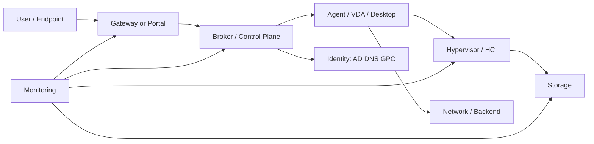

# Daily Operations Checklist

## 0. Document Control

### 0.1 Metadata

| Trường | Giá trị |
|---|---|
| Thứ tự | 16 |
| Tên tài liệu | Daily Operations Checklist |
| Tên file | 16_Daily_Operations_Checklist.md |
| Mục đích tài liệu | Cung cấp checklist kiểm tra hàng ngày cho engineer, gồm health check, alert review, session status, VDI registration, host resource, datastore capacity và incident pending. |
| Nguồn điều khiển | training_idea.md; list_context.txt |
| Trạng thái | Full training document; customer-specific values remain Unknown until confirmed |

### 0.2 Source Grounding

Tài liệu này dùng `training_idea.md`, `list_context.txt`, Document Research Pack từ `/lumi-ask` riêng cho chính tài liệu này, các trang `wiki/sources` và concept liên quan trong `wiki/concepts`.

| Nội dung | Nguồn sử dụng | Mức độ tin cậy | Ghi chú |
|---|---|---|---|
| Bối cảnh và mục tiêu | [[sources/vdi-training-idea]] | Medium | Giữ đúng bối cảnh hai hệ thống VDI và định hướng vận hành. |
| Tên, thứ tự, file, mục đích | [[sources/vdi-documentation-list-context]] | Medium | Source of truth cho danh mục. |
| Document Research Pack | /lumi-ask riêng cho tài liệu này | Grounded Ask | Tổng hợp scope, model, component, task, troubleshooting, knowledge check. |
| Bối cảnh hai hệ thống VDI, mục tiêu đào tạo, vận hành theo lớp, lỗi thường gặp và câu hỏi cần xác nhận. | [[sources/vdi-training-idea]] | High | Trang source summary trong wiki/sources. |
| Danh mục chính thức: thứ tự, tên tài liệu, tên file, mục đích và phạm vi trọng tâm. | [[sources/vdi-documentation-list-context]] | High | Trang source summary trong wiki/sources. |
| Profile container, ODFC, Cloud Cache, storage permission, HA và profile troubleshooting. | [[sources/fslogix-documentation]] | High | Trang source summary trong wiki/sources. |

### Document Research Pack từ /lumi-ask

**Q1 - Scope và learning objective:** /lumi-ask riêng cho Daily Operations Checklist đã được dùng để tổng hợp phần này.

**Synthesis:** Giải thích được vai trò của chủ đề trong vận hành VDI quy mô lớn.; Xác định được thành phần, dependency và evidence cần kiểm tra.; Phân tích được ít nhất 3 tình huống sự cố hoặc thay đổi liên quan.; Biết khi nào cần escalation và phần nào cần khách hàng xác nhận.

**Q2 - Architecture hoặc operational model:** /lumi-ask riêng cho Daily Operations Checklist đã được dùng để tổng hợp phần này.

**Synthesis:** Mô hình cần đặt trong bối cảnh hai nền tảng VDI và các lớp dependency.

**Q3 - Component deep dive và operational tasks:** /lumi-ask riêng cho Daily Operations Checklist đã được dùng để tổng hợp phần này.

**Synthesis:** Mỗi component/task phải có role, dependency, dấu hiệu lỗi, kiểm tra vận hành, evidence, risk và escalation.

**Q4 - Troubleshooting và scenario:** /lumi-ask riêng cho Daily Operations Checklist đã được dùng để tổng hợp phần này.

**Synthesis:** Troubleshooting đi theo symptom -> scope -> recent change -> layer check -> evidence -> mitigation/escalation.

**Q5 - Knowledge check, misconception và confirmation:** /lumi-ask riêng cho Daily Operations Checklist đã được dùng để tổng hợp phần này.

**Synthesis:** Knowledge check kiểm tra khả năng phân biệt layer, nhận diện misconception và nêu Need Customer Confirmation.

**Nguồn wiki chính:** [[sources/vdi-training-idea]], [[sources/vdi-documentation-list-context]], [[sources/fslogix-documentation]].

**Concept liên quan:** [[concepts/vdi-connection-flow]], [[concepts/omnissa-horizon]], [[concepts/connection-server]], [[concepts/unified-access-gateway]], [[concepts/citrix-virtual-apps-and-desktops]], [[concepts/delivery-controller]], [[concepts/storefront]], [[concepts/virtual-delivery-agent]], [[concepts/delivery-group]], [[concepts/vmware-vsphere]], [[concepts/esxi]], [[concepts/vcenter-server]].

### 0.3 Scope

**In Scope**

- Giải thích được vai trò của chủ đề trong vận hành VDI quy mô lớn.
- Xác định được thành phần, dependency và evidence cần kiểm tra.
- Phân tích được ít nhất 3 tình huống sự cố hoặc thay đổi liên quan.
- Biết khi nào cần escalation và phần nào cần khách hàng xác nhận.
- Scenario, troubleshooting, checklist, lab thinking và knowledge check cho system engineer.

**Out of Scope**

- Không thay thế SOP chi tiết theo topology thật.
- Không đưa version, IP, hostname, SLA, owner hoặc escalation path khi chưa xác nhận.
- Không yêu cầu secret, password, token hoặc credential.

## 1. Learning Objectives

- Giải thích được vai trò của chủ đề trong vận hành VDI quy mô lớn.
- Xác định được thành phần, dependency và evidence cần kiểm tra.
- Phân tích được ít nhất 3 tình huống sự cố hoặc thay đổi liên quan.
- Biết khi nào cần escalation và phần nào cần khách hàng xác nhận.
- Thu thập evidence và quyết định escalation phù hợp.
- Phân biệt tri thức đã có nguồn với Need Customer Confirmation.

## 2. Prerequisites

- Biết cơ bản về Windows user, domain account, VM, network connection, ticket và alert.
- Nên đọc trước `VDI Foundation Overview` và `Customer VDI Landscape Overview`.
- Với tài liệu theo sản phẩm, đọc kiến trúc nền tảng trước khi thực hiện task.

## 3. Why This Topic Matters in Large Scale VDI

Trong VDI quy mô 1500-2000+ máy, chủ đề này giúp engineer tránh xử lý theo cảm tính và biết kiểm tra theo lớp. Trong môi trường 1500 đến hơn 2000 VDI, một lỗi ở broker, gateway, image, storage, profile, identity hoặc network có thể tạo impact rộng. Engineer cần hiểu dependency, kiểm tra theo lớp và lưu evidence.

## 4. Core Concepts

- VDI là dịch vụ nhiều lớp: user access, gateway, broker, session, identity, hypervisor, storage, network, monitoring.
- Một triệu chứng có thể có nhiều nguyên nhân, vì vậy phải đi từ scope và evidence.
- Không thao tác thay đổi rủi ro cao nếu chưa có precheck, impact, rollback và postcheck.

Ví dụ: khi user không mở được desktop, không nên chỉ reboot VM. Cần xác định lỗi ở login hay launch, internal hay external, broker có failed session không, agent có registered không, VM powered on không và gần đây có change gì không.

## 5. Architecture or Operational Model

Đây là mô hình đào tạo. Topology thật, VIP, VLAN, firewall path, số lượng node và owner từng lớp là Need Customer Confirmation.

## 6. Component Deep Dive

| Thành phần | Vai trò | Phụ thuộc vào | Ảnh hưởng khi lỗi | Engineer cần kiểm tra | Evidence cần lưu |
|---|---|---|---|---|---|
| Endpoint/Client | Điểm user bắt đầu truy cập | Client version, DNS, network, certificate trust | Login hoặc launch fail | Client type, version, location, error | Screenshot lỗi, timestamp, endpoint |
| Gateway/Portal | Entry point và truy cập ngoài nếu có | VIP, certificate, firewall, load balancer | External issue, timeout, TLS warning | Gateway health, cert, LB member, log | Gateway/LB status, cert info |
| Broker/Control Plane | Authentication, entitlement, resource selection | AD, database, hypervisor manager, agent | Không thấy resource, failed session | Service health, entitlement, failed session | Broker log, user mapping |
| Agent/VDA/Desktop | Nhận session và chạy workload | DNS, domain, broker list, image, firewall | Unregistered, unreachable, black screen | Agent service, registration, VM state | Agent log, VM state |
| Identity/Policy | User, group, GPO, authentication | AD, DC, DNS, time sync, Entra if any | Login fail, policy sai, access denied | Account, group, GPO, DC health | AD/GPO evidence |
| Hypervisor/Storage/Network | Chạy VM, lưu dữ liệu, nối các lớp | vCenter/ESXi/XenServer/HCI/datastore/VLAN | Latency, datastore full, packet loss | Host, datastore, path, latency | Dashboard, metrics, task log |

## 7. End to End Flow or Operational Workflow

1. Detect hoặc nhận request/ticket.
2. Xác định scope: một user, nhiều user, pool/catalog, gateway, cluster hay toàn nền tảng.
3. Kiểm tra recent change.
4. Kiểm tra theo lớp liên quan tới chủ đề.
5. Thu thập evidence trước khi thay đổi hoặc escalation.
6. Thực hiện action trong phạm vi quyền hoặc chuyển đúng owner.
7. Validate bằng login/launch/session test và monitoring.
8. Close ticket, handover hoặc cập nhật KB.

## 8. Operational Tasks

| Task | Mục đích | Khi nào thực hiện | Precheck | Các bước kiểm tra high level | Expected evidence | Rủi ro | Escalation condition |
|---|---|---|---|---|---|---|---|
| Health check | Xác nhận trạng thái nền | Đầu ca/sau alert/trước change | Có dashboard và baseline | Xem broker, gateway, session, agent, host, storage, network | Screenshot dashboard | Bỏ sót nếu chỉ xem một lớp | Nhiều alert hoặc impact rộng |
| Ticket triage | Khoanh vùng symptom | Khi có ticket user | Có user, resource, timestamp | Xác định scope, access path, recent change | Ticket + error + log | Kết luận vội thiếu evidence | Không xác định được scope |
| Dependency check | Tìm lớp gây lỗi | Khi root cause chưa rõ | Biết dependency chính | Kiểm tra identity, broker, agent, storage, network | Kết quả từng lớp | Mất thời gian nếu không theo thứ tự | Cần quyền/owner nhóm khác |
| Handover/KB update | Giữ tri thức vận hành | Sau incident/change | Không chứa secret | Ghi symptom, evidence, resolution, caveat | KB/ticket entry | KB lỗi thời | Cần review bởi owner |

## 9. Common Issues and Troubleshooting

| Triệu chứng | Nguyên nhân có thể | Lớp cần kiểm tra | Evidence cần thu thập | Cách kiểm tra | Hướng xử lý | Khi nào cần escalation |
|---|---|---|---|---|---|---|
| Login fail | Account, MFA, DC/DNS, certificate, broker auth | Identity/Gateway/Broker | Timestamp, user, auth log, broker/gateway log | Kiểm tra account, group, DC/DNS, cert, broker service | Xử lý theo evidence hoặc chuyển owner | Nhiều user hoặc broker/DC/gateway lỗi |
| Không thấy resource | Thiếu entitlement, pool/catalog disabled, thiếu machine, license | Broker/Entitlement/Capacity | User group, entitlement, resource state, license alert | Kiểm tra mapping, pool/catalog, machine availability | Cập nhật qua quy trình phê duyệt | Ảnh hưởng nhóm user hoặc nghi license/broker |
| Launch fail | Agent/VDA unregistered, VM off, protocol path lỗi | Broker/Agent/Hypervisor/Network | Failed session, registration, VM state, protocol log | Kiểm tra agent, VM power, firewall/protocol path | Mitigate theo lớp, rollback nếu sau change | Nhiều machine hoặc sau image/network change |
| Login chậm | GPO, profile, storage latency, DC latency, AV/logon script | Identity/Profile/Storage/Performance | Login duration, GPO time, profile log, storage/DC metrics | Correlate metric theo timestamp | Escalate owner của bottleneck | Vượt SLA hoặc nhiều user |
| Black screen/disconnect | Packet loss, gateway, display protocol, driver/tools/agent, resource contention | Network/Gateway/Protocol/Hypervisor | Latency, packet loss, protocol log, VM metrics | Khoanh vùng internal/external và lớp protocol | Sửa theo evidence hoặc rollback change | External-only hoặc diện rộng |

## 10. Scenario Based Learning

### Scenario 1. User bên ngoài launch bị timeout

**Bối cảnh:** Một nhóm user external login portal được nhưng không vào desktop.

**Câu hỏi cho học viên:** Kiểm tra đoạn nào trước?

**Gợi ý phân tích:** So sánh internal/external; ưu tiên gateway, LB, certificate, firewall, secondary protocol.

**Hướng xử lý đề xuất:** Kiểm tra gateway health, certificate, firewall, failed session; escalation network/platform nếu nhiều user.

**Evidence cần lưu:** Timestamp, user, external path, gateway log, broker failed session.

### Scenario 2. Sau image update nhiều VDI unregistered

**Bối cảnh:** Sau maintenance window, nhiều desktop trong cùng pool/catalog không nhận session.

**Câu hỏi cho học viên:** Làm sao phân biệt image, broker hay network?

**Gợi ý phân tích:** Kiểm tra recent change, agent service/version, DNS/time sync, VM power, registration trend.

**Hướng xử lý đề xuất:** Dừng rollout và rollback nếu liên quan image mới; giữ evidence cho RCA.

**Evidence cần lưu:** Change ID, image version, registration dashboard, agent log.

### Scenario 3. Login chậm đầu giờ sáng

**Bối cảnh:** User mất nhiều phút ở loading profile/preparing desktop.

**Câu hỏi cho học viên:** Metric nào cần thu thập?

**Gợi ý phân tích:** Correlate login duration, GPO, profile storage, storage latency, DC latency, host contention, logon storm.

**Hướng xử lý đề xuất:** Khoanh vùng bottleneck và escalation đúng owner.

**Evidence cần lưu:** Login sample, GPO report, profile log, storage/DC metrics.

## 11. Hands On or Lab Thinking Exercises

1. Vẽ lại luồng liên quan tới tài liệu này và đánh dấu ít nhất 5 điểm có thể gây lỗi.
2. Chọn một symptom trong bảng troubleshooting và lập evidence package trước escalation.
3. Thiết kế checklist 10 dòng cho ca trực đầu ngày liên quan tới chủ đề này.
4. Đọc một change giả định và chỉ ra precheck, rollback point, postcheck còn thiếu.

## 12. Knowledge Check

**Câu 1. Vì sao không nên chỉ reboot VM khi user báo lỗi VDI?**

Đáp án: Vì lỗi có thể nằm ở identity, broker, gateway, storage, network, profile hoặc recent change.

**Câu 2. User login portal được nhưng launch fail, cần nghĩ tới lớp nào?**

Đáp án: Broker/resource selection, Agent/VDA, VM state và session protocol path.

**Câu 3. Evidence tối thiểu khi escalation login fail là gì?**

Đáp án: Timestamp, user, endpoint/location, resource, error, auth/broker/gateway log và recent change.

**Câu 4. HA khác backup thế nào?**

Đáp án: HA giữ dịch vụ khi lỗi cục bộ; backup phục hồi dữ liệu/cấu hình khi mất hoặc sai change.

**Câu 5. Vì sao image update cần pilot?**

Đáp án: Vì lỗi image có thể lan tới hàng trăm hoặc hàng nghìn VDI.

**Câu 6. External lỗi nhưng internal bình thường gợi ý gì?**

Đáp án: Gateway, load balancer, certificate, firewall/NAT hoặc external protocol path.

**Câu 7. Profile storage có thể gây login chậm vì sao?**

Đáp án: Vì profile/container cần attach và đọc/ghi qua storage; latency, permission hoặc lock làm chậm.

**Câu 8. Khi nào cần escalation?**

Đáp án: Khi ảnh hưởng nhiều user, vượt quyền, cần change, rủi ro dữ liệu/downtime hoặc thuộc owner khác.

## 13. Common Misconceptions

- “VDI lỗi nghĩa là VM lỗi” - sai, vì broker, gateway, identity, storage, network hoặc policy đều có thể gây triệu chứng giống VM lỗi.
- “Login portal được nghĩa là session path ổn” - sai, session/display protocol có thể lỗi sau authentication.
- “Snapshot là backup dài hạn” - sai, snapshot là mốc ngắn hạn và có thể ảnh hưởng datastore.
- “Mở policy rộng sẽ giải quyết nhanh” - rủi ro bảo mật; policy change cần approval và rollback.

## 14. Field Checklist

- [ ] Xác định user, resource, time, endpoint, internal/external path.
- [ ] Xác định impact và urgency.
- [ ] Kiểm tra recent change.
- [ ] Kiểm tra entitlement/resource availability.
- [ ] Kiểm tra broker/gateway/agent state theo scope.
- [ ] Kiểm tra identity, DNS, time sync nếu liên quan login/registration.
- [ ] Kiểm tra hypervisor, storage, network metrics nếu có dấu hiệu performance hoặc diện rộng.
- [ ] Lưu evidence trước khi escalation hoặc thay đổi.

## 15. Monitoring and Evidence

- Session count, failed session, active/disconnected session.
- VDI registered/unregistered, Agent/VDA status, VM power state.
- Broker service health, gateway health, load balancer member state.
- Host CPU/memory, datastore capacity, storage latency, IOPS nếu liên quan hạ tầng.
- Network latency, packet loss, DNS lookup, certificate status nếu liên quan access.
- Login duration, profile loading time, GPO processing time nếu liên quan user experience.
- Ticket ID, timestamp, user/resource, screenshot, log excerpt, alert ID, change ID.

## 16. Change, Risk and Rollback Considerations

Nếu chủ đề liên quan đến thay đổi, cần có change record, approval, precheck, impact assessment, rollback point, maintenance window, postcheck và evidence. Dừng change nếu precheck fail, rollback không rõ, impact vượt phạm vi phê duyệt hoặc phát sinh lỗi diện rộng. Nếu chủ đề không trực tiếp là change, rủi ro chính là hiểu sai lớp lỗi, escalation sai owner hoặc thiếu evidence.

## 17. Security and Access Control Considerations

- Áp dụng least privilege.
- Helpdesk chỉ thực hiện thao tác hỗ trợ được phê duyệt.
- System engineer không tự thay đổi image, policy, gateway, firewall, certificate hoặc entitlement diện rộng nếu chưa có change approval.
- Platform admin thao tác thay đổi phải có audit log và evidence.
- Không ghi secret, password, token hoặc credential vào tài liệu/ticket/KB.

## 18. Need Customer Confirmation

- Version cụ thể của Horizon, CVAD, vCenter/ESXi, XenServer, gateway, Agent/VDA.
- Topology thật: site, pod, Connection Server, Delivery Controller, StoreFront, UAG/Gateway, load balancer, pool, catalog, delivery group.
- Access flow thật cho user nội bộ và bên ngoài.
- HA/DR design, failover/failback, RPO/RTO, DR drill evidence.
- Monitoring tool, dashboard chính thức, alert threshold, ticket integration.
- Storage design: datastore, profile share, image repository, latency/capacity threshold, backup/replication.
- Network path: VLAN, routing, firewall, DNS, NAT/proxy, certificate, load balancer owner.
- Profile solution: FSLogix, Citrix Profile Management, roaming profile hoặc giải pháp khác.
- Change process, SLA, escalation path và ownership giữa VDI, identity, network, storage, hypervisor, security, application.

## 19. Related Wiki Links

### Concepts

- [[concepts/vdi-connection-flow]]
- [[concepts/omnissa-horizon]]
- [[concepts/connection-server]]
- [[concepts/unified-access-gateway]]
- [[concepts/citrix-virtual-apps-and-desktops]]
- [[concepts/delivery-controller]]
- [[concepts/storefront]]
- [[concepts/virtual-delivery-agent]]
- [[concepts/delivery-group]]
- [[concepts/vmware-vsphere]]
- [[concepts/esxi]]
- [[concepts/vcenter-server]]
- [[concepts/xenserver]]
- [[concepts/datastore]]
- [[concepts/storage-repository]]
- [[concepts/profile-container]]
- [[concepts/cloud-cache]]
- [[concepts/identity-and-access-management]]

### Topic Documents

- [[topics/1_VDI_Foundation_Overview]] - VDI Foundation Overview
- [[topics/2_Customer_VDI_Landscape_Overview]] - Customer VDI Landscape Overview
- [[topics/3_Omnissa_Horizon_Architecture_Overview]] - Omnissa Horizon Architecture Overview
- [[topics/4_Citrix_CVAD_Architecture_Overview]] - Citrix CVAD Architecture Overview
- [[topics/5_VDI_Access_Flow_Design]] - VDI Access Flow Design
- [[topics/6_Identity_and_Domain_Integration_Guide]] - Identity and Domain Integration Guide

### Source Summaries

- [[sources/vdi-training-idea]] - training_idea.md
- [[sources/vdi-documentation-list-context]] - list_context.txt
- [[sources/fslogix-documentation]] - FSLogix documentation

## 20. Summary for Learners

Điều cần nhớ: Trong VDI quy mô 1500-2000+ máy, chủ đề này giúp engineer tránh xử lý theo cảm tính và biết kiểm tra theo lớp. Khi có sự cố, hãy kiểm tra theo thứ tự: scope -> recent change -> access flow -> entitlement/resource -> broker/gateway -> agent/desktop -> identity -> hypervisor/storage/network -> monitoring trend -> escalation với evidence.

## 21. Self Review

- [x] Đã đúng tên tài liệu trong list_context.txt.
- [x] Đã đúng tên file trong cột Name File.
- [x] Đã lưu đúng wiki/topics.
- [x] Đã đúng mục đích tài liệu.
- [x] Đã dùng training_idea.md.
- [x] Đã dùng tri thức từ raw/sources hoặc wiki/sources.
- [x] Đã dùng Document Research Pack từ /lumi-ask riêng cho tài liệu này.
- [x] Không bịa thông tin khách hàng.
- [x] Có phân biệt Unknown.
- [x] Có đủ nội dung đào tạo.
- [x] Có Scenario Based Learning.
- [x] Có Knowledge Check.
- [x] Có Field Checklist.
- [x] Có Source Grounding.
- [x] Có phù hợp cho system engineer.
