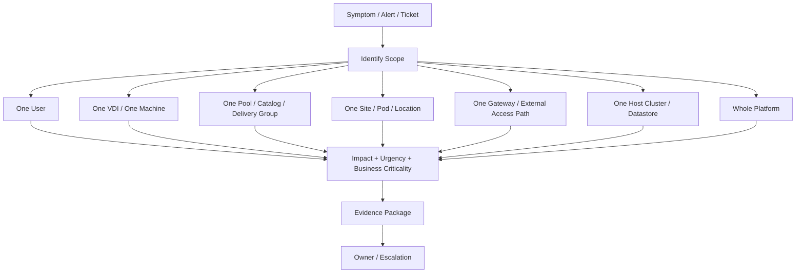

# VDI Incident Classification Guide

## 0. Document Control

| Trường | Giá trị |
|---|---|
| Thứ tự | 17 |
| Tên tài liệu | VDI Incident Classification Guide |
| Tên file | 17_VDI_Incident_Classification_Guide.md |
| Mục đích tài liệu | Hướng dẫn phân loại incident theo phạm vi ảnh hưởng như một user, một VDI, một pool, một catalog, một site, một gateway, một host cluster hoặc toàn bộ nền tảng. |
| Nguồn điều khiển | [[sources/vdi-training-idea]], [[sources/vdi-documentation-list-context]] |
| Trạng thái | Bản đào tạo vận hành. Priority matrix, SLA, business criticality, escalation path, owner và incident tool thật là Need Customer Confirmation. |

### 0.1 Source Grounding

| Nội dung | Nguồn sử dụng | Mức độ tin cậy | Ghi chú |
|---|---|---|---|
| Bối cảnh VDI quy mô 1500 đến hơn 2000 máy, cần phân tích theo lớp identity, broker, gateway, hypervisor, storage, network, monitoring và support | [[sources/vdi-training-idea]] | High | Dùng làm khung phân loại incident theo phạm vi và lớp lỗi. |
| Tên tài liệu, tên file và mục đích | [[sources/vdi-documentation-list-context]] | High | Source of truth cho scope tài liệu. |
| Khái niệm incident management, monitoring, daily operations và evidence | [[concepts/incident-management]], [[concepts/monitoring-and-logs]], [[concepts/daily-operations]], [[topics/15_VDI_Monitoring_and_Alerting_Guide]], [[topics/16_Daily_Operations_Checklist]] | Medium | Dùng để nối alert/checklist thành incident có phân loại. |
| Horizon/Citrix access, broker, gateway, pool/catalog và registration dependency | [[sources/horizon-8-architecture]], [[sources/understand-and-troubleshoot-horizon-connections]], [[sources/citrix-virtual-apps-and-desktops-7-2603]] | Medium | Dùng để phân biệt incident theo pool, catalog, gateway, broker và agent. |
| Hypervisor, storage, network và profile dependency | [[sources/vmware-vsphere-8-0]], [[sources/xenserver-8-4]], [[sources/fslogix-documentation]] | Medium | Dùng để phân loại incident host cluster, datastore, profile hoặc hạ tầng. |

### 0.2 In Scope

- Phân loại incident VDI theo phạm vi ảnh hưởng: một user, một VDI, một pool, một catalog, một site, một gateway, một host cluster hoặc toàn bộ nền tảng.
- Phân biệt impact, urgency và priority trong bối cảnh VDI.
- Gợi ý priority theo tình huống vận hành, không thay thế SLA chính thức của khách hàng.
- Chỉ ra evidence cần có cho từng loại incident.
- Hướng dẫn escalation đúng owner: VDI platform, identity, network, storage, hypervisor, security, application hoặc customer/business owner.

### 0.3 Out of Scope

- Không thay thế quy trình ITSM/SLA chính thức của khách hàng.
- Không quyết định priority cuối cùng nếu khách hàng có ma trận priority riêng.
- Không đi sâu từng bước xử lý kỹ thuật; xem [[topics/18_VDI_Troubleshooting_Playbook]].
- Không thay thế monitoring hoặc daily checklist; xem [[topics/15_VDI_Monitoring_and_Alerting_Guide]] và [[topics/16_Daily_Operations_Checklist]].
- Không yêu cầu secret, password, token hoặc credential.

## 1. Vì sao phân loại incident quan trọng

Trong VDI, cùng một triệu chứng "không vào được desktop" có thể là:

- Một user nhập sai quyền hoặc thiếu entitlement.
- Một desktop bị lỗi Agent/VDA.
- Một pool thiếu máy available.
- Một Machine Catalog bị lỗi image.
- Một gateway làm toàn bộ user bên ngoài không vào được.
- Một host cluster hoặc datastore gây chậm hàng trăm VDI.
- Toàn bộ broker/site không hoạt động.

Nếu phân loại sai, engineer có thể xử lý quá nhẹ một sự cố nền tảng hoặc nâng quá cao một lỗi cá nhân. Phân loại đúng giúp:

- Ưu tiên đúng.
- Gọi đúng owner.
- Thu evidence đúng.
- Tránh escalation vòng lặp.
- Giảm thời gian khôi phục.
- Tạo báo cáo incident rõ ràng.

## 2. Ba câu hỏi phân loại đầu tiên

Khi nhận ticket, alert hoặc phản ánh user, hỏi theo thứ tự:

1. **Ai bị ảnh hưởng?** Một user, nhiều user, một nhóm business, user nội bộ, user bên ngoài hay toàn bộ?
2. **Resource nào bị ảnh hưởng?** Một VDI, một desktop pool, một Machine Catalog, một Delivery Group, một application pool, một gateway, một host cluster, một datastore hay toàn nền tảng?
3. **Lỗi xảy ra ở đoạn nào?** Login, resource visibility, launch, session, performance, profile, app, disconnect hay backend?

Không nên bắt đầu bằng "reboot máy nào?" trước khi trả lời ba câu hỏi này.

## 3. Mô hình phân loại incident theo phạm vi

## 4. Incident scope categories

### 4.1 Một user

Ví dụ:

- Một user không thấy desktop/app.
- Một user login fail.
- Một user profile lỗi.
- Một user in không được.

Kiểm tra chính:

- User account.
- AD group/entitlement.
- Endpoint/client.
- User session.
- Profile của user.
- User-specific policy.

Evidence:

- Username, timestamp, endpoint, access path.
- Screenshot lỗi.
- Resource expected.
- AD group/entitlement evidence.
- Session/profile evidence nếu có.

Không nâng thành incident lớn nếu chưa có pattern nhiều user hoặc service impact.

### 4.2 Một VDI hoặc một machine

Ví dụ:

- Một desktop Horizon Agent unreachable.
- Một Citrix VDA unregistered.
- Một VM powered off.
- Một VDI boot lỗi.

Kiểm tra chính:

- VM power state.
- Agent/VDA service.
- Registration state.
- Recent image/policy/security change.
- Host/datastore nếu nhiều máy cùng host cũng lỗi.

Evidence:

- Machine name.
- Pool/catalog.
- Registration state.
- VM state.
- Agent/VDA log hoặc event.
- User/session impact.

Nếu nhiều machine cùng pattern, nâng scope lên pool/catalog/host.

### 4.3 Một pool, catalog hoặc Delivery Group

Ví dụ:

- Một Horizon desktop pool không đủ available desktops.
- Một Citrix Machine Catalog có nhiều VDA unregistered.
- Một Delivery Group launch fail hàng loạt.
- Một application pool mất app.

Kiểm tra chính:

- Pool/catalog/DG availability.
- Entitlement/user group.
- Agent/VDA registration trend.
- Image version/recent change.
- Capacity, maintenance mode, powered off.
- Broker failed session.

Evidence:

- Pool/catalog/DG name.
- Affected machine count.
- Affected user group.
- Failed session trend.
- Registration chart.
- Change ID nếu có.

Đây thường là incident mức medium/high tùy business impact và số user.

### 4.4 Một site, pod hoặc location

Ví dụ:

- User ở một site không launch được.
- Một location bị login chậm.
- Một pod Horizon có Connection Server issue.
- Một site CVAD có Gateway/StoreFront path lỗi.

Kiểm tra chính:

- Site/location network.
- DNS/local resolver.
- Gateway/LB nếu site dùng path riêng.
- Broker node/pod.
- WAN/MPLS/VPN nếu có.
- User distribution.

Evidence:

- Site/location.
- Affected users.
- Internal/external comparison.
- Network latency/packet loss.
- Broker/gateway event.
- Ticket pattern.

### 4.5 Một gateway hoặc external access path

Ví dụ:

- User ngoài không đăng nhập được.
- External user thấy resource nhưng launch timeout.
- Certificate warning trên gateway.
- Một LB member down.

Kiểm tra chính:

- UAG/Citrix Gateway health.
- Load balancer member.
- Certificate.
- Firewall/NAT.
- MFA/IdP path nếu có.
- Secondary/display protocol.
- Internal user có bị không.

Evidence:

- External URL/path.
- Error screenshot.
- Gateway/LB/cert status.
- Internal vs external comparison.
- Timestamp and affected user count.

External access outage thường có urgency cao vì nhiều user remote bị chặn.

### 4.6 Một host cluster, datastore hoặc storage path

Ví dụ:

- Nhiều VDI trên cùng cluster chậm.
- Datastore gần đầy.
- Storage latency cao.
- Profile share unavailable.
- Snapshot growth làm datastore tăng nhanh.

Kiểm tra chính:

- Host/cluster health.
- Datastore capacity/latency.
- VM distribution.
- Profile storage.
- Recent snapshot/image/provisioning change.
- Impact tới pool/catalog.

Evidence:

- Cluster/datastore/share name.
- Affected VM/pool list.
- Capacity/latency chart.
- Host alerts.
- Snapshot/profile growth.

Storage/host incident thường cần escalation nhanh vì ảnh hưởng lan rộng.

### 4.7 Toàn bộ nền tảng

Ví dụ:

- Tất cả user không login được.
- Broker/control plane down.
- Site DB hoặc license service ảnh hưởng launch toàn nền.
- AD/DNS outage ảnh hưởng cả Horizon và Citrix.
- Network core/storage core outage.

Kiểm tra chính:

- Broker/control plane.
- Identity/AD/DNS.
- Gateway/access.
- License.
- Shared storage/network.
- Recent major change.

Evidence:

- Service health dashboard.
- Affected platform.
- Number of affected users/sessions.
- Timeline.
- Related alerts.
- Change/event history.

Đây thường là major incident hoặc critical incident theo quy trình khách hàng.

## 5. Impact, urgency và priority

### 5.1 Impact

Impact trả lời: **ảnh hưởng rộng đến đâu và quan trọng thế nào?**

| Impact | Mô tả trong VDI |
|---|---|
| Low | Một user hoặc một VDI, có workaround, không ảnh hưởng business critical. |
| Medium | Một nhóm user, một pool nhỏ, một app không critical, impact giới hạn. |
| High | Một pool/catalog/site/gateway hoặc business group quan trọng bị ảnh hưởng. |
| Critical | Toàn bộ nền tảng, nhiều site, access path chính, storage/broker/identity core bị ảnh hưởng. |

### 5.2 Urgency

Urgency trả lời: **cần xử lý nhanh đến mức nào?**

| Urgency | Dấu hiệu |
|---|---|
| Low | Có workaround, không trong giờ critical, không tăng nhanh. |
| Medium | Ảnh hưởng công việc nhưng chưa lan rộng, có owner xử lý. |
| High | Đang tăng nhanh, trong giờ cao điểm, ảnh hưởng nhóm vận hành quan trọng. |
| Critical | Không có workaround, outage diện rộng, SLA/business critical bị đe dọa. |

### 5.3 Priority đề xuất

| Priority | Gợi ý dùng khi | Ví dụ |
|---|---|---|
| P1/Critical | Outage lớn hoặc nền tảng chính không hoạt động | Broker/site down, external access toàn bộ lỗi, datastore critical full |
| P2/High | Ảnh hưởng một pool/catalog/site/gateway hoặc nhóm user quan trọng | Machine Catalog unregistered hàng loạt, one gateway down, login chậm diện rộng |
| P3/Medium | Ảnh hưởng giới hạn, workaround có thể có | Một nhóm nhỏ không thấy app, một pool non-critical thiếu capacity |
| P4/Low | Một user/một desktop, không critical | Một user profile lỗi, một VDI cần kiểm tra |

Priority thật phải theo SLA khách hàng. Bảng này là khung đào tạo để engineer suy nghĩ đúng.

## 6. Bảng phân loại nhanh

| Triệu chứng | Scope ban đầu | Priority thường gặp | Evidence đầu tiên | Escalation chính |
|---|---|---|---|---|
| Một user không thấy desktop | Một user | P4/P3 | User, AD group, entitlement, screenshot | Identity/VDI platform nếu cần |
| Một VDI unregistered | Một machine | P4/P3 | Machine, pool/catalog, registration, VM state | VDI platform/hypervisor |
| Nhiều VDI unregistered cùng pool/catalog | Pool/catalog | P2/P1 nếu critical | Registration trend, image/change ID | VDI platform/image/security |
| User external không launch được, internal OK | Gateway/access path | P2/P1 | Internal/external comparison, gateway/LB/cert | Network/platform/security |
| Một site login chậm | Site/location | P2/P3 | Site, user count, latency, login duration | Network/identity/storage |
| Datastore gần đầy | Datastore/storage | P2/P1 nếu gần full | Capacity chart, affected pools | Storage/platform |
| Broker service down | Platform/control plane | P1/P2 | Service health, affected users | VDI platform |
| License limit chạm ngưỡng | License/platform | P2/P1 nếu launch fail | License usage/error | Platform/vendor/customer owner |
| Profile share unavailable | Profile/storage | P1/P2 | Profile errors, share status, user count | Storage/profile owner |

## 7. Classification workflow

### 7.1 Detect

Nguồn phát hiện:

- User ticket.
- Alert monitoring.
- Daily checklist.
- Post-change check.
- Helpdesk escalation.
- Business owner report.

### 7.2 Normalize symptom

Chuyển lời user thành nhóm triệu chứng kỹ thuật:

- Login fail.
- Không thấy desktop/app.
- Launch fail.
- Agent/VDA unregistered.
- Login chậm.
- Black screen.
- Disconnect.
- Profile issue.
- App issue.
- Printing/USB/clipboard issue.

### 7.3 Determine scope

Hỏi:

- Bao nhiêu user?
- Cùng pool/catalog/site không?
- Internal hay external?
- Horizon hay Citrix?
- Một host/datastore/network path chung không?
- Sau change nào không?

### 7.4 Assign priority

Dựa trên:

- Impact.
- Urgency.
- Business criticality.
- SLA.
- Workaround.
- Growth trend.

### 7.5 Route owner

Không phải mọi incident VDI đều thuộc VDI platform team. Route đúng lớp:

- Entitlement/AD group: identity hoặc VDI platform tùy RACI.
- Broker/Connection Server/Delivery Controller: VDI platform.
- Gateway/LB/firewall/certificate: network/platform/security tùy ownership.
- Agent/VDA registration: VDI platform, image, identity, network hoặc security tùy evidence.
- Host/HCI/hypervisor: infrastructure/hypervisor owner.
- Datastore/profile storage: storage/profile owner.
- App backend: application owner.

### 7.6 Reclassify

Incident classification có thể thay đổi. Một ticket P4 của một user có thể thành P2 nếu phát hiện 100 user cùng lỗi. Ngược lại, một alert ban đầu tưởng P2 có thể hạ xuống P4 nếu chỉ là một machine isolated.

## 8. Evidence package theo loại incident

| Loại incident | Evidence bắt buộc | Evidence bổ sung |
|---|---|---|
| Một user | Username, timestamp, screenshot, endpoint, access path, expected resource | AD group, entitlement, profile log |
| Một VDI | Machine name, pool/catalog, registration state, power state, user impact | Agent/VDA log, event log, host/datastore |
| Pool/catalog/DG | Resource name, affected count, registration/session trend, failed sessions | Image version, maintenance mode, recent change |
| Site/location | Location, affected users, internal/external result, latency/DNS evidence | WAN/firewall/LB logs nếu có |
| Gateway | External path, gateway/LB status, cert info, internal comparison | Auth/MFA logs, firewall evidence |
| Host cluster | Host/cluster name, affected VM list, CPU/memory/health chart | vCenter/XenServer task log, datastore/network correlation |
| Storage/profile | Datastore/share name, capacity/latency/profile error, affected pool/user count | Snapshot list, profile logs, file lock/permission |
| Whole platform | Platform, affected user count, service dashboard, timeline, related alerts | Change calendar, executive/business impact |

## 9. Escalation decision

Escalate ngay khi:

- Impact nhiều user hoặc business critical.
- Scope vượt quyền xử lý của ca trực.
- Cần owner hạ tầng khác.
- Cần change/rollback.
- Có rủi ro dữ liệu hoặc security.
- SLA sắp vi phạm.
- Không đủ quyền xem log/dashboard cần thiết.
- Incident không có owner rõ.

Không escalation bằng câu "VDI lỗi, nhờ kiểm tra". Escalation tốt phải có:

- Symptom chuẩn hóa.
- Scope.
- Impact.
- Evidence.
- Đã kiểm tra gì.
- Cần owner làm gì tiếp.
- Mức ưu tiên đề xuất.

## 10. Monitoring và chỉ số hỗ trợ phân loại

| Chỉ số | Giúp phân loại gì |
|---|---|
| Failed session | Launch/session issue theo pool/catalog/platform |
| Registered/unregistered VDI | Agent/VDA/pool/catalog health |
| Active/disconnected session | User impact và network/session trend |
| Pool/catalog availability | Capacity và resource readiness |
| Gateway health | External access scope |
| Broker service health | Control plane scope |
| Host CPU/memory/health | Cluster hoặc host-level impact |
| Datastore capacity/latency | Storage/profile/performance scope |
| Network latency/packet loss | Site/path/user location scope |
| Login duration/profile load time | Profile/GPO/storage/identity impact |
| License usage | Launch failure hoặc platform capacity |

## 11. Change liên quan incident

Mọi incident cần hỏi: **có change gần đây không?**

Các change thường liên quan incident VDI:

- Image update.
- Agent/VDA/Horizon Agent update.
- Entitlement/AD group change.
- Policy change.
- Gateway/certificate/LB change.
- Firewall/network change.
- Host maintenance.
- Storage expansion/snapshot cleanup.
- Profile solution change.
- Broker/Controller/Connection Server patch.

Nếu incident xuất hiện sau change:

- Ghi change ID.
- Lấy baseline trước/sau.
- Xác định rollback condition.
- Gọi change owner.
- Không tiếp tục rollout nếu impact tăng.

## 12. Scenario Based Learning

### Scenario 1: Một user không thấy desktop

**Bối cảnh:** Một user mới onboard báo không thấy desktop Horizon.

**Câu hỏi cho học viên:**

- Scope hiện tại là gì?
- Priority ban đầu nên là gì?
- Evidence nào cần lấy?

**Gợi ý phân tích:** Ban đầu là một user, khả năng entitlement/AD group. Chưa nên nâng thành incident lớn nếu không có pattern.

**Hướng xử lý đề xuất:** Lấy screenshot, expected pool, AD group, entitlement, recent onboarding. Nếu phát hiện nhiều user mới cũng lỗi, reclassify.

**Evidence cần lưu:** User, group, pool, entitlement, timestamp, screenshot.

### Scenario 2: Một Catalog Citrix có 40% VDA unregistered

**Bối cảnh:** Sau image update, nhiều VDA trong cùng Machine Catalog unregistered.

**Câu hỏi cho học viên:**

- Scope là một VDI hay catalog?
- Priority có thể là gì?
- Owner nào cần tham gia?

**Gợi ý phân tích:** Scope là catalog/pool, liên quan image/VDA/security/DNS. Nếu user impact lớn, có thể P2 hoặc P1 tùy business criticality.

**Hướng xử lý đề xuất:** Dừng rollout, thu registration trend, image/change ID, VDA logs, failed sessions. Escalate VDI platform/image/security nếu cần.

**Evidence cần lưu:** Catalog, affected count, change ID, registration chart, failed session trend.

### Scenario 3: External users không launch được

**Bối cảnh:** Internal user hoạt động bình thường, external users qua gateway launch timeout.

**Câu hỏi cho học viên:**

- Scope nên phân loại là gì?
- Tại sao không phải một pool issue trước?
- Escalation cần gửi ai?

**Gợi ý phân tích:** Scope là gateway/external access path. Cần kiểm tra UAG/Citrix Gateway, LB, certificate, firewall, secondary protocol.

**Hướng xử lý đề xuất:** Mở incident theo external access, thu internal/external comparison, gateway/LB/cert evidence và escalate network/platform owner.

**Evidence cần lưu:** External URL/path, user count, error, gateway/LB status, timestamp.

### Scenario 4: Storage latency làm login chậm nhiều pool

**Bối cảnh:** Nhiều pool Horizon và Citrix đều login chậm, storage latency tăng trong cùng thời điểm.

**Câu hỏi cho học viên:**

- Đây là incident theo platform nào?
- Scope có thể là storage/shared dependency không?
- Priority nên đánh thế nào?

**Gợi ý phân tích:** Vì cả Horizon và Citrix bị ảnh hưởng, nguyên nhân có thể là shared storage/profile/identity/network, không phải riêng một broker. Scope là shared infrastructure.

**Hướng xử lý đề xuất:** Mở incident theo storage/shared dependency, thu latency chart, affected pools, login duration, profile logs và escalate storage owner.

**Evidence cần lưu:** Storage chart, affected platforms, login samples, ticket trend, time window.

## 13. Bài tập tư duy

### Bài tập 1: Phân loại scope

Phân loại các tình huống sau:

- Một user profile lỗi.
- 30 user trong cùng site disconnect.
- Một Horizon pool Agent unreachable hàng loạt.
- Tất cả external users không launch được.
- Datastore chứa nhiều VDI đạt 95%.
- Một app published lỗi backend.

Với mỗi tình huống, ghi scope, priority đề xuất, owner và evidence.

### Bài tập 2: Reclassify incident

Một ticket ban đầu là P4 "một user không thấy desktop". Sau 20 phút, helpdesk báo 60 user mới onboard đều không thấy resource. Hãy viết lại classification, priority và escalation.

### Bài tập 3: Evidence package

Thiết kế evidence package cho incident "one gateway external access failure" và "one host cluster performance issue".

### Bài tập 4: Owner routing

Với 10 triệu chứng VDI, xác định owner chính: VDI platform, identity, network, storage, hypervisor, security, app hoặc customer owner.

## 14. Knowledge Check

### Câu 1

**Phân loại incident theo scope để làm gì?**

**Đáp án:** Để hiểu phạm vi ảnh hưởng, priority, owner, evidence và escalation đúng, tránh xử lý lỗi nền tảng như lỗi cá nhân.

### Câu 2

**Một user không thấy desktop thường bắt đầu ở scope nào?**

**Đáp án:** Một user, cần kiểm tra entitlement, AD group, portal/pod và resource expected trước.

### Câu 3

**Nhiều VDA unregistered trong cùng Catalog nên phân loại thế nào?**

**Đáp án:** Incident theo catalog/pool, có thể liên quan image, VDA, DNS/AD, security hoặc network.

### Câu 4

**External user lỗi nhưng internal user bình thường gợi ý scope nào?**

**Đáp án:** Gateway hoặc external access path.

### Câu 5

**Impact khác urgency thế nào?**

**Đáp án:** Impact là mức độ ảnh hưởng rộng/quan trọng; urgency là mức cần xử lý nhanh.

### Câu 6

**Khi nào cần reclassify incident?**

**Đáp án:** Khi scope, affected count, business impact, trend hoặc evidence mới thay đổi so với phân loại ban đầu.

### Câu 7

**Incident storage latency ảnh hưởng cả Horizon và Citrix nên nghĩ gì?**

**Đáp án:** Nghĩ tới shared dependency như storage/profile/network/identity, không chỉ một nền tảng.

### Câu 8

**Escalation tốt cần có gì?**

**Đáp án:** Symptom chuẩn hóa, scope, impact, evidence, checks đã làm, owner cần làm gì và priority đề xuất.

### Câu 9

**Vì sao recent change luôn cần hỏi?**

**Đáp án:** Vì nhiều incident VDI xảy ra sau image, policy, gateway, network, storage, entitlement hoặc patch change.

### Câu 10

**Nếu SLA và priority matrix chưa có thì ghi gì?**

**Đáp án:** Ghi Need Customer Confirmation và dùng bảng priority trong tài liệu như khung đào tạo, không phải quyết định chính thức.

## 15. Hiểu nhầm thường gặp

| Hiểu nhầm | Vì sao sai | Cách nghĩ đúng |
|---|---|---|
| User báo lỗi VDI thì luôn là một incident giống nhau | VDI có nhiều scope khác nhau từ user đến toàn platform. | Phân loại theo affected scope trước. |
| Một alert đỏ luôn là P1 | Priority phụ thuộc impact, urgency, business criticality và SLA. | Dùng alert làm input, không làm kết luận. |
| Một user lỗi không cần evidence | Lỗi nhỏ vẫn có thể là dấu hiệu đầu của pattern lớn. | Lưu evidence tối thiểu và theo dõi pattern. |
| External issue do desktop lỗi | External-only thường liên quan gateway/LB/firewall/cert/protocol. | So sánh internal/external trước. |
| Storage issue thuộc storage team nên VDI không cần làm gì | VDI engineer phải cung cấp impact, affected pool và user evidence. | Escalate với ngữ cảnh VDI rõ ràng. |
| Priority đã đặt thì không đổi | Incident có thể mở rộng hoặc thu hẹp. | Reclassify khi có evidence mới. |

## 16. Field Checklist

### 16.1 Classification checklist

- [ ] Ghi symptom chuẩn hóa.
- [ ] Xác định affected user count.
- [ ] Xác định affected resource: user, VDI, pool, catalog, site, gateway, host cluster, platform.
- [ ] Xác định Horizon, Citrix hay shared dependency.
- [ ] Xác định internal/external path.
- [ ] Kiểm tra recent change.
- [ ] Xác định business criticality.
- [ ] Đề xuất impact, urgency, priority.
- [ ] Xác định owner/escalation.
- [ ] Lưu evidence ban đầu.

### 16.2 Reclassification checklist

- [ ] Affected user count thay đổi?
- [ ] Scope mở rộng sang pool/site/platform?
- [ ] Có business group critical bị ảnh hưởng?
- [ ] Có alert/metric mới?
- [ ] Có change liên quan mới phát hiện?
- [ ] Workaround còn hiệu lực không?
- [ ] SLA có nguy cơ vi phạm không?
- [ ] Priority/owner cần đổi không?

### 16.3 Evidence checklist

- [ ] Ticket/alert ID.
- [ ] Timestamp/time window.
- [ ] User/resource/object.
- [ ] Screenshot/error.
- [ ] Dashboard/metric.
- [ ] Log/event nếu có.
- [ ] Recent change.
- [ ] Scope và affected count.
- [ ] Checks đã làm.
- [ ] Owner và next action.

## 17. Need Customer Confirmation

| Nhóm | Câu hỏi cần xác nhận | Vì sao cần |
|---|---|---|
| Priority matrix | Khách hàng dùng P1/P2/P3/P4 hay mức khác? Tiêu chí là gì? | Đồng bộ phân loại incident chính thức. |
| SLA/OLA | SLA theo priority và service là gì? | Đánh urgency và breach risk. |
| Business criticality | Pool/catalog/site/user group nào là critical? | Impact không chỉ dựa số lượng user. |
| Escalation path | Owner cho VDI platform, identity, network, storage, hypervisor, security, app là ai? | Route đúng nhóm. |
| Incident tool | Tool ticket/incident và trường bắt buộc là gì? | Ghi incident đúng chuẩn. |
| Major incident process | Khi nào kích hoạt major incident/war room? | Xử lý outage lớn. |
| Communication | Ai gửi thông báo user/business, chu kỳ cập nhật bao lâu? | Tránh thông tin rời rạc. |
| Monitoring source | Dashboard nào là source of truth cho impact? | Tránh tranh luận số liệu. |
| Change calendar | Nơi kiểm tra recent change là gì? | Correlate incident với change. |
| Evidence retention | Evidence lưu ở đâu, retention bao lâu? | RCA và audit. |
| Customer owner | Ai quyết định impact business và workaround? | Priority cần bối cảnh nghiệp vụ. |

## 18. Related Wiki Links

### Source pages

- [[sources/vdi-training-idea]]
- [[sources/vdi-documentation-list-context]]
- [[sources/horizon-8-architecture]]
- [[sources/understand-and-troubleshoot-horizon-connections]]
- [[sources/citrix-virtual-apps-and-desktops-7-2603]]
- [[sources/vmware-vsphere-8-0]]
- [[sources/xenserver-8-4]]
- [[sources/fslogix-documentation]]

### Concept pages

- [[concepts/incident-management]]
- [[concepts/monitoring-and-logs]]
- [[concepts/daily-operations]]
- [[concepts/vdi-connection-flow]]
- [[concepts/vdi-operational-readiness]]
- [[concepts/omnissa-horizon]]
- [[concepts/citrix-virtual-apps-and-desktops]]
- [[concepts/connection-server]]
- [[concepts/delivery-controller]]
- [[concepts/unified-access-gateway]]
- [[concepts/storefront]]
- [[concepts/virtual-delivery-agent]]
- [[concepts/delivery-group]]
- [[concepts/vcenter-server]]
- [[concepts/esxi]]
- [[concepts/xenserver]]
- [[concepts/datastore]]
- [[concepts/storage-repository]]
- [[concepts/profile-container]]
- [[concepts/identity-and-access-management]]

### Topic pages nên đọc tiếp

- [[topics/5_VDI_Access_Flow_Design]]: phân biệt lỗi internal/external và đoạn access flow.
- [[topics/13_Citrix_Machine_Catalog_and_Delivery_Group_Guide]]: phân loại incident theo Catalog/Delivery Group/VDA.
- [[topics/14_Omnissa_Desktop_Pool_and_Entitlement_Guide]]: phân loại incident theo pool/entitlement/Agent.
- [[topics/15_VDI_Monitoring_and_Alerting_Guide]]: dùng metric hỗ trợ classification.
- [[topics/16_Daily_Operations_Checklist]]: chuyển phát hiện hằng ngày thành incident.
- [[topics/18_VDI_Troubleshooting_Playbook]]: xử lý theo symptom sau khi đã phân loại.
- [[topics/25_VDI_Support_and_Escalation_Guide]]: escalation và communication.

## 19. Summary for Learners

Incident classification là bước biến triệu chứng thành quyết định vận hành. Engineer cần biết incident đang ảnh hưởng một user, một VDI, một pool/catalog, một site, một gateway, một host cluster hay toàn bộ nền tảng. Sau đó mới quyết định priority, owner và hướng xử lý.

Thứ tự phân loại khuyến nghị:

1. Chuẩn hóa symptom.
2. Xác định affected users/resources.
3. Xác định scope: user, VDI, pool, catalog, site, gateway, host cluster, datastore hoặc platform.
4. Xác định Horizon, Citrix hay shared dependency.
5. Kiểm tra internal/external và recent change.
6. Đánh impact, urgency và priority đề xuất.
7. Thu evidence theo scope.
8. Escalate đúng owner.
9. Reclassify khi có evidence mới.

Điều cần nhớ nhất: phân loại đúng không làm incident tự hết, nhưng nó giúp cả đội xử lý đúng chỗ ngay từ đầu.

