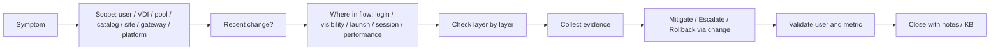

# VDI Troubleshooting Playbook

## 0. Document Control

| Trường | Giá trị |
|---|---|
| Thứ tự | 18 |
| Tên tài liệu | VDI Troubleshooting Playbook |
| Tên file | 18_VDI_Troubleshooting_Playbook.md |
| Mục đích tài liệu | Cung cấp playbook xử lý lỗi phổ biến như login fail, không thấy desktop, launch fail, VDA unregistered, Horizon Agent unreachable, login chậm, black screen, disconnect và profile issue. |
| Nguồn điều khiển | [[sources/vdi-training-idea]], [[sources/vdi-documentation-list-context]] |
| Trạng thái | Bản đào tạo vận hành. Log path, tool monitoring, topology, version, SLA, owner và command/SOP cụ thể là Need Customer Confirmation. |

### 0.1 Source Grounding

| Nội dung | Nguồn sử dụng | Mức độ tin cậy | Ghi chú |
|---|---|---|---|
| Bối cảnh VDI quy mô 1500 đến hơn 2000 máy, cần troubleshoot theo lớp identity, broker, gateway, agent, hypervisor, storage, network, profile và operation | [[sources/vdi-training-idea]] | High | Dùng làm khung xử lý lỗi theo lớp. |
| Tên tài liệu, tên file và mục đích | [[sources/vdi-documentation-list-context]] | High | Source of truth cho scope. |
| Horizon troubleshooting: primary/secondary protocol, internal/external flow, UAG, firewall, certificate, load balancing, Blast và Connection Server | [[sources/horizon-8-architecture]], [[sources/understand-and-troubleshoot-horizon-connections]], [[concepts/connection-server]], [[concepts/unified-access-gateway]], [[concepts/blast-extreme]], [[concepts/primary-and-secondary-protocols]] | High | Dùng cho playbook Horizon Agent unreachable, black screen, external launch fail. |
| Citrix troubleshooting: Delivery Controller, StoreFront, VDA, Site DB, HDX, ICA virtual channel, Machine Catalog, Delivery Group | [[sources/citrix-virtual-apps-and-desktops-7-2603]], [[concepts/delivery-controller]], [[concepts/storefront]], [[concepts/virtual-delivery-agent]], [[concepts/hdx]], [[concepts/ica-virtual-channel]], [[concepts/delivery-group]] | High | Dùng cho playbook VDA unregistered, launch fail, session/HDX issue. |
| Monitoring, incident classification, daily operations và profile/storage dependency | [[topics/15_VDI_Monitoring_and_Alerting_Guide]], [[topics/16_Daily_Operations_Checklist]], [[topics/17_VDI_Incident_Classification_Guide]], [[sources/fslogix-documentation]], [[concepts/monitoring-and-logs]], [[concepts/profile-container]] | Medium | Dùng để xác định evidence, scope và profile/login chậm. |

### 0.2 In Scope

- Playbook xử lý các lỗi phổ biến: login fail, không thấy desktop/app, launch fail, VDA unregistered, Horizon Agent unreachable, login chậm, black screen, disconnect và profile issue.
- Hướng dẫn kiểm tra theo thứ tự: scope, recent change, access path, entitlement, broker, agent, identity, hypervisor, storage, network, profile.
- Evidence cần thu thập trước khi kết luận hoặc escalation.
- Điều kiện dừng xử lý tại chỗ và chuyển owner.
- Scenario, bài tập tư duy và knowledge check cho system engineer.

### 0.3 Out of Scope

- Không thay thế SOP chi tiết theo tool hoặc version cụ thể của khách hàng.
- Không đưa lệnh reset, xóa, restart hàng loạt hoặc rollback production nếu chưa có approval/change.
- Không thay thế tài liệu incident classification; xem [[topics/17_VDI_Incident_Classification_Guide]].
- Không thay thế tài liệu monitoring; xem [[topics/15_VDI_Monitoring_and_Alerting_Guide]].
- Không yêu cầu secret, password, token hoặc credential.

## 1. Cách dùng playbook này

Playbook này dùng khi có ticket, alert hoặc sự cố VDI. Engineer không cần đọc từ đầu đến cuối khi đang xử lý incident. Hãy:

1. Chuẩn hóa symptom.
2. Chọn playbook tương ứng.
3. Xác định scope trước.
4. Lưu evidence trước khi action.
5. Kiểm tra theo thứ tự.
6. Escalate đúng owner nếu vượt phạm vi.

Nguyên tắc quan trọng: **không khẳng định root cause nếu chưa có evidence**. Ghi "probable cause" nếu chỉ có dấu hiệu.

## 2. Troubleshooting model chung

### 2.1 Thứ tự kiểm tra mặc định

| Bước | Câu hỏi | Vì sao quan trọng |
|---|---|---|
| 1 | Một user hay nhiều user? | Quyết định scope và priority. |
| 2 | Horizon, Citrix hay cả hai? | Phân biệt platform-specific và shared dependency. |
| 3 | Internal hay external? | Chỉ external thường liên quan gateway/LB/firewall/cert. |
| 4 | Lỗi ở login, visibility, launch hay session? | Mỗi đoạn có lớp kiểm tra khác nhau. |
| 5 | Có recent change không? | Image, policy, network, gateway, patch thường gây lỗi hàng loạt. |
| 6 | Có alert/metric cùng thời điểm không? | Correlation giúp tránh đoán mò. |
| 7 | Evidence đủ chưa? | Không action rủi ro khi thiếu bằng chứng. |

### 2.2 Những việc không nên làm vội

- Không reboot/reset desktop trước khi lưu evidence.
- Không mở entitlement/policy rộng để "test nhanh".
- Không bỏ qua internal/external comparison.
- Không kết luận do network/storage/identity nếu chưa có metric/log.
- Không xóa snapshot/profile/file hoặc sửa security tool nếu chưa có owner approval.
- Không gom nhiều symptom khác nhau vào một root cause nếu chưa có correlation.

## 3. Evidence package tối thiểu

| Nhóm evidence | Nội dung cần có |
|---|---|
| User context | User, AD group nếu biết, endpoint, location, internal/external |
| Resource context | Platform, desktop/app name, pool/catalog/DG, machine name nếu có |
| Time context | Timestamp, time window, change window |
| Symptom | Error message, screenshot, bước user đã làm |
| Monitoring | Failed session, registration, gateway/broker/session/storage/network metric |
| Logs/events | Broker/gateway/agent/profile/event log nếu có quyền |
| Change | Change ID, image/policy/network/security change gần nhất |
| Action | Đã kiểm tra gì, đã làm gì, kết quả |

## 4. Playbook: Login fail

### 4.1 Triệu chứng

- User không đăng nhập được portal/client.
- Báo sai username/password dù user tin là đúng.
- MFA loop hoặc MFA fail.
- Login internal được nhưng external fail.
- Chỉ một nhóm user login fail.

### 4.2 Kiểm tra theo thứ tự

1. Xác định scope: một user, nhóm user, một site, external-only hay toàn nền tảng.
2. Xác định platform/path: Horizon, Citrix, browser, client, internal, external.
3. Kiểm tra account state: locked, disabled, expired, group, password change gần đây.
4. Kiểm tra AD/DC/DNS/time sync nếu nhiều user.
5. Kiểm tra MFA/Conditional Access nếu có.
6. Kiểm tra gateway/certificate/LB nếu external-only.
7. Kiểm tra broker authentication event nếu vào được gateway nhưng fail ở portal/resource.
8. Kiểm tra recent identity/security/network change.

### 4.3 Evidence

- User, timestamp, access path.
- Error screenshot.
- Internal/external comparison.
- Auth failure/log nếu có.
- DC/DNS/MFA/sign-in evidence nếu owner cung cấp.
- Gateway/broker event.

### 4.4 Escalation

Escalate identity/security khi:

- Nhiều user login fail.
- MFA/Conditional Access liên quan.
- Account/group issue ngoài quyền VDI.
- DC/DNS/time sync bất thường.

Escalate network/platform khi:

- External-only.
- Gateway/LB/certificate alert.
- Browser/client path khác nhau bất thường.

## 5. Playbook: Không thấy desktop hoặc application

### 5.1 Triệu chứng

- User login được nhưng không thấy desktop/app.
- User thấy thiếu một resource.
- User thấy resource sai.
- User mới onboard không thấy app/pool.

### 5.2 Kiểm tra theo thứ tự

1. Xác định resource expected.
2. Xác định user login đúng portal/pod/site không.
3. Kiểm tra AD group membership.
4. Horizon: kiểm tra desktop/application pool entitlement.
5. Citrix: kiểm tra Delivery Group/Application Group entitlement.
6. Kiểm tra resource enabled/visible.
7. Kiểm tra AD replication/cache/resource enumeration.
8. Kiểm tra recent entitlement/policy/AD group change.

### 5.3 Không kiểm tra gì trước

Không bắt đầu bằng VDA/Agent hoặc VM power nếu user chưa thấy resource. VDA/Agent thường liên quan launch/session, không phải visibility đầu tiên.

### 5.4 Evidence

- Username, expected resource, screenshot resource list.
- AD group evidence.
- Entitlement/pool/DG/App Group mapping.
- Recent change.
- User khác cùng group có thấy không.

### 5.5 Escalation

- Identity owner nếu group membership/replication không đúng.
- VDI platform nếu entitlement/pool/DG/App Group sai.
- Security/customer owner nếu user thấy resource không được phép.

## 6. Playbook: Launch fail

### 6.1 Triệu chứng

- User thấy desktop/app nhưng bấm vào lỗi.
- Launch timeout.
- Không tạo session.
- Failed session tăng.
- External launch fail nhưng internal OK.

### 6.2 Kiểm tra theo thứ tự

1. Xác định resource đã visible và user bấm launch được.
2. Kiểm tra failed session/event trên broker.
3. Kiểm tra pool/catalog/DG availability.
4. Kiểm tra Horizon Agent hoặc Citrix VDA registration.
5. Kiểm tra VM power/maintenance state.
6. Kiểm tra license status.
7. Kiểm tra protocol path:
   - Horizon: Blast/display protocol, primary/secondary protocol, UAG nếu external.
   - Citrix: HDX/ICA path, Gateway/StoreFront nếu external.
8. Kiểm tra profile/app backend nếu app mở một phần rồi fail.
9. Kiểm tra recent image/agent/security/network change.

### 6.3 Evidence

- Error message/screenshot.
- Failed session ID/log nếu có.
- Pool/catalog/DG availability.
- Registration state.
- VM power state.
- Internal/external comparison.
- Broker/gateway/protocol evidence.

### 6.4 Escalation

- VDI platform nếu broker/pool/DG/Agent/VDA issue.
- Network/gateway nếu external-only hoặc protocol path fail.
- Storage/profile nếu launch chậm/fail đi kèm profile issue.
- License owner nếu license warning/error.

## 7. Playbook: Citrix VDA unregistered

### 7.1 Triệu chứng

- VDA unregistered trong Machine Catalog.
- Delivery Group thiếu available machines.
- Launch fail vào một catalog/DG.
- Nhiều VDA unregistered sau image/VDA update.

### 7.2 Kiểm tra theo thứ tự

1. Một machine hay nhiều machine?
2. Cùng Catalog/DG/image/host/subnet không?
3. Kiểm tra VDA service và registration state.
4. Kiểm tra Delivery Controller reachability.
5. Kiểm tra DNS resolution, time sync, domain trust.
6. Kiểm tra firewall/network path từ VDA tới Controller.
7. Kiểm tra machine power state và hypervisor task.
8. Kiểm tra security tool block.
9. Kiểm tra recent image/VDA/security update.

### 7.3 Evidence

- Machine name, Catalog, DG.
- Registration state and timeline.
- VDA log/event.
- Controller event nếu có.
- DNS/time/domain evidence.
- VM power state.
- Change ID/image version.

### 7.4 Escalation

- VDI platform/image owner nếu nhiều VDA sau update.
- Identity nếu DNS/domain/time trust.
- Network nếu path bị chặn.
- Security nếu security tool block.
- Hypervisor owner nếu VM power/host issue.

## 8. Playbook: Horizon Agent unreachable hoặc unregistered

### 8.1 Triệu chứng

- Desktop trong pool Agent unreachable/unregistered.
- Pool available giảm.
- User assigned desktop nhưng không vào được.
- Sau image update nhiều desktop không registered.

### 8.2 Kiểm tra theo thứ tự

1. Một desktop hay nhiều desktop trong cùng pool?
2. Có recent image/Horizon Agent/security change không?
3. Kiểm tra Agent service và desktop OS health.
4. Kiểm tra Connection Server reachability.
5. Kiểm tra DNS, time sync, domain trust.
6. Kiểm tra firewall/network path.
7. Kiểm tra VM power state trong vCenter/HCI.
8. Kiểm tra security tool block.
9. Kiểm tra pool provisioning/image status nếu nhiều máy.

### 8.3 Evidence

- Pool name, desktop name, user nếu assigned.
- Agent registration state.
- VM power state.
- Agent/event log.
- Connection Server event.
- Change ID/image version.
- Host/datastore nếu nhiều desktop cùng hạ tầng.

### 8.4 Escalation

- Horizon platform/image owner nếu nhiều desktop cùng pool.
- HCI/vCenter owner nếu VM/host/storage.
- Identity/network/security owner theo evidence.

## 9. Playbook: Login chậm

### 9.1 Triệu chứng

- User mất nhiều phút ở preparing desktop, loading profile, applying policy.
- Chỉ chậm đầu giờ sáng.
- Chậm trên nhiều pool/catalog.
- App mở chậm sau login.

### 9.2 Kiểm tra theo thứ tự

1. Một user hay nhiều user?
2. Chậm ở bước nào: authentication, resource enumeration, launch, profile, desktop ready, app init?
3. Kiểm tra login duration metric nếu có.
4. Kiểm tra profile loading time và profile logs.
5. Kiểm tra GPO processing/DC/DNS latency.
6. Kiểm tra storage latency/datastore/profile share.
7. Kiểm tra host CPU/memory contention.
8. Kiểm tra security scan/AV/EDR event.
9. Kiểm tra logon storm, boot storm hoặc recent change.

### 9.3 Evidence

- User samples and timestamps.
- Login duration chart.
- Profile log.
- GPO/DC/DNS evidence.
- Storage latency chart.
- Host metrics.
- Recent change.

### 9.4 Escalation

- Profile/storage owner nếu profile attach/load issue.
- Identity owner nếu GPO/DC/DNS.
- Storage/HCI owner nếu latency/resource contention.
- Security owner nếu AV/EDR scan/block.

## 10. Playbook: Black screen

### 10.1 Triệu chứng

- User launch thành công nhưng màn hình đen.
- User external black screen, internal OK.
- Black screen sau agent/image update.
- Reconnect vào session cũ bị đen.

### 10.2 Kiểm tra theo thứ tự

1. Một user hay nhiều user?
2. Internal và external có khác không?
3. Horizon: kiểm tra primary/secondary protocol, Blast, UAG, firewall, certificate, LB.
4. Citrix: kiểm tra HDX/ICA path, Gateway/StoreFront, virtual channel/display policy.
5. Kiểm tra Agent/VDA version và registration.
6. Kiểm tra display/driver/tools issue sau image update.
7. Kiểm tra VM CPU/memory/resource contention.
8. Kiểm tra network latency/packet loss.
9. Kiểm tra security tool hoặc policy chặn display/session process.

### 10.3 Evidence

- Screenshot/video nếu có.
- Internal/external comparison.
- Protocol used.
- Agent/VDA version.
- Gateway/LB/firewall evidence.
- VM resource metrics.
- Recent image/agent/network change.

### 10.4 Escalation

- Network/gateway nếu external-only.
- Platform/image owner nếu sau agent/image update.
- Hypervisor/HCI nếu resource/display driver/VM tools.
- Security owner nếu security tool block.

## 11. Playbook: Disconnect hoặc reconnect issue

### 11.1 Triệu chứng

- Session disconnect đột ngột.
- User reconnect không được.
- Disconnect tăng theo site/location.
- Disconnect chỉ với external users.
- Session bị logoff thay vì disconnected.

### 11.2 Kiểm tra theo thứ tự

1. Disconnect hay logoff?
2. Một user hay nhiều user?
3. Internal/external/site/location pattern?
4. Kiểm tra session policy: idle, disconnect, logoff timeout.
5. Kiểm tra gateway/LB/network latency/packet loss.
6. Kiểm tra client/endpoint/network location.
7. Kiểm tra broker/session event.
8. Kiểm tra Agent/VDA stability.
9. Kiểm tra host/resource contention.

### 11.3 Evidence

- Session timeline.
- User location and path.
- Active/disconnected/logoff state.
- Network latency/packet loss.
- Gateway/LB event.
- Broker/session log.
- Policy value nếu có.

### 11.4 Escalation

- Network/gateway nếu theo site/external/path.
- VDI platform nếu session policy/broker/Agent.
- Security/policy owner nếu timeout/policy change.

## 12. Playbook: Profile issue

### 12.1 Triệu chứng

- Login chậm ở profile.
- Temp profile.
- User mất setting.
- Profile không attach.
- App data không lưu.
- Một user hoặc nhiều user cùng profile share lỗi.

### 12.2 Kiểm tra theo thứ tự

1. Một user hay nhiều user?
2. Profile solution là gì? FSLogix, Citrix Profile Management, roaming profile hay Unknown.
3. Kiểm tra profile path/share availability.
4. Kiểm tra permission.
5. Kiểm tra lock/stale session.
6. Kiểm tra storage latency/capacity.
7. Kiểm tra profile log.
8. Kiểm tra recent profile/storage/GPO/security change.
9. Kiểm tra app-specific profile/data dependency.

### 12.3 Evidence

- User, timestamp, affected app/desktop.
- Profile error/screenshot.
- Profile log.
- Profile path/share status.
- Storage capacity/latency.
- Permission/lock evidence nếu có.
- Recent change.

### 12.4 Escalation

- Profile owner nếu profile tool issue.
- Storage owner nếu share/capacity/latency.
- Identity owner nếu permission/GPO.
- Application owner nếu app-specific profile data.

## 13. Cross-symptom decision table

| Symptom | Kiểm tra đầu tiên | Không nên làm vội | Evidence quan trọng |
|---|---|---|---|
| Login fail | Identity/access path | Reset desktop | Auth error, path, user scope |
| Không thấy desktop/app | Entitlement/AD group | Reboot VDI | Resource list, group, entitlement |
| Launch fail | Failed session, availability, registration | Mở policy/entitlement rộng | Failed session, pool state, registration |
| VDA unregistered | Scope and VDA/Controller path | Reboot hàng loạt | VDA log, Catalog/DG, change |
| Horizon Agent unreachable | Pool pattern, Agent/Connection Server path | Reset pool | Agent state, pool, VM state |
| Login chậm | Login phase/profile/storage/GPO | Đổ lỗi CPU ngay | Login duration, profile/storage/GPO |
| Black screen | Protocol path and agent/display | Rebuild image ngay | Internal/external, protocol, agent version |
| Disconnect | Network/session policy/path | Kết luận do user mạng yếu | Session timeline, path, packet loss |
| Profile issue | Profile path/log/storage | Xóa profile | Profile log, share status, backup/owner |

## 14. Operational escalation map

| Evidence chỉ ra | Owner thường cần tham gia |
|---|---|
| AD group, account, DC, DNS, time sync | Identity/AD team |
| MFA/Conditional Access/security policy | Security/Identity team |
| Connection Server, Delivery Controller, StoreFront, pool/catalog/DG | VDI platform team |
| UAG/Citrix Gateway/LB/certificate/firewall external | Platform/Network/Security tùy RACI |
| VDA/Horizon Agent after image update | VDI platform/Image owner/Security nếu bị block |
| vCenter/ESXi/XenServer/host/VM power | Hypervisor/HCI team |
| Datastore/SR/profile share latency/capacity | Storage/Profile owner |
| App opens but business function fails | Application owner |
| Broad outage/unclear ownership | Incident manager/duty manager |

## 15. Scenario Based Learning

### Scenario 1: User không thấy desktop sau onboarding

**Bối cảnh:** User mới login Horizon được nhưng không thấy desktop pool.

**Câu hỏi cho học viên:** Playbook nào dùng? Kiểm tra gì trước?

**Gợi ý phân tích:** Dùng playbook "không thấy desktop/app". Đây chưa phải Agent issue.

**Hướng xử lý đề xuất:** Kiểm tra expected pool, AD group, entitlement, portal/pod, recent onboarding change.

**Evidence cần lưu:** Screenshot resource list, user/group, pool entitlement, approval.

### Scenario 2: Citrix launch fail sau khi app hiện trên StoreFront

**Bối cảnh:** User thấy app trên StoreFront nhưng launch fail. Failed session tăng trong Delivery Group.

**Câu hỏi cho học viên:** Đây là visibility hay launch issue? Cần kiểm tra lớp nào?

**Gợi ý phân tích:** Resource đã hiện, nên chuyển sang launch: Delivery Group availability, VDA registration, broker event, HDX/ICA path.

**Hướng xử lý đề xuất:** Thu failed session, kiểm tra VDA state, DG capacity, StoreFront/Gateway nếu external, recent image/VDA change.

**Evidence cần lưu:** Failed session ID, DG status, VDA registration, error screenshot.

### Scenario 3: External Horizon users black screen

**Bối cảnh:** Internal users dùng bình thường. External users thấy desktop nhưng vào màn hình đen.

**Câu hỏi cho học viên:** Vì sao cần nghĩ tới secondary protocol?

**Gợi ý phân tích:** Theo nguồn Horizon troubleshooting, authentication có thể thành công nhưng display protocol thất bại do UAG/firewall/cert/external URL.

**Hướng xử lý đề xuất:** So sánh internal/external, kiểm tra UAG, LB, cert, firewall, Blast/secondary protocol path.

**Evidence cần lưu:** Internal/external test, UAG/LB/cert status, error time, affected users.

### Scenario 4: Login chậm nhiều nền tảng

**Bối cảnh:** Cả Horizon và Citrix đều login chậm đầu giờ, storage latency và profile load time tăng.

**Câu hỏi cho học viên:** Đây có phải lỗi riêng một broker không?

**Gợi ý phân tích:** Nếu cả hai nền tảng cùng chậm, cần nghĩ shared dependency như storage/profile/identity/network.

**Hướng xử lý đề xuất:** Correlate login duration, profile logs, storage latency, DC/GPO metric. Escalate storage/profile/identity theo evidence.

**Evidence cần lưu:** Login samples, storage chart, profile logs, affected platforms.

## 16. Hands On hoặc bài tập tư duy

### Bài tập 1: Chọn playbook đúng

Phân loại các ticket sau vào playbook:

- "Tôi đăng nhập được nhưng không thấy desktop."
- "App hiện nhưng bấm vào không mở."
- "Máy VDI của tôi bị màn hình đen."
- "Tôi bị văng phiên liên tục."
- "Login mất 5 phút ở loading profile."

### Bài tập 2: Evidence trước escalation

Tạo evidence package cho:

- VDA unregistered hàng loạt.
- External Horizon black screen.
- Profile attach failure nhiều user.

### Bài tập 3: Tìm layer bị bỏ sót

Một engineer xử lý launch fail bằng cách reboot 10 desktop. Hãy chỉ ra các lớp chưa kiểm tra và rủi ro mất evidence.

### Bài tập 4: Viết short runbook

Viết runbook 10 bước cho lỗi "user thấy app nhưng launch fail" dùng cho helpdesk L1/L2.

## 17. Knowledge Check

### Câu 1

**Vì sao phải xác định scope trước khi troubleshooting?**

**Đáp án:** Scope quyết định priority, lớp cần kiểm tra, owner và có cần incident/escalation hay không.

### Câu 2

**User không thấy desktop thì kiểm tra Agent/VDA trước có đúng không?**

**Đáp án:** Thường không. Cần kiểm tra entitlement, AD group, resource visibility và portal/pod trước.

### Câu 3

**User thấy resource nhưng launch fail thì kiểm tra gì?**

**Đáp án:** Failed session, pool/catalog/DG availability, Agent/VDA registration, VM power, license và protocol path.

### Câu 4

**VDA unregistered hàng loạt sau image update cần làm gì đầu tiên?**

**Đáp án:** Dừng rollout nếu còn, thu registration trend/log/change ID, so sánh image cũ/mới và chuẩn bị rollback nếu impact lớn.

### Câu 5

**Horizon external black screen gợi ý lớp nào?**

**Đáp án:** UAG, firewall, load balancer, certificate, external URL và secondary/display protocol path.

### Câu 6

**Login chậm cần phân tích theo những lớp nào?**

**Đáp án:** Profile, GPO, DC/DNS, storage, host resource, security scan, logon storm và recent change.

### Câu 7

**Disconnect khác logoff vì sao quan trọng?**

**Đáp án:** Disconnect có thể còn session để reconnect; logoff kết thúc session và có thể mất dữ liệu chưa lưu. Nguyên nhân và policy khác nhau.

### Câu 8

**Profile issue không nên xử lý bằng cách xóa profile ngay vì sao?**

**Đáp án:** Có rủi ro mất dữ liệu/user settings và mất evidence; cần backup/owner/approval/SOP.

### Câu 9

**Khi nào escalation network/gateway là hợp lý?**

**Đáp án:** Khi lỗi theo site, external-only, có packet loss/latency, gateway/LB/cert/firewall evidence hoặc protocol path fail.

### Câu 10

**Nếu chưa biết tool/log path của khách hàng thì ghi gì?**

**Đáp án:** Ghi Unknown hoặc Need Customer Confirmation và hỏi version, topology, monitoring tool, log location, owner và escalation path.

## 18. Hiểu nhầm thường gặp

| Hiểu nhầm | Vì sao sai | Cách nghĩ đúng |
|---|---|---|
| VDI lỗi thì reboot desktop trước | Reboot có thể mất evidence và không xử lý root cause. | Xác định scope và lưu evidence trước. |
| Login portal được nghĩa là session path ổn | Session/display protocol có thể fail sau authentication. | Phân biệt login, visibility, launch và session. |
| Không thấy app là do VDA/Agent | Không thấy resource thường do entitlement/AD/resource visibility. | Kiểm tra entitlement trước. |
| Black screen luôn do image | Có thể do protocol, gateway, network, display driver, security. | So sánh internal/external và recent change. |
| Login chậm là do CPU | Có thể do profile, GPO, DC, storage, security scan. | Correlate nhiều metric. |
| Profile lỗi thì xóa profile | Rủi ro mất dữ liệu và vi phạm quy trình. | Thu log, kiểm tra path/permission/lock/storage và owner. |

## 19. Field Checklist

### 19.1 Checklist chung

- [ ] Symptom đã chuẩn hóa.
- [ ] Scope đã xác định.
- [ ] Platform/path đã xác định.
- [ ] Recent change đã kiểm tra.
- [ ] Monitoring/alert đã đối chiếu.
- [ ] Evidence đã lưu.
- [ ] Playbook đúng đã chọn.
- [ ] Action trong quyền/SOP.
- [ ] Escalation owner rõ.
- [ ] Postcheck đã thực hiện.

### 19.2 Evidence checklist

- [ ] Ticket/alert ID.
- [ ] Timestamp.
- [ ] User/resource/machine.
- [ ] Pool/catalog/DG/application pool.
- [ ] Screenshot/error.
- [ ] Broker/gateway/agent/profile evidence.
- [ ] Metric timeline.
- [ ] Change ID.
- [ ] Impact and affected count.
- [ ] Next action.

## 20. Need Customer Confirmation

| Nhóm | Câu hỏi cần xác nhận | Vì sao cần |
|---|---|---|
| Version | Horizon, CVAD, Agent/VDA, vCenter/ESXi, XenServer, gateway version là gì? | Compatibility và log/console khác nhau. |
| Topology | Pod/site/Connection Server/Delivery Controller/StoreFront/UAG/Gateway/LB thiết kế ra sao? | Troubleshoot đúng path. |
| Access flow | Internal và external user đi qua những thành phần nào? | Phân biệt login/launch/protocol lỗi. |
| Monitoring tool | Dashboard nào là source of truth cho failed session, registration, profile, storage? | Thu evidence đúng. |
| Log location | Log broker/gateway/agent/profile nằm ở đâu và ai có quyền xem? | RCA và escalation. |
| Profile solution | FSLogix, Citrix Profile Management, roaming profile hay giải pháp khác? | Playbook profile chính xác. |
| Change process | Khi nào cần change/rollback approval? | Tránh action rủi ro cao. |
| Escalation path | Owner VDI, identity, network, storage, security, hypervisor, app là ai? | Chuyển đúng nhóm. |
| SLA | Priority/SLA cho từng symptom và scope là gì? | Điều phối incident đúng. |
| Known issues | Khách hàng có lỗi lặp lại hoặc workaround chuẩn nào? | Tùy biến playbook thực tế. |

## 21. Related Wiki Links

### Source pages

- [[sources/vdi-training-idea]]
- [[sources/vdi-documentation-list-context]]
- [[sources/horizon-8-architecture]]
- [[sources/understand-and-troubleshoot-horizon-connections]]
- [[sources/citrix-virtual-apps-and-desktops-7-2603]]
- [[sources/vmware-vsphere-8-0]]
- [[sources/xenserver-8-4]]
- [[sources/fslogix-documentation]]

### Concept pages

- [[concepts/vdi-connection-flow]]
- [[concepts/primary-and-secondary-protocols]]
- [[concepts/blast-extreme]]
- [[concepts/hdx]]
- [[concepts/ica-virtual-channel]]
- [[concepts/omnissa-horizon]]
- [[concepts/connection-server]]
- [[concepts/unified-access-gateway]]
- [[concepts/citrix-virtual-apps-and-desktops]]
- [[concepts/delivery-controller]]
- [[concepts/storefront]]
- [[concepts/virtual-delivery-agent]]
- [[concepts/delivery-group]]
- [[concepts/identity-and-access-management]]
- [[concepts/monitoring-and-logs]]
- [[concepts/profile-container]]
- [[concepts/user-profile-management]]
- [[concepts/datastore]]
- [[concepts/storage-repository]]
- [[concepts/firewall-ports]]
- [[concepts/load-balancing]]
- [[concepts/incident-management]]

### Topic pages nên đọc tiếp

- [[topics/5_VDI_Access_Flow_Design]]: hiểu login, visibility, launch và session flow.
- [[topics/6_Identity_and_Domain_Integration_Guide]]: xử lý identity, DNS, GPO, domain.
- [[topics/8_Storage_Operations_for_VDI]]: xử lý storage/profile/performance.
- [[topics/9_Network_Operations_for_VDI]]: xử lý gateway, firewall, LB, DNS, certificate.
- [[topics/13_Citrix_Machine_Catalog_and_Delivery_Group_Guide]]: xử lý Catalog/DG/VDA.
- [[topics/14_Omnissa_Desktop_Pool_and_Entitlement_Guide]]: xử lý pool/entitlement/Agent.
- [[topics/15_VDI_Monitoring_and_Alerting_Guide]]: dùng metric và alert.
- [[topics/17_VDI_Incident_Classification_Guide]]: phân loại scope/priority.
- [[topics/25_VDI_Support_and_Escalation_Guide]]: escalation và communication.

## 22. Summary for Learners

Troubleshooting VDI là nghệ thuật đi đúng luồng. Engineer cần phân biệt login fail, không thấy resource, launch fail và session issue. Mỗi symptom có lớp kiểm tra khác nhau.

Thứ tự xử lý khuyến nghị:

1. Chuẩn hóa symptom.
2. Xác định scope và platform.
3. So sánh internal/external nếu liên quan access.
4. Kiểm tra recent change.
5. Chọn playbook đúng.
6. Thu evidence trước action.
7. Kiểm tra theo lớp: identity, entitlement, broker, gateway, agent, VM, profile, storage, network.
8. Escalate đúng owner nếu vượt quyền hoặc impact rộng.
9. Validate bằng user test và monitoring.
10. Cập nhật ticket/KB với evidence.

Điều cần nhớ nhất: đừng để một thao tác nhanh làm mất bằng chứng. Trong VDI quy mô lớn, bằng chứng tốt giúp cả đội đi nhanh hơn.

