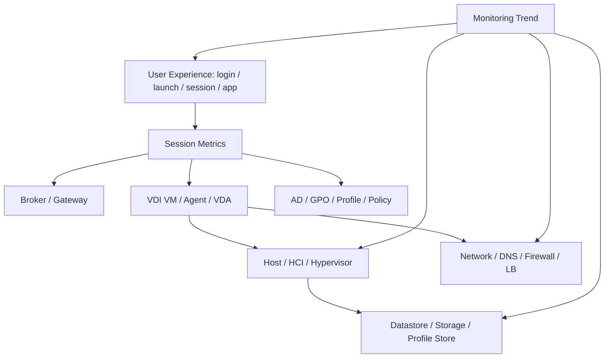

# VDI Performance and Capacity Guide

## 0. Document Control

| Trường | Giá trị |
|---|---|
| Thứ tự | 19 |
| Tên tài liệu | VDI Performance and Capacity Guide |
| Tên file | 19_VDI_Performance_and_Capacity_Guide.md |
| Mục đích tài liệu | Giúp engineer đánh giá hiệu năng và năng lực hệ thống qua CPU, memory, storage latency, IOPS, concurrent session, login duration, boot storm, logon storm và capacity trend. |
| Nguồn điều khiển | [[sources/vdi-training-idea]], [[sources/vdi-documentation-list-context]] |
| Trạng thái | Bản đào tạo vận hành. Baseline, threshold, capacity target, oversubscription policy, SLA, dashboard, workload profile và growth forecast thật là Need Customer Confirmation. |

### 0.1 Source Grounding

| Nội dung | Nguồn sử dụng | Mức độ tin cậy | Ghi chú |
|---|---|---|---|
| Bối cảnh hai hệ thống VDI quy mô 1500 đến hơn 2000 máy, cần vận hành theo lớp broker, hypervisor, storage, network, profile, monitoring và change | [[sources/vdi-training-idea]] | High | Dùng làm khung phân tích hiệu năng theo lớp. |
| Tên tài liệu, tên file và mục đích | [[sources/vdi-documentation-list-context]] | High | Source of truth cho scope. |
| Monitoring metric, alert triage, evidence và baseline theo lớp | [[topics/15_VDI_Monitoring_and_Alerting_Guide]], [[concepts/monitoring-and-logs]], [[concepts/capacity-management]] | Medium | Dùng để nối performance/capacity với dashboard và trend. |
| vSphere/vCenter/ESXi, VM, datastore, snapshot và host metrics | [[sources/vmware-vsphere-8-0]], [[sources/vcenter-server-installation-and-setup]], [[concepts/vmware-vsphere]], [[concepts/vcenter-server]], [[concepts/esxi]], [[concepts/datastore]], [[concepts/snapshot]] | Medium | Dùng cho phân tích host, datastore, VM và snapshot/capacity. |
| XenServer, host/pool, storage repository và VM dependency | [[sources/xenserver-8-4]], [[concepts/xenserver]], [[concepts/storage-repository]] | Medium | Dùng cho hệ thống Citrix nếu chạy trên XenServer. |
| Profile storage, profile container, Cloud Cache và profile load | [[sources/fslogix-documentation]], [[concepts/profile-container]], [[concepts/cloud-cache]], [[concepts/user-profile-management]] | Medium | Dùng cho login duration, profile load và storage impact. |

### 0.2 In Scope

- Cách đánh giá hiệu năng qua CPU, memory, storage latency, IOPS, throughput, network latency, packet loss, login duration và profile loading time.
- Cách đánh giá capacity qua concurrent session, desktop availability, host/cluster headroom, datastore capacity, profile storage growth, license usage và capacity trend.
- Cách nhận diện boot storm, logon storm, bottleneck và trend xấu.
- Checklist phân tích performance incident và capacity review.
- Scenario, bài tập tư duy, knowledge check và câu hỏi Need Customer Confirmation.

### 0.3 Out of Scope

- Không đưa threshold cố định nếu khách hàng chưa có baseline chính thức.
- Không thay thế thiết kế sizing ban đầu, HCI design, storage design hoặc network design.
- Không thay thế tài liệu monitoring; xem [[topics/15_VDI_Monitoring_and_Alerting_Guide]].
- Không thay thế tài liệu change; mở rộng capacity cần đi qua [[topics/20_VDI_Change_Management_Guide]].
- Không đưa lệnh tối ưu, disable service, thay policy hoặc chỉnh resource production khi chưa có approval.

## 1. Tài liệu này giúp engineer làm được gì

Performance là câu hỏi "hệ thống đang chạy nhanh hay chậm, nghẽn ở đâu?". Capacity là câu hỏi "hệ thống còn đủ năng lực phục vụ hôm nay, tuần tới và tháng tới không?". Trong VDI quy mô lớn, hai câu hỏi này luôn đi cùng nhau.

Sau khi học xong, engineer cần làm được:

- Đọc CPU, memory, storage latency, IOPS, network latency, concurrent session và login duration theo ngữ cảnh VDI.
- Phân biệt spike bình thường, trend xấu và bottleneck thật.
- Hiểu boot storm, logon storm và vì sao chúng làm metric tăng theo cụm thời gian.
- Biết khi nào một vấn đề performance là sự cố tức thời và khi nào là capacity risk.
- Biết evidence cần lưu để escalation hoặc đề xuất capacity change.
- Không kết luận "thiếu CPU" hay "do storage" nếu chưa có correlation.

## 2. Performance và capacity khác nhau thế nào

| Khái niệm | Câu hỏi chính | Ví dụ trong VDI |
|---|---|---|
| Performance | User/session có chạy tốt không? | Login chậm, app lag, black screen, session disconnect. |
| Capacity | Hệ thống còn đủ tài nguyên không? | Host gần đầy CPU/memory, datastore sắp đầy, license gần hết, pool thiếu available desktops. |
| Baseline | Bình thường là gì? | Login duration trung bình giờ cao điểm, storage latency thường ngày. |
| Headroom | Còn dư bao nhiêu trước khi rủi ro? | Cluster còn bao nhiêu CPU/memory, datastore còn bao nhiêu capacity. |
| Trend | Hướng thay đổi theo thời gian | Session peak tăng 15% mỗi tháng, profile storage tăng nhanh. |
| Bottleneck | Lớp đang giới hạn trải nghiệm | Storage latency cao làm login chậm dù CPU còn dư. |

Điểm đào tạo quan trọng: capacity còn dư không đảm bảo performance tốt. Ví dụ datastore còn nhiều dung lượng nhưng latency cao vẫn làm login chậm.

## 3. Mô hình phân tích performance theo lớp

Khi user nói "VDI chậm", không nên hỏi ngay "CPU bao nhiêu?". Hãy xác định chậm ở đâu:

- Login trước khi thấy resource.
- Resource enumeration.
- Launch desktop/app.
- Profile loading.
- Desktop interactive.
- App startup.
- In-session latency.
- Disconnect/reconnect.

Mỗi đoạn chậm có lớp kiểm tra khác nhau.

## 4. Metric cốt lõi cần hiểu

| Metric | Ý nghĩa | Dấu hiệu cần chú ý | Không nên hiểu nhầm |
|---|---|---|---|
| CPU usage | Mức sử dụng compute | Cao kéo dài theo host/pool, ready/queue nếu có | CPU cao ngắn lúc logon chưa chắc là lỗi. |
| Memory usage | Nhu cầu RAM của host/VM | Ballooning/swapping nếu có, memory pressure | Memory còn dư không loại trừ storage bottleneck. |
| Storage latency | Độ trễ I/O | Tăng cùng login chậm/profile/app lag | Dung lượng còn nhiều không nghĩa latency tốt. |
| IOPS | Số thao tác I/O | Spike lúc boot/logon, saturation | IOPS cao chưa xấu nếu latency vẫn ổn. |
| Throughput | Lưu lượng đọc/ghi | Tăng khi image/profile/app tải nhiều | Throughput thấp có thể do nghẽn ở nơi khác. |
| Concurrent sessions | Số session đồng thời | Peak gần capacity, tăng theo tháng | Session count thấp không đảm bảo performance nếu storm xảy ra. |
| Login duration | Thời gian user vào desktop/app | Tăng theo group/site/pool/time | Cần tách profile/GPO/auth/storage. |
| Profile load time | Thời gian attach/load profile | Tăng cùng storage/profile errors | Không giả định FSLogix nếu chưa xác nhận. |
| Network latency/loss | Độ trễ/mất gói | Disconnect, black screen, lag input | Chỉ đo ping không đủ nếu path/protocol khác. |
| License usage | Mức dùng license | Gần limit gây launch fail | License là capacity control, không chỉ compliance. |

## 5. CPU và memory analysis

### 5.1 Cần xem ở đâu

- Host/cluster CPU và memory.
- VM CPU/memory usage.
- Resource pool nếu có.
- Peak theo giờ cao điểm.
- Correlation với session count.
- Placement của các VDI chậm trên cùng host.

### 5.2 Dấu hiệu bottleneck

- Nhiều user trên cùng host báo chậm.
- CPU/memory host cao kéo dài trong giờ không bình thường.
- VM ready/queue/co-stop hoặc ballooning/swapping nếu monitoring có.
- Login duration tăng cùng host contention.
- App lag trên nhiều desktop nằm cùng host/cluster.

### 5.3 Evidence cần lưu

- Host/cluster metric timeline.
- Affected VM list.
- Session count cùng thời điểm.
- User symptom sample.
- Recent host maintenance/vMotion/placement change.

Không kết luận thiếu CPU chỉ vì CPU cao trong vài phút boot/logon storm. Cần xem duration, impact và correlation.

## 6. Storage latency, IOPS và datastore capacity

### 6.1 Vì sao storage là điểm nhạy trong VDI

VDI tạo I/O theo cụm:

- Boot storm: nhiều desktop khởi động cùng lúc.
- Logon storm: nhiều user login đầu giờ.
- Profile attach/load.
- Application startup.
- Snapshot/image publish.
- Antivirus/security scan.

Do đó storage metric phải xem theo thời gian và theo workload, không chỉ nhìn một giá trị hiện tại.

### 6.2 Metric cần xem

- Datastore/SR capacity.
- Read/write latency.
- IOPS read/write.
- Throughput.
- Queue/degradation nếu tool hiển thị.
- Snapshot growth.
- Profile storage capacity.
- Profile attach/load failures.

### 6.3 Dấu hiệu storage bottleneck

- Login duration tăng cùng storage latency.
- Profile errors tăng cùng profile store latency/capacity.
- App startup chậm trên nhiều pool cùng datastore.
- Boot storm làm nhiều desktop boot chậm.
- Datastore capacity tăng nhanh sau snapshot/image change.

### 6.4 Evidence cần lưu

- Datastore/SR name.
- Capacity/latency/IOPS timeline.
- Affected pool/catalog/desktop list.
- Login duration/profile metric.
- Snapshot list nếu liên quan.
- Recent image/provisioning/backup/scan change.

## 7. Network performance

### 7.1 Metric cần xem

- Latency.
- Packet loss.
- Jitter nếu có.
- Bandwidth saturation.
- DNS response/failure.
- Load balancer member health.
- Firewall deny/drop nếu có quyền.
- Internal vs external path.

### 7.2 Dấu hiệu network bottleneck

- Disconnect tăng theo site/location.
- External user lag, internal user ổn.
- Black screen sau authentication.
- Session input lag nhưng host/storage bình thường.
- Packet loss hoặc latency spike cùng thời điểm user ticket.

### 7.3 Evidence cần lưu

- User location.
- Internal/external comparison.
- Gateway/LB/firewall evidence.
- Network metric timeline.
- Affected protocol/path nếu biết.
- Broker/gateway session event.

Không dùng một lần ping thành kết luận cuối. VDI có nhiều protocol path và load balancer/firewall có thể xử lý khác nhau.

## 8. Concurrent session và pool capacity

### 8.1 Chỉ số cần xem

- Concurrent sessions peak.
- Active/disconnected sessions.
- Failed sessions.
- Pool/catalog total machines.
- Available/registered machines.
- Machines in maintenance.
- Powered off/unknown machines.
- License usage.

### 8.2 Dấu hiệu thiếu capacity

- User launch fail vì không có available desktop.
- Pool available giảm đều theo giờ cao điểm.
- Disconnected/stale sessions giữ tài nguyên.
- License usage gần limit.
- Host/cluster headroom giảm theo trend.
- New user onboarding làm peak tăng nhưng capacity không đổi.

### 8.3 Capacity không chỉ là số máy

Một pool có 500 desktop nhưng chỉ 300 registered, 100 in use, 80 maintenance và 50 assigned/unavailable thì available thực tế rất khác total. Capacity report phải dùng số usable capacity, không chỉ inventory.

## 9. Login duration, boot storm và logon storm

### 9.1 Login duration cần tách pha

| Pha | Lớp liên quan |
|---|---|
| Authentication | AD/DC/DNS/MFA/gateway |
| Resource enumeration | Broker/entitlement/StoreFront/Connection Server |
| Session launch | Broker/Agent/VDA/protocol |
| Profile load | Profile store, storage, permission, lock |
| GPO/app initialization | AD/GPO, app, security tool |
| Desktop ready | VM/host/storage/network |

### 9.2 Boot storm

Boot storm là khi nhiều desktop boot cùng lúc, thường sau maintenance, power policy, host recovery hoặc image rollout. Dấu hiệu:

- Nhiều VM power on task cùng thời điểm.
- Storage read I/O và latency tăng.
- Host CPU/memory tăng.
- Registration chậm.
- Pool available phục hồi chậm.

### 9.3 Logon storm

Logon storm là khi nhiều user login trong thời gian ngắn, thường đầu giờ làm việc. Dấu hiệu:

- Login duration tăng theo giờ.
- Profile load/storage latency tăng.
- DC/GPO/auth load tăng.
- Security scan/process spike.
- App backend bị tải cao.

### 9.4 Evidence cần lưu

- Time window.
- Concurrent login/session count.
- Login duration chart.
- Storage latency/IOPS.
- Profile logs.
- DC/GPO metric nếu có.
- Host CPU/memory.
- Recent change hoặc schedule.

## 10. Capacity trend và forecast

Capacity management cần trend, không chỉ ảnh chụp hiện tại.

### 10.1 Trend cần theo dõi

| Trend | Vì sao quan trọng |
|---|---|
| Concurrent session peak theo ngày/tuần/tháng | Dự báo số user đồng thời. |
| Pool/catalog availability | Phát hiện thiếu usable desktops. |
| Host CPU/memory peak | Dự báo compute expansion. |
| Datastore capacity growth | Tránh full datastore. |
| Storage latency trend | Phát hiện degradation trước outage. |
| Profile storage growth | Tránh login/profile incident. |
| License usage | Tránh launch fail do license. |
| Failed session trend | Dấu hiệu capacity hoặc quality xấu. |

### 10.2 Headroom cần báo cáo

- Compute headroom.
- Memory headroom.
- Storage capacity headroom.
- Storage performance headroom nếu có baseline.
- License headroom.
- Pool/catalog usable desktop headroom.
- Profile storage headroom.
- Network path headroom nếu có dashboard.

### 10.3 Khi nào mở capacity request

- Trend cho thấy chạm ngưỡng trong thời gian ngắn.
- Peak concurrent sessions tăng đều.
- Pool critical thường xuyên thiếu available desktop.
- Datastore/profile storage tăng nhanh.
- License usage gần limit.
- Host/cluster resource không còn đủ headroom cho maintenance/failover.
- Performance degradation lặp lại trong giờ cao điểm.

## 11. Performance troubleshooting workflow

```mermaid
flowchart LR
  Symptom["Slow / Lag / Capacity Alert"] --> Scope["Scope: user / pool / site / platform"]
  Scope --> Phase["Phase: login / launch / session / app"]
  Phase --> Metrics["Collect CPU memory storage network profile session metrics"]
  Metrics --> Correlate["Correlate with time and change"]
  Correlate --> Bottleneck["Identify likely bottleneck"]
  Bottleneck --> Action["Mitigate / Escalate / Capacity Change"]
  Action --> Validate["Validate trend and user experience"]
```

### 11.1 Các bước thực hiện

1. Xác định triệu chứng performance cụ thể.
2. Xác định scope.
3. Xác định thời điểm bắt đầu và peak.
4. Kiểm tra recent change.
5. Thu metric theo lớp: session, CPU, memory, storage, network, profile, identity.
6. Correlate metric với user impact.
7. Xác định bottleneck có bằng chứng.
8. Mitigate trong phạm vi SOP hoặc escalation.
9. Theo dõi sau action.
10. Ghi lại capacity/performance lesson learned.

## 12. Operational tasks

### 12.1 Weekly performance review

**Mục đích:** Phát hiện trend xấu trước khi thành incident.

**Kiểm tra:**

- Concurrent session peak.
- Failed sessions.
- Login duration.
- Host CPU/memory peak.
- Datastore latency/capacity.
- Profile load time.
- License usage.
- Top pool/catalog có ticket performance.

**Output:** Risk list, owner, action, cần change/capacity request hay chỉ theo dõi.

### 12.2 Capacity review trước onboarding user mới

**Mục đích:** Đảm bảo hệ thống đủ năng lực khi tăng user.

**Precheck:**

- Số user mới và expected concurrency.
- Pool/catalog cần mở rộng.
- Host/storage/license/profile capacity.
- Network/access path.
- Support window và rollback nếu onboarding gây tải.

**Evidence:** Current capacity, projected usage, gap, recommendation.

### 12.3 Post-change performance validation

**Mục đích:** Xác nhận change không làm xấu performance.

**Theo dõi:**

- Login duration.
- Failed session.
- Registration.
- Host/storage/network metrics.
- Profile logs.
- Ticket trend.

**Stop condition:** Metric xấu rõ rệt, user impact, failed session tăng hoặc rollback condition được chạm.

## 13. Common issues and diagnosis

| Triệu chứng | Nguyên nhân có thể | Lớp cần kiểm tra | Evidence | Cách chẩn đoán | Hướng xử lý | Khi nào escalation |
|---|---|---|---|---|---|---|
| Login chậm đầu giờ | Logon storm, profile storage, GPO/DC, security scan, storage latency | Profile/Storage/Identity/Security | Login duration, profile log, storage latency | Correlate theo time window | Tối ưu theo bottleneck hoặc escalation | Nhiều user/vượt SLA |
| Desktop/app lag | Host contention, storage latency, network loss, app backend | Host/Storage/Network/App | User samples, host/storage/network metric | So sánh pool/host/site | Escalate owner phù hợp | Nhiều user hoặc app critical |
| Pool thiếu available desktops | Concurrent peak, stale sessions, unregistered machines, license | Pool/Session/Agent/License | Pool count, session count, registration | Tính usable capacity | Mở rộng/clear theo SOP | Business impact |
| Datastore gần đầy | Snapshot growth, profile growth, provisioning, logs | Storage/Snapshot/Profile | Capacity trend, snapshot list | Xem growth source | Dọn/mở rộng qua change | Gần full hoặc tăng nhanh |
| Storage latency cao | I/O storm, storage degradation, snapshot chain, profile load | Storage/HCI/Profile | Latency/IOPS chart, login duration | Correlate I/O and user impact | Escalate storage/HCI | Diện rộng |
| License gần hết | Concurrency tăng, license sizing thiếu | License/Capacity | Usage trend, failed launch | So sánh peak and limit | Capacity/license request | Launch fail hoặc nearing limit |
| Host CPU/memory cao | Workload spike, imbalance, insufficient cluster headroom | Host/Cluster | Host metric, affected VM list | So sánh host/pool placement | Rebalance/expand qua SOP/change | Nhiều VDI chậm |
| Disconnect do network | Packet loss, latency, gateway/LB issue | Network/Gateway | Session trend, path, network metric | So sánh site/internal/external | Escalate network | Disconnect storm |

## 14. Scenario Based Learning

### Scenario 1: Login chậm đầu giờ nhưng CPU host không cao

**Bối cảnh:** 200 user login lúc 8:00, login duration tăng lên 5 phút. Host CPU chỉ 55%.

**Câu hỏi cho học viên:** Có thể kết luận CPU không phải vấn đề không? Cần xem gì tiếp?

**Gợi ý phân tích:** CPU host không cao chưa đủ. Cần xem profile load time, storage latency, GPO/DC, security scan và logon storm.

**Hướng xử lý đề xuất:** Correlate login duration với profile/storage/GPO metric. Escalate theo bottleneck có evidence.

**Evidence cần lưu:** Login chart, profile log, storage latency, DC/GPO evidence.

### Scenario 2: Datastore còn 40% dung lượng nhưng user vẫn chậm

**Bối cảnh:** Datastore không đầy nhưng latency tăng cao trong giờ login.

**Câu hỏi cho học viên:** Vì sao capacity còn dư không đảm bảo performance?

**Gợi ý phân tích:** Dung lượng và latency là hai câu chuyện khác nhau. I/O path có thể nghẽn dù còn nhiều dung lượng.

**Hướng xử lý đề xuất:** Thu latency/IOPS/throughput timeline, affected pool, login duration và profile logs. Escalate storage/HCI owner.

**Evidence cần lưu:** Datastore metric, user impact, time window, affected resource.

### Scenario 3: Pool critical thiếu available desktops

**Bối cảnh:** Một Delivery Group critical có 600 machines total nhưng chỉ 20 available trong giờ cao điểm.

**Câu hỏi cho học viên:** Total machines có đủ để kết luận capacity không?

**Gợi ý phân tích:** Cần tính usable capacity: registered, in use, disconnected, maintenance, powered off, license.

**Hướng xử lý đề xuất:** Lập capacity snapshot, xác định lý do unavailable, mở capacity/change nếu trend lặp lại.

**Evidence cần lưu:** Machine state breakdown, concurrent session peak, failed session, license status.

### Scenario 4: Concurrent session tăng theo tháng

**Bối cảnh:** Peak concurrent sessions tăng 12% mỗi tháng, license usage đạt 85%, datastore profile tăng đều.

**Câu hỏi cho học viên:** Đây là incident hay capacity risk?

**Gợi ý phân tích:** Chưa phải incident nếu chưa impact, nhưng là capacity risk cần forecast và request.

**Hướng xử lý đề xuất:** Tạo trend report, forecast time-to-threshold, đề xuất capacity/license/storage review.

**Evidence cần lưu:** 3 tháng trend, forecast, threshold/customer target nếu có.

## 15. Bài tập tư duy

### Bài tập 1: Bottleneck mapping

Với các symptom sau, liệt kê metric cần xem:

- Login chậm.
- App lag trong session.
- Black screen.
- Pool thiếu desktop available.
- Datastore latency cao.
- Disconnect theo site.

### Bài tập 2: Capacity report

Tạo báo cáo capacity một trang cho một pool 500 desktop, gồm total, available, registered, in use, maintenance, failed sessions, concurrent peak và recommendation.

### Bài tập 3: Storm timeline

Vẽ timeline 7:30-9:30 cho logon storm, gồm concurrent login, storage latency, profile load, CPU, failed session và ticket user.

### Bài tập 4: Trend forecast

Dựa trên 6 tháng license usage tăng đều, dự báo khi nào chạm 90% và đề xuất mốc mở capacity request.

## 16. Knowledge Check

### Câu 1

**Performance khác capacity thế nào?**

**Đáp án:** Performance nói về trải nghiệm/độ nhanh chậm hiện tại; capacity nói về năng lực còn đủ để phục vụ workload hiện tại và tương lai không.

### Câu 2

**Vì sao datastore còn dung lượng không đảm bảo login nhanh?**

**Đáp án:** Vì latency, IOPS và queue có thể nghẽn dù capacity còn dư.

### Câu 3

**Concurrent session dùng để đánh giá gì?**

**Đáp án:** Đánh giá peak workload, license usage, pool capacity và trend tăng trưởng user đồng thời.

### Câu 4

**Boot storm khác logon storm thế nào?**

**Đáp án:** Boot storm là nhiều desktop boot cùng lúc; logon storm là nhiều user login cùng lúc. Cả hai đều có thể tạo tải CPU/storage/network/profile.

### Câu 5

**Login duration cần tách những pha nào?**

**Đáp án:** Authentication, resource enumeration, session launch, profile load, GPO/app initialization và desktop ready.

### Câu 6

**Pool total machines cao nhưng available thấp thì cần xem gì?**

**Đáp án:** Registered/unregistered, in use, disconnected/stale sessions, maintenance, powered off, assigned, license và failed sessions.

### Câu 7

**Khi nào mở capacity request?**

**Đáp án:** Khi trend cho thấy sắp chạm threshold, headroom giảm, pool thiếu capacity lặp lại, license/storage/profile tăng nhanh hoặc performance degradation lặp lại.

### Câu 8

**Metric nào cần correlation khi app lag?**

**Đáp án:** User/session scope, host CPU/memory, storage latency, network latency/loss, app backend, profile and recent change.

### Câu 9

**Vì sao baseline khách hàng quan trọng?**

**Đáp án:** Vì workload VDI khác nhau; baseline giúp phân biệt bình thường, spike hợp lệ và bất thường thật.

### Câu 10

**Nếu chưa có threshold chính thức, nên ghi gì?**

**Đáp án:** Ghi Unknown hoặc Need Customer Confirmation, và không dùng ngưỡng tự bịa làm quyết định chính thức.

## 17. Hiểu nhầm thường gặp

| Hiểu nhầm | Vì sao sai | Cách nghĩ đúng |
|---|---|---|
| CPU cao nghĩa là thiếu CPU | Cần xem duration, user impact, ready/queue và correlation. | CPU chỉ là một lớp. |
| Storage còn dung lượng là storage ổn | Latency/IOPS có thể nghẽn. | Xem capacity và performance cùng lúc. |
| IOPS cao luôn xấu | IOPS cao có thể bình thường nếu latency ổn và trong baseline. | Xem IOPS cùng latency và workload. |
| Login chậm luôn do profile | Có thể do GPO, DC, storage, security, broker, app init. | Tách pha login. |
| Capacity review chỉ làm khi đầy | Capacity phải dự báo trước khi chạm ngưỡng. | Theo dõi trend/headroom. |
| Một dashboard tổng là đủ | Lỗi có thể cục bộ theo pool/site/host/datastore. | Xem theo scope và grouping. |

## 18. Field Checklist

### 18.1 Performance incident checklist

- [ ] Symptom cụ thể: login, launch, session, app, disconnect.
- [ ] Scope: user, pool/catalog, site, platform.
- [ ] Time window.
- [ ] Recent change.
- [ ] User samples.
- [ ] CPU/memory metric.
- [ ] Storage latency/IOPS/capacity.
- [ ] Network latency/loss.
- [ ] Login duration/profile/GPO if relevant.
- [ ] Broker/Agent/session metric.
- [ ] Evidence package.
- [ ] Owner/escalation.

### 18.2 Capacity review checklist

- [ ] Concurrent session peak and trend.
- [ ] Pool/catalog usable capacity.
- [ ] Host/cluster CPU and memory headroom.
- [ ] Datastore/profile storage capacity trend.
- [ ] Storage latency trend.
- [ ] License usage trend.
- [ ] Growth forecast.
- [ ] Risk date or time-to-threshold.
- [ ] Recommendation and owner.

## 19. Need Customer Confirmation

| Nhóm | Câu hỏi cần xác nhận | Vì sao cần |
|---|---|---|
| Baseline | Baseline CPU, memory, latency, IOPS, login duration, concurrent session là gì? | Phân biệt bình thường và bất thường. |
| Threshold | Ngưỡng cảnh báo/warning/critical cho từng metric là gì? | Không dùng ngưỡng giả định. |
| Dashboard | Tool/dashboard chính thức cho performance/capacity là gì? | Nguồn số liệu thống nhất. |
| Workload profile | Nhóm user/app nào là heavy user, normal user, kiosk/task worker? | Capacity theo workload khác nhau. |
| Concurrency target | Tỷ lệ concurrent session dự kiến là bao nhiêu? | Forecast capacity. |
| Growth forecast | Dự báo tăng user/VDI trong 3-6-12 tháng là gì? | Lập kế hoạch mở rộng. |
| Host/cluster policy | Oversubscription, HA headroom và maintenance headroom là gì? | Đánh giá compute capacity đúng. |
| Storage design | Datastore/profile/image storage design, latency target, IOPS target là gì? | Đánh giá storage bottleneck. |
| Profile solution | Profile solution và profile storage path là gì? | Phân tích login/profile. |
| License | License model, limit và purchase/expansion process là gì? | Tránh capacity block. |
| SLA | SLA cho login duration, launch time, session performance là gì? | Ưu tiên performance incident. |
| Capacity process | Khi nào mở capacity request và ai phê duyệt? | Chuyển trend thành action. |

## 20. Related Wiki Links

### Source pages

- [[sources/vdi-training-idea]]
- [[sources/vdi-documentation-list-context]]
- [[sources/vmware-vsphere-8-0]]
- [[sources/vcenter-server-installation-and-setup]]
- [[sources/xenserver-8-4]]
- [[sources/fslogix-documentation]]
- [[sources/horizon-8-architecture]]
- [[sources/citrix-virtual-apps-and-desktops-7-2603]]

### Concept pages

- [[concepts/capacity-management]]
- [[concepts/monitoring-and-logs]]
- [[concepts/datastore]]
- [[concepts/storage-repository]]
- [[concepts/profile-container]]
- [[concepts/cloud-cache]]
- [[concepts/user-profile-management]]
- [[concepts/vmware-vsphere]]
- [[concepts/vcenter-server]]
- [[concepts/esxi]]
- [[concepts/xenserver]]
- [[concepts/virtual-machine]]
- [[concepts/snapshot]]
- [[concepts/vdi-connection-flow]]
- [[concepts/omnissa-horizon]]
- [[concepts/citrix-virtual-apps-and-desktops]]
- [[concepts/incident-management]]
- [[concepts/change-management]]

### Topic pages nên đọc tiếp

- [[topics/7_Hypervisor_and_HCI_Operations_Guide]]: hiểu host, cluster, VM và HCI dependency.
- [[topics/8_Storage_Operations_for_VDI]]: hiểu datastore, latency, IOPS, boot/logon storm.
- [[topics/9_Network_Operations_for_VDI]]: hiểu network latency, packet loss và path.
- [[topics/12_Master_Image_Management_Guide]]: hiểu image rollout tác động performance.
- [[topics/15_VDI_Monitoring_and_Alerting_Guide]]: metric và alert theo lớp.
- [[topics/16_Daily_Operations_Checklist]]: daily capacity/performance check.
- [[topics/18_VDI_Troubleshooting_Playbook]]: xử lý symptom cụ thể.
- [[topics/20_VDI_Change_Management_Guide]]: mở rộng capacity qua change.

## 21. Summary for Learners

Performance và capacity trong VDI phải được đọc theo trend, baseline và impact. CPU, memory, storage latency, IOPS, concurrent session, login duration, boot storm, logon storm và capacity trend chỉ có ý nghĩa khi nối với user experience và scope.

Thứ tự phân tích khuyến nghị:

1. Xác định symptom và time window.
2. Xác định scope: user, pool/catalog, site, platform.
3. Kiểm tra recent change.
4. Tách pha: login, launch, session, app.
5. Thu metric CPU, memory, storage, network, profile, session.
6. Correlate metric với user impact.
7. Xác định bottleneck có bằng chứng.
8. Nếu là incident, escalation đúng owner.
9. Nếu là trend, tạo capacity recommendation.
10. Lưu evidence và cập nhật KB/report.

Điều cần nhớ nhất: trong VDI lớn, performance không phải một con số. Nó là câu chuyện giữa workload, thời điểm, hạ tầng và trải nghiệm user.

