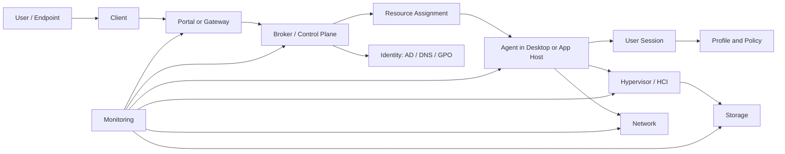
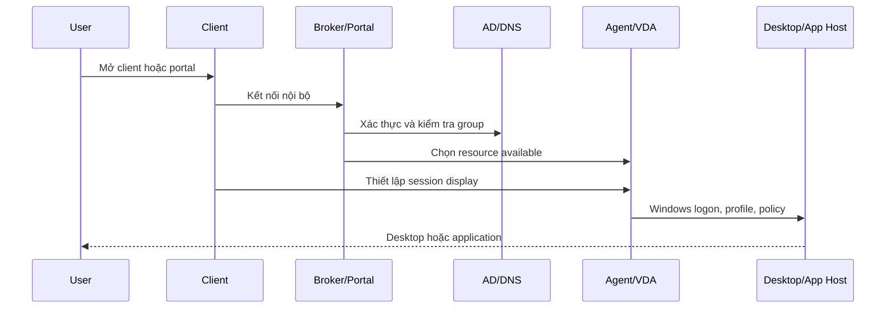
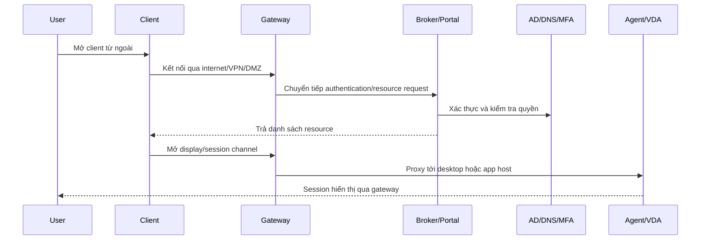

# VDI Foundation Overview

## 0. Document Control

| Trường | Giá trị |
|---|---|
| Thứ tự | 1 |
| Tên tài liệu | VDI Foundation Overview |
| Tên file | 1_VDI_Foundation_Overview.md |
| Mục đích tài liệu | Cung cấp kiến thức nền tảng về VDI, khái niệm desktop ảo, published application, session, user access và các lớp hạ tầng liên quan. |
| Nguồn điều khiển | [[sources/vdi-training-idea]], [[sources/vdi-documentation-list-context]] |
| Phạm vi | Kiến thức nền tảng để system engineer hiểu cách một dịch vụ VDI hoạt động trước khi học sâu Horizon, Citrix, storage, network, monitoring và troubleshooting. |

### 0.1 Source Grounding

| Nhóm tri thức | Nguồn sử dụng | Mức độ tin cậy | Ghi chú |
|---|---|---|---|
| Bối cảnh đào tạo, quy mô, cách nhìn VDI theo lớp | [[sources/vdi-training-idea]] | High | Nguồn xác định khách hàng có 2 hệ thống VDI, quy mô 1500 đến hơn 2000 VDI, cần đào tạo theo hướng vận hành thực tế. |
| Tên tài liệu, file, mục đích | [[sources/vdi-documentation-list-context]] | High | Source of truth cho scope tài liệu này. |
| Thành phần Horizon, Connection Server, Unified Access Gateway, desktop pool, entitlement, display protocol | [[sources/horizon-8-architecture]] | High | Dùng để giải thích VDI theo nền tảng Omnissa Horizon. |
| Primary/secondary protocol, luồng kết nối, gateway, firewall, certificate | [[sources/understand-and-troubleshoot-horizon-connections]] | High | Dùng để giải thích vì sao login thành công chưa chắc session đã chạy được. |
| Delivery Controller, StoreFront, VDA, Delivery Group, HDX/ICA | [[sources/citrix-virtual-apps-and-desktops-7-2603]] | High | Dùng để giải thích VDI và published application theo nền tảng Citrix CVAD. |
| Profile container, ODFC container, profile storage, logon issue | [[sources/fslogix-documentation]] | High | Dùng để giải thích user profile trong môi trường desktop/app ảo. |
| ESXi, vCenter, VM, datastore, virtual networking, snapshot | [[sources/vmware-vsphere-8-0]], [[sources/vcenter-server-installation-and-setup]] | High | Dùng để giải thích lớp hypervisor cho Horizon hoặc CVAD trên VMware. |
| XenServer host, pool, VM, storage repository, network, HA | [[sources/xenserver-8-4]] | High | Dùng để giải thích lớp hypervisor cho Citrix CVAD khi chạy trên XenServer. |

### 0.2 In Scope

- Giải thích VDI là gì theo góc nhìn vận hành, không theo marketing sản phẩm.
- Làm rõ desktop ảo, published application, session, broker, gateway, agent, profile, image, hypervisor, storage, network và identity.
- Giải thích user access flow ở mức nền tảng: user vào portal, được xác thực, được broker cấp resource, kết nối tới desktop hoặc application session.
- Giải thích vì sao một lỗi VDI thường phải kiểm tra theo lớp thay vì xử lý ngay trên VM.
- Cung cấp checklist, lỗi thường gặp, tình huống học tập và câu hỏi kiểm tra cho engineer mới.

### 0.3 Out of Scope

- Không thay thế tài liệu kiến trúc riêng của Horizon hoặc Citrix CVAD.
- Không mô tả topology thật của khách hàng khi chưa có sơ đồ, VIP, subnet, firewall rule, version và owner.
- Không đưa SOP thay đổi image, policy, certificate, patch, backup, HA hoặc DR chi tiết.
- Không yêu cầu hoặc ghi nhận secret, password, token, credential.

## 1. Tài liệu này giúp engineer làm được gì

Sau khi học xong tài liệu này, engineer cần đạt được các năng lực nền sau:

1. Giải thích được VDI là một dịch vụ nhiều lớp, không chỉ là một tập máy ảo Windows.
2. Phân biệt được desktop ảo, published application và user session.
3. Mô tả được luồng user truy cập VDI từ endpoint tới gateway, broker, agent và desktop/app session.
4. Nhận diện được các lớp hạ tầng liên quan: identity, broker, gateway, hypervisor, storage, network, profile, monitoring.
5. Biết triệu chứng lỗi ban đầu thường gợi ý kiểm tra lớp nào.
6. Biết evidence tối thiểu cần thu thập trước khi escalation hoặc thay đổi.

Tài liệu này dành cho system engineer mới tiếp cận VDI, engineer đã biết Windows/VMware/Citrix/Horizon ở mức rời rạc nhưng chưa có mô hình tổng thể, và helpdesk hoặc L1/L2 cần hiểu cách phân loại lỗi trước khi chuyển tuyến.

## 2. VDI là gì theo góc nhìn vận hành

VDI, viết tắt của Virtual Desktop Infrastructure, là mô hình cung cấp desktop hoặc application từ hạ tầng trung tâm thay vì chạy trực tiếp trên máy người dùng. Người dùng dùng laptop, PC, thin client hoặc thiết bị khác để kết nối vào một phiên làm việc được chạy trên máy ảo hoặc server trong datacenter.

Điểm quan trọng với system engineer: VDI không phải chỉ là "remote vào một VM". Một phiên VDI thành công cần nhiều lớp cùng hoạt động:

- Người dùng phải xác thực được với identity system.
- Portal hoặc gateway phải nhận kết nối.
- Broker phải biết user được phép dùng resource nào.
- Desktop hoặc application host phải sẵn sàng nhận session.
- Agent trong máy đích phải liên lạc được với broker.
- Giao thức hiển thị phải đi được qua network path phù hợp.
- Profile, policy, printer, clipboard, drive mapping và các cấu hình user phải load đúng.
- Hypervisor, storage và network phải đủ tài nguyên để session ổn định.

Trong môi trường quy mô 1500 đến hơn 2000 VDI, một lỗi nhỏ ở lớp dùng chung có thể ảnh hưởng hàng trăm người dùng. Ví dụ, lỗi DNS hoặc Domain Controller có thể làm nhiều desktop không đăng ký được; lỗi storage latency có thể làm login chậm hàng loạt; lỗi gateway hoặc certificate có thể làm user bên ngoài không vào được dù desktop bên trong vẫn khỏe.

## 3. Bối cảnh VDI của khách hàng trong bộ tài liệu

Theo [[sources/vdi-training-idea]], khách hàng có 2 hệ thống VDI khác nhau:

| Hệ thống | Nền tảng | Hạ tầng bên dưới | Quy mô | Ý nghĩa với engineer |
|---|---|---|---|---|
| Hệ thống 1 | Omnissa Horizon, trước đây là VMware Horizon | HCI, có liên quan vCenter, hypervisor, storage, network | Khoảng 1500 đến hơn 2000 VDI | Engineer cần hiểu Connection Server, Unified Access Gateway, Horizon Agent, desktop pool, entitlement và phụ thuộc hạ tầng. |
| Hệ thống 2 | Citrix Virtual Apps and Desktops, viết tắt CVAD | XenServer hoặc VMware ESXi | Khoảng 1500 đến hơn 2000 VDI | Engineer cần hiểu Delivery Controller, StoreFront, Citrix Gateway, VDA, Machine Catalog, Delivery Group và phụ thuộc hypervisor. |

Các thông tin chưa có trong wiki và cần xác nhận với khách hàng:

- Version cụ thể của Horizon, CVAD, ESXi, XenServer, vCenter.
- Sơ đồ topology thật, số lượng site, pod, cluster, gateway, broker.
- Luồng truy cập nội bộ và bên ngoài.
- Có dùng load balancer, MFA, Hybrid Microsoft Entra ID, FSLogix, profile container hay giải pháp profile khác không.
- Monitoring tool, SLA, escalation path và ownership từng lớp.

## 4. Mô hình tư duy nền tảng: VDI là chuỗi dịch vụ nhiều lớp

Một cách học VDI hiệu quả là không bắt đầu từ tên sản phẩm, mà bắt đầu từ câu hỏi: "Một user cần những lớp nào để mở được desktop hoặc application?"

Mô hình trên không phải topology thật của khách hàng. Đây là bản đồ tư duy để engineer biết lỗi có thể nằm ở đâu.

| Lớp | Câu hỏi engineer cần hỏi | Ví dụ thành phần |
|---|---|---|
| User Access Layer | User vào bằng thiết bị nào, mạng nào, client nào, nội bộ hay bên ngoài? | Horizon Client, Citrix Workspace App, browser, thin client |
| Gateway Layer | Kết nối có đi qua gateway, certificate, firewall, load balancer không? | Unified Access Gateway, Citrix Gateway, load balancer |
| Broker Layer | User được xác thực chưa, có entitlement không, broker chọn resource nào? | Horizon Connection Server, Citrix Delivery Controller, StoreFront |
| Session Layer | Desktop/app host có sẵn sàng nhận session không? | Horizon Agent, Citrix VDA, Windows desktop, RDS host |
| Identity Layer | User, group, computer account, DNS, GPO, time sync có đúng không? | Active Directory, Domain Controller, DNS, Group Policy |
| Profile/Policy Layer | Profile load thế nào, policy áp vào user/session ra sao? | FSLogix, profile storage, Citrix Policy, Horizon Policy, GPO |
| Hypervisor Layer | VM có chạy không, host có đủ tài nguyên không, cluster có lỗi không? | ESXi, vCenter, XenServer, HCI |
| Storage Layer | Datastore/profile/image storage có đủ capacity và latency ổn không? | Datastore, storage repository, profile share, image datastore |
| Network Layer | Các đoạn network cần thiết có thông không, latency/packet loss có cao không? | VLAN, routing, firewall, DNS, load balancer |
| Monitoring Layer | Có alert, trend bất thường hoặc failed session không? | Monitoring tool, broker dashboard, hypervisor dashboard |

## 5. Khái niệm cốt lõi cần nắm

### 5.1 Desktop ảo

Desktop ảo là môi trường desktop chạy trên VM hoặc host trung tâm. User nhìn thấy giao diện giống máy Windows bình thường, nhưng CPU, memory, disk và network thực tế nằm trong datacenter.

Trong vận hành, desktop ảo cần được nhìn ở 3 góc:

- Góc user: user thấy desktop có đăng nhập được không, có chậm không, có mất profile không.
- Góc broker: desktop có trong pool/catalog không, user có quyền không, máy có available không.
- Góc hạ tầng: VM có powered on không, agent registered không, host/storage/network có ổn không.

Desktop ảo có thể là persistent hoặc non-persistent:

| Loại desktop | Ý nghĩa | Rủi ro vận hành |
|---|---|---|
| Persistent desktop | User gắn với một desktop lâu dài, thay đổi có thể giữ lại trên máy đó | Cần quản lý backup, patch, drift cấu hình, dung lượng cá nhân |
| Non-persistent desktop | Desktop có thể được làm mới từ image chuẩn, user data tách ra profile/container | Phụ thuộc mạnh vào master image, profile solution và quá trình logon |

Trong môi trường lớn, non-persistent thường giúp chuẩn hóa và khôi phục nhanh hơn, nhưng nếu profile hoặc image lỗi thì impact có thể lan rộng.

### 5.2 Published application

Published application là ứng dụng được chạy trên server hoặc desktop host trong datacenter, nhưng chỉ cửa sổ ứng dụng được trình bày cho user. User có thể không thấy toàn bộ desktop.

Ví dụ: user mở một ứng dụng kế toán hoặc trình duyệt nội bộ từ Citrix Workspace App. Ứng dụng chạy trên VDA hoặc session host, còn user chỉ tương tác với cửa sổ app.

Điểm khác desktop ảo:

| Nội dung | Desktop ảo | Published application |
|---|---|---|
| User thấy gì | Toàn bộ desktop | Một hoặc nhiều cửa sổ ứng dụng |
| Trọng tâm vận hành | Desktop pool/catalog, VM state, agent, profile, session | Application availability, session host, app group, policy, user mapping |
| Lỗi thường gặp | Không vào desktop, black screen, desktop unavailable | Không thấy app, app launch fail, app mở rồi crash |
| Evidence cần lấy | Desktop/pool/catalog state, session log, agent state | App name, Delivery Group/Application Group, session host, application event log |

Trong Citrix CVAD, published application là năng lực rất quan trọng, gắn với StoreFront, Delivery Controller, VDA, Delivery Group và HDX/ICA. Trong Horizon cũng có application pool hoặc published app tùy thiết kế.

### 5.3 User session

Session là phiên làm việc sống giữa user và desktop hoặc application host. Một user "login thành công" chưa đủ để kết luận session khỏe. Session có nhiều giai đoạn:

1. User mở client hoặc portal.
2. User xác thực.
3. Broker xác định user được phép dùng resource nào.
4. User chọn desktop/app.
5. Broker cấp máy hoặc session host phù hợp.
6. Client thiết lập kết nối hiển thị tới agent/VDA qua đường nội bộ hoặc gateway.
7. Windows logon chạy, profile load, policy áp dụng.
8. User bắt đầu làm việc.
9. Session có thể active, disconnected, reconnect hoặc logoff.

Nếu user nói "em không vào được VDI", engineer phải hỏi rõ đang kẹt ở bước nào:

- Không mở được portal?
- Không login được?
- Login được nhưng không thấy desktop/app?
- Thấy desktop/app nhưng launch fail?
- Launch được nhưng màn hình đen?
- Vào được nhưng chậm?
- Đang dùng thì disconnect?

Mỗi câu trả lời dẫn tới lớp kiểm tra khác nhau.

### 5.4 Broker

Broker là thành phần điều phối. Broker không nhất thiết chạy workload của user, nhưng quyết định user được thấy resource nào và kết nối tới đâu.

| Nền tảng | Broker hoặc control plane liên quan | Vai trò nền tảng |
|---|---|---|
| Omnissa Horizon | Connection Server | Xác thực, entitlement, quản lý desktop/application pool, điều phối kết nối tới Horizon Agent |
| Citrix CVAD | Delivery Controller, StoreFront | StoreFront trình bày resource; Delivery Controller quản lý broker, machine, session và policy trong Site |

Khi broker lỗi hoặc mất kết nối tới dependency, user có thể gặp các triệu chứng:

- Không thấy desktop hoặc application.
- Launch fail.
- Resource báo unavailable.
- Agent/VDA unregistered hoặc không nhận session.
- Failed session tăng trong dashboard.

Broker thường phụ thuộc vào AD/DNS, database hoặc cấu hình Site, hypervisor connection, license và agent communication.

### 5.5 Gateway

Gateway là điểm truy cập an toàn, đặc biệt cho user bên ngoài. Gateway thường nằm giữa internet hoặc mạng người dùng và lớp broker/session bên trong.

| Nền tảng | Gateway phổ biến | Vai trò |
|---|---|---|
| Horizon | Unified Access Gateway | Đưa kết nối ngoài vào Horizon, xử lý đường đi tới Connection Server và desktop qua giao thức hiển thị |
| Citrix CVAD | Citrix Gateway | Cung cấp truy cập ngoài, thường kết hợp StoreFront, authentication, ICA/HDX proxy |

Một lỗi rất hay gặp là user xác thực được nhưng không vào được desktop/app. Nguyên nhân có thể do primary protocol thành công nhưng secondary/display protocol lỗi. Theo [[sources/understand-and-troubleshoot-horizon-connections]], troubleshooting cần tách đường đi client tới gateway, gateway tới identity/broker, rồi tới desktop hoặc session host.

### 5.6 Agent hoặc VDA

Agent là thành phần chạy trong desktop VM hoặc application/session host để kết nối workload với broker.

| Nền tảng | Thành phần | Ý nghĩa |
|---|---|---|
| Horizon | Horizon Agent | Cho phép desktop hoặc RDS host đăng ký với Connection Server và nhận session |
| Citrix CVAD | Virtual Delivery Agent, gọi tắt VDA | Cho phép machine đăng ký với Delivery Controller và cung cấp desktop/app session |

Nếu agent/VDA không registered, broker có thể còn sống nhưng không cấp được desktop/app. Engineer cần kiểm tra:

- VM có powered on không.
- Agent/VDA service có chạy không.
- Máy có join domain đúng không.
- DNS và time sync có ổn không.
- Máy có liên lạc được broker không.
- Có recent image update, firewall change, GPO change hoặc certificate issue không.

### 5.7 Image, master image và golden image

Image là mẫu hệ điều hành và ứng dụng dùng để tạo hoặc cập nhật nhiều desktop/session host. Trong VDI quy mô lớn, image là nguồn chuẩn hóa, nhưng cũng là nguồn rủi ro cao.

Một image thường chứa:

- Windows OS và patch.
- VDI agent hoặc VDA.
- VMware Tools, hypervisor tools hoặc driver tương ứng.
- Ứng dụng chung.
- Security tool, monitoring agent.
- Baseline cấu hình.

Nếu image lỗi, lỗi có thể lặp lại trên nhiều máy. Vì vậy image change không thuộc scope thao tác tùy tiện của tài liệu foundation, nhưng engineer mới phải hiểu: khi nhiều VDI cùng lỗi sau maintenance, recent image update là một trong các giả thuyết đầu tiên cần kiểm tra.

### 5.8 User profile

Profile là dữ liệu và cấu hình cá nhân của user như Desktop, Documents, AppData, Outlook cache, browser profile và thiết lập ứng dụng. Trong VDI, profile rất quan trọng vì user có thể không luôn đăng nhập vào cùng một máy.

Theo [[sources/fslogix-documentation]], FSLogix dùng profile container để tách profile khỏi máy phiên, giúp user có trải nghiệm nhất quán giữa nhiều desktop hoặc session host. Nhưng profile solution cũng tạo thêm dependency:

- Storage chứa profile phải sẵn sàng.
- Permission phải đúng.
- Container không bị lock sai.
- Latency phải đủ thấp.
- HA hoặc replication phải được thiết kế đúng.

Triệu chứng profile issue:

- Login chậm ở bước loading profile.
- User mất setting cá nhân.
- Outlook/OneDrive lỗi cache.
- Session vào được nhưng ứng dụng chạy bất thường.

### 5.9 Hypervisor, HCI và VM layer

Desktop ảo cuối cùng vẫn chạy trên tài nguyên tính toán. Trong bối cảnh của khách hàng:

- Horizon chạy trên HCI.
- Citrix CVAD có thể chạy trên XenServer hoặc VMware ESXi.

Hypervisor layer gồm host, cluster hoặc pool, VM, datastore/storage repository, virtual network và snapshot. Với VMware, vCenter là điểm quản trị trung tâm cho ESXi, VM, datastore, network và lifecycle. Với XenServer, engineer cần hiểu host, pool, storage repository và network.

Triệu chứng VDI do hypervisor layer:

- Nhiều desktop trong cùng host/cluster chậm.
- VM không power on.
- Datastore full hoặc latency cao.
- Snapshot tăng dung lượng.
- Host maintenance ảnh hưởng pool/catalog.
- Agent/VDA unregistered do VM không boot, network adapter lỗi hoặc tools/driver issue.

### 5.10 Storage layer

Storage trong VDI không chỉ lưu disk của VM. Nó có thể chứa:

- Datastore hoặc storage repository cho desktop VM.
- Master image hoặc template.
- Replica, snapshot hoặc clone disk tùy công nghệ.
- Profile container hoặc user data.
- Log và dữ liệu phụ trợ.

Hai hiện tượng cần biết sớm:

| Hiện tượng | Ý nghĩa | Vì sao quan trọng |
|---|---|---|
| Boot storm | Nhiều VM khởi động gần cùng thời điểm | Tạo tải IOPS và latency cao trên storage |
| Logon storm | Nhiều user đăng nhập cùng thời điểm | Tạo tải profile, GPO, storage, DC và broker |

Storage latency có thể làm VDI "trông như lỗi ứng dụng" dù gốc nằm ở datastore hoặc profile share. Vì vậy khi user báo chậm hàng loạt, engineer không nên chỉ nhìn CPU/memory của desktop.

### 5.11 Network layer

Network nối tất cả các lớp VDI. Một phiên VDI cần nhiều đoạn network khác nhau:

- Endpoint tới portal/gateway.
- Gateway tới broker.
- Broker tới agent/VDA.
- Client hoặc gateway tới desktop/session host cho display protocol.
- Desktop tới AD/DNS, profile storage, application backend.
- Broker tới vCenter, XenServer hoặc hypervisor manager.

Lỗi network có thể biểu hiện thành:

- Portal timeout.
- Login được nhưng launch fail.
- Màn hình đen.
- Disconnect ngẫu nhiên.
- Audio/video/printing/clipboard kém.
- Agent/VDA registration không ổn định.

Engineer cần phân biệt lỗi internal-only, external-only hay cả hai. Nếu chỉ external lỗi, gateway, firewall, certificate, load balancer và NAT/path bên ngoài là vùng cần ưu tiên.

### 5.12 Identity layer

VDI phụ thuộc chặt vào identity. Các thành phần thường gặp:

- Active Directory.
- Domain Controller.
- DNS.
- Group Policy.
- User group.
- Computer account.
- Hybrid Microsoft Entra ID nếu môi trường có tích hợp.

Identity issue có thể gây:

- Login fail.
- User không thấy resource do group/entitlement sai.
- Agent/VDA không registered do machine account hoặc DNS lỗi.
- GPO làm login chậm.
- Policy áp sai, ví dụ clipboard/USB/printer/session timeout.

Trong tài liệu foundation, engineer chỉ cần nhớ nguyên tắc: trước khi kết luận broker hoặc desktop lỗi, phải kiểm tra user, group, DNS, DC, GPO và thời điểm thay đổi identity liên quan.

## 6. Desktop ảo và published application khác nhau như thế nào

| Tiêu chí | Desktop ảo | Published application |
|---|---|---|
| Trải nghiệm user | User thấy desktop đầy đủ | User chỉ thấy ứng dụng được publish |
| Đơn vị cấp phát | Desktop pool, machine catalog, VM hoặc desktop assignment | Application, application group, delivery group hoặc app pool |
| Lớp cần kiểm tra khi không thấy resource | Entitlement, pool/catalog, machine availability, user group | App publish, app group, delivery group, user group, StoreFront/portal |
| Lớp cần kiểm tra khi launch fail | Agent/VDA, VM state, display protocol, profile, policy | VDA/session host, app executable, policy, HDX/ICA channel |
| Rủi ro quy mô lớn | Nhiều VM desktop bị ảnh hưởng do image, storage, host | Nhiều user cùng app bị ảnh hưởng do session host, app config hoặc policy |

Một engineer mới thường nhầm "VDI" chỉ là desktop ảo. Trong thực tế, bộ tài liệu này dùng VDI theo nghĩa rộng: nền tảng cung cấp desktop ảo và ứng dụng ảo/published application cho user.

## 7. Luồng truy cập người dùng ở mức nền tảng

### 7.1 Luồng tổng quát

1. User mở client hoặc web portal.
2. Client kết nối tới portal/gateway hoặc broker tùy vị trí truy cập.
3. User xác thực bằng AD hoặc cơ chế identity được cấu hình.
4. Broker kiểm tra entitlement, group và resource available.
5. Portal hiển thị desktop/app được phép dùng.
6. User chọn desktop/app.
7. Broker chọn máy hoặc session host phù hợp.
8. Client thiết lập session với agent/VDA, trực tiếp hoặc qua gateway.
9. Windows logon, profile loading và policy processing diễn ra.
10. User bắt đầu làm việc.

### 7.2 Luồng user nội bộ

Trong nhiều thiết kế, user nội bộ có thể đi đường ngắn hơn:

Điểm lỗi thường gặp:

- DNS nội bộ sai.
- Broker service lỗi.
- User thiếu entitlement.
- Agent/VDA unregistered.
- Profile storage chậm.
- GPO hoặc logon script làm login lâu.

### 7.3 Luồng user bên ngoài

User bên ngoài thường đi qua gateway và firewall:

Điểm lỗi thường gặp:

- Certificate không tin cậy hoặc hết hạn.
- Load balancer member lỗi.
- Firewall/NAT thiếu đường cho display protocol.
- External URL hoặc gateway mapping sai.
- Authentication thành công nhưng secondary protocol fail.
- Gateway tới broker hoặc gateway tới agent bị chặn.

## 8. Bản đồ thành phần nền tảng theo Horizon và Citrix

| Khái niệm chung | Omnissa Horizon | Citrix CVAD | Engineer cần hiểu gì |
|---|---|---|---|
| Client | Horizon Client hoặc browser | Citrix Workspace App hoặc browser | Client version, endpoint location và lỗi hiển thị ban đầu rất quan trọng khi triage. |
| Gateway | Unified Access Gateway | Citrix Gateway | Tách lỗi external access khỏi lỗi broker hoặc desktop. |
| Portal/Broker | Connection Server | StoreFront và Delivery Controller | Broker quyết định user thấy gì và kết nối tới đâu. |
| Agent trong máy đích | Horizon Agent | VDA | Agent/VDA registration là dấu hiệu sống còn của desktop/app host. |
| Nhóm desktop/app | Desktop pool, application pool | Machine Catalog, Delivery Group, Application Group | Đây là nơi kiểm tra availability, entitlement và scope impact. |
| Entitlement | Horizon entitlement | Citrix user assignment/Delivery Group entitlement | Nếu user không thấy resource, kiểm tra mapping user/group ở đây. |
| Hypervisor manager | vCenter trong môi trường VMware/HCI | XenServer hoặc vCenter tùy thiết kế | Broker cần tương tác với hypervisor để quản lý machine lifecycle. |
| Display protocol | Blast Extreme, RDP tùy thiết kế | HDX/ICA | Login được nhưng display channel fail là một nhóm lỗi riêng. |

## 9. Cách đọc triệu chứng lỗi theo lớp

| Triệu chứng user báo | Không nên kết luận vội | Lớp ưu tiên kiểm tra | Evidence cần lấy |
|---|---|---|---|
| Không mở được portal | "VDI down" | Endpoint, DNS, gateway, certificate, load balancer | URL, screenshot, location, DNS result, gateway/LB health |
| Login fail | "Sai password" | Identity, MFA nếu có, broker auth, DC/DNS/time sync | User, timestamp, auth log, DC health, broker/gateway log |
| Login được nhưng không thấy desktop/app | "Desktop bị tắt" | Entitlement, user group, pool/catalog, delivery group, license, broker | User group, entitlement, resource state, broker dashboard |
| Thấy resource nhưng launch fail | "App lỗi" | Broker, agent/VDA, VM state, protocol path, firewall | Failed session, agent registration, VM power, protocol/gateway log |
| Màn hình đen | "Máy treo" | Display protocol, GPU/driver/tools, agent, network, profile/logon | Session log, VM metrics, network latency, agent log |
| Login rất chậm | "Windows chậm" | Profile, GPO, storage latency, DC latency, logon storm | Login duration, GPO timing, profile log, storage/DC metrics |
| Disconnect ngẫu nhiên | "User mạng yếu" | Endpoint network, gateway, display protocol, firewall, host contention | Timestamp, packet loss, gateway log, session reconnect log |
| Nhiều user cùng pool chậm | "Ứng dụng chậm" | Host cluster, datastore, image, profile storage, broker, recent change | Scope list, host/storage metrics, image/change ID |

Nguyên tắc: triệu chứng chỉ là điểm bắt đầu, không phải root cause. Engineer cần thu thập evidence theo lớp trước khi kết luận.

## 10. Operational checklist cho người mới trực VDI

### Khi nhận ticket user

- [ ] Ghi user, endpoint, thời điểm, vị trí truy cập: internal hay external.
- [ ] Hỏi user đang kẹt ở bước nào: portal, login, resource list, launch, desktop/app đang chạy, hay reconnect.
- [ ] Xác định resource: desktop pool, machine catalog, delivery group, application name nếu biết.
- [ ] Kiểm tra có bao nhiêu user bị ảnh hưởng: một user, một nhóm, một pool/catalog, một site hay toàn bộ.
- [ ] Kiểm tra recent change: image, policy, certificate, gateway, broker, network, storage, AD/GPO.
- [ ] Lấy screenshot lỗi và timestamp chính xác.

### Kiểm tra theo lớp

- [ ] User access: client version, network location, URL, endpoint issue.
- [ ] Gateway: health, certificate, load balancer, firewall path nếu external.
- [ ] Broker: service health, failed session, entitlement, resource availability.
- [ ] Agent/VDA: registration, service, VM power state, machine health.
- [ ] Identity: account, group, DC, DNS, GPO, time sync.
- [ ] Profile: profile attach/load, storage path, permission, lock, latency.
- [ ] Hypervisor: host, cluster/pool, VM task, datastore/storage repository, snapshot.
- [ ] Network: DNS, routing, packet loss, latency, firewall rule.
- [ ] Monitoring: alert trend, concurrent session, failed session, capacity, license.

### Evidence tối thiểu trước escalation

- [ ] Ticket/request ID.
- [ ] User bị ảnh hưởng và số lượng user.
- [ ] Thời điểm lỗi và timezone.
- [ ] Internal/external access path.
- [ ] Screenshot hoặc error message.
- [ ] Resource name nếu biết.
- [ ] Kết quả kiểm tra từng lớp đã làm.
- [ ] Log hoặc dashboard screenshot liên quan.
- [ ] Recent change nghi liên quan.
- [ ] Impact và urgency.

## 11. Lỗi nền tảng thường gặp và hướng chẩn đoán

| Nhóm lỗi | Triệu chứng | Nguyên nhân có thể | Cách chẩn đoán nền tảng | Hướng xử lý ban đầu | Khi nào escalation |
|---|---|---|---|---|---|
| Access portal issue | User không mở được portal/gateway | DNS, certificate, gateway down, LB member lỗi, firewall | So sánh internal/external, kiểm tra URL, cert, gateway health, LB status | Ghi nhận evidence, chuyển network/platform nếu gateway/LB/firewall bất thường | Nhiều user, external-wide, cert/LB/firewall cần owner khác |
| Authentication issue | Login fail hoặc MFA fail | Account, group, DC, DNS, time sync, MFA/IdP nếu có | Kiểm tra account status, DC/DNS, auth log, broker/gateway log | Xác định lỗi identity hay broker auth, không reset/tác động account nếu chưa có quy trình | Nhiều user, DC/DNS/MFA lỗi, cần security/identity owner |
| Entitlement issue | User login được nhưng không thấy resource | Thiếu group, entitlement sai, resource disabled, license | Kiểm tra user group, entitlement, pool/catalog/delivery group, license alert | Xác nhận mapping và yêu cầu phê duyệt nếu cần thay đổi quyền | Cần cấp quyền, thay đổi group, nghi license hoặc broker config |
| Launch issue | Click desktop/app nhưng lỗi | Agent/VDA unregistered, VM off, protocol blocked, machine unavailable | Kiểm tra failed session, registration, VM power, agent service, protocol path | Khoanh vùng machine hay pool-wide, tránh reboot hàng loạt khi chưa rõ | Nhiều machine, sau image/network change, cần hypervisor/network/platform |
| Slow logon | Login kéo dài | Profile, GPO, storage latency, DC latency, logon storm | Lấy login duration, profile log, GPO processing, storage/DC metrics | Xác định bottleneck theo timestamp, so sánh nhiều user | Vượt SLA, ảnh hưởng nhiều user, cần storage/AD/profile owner |
| Black screen | Session mở nhưng màn hình đen | Display protocol, graphics/driver/tools, profile/logon hang, network | Kiểm tra session state, agent/VDA log, protocol log, VM resource, network | Xác định lỗi từng user hay nhiều user cùng image/pool | Nhiều user, sau image/driver/policy change |
| Disconnect | Đang dùng bị văng | Packet loss, gateway, firewall idle timeout, host contention, client issue | Correlate timestamp với gateway/network/session log | Tách internal/external, kiểm tra reconnect pattern | Mất kết nối diện rộng hoặc liên quan network/gateway |
| Performance issue | Desktop/app chậm | CPU/memory contention, storage latency, profile, backend app, network | Kiểm tra host, datastore, session count, login trend, app backend | Khoanh vùng VDI hay backend app, user đơn lẻ hay diện rộng | Cluster/storage/network/backend có dấu hiệu bất thường |

## 12. Tình huống học tập

### Tình huống 1: User login được nhưng không thấy desktop

**Bối cảnh:** Một user mới được onboard báo rằng đăng nhập portal thành công nhưng không thấy desktop nào.

**Câu hỏi cho học viên:**

- Đây có phải lỗi gateway không?
- Cần kiểm tra lớp nào đầu tiên?
- Evidence nào cần lấy trước khi yêu cầu cấp quyền?

**Gợi ý phân tích:**

Login portal thành công cho thấy endpoint, portal và authentication có thể đã qua bước đầu. Không thấy resource thường liên quan entitlement, user group, pool/catalog/delivery group, resource disabled hoặc license. Không nên yêu cầu reboot desktop khi chưa biết user được cấp desktop nào.

**Hướng xử lý đề xuất:**

1. Xác nhận username, group, thời điểm và resource mong đợi.
2. Kiểm tra user thuộc AD group nào.
3. Kiểm tra entitlement trên Horizon hoặc Delivery Group/Application Group trên Citrix.
4. Kiểm tra pool/catalog có machine available không.
5. Nếu cần thay đổi quyền, tạo yêu cầu theo change/access process.

**Evidence cần lưu:** screenshot resource list rỗng, user/group, entitlement hiện tại, tên pool/catalog/delivery group, approval nếu có.

### Tình huống 2: User bên ngoài launch fail, user nội bộ bình thường

**Bối cảnh:** Nhiều user làm việc từ ngoài công ty login được nhưng khi mở desktop thì timeout. User trong mạng nội bộ vẫn vào bình thường.

**Câu hỏi cho học viên:**

- Vì sao không nên kết luận desktop pool lỗi?
- Lớp nào có khả năng cao hơn?
- Cần so sánh evidence nào?

**Gợi ý phân tích:**

Internal bình thường nhưng external lỗi gợi ý gateway, firewall, certificate, load balancer, NAT hoặc display protocol path. Theo nguồn Horizon troubleshooting, cần phân tách authentication path và display/secondary protocol path.

**Hướng xử lý đề xuất:**

1. So sánh internal và external test theo cùng user hoặc cùng resource.
2. Kiểm tra gateway health, certificate, LB member.
3. Kiểm tra log gateway và failed session trên broker.
4. Kiểm tra thay đổi firewall/certificate gần đây.
5. Escalate network/platform nếu thấy lỗi nằm ngoài phạm vi broker.

**Evidence cần lưu:** user sample, timestamp, internal test result, external test result, gateway log, broker failed session, certificate/LB status.

### Tình huống 3: Đầu giờ sáng nhiều user login chậm

**Bối cảnh:** Từ 8:00 đến 8:30, nhiều user báo login VDI mất 5 đến 10 phút. Sau 9:00 tình trạng giảm.

**Câu hỏi cho học viên:**

- Hiện tượng này gợi ý điều gì?
- Cần kiểm tra metric nào?
- Làm sao phân biệt storage, profile, AD/GPO và host contention?

**Gợi ý phân tích:**

Đây có thể là logon storm. Nhiều user cùng đăng nhập làm tăng tải lên broker, DC, GPO, profile storage, datastore và host. Cần correlate metric theo timestamp.

**Hướng xử lý đề xuất:**

1. Lấy mẫu login duration của nhiều user.
2. Kiểm tra profile loading time hoặc FSLogix log nếu có.
3. Kiểm tra GPO processing time.
4. Kiểm tra storage latency và IOPS trong khung giờ.
5. Kiểm tra DC response và host CPU/memory.
6. Escalate đúng owner theo bottleneck có evidence.

**Evidence cần lưu:** danh sách user sample, login timestamp, login duration, profile/GPO log, storage metrics, host metrics, DC/DNS metrics.

### Tình huống 4: Sau cập nhật image, nhiều desktop unregistered

**Bối cảnh:** Sau maintenance window, nhiều desktop trong cùng pool/catalog không nhận session.

**Câu hỏi cho học viên:**

- Dấu hiệu nào cho thấy lỗi có thể liên quan image?
- Cần kiểm tra gì trước khi reboot hàng loạt?
- Khi nào cần rollback?

**Gợi ý phân tích:**

Nhiều máy trong cùng nhóm lỗi ngay sau image update gợi ý agent/VDA, tools, firewall, GPO, DNS hoặc cấu hình trong image. Reboot hàng loạt có thể làm mất evidence và tăng impact.

**Hướng xử lý đề xuất:**

1. Xác nhận change ID và image version.
2. Kiểm tra registration trend trước và sau change.
3. Kiểm tra agent/VDA service và log trên vài máy mẫu.
4. Kiểm tra DNS, time sync, broker list, firewall local.
5. Dừng rollout nếu đang tiếp diễn.
6. Rollback theo quy trình nếu image mới được xác định là yếu tố chung.

**Evidence cần lưu:** change record, image version, danh sách máy lỗi, registration dashboard, agent/VDA log, kết quả so sánh máy dùng image cũ và mới.

## 13. Bài tập tư duy cho học viên

### Bài tập 1: Phân lớp lỗi

Cho các triệu chứng sau, hãy đánh dấu lớp ưu tiên kiểm tra:

| Triệu chứng | Lớp ưu tiên |
|---|---|
| User không phân giải được URL portal | DNS/User access/Gateway |
| User login được nhưng không thấy app | Entitlement/Broker |
| User launch desktop bị timeout khi ở ngoài công ty | Gateway/Network/Display protocol |
| Nhiều user login chậm đầu giờ | Profile/Storage/AD/GPO/Capacity |
| Một VM desktop không nhận session | Agent/VDA/VM state/Broker |

### Bài tập 2: Evidence package

Hãy lập một gói evidence cho sự cố "external user launch fail". Gói tối thiểu cần có:

- 3 user mẫu.
- Timestamp.
- Internal test và external test.
- Gateway log hoặc status.
- Broker failed session.
- Certificate/LB/firewall change gần đây.
- Resource name.
- Impact scope.

### Bài tập 3: Vẽ luồng

Vẽ lại luồng user mở published application trên Citrix CVAD, từ Citrix Workspace App tới StoreFront, Delivery Controller, VDA và session. Đánh dấu các điểm có thể gây lỗi "không thấy app" và "app launch fail".

### Bài tập 4: Phân biệt lỗi VDI và lỗi application backend

Một user vào desktop được nhưng ứng dụng nội bộ trong desktop không kết nối được database. Hãy trả lời:

- Phiên VDI có thành công không?
- Lớp nào tiếp theo cần kiểm tra?
- Evidence nào giúp chứng minh lỗi nằm ngoài broker/gateway?

## 14. Knowledge Check

### Câu 1

**VDI khác gì với một máy ảo Windows thông thường?**

**Đáp án:** VDI là dịch vụ cung cấp desktop/app cho user qua nhiều lớp như client, gateway, broker, agent, identity, profile, hypervisor, storage và network. VM chỉ là một thành phần trong dịch vụ đó.

### Câu 2

**User login được nhưng không thấy desktop/app. Ba lớp đầu tiên cần kiểm tra là gì?**

**Đáp án:** Entitlement/user group, broker/resource availability, pool/catalog/delivery group. Nếu có license hoặc resource disabled cũng cần kiểm tra.

### Câu 3

**Vì sao login thành công chưa chứng minh session path đã hoạt động?**

**Đáp án:** Authentication có thể dùng một đường kết nối, còn display/secondary protocol tới desktop hoặc app host dùng đường khác. Gateway, firewall, certificate hoặc protocol mapping có thể lỗi sau bước login.

### Câu 4

**Agent/VDA unregistered thường ảnh hưởng gì?**

**Đáp án:** Broker không thể cấp session tới máy đó hoặc nhóm máy đó. User có thể thấy resource unavailable hoặc launch fail.

### Câu 5

**Desktop ảo và published application khác nhau ở điểm vận hành nào?**

**Đáp án:** Desktop ảo cấp toàn bộ môi trường desktop, thường kiểm tra pool/catalog/VM/agent/profile. Published application cấp cửa sổ app, cần kiểm tra app publish, delivery/application group, session host, VDA và policy liên quan ứng dụng.

### Câu 6

**Logon storm là gì và vì sao nguy hiểm trong VDI lớn?**

**Đáp án:** Logon storm là thời điểm nhiều user đăng nhập đồng thời, gây tải lên broker, DC, GPO, profile storage, datastore và host. Nó có thể làm login chậm hàng loạt.

### Câu 7

**Khi external user lỗi nhưng internal user bình thường, giả thuyết nào nên ưu tiên?**

**Đáp án:** Gateway, load balancer, certificate, firewall/NAT, external URL hoặc display protocol path.

### Câu 8

**Evidence tối thiểu trước khi escalation một lỗi launch fail là gì?**

**Đáp án:** User, timestamp, endpoint/location, resource name, error screenshot, internal/external path, failed session, agent/VDA registration, VM state, recent change và log liên quan.

### Câu 9

**Vì sao profile storage có thể làm user nghĩ rằng "VDI chậm"?**

**Đáp án:** Nếu profile attach hoặc load chậm, user bị kẹt trong quá trình đăng nhập dù broker và VM vẫn hoạt động. Storage latency, permission hoặc lock có thể gây chậm.

### Câu 10

**Khi nhiều desktop trong cùng pool lỗi ngay sau image update, nên làm gì trước?**

**Đáp án:** Xác nhận change ID, image version, scope máy lỗi, registration trend và agent/VDA log trên máy mẫu. Dừng rollout và chuẩn bị rollback nếu evidence chỉ về image mới.

## 15. Hiểu nhầm thường gặp

| Hiểu nhầm | Vì sao sai | Cách nghĩ đúng |
|---|---|---|
| "VDI lỗi nghĩa là VM lỗi" | VM chỉ là một lớp. Lỗi có thể nằm ở identity, broker, gateway, profile, storage hoặc network. | Xác định symptom đang dừng ở bước nào rồi kiểm tra theo lớp. |
| "Login được là hệ thống ổn" | Login chỉ chứng minh authentication/resource list có thể hoạt động. Session protocol vẫn có thể lỗi. | Tách authentication flow và session/display flow. |
| "Không thấy desktop thì reboot desktop" | Có thể user chưa được entitlement hoặc pool không cấp resource. | Kiểm tra user group, entitlement, pool/catalog trước. |
| "Chậm là do CPU/memory" | VDI chậm có thể do profile, storage, GPO, DC, network hoặc backend app. | Correlate metric theo timestamp và scope impact. |
| "Snapshot là backup" | Snapshot không phải chiến lược backup dài hạn và có thể tăng rủi ro storage. | Snapshot chỉ là rollback point ngắn hạn theo quy trình change. |
| "Mở rộng policy cho nhanh" | Policy liên quan clipboard, USB, printer, drive mapping có rủi ro bảo mật. | Thay đổi policy cần approval, impact assessment và rollback. |

## 16. Thứ tự kiểm tra khuyến nghị cho engineer mới

Khi chưa rõ lỗi nằm ở đâu, dùng thứ tự sau:

1. Xác định triệu chứng chính: portal, login, resource list, launch, session, performance hay disconnect.
2. Xác định phạm vi: một user, nhiều user, một desktop, một pool/catalog, một site, external-only hay toàn hệ thống.
3. Kiểm tra recent change.
4. Nếu lỗi trước login: kiểm tra endpoint, DNS, gateway, certificate, identity.
5. Nếu login được nhưng không thấy resource: kiểm tra entitlement, group, broker, pool/catalog/delivery group, license.
6. Nếu launch fail: kiểm tra broker, agent/VDA registration, VM state, display protocol path, gateway/firewall.
7. Nếu vào được nhưng chậm: kiểm tra profile, GPO, storage, host, network, backend app.
8. Nếu disconnect hoặc black screen: kiểm tra display protocol, network, gateway, agent/VDA, driver/tools, resource contention.
9. Lưu evidence trước khi thay đổi.
10. Escalate đúng owner nếu lỗi vượt quyền hoặc nằm ở lớp network, storage, identity, security, hypervisor hoặc platform core.

## 17. Need Customer Confirmation

Các câu hỏi cần hỏi khách hàng trước khi biến tài liệu này thành SOP cụ thể:

- Horizon đang dùng version nào? Có dùng Horizon Cloud, True SSO, Omnissa Access hoặc Cloud Pod Architecture không?
- Citrix CVAD đang dùng version nào? Là on-premises Site, Citrix Cloud hay mô hình lai?
- Citrix đang chạy trên XenServer, VMware ESXi hay cả hai?
- Hệ thống Horizon on HCI dùng nền tảng HCI nào, số cluster/host/datastore ra sao?
- Luồng user nội bộ đi qua thành phần nào?
- Luồng user bên ngoài đi qua gateway, load balancer, firewall, MFA, proxy nào?
- Có dùng FSLogix, Citrix Profile Management, roaming profile hay giải pháp profile khác?
- Monitoring tool chính là gì? Dashboard nào là nguồn tin cậy cho session, broker, gateway, host, storage, network?
- SLA cho login issue, launch issue, performance issue và platform outage là gì?
- Ai sở hữu từng lớp: VDI platform, AD/DNS, network, firewall, load balancer, storage, hypervisor, security, application backend?
- Quy trình escalation và change approval hiện hành là gì?

## 18. Related Wiki Links

### Source pages

- [[sources/vdi-training-idea]]
- [[sources/vdi-documentation-list-context]]
- [[sources/horizon-8-architecture]]
- [[sources/understand-and-troubleshoot-horizon-connections]]
- [[sources/citrix-virtual-apps-and-desktops-7-2603]]
- [[sources/fslogix-documentation]]
- [[sources/vmware-vsphere-8-0]]
- [[sources/vcenter-server-installation-and-setup]]
- [[sources/xenserver-8-4]]

### Concept pages

- [[concepts/vdi-connection-flow]]
- [[concepts/omnissa-horizon]]
- [[concepts/citrix-virtual-apps-and-desktops]]
- [[concepts/connection-server]]
- [[concepts/unified-access-gateway]]
- [[concepts/delivery-controller]]
- [[concepts/storefront]]
- [[concepts/virtual-delivery-agent]]
- [[concepts/delivery-group]]
- [[concepts/fslogix]]
- [[concepts/profile-container]]
- [[concepts/vmware-vsphere]]
- [[concepts/esxi]]
- [[concepts/vcenter-server]]
- [[concepts/xenserver]]
- [[concepts/identity-and-access-management]]
- [[concepts/virtual-networking]]

### Topic pages nên đọc tiếp

- [[topics/2_Customer_VDI_Landscape_Overview]]: hiểu bức tranh hai hệ thống VDI của khách hàng.
- [[topics/3_Omnissa_Horizon_Architecture_Overview]]: học sâu kiến trúc Horizon.
- [[topics/4_Citrix_CVAD_Architecture_Overview]]: học sâu kiến trúc Citrix CVAD.
- [[topics/5_VDI_Access_Flow_Design]]: học chi tiết luồng internal/external.
- [[topics/18_VDI_Troubleshooting_Playbook]]: chuyển kiến thức nền thành playbook xử lý lỗi.

## 19. Summary for Learners

VDI là một dịch vụ nhiều lớp để cung cấp desktop ảo hoặc published application cho user. Đừng học VDI bằng cách nhớ tên sản phẩm trước; hãy học bằng cách hiểu một user session cần đi qua endpoint, client, gateway, broker, identity, entitlement, agent/VDA, desktop/app host, profile, hypervisor, storage và network.

Điều quan trọng nhất với engineer mới:

- Desktop ảo không chỉ là VM.
- Published application không giống desktop đầy đủ.
- Session có nhiều giai đoạn, lỗi ở mỗi giai đoạn dẫn tới lớp kiểm tra khác nhau.
- Broker điều phối resource, gateway xử lý access path, agent/VDA kết nối workload với broker.
- Profile, storage, network, AD/DNS/GPO và hypervisor đều có thể tạo triệu chứng giống "VDI lỗi".
- Trong môi trường 1500 đến hơn 2000 VDI, phải kiểm tra theo scope và evidence, không xử lý theo cảm tính.

Thứ tự nhớ nhanh khi có sự cố: xác định bước lỗi, xác định phạm vi, kiểm tra recent change, đi theo lớp, lưu evidence, rồi mới xử lý hoặc escalation.

