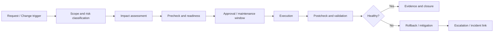

# VDI Change Management Guide

## 0. Document Control

| Trường | Giá trị |
|---|---|
| Thứ tự | 20 |
| Tên tài liệu | VDI Change Management Guide |
| Tên file | 20_VDI_Change_Management_Guide.md |
| Mục đích tài liệu | Chuẩn hóa cách thực hiện thay đổi như image update, policy change, entitlement change, certificate change, broker patching, host maintenance và storage expansion. |
| Nguồn điều khiển | [[sources/vdi-training-idea]], [[sources/vdi-documentation-list-context]] |
| Trạng thái | Tài liệu đào tạo vận hành; quy trình CAB, maintenance window, approver, SLA, owner và mẫu change record thực tế là Need Customer Confirmation |

### Source Grounding

| Nội dung | Nguồn sử dụng | Mức độ tin cậy | Ghi chú |
|---|---|---|---|
| Bối cảnh hai hệ thống VDI quy mô 1500-2000+ VDI và yêu cầu vận hành theo lớp | [[sources/vdi-training-idea]] | High | Dùng làm bối cảnh chính cho change management trong môi trường khách hàng. |
| Tên tài liệu, tên file và mục đích tài liệu | [[sources/vdi-documentation-list-context]] | High | Source of truth cho scope của tài liệu này. |
| Change liên quan Omnissa Horizon: Connection Server, UAG, Horizon Agent, desktop pool, entitlement | [[sources/horizon-8-architecture]], [[concepts/omnissa-horizon]], [[concepts/connection-server]], [[concepts/unified-access-gateway]] | High | Dùng để định hướng change trên nền tảng Horizon. |
| Change liên quan Citrix CVAD: Delivery Controller, StoreFront, Gateway, VDA, Machine Catalog, Delivery Group | [[sources/citrix-virtual-apps-and-desktops-7-2603]], [[concepts/citrix-virtual-apps-and-desktops]], [[concepts/delivery-controller]], [[concepts/storefront]], [[concepts/virtual-delivery-agent]], [[concepts/delivery-group]] | High | Dùng để định hướng change trên nền tảng Citrix. |
| Change liên quan hypervisor, host maintenance, datastore, vCenter, ESXi, XenServer | [[sources/vmware-vsphere-8-0]], [[sources/vcenter-server-installation-and-setup]], [[sources/xenserver-8-4]], [[concepts/vcenter-server]], [[concepts/esxi]], [[concepts/xenserver]], [[concepts/datastore]], [[concepts/storage-repository]] | High | Dùng cho phần host maintenance, storage expansion và dependency hạ tầng. |
| Change lifecycle, risk, rollback, capacity, incident correlation, monitoring evidence | [[concepts/change-management]], [[concepts/capacity-management]], [[concepts/incident-management]], [[concepts/monitoring-and-logs]] | Medium | Dùng để chuẩn hóa tư duy quản trị thay đổi. |

## 1. Mục tiêu đào tạo

Change management trong VDI không phải là thủ tục giấy tờ. Đây là cơ chế bảo vệ dịch vụ khi một thay đổi nhỏ có thể ảnh hưởng hàng trăm hoặc hàng nghìn desktop. Một policy sai có thể làm user mất clipboard hoặc printer. Một image lỗi có thể làm cả pool không đăng ký Agent/VDA. Một certificate thay sai có thể làm user bên ngoài không truy cập được. Một host maintenance thiếu kiểm tra capacity có thể làm cluster quá tải.

Sau khi đọc tài liệu này, engineer cần làm được:

- Nhận diện thay đổi nào trong VDI cần kiểm soát qua change record.
- Phân loại change theo phạm vi ảnh hưởng: user, pool/catalog, broker, gateway, hypervisor, storage, network, identity.
- Viết được precheck, impact assessment, implementation plan, postcheck, rollback plan và evidence list.
- Hiểu rủi ro riêng của image update, policy change, entitlement change, certificate change, broker patching, host maintenance và storage expansion.
- Biết khi nào phải dừng change, rollback hoặc escalation.
- Biết liên hệ change với incident: khi sự cố xảy ra sau maintenance window, recent change là điểm kiểm tra đầu tiên.

Tài liệu này không thay thế quy trình CAB/ITSM chính thức của khách hàng. Những thông tin như mẫu change, thời gian phê duyệt, approver, maintenance window, SLA, escalation path và owner từng lớp cần xác nhận thêm.

## 2. Khi nào một thao tác VDI là change

Không phải mọi thao tác vận hành đều là change. Tuy nhiên trong VDI quy mô lớn, nhiều thao tác nhìn nhỏ nhưng có blast radius rộng.

| Thao tác | Thường là service request | Thường là change | Ghi chú vận hành |
|---|---:|---:|---|
| Cấp user vào AD group có sẵn | Có | Có thể | Nếu cấp lẻ theo quy trình chuẩn có thể là request; nếu thay mapping group-resource là change. |
| Remove entitlement của một user | Có | Có thể | Cần cẩn trọng nếu user production hoặc desktop persistent. |
| Thay policy clipboard/USB/printer | Không | Có | Có thể ảnh hưởng bảo mật và trải nghiệm nhiều user. |
| Publish image mới cho pool/catalog | Không | Có | Rủi ro cao vì lỗi image lan rộng. |
| Patch VDA/Horizon Agent trong image | Không | Có | Cần kiểm tra compatibility và rollback. |
| Patch Connection Server/Delivery Controller/StoreFront/UAG/Gateway | Không | Có | Có thể ảnh hưởng authentication, broker, gateway và session launch. |
| Certificate renewal | Không | Có | Sai certificate hoặc chain có thể làm external/internal access fail. |
| Host maintenance | Không | Có | Cần kiểm tra cluster capacity, VM placement, HA và session impact. |
| Storage expansion | Không | Có | Cần kiểm tra path, datastore, latency, replication/backup nếu có. |
| Reboot một VDI user lẻ | Có | Không thường xuyên | Nếu reboot hàng loạt hoặc theo pool thì nên quản lý như change. |

Nguyên tắc: nếu thay đổi có thể ảnh hưởng nhiều user, nhiều máy, control plane, gateway, identity, storage, network, security policy hoặc dữ liệu, hãy quản lý như change.

## 3. Vòng đời change chuẩn cho VDI

Engineer cần đọc change như một câu chuyện có điều kiện:

1. Thay đổi cái gì?
2. Trên nền tảng nào?
3. Ảnh hưởng tới ai?
4. Dependency nào có thể làm change fail?
5. Dấu hiệu nào cho thấy phải dừng?
6. Rollback về trạng thái nào?
7. Ai xác nhận thành công?
8. Evidence nào chứng minh change an toàn?

Nếu không trả lời được các câu trên, change chưa sẵn sàng.

## 4. Phân loại change theo lớp kiến trúc

| Lớp | Ví dụ change | Rủi ro chính | Precheck quan trọng | Postcheck quan trọng |
|---|---|---|---|---|
| User Access | Cập nhật client requirement, thay portal URL, thay hướng dẫn truy cập | User không login/launch được | User group, pilot endpoint, communication | User test internal/external |
| Gateway | Certificate, gateway config, VIP/LB member, external access rule | External outage, TLS error, session disconnect | Cert chain, LB state, firewall path, rollback config | External login, launch, reconnect |
| Broker/Control Plane | Patch Connection Server/Delivery Controller, StoreFront change | Không enumerate resource, failed session | Service health, DB connectivity, snapshot/backup, node HA | Broker health, resource enumeration, failed session |
| Desktop/Session | Image update, Agent/VDA update, VM tools, app update | Unregistered, black screen, app fail | Image backup/snapshot, pilot pool, compatibility | Registration, launch, app test, login duration |
| Identity | GPO, OU move, AD group mapping, conditional access nếu có | Login fail, policy sai, user mất quyền | Test user, GPO result, group mapping, rollback | Login, policy applied, entitlement visible |
| Hypervisor/HCI | Host maintenance, cluster config, vCenter/XenServer change | VM outage, capacity contention | Cluster headroom, evacuation, datastore, HA | VM power, registration, host alert |
| Storage | Datastore expansion, profile storage change, replication/backup adjustment | Datastore full, profile fail, latency | Capacity, latency baseline, path, backup/replication | Login/profile test, latency, capacity |
| Network | Firewall, VLAN, routing, DNS, load balancer | Gateway/broker/agent unreachable | Flow matrix, DNS, cert, rollback rule | Internal/external flow, registration, launch |
| Policy/Security | Clipboard, USB, printer, drive redirection, timeout | Security exposure hoặc user impact rộng | Policy scope, affected groups, exception list | Effective policy, user experience test |

Trong môi trường thật, mỗi lớp phải có owner rõ. Nếu owner chưa xác định, ghi Need Customer Confirmation.

## 5. Thành phần chính và vai trò trong change

| Thành phần | Vai trò | Rủi ro khi change | Engineer cần kiểm tra | Evidence cần lưu |
|---|---|---|---|---|
| Change record | Hồ sơ chính thức của thay đổi | Thiếu approval, scope mơ hồ, không có rollback | Title, scope, approver, window, risk, rollback | Change ID, approval, timeline |
| Communication plan | Thông báo impact cho bên liên quan | User/helpdesk không biết tình trạng maintenance | Affected group, thông báo trước/sau, contact | Email/ticket notice, recipient list |
| Master image/golden image | Nguồn tạo nhiều VDI | Lỗi lan hàng loạt sau publish | Version, snapshot, app test, agent compatibility | Image version, test result, rollback image |
| Desktop pool / Machine Catalog | Nhóm desktop bị tác động | Pool/catalog unavailable hoặc cạn machine | Target count, available, registration, maintenance mode | Before/after count, state screenshot |
| Delivery Group / Entitlement | Nơi user nhận resource | User mất quyền hoặc được cấp sai quyền | Group mapping, assignment, access policy | Before/after entitlement |
| Broker | Điều phối authentication, entitlement, launch | Failed session diện rộng | Service health, DB, replication/HA, logs | Service state, event/log excerpt |
| Gateway/UAG/StoreFront | Entry point cho access | External/internal access fail | Certificate, VIP, LB member, firewall, portal | Cert detail, LB status, login test |
| Agent/VDA | Thành phần nhận session | Unregistered, black screen, disconnect | Service, version, registration, event log | Registration dashboard, agent log |
| vCenter/ESXi/XenServer/HCI | Nền tảng chạy VM | VM power/capacity issue | Host headroom, task/event, datastore, cluster health | Host/cluster metrics, task log |
| Storage/profile | Lưu disk, image, profile | Login chậm, profile fail, datastore full | Capacity, latency, snapshot growth, path | Storage metrics, profile test |
| Monitoring | Quan sát trước/sau change | Không phát hiện regression | Baseline, alert, trend, dashboards | Before/after metrics, alert IDs |

## 6. Precheck: kiểm tra trước khi thay đổi

Precheck là phần quan trọng nhất của change. Một change chưa làm precheck thực chất là đang thử nghiệm trên production.

### 6.1 Precheck chung

- Change ID, requester, approver và owner đã rõ.
- Scope rõ: nền tảng Horizon hay Citrix, pool/catalog/DG nào, gateway nào, host/datastore nào, user group nào.
- Maintenance window đã được phê duyệt.
- Danh sách affected users hoặc affected services đã xác định.
- Communication đã gửi nếu có impact user.
- Baseline trước change đã lưu: session count, failed session, registered/unregistered, host/storage/network metrics.
- Recent incident hoặc alert đang mở đã được kiểm tra.
- Rollback plan khả thi và người thực hiện rollback có quyền phù hợp.
- Stop condition rõ: khi metric nào xấu đi, lỗi nào xuất hiện, hoặc timeout bao lâu thì dừng.
- Escalation contact rõ cho VDI, identity, network, storage, hypervisor, security và application nếu liên quan.

### 6.2 Precheck theo loại change

| Loại change | Precheck bắt buộc |
|---|---|
| Image update | Snapshot/backup image hiện tại, test image, app smoke test, Agent/VDA/Horizon Agent version, security tool, pilot pool/catalog, rollback image. |
| Policy change | Policy scope, target group, precedence, conflict với GPO/Citrix/Horizon policy khác, test user, rollback setting. |
| Entitlement change | Approval, AD group owner, affected user list, current mapping, nested group, direct assignment, rollback group. |
| Certificate change | Certificate CN/SAN, chain, expiry, private key handling theo quy trình khách hàng, binding target, LB/gateway node, rollback cert. |
| Broker patching | Node HA, database connectivity, snapshot/backup, service health, session drain nếu cần, order patch, compatibility matrix. |
| Host maintenance | Cluster headroom, VM evacuation, HA/DRS hoặc tương đương, datastore path, active sessions, maintenance mode plan. |
| Storage expansion | Current capacity/latency, path health, replication/backup impact, datastore rescan/visibility, rollback/stop condition. |

Không yêu cầu hoặc ghi credential trong tài liệu/change/evidence. Nếu thao tác cần quyền cao, chỉ ghi role/owner cần thực hiện.

## 7. Impact assessment

Impact assessment trả lời: nếu change sai, ai bị ảnh hưởng và mức độ nào.

| Câu hỏi | Vì sao cần hỏi |
|---|---|
| Change ảnh hưởng một user, một group, một pool/catalog hay toàn site? | Xác định blast radius và priority. |
| User nội bộ, user bên ngoài hay cả hai bị ảnh hưởng? | Phân biệt gateway/network path. |
| Có ảnh hưởng login, resource visibility, launch, session runtime hay profile không? | Chọn postcheck đúng. |
| Có thể làm mất dữ liệu hoặc mất quyền truy cập không? | Cần approval và rollback chặt hơn. |
| Có dependency với AD, DNS, certificate, firewall, storage, hypervisor không? | Cần owner liên quan tham gia. |
| Nếu rollback, rollback mất bao lâu và có downtime không? | Đánh giá tính khả thi trước maintenance window. |
| Có batch/pilot được không? | Giảm rủi ro rollout rộng. |

Với VDI quy mô lớn, impact không chỉ tính theo số máy. Một change ảnh hưởng gateway có thể ảnh hưởng ít thành phần nhưng rất nhiều user. Một change image chỉ ảnh hưởng một pool nhưng pool đó có thể chứa hàng trăm desktop.

## 8. Implementation model

### 8.1 Nguyên tắc triển khai

- Thực hiện đúng window đã được duyệt.
- Không mở rộng scope trong lúc change nếu chưa có approval.
- Ghi timestamp cho từng bước quan trọng.
- Nếu có thể, triển khai theo pilot hoặc batch nhỏ trước.
- Theo dõi monitoring song song, không chờ đến cuối mới xem dashboard.
- Khi có dấu hiệu bất thường, dừng và đánh giá trước khi tiếp tục.
- Không xử lý sự cố phát sinh bằng nhiều thay đổi chồng lên nhau nếu chưa khoanh vùng.

### 8.2 Mẫu workflow triển khai

1. Announce start nếu quy trình yêu cầu.
2. Chụp baseline lần cuối.
3. Xác nhận không có incident P1/P2 liên quan đang mở nếu change có thể làm khó RCA.
4. Thực hiện bước đầu tiên hoặc pilot.
5. Kiểm tra technical result ngay sau bước đầu: service, registration, launch, alert.
6. Nếu ổn, tiếp tục batch tiếp theo.
7. Nếu không ổn, dừng theo stop condition.
8. Thực hiện postcheck toàn bộ.
9. Gửi thông báo hoàn tất hoặc rollback nếu cần.
10. Cập nhật evidence và close change.

## 9. Postcheck và validation

Postcheck phải chứng minh change đã đạt mục tiêu và không tạo lỗi mới.

### 9.1 Postcheck chung

- Broker service healthy.
- Gateway/portal truy cập được nếu change liên quan access.
- User test login được.
- User test nhìn thấy đúng desktop/app.
- Launch desktop/app thành công.
- Agent/VDA registered bình thường.
- Session active ổn định, không disconnect ngay.
- Failed session không tăng bất thường.
- Host/datastore/storage/network không có alert mới.
- Ticket/incident trend sau change không tăng bất thường.

### 9.2 Postcheck theo loại change

| Loại change | Postcheck cần có |
|---|---|
| Image update | Pool/catalog nhận image mới, machine registered, app chính chạy, login duration không tăng bất thường, không có lỗi profile/security tool. |
| Policy change | Test user nhận đúng policy, user ngoài scope không bị ảnh hưởng, clipboard/USB/printer/drive/session timeout hoạt động đúng yêu cầu. |
| Entitlement change | User/group thấy đúng resource, user không thuộc scope không thấy resource, audit/group mapping đúng. |
| Certificate change | Certificate chain hợp lệ, portal/gateway không warning, internal/external login và launch thành công. |
| Broker patching | Tất cả node/service healthy, resource enumeration ổn, failed session không tăng, database connectivity ổn. |
| Host maintenance | VM quay lại placement đúng, không có VM stuck/off bất thường, Agent/VDA registered, host không còn alert. |
| Storage expansion | Capacity hiển thị đúng, latency bình thường, datastore accessible, profile/login test thành công. |

## 10. Rollback và điều kiện dừng change

Rollback không phải là "nếu lỗi thì sửa sau". Rollback phải được chuẩn bị trước khi change bắt đầu.

### 10.1 Điều kiện dừng change

Dừng change nếu gặp một trong các dấu hiệu:

- User pilot không login hoặc launch được.
- Agent/VDA unregistered tăng bất thường.
- Failed session tăng vượt baseline.
- Gateway/portal xuất hiện lỗi TLS, timeout hoặc authentication rộng.
- Datastore latency/capacity alert xuất hiện sau thao tác.
- Host/cluster thiếu headroom hoặc VM không evacuate được.
- Broker service/database connectivity không ổn định.
- Rollback point không còn khả thi.
- Impact vượt scope được phê duyệt.

### 10.2 Rollback theo loại change

| Loại change | Rollback point | Lưu ý |
|---|---|---|
| Image update | Image/snapshot trước đó, pool/catalog version trước | Cần biết cách quay lại và thời gian máy nhận image cũ. |
| Policy change | Export/ghi lại setting trước change hoặc policy version trước | Kiểm tra precedence sau rollback. |
| Entitlement change | Group mapping hoặc assignment trước change | Xác nhận user ngoài scope không còn quyền sai. |
| Certificate change | Certificate/binding trước đó | Không ghi private key vào evidence; chỉ lưu metadata an toàn. |
| Broker patching | Snapshot/backup/config backup, node chưa patch trong cụm HA nếu có | Rollback version có thể phức tạp, cần vendor/SOP xác nhận. |
| Host maintenance | Thoát maintenance mode, đưa VM về host/cluster phù hợp | Nếu host lỗi phần cứng, rollback có thể là giữ VM trên host khác. |
| Storage expansion | Dừng expansion, revert config nếu có thể, phối hợp storage owner | Một số storage change khó rollback, cần precheck kỹ. |

Nếu rollback không chắc chắn, change phải được đánh dấu rủi ro cao và cần approval phù hợp.

## 11. Các change phổ biến trong VDI

### 11.1 Image update

Image update là một trong những change có rủi ro cao nhất. Image chứa OS patch, application, security tool, Horizon Agent hoặc Citrix VDA. Một lỗi trong image có thể làm hàng loạt VDI không boot, không registered, login chậm, black screen hoặc application fail.

Checklist đào tạo:

- Xác nhận image version hiện tại và version mới.
- Biết pool/catalog nào sẽ nhận image.
- Có snapshot/rollback image.
- Test bằng user chuẩn và user đặc thù nếu có.
- Kiểm tra agent version và compatibility.
- Kiểm tra application chính, profile, printer/USB/clipboard nếu liên quan.
- Triển khai pilot trước khi rollout diện rộng.
- Theo dõi registration, failed session, login duration và ticket trend sau publish.

### 11.2 Policy change

Policy có thể đến từ Active Directory GPO, Citrix Policy, Horizon policy hoặc security/conditional access nếu có. Policy thay đổi thường tác động trực tiếp tới user experience và security posture.

Rủi ro thường gặp:

- Rule áp sai scope.
- Policy precedence làm setting mới không có hiệu lực.
- Mở clipboard/USB/drive rộng hơn yêu cầu.
- Chặn printer hoặc drive mapping của nhóm nghiệp vụ.
- Session timeout quá ngắn làm user bị disconnect.

Postcheck phải dùng đúng user trong scope và user ngoài scope để tránh thay đổi lan sai nhóm.

### 11.3 Entitlement change

Entitlement change là thay đổi ai được thấy resource nào. Nó có thể là service request nếu cấp user lẻ theo quy trình chuẩn, nhưng trở thành change khi sửa mapping AD group, Delivery Group, application group hoặc desktop pool.

Rủi ro:

- User mất desktop/application.
- User thấy resource không được phép.
- Nested group tạo quyền ngoài dự kiến.
- Remove group làm ảnh hưởng nhiều user hơn dự kiến.

Evidence cần có: mapping trước/sau, group membership, affected user count, approval và validation.

### 11.4 Certificate change

Certificate change liên quan StoreFront, Citrix Gateway, Unified Access Gateway, Connection Server, load balancer hoặc portal. Lỗi certificate có thể làm user không login được, client báo warning, hoặc gateway không proxy session đúng.

Precheck:

- CN/SAN đúng tên truy cập.
- Chain/intermediate CA đầy đủ.
- Expiry và issuer rõ.
- Binding target chính xác.
- Load balancer/gateway node được xử lý theo thứ tự.
- Rollback certificate/binding sẵn sàng.

Postcheck: test internal/external URL, login, launch, reconnect và kiểm tra client warning.

### 11.5 Broker patching

Broker patching bao gồm Horizon Connection Server, Citrix Delivery Controller, StoreFront, hoặc thành phần control plane khác. Đây là change có thể ảnh hưởng resource enumeration và session brokering.

Precheck:

- Xác nhận node role và HA design.
- Kiểm tra database connectivity với Citrix nếu liên quan.
- Kiểm tra replication/service health.
- Có backup/snapshot/config export theo SOP.
- Có thứ tự patch từng node.
- Có test user và resource test.

Không patch toàn bộ node cùng lúc nếu thiết kế HA cho phép rolling patch và SOP khách hàng hỗ trợ.

### 11.6 Host maintenance

Host maintenance ảnh hưởng lớp hypervisor/HCI. Nó có thể gây VM migration, VM power event, resource contention hoặc VDI registration loss nếu capacity không đủ.

Precheck:

- Host cần bảo trì chứa VM nào?
- Có active session quan trọng không?
- Cluster còn đủ CPU/memory khi evacuate không?
- Datastore/path healthy không?
- HA/DRS hoặc cơ chế tương đương có hoạt động không?
- Maintenance mode có được hỗ trợ trong thiết kế hiện tại không?

Postcheck: VM không stuck, không powered off bất thường, Agent/VDA registered, host/cluster alert sạch.

### 11.7 Storage expansion

Storage expansion có vẻ ít chạm user, nhưng nếu làm sai có thể ảnh hưởng datastore, profile storage, image repository, backup hoặc replication.

Precheck:

- Current capacity, latency, IOPS, throughput.
- Datastore/profile path nào bị tác động.
- Backup/replication có bị ảnh hưởng không.
- Hypervisor có cần rescan hoặc refresh không.
- Monitoring threshold có cần cập nhật không.
- Rollback hoặc stop condition là gì.

Postcheck: capacity hiển thị đúng, latency bình thường, profile/login test ổn, không có datastore/path alert.

## 12. Lỗi thường gặp sau change và hướng xử lý

| Triệu chứng sau change | Nguyên nhân có thể | Lớp cần kiểm tra | Evidence cần thu thập | Hướng xử lý | Khi nào escalation |
|---|---|---|---|---|---|
| Nhiều VDI unregistered sau image update | Agent/VDA lỗi, broker list sai, DNS/domain/time sync, image preparation lỗi | Image, Agent/VDA, Identity, Network | Change ID, image version, registration trend, agent log | Dừng rollout, rollback image nếu impact rộng, điều tra pilot | Nhiều máy cùng pool/catalog bị ảnh hưởng |
| User không thấy desktop/app sau entitlement change | Mapping sai, AD group sai, replication/cache, remove nhầm group | Identity, Entitlement, Broker | Before/after mapping, group membership, affected user list | Restore mapping/group, validate user test | Có user production mất quyền hoặc quyền sai |
| External user không truy cập được sau certificate change | Cert chain sai, binding sai, LB/gateway node chưa đồng bộ, firewall/proxy path | Gateway, Certificate, LB, Network | Cert metadata, browser/client error, gateway/LB status | Rollback binding/cert nếu cần, kiểm tra từng node | External access diện rộng lỗi |
| Launch fail sau broker patch | Service chưa healthy, DB connectivity, broker replication, protocol/gateway dependency | Broker, Database, Gateway | Service state, event log, failed session, DB connectivity | Dừng patch node tiếp theo, rollback/repair theo SOP | Failed session tăng hoặc nhiều pool/DG affected |
| Login chậm sau policy change | GPO processing, profile policy, printer/drive mapping, script | Identity, Policy, Profile | Login duration, GPO result, policy before/after | Rollback policy hoặc thu hẹp scope | Nhiều user chậm sau change |
| Storage latency tăng sau expansion | Storage path issue, resync/replication, backend overload, datastore issue | Storage, Hypervisor | Latency before/after, datastore events, storage alert | Dừng hoạt động phụ thuộc, phối hợp storage owner | Latency ảnh hưởng nhiều VDI/session |
| VM bị mất kết nối sau host maintenance | Evacuation fail, host capacity thiếu, network/storage path lỗi | Hypervisor, Network, Storage | Host task log, VM power state, registration | Di chuyển/khôi phục VM theo SOP | Nhiều VM off/unregistered hoặc host alert nghiêm trọng |
| Printer/USB/clipboard lỗi sau policy change | Policy scope hoặc precedence sai, rule security quá chặt | Policy, Endpoint | Policy result, user group, client test | Sửa scope/precedence hoặc rollback setting | Ảnh hưởng nghiệp vụ hoặc security exception |

Không kết luận nguyên nhân nếu chưa có evidence. Luôn gắn triệu chứng với thời điểm change, scope affected và baseline trước change.

## 13. Checklist cho engineer

### 13.1 Trước change

- [ ] Change ID và approval rõ ràng.
- [ ] Scope và affected service/user group rõ.
- [ ] Loại change được phân loại đúng: image, policy, entitlement, certificate, broker, host, storage.
- [ ] Maintenance window và communication đã xác nhận.
- [ ] Baseline đã lưu: session, failed session, registration, host/storage/network, alert.
- [ ] Dependency owner đã biết: AD, network, storage, hypervisor, security, application.
- [ ] Rollback point tồn tại và khả thi.
- [ ] Stop condition được ghi rõ.
- [ ] Test account và validation path sẵn sàng.

### 13.2 Trong change

- [ ] Ghi timestamp từng bước.
- [ ] Thực hiện theo pilot/batch nếu có thể.
- [ ] Không mở rộng scope ngoài approval.
- [ ] Theo dõi monitoring trong khi thao tác.
- [ ] Dừng nếu phát hiện stop condition.
- [ ] Không thực hiện nhiều thay đổi chồng lên nhau để "sửa nhanh" khi chưa rõ nguyên nhân.

### 13.3 Sau change

- [ ] Login test thành công.
- [ ] Resource enumeration đúng.
- [ ] Launch desktop/app thành công.
- [ ] Agent/VDA registered bình thường.
- [ ] Failed session không tăng bất thường.
- [ ] Host/storage/network không có alert mới.
- [ ] User hoặc owner xác nhận nếu change cần business validation.
- [ ] Evidence được đính kèm change record.

### 13.4 Evidence cần lưu

- [ ] Change ID, approval, maintenance window.
- [ ] Before/after screenshot hoặc export cấu hình an toàn.
- [ ] Baseline trước và sau change.
- [ ] Danh sách pool/catalog/DG/user group bị ảnh hưởng.
- [ ] Image/certificate/policy/version metadata, không chứa secret.
- [ ] Test result: login, launch, app, policy, registration.
- [ ] Log excerpt liên quan nếu lỗi.
- [ ] Rollback action và kết quả nếu có.

## 14. Monitoring trong change

| Nhóm chỉ số | Cần theo dõi | Dùng để phát hiện |
|---|---|---|
| Session | Active, disconnected, failed session, launch failure | Impact tới user sau change. |
| Registration | Registered/unregistered, Agent/VDA unreachable | Lỗi image, broker, network hoặc host. |
| Broker/Gateway | Service health, portal status, gateway health, LB member | Control plane hoặc access path lỗi. |
| Identity | Authentication failure, account/group issue, GPO processing | Login/policy regression. |
| Host/Cluster | CPU, memory, VM migration, VM power event | Host maintenance hoặc capacity issue. |
| Storage | Datastore capacity, latency, IOPS, profile storage | Storage expansion, image/profile issue. |
| Network | Latency, packet loss, DNS, certificate, firewall hit | Access/registration/session disconnect. |
| Ticket trend | New incident volume, repeated user reports | Regression chưa thấy trên dashboard. |

Monitoring cần so sánh với baseline. Một metric cao không phải lúc nào cũng là lỗi nếu bình thường nó đã cao vào khung giờ đó. Điều quan trọng là change có làm trend xấu đi hay không.

## 15. Security và RBAC trong change

- Engineer chỉ thực hiện change trong phạm vi quyền được cấp.
- Helpdesk không nên có quyền thay đổi image, broker, gateway, certificate, storage hoặc host maintenance.
- Entitlement change phải có approval và audit trail.
- Policy change liên quan clipboard, USB, drive mapping, printer, timeout hoặc MFA/conditional access cần có đánh giá security.
- Certificate/private key phải xử lý theo quy trình bảo mật của khách hàng; tài liệu và ticket không được chứa secret, password, token hoặc private key.
- Break-glass hoặc emergency change nếu có phải theo quy trình khách hàng, không tự định nghĩa.
- Tách vai trò người đề xuất, người phê duyệt và người thực hiện nếu quy trình yêu cầu separation of duties.

## 16. Scenario Based Learning

### Scenario 1: Image update làm 40% máy trong pool unregistered

**Bối cảnh:** Sau maintenance window, pool nhận image mới. Dashboard cho thấy nhiều VDI unregistered và user báo không launch được.

**Câu hỏi cho học viên:**

1. Có tiếp tục rollout không?
2. Evidence nào cần thu thập trước khi rollback?
3. Lớp nào cần kiểm tra đầu tiên?

**Gợi ý phân tích:** Recent change là image. Dừng rollout, so sánh máy nhận image mới với máy chưa nhận, kiểm tra Agent/VDA/Horizon Agent, DNS, domain join, broker list và event log.

**Hướng xử lý đề xuất:** Nếu impact rộng và rollback point có sẵn, rollback về image trước theo change plan. Escalate image/platform owner nếu registration fail đồng loạt.

**Evidence cần lưu:** Change ID, image version, affected pool/catalog, registration trend, agent log, rollback time, post-rollback result.

### Scenario 2: Certificate renewal làm external user không vào được

**Bối cảnh:** Internal user vẫn truy cập được, external user báo TLS warning hoặc timeout sau certificate change.

**Câu hỏi cho học viên:**

1. Vì sao internal/external comparison quan trọng?
2. Kiểm tra gateway hay broker trước?
3. Rollback thế nào?

**Gợi ý phân tích:** Nếu internal bình thường, nghiêng về gateway, certificate binding, chain, LB node hoặc firewall/proxy path. Broker chưa chắc là nguyên nhân.

**Hướng xử lý đề xuất:** Kiểm tra certificate CN/SAN/chain, binding từng node, LB member, gateway log. Rollback certificate/binding nếu lỗi diện rộng và rollback point còn khả thi.

**Evidence cần lưu:** Client error, certificate metadata an toàn, gateway/LB status, internal/external test result.

### Scenario 3: Policy change làm printer biến mất với một nhóm user

**Bối cảnh:** Sau change hạn chế printer mapping, một nhóm nghiệp vụ không in được.

**Câu hỏi cho học viên:**

1. Đây là incident hay expected impact?
2. Kiểm tra policy scope như thế nào?
3. Có nên mở lại printer cho toàn bộ user không?

**Gợi ý phân tích:** Đối chiếu affected group với scope được phê duyệt. Kiểm tra policy precedence, AD group, Citrix/Horizon policy và GPO. Không mở rộng policy toàn môi trường nếu chỉ một nhóm cần exception.

**Hướng xử lý đề xuất:** Rollback hoặc tạo exception theo approval. Validate bằng user trong scope và ngoài scope.

**Evidence cần lưu:** Policy before/after, affected user group, test print result, approval cho exception.

### Scenario 4: Host maintenance gây thiếu capacity

**Bối cảnh:** Một host đưa vào maintenance, VM migration xong nhưng sau đó nhiều session chậm và host còn lại CPU/memory cao.

**Câu hỏi cho học viên:**

1. Precheck nào đã thiếu?
2. Có nên tiếp tục bảo trì host thứ hai không?
3. Escalation cho ai?

**Gợi ý phân tích:** Có thể cluster headroom không đủ hoặc placement không cân bằng. Dừng maintenance tiếp theo, kiểm tra host resource, VM placement, active sessions, datastore latency và alert.

**Hướng xử lý đề xuất:** Thoát maintenance nếu phù hợp, phân bổ lại VM, phối hợp hypervisor/HCI owner và capacity owner.

**Evidence cần lưu:** Host metrics before/after, VM migration task, session complaint timeline, registration state.

## 17. Hands-on hoặc bài tập tư duy

1. Viết change plan cho image update của một pool 300 VDI, gồm precheck, pilot, postcheck, rollback và stop condition.
2. Cho một certificate sắp hết hạn trên gateway, liệt kê các bước kiểm tra trước và sau khi thay.
3. Đọc một policy change về USB redirection và xác định rủi ro security, rủi ro user experience và cách test.
4. Thiết kế evidence package cho broker patching rolling upgrade.
5. Phân tích một incident "user không thấy desktop sau maintenance" và tìm cách liên hệ với recent change.
6. Lập bảng RACI đơn giản cho change storage expansion: VDI, storage, hypervisor, network, application, service owner.

## 18. Knowledge Check

**Câu 1. Vì sao image update trong VDI là change rủi ro cao?**  
Vì một image có thể được dùng cho hàng trăm hoặc hàng nghìn VDI. Lỗi trong image có thể gây unregistered, login fail, app fail hoặc black screen diện rộng.

**Câu 2. Rollback plan tốt cần có những gì?**  
Cần có rollback point cụ thể, điều kiện kích hoạt rollback, người có quyền thực hiện, thời gian dự kiến, postcheck sau rollback và evidence cần lưu.

**Câu 3. Vì sao precheck capacity quan trọng trước host maintenance?**  
Vì VM/session phải chạy trên host còn lại. Nếu cluster không đủ headroom, user có thể gặp chậm, disconnect hoặc VM không migrate được.

**Câu 4. Entitlement change có rủi ro bảo mật gì?**  
Cấp nhầm group hoặc mapping sai có thể làm user thấy desktop/app không được phép hoặc mất quyền truy cập tài nguyên cần thiết.

**Câu 5. Sau certificate change, external user lỗi nhưng internal user bình thường. Nên nghiêng về lớp nào?**  
Gateway, certificate binding, certificate chain, load balancer, firewall/NAT hoặc external access path.

**Câu 6. Vì sao postcheck không chỉ là xem change task báo success?**  
Task success chỉ chứng minh thao tác kỹ thuật hoàn tất. VDI còn cần login, resource visibility, launch, session stability, registration và monitoring trend ổn.

**Câu 7. Stop condition là gì?**  
Là điều kiện được định nghĩa trước để dừng change, ví dụ failed session tăng, nhiều VDI unregistered, gateway lỗi, datastore latency tăng hoặc impact vượt scope.

**Câu 8. Policy change cần test user ngoài scope vì sao?**  
Để xác nhận policy không lan sai nhóm và không ảnh hưởng user không thuộc phạm vi change.

**Câu 9. Khi nào change nên chuyển thành incident?**  
Khi change gây impact ngoài dự kiến, ảnh hưởng service/user, không thể khôi phục nhanh hoặc vượt SLA/priority theo quy trình khách hàng.

**Câu 10. Evidence tối thiểu khi close change gồm gì?**  
Change ID, approval, before/after baseline, action timeline, validation result, rollback result nếu có, screenshot/log an toàn và xác nhận owner/user nếu cần.

## 19. Common Misconceptions

- "Change thành công nếu console báo completed." Sai. Phải kiểm tra user access, launch, registration, monitoring và ticket trend.
- "Rollback để sau tính." Sai. Rollback phải có trước khi bắt đầu change.
- "Patch từng node giống nhau nên có thể patch hết cùng lúc." Rủi ro cao. Nếu có HA và SOP hỗ trợ, nên rolling theo node/batch.
- "Policy change nhỏ không cần kiểm soát." Sai nếu policy ảnh hưởng clipboard, USB, printer, timeout, drive mapping hoặc security boundary.
- "Storage expansion chỉ là việc của storage team." Sai. VDI engineer vẫn phải validate datastore/profile/login/session impact.
- "Không có user gọi nghĩa là change ổn." Chưa đủ. Cần monitoring và validation chủ động, nhất là ngoài giờ.

## 20. Need Customer Confirmation

Các thông tin cần hỏi khách hàng để biến tài liệu này thành SOP chi tiết:

- Quy trình change chính thức: ITSM tool, CAB, emergency change, standard change, lead time.
- Ai có quyền approve từng loại change: image, policy, entitlement, certificate, broker, host, storage.
- Maintenance window chuẩn cho Horizon, Citrix, hypervisor, storage và network.
- Mẫu change record bắt buộc gồm những trường nào?
- Tiêu chí priority/impact/urgency nếu change gây incident.
- Quy định communication cho user, helpdesk, service owner và security.
- Baseline/threshold chính thức cho session, failed session, registration, storage latency, host utilization.
- Tool monitoring và dashboard nào là nguồn chính thức trong change.
- Backup/snapshot/config export nào bắt buộc trước từng loại change.
- Rollback method chính thức cho image, policy, entitlement, certificate, broker patch, host maintenance và storage expansion.
- Horizon/CVAD version, Agent/VDA version và compatibility matrix đang áp dụng.
- HA design cho Connection Server, Delivery Controller, StoreFront, Gateway/UAG, database, hypervisor và storage.
- Quy định pilot/batch khi publish image hoặc mở rộng pool/catalog.
- Escalation path theo lớp: VDI, AD/IAM, network, storage, hypervisor/HCI, security, application, vendor.
- Evidence retention: lưu ở ticket, CMDB, change record hay knowledge base; giữ bao lâu.

## 21. Related Wiki Links

### Source summaries

- [[sources/vdi-training-idea]]
- [[sources/vdi-documentation-list-context]]
- [[sources/horizon-8-architecture]]
- [[sources/citrix-virtual-apps-and-desktops-7-2603]]
- [[sources/vmware-vsphere-8-0]]
- [[sources/vcenter-server-installation-and-setup]]
- [[sources/xenserver-8-4]]

### Concepts

- [[concepts/change-management]]
- [[concepts/capacity-management]]
- [[concepts/incident-management]]
- [[concepts/monitoring-and-logs]]
- [[concepts/omnissa-horizon]]
- [[concepts/connection-server]]
- [[concepts/unified-access-gateway]]
- [[concepts/citrix-virtual-apps-and-desktops]]
- [[concepts/delivery-controller]]
- [[concepts/storefront]]
- [[concepts/virtual-delivery-agent]]
- [[concepts/delivery-group]]
- [[concepts/vcenter-server]]
- [[concepts/esxi]]
- [[concepts/xenserver]]
- [[concepts/datastore]]
- [[concepts/storage-repository]]
- [[concepts/snapshot]]
- [[concepts/user-profile-management]]
- [[concepts/identity-and-access-management]]

### Topic documents

- [[topics/6_Identity_and_Domain_Integration_Guide]]
- [[topics/7_Hypervisor_and_HCI_Operations_Guide]]
- [[topics/8_Storage_Operations_for_VDI]]
- [[topics/9_Network_Operations_for_VDI]]
- [[topics/10_VDI_Security_and_Policy_Management_Guide]]
- [[topics/11_VDI_Provisioning_and_Allocation_Guide]]
- [[topics/12_Master_Image_Management_Guide]]
- [[topics/13_Citrix_Machine_Catalog_and_Delivery_Group_Guide]]
- [[topics/14_Omnissa_Desktop_Pool_and_Entitlement_Guide]]
- [[topics/15_VDI_Monitoring_and_Alerting_Guide]]
- [[topics/17_VDI_Incident_Classification_Guide]]
- [[topics/18_VDI_Troubleshooting_Playbook]]
- [[topics/19_VDI_Performance_and_Capacity_Guide]]
- [[topics/21_VDI_Patch_and_Upgrade_Guide]]
- [[topics/22_VDI_Backup_and_Recovery_Guide]]
- [[topics/23_VDI_High_Availability_and_Disaster_Recovery_Guide]]

## 22. Summary for Learners

Thứ tự tư duy khi đọc hoặc thực hiện một change VDI:

1. Change tác động lớp nào: image, policy, entitlement, certificate, broker, host, storage hay network?
2. Scope là một user, một pool/catalog, một gateway, một cluster hay toàn nền tảng?
3. Baseline trước change đã lưu chưa?
4. Precheck dependency đã đủ chưa?
5. Rollback point có thật và khả thi không?
6. Stop condition có rõ không?
7. Postcheck có mô phỏng được trải nghiệm user thật không?
8. Evidence có đủ để audit, RCA hoặc escalation không?

Điều cần nhớ nhất: trong VDI quy mô lớn, change an toàn không phải là thao tác đúng trên console, mà là kiểm soát được blast radius, có đường quay lại, xác nhận được user experience sau thay đổi và có evidence đủ rõ nếu cần điều tra.

## 23. Self Review

- [x] Đúng tên tài liệu trong list_context.txt.
- [x] Đúng tên file trong cột Name File.
- [x] Đúng mục đích: image update, policy change, entitlement change, certificate change, broker patching, host maintenance và storage expansion.
- [x] Bám bối cảnh training_idea.md: Horizon on HCI, Citrix CVAD trên XenServer/ESXi, quy mô 1500-2000+ VDI.
- [x] Không bịa version, topology, maintenance window, SLA, approver, owner hoặc quy trình CAB của khách hàng.
- [x] Có phân biệt Need Customer Confirmation.
- [x] Có workflow change, precheck, impact assessment, postcheck, rollback và stop condition.
- [x] Có lỗi thường gặp sau change và hướng xử lý theo evidence.
- [x] Có scenario, bài tập tư duy, knowledge check và checklist hiện trường.
- [x] Có liên kết tới source, concept và topic liên quan.
- [x] Phù hợp cho system engineer chuẩn bị tham gia vận hành thực tế.
