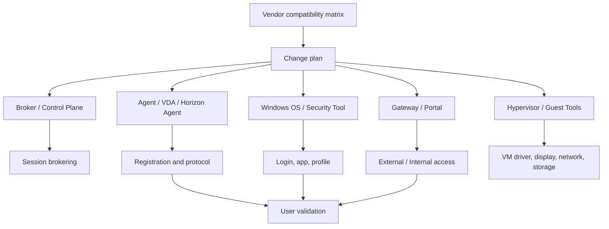

# VDI Patch and Upgrade Guide

## 0. Document Control

| Trường | Giá trị |
|---|---|
| Thứ tự | 21 |
| Tên tài liệu | VDI Patch and Upgrade Guide |
| Tên file | 21_VDI_Patch_and_Upgrade_Guide.md |
| Mục đích tài liệu | Mô tả nguyên tắc cập nhật Delivery Controller, StoreFront, Citrix Gateway, VDA, Connection Server, UAG, Horizon Agent, hypervisor tools và Windows patch. |
| Nguồn điều khiển | [[sources/vdi-training-idea]], [[sources/vdi-documentation-list-context]] |
| Trạng thái | Tài liệu đào tạo vận hành; version thật, compatibility matrix, thứ tự upgrade chính thức, maintenance window và rollback method là Need Customer Confirmation |

### Source Grounding

| Nội dung | Nguồn sử dụng | Mức độ tin cậy | Ghi chú |
|---|---|---|---|
| Bối cảnh hai hệ thống VDI, quy mô 1500-2000+ VDI, yêu cầu vận hành thực tế | [[sources/vdi-training-idea]] | High | Dùng để giữ đúng bối cảnh khách hàng. |
| Tên tài liệu, tên file và mục đích tài liệu | [[sources/vdi-documentation-list-context]] | High | Source of truth cho scope file 21. |
| Omnissa Horizon, Connection Server, UAG, Horizon Agent, desktop pool | [[sources/horizon-8-architecture]], [[concepts/omnissa-horizon]], [[concepts/connection-server]], [[concepts/unified-access-gateway]] | High | Dùng cho patch/upgrade phía Horizon. |
| Citrix CVAD, Delivery Controller, StoreFront, Gateway, VDA, Delivery Group | [[sources/citrix-virtual-apps-and-desktops-7-2603]], [[concepts/citrix-virtual-apps-and-desktops]], [[concepts/delivery-controller]], [[concepts/storefront]], [[concepts/virtual-delivery-agent]], [[concepts/delivery-group]] | High | Dùng cho patch/upgrade phía Citrix. |
| vCenter, ESXi, XenServer, VM, datastore, hypervisor tools | [[sources/vmware-vsphere-8-0]], [[sources/vcenter-server-installation-and-setup]], [[sources/xenserver-8-4]], [[concepts/vcenter-server]], [[concepts/esxi]], [[concepts/xenserver]], [[concepts/virtual-machine]], [[concepts/datastore]] | High | Dùng cho phần hạ tầng và guest tools. |
| Certificate, load balancing, firewall, lifecycle, HA, monitoring, change | [[concepts/certificate-management]], [[concepts/load-balancing]], [[concepts/firewall-ports]], [[concepts/lifecycle-management]], [[concepts/high-availability]], [[concepts/monitoring-and-logs]], [[concepts/change-management]] | Medium | Dùng để đào tạo rủi ro vận hành khi patch/upgrade. |

## 1. Mục tiêu đào tạo

Patch và upgrade trong VDI là hoạt động bảo trì bắt buộc nhưng có rủi ro cao. Một bản vá Windows có thể làm VDA hoặc Horizon Agent không ổn định. Một upgrade broker có thể ảnh hưởng resource enumeration. Một patch gateway có thể làm user bên ngoài không launch được. Một nâng cấp hypervisor tools có thể cần reboot hàng loạt VM. Trong môi trường 1500-2000+ VDI, rủi ro không nằm ở từng máy đơn lẻ mà ở hiệu ứng lan rộng.

Sau khi đọc tài liệu này, engineer cần:

- Phân biệt patch, upgrade, hotfix, security update, agent update, broker upgrade và guest tools update.
- Hiểu thứ tự kiểm tra tương thích giữa broker, gateway, agent, VDA/Horizon Agent, hypervisor tools, Windows patch và master image.
- Biết chuẩn bị precheck, pilot, batch rollout, postcheck và rollback cho từng nhóm thành phần.
- Biết các triệu chứng thường gặp sau patch: unregistered, launch fail, black screen, login chậm, external access fail, profile issue, performance regression.
- Biết evidence cần lưu để chứng minh patch thành công hoặc để escalation khi patch gây lỗi.

Tài liệu này không đưa version cụ thể hoặc thứ tự upgrade chính thức của khách hàng vì chưa có dữ liệu thật. Khi triển khai thực tế, engineer phải đối chiếu với vendor documentation, compatibility matrix và SOP khách hàng.

## 2. Patch, upgrade và update khác nhau thế nào

| Khái niệm | Ý nghĩa vận hành | Ví dụ trong VDI | Rủi ro chính |
|---|---|---|---|
| Patch | Cập nhật sửa lỗi hoặc bảo mật trong cùng nhánh version | Windows security patch, hotfix VDA, ESXi patch | Regression, cần reboot, xung đột agent/security tool |
| Upgrade | Nâng cấp sang version/build lớn hơn | CVAD version mới, Horizon version mới, vCenter/ESXi major upgrade | Compatibility, database/schema, rollback phức tạp |
| Agent update | Cập nhật thành phần trên desktop/session host | Citrix VDA, Horizon Agent, VMware Tools/hypervisor tools | Unregistered, black screen, display/protocol lỗi |
| Broker/control plane update | Cập nhật thành phần điều phối | Delivery Controller, Connection Server, StoreFront | Resource enumeration fail, broker service lỗi |
| Gateway update | Cập nhật hoặc nâng version gateway/edge | Citrix Gateway, UAG | External access fail, certificate/TLS/protocol issue |
| OS patch | Cập nhật Windows trên master image hoặc server | Windows patch cho VDI, broker server, StoreFront | Reboot, app compatibility, login/profile regression |

Patch thường được xem là bảo trì định kỳ. Upgrade thường cần chuẩn bị kỹ hơn vì có thể thay đổi version compatibility, schema, tính năng, driver, protocol hoặc behavior của nền tảng.

## 3. Nguyên tắc vàng khi patch/upgrade VDI

1. **Không patch production rộng khi chưa có pilot.** Pilot giúp phát hiện lỗi trên một nhóm nhỏ trước khi lan tới hàng trăm VDI.
2. **Không nâng agent trước khi hiểu broker compatibility.** VDA/Horizon Agent, broker và gateway phải nằm trong ma trận tương thích được vendor hỗ trợ.
3. **Không chỉ nhìn task success.** Patch thành công về mặt cài đặt chưa chứng minh user login/launch/session ổn.
4. **Không patch nhiều lớp cùng lúc nếu không cần.** Nếu vừa patch broker, gateway, agent và Windows cùng một window, RCA sẽ rất khó khi lỗi xảy ra.
5. **Luôn có rollback hoặc recovery path.** Nếu rollback không khả thi, change phải được xem là rủi ro cao.
6. **Theo dõi sau patch đủ lâu.** Một số lỗi chỉ xuất hiện khi user login đồng thời đầu giờ, khi profile attach hoặc khi application mở.

## 4. Mô hình dependency khi patch/upgrade

Engineer cần nhìn patch theo chuỗi phụ thuộc:

- Broker/gateway quyết định user có login, thấy resource và thiết lập session được không.
- Agent/VDA/Horizon Agent quyết định desktop có registered và nhận session được không.
- Windows patch và security tool quyết định login, application, profile, driver và stability.
- Hypervisor tools ảnh hưởng driver mạng, storage, display, time sync và VM integration.
- Monitoring quyết định có phát hiện regression sớm hay không.

## 5. Thành phần cần patch/upgrade và trọng tâm kiểm tra

| Thành phần | Vai trò | Khi patch/upgrade cần chú ý | Triệu chứng lỗi sau patch | Evidence cần lưu |
|---|---|---|---|---|
| Citrix Delivery Controller | Broker/control plane của CVAD | Version compatibility, database, service health, rolling order | Không thấy app/desktop, failed session, broker service lỗi | Version before/after, service status, event log, failed session |
| StoreFront | Portal/resource enumeration cho Citrix | Store config, certificate, callback/gateway integration, authentication | User login được nhưng không thấy resource hoặc launch fail | StoreFront health, auth/resource enumeration test |
| Citrix Gateway | External access/proxy/ICA path | Certificate, VIP/LB, firmware compatibility, STA/StoreFront integration | External user timeout, TLS warning, launch fail | Gateway build, cert metadata, LB status, external test |
| Citrix VDA | Agent trên desktop/session host | Compatibility với controller, master image, OS, security tool, reboot | VDA unregistered, black screen, session disconnect | VDA version, registration dashboard, event log |
| Horizon Connection Server | Broker cho Horizon | Pod/replication, certificate, service, UAG integration | User không thấy pool, launch fail, authentication issue | Version, service health, connection test |
| Unified Access Gateway | Secure edge/gateway Horizon | Appliance version, certificate, network path, tunnel/protocol | External access fail, protocol disconnect | UAG version, cert, gateway log, external launch |
| Horizon Agent | Agent trên desktop/RDSH | Compatibility với Connection Server, display protocol, image | Agent unreachable, unregistered, black screen | Agent version, registration, desktop event log |
| Hypervisor tools | Driver/integration bên trong VM | Driver network/storage/display, reboot, guest OS support | Network drop, display issue, performance regression | Tools version, VM events, device status |
| Windows patch | OS security/stability | App compatibility, GPO, profile, reboot, security agent | Login chậm, app lỗi, profile issue, BSOD/reboot loop | KB/build, pilot result, event log, login metrics |
| vCenter/ESXi/XenServer | Hạ tầng chạy VM | Host compatibility, cluster capacity, maintenance mode, backup | VM migration fail, host alert, VM power issue | Host version, task log, cluster metrics |

## 6. Chiến lược thứ tự patch/upgrade

Không có một thứ tự cố định đúng cho mọi môi trường. Thứ tự thật phải theo vendor support matrix và SOP khách hàng. Tuy nhiên về tư duy vận hành, engineer cần hiểu các mô hình phổ biến sau.

### 6.1 Nguyên tắc thứ tự chung

- Xác nhận version hiện tại của toàn bộ stack trước khi lập kế hoạch.
- Đọc release notes, known issues và compatibility matrix.
- Ưu tiên xử lý thành phần HA theo kiểu rolling nếu thiết kế hỗ trợ.
- Pilot agent/image trước khi rollout rộng.
- Không nâng tất cả desktop image cùng lúc nếu chưa có test pool/catalog.
- Sau mỗi lớp, postcheck rồi mới chuyển lớp tiếp theo.

### 6.2 Ví dụ thứ tự logic cho Citrix CVAD

| Bước | Mục tiêu | Kiểm tra chính |
|---|---|---|
| 1 | Chuẩn bị change, backup/config export, compatibility | Version matrix, DB, StoreFront, Gateway, VDA compatibility |
| 2 | Patch/upgrade Delivery Controller theo thứ tự node nếu HA | Service health, database connectivity, Studio/Director nếu có |
| 3 | Patch/upgrade StoreFront nếu nằm trong scope | Login, resource enumeration, Gateway integration |
| 4 | Patch/upgrade Citrix Gateway nếu nằm trong scope | External login, ICA launch, certificate/TLS |
| 5 | Update VDA trong master image hoặc pilot machine | VDA registration, launch, app, profile, print/USB policy |
| 6 | Rollout image/VDA theo batch | Registered/available machine, failed session trend |

Đây là mô hình đào tạo, không phải thứ tự chính thức cho khách hàng. Nếu vendor hoặc khách hàng yêu cầu thứ tự khác, ưu tiên tài liệu vendor và SOP đã phê duyệt.

### 6.3 Ví dụ thứ tự logic cho Omnissa Horizon

| Bước | Mục tiêu | Kiểm tra chính |
|---|---|---|
| 1 | Chuẩn bị compatibility và backup/snapshot | Connection Server, UAG, Agent, vCenter/ESXi compatibility |
| 2 | Patch/upgrade Connection Server theo node/pod design | Service health, entitlement, pool visibility |
| 3 | Patch/upgrade UAG nếu nằm trong scope | External login, tunnel/protocol, certificate |
| 4 | Update Horizon Agent trong master image/pilot desktop | Agent registration, launch, display protocol |
| 5 | Rollout image hoặc agent theo pool/batch | Registered/available, login duration, failed session |
| 6 | Theo dõi sau rollout | Ticket trend, monitoring, user feedback |

### 6.4 Hypervisor và guest tools

Hypervisor patch/upgrade thường nằm ở lớp hạ tầng. Với VDI, nó vẫn cần phối hợp chặt vì ảnh hưởng VM power, migration, storage path, network driver và guest tools.

Engineer cần xác nhận:

- Host có thể vào maintenance mode không.
- Cluster còn đủ headroom không.
- VM có active sessions nhạy cảm không.
- Guest tools/hypervisor tools có cần update sau host upgrade không.
- Windows image có cần cập nhật driver/tools không.
- Nếu tools update cần reboot, batch reboot sẽ ảnh hưởng bao nhiêu user.

## 7. Precheck trước patch/upgrade

### 7.1 Precheck chung

- Change ID và approval đã có.
- Scope rõ: nền tảng nào, component nào, version nào, pool/catalog nào.
- Current version và target version đã ghi lại.
- Release notes, known issues, compatibility matrix đã được review.
- Backup, snapshot hoặc config export đã thực hiện theo SOP.
- Maintenance window và communication đã xác nhận.
- HA/rolling plan đã xác định nếu có nhiều node.
- Pilot/test group đã xác định.
- Monitoring baseline đã lưu: session, failed session, registration, host/storage/network.
- Rollback/recovery path đã viết rõ.
- Escalation contact của VDI, identity, network, storage, hypervisor, security và vendor nếu cần đã có.

### 7.2 Precheck theo component

| Component | Precheck bắt buộc |
|---|---|
| Delivery Controller | Controller count, database connectivity, service health, version compatibility, backup/config export, node order. |
| StoreFront | Store config, authentication method, certificate, Gateway integration, resource enumeration test. |
| Citrix Gateway | Firmware/build, backup config, certificate chain, VIP/LB member, STA/StoreFront integration, external test path. |
| VDA | OS build, VDA version, master image snapshot, security tool, app test, registration test, rollback image. |
| Connection Server | Node/pod design, replication/health, certificate, service state, UAG integration, backup/snapshot. |
| UAG | Appliance config export, certificate, network path, Connection Server target, tunnel/protocol settings. |
| Horizon Agent | OS build, Agent version, master image snapshot, display protocol, VM tools, registration test. |
| Hypervisor tools | Guest OS support, driver impact, reboot requirement, pilot VM, snapshot/rollback strategy. |
| Windows patch | KB list, known issues, application compatibility, security tool compatibility, reboot plan, pilot group. |

## 8. Pilot và rollout theo batch

Pilot không phải thủ tục hình thức. Pilot là cách phát hiện lỗi trước khi user production chịu ảnh hưởng lớn.

### 8.1 Chọn pilot như thế nào

- Có ít nhất một desktop hoặc một nhóm user đại diện cho workload chính.
- Có user test hoặc application owner có thể xác nhận nghiệp vụ.
- Có cả internal và external access test nếu change ảnh hưởng gateway/broker.
- Có profile/login/application test, không chỉ kiểm tra VM powered on.
- Pilot đủ thời gian để phát hiện lỗi sau reboot, logon, reconnect và app launch.

### 8.2 Rollout theo batch

| Batch | Mục tiêu | Điều kiện để đi tiếp |
|---|---|---|
| Pilot | Xác nhận bản patch không gây lỗi cơ bản | Login/launch/registration/app/profile ổn |
| Batch nhỏ | Kiểm tra impact trên nhóm hạn chế | Không tăng failed session/unregistered bất thường |
| Batch trung bình | Xác nhận trend ổn khi số lượng tăng | Monitoring ổn, ticket không tăng |
| Rollout rộng | Hoàn tất theo scope | Postcheck tổng thể đạt |

Nếu bất kỳ batch nào có lỗi chưa rõ nguyên nhân, dừng rollout. Không tiếp tục vì "chỉ còn vài batch".

## 9. Postcheck sau patch/upgrade

Postcheck cần bao phủ cả kỹ thuật nền và trải nghiệm user.

### 9.1 Postcheck chung

- Component hiển thị đúng target version.
- Service liên quan running/healthy.
- Broker có thể enumerate resource.
- User test login thành công.
- User test thấy đúng desktop/application.
- Launch desktop/application thành công.
- Agent/VDA/Horizon Agent registered.
- Không tăng failed session bất thường.
- Session reconnect/disconnect hoạt động bình thường nếu scope liên quan.
- Login duration, profile loading, app launch không xấu đi bất thường.
- Host/datastore/network/gateway không có alert mới.
- Ticket trend sau patch được theo dõi.

### 9.2 Postcheck theo component

| Component | Postcheck cần có |
|---|---|
| Delivery Controller | Service health, database connectivity, resource enumeration, VDA registration, failed session trend. |
| StoreFront | Login portal, resource visible, launch file/flow, Gateway callback nếu có. |
| Citrix Gateway | External login, ICA launch, certificate/TLS, reconnect, LB member healthy. |
| VDA | Registered, launch desktop/app, HDX/ICA stability, printer/clipboard/USB nếu policy liên quan. |
| Connection Server | Entitlement visible, pool state, login/launch, replication/service health. |
| UAG | External Horizon login, tunnel/protocol, certificate, reconnect. |
| Horizon Agent | Registered, desktop available, display protocol, black screen/disconnect check. |
| Hypervisor tools | VM device health, network/storage/display driver, time sync, reboot stability. |
| Windows patch | OS build/KB installed, app smoke test, profile load, GPO processing, security tool health. |

## 10. Rollback và recovery

Patch/upgrade rollback có thể đơn giản hoặc rất khó tùy component. Vì vậy trước khi bắt đầu, engineer phải biết rollback thực sự là gì.

| Component | Rollback/recovery thường gặp | Rủi ro cần biết |
|---|---|---|
| Delivery Controller | Restore snapshot/backup hoặc theo vendor rollback path | Database/schema hoặc version downgrade có thể phức tạp. |
| StoreFront | Restore config/snapshot, revert server patch | Cần giữ đồng bộ config giữa node nếu có nhiều StoreFront. |
| Citrix Gateway | Restore config backup hoặc firmware rollback theo SOP | Gateway rollback sai có thể ảnh hưởng external access. |
| VDA | Rollback master image/snapshot, redeploy image cũ | Cần thời gian để machine nhận image cũ và registered lại. |
| Connection Server | Restore snapshot/backup hoặc vendor rollback path | Pod/replication/version mismatch có thể gây rủi ro. |
| UAG | Redeploy/revert appliance config hoặc snapshot nếu SOP cho phép | Cần certificate/network config chính xác. |
| Horizon Agent | Rollback image/snapshot hoặc reinstall Agent theo SOP | Có thể cần reboot và ảnh hưởng user session. |
| Hypervisor tools | Rollback snapshot/pilot VM hoặc reinstall tools version trước | Driver rollback không phải lúc nào cũng sạch. |
| Windows patch | Uninstall KB, restore snapshot/image, rollback image | Một số patch khó gỡ hoặc cần reboot nhiều lần. |

Nếu rollback yêu cầu restore database, downgrade version hoặc can thiệp vendor, change phải được đánh giá rủi ro cao và có escalation sẵn.

## 11. Lỗi thường gặp sau patch/upgrade và hướng xử lý

| Triệu chứng | Nguyên nhân có thể | Lớp cần kiểm tra | Evidence cần thu thập | Hướng xử lý | Khi nào escalation |
|---|---|---|---|---|---|
| VDA/Horizon Agent unregistered sau update | Agent version không tương thích, service lỗi, firewall/DNS/domain issue, image preparation lỗi | Agent, Broker, Identity, Network, Image | Version before/after, registration trend, event log, affected machine list | Dừng rollout, rollback image/agent nếu nhiều máy lỗi, kiểm tra broker list/DNS | Nhiều machine cùng pool/catalog unregistered |
| User login portal được nhưng không thấy resource | Broker/StoreFront/Connection Server issue, entitlement cache, service lỗi sau patch | Broker, Portal, Entitlement | User/group, resource enumeration result, broker/portal logs | Kiểm tra service/config, rollback node nếu sau patch | Nhiều user hoặc nhiều resource affected |
| External launch fail sau Gateway/UAG patch | Certificate/TLS, gateway firmware, LB, protocol tunnel, firewall | Gateway, LB, Network, Certificate | External error, cert metadata, gateway log, LB member status | Rollback gateway/config hoặc xử lý cert/LB theo evidence | External access diện rộng fail |
| Black screen sau VDA/Agent/Windows patch | Display driver, protocol component, security tool, shell/profile | Agent, OS, Profile, Display Protocol | Session log, event log, version, screenshot, affected image | Rollback pilot/image, kiểm tra driver/security tool | Nhiều user trên cùng image bị lỗi |
| Login chậm sau Windows patch | GPO, profile, security scan, app startup, storage latency | OS, Profile, Identity, Storage | Login duration, GPO result, profile log, CPU/storage metrics | Khoanh vùng bottleneck, rollback patch nếu regression rõ | Nhiều user vượt SLA |
| VM mất network sau hypervisor tools update | Driver NIC, tools version, VM hardware compatibility | Hypervisor tools, Network, VM | Device manager/status, VM event, tools version | Rollback tools trên pilot, không rollout tiếp | Nhiều VM mất network hoặc production outage |
| Broker service không healthy sau upgrade | Service dependency, database connectivity, certificate, version mismatch | Broker, Database, Certificate | Service state, event log, DB connectivity, version map | Dừng upgrade node tiếp theo, restore/rollback theo SOP | Control plane degraded hoặc nhiều launch fail |
| App lỗi sau Windows/VDA patch | App compatibility, dependency runtime, security control | OS, Application, Security Tool | App error, event log, patch KB/build, pilot result | Rollback patch/image hoặc phối hợp application owner | Critical app ảnh hưởng nghiệp vụ |

Không kết luận "do patch" chỉ vì lỗi xảy ra sau patch. Cần đối chiếu timeline, scope, affected component, before/after version và baseline monitoring.

## 12. Checklist cho engineer

### Trước patch/upgrade

- [ ] Change ID và approval đã có.
- [ ] Current version và target version đã ghi lại.
- [ ] Release notes, known issues, compatibility matrix đã đọc.
- [ ] Component dependency đã map: broker, gateway, agent, OS, hypervisor, storage, network, identity.
- [ ] Backup/snapshot/config export theo SOP đã hoàn tất.
- [ ] Pilot group và test account đã sẵn sàng.
- [ ] Monitoring baseline đã lưu.
- [ ] Rollback/recovery path đã được xác nhận.
- [ ] Stop condition đã rõ.

### Trong patch/upgrade

- [ ] Thực hiện đúng thứ tự đã phê duyệt.
- [ ] Ghi timestamp từng bước.
- [ ] Patch từng node/batch nếu HA hoặc batch rollout hỗ trợ.
- [ ] Kiểm tra service và monitoring sau mỗi bước lớn.
- [ ] Dừng rollout nếu xuất hiện lỗi lặp lại hoặc impact ngoài scope.
- [ ] Không thêm thay đổi ngoài scope để xử lý nhanh khi chưa có approval.

### Sau patch/upgrade

- [ ] Version target đúng.
- [ ] Service healthy.
- [ ] User login được.
- [ ] Resource visible.
- [ ] Launch thành công.
- [ ] Agent/VDA registered.
- [ ] Không tăng failed session/unregistered bất thường.
- [ ] Login/profile/application test ổn.
- [ ] Evidence đã đính kèm change/ticket.

### Evidence cần lưu

- [ ] Change ID, approval, maintenance window.
- [ ] Version before/after.
- [ ] Release note hoặc compatibility reference đã dùng.
- [ ] Backup/snapshot/config export evidence.
- [ ] Pilot result.
- [ ] Before/after dashboard: session, failed session, registration, host/storage/network.
- [ ] Test login/launch/application/profile result.
- [ ] Log/error nếu phát sinh.
- [ ] Rollback result nếu có.

## 13. Monitoring trong giai đoạn patch

| Nhóm chỉ số | Cần theo dõi | Ý nghĩa |
|---|---|---|
| Registration | VDA/Horizon Agent registered/unregistered | Phát hiện agent/image/broker issue. |
| Session | Active, disconnected, failed session, reconnect | Xác nhận user impact sau patch. |
| Broker/Portal | Service health, resource enumeration, DB connectivity | Phát hiện control plane regression. |
| Gateway | External login, TLS/certificate, LB member, tunnel/protocol | Phát hiện lỗi external access. |
| Host/VM | VM power, reboot loop, tools status, host CPU/memory | Phát hiện lỗi hạ tầng hoặc guest tools. |
| Storage/Profile | Datastore latency, profile load time, profile error | Phát hiện login/profile regression. |
| Network | DNS, latency, packet loss, firewall drops nếu có | Phát hiện lỗi access/registration/session. |
| Ticket trend | Số ticket mới theo symptom | Phát hiện lỗi mà dashboard chưa phản ánh. |

Theo dõi sau patch nên kéo dài qua ít nhất một chu kỳ login thực tế nếu có thể, vì nhiều lỗi chỉ xuất hiện khi user quay lại làm việc.

## 14. Security và RBAC

- Patch/upgrade phải nằm trong change process được phê duyệt.
- Chỉ role được ủy quyền mới patch broker, gateway, hypervisor, storage hoặc master image.
- Không ghi secret, password, token, private key hoặc credential vào tài liệu, ticket hoặc evidence.
- Security patch cần ưu tiên nhưng vẫn phải có impact assessment và rollback path.
- Emergency patch cần quy trình riêng của khách hàng; không tự bỏ qua postcheck.
- Certificate, gateway và identity-related patch cần có audit rõ vì liên quan access boundary.
- Helpdesk có thể hỗ trợ validation user, nhưng không tự thay đổi version, image hoặc policy.

## 15. Quan hệ với change, backup, HA và DR

Patch/upgrade luôn liên quan tới các tài liệu khác:

- Change management xác định approval, window, impact, rollback và evidence.
- Backup/recovery xác định điểm quay lại nếu patch lỗi.
- HA/DR xác định có thể rolling upgrade, failover hoặc giữ dịch vụ trong lúc patch không.
- Monitoring xác định baseline và phát hiện regression.
- Image management xác định cách đưa Windows patch, VDA/Horizon Agent và app patch vào desktop fleet.

Nếu backup không có, HA không rõ và rollback không kiểm chứng, patch/upgrade phải được xem là rủi ro cao.

## 16. Scenario Based Learning

### Scenario 1: Sau khi update VDA, nhiều Citrix desktop unregistered

**Bối cảnh:** Một pilot image có VDA mới được publish cho một catalog nhỏ. Sau reboot, nhiều máy báo unregistered.

**Câu hỏi cho học viên:**

1. Có rollout tiếp không?
2. Kiểm tra evidence nào trước?
3. Khi nào rollback?

**Gợi ý phân tích:** Dừng rollout. Kiểm tra VDA version, Delivery Controller compatibility, event log, broker list, DNS, domain join và firewall path.

**Hướng xử lý đề xuất:** Nếu lỗi lặp lại trên nhiều máy cùng image, rollback image hoặc VDA version theo plan. Escalate platform/image owner nếu cần.

**Evidence cần lưu:** VDA version before/after, catalog/pool affected, registration dashboard, event log, rollback result.

### Scenario 2: Patch UAG xong external Horizon user không launch được

**Bối cảnh:** Internal user vẫn launch được qua Connection Server, nhưng external user qua UAG timeout.

**Câu hỏi cho học viên:**

1. Vì sao so sánh internal/external giúp khoanh vùng?
2. Kiểm tra UAG hay Horizon Agent trước?
3. Evidence nào cần gửi network/platform owner?

**Gợi ý phân tích:** Internal tốt gợi ý desktop/agent/broker cơ bản vẫn ổn. Tập trung UAG, certificate, tunnel/protocol, firewall, load balancer.

**Hướng xử lý đề xuất:** Kiểm tra UAG service/config, certificate, network path, gateway log. Rollback UAG appliance/config nếu external outage diện rộng.

**Evidence cần lưu:** External error, UAG version, certificate metadata, internal/external test result, gateway log.

### Scenario 3: Windows patch làm login chậm trên non-persistent desktops

**Bối cảnh:** Sau Windows patch trong master image, user mất nhiều phút ở bước preparing desktop/loading profile.

**Câu hỏi cho học viên:**

1. Lỗi chắc chắn do Windows patch không?
2. Metric nào cần so sánh before/after?
3. Có nên rollback ngay không?

**Gợi ý phân tích:** So sánh login duration, GPO time, profile load time, storage latency, security tool scan, app startup. Nếu regression rộng và liên quan image mới, rollback image là lựa chọn cần xem xét.

**Hướng xử lý đề xuất:** Dừng rollout, giữ image cũ cho nhóm chưa affected, thu thập log và metrics, rollback nếu impact vượt ngưỡng.

**Evidence cần lưu:** KB/build, image version, login duration before/after, profile/GPO logs, user sample.

### Scenario 4: Hypervisor tools update làm VM mất network

**Bối cảnh:** Sau khi cập nhật tools trên một nhóm VDI pilot, vài VM không nhận network hoặc mất kết nối broker.

**Câu hỏi cho học viên:**

1. Đây là lỗi network hay guest tools?
2. Kiểm tra gì trên VM và hypervisor?
3. Vì sao pilot quan trọng?

**Gợi ý phân tích:** Vì lỗi xuất hiện ngay sau tools update, cần kiểm tra driver NIC, tools status, device state, VM events, DNS/IP và registration.

**Hướng xử lý đề xuất:** Không rollout tiếp. Rollback tools trên pilot nếu có thể, phối hợp hypervisor owner và kiểm tra guest OS support.

**Evidence cần lưu:** Tools version, VM event, driver/device state, IP/DNS evidence, registration state.

## 17. Hands-on hoặc bài tập tư duy

1. Lập patch plan cho Citrix VDA update trên một Machine Catalog 500 VDI, gồm pilot, batch, postcheck và rollback.
2. Thiết kế checklist upgrade Horizon Connection Server theo rolling approach giả định.
3. Cho một Windows KB có known issue với printing, hãy viết impact assessment cho môi trường VDI có printer redirection.
4. Vẽ dependency giữa Citrix Gateway, StoreFront, Delivery Controller và VDA khi patch gateway.
5. Thiết kế evidence package cho lỗi black screen sau Horizon Agent update.
6. Phân loại các thành phần nào có rollback dễ, rollback khó và rollback cần vendor support.

## 18. Knowledge Check

**Câu 1. Vì sao agent update là rủi ro cao trong VDI?**  
Vì VDA/Horizon Agent quyết định registration và session runtime. Agent lỗi có thể làm nhiều desktop unregistered, launch fail hoặc black screen.

**Câu 2. Patch thành công trên console đã đủ để close change chưa?**  
Chưa. Cần postcheck user login, resource visible, launch, registration, session stability, monitoring và ticket trend.

**Câu 3. Vì sao cần compatibility matrix trước upgrade?**  
Vì broker, gateway, agent, OS, hypervisor tools và database có phụ thuộc version. Version không tương thích có thể gây lỗi khó rollback.

**Câu 4. Khi external user lỗi sau UAG/Gateway patch nhưng internal user bình thường, nên kiểm tra gì?**  
Gateway/UAG, certificate, LB, firewall, tunnel/protocol path và external DNS/access path.

**Câu 5. Vì sao không nên patch nhiều lớp cùng một window?**  
Vì nếu lỗi xảy ra, khó xác định nguyên nhân do broker, gateway, agent, OS, hypervisor hay network.

**Câu 6. Pilot tốt cần kiểm tra gì ngoài việc VM powered on?**  
Login, resource visibility, launch, Agent/VDA registration, app smoke test, profile, policy và monitoring trend.

**Câu 7. Windows patch trong master image có thể gây lỗi gì?**  
Login chậm, app compatibility issue, profile issue, driver/security tool conflict, reboot loop hoặc black screen.

**Câu 8. Khi nào nên dừng rollout patch?**  
Khi pilot/batch có lỗi lặp lại, unregistered tăng, failed session tăng, user impact vượt scope, hoặc rollback point có nguy cơ mất.

**Câu 9. Rollback image khác rollback broker như thế nào?**  
Rollback image thường quay pool/catalog về image/snapshot trước. Rollback broker có thể liên quan service, database/schema, node version và vendor procedure nên thường phức tạp hơn.

**Câu 10. Evidence tối thiểu sau patch/upgrade gồm gì?**  
Change ID, version before/after, compatibility reference, backup/snapshot evidence, pilot result, postcheck login/launch/registration, monitoring before/after và lỗi/rollback nếu có.

## 19. Common Misconceptions

- "Patch nhỏ thì không cần pilot." Sai. Một hotfix nhỏ trên agent hoặc Windows vẫn có thể ảnh hưởng session.
- "Agent mới nhất luôn tốt nhất." Chưa chắc. Cần compatibility với broker, OS, image và security tool.
- "Internal test thành công nghĩa là external cũng ổn." Sai nếu change liên quan gateway, UAG, certificate hoặc firewall.
- "VM powered on nghĩa là VDI healthy." Sai. Cần Agent/VDA registered và launch test thành công.
- "Rollback image luôn nhanh." Không luôn đúng. Rollback còn phụ thuộc pool/catalog size, boot/recompose behavior và window.
- "Patch xong không có alert là ổn." Chưa đủ. Cần user validation và theo dõi ticket trend.

## 20. Need Customer Confirmation

Các thông tin cần xác nhận trước khi biến tài liệu này thành SOP chi tiết:

- Version hiện tại và target version của Citrix CVAD, Delivery Controller, StoreFront, Citrix Gateway, VDA.
- Version hiện tại và target version của Omnissa Horizon, Connection Server, UAG, Horizon Agent.
- Version vCenter, ESXi, XenServer và hypervisor tools/VMware Tools hoặc tools tương đương.
- Windows OS build, patch cadence, WSUS/SCCM/Intune hoặc công cụ patch đang dùng.
- Compatibility matrix chính thức khách hàng dùng để duyệt patch/upgrade.
- Thứ tự upgrade được vendor hoặc khách hàng phê duyệt cho Citrix và Horizon.
- HA design cho broker, StoreFront, Gateway/UAG, database, hypervisor cluster.
- Backup/snapshot/config export bắt buộc trước từng component.
- Rollback procedure thật cho broker, gateway, agent image, Windows patch và hypervisor tools.
- Maintenance window, blackout period, CAB lead time và emergency patch process.
- Pilot group, test account, application smoke test và business owner xác nhận.
- Monitoring dashboard và threshold cần theo dõi sau patch.
- SLA khi patch gây incident và escalation path tới vendor.
- Quy định lưu evidence, release notes, version map và post-implementation review.

## 21. Related Wiki Links

### Source summaries

- [[sources/vdi-training-idea]]
- [[sources/vdi-documentation-list-context]]
- [[sources/horizon-8-architecture]]
- [[sources/citrix-virtual-apps-and-desktops-7-2603]]
- [[sources/vmware-vsphere-8-0]]
- [[sources/vcenter-server-installation-and-setup]]
- [[sources/xenserver-8-4]]

### Concepts

- [[concepts/lifecycle-management]]
- [[concepts/change-management]]
- [[concepts/high-availability]]
- [[concepts/monitoring-and-logs]]
- [[concepts/certificate-management]]
- [[concepts/load-balancing]]
- [[concepts/firewall-ports]]
- [[concepts/guest-operating-system-support]]
- [[concepts/omnissa-horizon]]
- [[concepts/connection-server]]
- [[concepts/unified-access-gateway]]
- [[concepts/citrix-virtual-apps-and-desktops]]
- [[concepts/delivery-controller]]
- [[concepts/storefront]]
- [[concepts/virtual-delivery-agent]]
- [[concepts/delivery-group]]
- [[concepts/vcenter-server]]
- [[concepts/esxi]]
- [[concepts/xenserver]]
- [[concepts/virtual-machine]]
- [[concepts/datastore]]
- [[concepts/snapshot]]
- [[concepts/user-profile-management]]
- [[concepts/display-protocol]]

### Topic documents

- [[topics/10_VDI_Security_and_Policy_Management_Guide]]
- [[topics/12_Master_Image_Management_Guide]]
- [[topics/15_VDI_Monitoring_and_Alerting_Guide]]
- [[topics/18_VDI_Troubleshooting_Playbook]]
- [[topics/19_VDI_Performance_and_Capacity_Guide]]
- [[topics/20_VDI_Change_Management_Guide]]
- [[topics/22_VDI_Backup_and_Recovery_Guide]]
- [[topics/23_VDI_High_Availability_and_Disaster_Recovery_Guide]]
- [[topics/25_VDI_Support_and_Escalation_Guide]]

## 22. Summary for Learners

Khi tham gia patch/upgrade VDI, engineer nên kiểm tra theo thứ tự:

1. Component nào được patch: broker, gateway, agent, OS, hypervisor tools hay Windows?
2. Current version và target version là gì?
3. Compatibility matrix đã xác nhận chưa?
4. Backup/snapshot/config export đã có chưa?
5. Pilot gồm user/app/workload nào?
6. Rollout theo batch hay toàn bộ?
7. Postcheck có bao phủ login, resource visibility, launch, registration, profile, app và monitoring không?
8. Rollback có khả thi không và ai có quyền thực hiện?
9. Evidence đã đủ để audit/RCA/escalation chưa?

Điều cần nhớ nhất: patch/upgrade trong VDI không chỉ là cập nhật phần mềm. Đó là thay đổi trên một chuỗi phụ thuộc gồm broker, gateway, agent, OS, hypervisor, storage, network, identity và user experience. Làm đúng nghĩa là kiểm soát version, kiểm soát blast radius, kiểm tra theo batch và chứng minh dịch vụ vẫn dùng được sau patch.

## 23. Self Review

- [x] Đúng tên tài liệu trong list_context.txt.
- [x] Đúng tên file trong cột Name File.
- [x] Đúng mục đích: cập nhật Delivery Controller, StoreFront, Citrix Gateway, VDA, Connection Server, UAG, Horizon Agent, hypervisor tools và Windows patch.
- [x] Bám bối cảnh training_idea.md: Horizon on HCI, Citrix CVAD trên XenServer/ESXi, quy mô 1500-2000+ VDI.
- [x] Không bịa version, upgrade path, maintenance window, compatibility matrix hoặc rollback procedure của khách hàng.
- [x] Có phân biệt Need Customer Confirmation.
- [x] Có mô hình dependency, precheck, pilot, batch rollout, postcheck, rollback và monitoring.
- [x] Có lỗi thường gặp sau patch/upgrade và hướng xử lý theo evidence.
- [x] Có scenario, bài tập tư duy, knowledge check và checklist hiện trường.
- [x] Có liên kết tới source, concept và topic liên quan.
- [x] Phù hợp cho system engineer chuẩn bị tham gia vận hành thực tế.
