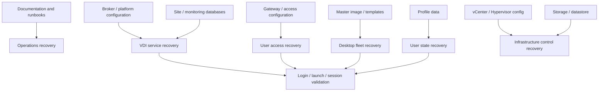

# VDI Backup and Recovery Guide

## 0. Document Control

| Trường | Giá trị |
|---|---|
| Thứ tự | 22 |
| Tên tài liệu | VDI Backup and Recovery Guide |
| Tên file | 22_VDI_Backup_and_Recovery_Guide.md |
| Mục đích tài liệu | Xác định đối tượng cần backup và recovery như configuration, site database, master image, profile data, vCenter configuration, gateway configuration và tài liệu vận hành. |
| Nguồn điều khiển | [[sources/vdi-training-idea]], [[sources/vdi-documentation-list-context]] |
| Trạng thái | Tài liệu đào tạo vận hành; backup tool, retention, RPO/RTO, owner, restore procedure và test schedule là Need Customer Confirmation |

### Source Grounding

| Nội dung | Nguồn sử dụng | Mức độ tin cậy | Ghi chú |
|---|---|---|---|
| Bối cảnh hai hệ thống VDI quy mô 1500-2000+ VDI và yêu cầu vận hành thực tế | [[sources/vdi-training-idea]] | High | Dùng làm bối cảnh chính cho backup/recovery. |
| Tên tài liệu, tên file và mục đích tài liệu | [[sources/vdi-documentation-list-context]] | High | Source of truth cho scope file 22. |
| Omnissa Horizon, Connection Server, UAG, Horizon Agent, desktop pool, entitlement | [[sources/horizon-8-architecture]], [[sources/understand-and-troubleshoot-horizon-connections]], [[concepts/omnissa-horizon]], [[concepts/connection-server]], [[concepts/unified-access-gateway]] | High | Dùng để xác định đối tượng cấu hình Horizon cần bảo vệ. |
| Citrix CVAD, Delivery Controller, StoreFront, VDA, Delivery Group, Site Database | [[sources/citrix-virtual-apps-and-desktops-7-2603]], [[concepts/citrix-virtual-apps-and-desktops]], [[concepts/delivery-controller]], [[concepts/storefront]], [[concepts/virtual-delivery-agent]], [[concepts/delivery-group]] | High | Dùng để xác định đối tượng cấu hình và database Citrix cần bảo vệ. |
| Profile container, Cloud Cache, profile storage và rủi ro dữ liệu người dùng | [[sources/fslogix-documentation]], [[concepts/profile-container]], [[concepts/cloud-cache]], [[concepts/user-profile-management]], [[concepts/fslogix]] | High | Dùng cho phần profile data backup/recovery. |
| vCenter, ESXi, XenServer, datastore, storage repository, VM snapshot | [[sources/vmware-vsphere-8-0]], [[sources/vcenter-server-installation-and-setup]], [[sources/xenserver-8-4]], [[concepts/vcenter-server]], [[concepts/esxi]], [[concepts/xenserver]], [[concepts/datastore]], [[concepts/storage-repository]], [[concepts/snapshot]] | High | Dùng cho phần VM/configuration recovery ở lớp hạ tầng. |
| Backup, change, HA/DR, monitoring và incident correlation | [[concepts/backup-and-recovery]], [[concepts/change-management]], [[concepts/high-availability]], [[concepts/monitoring-and-logs]], [[concepts/incident-management]] | Medium | Dùng để định hướng quy trình vận hành và kiểm chứng phục hồi. |

## 1. Mục tiêu đào tạo

Backup và recovery trong VDI không chỉ là sao lưu VM. Một hệ thống VDI có nhiều lớp trạng thái: cấu hình broker, database site, gateway, certificate, desktop pool, machine catalog, delivery group, master image, profile data, vCenter/hypervisor config, monitoring rule và tài liệu vận hành. Khi mất một lớp, user có thể không login được, không thấy resource, mất profile, hoặc toàn bộ platform mất khả năng điều phối session.

Sau khi đọc tài liệu này, engineer cần:

- Biết đối tượng nào trong VDI cần backup và vì sao.
- Phân biệt backup, snapshot, replica, HA và DR.
- Hiểu rủi ro khi chỉ backup VM nhưng bỏ quên database, profile, gateway config hoặc runbook.
- Biết cách đọc một tình huống recovery: mất cấu hình, mất database, lỗi image, mất profile, lỗi vCenter, lỗi gateway.
- Biết post-restore validation phải kiểm tra login, resource visibility, launch, Agent/VDA registration, profile và monitoring.
- Biết thông tin nào cần hỏi khách hàng: backup tool, retention, RPO/RTO, ownership, restore test, encryption, audit và escalation path.

Tài liệu này không định nghĩa chính sách backup thật của khách hàng. Các giá trị như lịch backup, retention, offsite copy, immutable backup, owner, RPO, RTO và restore procedure là Need Customer Confirmation.

## 2. Backup, snapshot, HA và DR khác nhau thế nào

| Khái niệm | Mục đích | Ví dụ trong VDI | Hiểu nhầm thường gặp |
|---|---|---|---|
| Backup | Lưu bản sao có thể phục hồi khi mất/sai dữ liệu hoặc cấu hình | Backup Site Database, master image, profile share, gateway config | Nghĩ rằng backup VM là đủ cho toàn bộ VDI. |
| Snapshot | Ghi lại trạng thái tại một thời điểm, thường dùng ngắn hạn trước change | Snapshot master image hoặc VM quản trị trước patch | Nhầm snapshot với backup dài hạn. |
| Replication | Sao chép dữ liệu sang nơi khác để tăng khả năng phục hồi | Replicate datastore/profile volume sang site khác | Replication cũng sao chép lỗi/xóa nhầm nếu không có versioning. |
| HA | Giữ dịch vụ tiếp tục chạy khi một node/thành phần lỗi | Nhiều broker, nhiều gateway, cluster hypervisor | HA không phục hồi dữ liệu đã bị xóa/sai cấu hình. |
| DR | Phục hồi dịch vụ ở site/phạm vi lớn sau sự cố nghiêm trọng | Kích hoạt site dự phòng, restore platform tại DC khác | DR không thay thế backup từng đối tượng. |

Điểm cần nhớ: HA giúp dịch vụ chịu lỗi cục bộ. Backup giúp phục hồi trạng thái. DR giúp phục hồi khi mất phạm vi lớn. Snapshot giúp quay lại nhanh trong một số tình huống nhưng không nên xem là chiến lược backup dài hạn.

## 3. Đối tượng cần backup trong VDI

| Đối tượng | Vì sao cần backup | Rủi ro nếu mất | Owner thường liên quan | Evidence cần có |
|---|---|---|---|---|
| Citrix Site Database | Lưu cấu hình site, broker state và metadata quan trọng | Delivery Controller không điều phối đúng, mất cấu hình site | DBA/Citrix platform owner | Backup job, timestamp, restore test |
| Citrix Monitoring/Logging Database | Lưu dữ liệu monitor/audit/logging nếu triển khai | Mất lịch sử troubleshooting/audit | DBA/Citrix owner | Backup và retention evidence |
| StoreFront configuration | Lưu store, authentication, gateway integration | User không thấy resource hoặc login flow sai | Citrix platform owner | Config export/backup, version |
| Citrix Gateway configuration | Lưu gateway/VIP/policy/certificate binding | External access fail, TLS/proxy/session issue | Network/Security/Citrix owner | Config backup, firmware/version, cert metadata |
| Horizon Connection Server configuration | Broker, entitlement, pool, integration | User không thấy pool, launch fail, cấu hình sai sau restore | Horizon platform owner | Config backup/export hoặc snapshot theo SOP |
| Unified Access Gateway configuration | Edge access, tunnel/protocol, certificate binding | External Horizon access fail | Horizon/Network/Security owner | Appliance config export, version |
| Master image/golden image | Nguồn tạo hàng trăm VDI | Không rollback được khi image lỗi, rebuild chậm | VDI/Image owner | Image version, snapshot/backup, test result |
| Profile data/profile container | Dữ liệu và setting người dùng | Mất dữ liệu cá nhân, temporary profile, user impact lớn | Storage/Profile/VDI owner | Backup job, retention, restore test |
| vCenter configuration | Quản lý cluster/host/VM/datastore/network | Mất visibility/control với hạ tầng VDI | VMware platform owner | VCSA backup/config backup evidence |
| ESXi/XenServer host config | Host/network/storage config | Khôi phục host lâu, VM placement/path lỗi | Hypervisor owner | Host config backup, version |
| Datastore/storage repository metadata | Nền tảng lưu VM/image/profile | VM hoặc image không mount/khôi phục được | Storage/Hypervisor owner | Storage backup/replication status |
| Certificate/configuration metadata | Access path và trust chain | User bị TLS error, gateway/broker integration fail | Security/Network/Platform owner | Cert inventory, expiry, issuer, target binding |
| Monitoring configuration | Dashboard, alert rule, notification | Không phát hiện lỗi sau recovery | Monitoring owner | Export dashboard/rule, contact route |
| Runbook/tài liệu vận hành | Cách phục hồi, owner, escalation, topology | Recovery chậm và phụ thuộc trí nhớ cá nhân | Service owner/VDI team | Versioned runbook, review date |

Nếu không biết một đối tượng có được backup hay không, đừng giả định. Ghi Unknown và hỏi owner.

## 4. Mô hình backup/recovery theo lớp

Backup/recovery phải được nhìn theo lớp. Khôi phục gateway mà không khôi phục certificate đúng có thể vẫn lỗi external access. Khôi phục VM mà không có profile data có thể làm user login được nhưng mất dữ liệu. Khôi phục database mà không kiểm tra broker service và agent registration thì chưa đủ để tuyên bố platform đã phục hồi.

## 5. Recovery scenario thường gặp

| Scenario | Triệu chứng | Đối tượng cần phục hồi | Kiểm tra sau phục hồi |
|---|---|---|---|
| Sai policy/entitlement sau change | User mất/nhận sai resource | Broker config, entitlement mapping, AD group nếu liên quan | User thấy đúng resource, audit mapping đúng |
| Citrix Site Database lỗi/mất | Delivery Controller không hoạt động đúng, Studio/Director lỗi | Site Database backup | Controller service, VDA registration, resource enumeration |
| StoreFront config lỗi | User login được/không được nhưng resource enumeration sai | StoreFront config backup | Login, resource visible, Gateway integration |
| Gateway/UAG config lỗi | External user không truy cập được | Gateway/UAG config, certificate binding | External login, launch, reconnect |
| Image update lỗi | Nhiều VDI unregistered/app fail/black screen | Master image snapshot/backup | Machine registered, launch, app/profile test |
| Profile data mất/hỏng | User mất setting, temporary profile, profile load fail | Profile backup/container backup | User profile load, data sample, permission |
| vCenter/VCSA lỗi | Không quản lý VM/cluster/datastore được | vCenter backup/config | vCenter login, inventory, host/datastore visibility |
| Host config lỗi | Host không thấy network/storage đúng | Host config backup | Host reconnect, datastore/network path, VM state |
| Monitoring config mất | Không có alert/dashboard sau rebuild | Monitoring config export | Dashboard, alert rule, notification route |
| Runbook/tài liệu mất/lỗi thời | Recovery phụ thuộc người nhớ hệ thống | Wiki/runbook backup/version | Link, owner, SOP, contact, topology reference |

## 6. Quy trình recovery chuẩn

### 6.1 Detect và classify

Khi có sự cố cần recovery, đầu tiên phải phân loại:

- Mất dữ liệu hay mất cấu hình?
- Ảnh hưởng một user, một pool/catalog, một gateway, một site hay toàn platform?
- Sự cố xuất hiện sau change, patch, storage event, security event hay thao tác xóa nhầm?
- Recovery cần restore object nào: database, config, VM, image, profile, certificate, documentation?
- Có yêu cầu bảo toàn evidence cho incident/security/RCA không?

Không restore vội nếu chưa xác định phạm vi. Restore sai object hoặc restore đè dữ liệu mới có thể làm sự cố nặng hơn.

### 6.2 Pre-restore checklist

- Incident/change ID đã có.
- Impact và urgency đã xác định.
- Owner của đối tượng cần restore đã tham gia.
- Backup point được chọn rõ: thời điểm, loại backup, phạm vi, retention.
- RPO/RTO kỳ vọng đã xác nhận hoặc ghi Unknown.
- Dữ liệu hiện tại có cần snapshot/backup tạm trước restore không.
- Rollback cho chính hành động restore đã được nghĩ tới.
- Communication với user/service owner đã thực hiện nếu có downtime.
- Security/compliance owner tham gia nếu dữ liệu nhạy cảm hoặc nghi xóa/sửa trái phép.

### 6.3 Restore execution

Engineer VDI thường không tự restore mọi lớp. Nhiệm vụ quan trọng là phối hợp và validate:

1. Xác nhận backup point với owner.
2. Xác nhận restore target: cùng hệ thống, alternate location hay isolated test.
3. Theo dõi restore task nếu có quyền xem.
4. Không thực hiện thay đổi khác song song nếu chưa cần.
5. Ghi timestamp, người thực hiện, backup point và kết quả từng bước.
6. Chỉ chuyển sang validation khi owner xác nhận restore task hoàn tất.

### 6.4 Post-restore validation

Validation phải theo trải nghiệm dịch vụ:

- Broker/portal/gateway service healthy.
- User test login được.
- User thấy đúng desktop/application.
- Launch desktop/application thành công.
- VDA/Horizon Agent registered.
- Profile load đúng, không temporary profile nếu recovery profile.
- Master image/pool/catalog hoạt động đúng nếu recovery image.
- vCenter/hypervisor inventory, host, datastore, VM state hiển thị đúng nếu recovery hạ tầng.
- Monitoring/dashboard/alert quay lại bình thường.
- Không phát sinh failed session, unregistered hoặc latency bất thường sau restore.

## 7. Recovery theo từng đối tượng

### 7.1 Configuration recovery

Configuration gồm broker, StoreFront, Gateway/UAG, policy, entitlement, certificate binding và monitoring rule. Lỗi configuration thường đến từ change sai, patch/upgrade, thao tác nhầm hoặc restore không đầy đủ.

Kiểm tra trọng tâm:

- Có config export/backup trước change không?
- Restore config có ghi đè thay đổi hợp lệ phát sinh sau backup không?
- Certificate, DNS, VIP, load balancer và firewall path có còn đúng không?
- User test có đi được cả internal và external path không?
- Audit log có ghi nhận thao tác restore không?

### 7.2 Site Database recovery

Citrix CVAD phụ thuộc Site Database. Nếu database lỗi, Delivery Controller có thể mất khả năng đọc/ghi cấu hình hoặc điều phối đầy đủ. Recovery database thường cần DBA và platform owner.

Engineer cần biết:

- Backup database thuộc owner nào.
- Có backup cho Site Database, Monitoring Database và Configuration Logging Database nếu triển khai không.
- Restore database có cần đồng bộ với Controller version không.
- Sau restore cần kiểm tra Delivery Controller service, Studio/Director nếu có, VDA registration, Delivery Group và resource enumeration.

Không tự restore database nếu không có quyền và SOP. Vai trò VDI engineer là cung cấp impact, validation và evidence.

### 7.3 Master image recovery

Master image là điểm rollback quan trọng khi image update gây lỗi. Recovery image thường là quay lại snapshot/version trước hoặc restore image/template từ backup.

Post-restore cần kiểm tra:

- Image version đúng.
- Pool/catalog dùng lại image đúng.
- Machine nhận image và boot được.
- Agent/VDA/Horizon Agent registered.
- App chính chạy.
- Profile, printer, clipboard/USB/drive policy nếu liên quan hoạt động đúng.
- Login duration không tăng bất thường.

### 7.4 Profile data recovery

Profile data chứa trạng thái user. Đây là phần nhạy cảm vì liên quan dữ liệu cá nhân, productivity và đôi khi compliance. Profile có thể nằm trên file share, profile container, Cloud Cache hoặc giải pháp khác.

Nguyên tắc:

- Không restore đè profile hiện tại khi chưa hiểu thời điểm mất dữ liệu.
- Cân nhắc restore ra alternate location để user/owner kiểm tra trước.
- Kiểm tra permission, ownership, lock file và antivirus/backup lock.
- Xác nhận user login được và profile không temporary.
- Lưu evidence nhưng không chụp/ghi nội dung dữ liệu nhạy cảm.

### 7.5 vCenter/hypervisor configuration recovery

vCenter, ESXi, XenServer hoặc HCI là lớp điều khiển VM. Nếu mất control plane, broker có thể vẫn còn cấu hình nhưng không quản lý được VM power, clone, snapshot hoặc host placement.

Kiểm tra sau recovery:

- vCenter/XenServer login được.
- Host/cluster/pool visible.
- Datastore/storage repository visible.
- Network/port group/VLAN mapping đúng.
- VM inventory đúng.
- Broker kết nối lại hypervisor manager được.
- VDI machines vẫn registered và available.

### 7.6 Gateway configuration recovery

Gateway/UAG/Citrix Gateway là lớp external access. Recovery gateway phải kiểm tra cả cấu hình và trust path.

Post-restore:

- Certificate đúng CN/SAN/chain và chưa hết hạn.
- VIP/load balancer member healthy.
- Gateway trỏ đúng StoreFront/Connection Server.
- External login thành công.
- Launch/reconnect thành công.
- Không có TLS warning hoặc protocol timeout.

### 7.7 Tài liệu vận hành recovery

Runbook, topology, owner matrix, escalation path, access flow, baseline và checklist cũng cần được bảo vệ. Khi sự cố lớn xảy ra, thiếu tài liệu có thể làm recovery chậm hơn thiếu công cụ.

Cần backup/version:

- Sơ đồ access flow.
- Danh sách component và owner.
- Change/rollback checklist.
- SOP backup/restore.
- Monitoring dashboard reference.
- Escalation path.
- Known issues và KB.

## 8. Lỗi thường gặp trong backup/recovery

| Triệu chứng | Nguyên nhân có thể | Lớp cần kiểm tra | Cách kiểm tra | Hướng xử lý | Khi nào escalation |
|---|---|---|---|---|---|
| Có backup nhưng restore không dùng được | Backup corrupt, thiếu dependency, chưa test restore | Backup tool, Storage, Owner | Kiểm tra job status, restore log, test restore history | Escalate backup/storage owner, chọn backup point khác | RTO có nguy cơ không đạt |
| Restore database xong broker vẫn lỗi | Service chưa restart đúng, version mismatch, DB permission, config thiếu | Database, Broker, Identity | Controller service, DB connectivity, event log | Phối hợp DBA/platform owner, không restore lặp khi chưa rõ | Control plane vẫn degraded |
| Restore image xong VDI unregistered | Image rollback thiếu agent config, DNS/domain issue, broker list sai | Image, Agent, Identity, Network | Registration dashboard, event log, DNS/computer account | Sửa image hoặc rollback backup point khác | Nhiều máy trong pool/catalog affected |
| Restore profile xong user vẫn temporary profile | Permission sai, path sai, lock file, profile container corrupt | Profile, Storage, Identity | Profile log, file permission, share access, lock state | Restore alternate, sửa permission, phối hợp profile/storage owner | Dữ liệu user nhạy cảm hoặc nhiều user affected |
| Gateway config restore xong external access vẫn fail | Certificate binding thiếu, LB/firewall/DNS sai, target backend sai | Gateway, Certificate, Network | External test, cert metadata, LB member, gateway log | Sửa binding/path theo evidence hoặc rollback config | External outage diện rộng |
| vCenter restore xong broker không quản lý VM | Certificate/trust, inventory ID thay đổi, permission, hypervisor connection lỗi | vCenter, Broker, RBAC | Broker hypervisor connection, vCenter inventory, permission | Reconnect/revalidate theo SOP, escalation platform owner | Không power/clone/manage được VDI |
| Backup không bao phủ tài liệu vận hành | Runbook nằm rải rác, không version, owner không rõ | Documentation, Governance | Kiểm tra repository/wiki, last review date | Chuẩn hóa location và backup/versioning | Recovery phụ thuộc cá nhân |
| Snapshot tồn đọng sau restore/change | Snapshot dùng như backup dài hạn, quên cleanup | Hypervisor, Storage | VM snapshot list, datastore growth, latency | Cleanup theo SOP sau xác nhận an toàn | Datastore tăng nhanh hoặc latency cao |

## 9. Checklist cho engineer

### 9.1 Backup coverage review

- [ ] Có danh sách đối tượng cần backup theo lớp.
- [ ] Có owner cho database, gateway, image, profile, vCenter, hypervisor, storage và documentation.
- [ ] Có lịch backup và retention cho từng đối tượng.
- [ ] Có RPO/RTO hoặc ghi Unknown nếu chưa xác nhận.
- [ ] Có evidence backup job thành công.
- [ ] Có lịch test restore định kỳ.
- [ ] Có offsite/immutable/air-gapped copy nếu chính sách yêu cầu.
- [ ] Có quy định bảo vệ dữ liệu nhạy cảm.

### 9.2 Pre-restore

- [ ] Incident/change ID rõ.
- [ ] Impact và scope rõ.
- [ ] Backup point đã chọn.
- [ ] Owner phê duyệt restore.
- [ ] Đã cân nhắc backup/snapshot trạng thái hiện tại trước restore.
- [ ] Đã xác định rủi ro mất dữ liệu phát sinh sau backup point.
- [ ] Đã chuẩn bị communication nếu downtime/user impact.
- [ ] Đã xác định validation steps.

### 9.3 Post-restore

- [ ] Service liên quan healthy.
- [ ] User test login được.
- [ ] Resource visible.
- [ ] Launch thành công.
- [ ] Agent/VDA/Horizon Agent registered.
- [ ] Profile/data sample được xác nhận nếu restore profile.
- [ ] Monitoring không có alert mới.
- [ ] Ticket/change/incident cập nhật evidence.

### 9.4 Evidence cần lưu

- [ ] Backup job ID hoặc restore job ID.
- [ ] Backup point timestamp.
- [ ] Object restored.
- [ ] Owner/approver.
- [ ] Restore start/end time.
- [ ] Logs/screenshot trạng thái an toàn.
- [ ] Validation result.
- [ ] User/service owner confirmation nếu cần.
- [ ] Residual risk hoặc follow-up action.

## 10. Monitoring và chỉ số cần theo dõi

| Nhóm | Chỉ số/evidence | Ý nghĩa |
|---|---|---|
| Backup job | Success/failure, duration, size, last run, retention | Xác nhận backup có chạy và có dữ liệu. |
| Restore test | Last restore test, result, duration, object tested | Xác nhận backup dùng được. |
| Database | DB backup age, restore point, connectivity, service health | Bảo vệ control plane và audit/monitoring data. |
| Profile storage | Capacity, backup status, file/container error, restore sample | Bảo vệ dữ liệu và trải nghiệm user. |
| Image repository | Image version, snapshot age, backup status | Phục hồi nhanh khi image update lỗi. |
| Gateway/config | Config backup age, cert expiry, version | Phục hồi access path. |
| vCenter/hypervisor | Config backup, host visibility, datastore visibility | Phục hồi control hạ tầng. |
| VDI service | Registered/unregistered, failed session, launch success | Xác nhận restore không chỉ hoàn tất task mà dịch vụ dùng được. |

Một backup job xanh không đủ. Cần có restore test. Một restore task completed cũng chưa đủ. Cần có service validation.

## 11. Change, risk và rollback

Backup/recovery liên quan trực tiếp tới change:

- Trước image update cần image rollback point.
- Trước broker/gateway patch cần config backup/snapshot theo SOP.
- Trước entitlement/policy change cần export hoặc ghi lại mapping trước change.
- Trước storage expansion cần hiểu backup/replication impact.
- Trước host/vCenter change cần biết recovery path của management plane.

Rủi ro lớn:

- Backup không bao phủ đúng object.
- Backup có nhưng chưa từng restore test.
- Restore ghi đè dữ liệu mới.
- Snapshot để quá lâu gây ảnh hưởng datastore.
- Chỉ restore kỹ thuật mà không validate user experience.
- Không biết owner nên recovery chậm.

Điều kiện dừng recovery hoặc escalation:

- Không chắc backup point đúng.
- Có nguy cơ mất dữ liệu phát sinh sau backup.
- Restore log báo lỗi hoặc backup corrupt.
- Restore ảnh hưởng ngoài scope.
- Liên quan dữ liệu nhạy cảm/security incident.
- RTO có nguy cơ vượt SLA.

## 12. Security và quyền truy cập

- Backup có thể chứa dữ liệu nhạy cảm, cấu hình, certificate metadata và thông tin người dùng.
- Chỉ người/role được phê duyệt mới được truy cập backup và thực hiện restore.
- Không ghi secret, password, token, private key hoặc nội dung dữ liệu user vào ticket/evidence.
- Restore profile/user data cần tuân thủ chính sách privacy và retention của khách hàng.
- Backup nên có audit trail: ai restore, restore object nào, thời điểm nào, lý do gì.
- Nếu nghi dữ liệu bị xóa/sửa trái phép, cần giữ evidence và phối hợp security trước khi ghi đè.
- Quyền backup operator, platform admin, storage admin, DBA và VDI engineer cần phân tách rõ.

## 13. Scenario Based Learning

### Scenario 1: Image update lỗi và cần quay lại image trước

**Bối cảnh:** Sau khi publish image mới cho một pool Horizon hoặc catalog Citrix, nhiều desktop unregistered và user launch fail.

**Câu hỏi cho học viên:**

1. Đối tượng cần recovery là gì?
2. Evidence nào cần lấy trước rollback?
3. Post-restore cần kiểm tra gì?

**Gợi ý phân tích:** Trọng tâm là master image và pool/catalog rollout. Cần giữ evidence image version, registration trend, affected machine list và change ID.

**Hướng xử lý đề xuất:** Dừng rollout, rollback về image/snapshot trước nếu đã được phê duyệt, kiểm tra registration và launch trên nhóm test trước khi mở rộng.

**Evidence cần lưu:** Image version trước/sau, change ID, registration dashboard, agent log, post-rollback launch test.

### Scenario 2: User mất profile sau sự cố storage

**Bối cảnh:** Một nhóm user login vào VDI và nhận temporary profile, mất setting ứng dụng.

**Câu hỏi cho học viên:**

1. Có nên restore profile đè ngay không?
2. Cần hỏi owner nào?
3. Làm sao xác nhận recovery thành công?

**Gợi ý phân tích:** Cần kiểm tra profile path/container, permission, lock file, backup point và khả năng restore alternate location. Không restore đè nếu chưa biết thời điểm dữ liệu bị hỏng/mất.

**Hướng xử lý đề xuất:** Phối hợp storage/profile owner, chọn backup point, restore thử hoặc restore alternate, validate bằng user sample và kiểm tra profile log.

**Evidence cần lưu:** User sample, profile error, backup point, permission, restore result, user confirmation.

### Scenario 3: Gateway config bị thay sai sau change

**Bối cảnh:** Sau change certificate/gateway, external user không truy cập được nhưng internal user bình thường.

**Câu hỏi cho học viên:**

1. Đối tượng backup nào cần dùng?
2. Vì sao internal/external comparison quan trọng?
3. Post-restore cần test gì?

**Gợi ý phân tích:** Internal bình thường gợi ý broker/desktop cơ bản ổn. Trọng tâm là Gateway/UAG config, certificate binding, LB và external path.

**Hướng xử lý đề xuất:** Restore hoặc rollback gateway config/certificate binding theo SOP, test external login, launch và reconnect.

**Evidence cần lưu:** Config backup timestamp, cert metadata an toàn, gateway/LB status, external test result.

### Scenario 4: vCenter lỗi sau upgrade và broker không quản lý VM

**Bối cảnh:** Broker vẫn chạy nhưng không power on/off hoặc clone VDI được vì vCenter lỗi.

**Câu hỏi cho học viên:**

1. Đây là lỗi VDI broker hay hạ tầng quản lý?
2. Recovery cần owner nào?
3. Validate gì sau vCenter restore?

**Gợi ý phân tích:** Cần kiểm tra vCenter availability, inventory, host/datastore visibility, permission và hypervisor connection từ broker.

**Hướng xử lý đề xuất:** Phối hợp VMware platform owner restore vCenter/config, sau đó validate broker connection, VM power task, registration và provisioning task nếu cần.

**Evidence cần lưu:** vCenter backup point, restore log, inventory visibility, broker hypervisor connection, VM task result.

## 14. Hands-on hoặc bài tập tư duy

1. Lập backup coverage matrix cho một môi trường có Horizon, Citrix, vCenter, StoreFront, Gateway và FSLogix profile.
2. Với tình huống "user mất desktop sau entitlement change", hãy xác định restore object và validation steps.
3. Thiết kế restore test định kỳ cho master image và profile data mà không ảnh hưởng production.
4. So sánh rollback bằng snapshot image và restore từ backup: ưu/nhược điểm trong VDI.
5. Viết evidence package cho sự cố Citrix Site Database cần restore.
6. Xác định các thành phần nào VDI engineer validate, thành phần nào phải escalation storage/DB/network/hypervisor owner.

## 15. Knowledge Check

**Câu 1. Vì sao backup VM không đủ để bảo vệ VDI platform?**  
Vì VDI còn phụ thuộc database, broker config, gateway config, entitlement, master image, profile data, vCenter/hypervisor config và tài liệu vận hành.

**Câu 2. Snapshot có phải backup dài hạn không?**  
Không. Snapshot thường dùng ngắn hạn trước change/rollback nhanh và có thể ảnh hưởng datastore nếu để lâu.

**Câu 3. HA khác backup như thế nào?**  
HA giúp dịch vụ tiếp tục chạy khi một node lỗi. Backup giúp phục hồi dữ liệu/cấu hình khi mất, hỏng hoặc thay đổi sai.

**Câu 4. Restore profile cần cẩn trọng điều gì nhất?**  
Không restore đè khi chưa biết backup point đúng và chưa đánh giá dữ liệu phát sinh sau đó; cần kiểm tra permission, lock và privacy.

**Câu 5. Sau restore gateway config, postcheck quan trọng là gì?**  
External login, certificate/TLS, launch desktop/app, reconnect và LB/gateway member health.

**Câu 6. Citrix Site Database restore xong cần validate gì?**  
Delivery Controller service, database connectivity, VDA registration, Delivery Group/resource enumeration và launch test.

**Câu 7. Vì sao tài liệu vận hành cũng cần backup/versioning?**  
Vì recovery cần topology, owner, SOP, escalation path và checklist. Mất tài liệu làm phục hồi chậm và dễ sai.

**Câu 8. Khi nào cần escalation trong recovery?**  
Khi backup point không chắc, restore có nguy cơ mất dữ liệu, backup corrupt, ảnh hưởng ngoài scope, liên quan security hoặc có nguy cơ vượt RTO/SLA.

**Câu 9. RPO/RTO cần hiểu thế nào?**  
RPO là mức mất dữ liệu tối đa có thể chấp nhận theo thời gian. RTO là thời gian tối đa để phục hồi dịch vụ. Giá trị thật cần khách hàng xác nhận.

**Câu 10. Restore task completed đã đủ để đóng incident chưa?**  
Chưa. Cần validate dịch vụ: login, resource visibility, launch, registration, profile và monitoring.

## 16. Common Misconceptions

- "Có snapshot là có backup." Sai. Snapshot không thay thế backup có retention và restore test.
- "VDI non-persistent không cần backup." Sai. Vẫn cần backup broker config, image, profile, gateway, database và runbook.
- "Backup là việc của storage team nên VDI engineer không cần biết." Sai. VDI engineer phải biết đối tượng nào cần backup và validate dịch vụ sau restore.
- "Restore xong task success là xong." Sai. Phải kiểm tra user experience và monitoring.
- "Replication bảo vệ khỏi xóa nhầm." Không luôn đúng. Replication có thể sao chép cả lỗi nếu không có versioning/retention.
- "Profile data chỉ là setting, không quan trọng." Sai. Profile có thể chứa dữ liệu và cấu hình nghiệp vụ quan trọng.

## 17. Need Customer Confirmation

Các thông tin cần hỏi khách hàng:

- Backup tool chính thức đang dùng cho VM, database, file share/profile, gateway config, vCenter và tài liệu là gì?
- RPO/RTO cho Horizon, Citrix CVAD, profile data, gateway, vCenter và database là bao nhiêu?
- Lịch backup và retention cho từng đối tượng.
- Có offsite, immutable hoặc air-gapped backup không?
- Có test restore định kỳ không? Lần gần nhất test object nào, kết quả ra sao?
- Ai là owner restore của Citrix Site Database, StoreFront, Gateway, Horizon Connection Server, UAG, vCenter, XenServer, profile storage và master image?
- Site Database, Monitoring Database và Configuration Logging Database của Citrix có backup riêng không?
- Horizon configuration backup/export được thực hiện theo cơ chế nào?
- Gateway/UAG/Citrix Gateway config export và certificate inventory lưu ở đâu?
- Master image versioning và rollback image đang vận hành thế nào?
- Profile solution thực tế là FSLogix, Citrix Profile Management, roaming profile hay giải pháp khác?
- Profile restore policy: restore alternate hay overwrite, ai phê duyệt, retention bao lâu?
- Có CMDB hoặc inventory nào cần phục hồi/cập nhật sau restore không?
- Evidence restore cần lưu ở ticket, change, incident, wiki hay backup console?
- Escalation path khi backup corrupt, restore fail hoặc RTO có nguy cơ không đạt là gì?

## 18. Related Wiki Links

### Source summaries

- [[sources/vdi-training-idea]]
- [[sources/vdi-documentation-list-context]]
- [[sources/horizon-8-architecture]]
- [[sources/understand-and-troubleshoot-horizon-connections]]
- [[sources/citrix-virtual-apps-and-desktops-7-2603]]
- [[sources/fslogix-documentation]]
- [[sources/vmware-vsphere-8-0]]
- [[sources/vcenter-server-installation-and-setup]]
- [[sources/xenserver-8-4]]

### Concepts

- [[concepts/backup-and-recovery]]
- [[concepts/change-management]]
- [[concepts/high-availability]]
- [[concepts/incident-management]]
- [[concepts/monitoring-and-logs]]
- [[concepts/omnissa-horizon]]
- [[concepts/connection-server]]
- [[concepts/unified-access-gateway]]
- [[concepts/citrix-virtual-apps-and-desktops]]
- [[concepts/delivery-controller]]
- [[concepts/storefront]]
- [[concepts/virtual-delivery-agent]]
- [[concepts/delivery-group]]
- [[concepts/vcenter-server]]
- [[concepts/esxi]]
- [[concepts/xenserver]]
- [[concepts/datastore]]
- [[concepts/storage-repository]]
- [[concepts/snapshot]]
- [[concepts/profile-container]]
- [[concepts/cloud-cache]]
- [[concepts/user-profile-management]]
- [[concepts/fslogix]]
- [[concepts/certificate-management]]

### Topic documents

- [[topics/8_Storage_Operations_for_VDI]]
- [[topics/10_VDI_Security_and_Policy_Management_Guide]]
- [[topics/12_Master_Image_Management_Guide]]
- [[topics/15_VDI_Monitoring_and_Alerting_Guide]]
- [[topics/18_VDI_Troubleshooting_Playbook]]
- [[topics/20_VDI_Change_Management_Guide]]
- [[topics/21_VDI_Patch_and_Upgrade_Guide]]
- [[topics/23_VDI_High_Availability_and_Disaster_Recovery_Guide]]
- [[topics/25_VDI_Support_and_Escalation_Guide]]

## 19. Summary for Learners

Khi nghĩ về backup/recovery trong VDI, engineer nên đi theo thứ tự:

1. Đối tượng bị mất/hỏng là gì: config, database, image, profile, gateway, vCenter, host, monitoring hay tài liệu?
2. Ảnh hưởng tới user nào và phạm vi bao nhiêu?
3. Backup point nào phù hợp với RPO và không làm mất dữ liệu mới?
4. Owner nào phải thực hiện restore?
5. Restore có thể làm mất hoặc ghi đè dữ liệu hiện tại không?
6. Post-restore validate bằng login, resource visibility, launch, registration, profile và monitoring chưa?
7. Evidence đã đủ cho incident, audit, RCA và cải tiến runbook chưa?

Điều cần nhớ nhất: backup chỉ có giá trị khi restore được và dịch vụ VDI dùng lại được. Với VDI quy mô lớn, recovery thành công không phải chỉ là restore job completed, mà là user có thể truy cập đúng resource, session ổn định, profile không mất và monitoring xác nhận nền tảng khỏe.

## 20. Self Review

- [x] Đúng tên tài liệu trong list_context.txt.
- [x] Đúng tên file trong cột Name File.
- [x] Đúng mục đích: configuration, site database, master image, profile data, vCenter configuration, gateway configuration và tài liệu vận hành.
- [x] Bám bối cảnh training_idea.md: Horizon on HCI, Citrix CVAD trên XenServer/ESXi, quy mô 1500-2000+ VDI.
- [x] Không bịa backup tool, RPO/RTO, retention, owner hoặc restore procedure của khách hàng.
- [x] Có phân biệt Need Customer Confirmation.
- [x] Có backup object matrix, recovery workflow, post-restore validation và scenario.
- [x] Có lỗi thường gặp và hướng xử lý theo evidence.
- [x] Có checklist, monitoring, security/RBAC, knowledge check và misconception.
- [x] Có liên kết tới source, concept và topic liên quan.
- [x] Phù hợp cho system engineer chuẩn bị tham gia vận hành thực tế.
