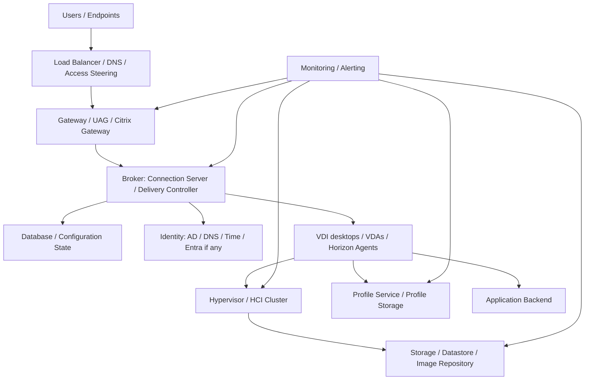

# VDI High Availability and Disaster Recovery Guide

## 0. Document Control

| Trường | Giá trị |
|---|---|
| Thứ tự | 23 |
| Tên tài liệu | VDI High Availability and Disaster Recovery Guide |
| Tên file | 23_VDI_High_Availability_and_Disaster_Recovery_Guide.md |
| Mục đích tài liệu | Mô tả nguyên tắc HA và DR cho broker, gateway, database, storage, hypervisor, identity, profile service và các tình huống failover cần kiểm thử. |
| Nguồn điều khiển | [[sources/vdi-training-idea]], [[sources/vdi-documentation-list-context]] |
| Trạng thái | Tài liệu đào tạo vận hành; topology HA/DR thật, RPO/RTO, failover procedure, DR site, owner và lịch DR drill là Need Customer Confirmation |

### Source Grounding

| Nội dung | Nguồn sử dụng | Mức độ tin cậy | Ghi chú |
|---|---|---|---|
| Bối cảnh hai hệ thống VDI quy mô 1500-2000+ VDI và yêu cầu vận hành theo lớp | [[sources/vdi-training-idea]] | High | Dùng làm bối cảnh chính cho tài liệu. |
| Tên tài liệu, tên file và mục đích tài liệu | [[sources/vdi-documentation-list-context]] | High | Source of truth cho scope file 23. |
| HA/DR liên quan Horizon: Connection Server, UAG, desktop pool, agent, access flow | [[sources/horizon-8-architecture]], [[sources/understand-and-troubleshoot-horizon-connections]], [[concepts/omnissa-horizon]], [[concepts/connection-server]], [[concepts/unified-access-gateway]], [[concepts/pod-and-block]], [[concepts/cloud-pod-architecture]] | High | Dùng để định hướng HA/DR cho Omnissa Horizon. |
| HA/DR liên quan Citrix CVAD: Delivery Controller, StoreFront, Gateway, VDA, database, Delivery Group | [[sources/citrix-virtual-apps-and-desktops-7-2603]], [[concepts/citrix-virtual-apps-and-desktops]], [[concepts/delivery-controller]], [[concepts/storefront]], [[concepts/virtual-delivery-agent]], [[concepts/delivery-group]] | High | Dùng để định hướng HA/DR cho Citrix CVAD. |
| HA/DR hạ tầng: vCenter, ESXi, XenServer, datastore, storage repository, VM, virtual networking | [[sources/vmware-vsphere-8-0]], [[sources/vcenter-server-installation-and-setup]], [[sources/xenserver-8-4]], [[concepts/vcenter-server]], [[concepts/esxi]], [[concepts/xenserver]], [[concepts/datastore]], [[concepts/storage-repository]], [[concepts/virtual-networking]] | High | Dùng cho lớp hypervisor, storage và network. |
| Profile service, Cloud Cache, monitoring, backup/recovery, HA, capacity, incident | [[sources/fslogix-documentation]], [[concepts/profile-container]], [[concepts/cloud-cache]], [[concepts/high-availability]], [[concepts/backup-and-recovery]], [[concepts/monitoring-and-logs]], [[concepts/capacity-management]], [[concepts/incident-management]] | Medium | Dùng cho phần profile, failover validation và vận hành DR drill. |

## 1. Mục tiêu đào tạo

High Availability (HA) và Disaster Recovery (DR) trong VDI là năng lực giữ dịch vụ sống sót trước lỗi cục bộ và phục hồi sau sự cố lớn. Với quy mô 1500-2000+ VDI, chỉ cần một thành phần không có HA đúng, toàn bộ chuỗi truy cập có thể bị nghẽn: user login được nhưng không thấy desktop, external user không vào được, VDI không registered, profile không load, hoặc broker không điều phối được session.

Sau khi đọc tài liệu này, engineer cần:

- Phân biệt HA, DR, backup, replication, failover, failback, RPO và RTO.
- Biết các lớp cần có thiết kế HA/DR: broker, gateway, database, storage, hypervisor, identity, profile service, monitoring và documentation.
- Hiểu lỗi ở một lớp HA có thể biểu hiện thành lỗi user access như thế nào.
- Biết kiểm tra readiness trước failover và validation sau failover.
- Biết thiết kế câu hỏi cần hỏi khách hàng để xác nhận DR thật, thay vì chỉ tin vào sơ đồ.
- Biết tham gia DR drill: chuẩn bị, quan sát, ghi evidence, xác nhận service và ghi nhận gap.

Tài liệu này không khẳng định khách hàng đã có HA/DR ở lớp nào. Những thông tin như số node, site, VIP, load balancer, database HA, storage replication, profile design, failover procedure và RPO/RTO đều cần xác nhận.

## 2. Khái niệm nền tảng

| Khái niệm | Ý nghĩa trong VDI | Ví dụ | Lưu ý vận hành |
|---|---|---|---|
| HA | Thiết kế để dịch vụ tiếp tục chạy khi một thành phần lỗi cục bộ | Nhiều Delivery Controller, nhiều Connection Server, gateway sau load balancer | HA chỉ hữu ích nếu dependency phía sau cũng khỏe. |
| DR | Khả năng phục hồi dịch vụ tại phạm vi sự cố lớn hơn, như mất site hoặc mất nhiều lớp | Kích hoạt site dự phòng, chuyển user sang access path khác | DR cần runbook, dữ liệu, network, identity và validation. |
| Failover | Chuyển dịch vụ sang node/site/đường khác khi thành phần chính lỗi | LB chuyển traffic sang gateway còn sống | Failover có thể tự động hoặc thủ công. |
| Failback | Chuyển dịch vụ về trạng thái/site chính sau khi khôi phục | Đưa user traffic về site chính | Failback cũng là change, cần kiểm soát. |
| RPO | Mức mất dữ liệu tối đa chấp nhận được | Profile data mất tối đa 15 phút, 1 giờ hoặc Unknown | RPO thật cần khách hàng xác nhận. |
| RTO | Thời gian tối đa để phục hồi dịch vụ | Gateway phải phục hồi trong 30 phút hoặc Unknown | RTO phải gắn với service và user impact. |
| Replication | Sao chép dữ liệu/cấu hình sang nơi khác | Storage/profile replication | Replication không thay thế backup; lỗi cũng có thể bị replicate. |
| DR drill | Bài kiểm thử quy trình DR | Test failover gateway, broker, profile, storage | Drill cần evidence, gap và action plan. |

## 3. HA và DR khác backup/recovery ở đâu

Backup/recovery trả lời câu hỏi: "Khi mất hoặc sai dữ liệu/cấu hình, phục hồi từ đâu?" HA/DR trả lời câu hỏi: "Khi một thành phần hoặc site không còn hoạt động, dịch vụ tiếp tục hoặc phục hồi bằng đường nào?"

Ví dụ:

- Có backup Site Database nhưng không có database HA: khi database lỗi, có thể vẫn downtime cho tới khi restore xong.
- Có hai gateway nhưng cùng phụ thuộc một load balancer hoặc một certificate chain lỗi: gateway count không đảm bảo external access HA.
- Có hypervisor cluster HA nhưng profile storage là single point of failure: VM vẫn chạy nhưng user login lỗi.
- Có DR site nhưng không test DNS, identity, profile, application backend: failover có thể thành công về hạ tầng nhưng user vẫn không làm việc được.

Engineer cần tránh tư duy "có hai node là HA". HA chỉ thật khi toàn bộ dependency cần thiết cũng chịu lỗi và failover được kiểm thử.

## 4. Mô hình HA/DR theo lớp

Mô hình trên là mô hình đào tạo. Trong hệ thống thật, cần biết:

- Thành phần nào có nhiều node?
- Load balancer hoặc DNS steering hoạt động thế nào?
- Failover tự động hay thủ công?
- Session đang chạy bị mất hay reconnect được?
- Dữ liệu profile có đi theo user không?
- Application backend có sẵn ở site DR không?
- Monitoring có nhìn thấy cả primary và secondary path không?

## 5. HA theo từng lớp thành phần

| Lớp | Mục tiêu HA | Rủi ro nếu thiếu HA | Engineer cần kiểm tra | Evidence cần lưu |
|---|---|---|---|---|
| Broker | User vẫn authenticate/enumerate/launch khi một broker lỗi | Không thấy resource, launch fail, failed session tăng | Số node, service health, LB, replication/DB connectivity | Broker health, failed session, node status |
| Gateway | User ngoài mạng vẫn truy cập được khi một gateway lỗi | External outage, TLS/protocol timeout | Gateway nodes, VIP/LB member, certificate, backend target | LB status, gateway log, external test |
| Database | Broker vẫn có state/config cần thiết | Control plane degraded, console lỗi, broker fail | DB HA, backup, connectivity, latency | DB health, connection test, failover event |
| Storage | VM/image/profile vẫn truy cập được khi storage/path lỗi | Datastore inaccessible, profile fail, login chậm | Datastore path, replication, capacity, latency | Storage alert, path state, latency trend |
| Hypervisor/HCI | VM tiếp tục chạy/migrate khi host lỗi | VM powered off, host contention, registration loss | Cluster health, host headroom, HA policy, VM placement | Host/cluster dashboard, VM state |
| Identity | Authentication, DNS, GPO và computer trust vẫn hoạt động | Login fail, agent registration fail, policy lỗi | DC count, DNS, time sync, site/subnet, replication | DC/DNS health, auth error trend |
| Profile service | User state vẫn load được khi node/path lỗi | Temporary profile, mất setting, login chậm | Profile share/container path, Cloud Cache nếu có, permission | Profile log, share health, user validation |
| Network/LB | Traffic tự chuyển qua path/node còn sống | Một path lỗi kéo sập cả service | VIP, health probe, routing, firewall, DNS TTL | LB/probe state, flow test |
| Monitoring | Phát hiện failover và service degradation | Failover lỗi nhưng không ai biết | Alert rule, dashboard, notification route | Alert ID, timeline, dashboard screenshot |
| Documentation | Người vận hành biết failover/failback | Phụ thuộc trí nhớ cá nhân | Runbook, topology, owner, escalation | Review date, runbook link, contact matrix |

## 6. DR theo từng phạm vi sự cố

| Phạm vi sự cố | Ví dụ | DR cần tính đến | Validation sau DR |
|---|---|---|---|
| Một node broker/gateway lỗi | Một Delivery Controller hoặc UAG down | HA node, LB health probe, service restart/replace | User login/launch, node removed khỏi LB nếu cần |
| Một host lỗi | ESXi/XenServer host mất | Cluster HA, VM restart/migration, capacity headroom | VM power, Agent/VDA registered, session impact |
| Một datastore/path lỗi | Datastore inaccessible hoặc path latency cao | Storage multipath/replication, VM/image/profile placement | VM access, latency, profile load |
| Database lỗi | Site DB hoặc monitoring DB lỗi | DB HA/restore, broker behavior khi DB unavailable | Broker service, console, resource enumeration |
| Gateway site lỗi | External entry point mất | Secondary gateway/VIP/DNS, certificate, firewall path | External login/launch/reconnect |
| Profile storage lỗi | Profile share/container path down | Secondary profile path, Cloud Cache, restore | User profile load, data sample |
| Identity site lỗi | DC/DNS site không đáp ứng | DC redundancy, DNS, time sync, site mapping | Login, GPO, agent registration |
| Primary site mất | Datacenter/site outage | DR site, replicated data/config, DNS/access steering, application backend | End-to-end user access tại DR site |

DR không chỉ là bật site dự phòng. Nếu user vào được desktop DR nhưng không truy cập được application backend, profile, DNS hoặc license, dịch vụ vẫn chưa phục hồi đầy đủ.

## 7. Readiness checklist trước failover hoặc DR drill

### 7.1 Precheck kỹ thuật

- [ ] Xác định phạm vi drill/failover: component, service, pool/catalog, user group, site.
- [ ] Xác định RPO/RTO mục tiêu hoặc ghi Unknown nếu chưa có.
- [ ] Kiểm tra health hiện tại của primary và secondary components.
- [ ] Kiểm tra load balancer/DNS/access steering.
- [ ] Kiểm tra broker/gateway/database/storage/hypervisor/profile/identity dependency.
- [ ] Kiểm tra capacity của site/node nhận tải.
- [ ] Kiểm tra monitoring đang nhìn thấy cả primary và secondary path.
- [ ] Chuẩn bị test account và test resource.
- [ ] Chuẩn bị rollback/failback plan.
- [ ] Có owner các lớp tham gia: VDI, network, storage, hypervisor, identity, DB, security, application.

### 7.2 Precheck vận hành

- [ ] Change/DR drill record đã có.
- [ ] Communication đã gửi cho helpdesk/service owner/user pilot nếu cần.
- [ ] Timeline, người điều phối và người ghi evidence rõ.
- [ ] Stop condition rõ: khi nào dừng drill, rollback hoặc chuyển incident.
- [ ] Escalation path rõ.
- [ ] Không có incident nghiêm trọng đang mở làm nhiễu kết quả drill.

## 8. Failover workflow

### 8.1 Detect

Failover có thể bắt đầu từ alert, incident, planned drill hoặc maintenance. Engineer cần xác định:

- Thành phần nào lỗi?
- Failover tự động đã xảy ra chưa?
- User impact hiện tại là gì?
- Có recent change không?
- Secondary path có healthy không?

### 8.2 Decide

Không phải mọi lỗi đều cần failover toàn bộ. Cần chọn phạm vi nhỏ nhất đủ khôi phục service:

- Remove một gateway khỏi LB.
- Drain/patch một broker node.
- Chuyển user group sang secondary site.
- Kích hoạt profile secondary path.
- Chuyển DNS/VIP sang DR.
- Khôi phục VM trên host khác.

### 8.3 Execute

Thao tác cụ thể phụ thuộc SOP khách hàng. Về mặt vận hành, cần:

1. Ghi timestamp bắt đầu.
2. Xác nhận owner lớp liên quan đang thực hiện.
3. Theo dõi health probe, service state và alert.
4. Không thay đổi nhiều lớp cùng lúc nếu chưa cần.
5. Ghi từng bước failover.
6. Chuyển sang validation ngay khi traffic/service đã đi qua path mới.

### 8.4 Validate

Validation phải end-to-end:

- User nội bộ login được.
- User bên ngoài login được nếu DR/failover liên quan external access.
- Resource visible đúng.
- Launch desktop/app thành công.
- Existing session reconnect được nếu expected behavior hỗ trợ.
- New session tạo được.
- Agent/VDA/Horizon Agent registered.
- Profile load bình thường.
- Application backend truy cập được.
- Monitoring không báo lỗi nghiêm trọng.

### 8.5 Close hoặc continue

Nếu failover thành công, giữ trạng thái giám sát tăng cường. Nếu failover không đạt, kích hoạt rollback/failback hoặc incident escalation theo stop condition.

## 9. Failback workflow

Failback là đưa dịch vụ về primary path/site sau khi sự cố được xử lý. Failback cũng là change, không nên làm vội chỉ vì primary đã online.

Trước failback cần kiểm tra:

- Primary components đã healthy ổn định.
- Data/config giữa primary và secondary đã đồng bộ hoặc hiểu rõ lệch dữ liệu.
- User session impact khi chuyển về.
- DNS/LB/cache/TTL nếu có.
- Profile data có nguy cơ conflict không.
- Application backend và identity path ở primary đã sẵn sàng.
- Monitoring baseline sau failback.

Post-failback:

- User login/launch qua primary path.
- Không còn traffic bất thường qua DR path nếu thiết kế yêu cầu quay về primary.
- Không có session/profile conflict.
- Alert và ticket trend ổn.
- DR evidence và lessons learned được cập nhật.

## 10. DR drill: kiểm thử khả năng phục hồi

DR drill là cách duy nhất để biết thiết kế có hoạt động thật không. Tài liệu, sơ đồ và lời khẳng định "có DR" chưa đủ.

### 10.1 Các loại DR drill

| Loại drill | Mục tiêu | Rủi ro | Khi dùng |
|---|---|---|---|
| Tabletop | Đi qua runbook trên giấy | Không chứng minh kỹ thuật hoạt động | Khi mới xây runbook hoặc chuẩn bị drill thật |
| Component failover | Test một lớp như gateway, broker, host | Impact giới hạn nếu kiểm soát tốt | Kiểm thử định kỳ từng lớp |
| Service failover | Test một service/pool/catalog end-to-end | Impact cao hơn | Khi cần chứng minh VDI service recoverable |
| Site DR drill | Test failover sang site DR | Rủi ro cao, cần nhiều team | Theo yêu cầu compliance hoặc kế hoạch DR |

### 10.2 Evidence trong DR drill

- DR drill record, scope, date/time, participants.
- RPO/RTO target và actual.
- Component before/after health.
- Traffic/access path before/after.
- Login/launch/profile/application test result.
- Monitoring alerts và timeline.
- Issues/gaps found.
- Decision: pass, pass with exception, fail.
- Action items, owner và due date.

## 11. Lỗi thường gặp trong HA/DR và hướng xử lý

| Triệu chứng | Nguyên nhân có thể | Lớp cần kiểm tra | Evidence cần thu thập | Hướng xử lý | Khi nào escalation |
|---|---|---|---|---|---|
| Có nhiều broker nhưng user vẫn không thấy resource | LB/probe sai, DB lỗi, entitlement/config không đồng bộ, service degraded | Broker, LB, Database | Node status, failed session, DB connectivity, LB status | Remove node lỗi, xử lý DB/service, validate enumeration | Nhiều user hoặc toàn site affected |
| Gateway failover nhưng external vẫn lỗi | Cert/VIP/LB/firewall/DNS sai, gateway secondary chưa healthy | Gateway, Network, Certificate | External error, cert metadata, LB probe, gateway log | Chuyển về node healthy, sửa path/cert, rollback nếu cần | External outage diện rộng |
| Host HA chạy nhưng VDI unregistered hàng loạt | VM restart chậm, capacity thiếu, storage/network path lỗi | Hypervisor, Storage, Network, Agent | Host event, VM power, registration trend, datastore latency | Phân bổ lại tải, xử lý path/storage, escalate HCI owner | Nhiều VM/pool bị ảnh hưởng |
| DR site login được nhưng profile mất | Profile replication/path không hoạt động, permission sai, Cloud Cache issue nếu có | Profile, Storage, Identity | Profile log, path access, replication status, permission | Khôi phục profile path, validate user sample | Dữ liệu user hoặc nhiều user affected |
| Failover database xong broker vẫn lỗi | DB failover không hoàn tất, connection string/permission/version issue | Database, Broker | DB health, broker event log, service state | Phối hợp DBA/platform owner, không failback vội | Control plane degraded |
| DNS failover chậm | TTL/cache, client resolver, split DNS, propagation | DNS, Network, Endpoint | DNS query result, TTL, client cache | Chờ/flush theo SOP, dùng alternate access nếu có | User rộng không truy cập được |
| DR drill không đạt RTO | Runbook thiếu, owner không sẵn, manual step lâu, dependency chưa HA | Process, Ownership, Dependency | Timeline, delay reason, owner/action log | Cập nhật runbook, assign owner, tự động hóa nếu phù hợp | Compliance/SLA risk |
| Failback gây lỗi mới | Data/config chưa đồng bộ, session/profile conflict, primary chưa stable | Failback, Storage, Profile, Broker | Sync status, session state, alert trend | Dừng failback, quay lại DR path nếu cần | User impact sau failback |

Không kết luận "HA lỗi" chung chung. Phải chỉ ra lớp nào fail: LB, broker, database, gateway, storage, profile, identity, network hay quy trình.

## 12. Monitoring và chỉ số cần theo dõi

| Nhóm | Chỉ số/evidence | Ý nghĩa |
|---|---|---|
| Broker | Node health, service state, failed session, resource enumeration | Broker HA có hoạt động không. |
| Gateway/LB | VIP health, member status, TLS/cert, external login, reconnect | Access path có failover được không. |
| Database | Primary/secondary status, failover event, connectivity, latency | Control plane state có sẵn không. |
| Hypervisor/HCI | Host up/down, VM restart/migration, cluster headroom | VDI có đủ compute sau host failure không. |
| Storage | Datastore availability, latency, path, replication status | VM/profile/image có truy cập được không. |
| Identity | DC/DNS availability, auth errors, time sync, replication | Login và agent registration có ổn không. |
| Profile | Profile load time, profile error, container attach, secondary path | User state có sống sót khi failover không. |
| Network/DNS | DNS query, route, firewall, packet loss, latency | Traffic có đi đúng path mới không. |
| User Experience | Login duration, launch success, reconnect, app access | Service phục hồi thật chưa. |
| DR Drill | RTO actual, RPO actual, pass/fail, gaps | Đo readiness theo kết quả thực. |

## 13. Checklist cho engineer

### 13.1 HA readiness review

- [ ] Danh sách component critical đã có.
- [ ] Mỗi component có single point of failure hay không đã được ghi nhận.
- [ ] Broker/gateway/database/storage/hypervisor/identity/profile có owner rõ.
- [ ] Load balancer/DNS/failover mechanism đã hiểu.
- [ ] Capacity của secondary node/site đủ cho tải dự kiến.
- [ ] Monitoring cover cả primary và secondary.
- [ ] Runbook failover/failback có version và owner.
- [ ] Lần test gần nhất và kết quả đã biết.

### 13.2 Trước failover/DR drill

- [ ] Scope và objective rõ.
- [ ] RPO/RTO target rõ hoặc ghi Unknown.
- [ ] Change/drill record đã có.
- [ ] Communication đã gửi.
- [ ] Test accounts và test resources sẵn sàng.
- [ ] Owner các lớp tham gia.
- [ ] Baseline đã lưu.
- [ ] Rollback/failback plan rõ.

### 13.3 Trong failover/DR drill

- [ ] Ghi timestamp từng bước.
- [ ] Theo dõi monitoring liên tục.
- [ ] Không thay đổi ngoài scope.
- [ ] Validate sau từng lớp nếu drill theo component.
- [ ] Ghi lại delay, lỗi, workaround.
- [ ] Escalate khi gặp stop condition.

### 13.4 Sau failover/DR drill

- [ ] Login/launch/profile/app validation hoàn tất.
- [ ] RTO/RPO actual được ghi.
- [ ] Alert/ticket trend được theo dõi.
- [ ] Failback nếu cần được kiểm soát như change.
- [ ] Gap/action item có owner và due date.
- [ ] Runbook được cập nhật từ bài học thực tế.

## 14. Security và quyền truy cập

- Failover/DR có thể thay đổi access path, gateway, DNS, certificate, firewall và authentication flow nên cần security review nếu scope lớn.
- Không ghi secret, password, token, private key hoặc credential vào runbook/evidence.
- DR site hoặc secondary path phải áp dụng policy và RBAC tương đương production, không mở quyền rộng để "tạm chạy".
- Quyền thực hiện failover/failback phải được phân định: VDI, network, storage, hypervisor, identity, DB, security.
- Audit log cần lưu cho các thao tác thay đổi access path, entitlement, DNS, gateway, database, storage và profile.
- Nếu failover liên quan dữ liệu user/profile, cần tuân thủ chính sách privacy và retention.

## 15. Scenario Based Learning

### Scenario 1: Một gateway external down nhưng user vẫn không failover

**Bối cảnh:** Hệ thống có hai gateway sau load balancer. Một gateway down, external user vẫn timeout.

**Câu hỏi cho học viên:**

1. Có thể gọi đây là HA thật chưa?
2. Kiểm tra gì trước: broker hay LB?
3. Evidence nào cần lưu?

**Gợi ý phân tích:** Nếu một gateway down mà traffic vẫn đi vào node lỗi, nghi health probe/LB member/DNS/VIP. Broker chưa chắc là nguyên nhân.

**Hướng xử lý đề xuất:** Remove node lỗi khỏi LB nếu SOP cho phép, kiểm tra health probe, external login/launch, gateway log và certificate.

**Evidence cần lưu:** LB member state, gateway health, external error, timestamp, user test result.

### Scenario 2: Host lỗi, VM restart nhưng nhiều VDI unregistered

**Bối cảnh:** Hypervisor HA restart VM trên host khác. VM powered on nhưng VDA/Horizon Agent unregistered.

**Câu hỏi cho học viên:**

1. Vì sao VM powered on chưa đủ?
2. Lớp nào cần kiểm tra sau host failover?
3. Khi nào escalation?

**Gợi ý phân tích:** Cần kiểm tra network/storage path, domain/DNS/time sync, agent service, broker connectivity, capacity contention.

**Hướng xử lý đề xuất:** Thu thập host event, VM power, registration trend, datastore latency, network path. Escalate hypervisor/storage/network nếu nhiều VM affected.

**Evidence cần lưu:** Host fail event, VM list, registration dashboard, storage/network metrics.

### Scenario 3: DR site login được nhưng profile không load

**Bối cảnh:** Trong DR drill, user truy cập được desktop ở site DR nhưng nhận temporary profile.

**Câu hỏi cho học viên:**

1. DR đã thành công chưa?
2. Cần kiểm tra profile path nào?
3. RPO/RTO liên quan thế nào?

**Gợi ý phân tích:** End-to-end service chưa hoàn tất vì user state không phục hồi. Kiểm tra profile replication, permission, Cloud Cache nếu có, DNS/path và storage availability.

**Hướng xử lý đề xuất:** Phối hợp profile/storage owner, validate bằng user sample, ghi gap nếu profile service chưa DR-ready.

**Evidence cần lưu:** Profile error, path access, replication status, user validation, RTO/RPO actual.

### Scenario 4: DR drill vượt RTO vì không rõ owner

**Bối cảnh:** Failover kỹ thuật có thể làm được, nhưng mất nhiều thời gian vì không biết ai đổi DNS, ai kiểm tra database, ai validate app.

**Câu hỏi cho học viên:**

1. Đây là lỗi kỹ thuật hay quy trình?
2. Evidence nào giúp cải tiến drill lần sau?
3. Runbook cần bổ sung gì?

**Gợi ý phân tích:** DR không chỉ là kỹ thuật. Owner, decision point, contact, sequence và validation checklist là phần của readiness.

**Hướng xử lý đề xuất:** Ghi timeline delay, bổ sung RACI, contact matrix, pre-approved steps và checklist validation.

**Evidence cần lưu:** Timeline, delay reason, missing owner, action items, updated runbook.

## 16. Hands-on hoặc bài tập tư duy

1. Vẽ sơ đồ HA/DR cho một luồng external user vào Horizon hoặc Citrix và đánh dấu single point of failure.
2. Lập checklist DR drill cho lỗi gateway site.
3. Thiết kế validation end-to-end sau failover broker hoặc gateway.
4. Phân biệt RPO/RTO cho profile data, broker config và user access.
5. Cho tình huống "DR site lên nhưng app backend không truy cập được", xác định lớp cần escalation.
6. Lập RACI cho failover VDI: VDI, network, storage, hypervisor, identity, DB, security, application owner.

## 17. Knowledge Check

**Câu 1. HA khác DR như thế nào?**  
HA giúp dịch vụ chịu lỗi cục bộ và tiếp tục chạy. DR phục hồi dịch vụ khi phạm vi sự cố lớn hơn, thường cần site/path/dữ liệu/runbook dự phòng.

**Câu 2. Vì sao có hai gateway chưa chắc đã có HA?**  
Vì còn phụ thuộc load balancer, health probe, certificate, firewall, DNS, backend target và test failover.

**Câu 3. VM powered on sau host failover đã đủ chưa?**  
Chưa. Cần kiểm tra Agent/VDA registration, broker connectivity, storage/network path, profile và launch.

**Câu 4. RPO là gì?**  
RPO là mức mất dữ liệu tối đa chấp nhận được theo thời gian. Ví dụ profile data có thể mất tối đa bao lâu. Giá trị thật cần khách hàng xác nhận.

**Câu 5. RTO là gì?**  
RTO là thời gian tối đa để phục hồi dịch vụ. Trong VDI cần gắn RTO với user access, broker, gateway, profile hoặc toàn platform.

**Câu 6. DR drill thành công cần chứng minh điều gì?**  
Không chỉ component failover, mà user login, thấy resource, launch session, profile load, app backend truy cập được và monitoring ổn.

**Câu 7. Vì sao identity là dependency quan trọng của HA/DR VDI?**  
Vì login, DNS, GPO, domain join, computer trust và agent registration đều phụ thuộc AD/DC/DNS/time sync.

**Câu 8. Failback có cần change control không?**  
Có. Failback thay đổi access path/trạng thái dịch vụ và có thể gây lỗi mới nếu data/config chưa đồng bộ.

**Câu 9. Khi nào cần escalation trong failover?**  
Khi impact rộng, failover không đạt RTO, dependency thuộc owner khác, có rủi ro dữ liệu/profile, hoặc access/security boundary bị ảnh hưởng.

**Câu 10. Evidence quan trọng nhất sau DR drill là gì?**  
Scope, timeline, RTO/RPO actual, component state, login/launch/profile/app validation, alert/ticket trend, gaps và action items.

## 18. Common Misconceptions

- "Có cluster hypervisor là VDI đã HA." Sai. Broker, gateway, identity, profile, storage và network cũng phải chịu lỗi.
- "DR site bật lên là xong." Sai. User phải login, launch, load profile và dùng được application backend.
- "Backup giống DR." Sai. Backup là nguồn phục hồi dữ liệu/cấu hình; DR là quy trình phục hồi dịch vụ theo phạm vi sự cố.
- "Failover tự động thì không cần drill." Sai. Tự động cũng cần kiểm chứng health probe, capacity, routing và user validation.
- "Failback ít rủi ro hơn failover." Không chắc. Failback có thể tạo lỗi mới nếu dữ liệu/config chưa đồng bộ.
- "Monitoring chỉ cần ở primary site." Sai. Secondary/DR path cũng phải được monitoring.

## 19. Need Customer Confirmation

Các thông tin cần hỏi khách hàng:

- HA design hiện tại cho Omnissa Horizon: số Connection Server, UAG, pod/block, load balancer, entitlement replication.
- HA design hiện tại cho Citrix CVAD: số Delivery Controller, StoreFront, Gateway, Site Database, Monitoring Database, License Server nếu có.
- Database HA/backup design: SQL HA, replication, backup, owner, failover procedure.
- Gateway/UAG/Citrix Gateway HA: VIP, LB health probe, certificate, external DNS, firewall path.
- Hypervisor/HCI HA: cluster design, host headroom, VM restart/migration behavior, maintenance mode process.
- Storage HA/replication: datastore, profile storage, image repository, replication mode, failover process.
- Identity HA: Domain Controller, DNS, time sync, AD site/subnet, Entra/IdP/MFA dependency nếu có.
- Profile service HA: FSLogix/Cloud Cache/Citrix Profile Management/roaming profile hoặc giải pháp khác.
- RPO/RTO cho từng lớp: user access, profile, broker config, database, image, storage, full site.
- DR site có hay không? Nếu có, active-active, active-passive hay cold/warm standby?
- DR drill lịch bao lâu một lần, lần gần nhất kết quả thế nào?
- Failover là tự động hay thủ công ở từng lớp?
- Failback procedure và điều kiện quay về primary là gì?
- Monitoring dashboard nào dùng để xác nhận DR/failover?
- Escalation path và RACI cho VDI, network, storage, hypervisor, identity, DB, security, application, vendor.

## 20. Related Wiki Links

### Source summaries

- [[sources/vdi-training-idea]]
- [[sources/vdi-documentation-list-context]]
- [[sources/horizon-8-architecture]]
- [[sources/understand-and-troubleshoot-horizon-connections]]
- [[sources/citrix-virtual-apps-and-desktops-7-2603]]
- [[sources/fslogix-documentation]]
- [[sources/vmware-vsphere-8-0]]
- [[sources/vcenter-server-installation-and-setup]]
- [[sources/xenserver-8-4]]

### Concepts

- [[concepts/high-availability]]
- [[concepts/backup-and-recovery]]
- [[concepts/monitoring-and-logs]]
- [[concepts/capacity-management]]
- [[concepts/incident-management]]
- [[concepts/load-balancing]]
- [[concepts/dns-and-time-sync]]
- [[concepts/firewall-ports]]
- [[concepts/omnissa-horizon]]
- [[concepts/connection-server]]
- [[concepts/unified-access-gateway]]
- [[concepts/pod-and-block]]
- [[concepts/cloud-pod-architecture]]
- [[concepts/citrix-virtual-apps-and-desktops]]
- [[concepts/delivery-controller]]
- [[concepts/storefront]]
- [[concepts/virtual-delivery-agent]]
- [[concepts/delivery-group]]
- [[concepts/vcenter-server]]
- [[concepts/esxi]]
- [[concepts/xenserver]]
- [[concepts/datastore]]
- [[concepts/storage-repository]]
- [[concepts/virtual-networking]]
- [[concepts/profile-container]]
- [[concepts/cloud-cache]]
- [[concepts/identity-and-access-management]]

### Topic documents

- [[topics/5_VDI_Access_Flow_Design]]
- [[topics/6_Identity_and_Domain_Integration_Guide]]
- [[topics/7_Hypervisor_and_HCI_Operations_Guide]]
- [[topics/8_Storage_Operations_for_VDI]]
- [[topics/9_Network_Operations_for_VDI]]
- [[topics/15_VDI_Monitoring_and_Alerting_Guide]]
- [[topics/17_VDI_Incident_Classification_Guide]]
- [[topics/18_VDI_Troubleshooting_Playbook]]
- [[topics/19_VDI_Performance_and_Capacity_Guide]]
- [[topics/20_VDI_Change_Management_Guide]]
- [[topics/22_VDI_Backup_and_Recovery_Guide]]
- [[topics/25_VDI_Support_and_Escalation_Guide]]

## 21. Summary for Learners

Khi đánh giá HA/DR cho VDI, engineer nên đi theo thứ tự:

1. Service cần bảo vệ là gì: user access, broker, desktop session, profile, application backend hay toàn site?
2. Thành phần nào là single point of failure?
3. Failover tự động hay thủ công?
4. Secondary path/site có đủ capacity không?
5. RPO/RTO mục tiêu và thực tế là gì?
6. User có login, thấy resource, launch, reconnect, load profile và dùng app được không?
7. Monitoring có xác nhận trạng thái ổn không?
8. Failback đã được lên kế hoạch như một change chưa?
9. DR drill gần nhất phát hiện gap gì và action item đã xử lý chưa?

Điều cần nhớ nhất: HA/DR trong VDI không phải là "có nhiều node". Đó là năng lực phục hồi end-to-end từ user access đến broker, desktop, profile, identity, storage, network và application backend, được kiểm chứng bằng drill và evidence.

## 22. Self Review

- [x] Đúng tên tài liệu trong list_context.txt.
- [x] Đúng tên file trong cột Name File.
- [x] Đúng mục đích: HA và DR cho broker, gateway, database, storage, hypervisor, identity, profile service và các tình huống failover cần kiểm thử.
- [x] Bám bối cảnh training_idea.md: Horizon on HCI, Citrix CVAD trên XenServer/ESXi, quy mô 1500-2000+ VDI.
- [x] Không bịa topology HA/DR, RPO/RTO, DR site, failover procedure hoặc owner của khách hàng.
- [x] Có phân biệt Need Customer Confirmation.
- [x] Có mô hình HA/DR theo lớp, failover workflow, failback workflow và DR drill.
- [x] Có lỗi thường gặp và hướng xử lý theo evidence.
- [x] Có checklist, monitoring, security, scenario, knowledge check và misconception.
- [x] Có liên kết tới source, concept và topic liên quan.
- [x] Phù hợp cho system engineer chuẩn bị tham gia vận hành thực tế.
