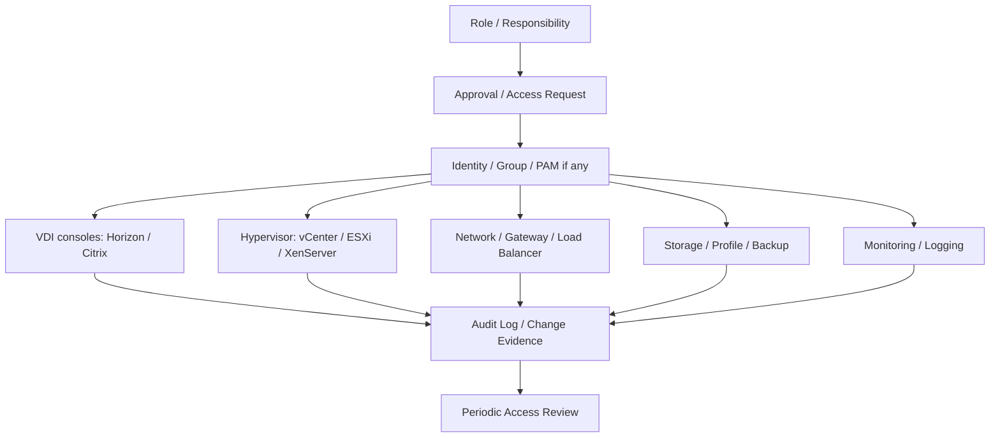

# VDI Access Control and RBAC Guide

## 0. Document Control

| Trường | Giá trị |
|---|---|
| Thứ tự | 24 |
| Tên tài liệu | VDI Access Control and RBAC Guide |
| Tên file | 24_VDI_Access_Control_and_RBAC_Guide.md |
| Mục đích tài liệu | Chuẩn hóa quyền truy cập cho system engineer, helpdesk, platform admin, security admin và customer operator theo nguyên tắc phân quyền tối thiểu. |
| Nguồn điều khiển | [[sources/vdi-training-idea]], [[sources/vdi-documentation-list-context]] |
| Trạng thái | Tài liệu đào tạo vận hành; role matrix thật, tool RBAC, approval workflow, audit owner và privileged access process là Need Customer Confirmation |

### Source Grounding

| Nội dung | Nguồn sử dụng | Mức độ tin cậy | Ghi chú |
|---|---|---|---|
| Bối cảnh hai hệ thống VDI quy mô 1500-2000+ VDI và yêu cầu vận hành theo lớp | [[sources/vdi-training-idea]] | High | Dùng làm bối cảnh chính cho kiểm soát quyền vận hành. |
| Tên tài liệu, tên file và mục đích tài liệu | [[sources/vdi-documentation-list-context]] | High | Source of truth cho scope file 24. |
| Vai trò quản trị Omnissa Horizon, Connection Server, UAG, desktop pool, entitlement | [[sources/horizon-8-architecture]], [[concepts/omnissa-horizon]], [[concepts/connection-server]], [[concepts/unified-access-gateway]] | High | Dùng để định hướng quyền quản trị Horizon. |
| Vai trò quản trị Citrix CVAD, Delivery Controller, StoreFront, VDA, Delivery Group | [[sources/citrix-virtual-apps-and-desktops-7-2603]], [[concepts/citrix-virtual-apps-and-desktops]], [[concepts/delivery-controller]], [[concepts/storefront]], [[concepts/virtual-delivery-agent]], [[concepts/delivery-group]] | High | Dùng để định hướng quyền quản trị Citrix. |
| Quyền ở lớp vCenter/ESXi/XenServer, VM, datastore, network | [[sources/vmware-vsphere-8-0]], [[sources/vcenter-server-installation-and-setup]], [[sources/xenserver-8-4]], [[concepts/vcenter-server]], [[concepts/esxi]], [[concepts/xenserver]], [[concepts/datastore]], [[concepts/virtual-networking]] | High | Dùng cho phân quyền hạ tầng. |
| Identity, change, incident, monitoring, certificate, backup và security boundary | [[concepts/identity-and-access-management]], [[concepts/change-management]], [[concepts/incident-management]], [[concepts/monitoring-and-logs]], [[concepts/certificate-management]], [[concepts/backup-and-recovery]] | Medium | Dùng cho nguyên tắc least privilege, audit và approval. |

## 1. Mục tiêu đào tạo

Access control và RBAC trong tài liệu này nói về quyền vận hành hệ thống VDI, không phải quyền user cuối được truy cập desktop/app. User entitlement được xử lý ở các tài liệu provisioning, Citrix Delivery Group và Horizon Desktop Pool. Ở đây, trọng tâm là ai được xem, ai được hỗ trợ user, ai được thay đổi cấu hình, ai được patch, ai được quản trị security policy và ai được phê duyệt thao tác rủi ro cao.

Sau khi đọc tài liệu này, engineer cần:

- Phân biệt quyền của helpdesk, system engineer, platform admin, security admin và customer operator.
- Hiểu nguyên tắc least privilege và separation of duties trong vận hành VDI.
- Biết thao tác nào chỉ cần quyền xem, thao tác nào cần quyền hỗ trợ user, thao tác nào cần quyền admin hoặc approval.
- Nhận diện rủi ro khi cấp quyền quá rộng trên Horizon, Citrix, vCenter/ESXi/XenServer, AD, Gateway, Storage và Monitoring.
- Biết evidence và audit log cần lưu khi cấp, thay đổi, thu hồi hoặc review quyền quản trị.
- Biết câu hỏi cần hỏi khách hàng để xây dựng role matrix thật.

Tài liệu này không yêu cầu hoặc ghi secret, password, token, private key hay credential. Nếu cần mô tả quyền truy cập, chỉ mô tả role, phạm vi và quy trình phê duyệt.

## 2. Khái niệm nền tảng

| Khái niệm | Ý nghĩa trong VDI operations | Ví dụ |
|---|---|---|
| Access control | Kiểm soát ai được truy cập console, dashboard, hệ thống quản trị và thao tác vận hành | Ai được vào Horizon Console, Citrix Studio, Director, vCenter, monitoring |
| RBAC | Gán quyền theo role thay vì cấp quyền tùy tiện cho từng người | Helpdesk role, VDI operator role, platform admin role |
| Least privilege | Chỉ cấp quyền tối thiểu cần cho công việc | Helpdesk được xem session và reset/logoff theo policy, nhưng không publish image |
| Separation of duties | Tách người yêu cầu, người phê duyệt và người thực hiện nếu thao tác rủi ro | Engineer không tự phê duyệt image publish do mình thực hiện |
| Privileged access | Quyền cao có thể thay đổi nền tảng hoặc dữ liệu | Admin trên broker, gateway, vCenter, AD, database, storage |
| Break-glass | Quyền khẩn cấp khi sự cố nghiêm trọng | Chỉ dùng theo quy trình khách hàng, có audit và review sau sự kiện |
| Audit trail | Dấu vết ai làm gì, lúc nào, trên hệ thống nào | Change log, admin log, ticket, SIEM event |
| Access review | Rà soát định kỳ quyền còn cần thiết không | Remove quyền engineer đã chuyển dự án hoặc quyền tạm thời hết hạn |

RBAC tốt không làm engineer khó làm việc hơn. RBAC tốt giúp engineer biết ranh giới trách nhiệm, giảm thao tác nhầm, dễ audit và escalation đúng owner.

## 3. Phân biệt quyền quản trị và user entitlement

| Nội dung | Quyền quản trị/RBAC | User entitlement |
|---|---|---|
| Đối tượng | Engineer, admin, helpdesk, operator | End user hoặc AD group user |
| Mục tiêu | Quản trị, hỗ trợ, thay đổi, giám sát nền tảng | Truy cập desktop hoặc published application |
| Công cụ | Horizon Console, Citrix Studio/Director, vCenter, Gateway, monitoring, AD | Horizon entitlement, Citrix Delivery Group/Application Group, AD group |
| Rủi ro | Thay đổi sai gây impact rộng, lộ dữ liệu, vi phạm audit | User không thấy resource hoặc thấy resource không được phép |
| Tài liệu liên quan | Tài liệu này | [[topics/11_VDI_Provisioning_and_Allocation_Guide]], [[topics/13_Citrix_Machine_Catalog_and_Delivery_Group_Guide]], [[topics/14_Omnissa_Desktop_Pool_and_Entitlement_Guide]] |

Một engineer có quyền quản trị cao không có nghĩa là nên cấp quyền user resource cho chính mình ngoài quy trình. Tài khoản vận hành, tài khoản user test và tài khoản cá nhân phải được kiểm soát theo chính sách khách hàng.

## 4. Mô hình RBAC theo lớp VDI

Mô hình này nhấn mạnh: quyền không nên cấp trực tiếp theo cảm tính. Quyền nên đi qua request, approval, group/role, phạm vi cụ thể, audit và review định kỳ. Nếu khách hàng có PAM hoặc privileged access workflow, tài liệu vận hành cần tích hợp vào quy trình đó.

## 5. Role đề xuất trong vận hành VDI

Tên role thật của khách hàng có thể khác. Bảng dưới là mô hình đào tạo để engineer hiểu nguyên tắc phân quyền.

| Role | Mục tiêu | Quyền nên có | Không nên có mặc định | Evidence/Audit |
|---|---|---|---|---|
| Helpdesk | Hỗ trợ user tuyến đầu | Xem session/user state, hướng dẫn user, reset/logoff/reconnect theo policy, xem lỗi cơ bản | Publish image, thay policy, thay entitlement diện rộng, xóa VM, chỉnh gateway/storage | Ticket, session action log, user confirmation |
| System Engineer | Vận hành kỹ thuật hằng ngày và xử lý incident | Xem health, kiểm tra broker/agent/session, thao tác trong SOP, phối hợp escalation, thực hiện change được duyệt | Quyền toàn quyền không giới hạn, tự phê duyệt change, thao tác security boundary | Ticket/change ID, action log, evidence |
| Platform Admin | Quản trị nền tảng VDI | Quản trị Horizon/Citrix, pool/catalog/DG, image publish, broker config, maintenance theo change | Thao tác ngoài nền tảng như firewall/storage/DB nếu không phải owner | Change record, admin log, rollback evidence |
| Security Admin | Quản trị policy bảo mật, audit và privileged access | Review RBAC, audit log, security policy, MFA/conditional access nếu có, exception approval | Vận hành thường nhật thay helpdesk/platform nếu không cần | Approval, security review, audit trail |
| Customer Operator | Đại diện khách hàng vận hành hoặc giám sát | Xem dashboard/report, xác nhận business impact, phê duyệt request theo vai trò | Quyền kỹ thuật sâu nếu không được đào tạo/phê duyệt | Approval, business validation |
| Hypervisor Admin | Quản trị vCenter/ESXi/XenServer/HCI | Host, cluster, VM power/placement, datastore visibility theo role | Thay VDI entitlement/policy nếu không thuộc VDI owner | vCenter/XenServer task log, change ID |
| Network/Gateway Admin | Quản trị LB, firewall, DNS, Gateway path | VIP, certificate binding, firewall rule, route, health probe | Thay broker/image/entitlement nếu không thuộc role | Firewall/LB/Gateway change log |
| Storage/Profile Admin | Quản trị datastore, profile share/container, backup | Storage path, capacity, permission, restore theo approval | Thay user entitlement hoặc VDI policy | Storage log, restore evidence |

## 6. Quyền theo công cụ và lớp hệ thống

| Công cụ/lớp | Quyền xem | Quyền hỗ trợ/vận hành | Quyền admin rủi ro cao | Kiểm soát cần có |
|---|---|---|---|---|
| Citrix Director | Xem session, machine, failed logon | Reset/logoff session, shadow nếu policy cho phép | Không phải nơi thay đổi cấu hình lớn | Role helpdesk, audit action |
| Citrix Studio | Xem Site, Catalog, Delivery Group | Thay assignment theo SOP, quản lý machine theo change | Tạo/sửa catalog, publish app, policy, image | Platform admin, change approval |
| Horizon Console | Xem pool, session, machine state | Reset/logoff/restart desktop theo SOP | Entitlement/pool/image/broker config | Role theo scope, admin log |
| vCenter/ESXi | Xem VM/host/datastore | Power/restart VM theo SOP, snapshot theo change | Xóa VM, thay host/network/datastore, cluster config | Hypervisor RBAC, task log |
| XenServer | Xem pool/host/SR/VM | VM power, host maintenance theo change | Storage/network/pool config, delete VM | Hypervisor owner approval |
| AD/Identity | Xem user/group/computer theo role | Thêm/xóa user khỏi group theo request chuẩn nếu được phép | GPO, OU move, privileged group, domain config | IAM approval, audit log |
| Gateway/LB/Firewall | Xem trạng thái VIP/member/rule | Disable member theo incident nếu SOP cho phép | Certificate, firewall rule, route, gateway policy | Network/security approval |
| Storage/Profile | Xem capacity/path/permission | Restore profile theo approval, cleanup lock theo SOP | Delete profile/data, change ACL rộng, storage expansion | Storage/security approval |
| Monitoring | Xem dashboard/alert | Acknowledge/comment alert, tạo report | Sửa threshold, tắt alert, xóa log | Monitoring owner, audit |
| Backup/Recovery | Xem job status nếu role cho phép | Request restore, validate restore | Restore overwrite, delete backup, change retention | Backup owner, dual approval |

Quyền "xem" không phải lúc nào cũng vô hại. Một dashboard có thể chứa tên user, hostname, IP, application hoặc thông tin nhạy cảm. Cần xác định dữ liệu nào được phép xem theo vai trò.

## 7. Ma trận thao tác rủi ro

| Thao tác | Helpdesk | System Engineer | Platform Admin | Security Admin | Customer Operator | Điều kiện bắt buộc |
|---|---:|---:|---:|---:|---:|---|
| Xem trạng thái session | Có | Có | Có | Có thể | Có thể | Theo scope dữ liệu được phép xem |
| Reset/logoff session | Có thể | Có | Có | Không thường xuyên | Không thường xuyên | Ticket/user confirmation/SOP |
| Restart một VDI user | Có thể | Có | Có | Không | Không | Kiểm tra active work và impact |
| Thêm user vào AD group VDI | Có thể nếu SOP | Có thể | Có thể | Review | Approve nếu owner | Request/approval/audit |
| Sửa entitlement/pool/DG mapping | Không | Có thể | Có | Review | Approve nếu owner | Change approval |
| Publish master image | Không | Có thể trong change | Có | Review nếu security impact | Approve business nếu cần | Change, rollback, postcheck |
| Thay policy clipboard/USB/printer | Không | Có thể | Có | Có/Review | Approve nếu business | Security review/change |
| Patch broker/gateway/agent | Không | Có thể | Có | Review | Thông báo/approve | Change, rollback, maintenance window |
| Xóa VM/persistent desktop | Không | Không mặc định | Có thể | Review nếu data/security | Approve owner | Data retention, backup, approval |
| Restore profile/user data | Không | Validate | Có thể phối hợp | Review nếu sensitive | Approve owner | Backup point, privacy, evidence |
| Thay firewall/LB/certificate | Không | Request/validate | Không nếu không owner | Review/approve | Approve service impact | Network/security change |
| Tắt monitoring alert | Không | Không mặc định | Có thể | Review | Không | Time-bound, reason, audit |

"Có thể" nghĩa là chỉ được phép nếu khách hàng đã định nghĩa role, scope và SOP rõ ràng. Nếu chưa rõ, ghi Need Customer Confirmation.

## 8. Quy trình cấp quyền quản trị

### 8.1 Request

Một request cấp quyền quản trị phải có:

- Người yêu cầu.
- Role cần cấp.
- Hệ thống đích: Horizon, Citrix, vCenter, XenServer, AD, monitoring, gateway, storage.
- Phạm vi: read-only, helpdesk, operator, admin, break-glass.
- Lý do nghiệp vụ.
- Thời hạn: permanent, temporary, theo ca trực, theo project.
- Approver/owner.
- Điều kiện đào tạo hoặc onboarding nếu role yêu cầu.

### 8.2 Approval

Approval nên đến từ owner phù hợp:

- VDI platform owner cho quyền Horizon/Citrix.
- IAM/AD owner cho quyền group/domain.
- Hypervisor owner cho vCenter/ESXi/XenServer.
- Network/security owner cho gateway, LB, firewall, certificate.
- Storage/backup owner cho profile/storage/restore.
- Service/customer owner cho quyền có tác động business.

### 8.3 Provisioning quyền

Khi cấp quyền:

- Ưu tiên cấp qua group/role, không cấp trực tiếp từng tài khoản nếu có thể.
- Scope càng hẹp càng tốt: theo site, pool, catalog, folder, resource group, dashboard hoặc function.
- Ghi rõ thời hạn nếu quyền tạm.
- Không chia sẻ tài khoản dùng chung nếu không được chính sách cho phép.
- Không gửi credential qua tài liệu/ticket.
- Lưu evidence: request, approval, role, scope, timestamp.

### 8.4 Review và revoke

Quyền phải được rà soát:

- Khi engineer rời dự án/đổi vai trò.
- Khi quyền tạm hết hạn.
- Sau incident liên quan thao tác nhầm.
- Theo chu kỳ access review của khách hàng.
- Sau audit finding.

Thu hồi quyền cũng cần evidence, đặc biệt với privileged access.

## 9. Audit và evidence

Audit không chỉ phục vụ compliance. Nó giúp RCA khi sự cố xảy ra sau một thao tác quản trị.

| Hành động | Evidence cần lưu |
|---|---|
| Cấp quyền admin | Request, approver, role, scope, timestamp, người thực hiện |
| Thu hồi quyền | User/role removed, lý do, timestamp, approver nếu cần |
| Reset/logoff/restart session | Ticket, user, desktop/session, timestamp, xác nhận user |
| Thay entitlement/policy | Change ID, before/after, affected group, validation |
| Publish image | Change ID, image version, approver, rollback, postcheck |
| Patch/upgrade | Change ID, version before/after, validation, rollback nếu có |
| Restore dữ liệu/profile | Incident/change, backup point, owner approval, validation |
| Break-glass | Lý do khẩn cấp, thời gian mở/đóng quyền, actions, post-review |

Không lưu dữ liệu nhạy cảm như password, token, private key, nội dung file user, full secret config. Evidence nên đủ để audit hành động, không phơi bày bí mật.

## 10. Rủi ro và lỗi thường gặp

| Triệu chứng | Nguyên nhân có thể | Lớp cần kiểm tra | Cách kiểm tra | Hướng xử lý | Khi nào escalation |
|---|---|---|---|---|---|
| Engineer không truy cập được console cần thiết | Chưa được cấp role, group chưa sync, MFA/PAM lỗi, scope sai | IAM, RBAC, Tool access | Kiểm tra request, group membership, role assignment, auth log | Cấp/sửa quyền theo approval, không dùng account người khác | P1/P2 cần xử lý khẩn hoặc PAM/IAM lỗi diện rộng |
| Helpdesk không thấy session user | Role thiếu scope, console filter, site/pool không được cấp | RBAC, Broker console | Kiểm tra role scope, user/resource, site/pool | Sửa scope theo least privilege | Nhiều helpdesk mất quyền hoặc ảnh hưởng SLA support |
| User bị cấp quyền resource sai sau thao tác admin | Nhầm group/entitlement, thiếu review, quyền admin quá rộng | Entitlement, IAM, Governance | Audit log, before/after mapping, ticket | Revert quyền sai, validate user, RCA | Có rủi ro dữ liệu/bảo mật |
| Policy security bị thay ngoài approval | Quyền platform quá rộng, không có change control, audit yếu | Policy, Change, Security | Admin log, change record, policy before/after | Rollback, security review, tighten RBAC | Clipboard/USB/drive/MFA/security boundary bị ảnh hưởng |
| VM hoặc desktop bị xóa nhầm | Quyền hypervisor quá rộng, thiếu approval, nhầm object | Hypervisor, VDI, Backup | vCenter/XenServer task log, ticket, object ID | Dừng thao tác, phục hồi nếu có backup, incident/RCA | Persistent data hoặc nhiều VM affected |
| Không xác định được ai đã thay đổi | Audit chưa bật, dùng shared account, log retention thiếu | Audit, IAM, Tooling | Kiểm tra admin log, SIEM, ticket | Bật audit, loại bỏ shared account nếu có thể, access review | Compliance/security incident |
| Quyền tạm không bị thu hồi | Không có expiry, thiếu review, owner không rõ | IAM, Governance | Access list, request date, role membership | Revoke, thiết lập expiry/review cycle | Privileged access tồn đọng diện rộng |
| Break-glass bị dùng như quyền thường xuyên | Quy trình khẩn cấp bị lạm dụng | Security, Governance | Break-glass log, frequency, actions | Review sau sự kiện, thu hẹp quyền, đào tạo lại | Bất kỳ lạm dụng privileged access |

## 11. Checklist cho engineer

### 11.1 Khi xin quyền

- [ ] Xác định rõ cần quyền để làm task nào.
- [ ] Chọn quyền thấp nhất đủ dùng.
- [ ] Ghi hệ thống, scope, role và thời hạn.
- [ ] Có approval từ owner phù hợp.
- [ ] Không yêu cầu credential hoặc secret trong ticket.
- [ ] Hoàn tất training/onboarding nếu role yêu cầu.

### 11.2 Khi sử dụng quyền

- [ ] Có ticket/change/incident liên quan.
- [ ] Kiểm tra đúng môi trường và đúng resource trước khi thao tác.
- [ ] Không mở rộng scope ngoài approval.
- [ ] Lưu evidence trước/sau với thao tác thay đổi.
- [ ] Không dùng tài khoản người khác.
- [ ] Không lưu secret trong ghi chú/evidence.

### 11.3 Khi cấp quyền cho người khác

- [ ] Request hợp lệ và có approver.
- [ ] Role và scope phù hợp least privilege.
- [ ] Quyền tạm có ngày hết hạn.
- [ ] Cấp qua group/role nếu có thể.
- [ ] Ghi evidence cấp quyền.
- [ ] Thông báo người nhận về phạm vi và trách nhiệm.

### 11.4 Khi review/thu hồi quyền

- [ ] So sánh quyền hiện tại với vai trò thực tế.
- [ ] Remove quyền không còn cần.
- [ ] Kiểm tra privileged role trước.
- [ ] Thu hồi quyền tạm hết hạn.
- [ ] Lưu evidence thu hồi.
- [ ] Escalate nếu phát hiện quyền bất thường hoặc không có owner.

## 12. Monitoring và audit cần theo dõi

| Nhóm | Chỉ số/evidence | Ý nghĩa |
|---|---|---|
| Privileged access | Số người có admin role, quyền tạm, break-glass usage | Phát hiện quyền cao tồn đọng hoặc bị lạm dụng. |
| Admin activity | Login console, config change, session action, image publish | RCA khi có sự cố sau thao tác. |
| Failed admin login | Auth failure, MFA failure, account lock | Phát hiện lỗi truy cập hoặc dấu hiệu security. |
| Entitlement/policy change | Before/after mapping, affected group | Kiểm soát thay đổi quyền user/resource. |
| Hypervisor tasks | VM delete, snapshot, power action, host maintenance | Phát hiện thao tác rủi ro ở lớp VM. |
| Gateway/network change | Cert binding, VIP, firewall/LB changes | Bảo vệ access path. |
| Access review | Last review date, exceptions, overdue revoke | Duy trì least privilege. |
| Ticket linkage | Admin action có ticket/change ID không | Giảm thao tác ngoài quy trình. |

Nếu tool monitoring hoặc audit source chưa xác nhận, ghi Unknown và hỏi khách hàng.

## 13. Change, risk và rollback

RBAC change cũng là change khi ảnh hưởng quyền quản trị hoặc security boundary.

Các thay đổi cần kiểm soát:

- Cấp quyền admin mới.
- Thay role của helpdesk/system engineer/platform admin.
- Thay scope của role trên Horizon/Citrix/vCenter/Gateway.
- Thay policy privileged access, MFA hoặc break-glass.
- Thay quyền trên AD group dùng để quản trị VDI.
- Tắt/mở audit log hoặc thay log retention.

Rollback cần chuẩn bị:

- Role/group trước thay đổi.
- Danh sách user bị ảnh hưởng.
- Cách remove quyền mới.
- Cách khôi phục quyền cũ nếu cấp thiếu làm gián đoạn vận hành.
- Validation: người cần quyền vẫn làm được task, người không nên có quyền đã bị chặn.

Dừng change nếu không xác định được owner, không có approval, không có audit, hoặc quyền cấp ra rộng hơn mục tiêu.

## 14. Security considerations

- Áp dụng least privilege cho cả console VDI và hạ tầng liên quan.
- Không dùng shared admin account nếu chính sách khách hàng không cho phép; nếu có, phải có kiểm soát và audit riêng.
- Privileged access nên có MFA/PAM/session recording nếu khách hàng triển khai.
- Break-glass phải time-bound, logged và reviewed sau sự kiện.
- Quyền liên quan certificate, gateway, firewall, backup, restore, profile data và security policy cần security approval.
- Không trộn tài khoản vận hành với tài khoản user test nếu chính sách yêu cầu tách biệt.
- Không ghi hoặc yêu cầu secret/password/token/private key trong tài liệu.
- Access review phải ưu tiên privileged roles, tài khoản không còn thuộc dự án và quyền tạm.

## 15. Scenario Based Learning

### Scenario 1: Helpdesk cần reset session nhưng được cấp quyền quá rộng

**Bối cảnh:** Helpdesk cần xử lý ticket user disconnect. Thay vì chỉ được quyền session action, họ được cấp quyền chỉnh policy và Delivery Group.

**Câu hỏi cho học viên:**

1. Quyền nào là đủ?
2. Rủi ro của quyền quá rộng là gì?
3. Evidence nào cần giữ khi sửa quyền?

**Gợi ý phân tích:** Helpdesk thường cần xem session và thực hiện reset/logoff theo SOP. Quyền policy/DG có thể gây impact rộng nếu thao tác nhầm.

**Hướng xử lý đề xuất:** Tạo hoặc dùng role helpdesk scope hẹp, remove quyền admin không cần, ghi access review evidence.

**Evidence cần lưu:** Request, role before/after, approver, audit log.

### Scenario 2: Engineer cần publish image nhưng không có quyền

**Bối cảnh:** Maintenance window đã đến, engineer có change được duyệt nhưng không có quyền publish image.

**Câu hỏi cho học viên:**

1. Có nên mượn tài khoản admin khác không?
2. Quy trình đúng là gì?
3. Làm sao tránh lặp lại?

**Gợi ý phân tích:** Không dùng tài khoản người khác. Cần escalation tới platform admin hoặc cấp quyền tạm theo change, có audit.

**Hướng xử lý đề xuất:** Dừng hoặc chuyển người có quyền thực hiện, cập nhật precheck cho các change sau: xác nhận quyền trước maintenance window.

**Evidence cần lưu:** Change ID, quyền thiếu, người thực hiện thực tế, approval cấp quyền tạm nếu có.

### Scenario 3: Sau sự cố không biết ai đã thay đổi entitlement

**Bối cảnh:** Một nhóm user thấy thêm desktop không được phép. Không có ticket rõ ràng.

**Câu hỏi cho học viên:**

1. Kiểm tra nguồn audit nào?
2. Đây là incident vận hành hay security concern?
3. Biện pháp cải tiến là gì?

**Gợi ý phân tích:** Entitlement sai có thể là security issue. Cần audit admin log, AD group change, ticket/change history và user impact.

**Hướng xử lý đề xuất:** Revert quyền sai, thu thập audit, review RBAC và access change workflow.

**Evidence cần lưu:** Before/after mapping, affected users, audit/ticket timeline, RCA.

### Scenario 4: Quyền break-glass được dùng nhiều lần trong tháng

**Bối cảnh:** Một tài khoản khẩn cấp được dùng thường xuyên để xử lý sự cố.

**Câu hỏi cho học viên:**

1. Điều này cho thấy vấn đề gì?
2. Cần review gì sau mỗi lần dùng?
3. Cải tiến RBAC thế nào?

**Gợi ý phân tích:** Break-glass không nên là quyền vận hành thường nhật. Có thể role thường thiếu quyền đúng hoặc quy trình cấp quyền quá chậm.

**Hướng xử lý đề xuất:** Review usage, chuyển các quyền cần thiết vào role chuẩn có kiểm soát, giới hạn break-glass, tăng audit.

**Evidence cần lưu:** Break-glass usage log, reason, actions, post-review, updated role matrix.

## 16. Hands-on hoặc bài tập tư duy

1. Lập role matrix cho helpdesk, system engineer, platform admin, security admin và customer operator.
2. Chọn 10 thao tác VDI phổ biến và phân loại: read-only, support action, standard operation, change, privileged action.
3. Thiết kế access request form cho quyền Horizon/Citrix/vCenter.
4. Phân tích tình huống "xóa nhầm persistent desktop" và xác định RBAC control nào có thể ngăn lỗi.
5. Tạo checklist access review hằng quý cho privileged roles.
6. Xác định evidence cần lưu khi cấp quyền tạm trong maintenance window.

## 17. Knowledge Check

**Câu 1. Least privilege trong VDI nghĩa là gì?**  
Chỉ cấp quyền tối thiểu cần để thực hiện nhiệm vụ, theo scope cụ thể và có audit.

**Câu 2. RBAC quản trị khác user entitlement như thế nào?**  
RBAC quản trị kiểm soát quyền của engineer/admin trên console và hạ tầng. User entitlement kiểm soát user cuối được truy cập desktop/app nào.

**Câu 3. Vì sao helpdesk không nên có quyền publish image?**  
Publish image có thể ảnh hưởng hàng trăm hoặc hàng nghìn VDI, cần change, rollback và quyền platform admin.

**Câu 4. Vì sao shared admin account gây rủi ro?**  
Khó xác định ai thao tác, audit yếu, khó truy trách nhiệm và tăng rủi ro lạm dụng.

**Câu 5. Khi nào cần security admin review?**  
Khi thay policy bảo mật, privileged access, break-glass, certificate/gateway, MFA/conditional access, dữ liệu profile hoặc quyền nhạy cảm.

**Câu 6. Quyền tạm cần kiểm soát gì?**  
Cần approval, scope, thời hạn, audit và thu hồi sau khi hết nhu cầu.

**Câu 7. Một engineer thiếu quyền trong maintenance window nên làm gì?**  
Không mượn tài khoản người khác. Escalate theo change, nhờ người có quyền thực hiện hoặc cấp quyền tạm có approval/audit.

**Câu 8. Evidence cấp quyền admin gồm gì?**  
Request, approver, role, scope, thời hạn, người thực hiện, timestamp và hệ thống được cấp.

**Câu 9. Vì sao audit log quan trọng khi có sự cố sau change?**  
Audit giúp xác định ai thay gì, lúc nào, trên đối tượng nào, từ đó RCA và rollback chính xác hơn.

**Câu 10. Access review nên ưu tiên gì?**  
Privileged roles, quyền tạm, tài khoản đã đổi vai trò/rời dự án, quyền không có owner và exception ngoài chuẩn.

## 18. Common Misconceptions

- "Engineer giỏi nên cấp full admin cho nhanh." Sai. Full admin tăng rủi ro thao tác nhầm và làm audit khó hơn.
- "Read-only luôn an toàn." Không hẳn. Read-only có thể lộ thông tin user, hostname, IP, topology hoặc incident data.
- "RBAC chỉ là việc của security team." Sai. VDI engineer phải hiểu quyền nào cần cho task và rủi ro của từng quyền.
- "Có ticket là được làm mọi thao tác." Sai. Ticket phải đúng scope, approval và người thao tác phải có role phù hợp.
- "Break-glass dùng cho tiện cũng được." Sai. Break-glass chỉ dùng khẩn cấp, time-bound, logged và reviewed.
- "Thu hồi quyền chỉ cần khi nhân sự nghỉ việc." Sai. Cần thu hồi khi đổi vai trò, hết dự án, hết quyền tạm hoặc sau audit finding.

## 19. Need Customer Confirmation

Các thông tin cần hỏi khách hàng:

- Role matrix hiện tại cho Horizon, Citrix, vCenter/ESXi, XenServer, AD, Gateway, Storage, Monitoring là gì?
- Công cụ nào quản lý privileged access hoặc PAM nếu có?
- Có MFA bắt buộc cho admin console không?
- Helpdesk được phép thao tác gì: view, reset, logoff, restart, shadow, remote assistance?
- System engineer được phép thao tác gì trong daily operation và incident?
- Platform admin gồm những quyền nào trên Horizon/Citrix/vCenter/XenServer?
- Security admin phê duyệt những loại thay đổi nào?
- Customer operator được xem hoặc approve những gì?
- Quy trình cấp quyền tạm, emergency access và break-glass là gì?
- Audit log lưu ở đâu, retention bao lâu, ai review?
- Access review diễn ra theo chu kỳ nào và owner là ai?
- Có dùng shared account không? Nếu có, kiểm soát/audit thế nào?
- Quyền thao tác trên AD group VDI thuộc IAM hay VDI team?
- Ai có quyền thay policy clipboard/USB/printer/drive/session timeout?
- Ai có quyền xóa VM, persistent desktop, profile data hoặc restore backup?
- Evidence cấp/thu hồi quyền lưu trong ticket, IAM system, SIEM hay nơi nào?

## 20. Related Wiki Links

### Source summaries

- [[sources/vdi-training-idea]]
- [[sources/vdi-documentation-list-context]]
- [[sources/horizon-8-architecture]]
- [[sources/citrix-virtual-apps-and-desktops-7-2603]]
- [[sources/vmware-vsphere-8-0]]
- [[sources/vcenter-server-installation-and-setup]]
- [[sources/xenserver-8-4]]

### Concepts

- [[concepts/identity-and-access-management]]
- [[concepts/change-management]]
- [[concepts/incident-management]]
- [[concepts/monitoring-and-logs]]
- [[concepts/certificate-management]]
- [[concepts/backup-and-recovery]]
- [[concepts/omnissa-horizon]]
- [[concepts/connection-server]]
- [[concepts/unified-access-gateway]]
- [[concepts/citrix-virtual-apps-and-desktops]]
- [[concepts/delivery-controller]]
- [[concepts/storefront]]
- [[concepts/virtual-delivery-agent]]
- [[concepts/delivery-group]]
- [[concepts/vcenter-server]]
- [[concepts/esxi]]
- [[concepts/xenserver]]
- [[concepts/datastore]]
- [[concepts/virtual-networking]]
- [[concepts/user-profile-management]]

### Topic documents

- [[topics/6_Identity_and_Domain_Integration_Guide]]
- [[topics/10_VDI_Security_and_Policy_Management_Guide]]
- [[topics/11_VDI_Provisioning_and_Allocation_Guide]]
- [[topics/12_Master_Image_Management_Guide]]
- [[topics/13_Citrix_Machine_Catalog_and_Delivery_Group_Guide]]
- [[topics/14_Omnissa_Desktop_Pool_and_Entitlement_Guide]]
- [[topics/15_VDI_Monitoring_and_Alerting_Guide]]
- [[topics/17_VDI_Incident_Classification_Guide]]
- [[topics/18_VDI_Troubleshooting_Playbook]]
- [[topics/20_VDI_Change_Management_Guide]]
- [[topics/22_VDI_Backup_and_Recovery_Guide]]
- [[topics/25_VDI_Support_and_Escalation_Guide]]

## 21. Summary for Learners

Khi làm việc với access control và RBAC trong VDI, engineer nên tự hỏi:

1. Đây là quyền quản trị hay user entitlement?
2. Task cần quyền xem, quyền hỗ trợ user, quyền vận hành chuẩn hay quyền admin rủi ro cao?
3. Quyền có đúng scope và đúng thời hạn không?
4. Có approval từ owner phù hợp chưa?
5. Có audit log và ticket/change ID không?
6. Có cách rollback/thu hồi quyền nếu cấp sai không?
7. Quyền này có mở rộng access tới dữ liệu, security boundary hoặc thao tác destructive không?
8. Khi engineer rời vai trò, quyền có được review và revoke không?

Điều cần nhớ nhất: RBAC tốt không phải là cản trở vận hành. RBAC tốt giúp đúng người làm đúng việc, giảm lỗi thao tác, bảo vệ dữ liệu và làm cho incident/change có thể điều tra được bằng evidence.

## 22. Self Review

- [x] Đúng tên tài liệu trong list_context.txt.
- [x] Đúng tên file trong cột Name File.
- [x] Đúng mục đích: chuẩn hóa quyền truy cập cho system engineer, helpdesk, platform admin, security admin và customer operator theo least privilege.
- [x] Bám bối cảnh training_idea.md: Horizon on HCI, Citrix CVAD trên XenServer/ESXi, quy mô 1500-2000+ VDI.
- [x] Không bịa role matrix, PAM, MFA, audit retention hoặc quy trình cấp quyền của khách hàng.
- [x] Có phân biệt quyền quản trị/RBAC với user entitlement.
- [x] Có ma trận role, quyền theo tool, thao tác rủi ro, workflow cấp/review/thu hồi quyền.
- [x] Có lỗi thường gặp và hướng xử lý theo evidence.
- [x] Có checklist, monitoring/audit, security, scenario, knowledge check và misconception.
- [x] Có liên kết tới source, concept và topic liên quan.
- [x] Phù hợp cho system engineer chuẩn bị tham gia vận hành thực tế.
