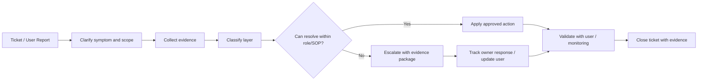
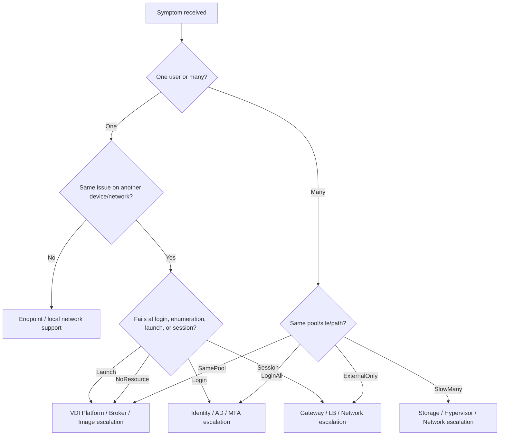

# VDI Support and Escalation Guide

## 0. Document Control

| Trường | Giá trị |
|---|---|
| Thứ tự | 25 |
| Tên tài liệu | VDI Support and Escalation Guide |
| Tên file | 25_VDI_Support_and_Escalation_Guide.md |
| Mục đích tài liệu | Quy định cách hỗ trợ người dùng, thu thập evidence, xác định nhóm phụ trách, escalation theo lớp lỗi và thông tin cần cung cấp khi chuyển tuyến xử lý. |
| Nguồn điều khiển | [[sources/vdi-training-idea]], [[sources/vdi-documentation-list-context]] |
| Trạng thái | Tài liệu đào tạo vận hành; support model, SLA, ticket tool, escalation matrix, owner và contact path thực tế là Need Customer Confirmation |

### Source Grounding

| Nội dung | Nguồn sử dụng | Mức độ tin cậy | Ghi chú |
|---|---|---|---|
| Bối cảnh hai hệ thống VDI, quy mô 1500-2000+ VDI và yêu cầu vận hành theo lớp | [[sources/vdi-training-idea]] | High | Dùng làm bối cảnh chính cho support/escalation. |
| Tên tài liệu, tên file và mục đích tài liệu | [[sources/vdi-documentation-list-context]] | High | Source of truth cho scope file 25. |
| Luồng Horizon, Connection Server, UAG, Horizon Agent và troubleshooting connection | [[sources/horizon-8-architecture]], [[sources/understand-and-troubleshoot-horizon-connections]], [[concepts/omnissa-horizon]], [[concepts/connection-server]], [[concepts/unified-access-gateway]] | High | Dùng cho phân tuyến lỗi Horizon. |
| Luồng Citrix CVAD, Delivery Controller, StoreFront, Gateway, VDA, Delivery Group | [[sources/citrix-virtual-apps-and-desktops-7-2603]], [[concepts/citrix-virtual-apps-and-desktops]], [[concepts/delivery-controller]], [[concepts/storefront]], [[concepts/virtual-delivery-agent]], [[concepts/delivery-group]] | High | Dùng cho phân tuyến lỗi Citrix. |
| Profile, storage, hypervisor, identity, monitoring, incident và escalation theo lớp | [[sources/fslogix-documentation]], [[sources/vmware-vsphere-8-0]], [[sources/xenserver-8-4]], [[concepts/profile-container]], [[concepts/user-profile-management]], [[concepts/vcenter-server]], [[concepts/xenserver]], [[concepts/identity-and-access-management]], [[concepts/monitoring-and-logs]], [[concepts/incident-management]] | High | Dùng cho evidence và escalation tới đội phụ trách. |

## 1. Mục tiêu đào tạo

Support và escalation trong VDI là khả năng biến một câu báo lỗi mơ hồ của user thành một ticket có đủ dữ liệu, được phân loại đúng, xử lý đúng lớp và chuyển tuyến đúng owner khi cần. Với hệ thống 1500-2000+ VDI, nếu support chỉ ghi "user không vào được VDI" rồi chuyển tuyến, đội tiếp theo sẽ mất thời gian hỏi lại, SLA bị kéo dài và incident có thể lan rộng.

Sau khi đọc tài liệu này, engineer cần:

- Biết nhận ticket VDI và đặt câu hỏi đúng để khoanh vùng.
- Biết phân biệt lỗi login, không thấy resource, launch fail, session disconnect, black screen, profile, printer, storage, network, identity và application.
- Biết evidence tối thiểu cần thu thập trước khi escalation.
- Biết xác định nhóm phụ trách theo lớp lỗi: VDI platform, identity, network, storage, hypervisor, security, application, endpoint/helpdesk, vendor.
- Biết khi nào xử lý trong phạm vi support, khi nào cần incident escalation, khi nào cần change hoặc vendor escalation.
- Biết cách viết handoff rõ để tuyến sau có thể tiếp tục xử lý ngay.

Tài liệu này không thay thế SLA hoặc escalation matrix thật của khách hàng. Các thông tin như priority, support tier, hotline, queue, owner, tool ticket và thời gian phản hồi cần xác nhận thêm.

## 2. Nguyên tắc support VDI

1. **Bắt đầu từ trải nghiệm user, nhưng không dừng ở user.** User nói "VDI lỗi" có thể là lỗi endpoint, identity, gateway, broker, agent, storage, profile, network hoặc application.
2. **Khoanh vùng trước khi hành động.** Không reboot VM, reset session hoặc sửa quyền khi chưa biết scope và evidence.
3. **Evidence trước escalation.** Escalation tốt là gói thông tin giúp đội nhận xử lý ngay, không phải một câu "nhờ kiểm tra".
4. **Phân tuyến theo lớp lỗi.** Lỗi DNS không nên chuyển cho Citrix admin nếu evidence cho thấy DNS fail. Lỗi datastore latency không nên giữ ở helpdesk.
5. **Không che giấu Unknown.** Nếu thiếu topology, owner, SLA hoặc tool, ghi rõ Need Customer Confirmation.
6. **Không yêu cầu secret.** Support không cần password/token/credential của user hay admin.

## 3. Luồng xử lý support end-to-end



Tuyến support tốt phải giữ được ba thứ: user được cập nhật, đội kỹ thuật có đủ dữ liệu và ticket có timeline rõ. Khi escalation, người gửi vẫn cần theo dõi ticket cho tới khi có owner nhận xử lý hoặc quy trình khách hàng chuyển hẳn ownership.

## 4. Câu hỏi bắt buộc khi nhận ticket

| Nhóm câu hỏi | Cần hỏi/gửi gì | Dùng để khoanh vùng |
|---|---|---|
| User | Username, domain, nhóm người dùng, liên hệ, location | Xác định identity và phạm vi |
| Thời điểm | Bắt đầu lúc nào, lặp lại hay một lần, sau change nào | Correlate với alert/change |
| Đường truy cập | Internal hay external, client/browser, VPN nếu có | Gateway/network/client |
| Triệu chứng | Login fail, không thấy desktop, launch fail, disconnect, black screen, chậm, profile, printer | Phân loại lỗi |
| Resource | Desktop/app name, pool/catalog/DG nếu biết, VDI hostname nếu có | Broker/resource layer |
| Scope | Một user, nhiều user, một phòng ban, một site, một pool/catalog | Impact/priority |
| Error | Screenshot, error text, code, timestamp | Evidence ban đầu |
| Endpoint | Thiết bị, OS, client version, network | Endpoint/client issue |
| Recent change | User mới onboard, password change, group change, image/policy/patch | RCA direction |

Nếu user không cung cấp được đủ thông tin, support vẫn có thể bắt đầu bằng username, timestamp, access path và screenshot lỗi. Không nên chờ đủ mọi thông tin nếu impact đang rộng.

## 5. Phân loại symptom và lớp lỗi

| Symptom user báo | Lớp nghi ngờ đầu tiên | Kiểm tra nhanh | Escalation có thể cần |
|---|---|---|---|
| Không đăng nhập portal được | Identity, Gateway, Portal | Account state, MFA nếu có, DNS/cert, gateway/portal health | IAM, Network/Gateway, VDI platform |
| Đăng nhập được nhưng không thấy desktop/app | Entitlement, Broker, AD group | User/group mapping, pool/DG enabled, resource availability | VDI platform, IAM |
| Thấy resource nhưng launch fail | Broker, Agent/VDA, VM, protocol path | Failed session, registration, VM power, gateway/protocol | VDI platform, Network, Hypervisor |
| Launch vào black screen | Agent/VDA, profile, display protocol, OS, security tool | Event log, profile load, display driver, image change | VDI platform, Image/App/Security |
| Session disconnect/reconnect liên tục | Network, Gateway, protocol, endpoint, host load | Latency, packet loss, gateway log, client version | Network, VDI platform, Endpoint |
| Login chậm | GPO, profile, storage, DC, logon script, AV | Login duration, GPO result, profile log, storage latency | IAM, Storage/Profile, Security |
| Temporary profile/mất setting | Profile path/container, permission, lock, storage | Profile log, share access, container state | Storage/Profile, IAM |
| Printer/USB/clipboard lỗi | Policy, client, driver, security rule | Effective policy, client capability, driver | VDI platform, Security, Endpoint |
| VDI chậm toàn diện | Host CPU/memory, storage latency, network, capacity | Monitoring metrics, scope, time correlation | Hypervisor, Storage, Network, Capacity |
| Chỉ app nghiệp vụ lỗi | Application/backend, network path, dependency | App error, backend reachability, other apps | Application owner, Network |

Phân loại là giả thuyết ban đầu, không phải kết luận. Mỗi escalation cần kèm evidence chứng minh vì sao nghi lớp đó.

## 6. Evidence package theo loại escalation

### 6.1 Evidence chung cho mọi ticket

- Ticket ID.
- Username và contact.
- Timestamp sự cố, timezone nếu cần.
- Internal/external access path.
- Client type/browser/client version nếu biết.
- Resource name: desktop/app/pool/catalog/DG/hostname nếu có.
- Screenshot hoặc error text.
- Scope impact: một user, nhiều user, một pool/catalog, một site, external-only.
- Recent change hoặc onboarding liên quan.
- Các bước đã thử và kết quả.

### 6.2 Escalation theo lớp

| Nhóm nhận escalation | Khi chuyển tuyến | Evidence cần gửi |
|---|---|---|
| VDI Platform | Resource không hiện, launch fail, VDA/Agent unregistered, broker/gateway component nghi lỗi | User/resource, failed session, pool/DG state, registration, broker/gateway logs nếu có |
| IAM/AD | Login fail, group không hiệu lực, account lock, GPO, computer account, DNS/time sync | Account state, group membership, DC/DNS evidence, GPO result, timestamp |
| Network | External-only issue, disconnect, packet loss, DNS/firewall/routing/LB nghi lỗi | Source/destination, internal vs external comparison, latency/packet loss, DNS result, LB/gateway evidence |
| Storage/Profile | Login chậm, profile fail, datastore latency, profile container lỗi | Profile log, path/share, capacity/latency, affected users, storage alert |
| Hypervisor/HCI | VM powered off/stuck, host contention, VM restart, snapshot/datastore issue | VM name, host, cluster, power state, host metrics, task/event log |
| Security | Policy/security control, MFA/conditional access, USB/clipboard, suspected unauthorized access | Policy scope, user/group, audit log, error, business impact |
| Application Owner | VDI session vào được nhưng app/backend lỗi | App name, error, user/session, backend reachability, other users/apps comparison |
| Endpoint/Helpdesk | Chỉ một thiết bị/client lỗi, client version cũ, local network/device issue | Device info, client logs if available, comparison with another device |
| Vendor | Lỗi sản phẩm lặp lại sau đã loại trừ dependency, bug/known issue nghi ngờ | Version, logs, reproduction steps, scope, business impact, changes tried |

Một escalation tốt nên trả lời được: "Ai bị ảnh hưởng?", "Lỗi ở bước nào?", "Đã kiểm tra gì?", "Vì sao nghi lớp này?", "Cần đội nhận làm gì tiếp?"

## 7. Support actions trong phạm vi thường gặp

| Hành động | Khi nào làm | Precheck | Rủi ro | Evidence cần lưu |
|---|---|---|---|---|
| Hướng dẫn user đăng xuất/đăng nhập lại portal | Group/entitlement mới cấp, cache/session cũ | Không có active work đang lưu | Mất trạng thái session portal | User confirmation |
| Reset/logoff session | Session treo, disconnect, user xác nhận được phép | Xác nhận user/session đúng | Mất dữ liệu chưa lưu trong session | Ticket, session ID/VDI, timestamp |
| Restart một VDI | VM/session lỗi cục bộ, user đồng ý | Kiểm tra active session và impact | Mất work chưa lưu, kéo dài outage nếu root cause khác | VM name, reason, before/after |
| Check entitlement/group | User không thấy resource | Có approval/owner nếu cần sửa | Cấp nhầm quyền nếu thao tác vội | Group/resource mapping |
| Collect logs/screenshot | Trước escalation | Không chứa secret/dữ liệu nhạy cảm | Lộ thông tin nếu lưu sai nơi | Log excerpt an toàn |
| Ask user to test alternate path/device | Nghi endpoint/client/local network | User có phương án test | Không phải fix thật, chỉ khoanh vùng | Result comparison |

Không thực hiện thao tác như publish image, thay policy, sửa gateway/certificate, xóa VM, restore profile hoặc thay firewall nếu không có change/approval và role phù hợp.

## 8. Escalation decision tree



Decision tree không thay thế kinh nghiệm, nhưng giúp engineer mới tránh nhảy thẳng vào reboot VM hoặc chuyển sai đội.

## 9. Communication trong support

### 9.1 Cập nhật cho user

Thông tin nên ngắn, rõ:

- Đã nhận ticket và đang kiểm tra.
- Cần user cung cấp thêm gì.
- Có workaround tạm thời không.
- Khi escalation, nói rõ đã chuyển tới nhóm nào và vì sao.
- Khi xong, yêu cầu user xác nhận kết quả.

Không đổ lỗi cho đội khác khi chưa có evidence. Nói "đang kiểm tra lớp network/gateway vì lỗi chỉ xảy ra với user external" tốt hơn "network bị lỗi".

### 9.2 Cập nhật cho đội kỹ thuật

Một handoff tốt nên có format:

```text
Ticket:
Impact:
User/resource:
Access path:
Symptom:
Timeline:
Evidence collected:
Checks already done:
Suspected layer:
Request to receiving team:
Business urgency:
```

Nếu ticket thiếu evidence, escalation sẽ quay vòng. Đừng để tuyến sau phải hỏi lại những câu cơ bản mà tuyến trước có thể thu thập.

## 10. Lỗi thường gặp trong support và escalation

| Vấn đề | Nguyên nhân | Hậu quả | Cách cải thiện |
|---|---|---|---|
| Ticket ghi quá chung chung | Không hỏi symptom/scope/timestamp | Escalation chậm, hỏi lại user nhiều lần | Dùng intake checklist |
| Escalate sai đội | Không phân lớp lỗi | Ticket bị chuyển vòng | Dùng symptom-to-layer matrix |
| Không có evidence before action | Reboot/reset quá sớm | Mất dấu vết RCA | Chụp/log trạng thái trước khi thao tác |
| Không xác định impact | Chỉ nhìn một user | Chậm phát hiện incident rộng | Luôn hỏi/kiểm tra scope |
| Không kiểm tra recent change | Tập trung symptom hiện tại | Bỏ qua root cause sau patch/change | Correlate với change calendar |
| Không cập nhật user | Ticket xử lý kỹ thuật nhưng user không biết | User mở ticket lặp, mất niềm tin | Cập nhật theo milestone |
| Đóng ticket quá sớm | Chỉ task completed, chưa user validation | Lỗi quay lại | Cần validation hoặc ghi rõ pending user confirm |
| Escalation không có request rõ | Chỉ ghi "nhờ kiểm tra" | Đội nhận không biết cần làm gì | Ghi rõ câu hỏi/hành động cần đội nhận |

## 11. Checklist cho engineer

### 11.1 Intake

- [ ] User, contact, location.
- [ ] Timestamp và timezone.
- [ ] Internal/external access path.
- [ ] Client/browser/device.
- [ ] Resource name hoặc screenshot portal.
- [ ] Symptom chính.
- [ ] Scope: một user hay nhiều user.
- [ ] Recent change/onboarding/password/group change.

### 11.2 Triage

- [ ] Xác định lỗi ở bước login, resource enumeration, launch, session runtime, profile hoặc app.
- [ ] Kiểm tra entitlement/resource availability nếu không thấy desktop/app.
- [ ] Kiểm tra failed session, Agent/VDA registration nếu launch fail.
- [ ] Kiểm tra profile/storage nếu login chậm hoặc temporary profile.
- [ ] Kiểm tra internal vs external nếu nghi gateway/network.
- [ ] Kiểm tra monitoring/alert nếu nhiều user.

### 11.3 Trước escalation

- [ ] Evidence chung đã đủ.
- [ ] Lớp nghi ngờ đã nêu rõ.
- [ ] Đã ghi các kiểm tra đã làm.
- [ ] Đã nêu yêu cầu cụ thể với đội nhận.
- [ ] Priority/impact đã cập nhật.
- [ ] Không đính kèm secret hoặc dữ liệu nhạy cảm.

### 11.4 Close ticket

- [ ] User hoặc monitoring xác nhận OK.
- [ ] Root cause hoặc workaround ghi rõ nếu biết.
- [ ] Đội xử lý và hành động chính đã ghi.
- [ ] Evidence trước/sau lưu đủ.
- [ ] KB/update follow-up nếu lỗi lặp lại.

## 12. Monitoring và evidence cần theo dõi

| Nhóm | Chỉ số/evidence | Dùng khi |
|---|---|---|
| Session | Active/disconnected/failed session, launch failure | Launch fail, disconnect, impact rộng |
| Registration | VDA/Horizon Agent registered/unregistered | Machine unavailable, launch fail |
| Broker/Gateway | Service health, portal, gateway, LB member | Login/resource/external issue |
| Identity | Auth failure, account lock, group membership, GPO | Login fail, no resource, policy issue |
| Profile | Profile load time, temporary profile, container attach | Login chậm, mất setting |
| Storage | Datastore/profile capacity, latency, IOPS | Chậm, boot/logon storm, profile issue |
| Network | Latency, packet loss, DNS, firewall/LB state | Disconnect, external-only issue |
| Hypervisor | VM power, host CPU/memory, datastore path | VM stuck/off, performance |
| Ticket trend | Số ticket theo symptom/time/site | Phát hiện incident rộng |

## 13. Security và quyền trong support

- Không yêu cầu user cung cấp password, token, MFA code hoặc secret.
- Remote assistance/shadow session chỉ thực hiện nếu chính sách khách hàng cho phép và user đồng ý nếu cần.
- Không mở policy clipboard/USB/drive/printer để "fix nhanh" khi chưa có approval.
- Không cấp entitlement hoặc AD group ngoài ticket/approval.
- Không gửi log chứa dữ liệu nhạy cảm vào kênh không phù hợp.
- Helpdesk/system engineer chỉ thao tác trong RBAC được cấp.
- Suspected unauthorized access hoặc data exposure phải escalation security.

## 14. Scenario Based Learning

### Scenario 1: User external login được nhưng launch timeout

**Bối cảnh:** Một user bên ngoài đăng nhập portal được, thấy desktop, nhưng launch timeout.

**Câu hỏi cho học viên:** Đây có phải lỗi identity không? Cần evidence gì trước khi chuyển network/gateway?

**Gợi ý phân tích:** Login và enumeration đã qua, lỗi ở launch/session path. Cần so sánh internal/external, kiểm tra failed session, gateway/LB, protocol path và Agent/VDA registration.

**Hướng xử lý đề xuất:** Nếu internal launch được nhưng external fail, escalation gateway/network kèm timestamp, user, resource, external IP/location nếu được phép, gateway error và failed session.

**Evidence cần lưu:** Screenshot lỗi, access path, internal/external comparison, gateway/LB status nếu có.

### Scenario 2: Nhiều user trong cùng catalog bị black screen

**Bối cảnh:** Sau maintenance window, nhiều user trong cùng catalog/pool vào desktop bị black screen.

**Câu hỏi cho học viên:** Có nên reset từng session không? Escalate cho ai?

**Gợi ý phân tích:** Cùng catalog/pool và sau change gợi ý image, VDA/Horizon Agent, policy, profile hoặc display protocol. Reset từng session chỉ xử lý triệu chứng.

**Hướng xử lý đề xuất:** Thu thập affected machines, image/change ID, event log sample, registration, policy/profile evidence. Escalate VDI platform/image owner.

**Evidence cần lưu:** Affected scope, change timeline, screenshot, session log, image version.

### Scenario 3: User mới onboard không thấy desktop

**Bối cảnh:** User mới có account, login portal được nhưng không thấy desktop.

**Câu hỏi cho học viên:** Chuyển VDI platform hay IAM trước?

**Gợi ý phân tích:** Cần kiểm tra group membership và entitlement mapping. Nếu user chưa nằm trong group, IAM/onboarding. Nếu group đúng nhưng resource không hiện, VDI platform kiểm tra entitlement/broker.

**Hướng xử lý đề xuất:** Thu thập user, expected AD group, resource/pool/DG, approval, group membership, entitlement mapping.

**Evidence cần lưu:** Ticket onboarding, group membership, resource mapping, screenshot portal.

### Scenario 4: Login chậm toàn bộ đầu giờ sáng

**Bối cảnh:** Nhiều user báo login mất 5-10 phút lúc 8h30.

**Câu hỏi cho học viên:** Đây là incident lớp nào? Cần escalation cho ai?

**Gợi ý phân tích:** Có thể là logon storm, profile storage, GPO/DC, storage latency, host contention hoặc security scan. Cần monitoring trend theo timestamp.

**Hướng xử lý đề xuất:** Thu thập login duration sample, affected scope, GPO/profile/storage/DC/host metrics. Escalate theo bottleneck evidence.

**Evidence cần lưu:** Timeline, sample users, login phase, storage/DC/host metrics, alert IDs.

## 15. Hands-on hoặc bài tập tư duy

1. Viết handoff escalation cho lỗi "user thấy desktop nhưng launch fail".
2. Tạo intake checklist ngắn cho helpdesk khi nhận ticket VDI.
3. Phân loại 10 symptom VDI vào các lớp lỗi tương ứng.
4. Thiết kế evidence package cho lỗi profile temporary.
5. Đọc một ticket mơ hồ "VDI chậm" và viết lại thành ticket đủ thông tin.
6. Lập bảng owner giả định cho VDI platform, IAM, network, storage, hypervisor, security và application.

## 16. Knowledge Check

**Câu 1. Vì sao ticket "VDI lỗi" chưa đủ để escalation?**  
Vì chưa có symptom, scope, timestamp, access path, resource và evidence để xác định lớp lỗi.

**Câu 2. User login portal được nhưng không thấy desktop, nghi lớp nào trước?**  
Entitlement, AD group, broker/resource enumeration, pool/catalog/DG availability.

**Câu 3. User thấy desktop nhưng launch fail, cần kiểm tra gì?**  
Failed session, Agent/VDA registration, VM power state, resource availability, gateway/protocol path.

**Câu 4. Khi nào cần escalation network?**  
Khi lỗi external-only, DNS/routing/firewall/LB nghi vấn, packet loss/latency cao hoặc session disconnect theo path.

**Câu 5. Evidence tối thiểu trước escalation gồm gì?**  
Ticket ID, user, timestamp, access path, resource, symptom, scope, screenshot/error, checks done và request cụ thể.

**Câu 6. Vì sao không nên reset session trước khi lưu evidence?**  
Vì reset có thể xóa trạng thái lỗi cần cho RCA và làm mất dữ liệu chưa lưu của user.

**Câu 7. Khi nào chuyển security?**  
Khi có nghi ngờ unauthorized access, cấp quyền sai gây data exposure, policy security bị thay, MFA/conditional access hoặc dữ liệu nhạy cảm.

**Câu 8. Ticket close cần điều kiện gì?**  
User hoặc monitoring xác nhận OK, action/result/evidence rõ, root cause/workaround ghi lại nếu biết.

**Câu 9. Một user lỗi trên một thiết bị nhưng OK trên thiết bị khác gợi ý gì?**  
Endpoint/client/local network hoặc user device issue.

**Câu 10. Escalation tốt cần có "request to receiving team" vì sao?**  
Để đội nhận biết cần kiểm tra hoặc hành động cụ thể gì, tránh chuyển tuyến chung chung.

## 17. Common Misconceptions

- "Support chỉ cần chuyển ticket cho đội VDI." Sai. Support cần thu thập evidence và phân lớp ban đầu.
- "User login fail luôn là lỗi VDI platform." Sai. Có thể là account, MFA, DC, DNS, certificate hoặc gateway.
- "Reset session là bước đầu tiên." Sai. Chỉ làm khi đúng tình huống, có precheck và lưu evidence cần thiết.
- "Một user báo chậm nghĩa là hệ thống chậm." Chưa chắc. Cần kiểm tra scope và so sánh.
- "Escalation càng sớm càng tốt dù thiếu thông tin." Escalation sớm là tốt khi impact lớn, nhưng vẫn cần gói evidence tối thiểu.
- "Đóng ticket khi đội khác nhận xử lý." Không nên nếu quy trình chưa chuyển ownership rõ hoặc user chưa được cập nhật.

## 18. Need Customer Confirmation

Các thông tin cần hỏi khách hàng:

- Mô hình support tier hiện tại: L1, L2, L3, vendor, customer operator.
- Ticket tool và queue/assignment group chính thức.
- SLA theo priority và cách tính impact/urgency.
- Escalation matrix cho VDI platform, IAM, network, storage, hypervisor, security, application, vendor.
- Helpdesk được phép thao tác gì: reset session, logoff, restart VDI, shadow, remote assistance.
- Quy trình user consent cho shadow/remote support.
- Monitoring dashboard chính thức cho support xem.
- Log nào support được phép thu thập và lưu ở đâu.
- Thông tin nào bị xem là nhạy cảm, không được gửi qua ticket/email/chat.
- Template handoff escalation chính thức.
- Quy trình major incident khi nhiều user/site/pool bị ảnh hưởng.
- Quy trình communication cho user và service owner.
- Vendor support entitlement, contract ID hoặc cách mở case nếu cần.
- KB process: ai cập nhật, ai review, format chuẩn là gì?
- Các known issue hiện tại của Horizon/Citrix/profile/network cần đưa vào KB là gì?

## 19. Related Wiki Links

### Source summaries

- [[sources/vdi-training-idea]]
- [[sources/vdi-documentation-list-context]]
- [[sources/horizon-8-architecture]]
- [[sources/understand-and-troubleshoot-horizon-connections]]
- [[sources/citrix-virtual-apps-and-desktops-7-2603]]
- [[sources/fslogix-documentation]]
- [[sources/vmware-vsphere-8-0]]
- [[sources/xenserver-8-4]]

### Concepts

- [[concepts/incident-management]]
- [[concepts/monitoring-and-logs]]
- [[concepts/vdi-connection-flow]]
- [[concepts/identity-and-access-management]]
- [[concepts/omnissa-horizon]]
- [[concepts/connection-server]]
- [[concepts/unified-access-gateway]]
- [[concepts/citrix-virtual-apps-and-desktops]]
- [[concepts/delivery-controller]]
- [[concepts/storefront]]
- [[concepts/virtual-delivery-agent]]
- [[concepts/delivery-group]]
- [[concepts/profile-container]]
- [[concepts/user-profile-management]]
- [[concepts/vcenter-server]]
- [[concepts/xenserver]]
- [[concepts/datastore]]
- [[concepts/virtual-networking]]
- [[concepts/change-management]]

### Topic documents

- [[topics/5_VDI_Access_Flow_Design]]
- [[topics/6_Identity_and_Domain_Integration_Guide]]
- [[topics/9_Network_Operations_for_VDI]]
- [[topics/10_VDI_Security_and_Policy_Management_Guide]]
- [[topics/11_VDI_Provisioning_and_Allocation_Guide]]
- [[topics/15_VDI_Monitoring_and_Alerting_Guide]]
- [[topics/16_Daily_Operations_Checklist]]
- [[topics/17_VDI_Incident_Classification_Guide]]
- [[topics/18_VDI_Troubleshooting_Playbook]]
- [[topics/24_VDI_Access_Control_and_RBAC_Guide]]
- [[topics/26_VDI_Operational_Knowledge_Base]]

## 20. Summary for Learners

Khi hỗ trợ và escalation VDI, engineer nên đi theo thứ tự:

1. User báo lỗi gì, ở bước nào: login, resource, launch, session, profile hay app?
2. Một user hay nhiều user? Internal hay external?
3. Resource nào bị ảnh hưởng: pool, catalog, Delivery Group, desktop, application?
4. Evidence tối thiểu đã đủ chưa?
5. Lớp nghi ngờ là gì và vì sao?
6. Hành động nào nằm trong SOP/role của mình?
7. Nếu escalation, đội nhận cần làm gì cụ thể?
8. User đã được cập nhật và ticket có timeline rõ chưa?

Điều cần nhớ nhất: escalation tốt không phải là chuyển ticket nhanh, mà là chuyển đúng lớp với đủ evidence để tuyến sau xử lý ngay. Trong VDI quy mô lớn, vài phút thu thập đúng thông tin ban đầu có thể tiết kiệm hàng giờ điều tra vòng quanh.

## 21. Self Review

- [x] Đúng tên tài liệu trong list_context.txt.
- [x] Đúng tên file trong cột Name File.
- [x] Đúng mục đích: hỗ trợ người dùng, thu thập evidence, xác định nhóm phụ trách, escalation theo lớp lỗi và thông tin cần cung cấp khi chuyển tuyến.
- [x] Bám bối cảnh training_idea.md: Horizon on HCI, Citrix CVAD trên XenServer/ESXi, quy mô 1500-2000+ VDI.
- [x] Không bịa SLA, queue, support tier, owner, vendor contract hoặc contact path của khách hàng.
- [x] Có phân biệt Unknown/Need Customer Confirmation.
- [x] Có support workflow, symptom matrix, evidence package và escalation decision tree.
- [x] Có lỗi thường gặp trong support/escalation và cách cải thiện.
- [x] Có checklist, monitoring/evidence, security, scenario, knowledge check và misconception.
- [x] Có liên kết tới source, concept và topic liên quan.
- [x] Phù hợp cho system engineer và helpdesk chuẩn bị vận hành thực tế.
