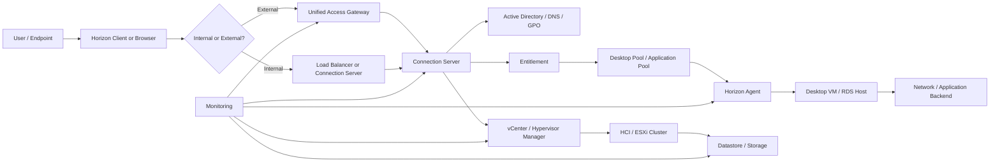
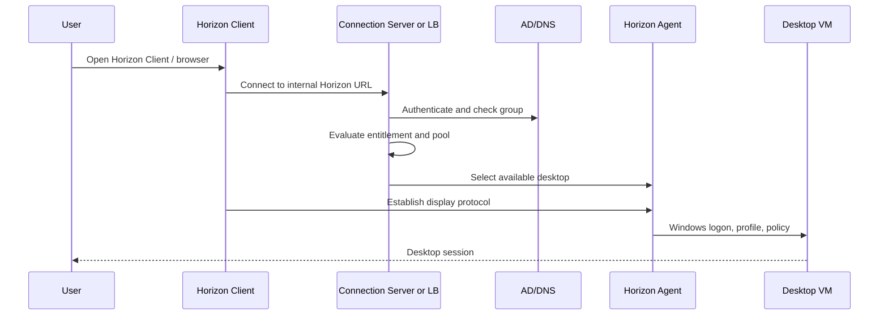
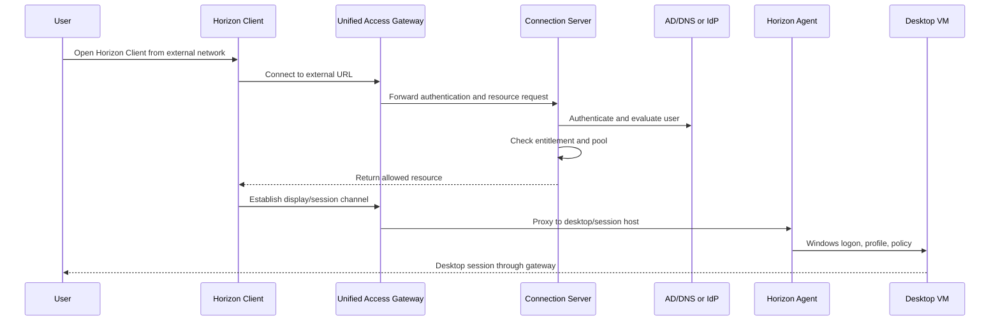

# Omnissa Horizon Architecture Overview

## 0. Document Control

| Trường | Giá trị |
|---|---|
| Thứ tự | 3 |
| Tên tài liệu | Omnissa Horizon Architecture Overview |
| Tên file | 3_Omnissa_Horizon_Architecture_Overview.md |
| Mục đích tài liệu | Giải thích kiến trúc Omnissa Horizon trên HCI, vai trò của Connection Server, Unified Access Gateway, Horizon Agent, desktop pool, entitlement, vCenter, storage và network. |
| Nguồn điều khiển | [[sources/vdi-training-idea]], [[sources/vdi-documentation-list-context]] |
| Trạng thái thông tin | Có tri thức kiến trúc nền tảng; topology, version, số lượng node, VIP, firewall path và thiết kế HA thật vẫn là Need Customer Confirmation. |

### 0.1 Source Grounding

| Nhóm tri thức | Nguồn sử dụng | Mức độ tin cậy | Ghi chú |
|---|---|---|---|
| Bối cảnh Horizon on HCI của khách hàng, quy mô 1500 đến hơn 2000 VDI, định hướng vận hành theo lớp | [[sources/vdi-training-idea]] | High | Nguồn điều khiển bối cảnh hệ thống Horizon trong bộ tài liệu. |
| Tên tài liệu, tên file, mục đích và phạm vi | [[sources/vdi-documentation-list-context]] | High | Source of truth cho scope tài liệu này. |
| Connection Server, Unified Access Gateway, pod/block, hypervisor manager, display protocol, authentication, True SSO | [[sources/horizon-8-architecture]] | High | Nguồn chính cho kiến trúc Horizon. |
| Primary protocol, secondary protocol, luồng internal/external, UAG, firewall, load balancing, certificate | [[sources/understand-and-troubleshoot-horizon-connections]] | High | Nguồn chính cho cách đọc luồng kết nối và troubleshooting Horizon connection. |
| ESXi, vCenter, datastore, VM lifecycle, virtual networking, snapshot | [[sources/vmware-vsphere-8-0]], [[sources/vcenter-server-installation-and-setup]] | High | Dùng để giải thích lớp hạ tầng bên dưới Horizon on HCI. |

### 0.2 In Scope

- Giải thích kiến trúc Omnissa Horizon ở mức system engineer cần để vận hành.
- Làm rõ vai trò của Connection Server, Unified Access Gateway, Horizon Agent, desktop pool, entitlement, vCenter, HCI, storage và network.
- Phân biệt access path nội bộ và bên ngoài.
- Giải thích vì sao authentication thành công chưa chắc desktop session đã hoạt động.
- Cung cấp cách đọc lỗi Horizon theo lớp, evidence cần lấy và khi nào cần escalation.

### 0.3 Out of Scope

- Không thay thế runbook cấu hình Horizon chi tiết.
- Không hướng dẫn triển khai mới Horizon, UAG, vCenter hoặc HCI.
- Không mô tả chi tiết Citrix CVAD; Citrix thuộc tài liệu riêng.
- Không giả định version, topology, hostname, VIP, IP, firewall rule, certificate, HA design, DR design hoặc owner khi chưa có dữ liệu khách hàng.
- Không yêu cầu secret, password, token hoặc credential.

## 1. Tài liệu này giúp engineer làm được gì

Tài liệu này giúp engineer đọc được kiến trúc Horizon như một nền tảng dịch vụ, không chỉ như một console quản trị desktop. Khi có ticket "không vào được Horizon", engineer cần biết lỗi có thể nằm ở endpoint, UAG, Connection Server, entitlement, Horizon Agent, desktop VM, vCenter, HCI, storage, network, AD/DNS hoặc display protocol.

Sau khi học xong, engineer cần làm được:

1. Mô tả được thành phần chính của Omnissa Horizon on HCI.
2. Phân biệt vai trò của Connection Server, Unified Access Gateway và Horizon Agent.
3. Giải thích desktop pool và entitlement trong luồng cấp desktop/application.
4. Mô tả luồng truy cập nội bộ và bên ngoài ở mức vận hành.
5. Hiểu vai trò của vCenter/HCI, storage và network đối với desktop availability và user experience.
6. Biết kiểm tra lỗi Horizon theo từng lớp và lưu evidence phù hợp.

## 2. Horizon trong bối cảnh khách hàng

Theo [[sources/vdi-training-idea]], khách hàng có một hệ thống VDI nền tảng Omnissa Horizon, trước đây là VMware Horizon, chạy trên hạ tầng HCI, quy mô khoảng 1500 đến hơn 2000 VDI.

Với quy mô này, Horizon phải được nhìn như một platform gồm nhiều lớp:

- User access: Horizon Client hoặc browser.
- Gateway: Unified Access Gateway nếu user truy cập từ ngoài hoặc theo thiết kế bảo mật.
- Broker/control plane: Horizon Connection Server.
- Resource layer: desktop pool hoặc application pool.
- Session layer: desktop VM hoặc RDS host có Horizon Agent.
- Identity layer: Active Directory, Domain Controller, DNS, Group Policy.
- Infrastructure layer: HCI, ESXi, vCenter, datastore, virtual network.
- Operation layer: monitoring, alerting, incident, change, support.

Điểm quan trọng: tài liệu hiện có cho biết Horizon chạy trên HCI, nhưng chưa có topology thật. Vì vậy mọi chi tiết như số lượng UAG, Connection Server, pod, block, load balancer, vCenter, cluster, datastore, protocol path và HA design đều phải xác nhận với khách hàng.

## 3. Kiến trúc Horizon ở mức dễ hiểu

Sơ đồ trên là mô hình đào tạo. Nó không phải topology thật của khách hàng.

Một phiên Horizon thành công thường cần các điều kiện sau:

1. User mở được Horizon Client hoặc portal.
2. User đến đúng URL hoặc gateway.
3. Certificate, DNS, load balancer và firewall path hoạt động.
4. User xác thực thành công với identity system.
5. Connection Server kiểm tra entitlement.
6. Desktop pool hoặc application pool có resource available.
7. Horizon Agent trong desktop/RDS host đăng ký và sẵn sàng nhận session.
8. Display protocol thiết lập được giữa client/gateway và desktop.
9. VM chạy ổn trên HCI/vCenter/datastore/network.

Nếu bất kỳ điều kiện nào thất bại, user có thể báo chung là "không vào được Horizon", nhưng root cause có thể nằm ở nhiều lớp khác nhau.

## 4. Thành phần chính và vai trò

| Thành phần | Vai trò trong Horizon | Phụ thuộc vào | Triệu chứng khi lỗi | Engineer cần kiểm tra | Evidence cần lưu |
|---|---|---|---|---|---|
| Horizon Client / Browser | Điểm user dùng để truy cập desktop/app | Client version, endpoint network, DNS, certificate trust | Không mở portal, lỗi certificate, launch fail cục bộ | Client type/version, URL, internal/external, screenshot | Screenshot lỗi, timestamp, endpoint, user location |
| Unified Access Gateway | Gateway bảo vệ truy cập ngoài và proxy luồng cần thiết vào Horizon | DNS, certificate, firewall, load balancer, Connection Server, desktop path | External-only issue, login được nhưng launch fail, timeout, black screen | UAG health, cert, LB member, external URL, firewall path | UAG log/status, cert info, LB status, user sample |
| Connection Server | Broker/control plane: authentication, entitlement, resource brokering | AD/DNS, Horizon config, vCenter, pool, agent communication, load balancer | Không login, không thấy resource, failed launch, broker errors | Service health, event/log, entitlement, pool status, vCenter connection | Broker log, event ID, dashboard, failed session |
| Desktop Pool | Nhóm desktop được cấp cho user | Image, vCenter, VM availability, Horizon Agent, entitlement | Pool unavailable, thiếu desktop, nhiều máy unregistered | Pool state, machine count, available/connected/unregistered | Pool dashboard, machine list, trend |
| Entitlement | Quyền user/group được dùng pool hoặc app | AD group, Horizon config, approval process | User login được nhưng không thấy desktop/app | User group, entitlement mapping, recent access change | User/group evidence, entitlement screenshot |
| Horizon Agent | Agent trong desktop/RDS host để máy đăng ký và nhận session | DNS, domain, broker reachability, service, firewall, image | Agent unreachable/unregistered, launch fail | Agent service, registration state, logs, broker list, VM network | Agent log, registration status, VM state |
| vCenter / Hypervisor Manager | Quản lý VM, host, cluster, datastore, snapshot, lifecycle | vCenter service, permissions, DNS/NTP, ESXi/HCI, storage/network | Không power on VM, provisioning lỗi, pool không refresh, task fail | vCenter connection, tasks/events, cluster health, permissions | vCenter task/event, cluster/datastore metrics |
| HCI / ESXi Cluster | Chạy desktop VM và hạ tầng liên quan | Host, CPU, memory, HA/DRS nếu có, datastore, network | Nhiều desktop chậm, host down, VM inaccessible | Host health, resource contention, maintenance state | Host metrics, alert, VM placement |
| Storage / Datastore | Lưu VM disk, image, snapshot, có thể profile tùy thiết kế | Capacity, latency, IOPS, storage path, snapshot growth | Login chậm, boot storm, VM stun, datastore full | Capacity, latency, IOPS, snapshot, storage alert | Storage dashboard, datastore chart |
| Network | Nối endpoint, UAG, Connection Server, Agent, AD, vCenter, backend app | DNS, firewall, routing, VLAN, LB, certificate | Timeout, disconnect, black screen, unregistered | Path theo từng đoạn, DNS, packet loss, firewall rule | Trace/test result, firewall/LB evidence |

## 5. Connection Server: broker và control plane

Connection Server là trung tâm điều phối của Horizon. Nó không phải nơi chạy desktop của user, nhưng là nơi quyết định user có được vào resource nào và đi tới desktop nào.

Các vai trò chính:

- Nhận request từ Horizon Client, browser hoặc UAG.
- Tích hợp với Active Directory để xác thực và lấy thông tin user/group.
- Kiểm tra entitlement để biết user được phép dùng pool nào.
- Điều phối desktop hoặc application session.
- Giao tiếp với vCenter/hypervisor manager để biết trạng thái và vòng đời desktop VM.
- Giao tiếp với Horizon Agent để biết desktop/RDS host có sẵn sàng nhận session không.

Trong môi trường lớn, Connection Server thường cần load balancing và nhiều node để tránh single point of failure. Tuy nhiên số lượng node, kiểu load balancing, affinity, certificate và health check là thông tin phải xác nhận với khách hàng.

### 5.1 Khi nào nghi ngờ Connection Server

| Dấu hiệu | Cách nghĩ |
|---|---|
| Nhiều user không login được vào Horizon portal | Có thể là Connection Server, AD/DNS, certificate, load balancer hoặc UAG tùy path |
| User login được nhưng resource list rỗng | Có thể entitlement, AD group, pool state hoặc broker config |
| Nhiều launch fail không phụ thuộc một desktop cụ thể | Cần kiểm tra broker event, pool, agent registration và vCenter connection |
| Console hoặc dashboard báo pool/machine state bất thường | Cần xem Connection Server event/log và dependency với vCenter/Agent |

### 5.2 Evidence nên lấy

- User sample, timestamp, internal/external path.
- Connection Server health và service state.
- Horizon event hoặc log liên quan user/session.
- Entitlement mapping.
- Pool state và machine state.
- vCenter connection status nếu liên quan provisioning/VM lifecycle.
- Recent change: patch, cert, UAG, load balancer, AD/GPO, image.

## 6. Unified Access Gateway: lớp truy cập bên ngoài

Unified Access Gateway, viết tắt UAG, là gateway bảo vệ truy cập từ bên ngoài hoặc vùng mạng không tin cậy vào Horizon. UAG thường nằm ở vùng biên mạng hoặc DMZ, nhận kết nối từ client bên ngoài rồi chuyển tiếp tới Connection Server và desktop/session host theo thiết kế.

UAG quan trọng vì user bên ngoài thường không đi cùng đường với user nội bộ. Một lỗi UAG, certificate, load balancer, NAT hoặc firewall có thể làm external user lỗi trong khi internal user vẫn bình thường.

### 6.1 UAG không phải Connection Server

| Nội dung | Unified Access Gateway | Connection Server |
|---|---|---|
| Vị trí logic | Lớp gateway/truy cập biên | Lớp broker/control plane |
| Vai trò chính | Bảo vệ và proxy access path | Authentication, entitlement, brokering |
| Lỗi điển hình | External-only timeout, cert error, display protocol fail | Không thấy resource, broker/auth/session event |
| Evidence chính | UAG log, cert, LB, firewall/NAT, external URL | Connection Server log, entitlement, pool state |

### 6.2 Primary protocol và secondary protocol

Theo [[sources/understand-and-troubleshoot-horizon-connections]], một phiên Horizon cần tách đường đi xác thực và đường đi hiển thị. Nói đơn giản:

- Primary protocol: phần user kết nối tới portal/broker để xác thực, lấy resource, chọn desktop/app.
- Secondary protocol hoặc display protocol: phần client thiết lập phiên hiển thị tới desktop/RDS host, có thể trực tiếp hoặc qua UAG.

Vì vậy có tình huống rất phổ biến:

1. User mở portal được.
2. User login thành công.
3. User thấy desktop.
4. User click desktop.
5. Session timeout, màn hình đen hoặc không connect.

Nếu nhìn nông, người mới sẽ nghĩ "Horizon login được nên broker ổn, desktop lỗi". Nhưng kiến trúc cho thấy lỗi có thể nằm ở UAG, firewall, NAT, certificate, external URL, display protocol hoặc Agent.

## 7. Horizon Agent và desktop/session layer

Horizon Agent là thành phần trong desktop VM, RDS host hoặc máy đích để Horizon quản lý và cung cấp session. Nếu Connection Server là người điều phối, Horizon Agent là người nhận việc ở phía desktop/session host.

Horizon Agent cần:

- Máy join domain đúng nếu thiết kế yêu cầu.
- DNS và time sync ổn.
- Kết nối được tới Connection Server theo thiết kế.
- Service chạy đúng.
- Không bị firewall hoặc security tool chặn.
- Version tương thích với Horizon platform.
- Image không bị lỗi sau patch/update.

### 7.1 Agent registration

Registration là trạng thái máy có Agent đăng ký thành công với Horizon hay không. Với engineer vận hành, đây là một chỉ số cực kỳ quan trọng.

| Trạng thái | Ý nghĩa vận hành |
|---|---|
| Registered/Available | Máy có thể được broker cân nhắc cấp session nếu pool policy cho phép |
| Unregistered/Agent unreachable | Broker không thể cấp session tới máy hoặc máy bị loại khỏi pool khả dụng |
| Connected | Đang có user session |
| Disconnected | Session còn tồn tại nhưng user đã mất kết nối hoặc đóng client |
| Error/Maintenance | Máy có trạng thái cần kiểm tra riêng |

Tên trạng thái cụ thể có thể khác theo version hoặc console; cần xác nhận với môi trường thật.

### 7.2 Khi nhiều Agent unregistered

Nếu một desktop unregistered, có thể là lỗi đơn lẻ. Nếu nhiều desktop trong cùng pool unregistered, cần nghĩ tới:

- Recent image update.
- Agent version hoặc service lỗi.
- DNS/AD/GPO change.
- Firewall hoặc network path tới Connection Server.
- vCenter/HCI/VM power issue.
- Datastore hoặc cluster issue.
- Certificate hoặc trust issue tùy thiết kế.

Không nên reboot hàng loạt trước khi lấy evidence, vì có thể mất log hoặc làm tăng impact.

## 8. Desktop pool và entitlement

Desktop pool là nhóm desktop hoặc session resource được Horizon cung cấp cho user. Entitlement là quyền gán user hoặc group được truy cập pool/application nào.

### 8.1 Desktop pool trả lời câu hỏi gì

- Pool này phục vụ nhóm user nào?
- Pool là persistent hay non-persistent?
- Pool dùng image/snapshot nào?
- Pool có bao nhiêu máy total, available, connected, disconnected, unregistered?
- Pool chạy trên cluster/datastore nào?
- Pool có maintenance hoặc provisioning task đang chạy không?

### 8.2 Entitlement trả lời câu hỏi gì

- User hoặc AD group nào được thấy pool này?
- Quyền được cấp trực tiếp cho user hay qua group?
- Có thay đổi group gần đây không?
- Có approval cho việc cấp quyền không?
- User đã sync/refresh group membership chưa?

### 8.3 Triệu chứng liên quan

| Triệu chứng | Khả năng liên quan |
|---|---|
| User login được nhưng không thấy desktop | Entitlement, AD group, pool disabled, pool không available |
| Chỉ một nhóm user không thấy pool | AD group hoặc entitlement mapping |
| Nhiều user thấy pool nhưng launch fail | Agent, display protocol, VM state, UAG/firewall, pool capacity |
| Pool hết desktop available | Capacity, provisioning, stuck machines, power policy |

## 9. vCenter, HCI, storage và network trong kiến trúc Horizon

Horizon trên HCI không thể vận hành tách rời khỏi hạ tầng bên dưới. Horizon có thể là nơi user nhìn thấy lỗi, nhưng root cause có thể nằm ở vCenter, HCI, datastore hoặc network.

### 9.1 vCenter và HCI

Theo [[sources/vmware-vsphere-8-0]] và [[sources/vcenter-server-installation-and-setup]], vSphere/vCenter là lớp quản trị VM, host, datastore, network, snapshot và lifecycle. Trong bối cảnh Horizon, vCenter thường là hypervisor manager giúp Horizon quản lý desktop VM, template, snapshot và trạng thái máy.

Engineer cần biết:

- Horizon tích hợp với vCenter nào.
- Desktop pool chạy trên cluster/datastore nào.
- vCenter connection từ Connection Server có healthy không.
- Host hoặc cluster có maintenance, HA event, resource contention không.
- VM power task, clone task, snapshot task có lỗi không.
- Quyền tài khoản tích hợp Horizon-vCenter có bị thay đổi không.

### 9.2 Storage

Storage ảnh hưởng trực tiếp tới:

- VM boot.
- Desktop availability.
- Snapshot/image operation.
- Clone/provisioning.
- User profile nếu profile nằm trên storage liên quan.
- Login duration và session responsiveness.

Các dấu hiệu cần chú ý:

- Datastore capacity cao.
- Storage latency tăng.
- Snapshot tồn đọng hoặc tăng bất thường.
- Nhiều VM bị stun hoặc task chậm.
- Login chậm theo khung giờ cao điểm.
- Boot storm hoặc logon storm.

### 9.3 Network

Network trong Horizon có nhiều đoạn:

1. Client tới UAG hoặc Connection Server.
2. UAG tới Connection Server.
3. Client/UAG tới Horizon Agent cho display protocol.
4. Connection Server tới AD/DNS.
5. Connection Server tới vCenter.
6. Desktop VM tới AD/DNS/profile/app backend.
7. Monitoring tới UAG, Connection Server, VM, HCI.

Khi troubleshooting, hãy xác định lỗi nằm ở đoạn nào thay vì chỉ nói "network issue".

## 10. Luồng truy cập nội bộ và bên ngoài

### 10.1 Luồng user nội bộ

Điểm cần kiểm tra khi internal user lỗi:

- Internal DNS và URL.
- Connection Server hoặc load balancer.
- AD/DNS/GPO.
- Entitlement.
- Desktop pool availability.
- Horizon Agent registration.
- Direct display protocol path nếu thiết kế cho phép client vào desktop trực tiếp.
- vCenter/HCI/datastore nếu nhiều desktop bị ảnh hưởng.

### 10.2 Luồng user bên ngoài

Điểm cần kiểm tra khi external user lỗi:

- External DNS.
- Public certificate và trust chain.
- UAG health.
- Load balancer member state.
- Firewall/NAT từ client tới UAG.
- UAG tới Connection Server.
- UAG tới desktop/session host cho display protocol.
- External URL hoặc tunnel/protocol configuration.
- So sánh internal test cùng user/resource.

## 11. Monitoring và chỉ số cần quan sát

| Nhóm chỉ số | Vì sao cần theo dõi | Ví dụ evidence |
|---|---|---|
| Connection Server health | Broker lỗi có thể ảnh hưởng nhiều user | Service status, event log, dashboard health |
| UAG health | External access phụ thuộc gateway | UAG status, certificate, LB member, connection count |
| Pool availability | Cho biết resource có đủ để cấp session không | Total/available/connected/unregistered machines |
| Agent registration | Chỉ báo desktop có sẵn sàng nhận session không | Registered/unregistered trend |
| Failed session / failed launch | Phát hiện lỗi access hoặc broker/session | Failed session dashboard, event timestamp |
| Login duration | Phát hiện profile, GPO, storage, DC issue | Login time sample, logon breakdown nếu có |
| vCenter/HCI health | Desktop VM phụ thuộc host/cluster | Host CPU/memory, HA events, VM task failures |
| Storage capacity/latency | Tác động lớn tới boot/logon/session | Datastore capacity, latency, IOPS |
| Network latency/packet loss | Tác động tới display protocol và disconnect | Network test, LB/firewall log |
| Certificate/license | Lỗi hết hạn hoặc license có thể gây outage | Expiry date, warning/alert |

Monitoring thật của khách hàng là Unknown. Cần xác nhận tool, dashboard, threshold và owner.

## 12. Lỗi Horizon thường gặp và hướng chẩn đoán

| Triệu chứng | Nguyên nhân có thể | Lớp cần kiểm tra | Evidence cần thu thập | Hướng chẩn đoán | Khi nào escalation |
|---|---|---|---|---|---|
| User không mở được Horizon URL | DNS, certificate, LB, UAG/Connection Server unreachable | User access, Gateway, Network | URL, screenshot, internal/external, cert, DNS result | Tách internal/external; kiểm tra DNS/LB/cert/gateway | Nhiều user hoặc lỗi gateway/LB/cert/firewall |
| Login fail | AD account, DC/DNS, MFA/IdP nếu có, Connection Server auth | Identity, Broker, Gateway | User, timestamp, auth log, broker/UAG log | Kiểm tra account/group/DC/DNS/time sync và broker auth event | Nhiều user hoặc cần identity/security owner |
| Login được nhưng không thấy desktop | Entitlement, AD group, pool disabled, pool không có machine | Broker, Entitlement, Pool | User group, entitlement, pool state | Kiểm tra entitlement mapping và pool availability | Cần thay đổi quyền hoặc ảnh hưởng nhóm user |
| Thấy desktop nhưng launch fail | Agent unregistered, VM off, display protocol path, UAG/firewall | Agent, Pool, vCenter, Network | Failed launch, Agent state, VM state, UAG log | Kiểm tra Agent registration, VM power, internal/external path | Nhiều máy/pool hoặc nghi network/HCI |
| External user launch fail, internal bình thường | UAG, external URL, cert, firewall, secondary protocol | Gateway, Network, Display protocol | External sample, internal sample, UAG log, cert/LB state | So sánh path; kiểm tra UAG tới CS và UAG tới Agent | External-wide hoặc cần network/security |
| Nhiều desktop unregistered | Image/Agent update, DNS/GPO, firewall, broker connectivity, HCI | Agent, Image, Identity, Network, HCI | Registration trend, image version, Agent log, recent change | Tìm điểm chung theo pool/image/cluster/change | Ảnh hưởng nhiều desktop hoặc cần rollback |
| Black screen | Display protocol, Agent, driver/tools, profile/logon hang, network | Protocol, Agent, VM, Profile, Network | Session log, Agent log, VM metrics, network latency | Tách login completed hay kẹt display/logon; so sánh internal/external | Nhiều user hoặc sau image/driver change |
| Login chậm | GPO, profile, storage latency, DC latency, logon storm | Identity, Profile, Storage, HCI | Login duration, GPO/profile log, storage/DC metrics | Correlate theo timestamp và scope | Vượt SLA hoặc ảnh hưởng nhiều user |
| Pool provisioning lỗi | vCenter connection, permissions, datastore, snapshot/image | vCenter, HCI, Storage, Image | vCenter task, Horizon event, datastore status | Kiểm tra vCenter integration, task/event, storage capacity | Cần vCenter/storage/platform owner |

## 13. Operational checklist cho Horizon engineer

### Khi nhận ticket Horizon

- [ ] Xác nhận user dùng Horizon, không nhầm với Citrix.
- [ ] Xác nhận user dùng Horizon Client hay browser.
- [ ] Xác nhận internal hay external access.
- [ ] Xác nhận lỗi ở bước nào: mở URL, login, thấy desktop, launch, black screen, chậm, disconnect.
- [ ] Ghi timestamp, screenshot, user, endpoint, network location.
- [ ] Kiểm tra recent change: certificate, UAG, Connection Server, image, Agent, GPO, firewall, storage, HCI.

### Kiểm tra theo lớp

- [ ] Client/URL/DNS.
- [ ] UAG nếu external hoặc thiết kế có gateway.
- [ ] Load balancer và certificate nếu có.
- [ ] Connection Server health và event.
- [ ] AD/DNS/GPO và user group.
- [ ] Entitlement.
- [ ] Desktop pool state.
- [ ] Horizon Agent registration.
- [ ] VM power state và vCenter task/event.
- [ ] HCI host, datastore, storage latency.
- [ ] Network path cho display protocol.

### Evidence cần lưu

- [ ] Ticket ID và impact scope.
- [ ] User sample và thời điểm lỗi.
- [ ] Internal/external path.
- [ ] Screenshot lỗi.
- [ ] Connection Server event/log.
- [ ] UAG log/status nếu external.
- [ ] Pool/machine/Agent registration state.
- [ ] vCenter task/event nếu liên quan VM/provisioning.
- [ ] Storage/network metrics nếu có dấu hiệu performance.
- [ ] Recent change ID nếu có.

## 14. Tình huống học tập

### Tình huống 1: User bên ngoài login được nhưng desktop timeout

**Bối cảnh:** User ở ngoài công ty mở Horizon Client, login thành công, thấy desktop pool, nhưng click vào desktop thì timeout.

**Câu hỏi cho học viên:**

- Authentication đã thành công chưa?
- Lớp nào còn có thể lỗi sau authentication?
- Evidence nào chứng minh lỗi nằm ở UAG hoặc display protocol path?

**Gợi ý phân tích:**

Login và resource list thành công cho thấy primary path đến Connection Server có thể hoạt động. Lỗi xuất hiện khi thiết lập session, nên cần kiểm tra secondary/display protocol, UAG, firewall, NAT, certificate, Agent và desktop reachability.

**Hướng xử lý đề xuất:**

1. Test cùng user/resource từ internal nếu có thể.
2. Kiểm tra UAG health, certificate, LB member.
3. Kiểm tra failed session trên Connection Server.
4. Kiểm tra Agent registration và VM state.
5. Kiểm tra firewall/path từ UAG tới desktop/session host.

**Evidence cần lưu:** external URL, timestamp, user, desktop pool, UAG log, broker event, Agent state, internal comparison.

### Tình huống 2: Một desktop pool có nhiều máy unregistered sau maintenance

**Bối cảnh:** Sau image update hoặc maintenance window, 40% máy trong một desktop pool unregistered.

**Câu hỏi cho học viên:**

- Vì sao không nên reboot toàn bộ pool ngay?
- Những điểm chung nào cần kiểm tra?
- Khi nào cần dừng rollout hoặc rollback?

**Gợi ý phân tích:**

Lỗi cùng pool sau maintenance thường gợi ý recent change: image, Agent version, GPO, DNS, firewall hoặc cluster/storage. Reboot hàng loạt có thể làm mất evidence.

**Hướng xử lý đề xuất:**

1. Xác nhận change ID và image/snapshot mới.
2. So sánh máy registered và unregistered.
3. Kiểm tra Agent service/log trên máy mẫu.
4. Kiểm tra DNS/time sync/domain/GPO.
5. Kiểm tra vCenter task, VM power, cluster/datastore.
6. Dừng rollout nếu lỗi đang lan rộng; rollback theo quy trình nếu image là điểm chung.

**Evidence cần lưu:** registration trend, image version, Agent log, vCenter event, danh sách máy lỗi, change record.

### Tình huống 3: User không thấy desktop pool sau khi chuyển phòng ban

**Bối cảnh:** User đổi team, sau đó login Horizon nhưng không thấy desktop pool cũ hoặc pool mới.

**Câu hỏi cho học viên:**

- Lỗi này có khả năng ở UAG không?
- Kiểm tra entitlement như thế nào?
- Cần approval gì nếu phải thay đổi quyền?

**Gợi ý phân tích:**

Nếu user login được nhưng không thấy resource, khả năng cao nằm ở entitlement, AD group hoặc pool visibility. Không nên kiểm tra VM trước.

**Hướng xử lý đề xuất:**

1. Xác nhận user/group hiện tại.
2. Kiểm tra entitlement pool.
3. Kiểm tra approval hoặc request cấp quyền.
4. Nếu group mới cập nhật, xác nhận replication/token refresh theo quy trình.

**Evidence cần lưu:** user group membership, entitlement screenshot, pool name, approval/change request.

### Tình huống 4: Nhiều desktop chậm trong cùng HCI cluster

**Bối cảnh:** User thuộc nhiều pool khác nhau báo desktop chậm; dashboard Horizon không báo broker down.

**Câu hỏi cho học viên:**

- Nếu nhiều pool cùng chậm, lớp nào cần nghĩ tới?
- Metric nào ở vCenter/HCI/storage cần lấy?
- Làm sao phân biệt broker issue và infrastructure issue?

**Gợi ý phân tích:**

Nhiều pool cùng chậm có thể do hạ tầng chung: host contention, datastore latency, storage path, network hoặc logon storm. Broker không down không có nghĩa platform khỏe.

**Hướng xử lý đề xuất:**

1. Xác định VM placement theo host/cluster/datastore.
2. Kiểm tra host CPU/memory ready/usage theo metric sẵn có.
3. Kiểm tra datastore latency/capacity.
4. Kiểm tra network packet loss/latency.
5. So sánh pool nằm cùng cluster và pool nằm cluster khác nếu có.

**Evidence cần lưu:** user sample, pool, VM-host mapping, host/storage metrics, timeframe, monitoring alert.

## 15. Bài tập tư duy

### Bài tập 1: Vẽ luồng external Horizon

Hãy vẽ lại luồng user external vào Horizon, gồm Horizon Client, UAG, Connection Server, AD/DNS, desktop pool, Horizon Agent, vCenter/HCI, storage và network. Đánh dấu điểm nào thuộc primary protocol và điểm nào thuộc display/session path.

### Bài tập 2: Tạo bảng dependency cho một desktop pool

Tạo bảng với các cột:

- Desktop pool name.
- Entitled AD group.
- Image/snapshot.
- Cluster/datastore.
- Connection Server/UAG path.
- Agent version.
- Monitoring dashboard.
- Owner.
- Unknown cần hỏi.

### Bài tập 3: Phân loại lỗi theo lớp

Phân loại các triệu chứng sau:

| Triệu chứng | Lớp ưu tiên |
|---|---|
| External user báo certificate warning | UAG/certificate/gateway |
| User login được nhưng không thấy desktop | Entitlement/pool/AD group |
| Một pool có nhiều unregistered machine | Agent/image/DNS/GPO/network/HCI |
| Desktop launch được nhưng màn hình đen | Display protocol/Agent/profile/network |
| Provisioning task fail | vCenter/HCI/storage/image |

### Bài tập 4: Evidence trước escalation

Bạn cần escalation lỗi "Horizon external launch fail" sang network/security. Hãy chuẩn bị evidence gồm: user sample, timestamp, internal/external comparison, UAG log, Connection Server event, desktop pool, Agent state, certificate/LB status và firewall path nghi vấn.

## 16. Knowledge Check

### Câu 1

**Connection Server trong Horizon làm gì?**

**Đáp án:** Connection Server là broker/control plane, xử lý authentication, entitlement, resource brokering và điều phối kết nối tới desktop/application phù hợp.

### Câu 2

**Unified Access Gateway khác Connection Server như thế nào?**

**Đáp án:** UAG là gateway bảo vệ và proxy access path, đặc biệt cho external user. Connection Server là broker kiểm tra user/resource và điều phối session.

### Câu 3

**Vì sao user login thành công nhưng vẫn launch desktop thất bại?**

**Đáp án:** Vì authentication/resource list chỉ chứng minh primary path hoạt động. Display/secondary protocol, UAG, firewall, Agent hoặc desktop VM vẫn có thể lỗi.

### Câu 4

**Horizon Agent unregistered ảnh hưởng gì?**

**Đáp án:** Desktop hoặc session host không sẵn sàng nhận session từ broker; user có thể launch fail hoặc pool thiếu máy available.

### Câu 5

**User không thấy desktop pool thì nên kiểm tra gì trước?**

**Đáp án:** AD group, entitlement, pool state, user mapping và approval cấp quyền; chưa nên kiểm tra VM trước nếu user không thấy resource.

### Câu 6

**External-only issue trong Horizon thường gợi ý lớp nào?**

**Đáp án:** UAG, external DNS, certificate, load balancer, firewall/NAT hoặc external display protocol path.

### Câu 7

**vCenter quan trọng thế nào với Horizon on HCI?**

**Đáp án:** vCenter/hypervisor manager giúp quản lý VM, host, datastore, snapshot, power state, clone/provisioning và là dependency quan trọng của desktop pool.

### Câu 8

**Nếu nhiều desktop cùng pool unregistered sau image update, giả thuyết nào cần ưu tiên?**

**Đáp án:** Image/Agent version, GPO/DNS, firewall, broker communication hoặc cluster/datastore liên quan đến pool; cần kiểm tra recent change trước.

### Câu 9

**Monitoring Horizon cần nhìn những nhóm metric nào?**

**Đáp án:** Connection Server health, UAG health, pool availability, Agent registration, failed session, login duration, vCenter/HCI health, storage latency/capacity và network quality.

### Câu 10

**Thông tin nào cần xác nhận trước khi viết SOP Horizon chi tiết?**

**Đáp án:** Version, topology, số UAG/Connection Server, load balancer, access flow, pod/block, vCenter/HCI mapping, storage design, firewall path, monitoring tool, HA/DR, owner và escalation path.

## 17. Hiểu nhầm thường gặp

| Hiểu nhầm | Vì sao sai | Cách nghĩ đúng |
|---|---|---|
| "Connection Server down thì mọi lỗi Horizon đều do nó" | Nhiều lỗi nằm ở UAG, Agent, entitlement, vCenter, storage, network hoặc AD. | Connection Server là một lớp; phải kiểm tra theo symptom và path. |
| "Login được nghĩa là UAG không có vấn đề" | UAG/display protocol path vẫn có thể lỗi sau authentication. | Tách primary path và secondary/display path. |
| "Unregistered desktop chỉ cần reboot" | Có thể do image, DNS, GPO, firewall, Agent version hoặc vCenter/HCI. | Lấy evidence và tìm điểm chung trước khi reboot hàng loạt. |
| "Không thấy desktop là do desktop VM tắt" | Thường liên quan entitlement, AD group hoặc pool state. | Kiểm tra quyền và pool trước khi kiểm tra VM. |
| "Horizon console xanh là user experience ổn" | Storage latency, profile, network hoặc app backend vẫn có thể làm user chậm. | Correlate Horizon với hạ tầng và monitoring. |
| "vCenter chỉ cần khi tạo VM" | vCenter ảnh hưởng power, clone, snapshot, task, placement và visibility của desktop VM. | Xem vCenter/HCI là dependency vận hành hằng ngày. |

## 18. Need Customer Confirmation

| Nhóm | Câu hỏi cần xác nhận | Vì sao cần |
|---|---|---|
| Version | Horizon, UAG, Horizon Agent, vCenter, ESXi/HCI version là gì? | Xác định compatibility, known issues và đúng tài liệu vendor. |
| Topology | Có bao nhiêu pod, block, Connection Server, UAG, site/datacenter? | Hiểu HA, scope impact và troubleshooting path. |
| Access flow | Internal user đi trực tiếp Connection Server hay qua gateway nội bộ? External user đi qua UAG nào? | Triage lỗi internal/external và display protocol. |
| Load balancer | LB nằm trước UAG, Connection Server hay cả hai? Health check và affinity thế nào? | Xử lý lỗi không ổn định, member lỗi, session persistence. |
| Certificate | Certificate dùng cho UAG/Connection Server/LB, owner và expiry là gì? | Tránh outage do certificate. |
| Identity | Horizon tích hợp AD/IdP/MFA/True SSO thế nào? | Xử lý login và authentication issue. |
| Entitlement | Mapping AD group với desktop/application pool ra sao? | Xử lý user không thấy resource. |
| Pool design | Pool persistent/non-persistent, instant clone/full clone, image/snapshot mapping? | Xử lý pool availability, image issue và capacity. |
| Agent | Horizon Agent version và update process ra sao? | Xử lý unregistered, black screen, launch issue. |
| vCenter/HCI | Horizon kết nối vCenter nào, cluster/datastore nào cho từng pool? | Xử lý VM lifecycle, host/storage issue. |
| Storage | Datastore, image storage, profile storage, latency baseline là gì? | Xử lý boot/logon storm, performance và capacity. |
| Network | Firewall path cho client-UAG, UAG-CS, UAG-Agent, CS-Agent, CS-vCenter là gì? | Xử lý timeout và display protocol failure. |
| Monitoring | Tool nào theo dõi Horizon, UAG, pool, Agent, vCenter, storage, network? | Health check và alert triage. |
| HA/DR | UAG/Connection Server/vCenter/HCI có HA/DR thế nào? | Xử lý outage và failover. |
| Ownership | Ai sở hữu Horizon, UAG, vCenter, HCI, storage, network, AD, certificate? | Escalation đúng nhóm. |
| Change | Quy trình thay đổi image, Agent, UAG, Connection Server, cert, firewall là gì? | Giảm rủi ro impact diện rộng. |

## 19. Related Wiki Links

### Source pages

- [[sources/vdi-training-idea]]
- [[sources/vdi-documentation-list-context]]
- [[sources/horizon-8-architecture]]
- [[sources/understand-and-troubleshoot-horizon-connections]]
- [[sources/vmware-vsphere-8-0]]
- [[sources/vcenter-server-installation-and-setup]]

### Concept pages

- [[concepts/omnissa-horizon]]
- [[concepts/connection-server]]
- [[concepts/unified-access-gateway]]
- [[concepts/pod-and-block]]
- [[concepts/cloud-pod-architecture]]
- [[concepts/display-protocol]]
- [[concepts/primary-and-secondary-protocols]]
- [[concepts/blast-extreme]]
- [[concepts/load-balancing]]
- [[concepts/certificate-management]]
- [[concepts/firewall-ports]]
- [[concepts/vdi-connection-flow]]
- [[concepts/vmware-vsphere]]
- [[concepts/esxi]]
- [[concepts/vcenter-server]]
- [[concepts/datastore]]
- [[concepts/virtual-networking]]
- [[concepts/snapshot]]

### Topic pages nên đọc tiếp

- [[topics/1_VDI_Foundation_Overview]]: nắm nền tảng VDI trước khi đọc kiến trúc Horizon.
- [[topics/2_Customer_VDI_Landscape_Overview]]: đặt Horizon vào bức tranh hai hệ thống của khách hàng.
- [[topics/5_VDI_Access_Flow_Design]]: đi sâu vào access flow nội bộ và bên ngoài.
- [[topics/7_Hypervisor_and_HCI_Operations_Guide]]: hiểu lớp HCI/vCenter bên dưới Horizon.
- [[topics/8_Storage_Operations_for_VDI]]: hiểu storage impact với pool, image, profile và performance.
- [[topics/14_Omnissa_Desktop_Pool_and_Entitlement_Guide]]: đi sâu vào desktop pool và entitlement.
- [[topics/18_VDI_Troubleshooting_Playbook]]: dùng kiến trúc này để xử lý sự cố.

## 20. Summary for Learners

Omnissa Horizon on HCI là một nền tảng nhiều lớp. Connection Server là broker/control plane; Unified Access Gateway là gateway bảo vệ access path, đặc biệt cho user bên ngoài; Horizon Agent là thành phần trong desktop/session host để nhận session; desktop pool và entitlement quyết định user thấy gì; vCenter/HCI, storage và network quyết định desktop có chạy ổn và session có mượt không.

Điều engineer cần nhớ:

- Đừng gọi chung mọi lỗi là "Horizon lỗi"; hãy chỉ ra lớp lỗi.
- Tách user nội bộ và user bên ngoài.
- Tách authentication/resource list và display/session protocol.
- Khi user không thấy desktop, kiểm tra entitlement và pool.
- Khi user launch fail, kiểm tra Agent, VM state, UAG/display protocol path và vCenter/HCI.
- Khi nhiều desktop chậm hoặc unregistered, tìm điểm chung theo pool, image, cluster, datastore, network hoặc recent change.
- Luôn lưu evidence trước escalation hoặc thay đổi.

Thứ tự kiểm tra khuyến nghị: xác định internal/external, xác định bước lỗi, kiểm tra recent change, kiểm tra Connection Server/UAG theo path, kiểm tra entitlement/pool, kiểm tra Agent/VM, kiểm tra vCenter/HCI/storage/network, rồi escalation đúng owner.

