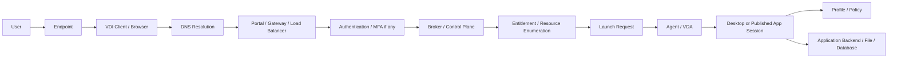
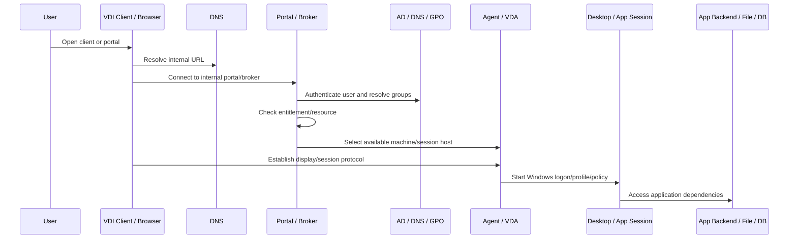
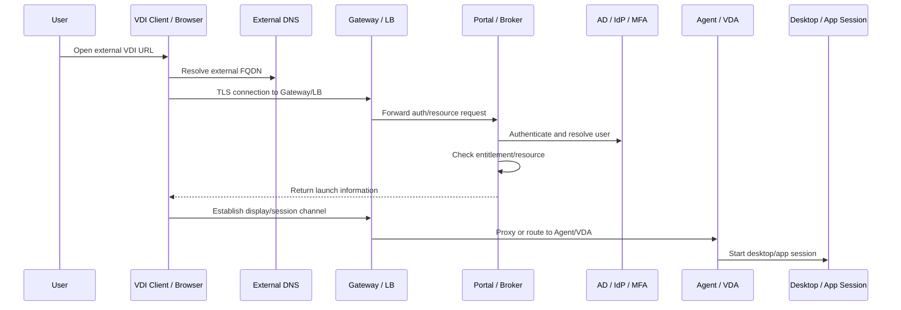

# VDI Access Flow Design

## 0. Document Control

| Trường | Giá trị |
|---|---|
| Thứ tự | 5 |
| Tên tài liệu | VDI Access Flow Design |
| Tên file | 5_VDI_Access_Flow_Design.md |
| Mục đích tài liệu | Mô tả luồng kết nối của người dùng nội bộ và người dùng bên ngoài vào hệ thống VDI, từ client đến gateway, broker, agent, desktop và application backend. |
| Nguồn điều khiển | [[sources/vdi-training-idea]], [[sources/vdi-documentation-list-context]] |
| Trạng thái thông tin | Có mô hình access flow đào tạo; URL, VIP, firewall rule, NAT, certificate, load balancer, protocol port và network path thật vẫn là Need Customer Confirmation. |

### 0.1 Source Grounding

| Nhóm tri thức | Nguồn sử dụng | Mức độ tin cậy | Ghi chú |
|---|---|---|---|
| Bối cảnh hai hệ thống VDI, quy mô lớn, yêu cầu nhìn theo lớp truy cập, broker, agent, network | [[sources/vdi-training-idea]] | High | Nguồn điều khiển cách nhìn access flow theo vận hành thực tế. |
| Tên tài liệu, tên file, mục đích và phạm vi | [[sources/vdi-documentation-list-context]] | High | Source of truth cho scope tài liệu này. |
| Horizon internal/external flow, Unified Access Gateway, primary/secondary protocol, certificate, firewall, load balancing | [[sources/understand-and-troubleshoot-horizon-connections]], [[sources/horizon-8-architecture]] | High | Dùng để giải thích nguyên tắc tách authentication/broker flow và display/session flow trong Horizon. |
| Citrix Workspace App, StoreFront, Citrix Gateway, Delivery Controller, VDA, HDX/ICA, virtual channel | [[sources/citrix-virtual-apps-and-desktops-7-2603]] | High | Dùng để giải thích access flow trong Citrix CVAD và luồng launch desktop/published application. |

### 0.2 In Scope

- Mô tả access flow của user nội bộ và user bên ngoài vào hệ thống VDI.
- Phân tách các giai đoạn: endpoint/client, DNS, gateway/portal, authentication, broker/resource enumeration, launch, display/session protocol, profile/policy, application backend.
- So sánh access flow của Omnissa Horizon và Citrix CVAD ở mức vận hành.
- Chỉ ra các điểm lỗi thường gặp trên từng đoạn flow: DNS, certificate, load balancer, firewall, gateway, broker, agent/VDA, profile, network, backend.
- Cung cấp checklist, bảng troubleshooting, scenario và knowledge check để engineer dùng khi triage lỗi truy cập.

### 0.3 Out of Scope

- Không thay thế tài liệu kiến trúc chi tiết Horizon hoặc Citrix CVAD.
- Không đưa số port, IP, URL, VIP, firewall rule hoặc certificate thật khi chưa được khách hàng xác nhận.
- Không thiết kế firewall policy hoặc load balancer configuration chi tiết.
- Không hướng dẫn bypass security, chia sẻ secret, password, token hoặc credential.
- Không mô tả chi tiết performance, storage, identity hoặc DR ngoài phạm vi liên quan trực tiếp tới access flow.

## 1. Tài liệu này giúp engineer làm được gì

Access flow là bản đồ đường đi của một phiên VDI. Khi user báo "không vào được VDI", câu đó chưa đủ để xử lý. User có thể đang lỗi ở nhiều giai đoạn khác nhau:

- Không mở được portal.
- Không login được.
- Login được nhưng không thấy desktop/app.
- Thấy resource nhưng launch fail.
- Launch được nhưng màn hình đen.
- Vào được desktop/app nhưng profile không load.
- Vào được desktop nhưng không truy cập được application backend.
- Đang dùng thì disconnect.

Sau khi học xong tài liệu này, engineer cần làm được:

1. Vẽ được luồng truy cập VDI nội bộ và bên ngoài.
2. Phân biệt authentication/broker flow với display/session flow.
3. Xác định điểm dừng của user trong access flow.
4. Biết lớp nào cần kiểm tra trước theo triệu chứng.
5. Chuẩn bị evidence để escalation network, security, identity, VDI platform hoặc application team.
6. Không nhầm lỗi gateway/broker/agent/network/backend với nhau.

## 2. Nguyên tắc cốt lõi: user journey khác network path

User thường mô tả theo trải nghiệm: "không vào được", "bị quay vòng", "màn hình đen", "app không mở". Engineer cần chuyển lời user thành access flow kỹ thuật.

Một phiên VDI có ít nhất 7 giai đoạn:

| Giai đoạn | Câu hỏi cần trả lời | Nếu lỗi thì thường thấy |
|---|---|---|
| 1. Endpoint và client | User dùng thiết bị nào, client nào, mạng nào? | Không mở được client, lỗi version, client crash |
| 2. DNS và portal reachability | URL có resolve và kết nối được không? | Không vào được portal, timeout, wrong site |
| 3. Gateway hoặc portal | Có đi qua UAG/Citrix Gateway/LB/cert không? | External-only issue, TLS/certificate warning |
| 4. Authentication | User xác thực được không? | Login fail, MFA fail, access denied |
| 5. Broker và resource enumeration | User có thấy desktop/app không? | Resource list rỗng, thiếu app/desktop |
| 6. Launch và session protocol | Client có mở được session tới Agent/VDA không? | Launch fail, timeout, black screen, reconnect loop |
| 7. Desktop/app runtime và backend | Session đã vào được nhưng workload có chạy không? | Profile lỗi, app backend không vào được, disconnect, chậm |

Sai lầm phổ biến là nhảy thẳng tới reboot VM khi user nói "không vào được". Nếu user chưa qua bước resource enumeration thì reboot VM không giải quyết gì. Nếu user vào desktop được nhưng app backend lỗi, broker/gateway có thể không phải root cause.

## 3. Mô hình access flow tổng quát

Mô hình này dùng cho cả Horizon và Citrix ở mức tư duy. Tên thành phần sẽ khác nhau:

| Lớp flow | Omnissa Horizon | Citrix CVAD |
|---|---|---|
| Client | Horizon Client hoặc browser | Citrix Workspace App hoặc browser |
| Gateway | Unified Access Gateway | Citrix Gateway |
| Portal/Broker | Connection Server | StoreFront + Delivery Controller |
| Resource mapping | Desktop/Application Pool, Entitlement | Store, Machine Catalog, Delivery Group, Application Group, Entitlement |
| Agent | Horizon Agent | VDA |
| Display/session protocol | Blast Extreme/RDP tùy thiết kế | HDX/ICA |
| Hypervisor dependency | vCenter/HCI/ESXi | XenServer hoặc VMware ESXi/vCenter |

## 4. Hai luồng phải tách riêng: login flow và session flow

Một điểm then chốt trong VDI access flow: user login được chưa có nghĩa session path hoạt động.

### 4.1 Login flow

Login flow gồm các bước:

1. Client mở URL hoặc gateway.
2. DNS resolve đúng.
3. Certificate được tin cậy.
4. Gateway/portal nhận kết nối.
5. Authentication diễn ra với AD, IdP hoặc MFA nếu có.
6. Broker xác định user.
7. User nhận danh sách desktop/app được cấp quyền.

Triệu chứng của login flow:

- Không mở được URL.
- Certificate warning.
- Login fail.
- MFA fail.
- Access denied.
- Login được nhưng không thấy resource.

### 4.2 Session flow

Session flow bắt đầu sau khi user chọn desktop/app:

1. Broker chọn desktop, application host hoặc VDA/Agent phù hợp.
2. Broker trả thông tin launch cho client.
3. Client thiết lập display/session protocol.
4. Nếu external, session path có thể đi qua gateway.
5. Agent/VDA nhận session.
6. Windows logon, profile loading và policy processing diễn ra.
7. Desktop/app kết nối tới backend cần thiết.

Triệu chứng của session flow:

- Launch fail.
- Connection timeout.
- Black screen.
- Desktop đang preparing rất lâu.
- Session disconnect.
- Audio/printing/clipboard/USB lỗi.
- Desktop vào được nhưng app không kết nối backend.

Theo [[sources/understand-and-troubleshoot-horizon-connections]], với Horizon cần đặc biệt tách primary protocol và secondary/display protocol. Với Citrix, ý tưởng tương tự xuất hiện ở việc resource enumeration có thể qua StoreFront/Controller, nhưng session HDX/ICA sau đó có path riêng tới VDA hoặc qua Gateway.

## 5. Luồng user nội bộ

User nội bộ thường đi đường ngắn hơn user bên ngoài. Tuy nhiên "nội bộ" không đồng nghĩa "không có gateway"; một số môi trường vẫn ép internal user qua gateway hoặc load balancer. Đây là điểm phải xác nhận.

### 5.1 Luồng nội bộ tổng quát

### 5.2 Horizon internal flow

Một luồng Horizon nội bộ điển hình ở mức đào tạo:

1. User mở Horizon Client hoặc browser.
2. Client kết nối URL nội bộ hoặc load balancer trước Connection Server.
3. Connection Server xác thực user và kiểm tra entitlement.
4. User thấy desktop/application pool.
5. Connection Server chọn desktop/RDS host có Horizon Agent.
6. Client thiết lập display protocol tới desktop hoặc theo đường được thiết kế.
7. Desktop load profile, policy và application backend.

Điểm lỗi cần nhớ:

- DNS nội bộ sai.
- Connection Server hoặc load balancer lỗi.
- AD/DNS/GPO lỗi.
- Entitlement sai.
- Desktop pool không có máy available.
- Horizon Agent unregistered.
- Display protocol path tới desktop bị chặn.
- Profile/backend chậm.

### 5.3 Citrix internal flow

Một luồng Citrix nội bộ điển hình:

1. User mở Citrix Workspace App hoặc StoreFront website.
2. Client kết nối StoreFront nội bộ.
3. StoreFront xác thực user và lấy resource từ Delivery Controller.
4. User thấy desktop/application được cấp quyền.
5. Delivery Controller broker tới VDA phù hợp.
6. Client thiết lập HDX/ICA session tới VDA theo thiết kế.
7. VDA load Windows session, profile, policy và application backend.

Điểm lỗi cần nhớ:

- StoreFront URL/DNS/certificate lỗi.
- StoreFront authentication lỗi.
- StoreFront không lấy resource từ Controller.
- Delivery Group/Application Group/AD group sai.
- VDA unregistered.
- HDX/ICA path bị chặn.
- Profile hoặc backend issue sau khi session đã vào.

## 6. Luồng user bên ngoài

User bên ngoài thường đi qua gateway, firewall, NAT, certificate và load balancer nhiều hơn user nội bộ. Vì vậy external access flow có nhiều điểm lỗi hơn và cần evidence rõ hơn.

### 6.1 Luồng bên ngoài tổng quát

### 6.2 Horizon external flow

Với Horizon, user bên ngoài thường:

1. Mở Horizon Client hoặc browser tới external URL.
2. Đi qua Unified Access Gateway.
3. UAG chuyển tiếp phần authentication/resource request tới Connection Server.
4. Connection Server kiểm tra user, entitlement và desktop/application pool.
5. Khi user launch, display protocol đi qua UAG hoặc path được thiết kế tới Horizon Agent.
6. Desktop/RDS host bắt đầu session.

Điểm lỗi hay gặp:

- External DNS sai.
- Certificate trên UAG/LB không hợp lệ hoặc hết hạn.
- UAG member lỗi hoặc load balancer health sai.
- UAG tới Connection Server bị chặn.
- UAG tới desktop/Horizon Agent bị chặn.
- External URL hoặc protocol setting sai.
- Authentication thành công nhưng secondary/display protocol fail.

### 6.3 Citrix external flow

Với Citrix, user bên ngoài thường:

1. Mở Citrix Workspace App hoặc browser tới external URL.
2. Đi qua Citrix Gateway.
3. Gateway chuyển tiếp tới StoreFront.
4. StoreFront/Controller xác thực và lấy resource.
5. Delivery Controller chọn VDA phù hợp.
6. Khi user launch, HDX/ICA session đi qua Gateway hoặc đường được thiết kế.
7. VDA cung cấp desktop hoặc published application.

Điểm lỗi hay gặp:

- Gateway certificate hoặc external DNS lỗi.
- Gateway/LB/firewall lỗi.
- Gateway-to-StoreFront path lỗi.
- StoreFront-to-Controller lỗi.
- STA/session ticket hoặc session path lỗi tùy thiết kế.
- VDA unregistered.
- HDX/ICA bị chặn hoặc rớt giữa chừng.

## 7. Bản đồ kiểm tra theo từng đoạn flow

| Đoạn flow | Câu hỏi kiểm tra | Lỗi thường gặp | Evidence cần lấy |
|---|---|---|---|
| Endpoint -> Client | User dùng client nào, version nào, OS nào? | Client crash, version cũ, endpoint network lỗi | Screenshot, client version, endpoint location |
| Client -> DNS | URL resolve đúng không? | DNS sai, split DNS sai, external/internal record khác nhau | FQDN, DNS result, internal/external comparison |
| Client -> Gateway/Portal | TLS/certificate và reachability ổn không? | Certificate expired, LB member down, firewall block | Browser/client error, cert detail, LB/gateway health |
| Gateway -> Broker/Portal | Gateway có nói chuyện được broker/StoreFront/Connection Server không? | Firewall, routing, service down, health check sai | Gateway log, broker reachability, LB status |
| Broker -> Identity | User/group/auth có resolve không? | AD/DC/DNS/MFA/GPO issue | Auth log, user group, DC/DNS status |
| Broker -> Resource | User được cấp resource nào? | Entitlement sai, pool/catalog disabled, license/capacity | Resource list, entitlement mapping, pool/catalog state |
| Broker -> Agent/VDA | Agent/VDA registered không? | Agent/VDA service lỗi, DNS, firewall, image issue | Registration status, agent/VDA log, machine state |
| Client/Gateway -> Agent/VDA | Display/session protocol đi được không? | Firewall/NAT, protocol setting, packet loss, black screen | Failed session, protocol log, network evidence |
| Session -> Profile/Policy | Profile và policy load không? | Profile lock, storage latency, GPO chậm | Login duration, profile log, GPO timing |
| Session -> Backend | Desktop/app vào backend được không? | App server, database, file share, proxy, DNS | App error, backend reachability, app owner evidence |

## 8. Cách phân biệt lỗi theo điểm dừng của user

| User nói | Nghĩa kỹ thuật có thể | Lớp ưu tiên |
|---|---|---|
| "Không mở được trang VDI" | Chưa tới portal/gateway | Endpoint, DNS, gateway, LB, certificate, firewall |
| "Vào trang được nhưng không đăng nhập được" | Portal/gateway reachable, authentication fail | Identity, MFA, StoreFront/Connection Server auth |
| "Đăng nhập được nhưng không thấy desktop/app" | Authentication OK, resource enumeration fail | Entitlement, AD group, pool/catalog/delivery group, broker |
| "Thấy desktop/app nhưng bấm không mở" | Resource list OK, launch/session fail | Broker, Agent/VDA, Gateway, session protocol, VM state |
| "Mở lên màn hình đen" | Session path hoặc Windows logon/display issue | Display protocol, Agent/VDA, profile, driver/tools, network |
| "Vào được nhưng rất chậm" | Session chạy nhưng performance/logon/runtime có vấn đề | Profile, GPO, storage, host, network, backend |
| "Đang dùng thì bị văng" | Session stability issue | Network, gateway, protocol timeout, endpoint, host contention |
| "Desktop vào được nhưng app không chạy" | VDI access OK, backend/application issue có thể xảy ra | Application backend, DNS, firewall, DB/file share, app owner |

## 9. Access flow trong môi trường 1500 đến hơn 2000 VDI

Ở quy mô lớn, access flow không chỉ là một đường thẳng. Nó là nhiều đường song song:

- Nhiều nhóm user: nội bộ, bên ngoài, chi nhánh, VPN, privileged user, contractor.
- Nhiều client: Horizon Client, Citrix Workspace App, browser, thin client.
- Nhiều gateway hoặc load balancer.
- Nhiều broker node.
- Nhiều pool/catalog/delivery group.
- Nhiều cluster/hypervisor/datastore.
- Nhiều profile/backend path.

Vì vậy engineer cần luôn hỏi:

1. Lỗi có theo nhóm user không?
2. Lỗi có theo access path internal/external không?
3. Lỗi có theo client version hoặc endpoint type không?
4. Lỗi có theo gateway/LB member không?
5. Lỗi có theo pool/catalog/delivery group không?
6. Lỗi có theo cluster/datastore không?
7. Lỗi có theo thời điểm sau change không?

Nếu bỏ qua các câu hỏi này, engineer rất dễ xử lý triệu chứng đơn lẻ trong khi root cause nằm ở một điểm chung.

## 10. Monitoring và evidence theo access flow

| Giai đoạn | Chỉ số cần theo dõi | Evidence khi có incident |
|---|---|---|
| Endpoint/client | Client version, crash/error count nếu có | Screenshot, client logs, endpoint info |
| DNS/reachability | DNS success/fail, latency, HTTP/TLS availability | DNS result, connection test, URL |
| Gateway/LB | Gateway health, LB member, certificate expiry, connection count | Gateway/LB status, cert info, logs |
| Broker/portal | Service health, auth errors, resource enumeration errors | Broker/StoreFront/Connection Server event |
| Identity | DC/DNS health, auth failures, MFA status nếu có | Auth log, user/group evidence |
| Resource | Pool/catalog/group availability, entitlement, capacity | Pool/catalog state, Delivery Group mapping |
| Agent/VDA | Registered/unregistered, machine availability, service state | Agent/VDA log, registration trend |
| Session protocol | Failed launch, black screen, reconnect, latency | Failed session, protocol logs, network packet loss |
| Profile/policy | Login duration, profile load time, GPO processing | Profile log, GPO result, storage metrics |
| Backend | App response, DB/file/API reachability | App logs, backend test, owner confirmation |

Không phải môi trường nào cũng có đủ dashboard cho mọi lớp. Nếu thiếu, ghi `Need Customer Confirmation` thay vì tự giả định.

## 11. Lỗi access flow thường gặp và hướng chẩn đoán

| Triệu chứng | Nguyên nhân có thể | Đoạn flow cần kiểm tra | Evidence cần thu thập | Hướng xử lý ban đầu | Khi nào escalation |
|---|---|---|---|---|---|
| External user không mở được URL | External DNS, certificate, gateway/LB, firewall | Client -> DNS -> Gateway | URL, DNS result, cert detail, gateway/LB health | So sánh internal/external; kiểm tra cert/LB/gateway | Nhiều user external hoặc cần network/security |
| Internal user mở được, external user không | External path lỗi | External DNS, Gateway, LB, NAT, firewall | Internal test, external test, gateway log | Khoanh vùng external-only, kiểm tra recent cert/firewall change | External-wide issue |
| Login fail cả internal và external | Identity hoặc broker auth | Auth path, AD/DC/DNS/MFA, broker/portal | User sample, auth logs, DC/DNS health | Kiểm tra identity và broker auth event | Nhiều user hoặc identity/security owner |
| Login được nhưng không thấy resource | Entitlement/resource enumeration | Broker -> entitlement -> pool/catalog/group | User group, entitlement, resource state | Kiểm tra mapping user/group/resource | Cần thay đổi quyền hoặc platform owner |
| Thấy resource nhưng launch fail | Agent/VDA, display protocol, VM state, gateway path | Broker -> Agent/VDA -> session protocol | Failed session, registration, VM state, protocol log | Tách internal/external; kiểm tra agent/VDA và session path | Nhiều user/machine hoặc network/platform owner |
| Màn hình đen | Display protocol, Agent/VDA, profile/logon, network | Session protocol -> Windows logon | Protocol log, agent/VDA log, profile/GPO, network | Xác định đã tới Windows logon chưa; kiểm tra profile và display | Diện rộng hoặc sau image/policy change |
| Login chậm | Profile, GPO, storage, DC, logon storm | Session -> profile/policy | Login duration, profile log, GPO timing, storage metrics | Correlate theo timestamp và scope | Vượt SLA hoặc nhiều user |
| Disconnect ngẫu nhiên | Packet loss, gateway timeout, firewall idle, endpoint, host | Session protocol/network | Reconnect log, packet loss, gateway log, session timestamp | Tách internal/external, kiểm tra network path | Diện rộng hoặc cần network/security |
| Desktop vào được nhưng app backend lỗi | Backend DNS/firewall/app/database | Session -> backend | App error, backend URL/server, desktop network test | Chứng minh VDI session OK, chuyển app/backend owner | Nhiều user cùng app hoặc backend owner |

## 12. Checklist triage access flow

### 12.1 Câu hỏi đầu tiên cho user hoặc helpdesk

- [ ] User dùng Horizon hay Citrix?
- [ ] User dùng client hay browser?
- [ ] User ở internal, external, VPN hay chi nhánh?
- [ ] URL hoặc resource name là gì?
- [ ] Lỗi xảy ra ở bước nào: mở portal, login, thấy resource, launch, session, app backend?
- [ ] Có screenshot hoặc error code không?
- [ ] Lỗi bắt đầu lúc nào?
- [ ] Có bao nhiêu user bị?
- [ ] User khác cùng location/resource có bị không?

### 12.2 Kiểm tra kỹ thuật theo thứ tự

- [ ] DNS và URL.
- [ ] Certificate nếu có TLS warning hoặc external issue.
- [ ] Gateway/LB health nếu user external hoặc đi qua gateway.
- [ ] Portal/broker service health.
- [ ] Authentication và AD group.
- [ ] Entitlement/resource mapping.
- [ ] Pool/catalog/delivery group availability.
- [ ] Agent/VDA registration.
- [ ] VM power state nếu liên quan.
- [ ] Session/display protocol path.
- [ ] Profile/GPO/storage nếu lỗi sau launch hoặc login chậm.
- [ ] Backend app/file/database nếu desktop/app shell đã vào được.

### 12.3 Evidence cần lưu trước escalation

- [ ] User sample và số lượng user ảnh hưởng.
- [ ] Timestamp và timezone.
- [ ] Internal/external path.
- [ ] Client type/version nếu có.
- [ ] Screenshot/error.
- [ ] Resource name.
- [ ] Gateway/LB/certificate evidence nếu liên quan.
- [ ] Broker/StoreFront/Connection Server/Controller event nếu liên quan.
- [ ] Agent/VDA registration và machine state.
- [ ] Network test hoặc firewall path nghi vấn.
- [ ] Recent change ID nếu có.

## 13. Tình huống học tập

### Tình huống 1: Login được nhưng launch fail

**Bối cảnh:** User bên ngoài login vào portal thành công, thấy desktop, nhưng click launch thì timeout.

**Câu hỏi cho học viên:**

- Login flow đã qua những bước nào?
- Session flow còn những đoạn nào có thể lỗi?
- Evidence nào giúp phân biệt gateway, broker và agent/VDA?

**Gợi ý phân tích:**

Authentication và resource enumeration đã thành công. Lỗi nằm sau bước launch, nên cần kiểm tra broker event, agent/VDA registration, session protocol path, gateway/LB/firewall và VM state.

**Hướng xử lý đề xuất:** So sánh internal/external, kiểm tra failed session, gateway log, agent/VDA registration và firewall path tới desktop/session host.

**Evidence cần lưu:** user, timestamp, resource, external URL, failed session, gateway log, agent/VDA state, internal comparison.

### Tình huống 2: User không thấy ứng dụng sau khi đổi nhóm

**Bối cảnh:** User đăng nhập Citrix hoặc Horizon được nhưng không thấy application cần dùng.

**Câu hỏi cho học viên:**

- Đây là lỗi access path hay resource enumeration?
- Cần kiểm tra AD group hay session protocol?
- Khi nào cần approval?

**Gợi ý phân tích:**

User đã qua login, lỗi nằm ở entitlement/resource enumeration. Kiểm tra AD group, Delivery Group/Application Group hoặc Horizon entitlement trước khi kiểm tra VDA/Agent.

**Hướng xử lý đề xuất:** Lấy user group, resource mapping, approval cấp quyền và kiểm tra broker/portal trả resource.

**Evidence cần lưu:** screenshot resource list, AD group, entitlement mapping, approval/change request.

### Tình huống 3: External-only black screen

**Bối cảnh:** User bên ngoài launch desktop thấy màn hình đen. User nội bộ cùng desktop/pool không bị.

**Câu hỏi cho học viên:**

- Vì sao internal/external comparison quan trọng?
- Lớp nào được ưu tiên?
- Cần kiểm tra display protocol hay profile trước?

**Gợi ý phân tích:**

External-only gợi ý gateway, firewall, NAT, display/session protocol path hoặc certificate/session proxy. Tuy nhiên black screen cũng có thể liên quan profile/logon, nên cần xác định user có vào Windows logon chưa.

**Hướng xử lý đề xuất:** Kiểm tra gateway log, protocol/session log, packet loss, failed session, đồng thời so sánh profile/logon event nếu cần.

**Evidence cần lưu:** internal/external test, gateway log, session/protocol log, agent/VDA log, profile/logon evidence.

### Tình huống 4: Desktop vào được nhưng ứng dụng nội bộ không kết nối

**Bối cảnh:** User vào desktop VDI thành công, nhưng ứng dụng trong desktop không kết nối được database nội bộ.

**Câu hỏi cho học viên:**

- VDI access flow đã thành công tới bước nào?
- Có nên escalation VDI platform không?
- Evidence nào chứng minh lỗi nằm ở backend?

**Gợi ý phân tích:**

Nếu desktop session đã vào được, access flow tới desktop thành công. Lỗi có thể nằm ở desktop-to-backend path, DNS, firewall, application server hoặc database.

**Hướng xử lý đề xuất:** Kiểm tra backend reachability từ desktop, app error, DNS resolution, firewall path và app owner.

**Evidence cần lưu:** desktop session success, app error, backend target, test result từ desktop, timestamp, affected users.

## 14. Bài tập tư duy

### Bài tập 1: Vẽ hai luồng

Vẽ 2 sơ đồ:

- Internal user vào desktop Horizon.
- External user vào published application Citrix.

Mỗi sơ đồ phải có client, DNS, gateway/portal, broker, entitlement, agent/VDA, session protocol, profile/policy và backend.

### Bài tập 2: Phân loại điểm dừng

Phân loại các câu user báo thành giai đoạn flow:

| Câu user báo | Giai đoạn flow |
|---|---|
| "Không mở được trang" | DNS/Gateway/Portal reachability |
| "Login sai dù mật khẩu đúng" | Authentication/Identity |
| "Không thấy app" | Resource enumeration/Entitlement |
| "Click app thì đứng" | Launch/Session protocol |
| "Vào desktop rồi nhưng app lỗi DB" | Backend path |

### Bài tập 3: Chuẩn bị escalation network

Bạn cần escalation lỗi external launch fail cho network/security. Hãy chuẩn bị:

- Internal/external comparison.
- Gateway/LB/certificate evidence.
- Source/destination flow mô tả bằng tên thành phần, không cần secret.
- Timestamp.
- User sample.
- Broker failed session.
- Agent/VDA state.
- Recent firewall/cert/LB change nếu có.

### Bài tập 4: Tạo flow checklist

Tạo checklist 15 dòng cho ca trực xử lý "VDI access issue" từ lúc nhận ticket tới lúc close hoặc escalation.

## 15. Knowledge Check

### Câu 1

**Vì sao phải phân biệt login flow và session flow?**

**Đáp án:** Vì user có thể login và thấy resource thành công nhưng vẫn launch fail do display/session protocol, gateway, firewall, Agent/VDA hoặc VM state.

### Câu 2

**External user lỗi, internal user bình thường gợi ý lớp nào?**

**Đáp án:** External DNS, gateway, load balancer, certificate, firewall/NAT hoặc external session protocol path.

### Câu 3

**User login được nhưng không thấy desktop/app nên kiểm tra gì trước?**

**Đáp án:** Entitlement, AD group, resource mapping, pool/catalog/delivery group/application group và broker/resource enumeration.

### Câu 4

**User thấy desktop nhưng launch timeout thì kiểm tra gì?**

**Đáp án:** Failed session, Agent/VDA registration, VM state, Gateway/session protocol path, firewall và recent change.

### Câu 5

**Desktop đã vào được nhưng application backend lỗi thì access flow VDI có thể đã thành công tới đâu?**

**Đáp án:** Đã thành công tới desktop/session layer; lỗi có thể nằm ở desktop-to-backend path, DNS, firewall, application server hoặc database.

### Câu 6

**Certificate lỗi thường nằm ở đoạn nào của flow?**

**Đáp án:** Client tới gateway/portal/load balancer, đặc biệt với external access hoặc TLS termination.

### Câu 7

**Agent/VDA registration liên quan tới giai đoạn nào?**

**Đáp án:** Broker-to-agent/VDA readiness và launch/session flow. Nếu Agent/VDA unregistered, broker khó cấp session tới machine đó.

### Câu 8

**Nếu nhiều user login chậm đầu giờ, access flow nên mở rộng sang lớp nào?**

**Đáp án:** Profile, GPO, storage, DC/DNS, broker capacity, logon storm và host/resource contention.

### Câu 9

**Evidence tối thiểu cho access issue là gì?**

**Đáp án:** User, timestamp, internal/external path, client/URL, screenshot/error, resource name, giai đoạn lỗi, broker/gateway/agent evidence liên quan và recent change.

### Câu 10

**Vì sao không nên chỉ nói "network issue"?**

**Đáp án:** Access flow có nhiều đoạn network khác nhau. Cần chỉ rõ đoạn nào: client-gateway, gateway-broker, broker-agent, gateway-agent, desktop-backend, DNS, LB hay firewall.

## 16. Hiểu nhầm thường gặp

| Hiểu nhầm | Vì sao sai | Cách nghĩ đúng |
|---|---|---|
| "Login được nghĩa là kết nối ổn" | Session/display protocol có thể lỗi sau login. | Tách login flow và session flow. |
| "Không thấy app là do app server lỗi" | User chưa launch app; thường là entitlement/resource enumeration. | Kiểm tra AD group, broker và resource mapping. |
| "External lỗi thì chắc internet user yếu" | External path gồm gateway, LB, cert, NAT, firewall, protocol proxy. | So sánh internal/external và kiểm tra gateway path. |
| "Màn hình đen là VM treo" | Có thể do display protocol, profile/logon, driver/tools, network. | Xác định session đã tới Windows logon chưa. |
| "Desktop vào được nên VDI hoàn toàn ổn" | Backend app, file share, DB, proxy vẫn có thể lỗi. | Phân biệt VDI access success với application backend success. |
| "Network issue là đủ để escalation" | Thiếu đoạn flow cụ thể thì network team khó xử lý. | Escalate kèm source/destination, timestamp, path, evidence. |

## 17. Need Customer Confirmation

| Nhóm | Câu hỏi cần xác nhận | Vì sao cần |
|---|---|---|
| URL | Internal URL và external URL cho Horizon/Citrix là gì? | Xác định đúng entry point. |
| DNS | Split DNS hoặc public/private DNS được thiết kế thế nào? | Xử lý lỗi resolve sai internal/external. |
| Gateway | User external đi qua UAG/Citrix Gateway nào? Có gateway cho internal không? | Phân tách path nội bộ và bên ngoài. |
| Load balancer | LB nằm trước gateway, StoreFront, Connection Server hay thành phần khác? | Xử lý member down, affinity, health check. |
| Certificate | Certificate dùng ở đâu, owner và expiry là gì? | Tránh outage do TLS/cert. |
| Firewall | Các path client-gateway, gateway-broker, broker-agent, gateway-agent, desktop-backend ra sao? | Xử lý timeout, launch fail, black screen. |
| NAT | External NAT hoặc reverse proxy có tham gia không? | Xử lý lỗi external-only. |
| Authentication | AD, MFA, IdP, Entra ID hoặc True SSO có dùng không? | Xử lý login và auth path. |
| Horizon protocol | Horizon dùng Blast, RDP hay protocol nào? External URL/proxy setting ra sao? | Xử lý secondary/display protocol. |
| Citrix protocol | HDX/ICA path qua Gateway hay trực tiếp tới VDA? STA/session ticket thiết kế thế nào? | Xử lý launch và reconnect. |
| Resource mapping | User group map với pool/catalog/delivery group nào? | Xử lý resource list rỗng. |
| Profile/backend | Profile storage và application backend đi qua network path nào? | Xử lý login chậm và app lỗi sau khi vào desktop. |
| Monitoring | Tool nào theo dõi gateway, broker, failed session, VDA/Agent, latency? | Triage theo evidence. |
| SLA | SLA cho access issue, login issue, launch issue, external outage là gì? | Phân loại ưu tiên. |
| Ownership | Ai sở hữu gateway, LB, firewall, DNS, broker, AD, VDA/Agent, backend? | Escalation đúng nhóm. |

## 18. Related Wiki Links

### Source pages

- [[sources/vdi-training-idea]]
- [[sources/vdi-documentation-list-context]]
- [[sources/horizon-8-architecture]]
- [[sources/understand-and-troubleshoot-horizon-connections]]
- [[sources/citrix-virtual-apps-and-desktops-7-2603]]

### Concept pages

- [[concepts/vdi-connection-flow]]
- [[concepts/primary-and-secondary-protocols]]
- [[concepts/unified-access-gateway]]
- [[concepts/connection-server]]
- [[concepts/blast-extreme]]
- [[concepts/load-balancing]]
- [[concepts/certificate-management]]
- [[concepts/firewall-ports]]
- [[concepts/citrix-virtual-apps-and-desktops]]
- [[concepts/storefront]]
- [[concepts/delivery-controller]]
- [[concepts/virtual-delivery-agent]]
- [[concepts/hdx]]
- [[concepts/ica-virtual-channel]]
- [[concepts/identity-and-access-management]]
- [[concepts/virtual-networking]]

### Topic pages nên đọc tiếp

- [[topics/1_VDI_Foundation_Overview]]: nắm nền tảng VDI và các lớp dịch vụ.
- [[topics/2_Customer_VDI_Landscape_Overview]]: đặt access flow vào bức tranh hai hệ thống của khách hàng.
- [[topics/3_Omnissa_Horizon_Architecture_Overview]]: hiểu chi tiết access flow Horizon.
- [[topics/4_Citrix_CVAD_Architecture_Overview]]: hiểu chi tiết access flow Citrix.
- [[topics/9_Network_Operations_for_VDI]]: đi sâu network, firewall, latency, packet loss.
- [[topics/18_VDI_Troubleshooting_Playbook]]: dùng flow này để xử lý sự cố thực tế.

## 19. Summary for Learners

VDI access flow là chuỗi từ user endpoint tới client, DNS, gateway/portal, authentication, broker, entitlement, agent/VDA, desktop/app session, profile/policy và backend. Engineer phải xác định user đang dừng ở bước nào trước khi xử lý.

Điều cần nhớ:

- Login flow khác session flow.
- Internal access khác external access.
- Horizon và Citrix dùng tên thành phần khác nhau nhưng cùng logic nhiều lớp.
- Không thấy resource thường là entitlement/resource enumeration.
- Launch fail thường là broker-agent/session protocol/gateway/network.
- Black screen có thể là display protocol, profile/logon hoặc network.
- Desktop vào được nhưng app backend lỗi không nhất thiết là VDI platform lỗi.
- Escalation tốt phải có đoạn flow cụ thể, không chỉ ghi "network issue".

Thứ tự kiểm tra khuyến nghị: xác định platform, xác định internal/external, xác định giai đoạn lỗi, kiểm tra recent change, kiểm tra DNS/cert/gateway/portal, kiểm tra authentication, kiểm tra entitlement/resource, kiểm tra Agent/VDA và session path, kiểm tra profile/backend, rồi escalation đúng owner với evidence.

