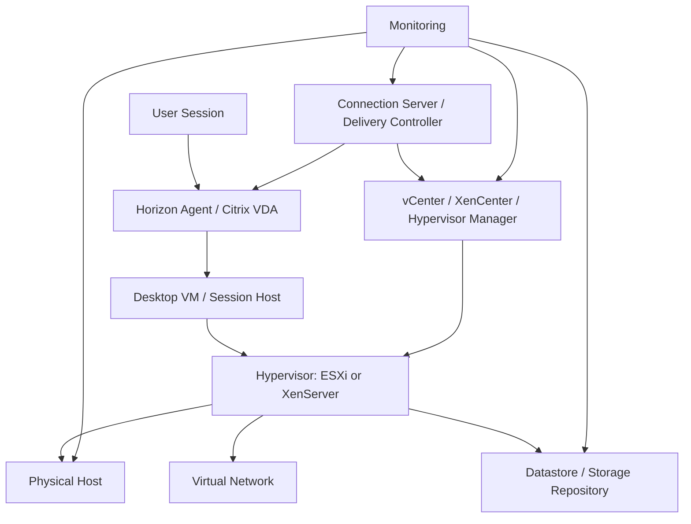
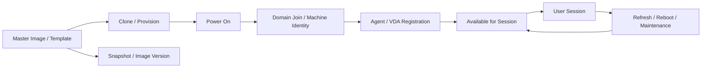

# Hypervisor and HCI Operations Guide

## 0. Document Control

| Trường | Giá trị |
|---|---|
| Thứ tự | 7 |
| Tên tài liệu | Hypervisor and HCI Operations Guide |
| Tên file | 7_Hypervisor_and_HCI_Operations_Guide.md |
| Mục đích tài liệu | Giúp engineer hiểu lớp hạ tầng chạy VDI, gồm VMware ESXi, vCenter, XenServer nếu có, HCI cluster, host, datastore, resource pool, snapshot và VM lifecycle. |
| Nguồn điều khiển | [[sources/vdi-training-idea]], [[sources/vdi-documentation-list-context]] |
| Trạng thái thông tin | Có tri thức vận hành nền; cluster mapping, version, HA/DR, datastore/storage design, owner và maintenance process thật vẫn là Need Customer Confirmation. |

### 0.1 Source Grounding

| Nhóm tri thức | Nguồn sử dụng | Mức độ tin cậy | Ghi chú |
|---|---|---|---|
| Bối cảnh Horizon on HCI và Citrix trên XenServer hoặc VMware ESXi | [[sources/vdi-training-idea]] | High | Nguồn điều khiển bối cảnh khách hàng và cách nhìn theo lớp. |
| Tên tài liệu, tên file, mục đích và phạm vi | [[sources/vdi-documentation-list-context]] | High | Source of truth cho scope tài liệu này. |
| ESXi, vCenter, VM operations, datastore, networking, snapshot, lifecycle, logs | [[sources/vmware-vsphere-8-0]] | High | Nguồn nền cho lớp VMware bên dưới Horizon hoặc Citrix. |
| vCenter appliance, DNS/NTP, ports, Enhanced Linked Mode, chuẩn bị tích hợp | [[sources/vcenter-server-installation-and-setup]] | High | Dùng để giải thích vCenter là dependency quản trị trung tâm và cần DNS/time/network ổn định. |
| XenServer host/pool, storage repository, networking, HA, licensing, update, guest OS support | [[sources/xenserver-8-4]] | High | Nguồn nền cho Citrix CVAD khi chạy trên XenServer. |

### 0.2 In Scope

- Giải thích vai trò hypervisor và HCI trong VDI quy mô lớn.
- Làm rõ VMware ESXi, vCenter, XenServer, HCI cluster, host, datastore/storage repository, resource pool, snapshot và VM lifecycle.
- Hướng dẫn cách map desktop pool/Machine Catalog/Delivery Group với cluster, host và datastore.
- Chỉ ra lỗi VDI có thể xuất phát từ hypervisor/HCI: VM power issue, host contention, datastore latency, snapshot growth, storage full, host maintenance, provisioning fail.
- Cung cấp checklist, bảng troubleshooting, scenario và knowledge check cho system engineer.

### 0.3 Out of Scope

- Không thay thế tài liệu quản trị vSphere, vCenter, XenServer hoặc HCI chuyên sâu.
- Không hướng dẫn thao tác phá hủy, migrate, delete snapshot, reboot host hoặc thay đổi cluster trên production.
- Không giả định công nghệ HCI cụ thể, số host, datastore, cluster, resource pool, license, HA/DR design hoặc owner khi chưa xác nhận.
- Không yêu cầu secret, password, token hoặc credential.

## 1. Tài liệu này giúp engineer làm được gì

VDI chạy trên hypervisor. User có thể báo "Citrix lỗi" hoặc "Horizon lỗi", nhưng nguyên nhân thật có thể là host quá tải, datastore latency cao, VM không power on, snapshot phình to, vCenter không phản hồi hoặc XenServer pool có vấn đề.

Sau khi học xong, engineer cần làm được:

1. Giải thích hypervisor/HCI nằm ở đâu trong kiến trúc VDI.
2. Phân biệt vai trò ESXi/vCenter, XenServer, HCI cluster, host, datastore, storage repository, resource pool và snapshot.
3. Hiểu VM lifecycle trong VDI: tạo, clone/provision, power on, register agent/VDA, user session, refresh/recompose/update, retire.
4. Biết khi nào lỗi user session cần kiểm tra hạ tầng bên dưới.
5. Biết evidence cần thu thập trước khi escalation sang VMware/XenServer/HCI/storage/network team.
6. Hiểu vì sao snapshot, host maintenance và storage latency có thể tạo impact hàng loạt.

## 2. Hypervisor/HCI nằm ở đâu trong VDI

Trong bối cảnh khách hàng:

- Hệ thống Horizon chạy trên HCI.
- Hệ thống Citrix CVAD có thể chạy trên XenServer hoặc VMware ESXi.
- Cả hai đều có quy mô khoảng 1500 đến hơn 2000 VDI, nên lỗi hạ tầng có thể tạo impact rộng.

Engineer cần nhớ: broker điều phối phiên, nhưng hypervisor/HCI là nơi VM thật sự chạy. Nếu broker báo máy unavailable, nguyên nhân có thể nằm ở VM power state, host, datastore, network hoặc hypervisor manager.

## 3. Thành phần chính

| Thành phần | Vai trò | Ảnh hưởng tới VDI | Dấu hiệu lỗi | Evidence cần lưu |
|---|---|---|---|---|
| ESXi host | Chạy VM desktop/session host trong môi trường VMware | CPU, memory, network, storage path của nhiều VM | Nhiều VM trên cùng host chậm, host disconnected, task fail | Host metrics, alert, VM placement, event |
| vCenter Server | Quản trị ESXi, cluster, VM, datastore, network, snapshot | Broker/Horizon/Citrix có thể dùng để quản lý lifecycle VM | Provisioning fail, VM state không cập nhật, task lỗi | vCenter task/event, connection status, timestamp |
| XenServer host | Chạy VM trong môi trường Citrix trên XenServer | Tương tự ESXi nhưng theo pool/SR/network của XenServer | VM không start, host/pool issue, SR/network issue | Host/pool state, VM event, XenServer alert |
| XenServer pool | Nhóm host XenServer quản trị chung | Placement, HA, update, storage/network dùng chung | Pool master/HA/storage/network issue | Pool status, affected hosts, SR mapping |
| HCI cluster | Tập hợp compute/storage/network tích hợp cho Horizon | Chạy nhiều desktop VM và có thể chịu boot/logon storm | Host contention, storage latency, cluster degraded | Cluster health, host metrics, datastore latency |
| Datastore / Storage Repository | Lưu VM disk, image, snapshot, replica tùy thiết kế | VM boot, logon, provisioning, performance | Datastore full, latency cao, VM stun, task chậm | Capacity, latency, IOPS, alert |
| Resource pool / Cluster resource | Gom và phân bổ CPU/memory cho workload | Capacity và fairness giữa pool/catalog | Contention, ready time cao, memory pressure | CPU/memory chart, resource pool setting |
| Snapshot | Mốc trạng thái VM/image ngắn hạn | Hỗ trợ rollback/change nhưng có rủi ro storage/performance | Snapshot growth, datastore capacity giảm | Snapshot list, age, size, change ID |
| VM lifecycle task | Clone, power on/off, reset, migrate, delete, refresh | Ảnh hưởng availability và provisioning | Task stuck/fail, VM inaccessible | Task/event, job ID, affected VM list |
| Virtual network | Port group/VLAN/vSwitch/DVS/bonding | Agent/VDA registration, display protocol, backend access | Packet loss, wrong VLAN, disconnected NIC | Network mapping, port group, errors |

## 4. VMware ESXi và vCenter trong VDI

Theo [[sources/vmware-vsphere-8-0]], vSphere cung cấp ESXi host, vCenter, datastore, networking, VM operations, snapshot và lifecycle. Trong VDI, đây là lớp chạy hàng nghìn desktop VM hoặc session host.

### 4.1 ESXi làm gì

ESXi là hypervisor chạy trực tiếp trên host vật lý. Nó cung cấp CPU, memory, storage path và network cho VM. Nếu một ESXi host có vấn đề, các VDI nằm trên host đó có thể:

- Chậm đồng loạt.
- Disconnect.
- Không power on.
- Bị restart hoặc failover tùy HA design.
- Agent/VDA unregistered nếu VM/network bị ảnh hưởng.

### 4.2 vCenter làm gì

vCenter là điểm quản trị trung tâm cho ESXi, VM, cluster, datastore, networking và task. Với VDI, vCenter thường là dependency cho:

- Horizon quản lý desktop pool hoặc VM lifecycle.
- Citrix quản lý Machine Catalog nếu chạy trên VMware.
- Clone/provisioning.
- Power operation.
- Snapshot/image operation.
- VM placement và cluster visibility.

Theo [[sources/vcenter-server-installation-and-setup]], vCenter cần DNS, NTP/time sync, storage, network và quyền truy cập đúng. Nếu vCenter hoặc path tới vCenter lỗi, broker có thể vẫn chạy nhưng không quản lý được VM lifecycle.

### 4.3 Khi nào nghi vCenter/ESXi

| Triệu chứng | Gợi ý |
|---|---|
| Provisioning hoặc clone desktop fail | vCenter task, permission, datastore, image, cluster |
| Pool/catalog báo machine unavailable nhưng broker còn sống | VM power state, vCenter visibility, host/storage |
| Nhiều desktop chậm cùng host/cluster | ESXi resource contention hoặc storage latency |
| VM không power on | Capacity, datastore, host, file lock, task error |
| Sau host maintenance, nhiều user bị ảnh hưởng | Placement, HA/DRS, maintenance process |

## 5. XenServer trong Citrix CVAD

Theo [[sources/xenserver-8-4]], XenServer tổ chức tài nguyên theo host, pool, VM, storage repository và network. Nếu Citrix CVAD của khách hàng chạy trên XenServer, engineer cần biết cách đọc lớp này.

### 5.1 Khái niệm chính

| Khái niệm | Ý nghĩa vận hành |
|---|---|
| Host | Máy vật lý chạy XenServer và VM |
| Pool | Nhóm host XenServer quản trị chung |
| VM | Desktop/session host chạy VDA |
| Storage Repository | Nơi lưu disk VM/image |
| Network | Network/VLAN/bonding cho management và VM traffic |
| HA | Cơ chế giúp VM/workload phục hồi theo thiết kế khi host lỗi |

### 5.2 Khi nào nghi XenServer

- Nhiều VDA cùng một pool unregistered.
- VM trong một pool không power on.
- Storage Repository latency/capacity có alert.
- Host/pool update hoặc maintenance vừa diễn ra.
- Network bonding/VLAN issue làm VDA không tới Controller hoặc user session rớt.
- Citrix Machine Catalog provisioning/power management lỗi trên hypervisor connection.

## 6. HCI cluster trong Horizon

HCI, hay hyper-converged infrastructure, thường gom compute, storage và virtualization trong cùng một nền tảng cluster. Trong bối cảnh này, Horizon chạy trên HCI, nên user experience phụ thuộc trực tiếp vào cluster health.

Các điểm cần hiểu:

- Một HCI host lỗi có thể ảnh hưởng nhiều desktop.
- Storage latency trong HCI có thể làm login chậm hoặc session lag.
- Rebuild/resync trong HCI có thể làm performance giảm.
- Boot storm/logon storm tạo tải lớn lên compute và storage.
- Maintenance host cần kiểm soát placement và capacity.
- Monitoring HCI phải nhìn cả compute, storage, network và cluster health.

Thông tin HCI vendor, cluster size, storage policy, fault domain, HA/DR là Unknown và cần xác nhận.

## 7. VM lifecycle trong VDI

VDI không chỉ có "VM đang bật". Một desktop/session host đi qua nhiều trạng thái vòng đời.

### 7.1 Điểm lỗi theo lifecycle

| Giai đoạn | Lỗi thường gặp | Lớp cần kiểm tra |
|---|---|---|
| Image/template | Image lỗi, tools/agent sai version | Image management, agent/VDA, OS |
| Clone/provision | Task fail, thiếu permission, datastore full | vCenter/XenServer, storage, broker integration |
| Power on | VM không start, thiếu resource, file lock | Host, datastore/SR, capacity |
| Domain join | Computer account/DNS/GPO lỗi | AD, DNS, OU, GPO |
| Agent/VDA registration | Agent service, broker list, firewall, DNS | Agent/VDA, network, identity |
| Available | Không đủ machine available | Pool/catalog, power policy, capacity |
| Session | Disconnect, black screen, slow | Network, storage, host, profile |
| Maintenance/refresh | VM stuck, user impact | Change, hypervisor task, broker state |

## 8. Datastore, storage repository và snapshot

### 8.1 Datastore/SR không chỉ là nơi chứa file

Trong VDI, datastore hoặc storage repository ảnh hưởng trực tiếp tới:

- VM boot.
- Provisioning.
- Snapshot operation.
- Login duration.
- Session responsiveness.
- Capacity khi có snapshot hoặc replica.
- Recovery sau host/storage issue.

Các metric cần chú ý:

- Capacity used/free.
- Latency.
- IOPS.
- Throughput.
- Queue hoặc congestion nếu tool có.
- Snapshot size/age.
- VM stun hoặc task latency.

### 8.2 Snapshot không phải backup dài hạn

Snapshot hữu ích như rollback point ngắn hạn trong change, image update hoặc test. Nhưng snapshot để lâu có thể:

- Tăng dung lượng datastore.
- Làm task backup/provisioning phức tạp.
- Ảnh hưởng performance tùy môi trường.
- Gây khó khăn khi rollback hoặc consolidate.

Với VDI, snapshot liên quan image/master image phải gắn với change ID, owner, thời gian giữ và rollback plan. Không xóa hoặc consolidate snapshot production nếu chưa có quy trình và approval.

## 9. Resource pool, capacity và boot/logon storm

Resource pool hoặc cluster resource quyết định CPU/memory được chia cho workload. Trong VDI, tải không đều theo ngày:

- Đầu giờ: logon storm.
- Sau maintenance: boot storm.
- Giữa ngày: application workload.
- Cuối ngày: logoff, profile write-back.

Nếu không đủ capacity hoặc placement không cân bằng, user có thể thấy:

- Desktop chậm.
- Login kéo dài.
- Black screen.
- Disconnect.
- Application lag.

Không nên chỉ nhìn "CPU trung bình cả cluster". Cần xem theo host, datastore, pool/catalog, thời điểm và nhóm user.

## 10. Host maintenance và change risk

Host maintenance trong VDI có rủi ro cao vì một host có thể chạy nhiều desktop/session host.

Trước maintenance cần biết:

- Host đang chạy bao nhiêu desktop/session host.
- Các VM đó thuộc pool/catalog/delivery group nào.
- Có user active session không.
- Cluster còn đủ capacity sau khi evacuate host không.
- HA/DRS/pool HA có thiết kế thế nào.
- Broker có maintenance mode hoặc drain session không.
- Có rollback hoặc stop condition không.

Không nên đưa host vào maintenance nếu không biết impact tới user session, pool capacity và placement.

## 11. Monitoring và evidence cần theo dõi

| Nhóm | Metric/evidence | Ý nghĩa |
|---|---|---|
| Host health | CPU, memory, hardware alert, host disconnected | Xác định host contention hoặc outage |
| VM state | Powered on/off, inaccessible, suspended, task status | Biết desktop/session host có chạy không |
| VM placement | VM nằm trên host/cluster/datastore nào | Khoanh vùng lỗi theo host/datastore |
| Datastore/SR | Capacity, latency, IOPS, throughput, alert | Xử lý login chậm, VM stun, provisioning fail |
| Snapshot | Snapshot count, age, size, owner/change ID | Kiểm soát rủi ro dung lượng và rollback |
| vCenter/XenServer tasks | Clone, power, migrate, snapshot, delete, failed tasks | Điều tra provisioning hoặc lifecycle issue |
| Network | VM NIC, port group/VLAN, packet loss, uplink errors | Xử lý unregistered, disconnect, backend issue |
| Broker correlation | Pool/catalog affected, Agent/VDA registration trend | Chứng minh lỗi hạ tầng tác động VDI |
| Maintenance/change | Change window, host maintenance, image publish | Liên hệ sự cố với recent change |

## 12. Lỗi hypervisor/HCI thường gặp và hướng chẩn đoán

| Triệu chứng | Nguyên nhân có thể | Lớp cần kiểm tra | Evidence cần thu thập | Hướng xử lý ban đầu | Khi nào escalation |
|---|---|---|---|---|---|
| Nhiều desktop trong cùng host chậm | CPU/memory contention, host hardware issue | Host/cluster | VM placement, host CPU/memory, alert | Khoanh vùng theo host, so sánh host khác | Cần VMware/XenServer/HCI owner |
| Nhiều desktop cùng datastore login chậm | Datastore/SR latency, capacity, storage path | Storage/datastore | Latency, IOPS, capacity, affected VM list | Correlate theo datastore và timeframe | Cần storage/HCI owner |
| VM không power on | Thiếu resource, datastore full, file lock, host issue | VM lifecycle/host/storage | Power task error, datastore capacity, host event | Không retry vô hạn; lấy task error | Cần hypervisor/storage owner |
| VDA/Agent unregistered hàng loạt | VM off, network port group lỗi, DNS/GPO, host/storage issue | VM/network/identity | Registration trend, VM state, port group, host event | Tìm điểm chung catalog/pool/host/datastore | Ảnh hưởng nhiều máy |
| Provisioning/clone fail | vCenter/XenServer connection, permission, image, datastore | Broker-hypervisor-storage | Task/event, image, datastore, permission error | Xác định lỗi từ broker hay hypervisor task | Cần platform/hypervisor owner |
| Sau host maintenance user disconnect | Evacuation/drain không đúng, capacity thiếu, HA event | Maintenance/cluster | Change ID, host session count, HA/DRS event | Đánh giá impact và stop condition | Incident diện rộng |
| Datastore gần đầy sau image/snapshot | Snapshot growth, clone/replica, thin provisioning | Storage/snapshot | Snapshot list, capacity trend, recent change | Không xóa snapshot tùy tiện; xác định owner | Cần storage/platform/change owner |
| vCenter không phản hồi broker | vCenter service/network/DNS/time/permission | vCenter integration | Broker error, vCenter health, DNS/time | Xác định vCenter down hay path/permission | Cần vCenter/infrastructure owner |

## 13. Operational checklist cho engineer

### Khi nghi lỗi hạ tầng

- [ ] Xác định platform: Horizon hay Citrix.
- [ ] Xác định scope: một VM, một pool/catalog, một host, một datastore, một cluster hay toàn site.
- [ ] Lấy danh sách user/machine bị ảnh hưởng.
- [ ] Map machine với host/cluster/datastore hoặc SR.
- [ ] Kiểm tra recent change: host maintenance, image publish, snapshot, storage change, network change, patch.
- [ ] Kiểm tra VM power state và task/event.
- [ ] Kiểm tra Agent/VDA registration trend.
- [ ] Kiểm tra host CPU/memory/hardware alert.
- [ ] Kiểm tra datastore/SR capacity và latency.
- [ ] Kiểm tra network port group/VLAN/uplink nếu có dấu hiệu unregistered/disconnect.

### Trước khi escalation

- [ ] Ticket ID và impact scope.
- [ ] Affected pool/catalog/delivery group.
- [ ] Affected VM list.
- [ ] Host/cluster/datastore mapping.
- [ ] Metric hoặc alert screenshot.
- [ ] Failed task/event ID hoặc timestamp.
- [ ] Recent change ID nếu có.
- [ ] So sánh máy khỏe và máy lỗi nếu có.

### Những việc không tự làm nếu chưa có quy trình

- [ ] Không xóa/consolidate snapshot production tùy tiện.
- [ ] Không reboot host production tùy tiện.
- [ ] Không migrate hàng loạt VM khi chưa đánh giá capacity.
- [ ] Không power cycle hàng loạt desktop khi chưa lưu evidence.
- [ ] Không thay đổi resource pool/cluster setting nếu chưa có approval.
- [ ] Không chỉnh network port group/VLAN/firewall nếu chưa được phê duyệt.

## 14. Tình huống học tập

### Tình huống 1: Một desktop pool Horizon chậm sau 8 giờ sáng

**Bối cảnh:** Nhiều user trong cùng desktop pool báo login lâu và desktop lag sau giờ bắt đầu làm việc.

**Câu hỏi cho học viên:**

- Đây có thể là lỗi Connection Server không?
- Cần map pool với host/datastore nào?
- Metric nào cần lấy?

**Gợi ý phân tích:** Đây có thể là logon storm hoặc storage/host contention. Cần xem pool chạy trên cluster/datastore nào và so sánh metric theo timestamp.

**Hướng xử lý đề xuất:** Lấy registration/session trend, host metrics, datastore latency, login duration và recent change.

**Evidence cần lưu:** Pool, affected VM, host/datastore mapping, latency/CPU/memory chart, timestamp.

### Tình huống 2: Citrix Machine Catalog có nhiều VDA unregistered

**Bối cảnh:** Một Machine Catalog chạy trên XenServer có 30% VDA unregistered.

**Câu hỏi cho học viên:**

- Cần kiểm tra XenServer pool hay Delivery Controller trước?
- Làm sao chứng minh lỗi thuộc hypervisor/storage/network?
- Evidence nào cần gửi khi escalation?

**Gợi ý phân tích:** Kiểm tra Controller/VDA registration song song với VM state trên XenServer. Nếu các VM lỗi cùng host/SR/network, khả năng hạ tầng cao.

**Hướng xử lý đề xuất:** Map VDA với host/SR, kiểm tra VM power, pool/host alert, SR health, network path tới Controller.

**Evidence cần lưu:** Catalog, VDA list, host/SR mapping, registration trend, XenServer event.

### Tình huống 3: Provisioning task fail sau khi datastore gần đầy

**Bối cảnh:** Tạo thêm desktop thất bại, broker báo provisioning error.

**Câu hỏi cho học viên:**

- Lỗi này nằm ở broker hay storage?
- Cần đọc task nào?
- Có nên xóa snapshot ngay không?

**Gợi ý phân tích:** Broker báo lỗi nhưng task có thể fail ở vCenter/datastore. Không xóa snapshot nếu chưa có owner/change.

**Hướng xử lý đề xuất:** Kiểm tra vCenter task/event, datastore capacity, snapshot/replica growth, image version và change ID.

**Evidence cần lưu:** Failed task, datastore capacity, snapshot list, affected pool/catalog, timestamp.

### Tình huống 4: Host maintenance làm user disconnect

**Bối cảnh:** Sau host maintenance, nhiều user bị disconnect hoặc reconnect chậm.

**Câu hỏi cho học viên:**

- Precheck maintenance thiếu gì?
- Cần kiểm tra active session và capacity ra sao?
- Khi nào phải dừng change?

**Gợi ý phân tích:** Maintenance cần drain/evacuate theo quy trình và đảm bảo cluster còn capacity. Nếu user active bị impact, cần stop condition và incident handling.

**Hướng xử lý đề xuất:** Kiểm tra change record, host VM/session list trước maintenance, HA/DRS/pool event, affected user timeline.

**Evidence cần lưu:** Change ID, host, VM list, session count, event timeline, monitoring.

## 15. Bài tập tư duy

### Bài tập 1: Map resource với hạ tầng

Tạo bảng cho một pool/catalog:

- Pool/Catalog name.
- Broker platform.
- Hypervisor type.
- Cluster/pool.
- Host list.
- Datastore/SR.
- Image/template.
- Snapshot.
- Owner.
- Monitoring dashboard.
- Unknown cần hỏi.

### Bài tập 2: Phân loại lỗi

| Triệu chứng | Lớp ưu tiên |
|---|---|
| VM không power on | Host/storage/resource/task |
| Nhiều VM cùng host chậm | Host contention/hardware |
| Nhiều VM cùng datastore login chậm | Storage latency/capacity |
| Provisioning fail | Broker-hypervisor-image-storage |
| VDA/Agent unregistered cùng catalog | VM state/network/DNS/hypervisor |

### Bài tập 3: Snapshot risk review

Đọc một danh sách snapshot giả định và xác định:

- Snapshot nào liên quan change.
- Snapshot nào quá cũ.
- Snapshot nào có size tăng bất thường.
- Cần hỏi owner nào trước khi xử lý.

### Bài tập 4: Host maintenance checklist

Thiết kế checklist trước khi đưa host vào maintenance, gồm active session, VM placement, capacity, broker drain/maintenance mode, rollback và communication.

## 16. Knowledge Check

### Câu 1

**Hypervisor/HCI ảnh hưởng gì tới VDI?**

**Đáp án:** Đây là lớp chạy VM desktop/session host, cung cấp CPU, memory, storage và network. Lỗi ở lớp này có thể làm VM chậm, không power on, Agent/VDA unregistered hoặc user disconnect.

### Câu 2

**vCenter có vai trò gì trong VDI trên VMware?**

**Đáp án:** vCenter quản lý ESXi, VM, cluster, datastore, networking, snapshot và lifecycle task; broker có thể phụ thuộc vCenter để quản lý desktop VM.

### Câu 3

**XenServer tổ chức tài nguyên chính theo những nhóm nào?**

**Đáp án:** Host, pool, VM, storage repository và network.

### Câu 4

**Snapshot có phải backup dài hạn không?**

**Đáp án:** Không. Snapshot là rollback point ngắn hạn và có rủi ro capacity/performance nếu để lâu hoặc quản lý sai.

### Câu 5

**Khi nhiều desktop cùng một datastore chậm, cần lấy evidence gì?**

**Đáp án:** Datastore/SR latency, capacity, IOPS, affected VM list, timestamp, pool/catalog mapping và recent change.

### Câu 6

**VM không power on có thể do gì?**

**Đáp án:** Thiếu resource, datastore full, host issue, file lock, task error, permission hoặc hypervisor/storage problem.

### Câu 7

**Host maintenance cần kiểm tra gì trước?**

**Đáp án:** Active sessions, VM placement, cluster capacity, HA/DRS/pool HA, broker maintenance/drain process, change approval, rollback/stop condition.

### Câu 8

**Tại sao cần map pool/catalog với host/datastore?**

**Đáp án:** Để khoanh vùng impact và chứng minh lỗi theo điểm chung hạ tầng, thay vì xử lý từng VM rời rạc.

### Câu 9

**Provisioning fail từ broker có chắc broker là root cause không?**

**Đáp án:** Không. Lỗi có thể nằm ở vCenter/XenServer task, permission, image, datastore hoặc network.

### Câu 10

**Thông tin nào cần xác nhận với khách hàng trước khi viết SOP hạ tầng?**

**Đáp án:** Hypervisor version, HCI vendor, cluster/pool mapping, datastore/SR design, HA/DRS/HA policy, owner, monitoring, maintenance process, snapshot policy và escalation path.

## 17. Hiểu nhầm thường gặp

| Hiểu nhầm | Vì sao sai | Cách nghĩ đúng |
|---|---|---|
| "VDI chậm là do broker" | Host/storage/network contention cũng tạo triệu chứng chậm. | Correlate broker với host/datastore metrics. |
| "VM powered on là hạ tầng ổn" | VM vẫn có thể bị storage latency, network lỗi hoặc host contention. | Kiểm tra performance và path, không chỉ power state. |
| "Snapshot an toàn để giữ lâu" | Snapshot có thể tăng dung lượng và rủi ro vận hành. | Quản lý snapshot theo change/owner/time limit. |
| "Một VM lỗi thì cứ reboot" | Nếu nhiều VM cùng host/datastore lỗi, reboot từng VM không giải quyết root cause. | Tìm điểm chung hạ tầng. |
| "Host maintenance là việc infra, VDI không cần biết" | Host maintenance có thể disconnect user và giảm pool capacity. | VDI engineer cần biết impact và evidence. |
| "Provisioning fail là lỗi Citrix/Horizon" | Broker chỉ báo lỗi; task có thể fail ở hypervisor/storage. | Đọc task/event ở cả broker và hypervisor. |

## 18. Need Customer Confirmation

| Nhóm | Câu hỏi cần xác nhận | Vì sao cần |
|---|---|---|
| Hypervisor | Horizon/Citrix dùng ESXi, XenServer hay cả hai ở khu vực nào? | Xác định console, runbook và owner. |
| Version | ESXi, vCenter, XenServer, HCI platform đang ở version nào? | Kiểm tra compatibility và known issues. |
| HCI | Horizon dùng HCI vendor nào, cluster size, fault domain, storage policy? | Hiểu resilience và capacity. |
| Mapping | Pool/catalog/delivery group map với cluster/host/datastore/SR nào? | Khoanh vùng incident theo hạ tầng. |
| vCenter | Có một hay nhiều vCenter, Enhanced Linked Mode có dùng không? | Hiểu phạm vi quản trị và impact. |
| XenServer | Pool master, pool design, HA và SR mapping ra sao? | Xử lý host/pool/SR issue. |
| Storage | Datastore/SR capacity, latency baseline, alert threshold là gì? | Xử lý performance và capacity. |
| Resource | Resource pool, DRS/HA hoặc placement policy ra sao? | Xử lý contention và maintenance. |
| Snapshot | Snapshot policy, retention, owner, approval process là gì? | Tránh rủi ro capacity và rollback sai. |
| VM lifecycle | Ai được power, reset, migrate, snapshot, delete VM? | RBAC và change control. |
| Maintenance | Host maintenance process, drain session, communication và rollback thế nào? | Giảm user impact. |
| Monitoring | Dashboard nào theo dõi host, VM, datastore, SR, network? | Evidence và health check. |
| Ownership | VDI team hay infra team sở hữu từng lớp nào? | Escalation đúng nhóm. |
| SLA | SLA cho host/storage/hypervisor incident là gì? | Phân loại priority. |
| Escalation | Khi host/datastore/network lỗi thì gọi ai, cần evidence gì? | Rút ngắn thời gian xử lý. |

## 19. Related Wiki Links

### Source pages

- [[sources/vdi-training-idea]]
- [[sources/vdi-documentation-list-context]]
- [[sources/vmware-vsphere-8-0]]
- [[sources/vcenter-server-installation-and-setup]]
- [[sources/xenserver-8-4]]

### Concept pages

- [[concepts/vmware-vsphere]]
- [[concepts/esxi]]
- [[concepts/vcenter-server]]
- [[concepts/vcenter-server-appliance]]
- [[concepts/xenserver]]
- [[concepts/hypervisor-pool]]
- [[concepts/virtual-machine]]
- [[concepts/datastore]]
- [[concepts/storage-repository]]
- [[concepts/snapshot]]
- [[concepts/virtual-networking]]
- [[concepts/high-availability]]
- [[concepts/lifecycle-management]]
- [[concepts/monitoring-and-logs]]

### Topic pages nên đọc tiếp

- [[topics/2_Customer_VDI_Landscape_Overview]]: hiểu hệ thống nào dùng hypervisor nào.
- [[topics/3_Omnissa_Horizon_Architecture_Overview]]: hiểu Horizon on HCI.
- [[topics/4_Citrix_CVAD_Architecture_Overview]]: hiểu Citrix trên XenServer hoặc ESXi.
- [[topics/8_Storage_Operations_for_VDI]]: đi sâu datastore, latency, IOPS, capacity.
- [[topics/9_Network_Operations_for_VDI]]: đi sâu network bên dưới VM và session.
- [[topics/19_VDI_Performance_and_Capacity_Guide]]: phân tích bottleneck và capacity trend.
- [[topics/20_VDI_Change_Management_Guide]]: kiểm soát host maintenance, snapshot và image-related changes.

## 20. Summary for Learners

Hypervisor và HCI là lớp chạy workload VDI thật sự. Horizon hoặc Citrix có thể là nơi user thấy lỗi, nhưng root cause có thể nằm ở ESXi, vCenter, XenServer, HCI cluster, host, datastore, storage repository, resource pool, snapshot hoặc VM lifecycle task.

Điều engineer cần nhớ:

- Luôn map pool/catalog với host, cluster và datastore/SR.
- Đừng chỉ nhìn VM power state; phải xem host, storage, network và task/event.
- Snapshot không phải backup dài hạn.
- Host maintenance phải kiểm soát active session, capacity và rollback.
- Provisioning fail có thể là lỗi broker, image, permission, hypervisor hoặc storage.
- Nhiều VM cùng host/datastore lỗi là dấu hiệu hạ tầng, không nên xử lý từng VM rời rạc.
- Trước escalation cần có VM list, host/datastore mapping, metric, event, timestamp và recent change.

Thứ tự kiểm tra khuyến nghị: xác định platform, xác định scope, map affected machines với host/datastore, kiểm tra recent change, kiểm tra VM lifecycle task, kiểm tra host/resource, kiểm tra storage latency/capacity, kiểm tra network path, lưu evidence và escalation đúng owner.

